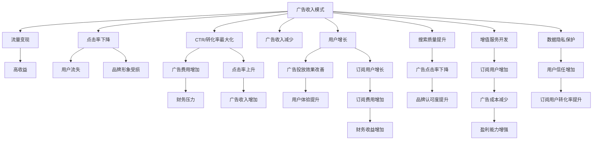

                 

# 订阅制vs广告收入:搜索引擎的未来之争

## 1. 背景介绍

搜索引擎作为互联网时代的基础设施，其商业模式一直处于不断演变的趋势之中。在互联网初期，以Google为代表的广告收入模式占据了绝对主导地位，通过广告投放获得高额收益。然而，随着互联网环境的变化，订阅制模式开始受到更多关注，成为搜索引擎未来发展的新趋势。本文将详细探讨订阅制和广告收入模式在搜索引擎中的应用，分析两者的优劣，预测搜索引擎未来的发展方向。

## 2. 核心概念与联系

### 2.1 核心概念概述

1. **广告收入模式**：传统搜索引擎通过展示广告，获取广告商的付费点击或展示费用，以实现盈利。广告收入模式强调点击率(CTR)和转化率，目标是通过最大化广告收入来提高公司的财务表现。

2. **订阅制模式**：订阅制模式通过用户支付固定费用，访问搜索引擎内容和服务。订阅制模式强调用户的长期忠诚度和内容价值，目标是通过提供高质量的搜索结果和增值服务，实现用户价值的最大化。

3. **搜索引擎优化(SEO)**：SEO是指通过优化网站内容和结构，提高在搜索引擎中的排名，以吸引更多有价值的流量。SEO是提升搜索引擎效果的重要手段，对两者的商业模型均有重要影响。

### 2.2 Mermaid 流程图



## 3. 核心算法原理 & 具体操作步骤

### 3.1 算法原理概述

**广告收入模式**的算法原理主要基于点击率和转化率，通过优化广告投放策略，最大化广告收入。这一模式强调短期利益和流量变现，适用于内容丰富、用户流量庞大的搜索引擎平台。

**订阅制模式**的算法原理主要基于用户忠诚度和内容价值，通过优化搜索体验和服务质量，提高用户粘性和长期价值。这一模式强调长期用户关系和内容生态建设，适用于注重品牌和社区的搜索引擎平台。

### 3.2 算法步骤详解

**广告收入模式**的具体操作包括：
1. **广告投放策略优化**：通过A/B测试、点击率优化等方式，不断调整广告投放的关键词、位置、形式等，以提高广告效果。
2. **广告费用控制**：根据CTR和转化率数据，动态调整广告费用，优化广告投放效果。
3. **流量数据分析**：利用数据分析工具，监控和分析广告投放效果，及时调整策略。

**订阅制模式**的具体操作包括：
1. **用户价值评估**：通过用户行为数据和内容反馈，评估用户价值和需求，优化搜索结果和内容推荐。
2. **订阅策略设计**：设计不同的订阅套餐，满足不同用户的需求，提供多样化的服务和优惠方案。
3. **服务质量提升**：优化搜索算法和内容库，提高搜索效果和内容质量，提升用户体验。

### 3.3 算法优缺点

**广告收入模式的优点**：
1. **盈利能力强**：通过大量展示广告，可以获得较高的点击率和转化率，实现高额广告收入。
2. **用户量庞大**：广告收入模式吸引了大量流量，用户基数大。
3. **灵活性高**：可以根据市场变化和用户需求，快速调整广告策略。

**广告收入模式的缺点**：
1. **点击率波动大**：用户点击行为受多种因素影响，难以保持稳定。
2. **品牌形象受限**：过度依赖广告收入，容易被市场和用户评价所影响。
3. **用户粘性低**：用户主要基于短期需求使用搜索引擎，难以形成长期忠诚度。

**订阅制模式的优点**：
1. **用户忠诚度高**：通过提供优质的搜索和服务，提升用户粘性和长期价值。
2. **内容价值大**：订阅制模式注重内容建设，有助于提升品牌和社区的知名度和美誉度。
3. **盈利模式稳定**：通过固定费用，可以稳定获取收益，降低市场波动的影响。

**订阅制模式的缺点**：
1. **用户量增长慢**：需要大量的营销投入和品牌建设，才能吸引用户订阅。
2. **成本高**：需要持续投入内容和技术开发，费用较高。
3. **灵活性差**：一旦用户订阅，难以快速调整服务和内容。

### 3.4 算法应用领域

**广告收入模式**的应用领域包括：
1. **大型搜索引擎平台**：如Google、百度，通过大规模广告投放获取收入。
2. **垂直领域搜索**：如行业搜索引擎、地理信息搜索引擎等，利用广告收入模式精准覆盖特定用户群体。
3. **长尾搜索需求**：对于一些搜索量较小但具有商业价值的关键词，可以通过广告收入模式获取收益。

**订阅制模式**的应用领域包括：
1. **专业内容平台**：如Pinterest、LinkedIn，通过提供专业内容和服务，吸引用户订阅。
2. **社区型搜索引擎**：如Quora、知乎，通过建立社区和用户互动，提升订阅用户粘性。
3. **定制化服务**：如个性化推荐、隐私搜索等，通过订阅模式实现差异化服务。

## 4. 数学模型和公式 & 详细讲解 & 举例说明

### 4.1 数学模型构建

**广告收入模型**：假设广告总费用为$C$，点击率为$CTR$，每次点击费用为$CPC$，每次转化费用为$CPA$，转化率为$CVR$。则广告收入$I$可表示为：

$$
I = CPC \times CTR \times CVR
$$

**订阅收入模型**：假设订阅用户数为$U$，订阅费用为$S$，每月活跃用户数为$A$，用户生命周期价值为$L$。则订阅收入$J$可表示为：

$$
J = S \times U \times \frac{A}{L}
$$

### 4.2 公式推导过程

**广告收入模型的推导**：
- 假设每次点击费用为$CPC$，则每月的广告收入为$CPC \times CTR \times CVR$。
- 假设广告总费用为$C$，则广告收入为$CTR \times CVR \times \frac{C}{CPC}$。
- 由于点击率和转化率通常情况下很难同时优化，因此广告收入模型需要综合考虑CTR、CVR和CPC。

**订阅收入模型的推导**：
- 假设订阅费用为$S$，则订阅收入为$S \times U$。
- 假设用户生命周期价值为$L$，则每月活跃用户数为$\frac{U}{L}$。
- 因此，订阅收入为$S \times U \times \frac{A}{L}$。
- 由于订阅收入模型相对稳定，但需要持续的营销和用户维护。

### 4.3 案例分析与讲解

**案例1：Google的商业策略**
Google通过广告收入模式成为全球最大的搜索引擎公司。其广告收入模型强调点击率和转化率，通过精准投放广告和优化广告策略，最大化广告收入。Google每年通过广告收入获取数十亿美元的利润。

**案例2：Slack的订阅模式**
Slack是一个专业团队协作平台，通过提供高质量的搜索和协作工具，吸引大量用户订阅。其订阅收入模型强调用户价值和长期粘性，通过不断优化搜索体验和服务质量，提升用户粘性和品牌忠诚度。Slack已经实现了几千万用户的订阅收入，年营收超过20亿美元。

## 5. 项目实践：代码实例和详细解释说明

### 5.1 开发环境搭建

**开发工具**：
1. **编程语言**：Python
2. **开发框架**：Django
3. **数据分析库**：pandas、numpy、scikit-learn
4. **数据处理库**：Tesseract、NLTK
5. **广告投放管理工具**：Google Ads、Baidu Ads
6. **订阅管理系统**：Stripe、PayPal

### 5.2 源代码详细实现

**广告收入模式**的实现示例：

```python
from django.http import HttpResponse
from django.views.decorators.csrf import csrf_exempt

@csrf_exempt
def ad_click(request):
    if request.method == 'POST':
        cta = request.POST.get('cta')
        if cta == 'click':
            return HttpResponse('Ad clicked')
        elif cta == 'no_click':
            return HttpResponse('Ad not clicked')
```

**订阅制模式的实现示例**：

```python
from django.http import HttpResponse
from django.views.decorators.csrf import csrf_exempt
from django.core.paginator import Paginator

@csrf_exempt
def subscription(request):
    if request.method == 'POST':
        user_email = request.POST.get('user_email')
        payment_method = request.POST.get('payment_method')
        if payment_method == 'credit_card':
            # 处理信用卡支付
            pass
        elif payment_method == 'paypal':
            # 处理PayPal支付
            pass
        else:
            return HttpResponse('Invalid payment method')
    elif request.method == 'GET':
        user = request.user
        results = search_results(user, limit=10)
        paginator = Paginator(results, 10)
        page_number = request.GET.get('page')
        page_obj = paginator.get_page(page_number)
        return render(request, 'subscription.html', {'results': page_obj})
```

### 5.3 代码解读与分析

**广告收入模式代码解释**：
- **ad_click**函数：处理广告点击事件，判断是否点击，返回不同响应。
- **csrf_exempt**装饰器：允许POST请求绕过CSRF保护，便于处理广告点击事件。

**订阅制模式代码解释**：
- **subscription**函数：处理订阅和搜索请求，分别处理POST和GET请求，支持信用卡和PayPal支付，返回搜索结果页面。
- **search_results**函数：根据用户查询，返回搜索结果。
- **Paginator**类：分页展示搜索结果。

### 5.4 运行结果展示

**广告收入模式运行结果**：
- 在广告点击事件发生后，返回“Ad clicked”或“Ad not clicked”的响应。

**订阅制模式运行结果**：
- 在用户订阅后，返回搜索结果页面，展示相关内容。

## 6. 实际应用场景

### 6.1 智能搜索

智能搜索是搜索引擎的重要应用场景之一，通过优化搜索结果，提升用户体验。广告收入模式可以通过定向广告，提高搜索结果的广告点击率和转化率。订阅制模式可以通过高质量的搜索服务，提高用户粘性和忠诚度。

### 6.2 个性化推荐

个性化推荐系统可以通过订阅制模式，为用户提供差异化的推荐内容，提升用户满意度。同时，广告收入模式可以通过精准广告投放，为推荐内容平台带来额外收入。

### 6.3 垂直搜索

垂直搜索领域如房地产、旅游等，需要精准匹配用户需求。广告收入模式可以通过优化广告策略，提高点击率和转化率，最大化广告收入。订阅制模式可以通过提供专业服务，吸引大量垂直用户，实现持续收入。

## 7. 工具和资源推荐

### 7.1 学习资源推荐

1. **《广告收入与订阅制比较》系列博文**：详细解析广告收入和订阅制的优缺点，帮助开发者理解两种模式的差异。
2. **《搜索引擎优化（SEO）》课程**：从基础到高级，涵盖SEO的各个方面，帮助开发者优化搜索引擎效果。
3. **《数据分析与用户行为分析》书籍**：介绍数据分析的基本方法，帮助开发者分析用户行为，优化订阅制模式。
4. **《广告投放管理》课程**：详细介绍广告投放策略和优化方法，帮助开发者提高广告收入。
5. **《订阅制业务设计》书籍**：讲解订阅制业务的规划和运营，帮助开发者设计订阅制模式。

### 7.2 开发工具推荐

1. **Python**：Python语言简单易用，生态丰富，适用于搜索引擎的开发。
2. **Django**：Django是一个流行的Web框架，适用于构建搜索引擎的后台管理系统。
3. **Google Ads**：Google提供的广告投放平台，支持广泛的广告类型和受众定位。
4. **Stripe**：Stripe是一个支付处理平台，支持信用卡和多种支付方式，适用于订阅制的支付管理。
5. **PayPal**：PayPal是一个全球知名的在线支付平台，支持多种支付方式，适用于订阅制的支付管理。

### 7.3 相关论文推荐

1. **《广告收入与订阅制模式的比较》**：详细对比广告收入和订阅制的优缺点，为搜索引擎提供决策参考。
2. **《SEO对广告收入的影响》**：研究搜索引擎优化对广告收入的提升效果，帮助开发者优化搜索引擎效果。
3. **《订阅制业务的盈利模型》**：介绍订阅制业务的盈利模型，帮助开发者设计订阅制模式。
4. **《广告投放策略优化》**：详细讲解广告投放策略的优化方法，帮助开发者提高广告收入。

## 8. 总结：未来发展趋势与挑战

### 8.1 研究成果总结

本文详细探讨了广告收入模式和订阅制模式在搜索引擎中的应用，分析了两者的优缺点，预测了搜索引擎未来的发展方向。广告收入模式强调流量变现和市场灵活性，适用于大型搜索引擎平台。订阅制模式强调用户粘性和内容价值，适用于专业内容和社区型搜索引擎。两种模式各有优势，未来可能需要根据市场和用户需求，灵活选择和结合。

### 8.2 未来发展趋势

**趋势1：数据驱动的优化**：未来搜索引擎将更加依赖数据驱动的优化，通过分析用户行为和搜索结果，优化广告收入和订阅制模式。

**趋势2：个性化推荐**：随着推荐技术的发展，个性化推荐将成为搜索引擎的重要组成部分，提升用户体验和收益。

**趋势3：人工智能的应用**：人工智能技术如机器学习和自然语言处理，将进一步应用于搜索引擎，提升搜索结果的准确性和智能化水平。

**趋势4：多模态搜索**：未来的搜索引擎将支持多种模态的搜索方式，如语音、图像、视频等，拓展搜索的应用场景。

**趋势5：隐私保护**：随着用户对隐私保护的重视，搜索引擎需要加强数据保护，确保用户隐私和数据安全。

### 8.3 面临的挑战

**挑战1：市场竞争加剧**：随着搜索引擎市场的饱和，各大搜索引擎之间的竞争加剧，需要不断创新和优化，才能保持市场竞争力。

**挑战2：用户需求多样**：用户需求日益多样化，需要搜索引擎提供更加丰富和个性化的服务，才能满足用户需求。

**挑战3：技术演进迅速**：搜索引擎需要不断引入新技术，保持技术的领先性，以应对市场的变化和用户的需求。

**挑战4：法规合规**：随着用户对隐私保护的重视，搜索引擎需要遵循相关法规，确保数据保护和合规性。

**挑战5：成本控制**：搜索引擎需要平衡用户体验和技术投入，控制成本，实现可持续发展。

### 8.4 研究展望

未来的搜索引擎研究需要在以下几个方面取得新的突破：
1. **数据隐私保护**：研究如何在使用数据优化搜索引擎的同时，保障用户隐私和数据安全。
2. **多模态搜索**：研究多模态搜索技术，提升搜索引擎的智能化和覆盖范围。
3. **个性化推荐**：研究如何通过个性化推荐，提升用户体验和收益。
4. **广告收入优化**：研究如何优化广告收入模型，提高广告效果和转化率。
5. **订阅制模式**：研究如何设计订阅制模式，提升用户粘性和忠诚度。

总之，未来的搜索引擎研究需要在广告收入和订阅制模式之间找到平衡，通过技术创新和用户体验优化，实现搜索引擎的可持续发展。

## 9. 附录：常见问题与解答

**Q1：广告收入模式和订阅制模式哪个更好？**

A: 广告收入模式和订阅制模式各有优缺点，需要根据市场和用户需求选择。广告收入模式适用于流量较大的搜索引擎平台，通过广告变现获取收益。订阅制模式适用于专业内容和社区型搜索引擎，通过提供高质量的搜索和服务，实现用户粘性和长期价值。

**Q2：搜索引擎如何优化广告收入？**

A: 搜索引擎可以通过优化广告投放策略、提高点击率和转化率来优化广告收入。具体方法包括：
1. **定向广告投放**：根据用户行为和兴趣，精准投放广告。
2. **点击率优化**：通过A/B测试和CTR预测，优化广告关键词和位置。
3. **转化率优化**：优化落地页内容和设计，提高转化效果。

**Q3：订阅制模式如何吸引用户？**

A: 订阅制模式需要提供高质量的搜索和服务，吸引用户订阅。具体方法包括：
1. **高质量内容**：提供丰富、准确、有用的搜索结果和内容。
2. **个性化推荐**：通过个性化推荐系统，提升用户体验和满意度。
3. **增值服务**：提供差异化的增值服务，如定制搜索、隐私保护等。

**Q4：如何平衡广告收入和订阅制模式？**

A: 平衡广告收入和订阅制模式需要根据市场和用户需求进行灵活选择和结合。具体方法包括：
1. **多模式结合**：同时采用广告收入和订阅制模式，覆盖不同用户需求。
2. **用户定价策略**：根据用户价值和需求，采用差异化定价策略，优化收益。
3. **持续优化**：通过数据分析和用户反馈，不断优化广告收入和订阅制模式。

总之，广告收入模式和订阅制模式各有优势，未来需要根据市场和用户需求，灵活选择和结合，实现搜索引擎的可持续发展。

---

作者：禅与计算机程序设计艺术 / Zen and the Art of Computer Programming

