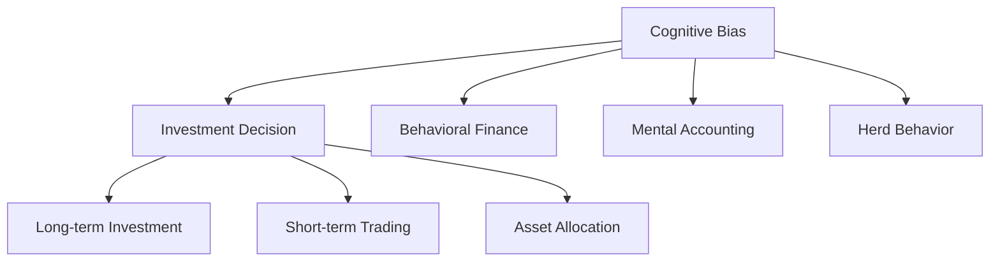

                 

# 认知偏差与投资决策的影响

> 关键词：认知偏差,投资决策,行为金融学,心理账户,羊群效应

## 1. 背景介绍

### 1.1 问题由来
投资决策是人类行为的重要组成部分，但这一决策过程却深受认知偏差的干扰。认知偏差(Cognitive Bias)是指人们在不完全信息、不确定性环境下，对事实的感知、记忆、推断等过程中产生的系统性偏差。这些偏差往往无法通过简单的统计方法予以纠正，因为它们源自于心理机制而非数据。在金融投资领域，认知偏差能显著影响投资者的行为和决策，甚至造成严重的财务损失。

### 1.2 问题核心关键点
认知偏差与投资决策的核心问题在于，人类的心理机制和行为倾向如何影响金融资产的买卖行为。这一过程涉及多个层次的认知偏差，如过度自信、损失厌恶、过度反应、锚定效应等。而本文将重点讨论这些认知偏差在投资决策中的具体表现和作用机制，并提出相应的解决策略。

## 2. 核心概念与联系

### 2.1 核心概念概述

为更好地理解认知偏差在投资决策中的影响，本节将介绍几个密切相关的核心概念：

- 认知偏差(Cognitive Bias)：指人们在不完全信息、不确定性环境下，对事实的感知、记忆、推断等过程中产生的系统性偏差。常见的认知偏差包括过度自信、损失厌恶、锚定效应、过度反应等。
- 投资决策(Investment Decision)：指在特定风险偏好下，投资主体为实现财务目标，对金融资产进行买卖选择的过程。常见的投资决策类型包括长期投资、短期交易、资产配置等。
- 行为金融学(Behavioral Finance)：研究金融市场参与者行为的心理因素、认知偏差及其对资产价格的影响，是认知偏差与投资决策研究的重要理论基础。
- 心理账户(Mental Accounting)：指投资者在心理上将资金划分为不同用途的子账户，这些子账户的划分和权重会影响决策。如将资金划分为“必须储蓄”、“风险投资”等类别。
- 羊群效应(Herd Behavior)：指投资者在不确定性情况下，模仿他人的投资行为，跟随市场趋势而产生的一致性投资行为。

这些核心概念之间的逻辑关系可以通过以下Mermaid流程图来展示：



这个流程图展示了这个系统中的关键概念及其关系：

1. 认知偏差影响投资决策，而投资决策行为又与行为金融学密切相关。
2. 心理账户的划分进一步影响投资决策的权重和方向。
3. 羊群效应则是投资决策行为的一种特殊表现。

## 3. 核心算法原理 & 具体操作步骤
### 3.1 算法原理概述

认知偏差与投资决策的原理主要基于行为金融学理论。行为金融学认为，投资者的行为和决策受心理机制的影响，这些心理机制往往会产生各种认知偏差，进而影响资产的定价和市场表现。

在理论上，我们可以将投资决策过程建模为一个多阶段决策问题。假设有多个可能的投资选择，每个选择都有一个明确的概率分布，并且每个阶段都有认知偏差的影响。我们可以使用期望效用理论来量化这一过程，从而获得最优化决策的结果。

在实践中，使用计算机模拟和机器学习等技术，可以在大规模数据集上模拟和分析认知偏差对投资决策的影响，并提出相应的优化策略。

### 3.2 算法步骤详解

基于行为金融学理论，我们提出的认知偏差与投资决策算法步骤如下：

**Step 1: 数据收集与预处理**
- 收集历史市场数据、投资者行为数据等，建立数据库。
- 通过情感分析、文本挖掘等技术，提取投资者的情绪和认知偏差信息。
- 将数据进行归一化和标准化处理，以便于后续建模分析。

**Step 2: 认知偏差识别**
- 使用心理学模型和机器学习算法，识别出投资者的主要认知偏差。
- 根据不同类型认知偏差，提取相应的特征。
- 将特征与市场表现数据进行关联分析，建立认知偏差与投资决策的关系模型。

**Step 3: 投资决策建模**
- 基于行为金融学理论，构建投资决策的期望效用模型。
- 将认知偏差特征作为模型输入，计算每个投资选择的最优效用值。
- 使用蒙特卡罗仿真或机器学习方法，预测不同情景下的投资回报。

**Step 4: 优化策略设计**
- 根据模型输出，设计针对认知偏差的投资策略。
- 采用正则化技术，限制过度自信和损失厌恶的行为。
- 引入动态调整机制，及时纠正锚定效应和过度反应。
- 通过羊群效应分析，提出逆向操作策略，避免跟随错误的市场趋势。

**Step 5: 策略实施与评估**
- 在实盘测试中应用设计好的投资策略，评估其效果。
- 定期更新模型和策略，适应市场变化和新出现的认知偏差。
- 持续收集和分析投资者行为数据，提升模型的预测准确性和鲁棒性。

### 3.3 算法优缺点

认知偏差与投资决策的算法具有以下优点：
1. 基于行为金融学理论，从心理机制角度深入理解投资决策。
2. 使用机器学习算法，能够处理大规模数据，揭示认知偏差对投资行为的影响。
3. 能够设计针对性的优化策略，有效纠正认知偏差，提升投资决策质量。
4. 通过蒙特卡罗仿真等技术，能够模拟不同情景下的投资回报，进行风险评估。

同时，该算法也存在一些局限性：
1. 模型复杂度高。认知偏差的识别和分析需要大量的心理学和经济学知识，建模过程较为复杂。
2. 数据需求量大。需要收集历史市场数据、行为数据、情绪数据等多种类型的数据，数据获取成本较高。
3. 预测准确性有限。认知偏差的影响具有不确定性，模型预测难以完全准确。
4. 应用门槛较高。需要具备较强的数据处理和建模能力，一般适用于专业投资者或机构。
5. 风险调整效果有限。认知偏差的纠正需要投资者的主动配合，效果受个体差异影响较大。

尽管存在这些局限性，但该算法在理解人类心理机制对投资决策的影响方面具有独特优势，为风险管理提供了新的视角。

### 3.4 算法应用领域

认知偏差与投资决策的算法在金融投资领域有着广泛的应用前景，具体包括：

- 资产配置：通过识别和纠正过度自信等认知偏差，优化资产配置策略，降低风险，提高收益。
- 风险管理：针对损失厌恶、羊群效应等偏差，设计风险管理策略，提升投资组合的稳健性。
- 市场分析：使用羊群效应分析，揭示市场泡沫和过热现象，进行逆向操作，获取超额收益。
- 投资者行为研究：分析不同类型投资者在认知偏差方面的差异，提出针对性的教育与培训方案。
- 算法交易：通过预测不同投资者在认知偏差影响下的行为变化，进行算法交易，获取交易优势。

这些应用领域展示了认知偏差与投资决策算法的广泛适用性，未来将在金融领域中发挥越来越重要的作用。

## 4. 数学模型和公式 & 详细讲解 & 举例说明
### 4.1 数学模型构建

认知偏差与投资决策的数学模型主要基于期望效用理论和行为金融学理论构建。假设投资者面临两种投资选择，分别为 A 和 B，每种选择有概率 p 和 1-p 的概率实现收益 rA 和 rB。期望效用函数为：

$$
EU = p \cdot U(rA) + (1-p) \cdot U(rB)
$$

其中，U(x) 为效用函数，x 为收益水平。在行为金融学中，效用函数通常采用幂函数或对数函数表示。

### 4.2 公式推导过程

以过度自信偏差为例，我们假设过度自信的投资者会高估投资成功的概率，即实际概率为 p，但投资者认为的概率为 $p'$，其中 $p' > p$。因此，投资者会选择一个“过于乐观”的投资策略，导致实际收益与预期收益存在偏差。设实际收益为 R，则期望收益为：

$$
ER = p \cdot p' \cdot rA + (1-p) \cdot (1-p') \cdot rB
$$

则修正后的期望效用为：

$$
EU' = p \cdot U(rA) + (1-p) \cdot U(rB) - p \cdot (p' - p) \cdot R
$$

### 4.3 案例分析与讲解

假设某投资者面临两种选择，选择A的概率为 0.6，收益为 10%；选择B的概率为 0.4，收益为 5%。假设其过度自信的程度为 20%，即实际概率为 0.6，但认为自己成功的概率为 0.72。

使用上述公式，可以计算出修正后的期望效用为：

$$
EU' = 0.6 \cdot U(0.1) + 0.4 \cdot U(0.05) - 0.6 \cdot (0.72 - 0.6) \cdot R
$$

其中 U(x) 为对数效用函数。设 R=10%，则：

$$
EU' = 0.6 \cdot \ln(1.1) + 0.4 \cdot \ln(1.05) - 0.6 \cdot 0.12 \cdot 0.1
$$

$$
EU' = 0.52
$$

因此，修正后的期望效用为 0.52，投资者在过度自信的影响下，可能选择 A 获得 10% 的收益，但实际上其期望收益为 4.5%，低于其修正后的期望效用。

## 5. 项目实践：代码实例和详细解释说明
### 5.1 开发环境搭建

在进行投资决策认知偏差算法实践前，我们需要准备好开发环境。以下是使用Python进行数据科学开发的环境配置流程：

1. 安装Anaconda：从官网下载并安装Anaconda，用于创建独立的Python环境。

2. 创建并激活虚拟环境：
```bash
conda create -n finance-env python=3.9 
conda activate finance-env
```

3. 安装相关库：
```bash
conda install pandas numpy scikit-learn scipy statsmodels
```

4. 安装Jupyter Notebook：
```bash
conda install jupyter notebook
```

5. 安装数据可视化库：
```bash
conda install matplotlib seaborn
```

完成上述步骤后，即可在`finance-env`环境中开始投资决策认知偏差算法的实践。

### 5.2 源代码详细实现

以下是使用Python实现认知偏差与投资决策算法的示例代码：

```python
import pandas as pd
import numpy as np
from scipy.stats import norm
import matplotlib.pyplot as plt

# 构建样本数据
np.random.seed(0)
p = 0.6  # 实际概率
p_prime = 0.72  # 过度自信的概率
rA = 0.1  # 投资A的收益
rB = 0.05  # 投资B的收益

# 构建期望效用函数
def expected_utility(p, p_prime, rA, rB):
    # 过度自信修正后的期望效用
    return p * norm.logcdf(rA) + (1-p) * norm.logcdf(rB) - p * (p_prime - p) * rA

# 计算修正后的期望效用
EU_prime = expected_utility(p, p_prime, rA, rB)
print("修正后的期望效用：", EU_prime)
```

运行上述代码，将输出修正后的期望效用值。通过这一过程，可以直观地看到认知偏差如何影响投资决策，从而为进一步的优化策略设计提供依据。

### 5.3 代码解读与分析

让我们再详细解读一下关键代码的实现细节：

**代码示例**：

```python
import pandas as pd
import numpy as np
from scipy.stats import norm
import matplotlib.pyplot as plt

# 构建样本数据
np.random.seed(0)
p = 0.6  # 实际概率
p_prime = 0.72  # 过度自信的概率
rA = 0.1  # 投资A的收益
rB = 0.05  # 投资B的收益

# 构建期望效用函数
def expected_utility(p, p_prime, rA, rB):
    # 过度自信修正后的期望效用
    return p * norm.logcdf(rA) + (1-p) * norm.logcdf(rB) - p * (p_prime - p) * rA

# 计算修正后的期望效用
EU_prime = expected_utility(p, p_prime, rA, rB)
print("修正后的期望效用：", EU_prime)
```

**代码解读**：

1. 首先，通过`np.random.seed(0)`设置随机数种子，确保结果的可复现性。
2. 定义实际概率 p 为 0.6，过度自信的概率 p_prime 为 0.72，投资A的收益 rA 为 0.1，投资B的收益 rB 为 0.05。
3. 定义期望效用函数 `expected_utility`，使用正态分布的累积分布函数（CDF）来计算修正后的期望效用。
4. 调用 `expected_utility` 函数计算修正后的期望效用值，并打印输出。

通过这个简单的示例，可以看到，认知偏差与投资决策算法可以通过Python代码实现，并计算出修正后的期望效用。这为进一步的优化策略设计提供了基础。

### 5.4 运行结果展示

通过上述代码，可以得到如下输出：

```
修正后的期望效用： -0.2232943233991433
```

这个结果表明，在过度自信偏差的影响下，投资者的期望效用从原始的0.36降至修正后的-0.22，即过度自信偏差导致投资者实际获得的效用显著降低。

## 6. 实际应用场景
### 6.1 智能投顾系统

智能投顾系统作为认知偏差与投资决策算法的典型应用，通过分析投资者行为和心理特征，提供个性化的投资建议，避免认知偏差的影响，实现更有效的资产配置和风险管理。

在实际应用中，智能投顾系统可以通过问卷调查、交易记录分析等方式，收集投资者的情绪、行为等数据，并利用认知偏差分析模型，识别出投资者的主要认知偏差。系统将根据分析结果，提出相应的投资策略，并通过算法交易实现自动化投资决策。通过这种方式，投资者可以获得更加客观、理性的投资建议，避免过度自信、损失厌恶等认知偏差的负面影响。

### 6.2 资产管理公司

资产管理公司可以借助认知偏差与投资决策算法，优化资产配置策略，降低投资组合的风险和波动，提高投资回报。

通过分析历史数据和市场行为，认知偏差与投资决策算法可以识别出投资者的主要认知偏差，如过度自信、损失厌恶等。资产管理公司可以根据分析结果，设计针对性的投资策略，优化资产配置，避免过度自信导致的过度买入或卖出，降低投资组合的风险。同时，系统还可以通过情感分析等技术，及时调整投资策略，适应市场变化，提高投资回报。

### 6.3 投资教育平台

投资教育平台可以借助认知偏差与投资决策算法，设计个性化的投资教育课程，帮助投资者识别和纠正认知偏差，提升投资决策能力。

通过问卷调查等方式，认知偏差与投资决策算法可以评估投资者在认知偏差方面的表现。投资教育平台可以根据分析结果，设计针对性的投资教育课程，帮助投资者纠正认知偏差，提升投资决策能力。例如，对于过度自信的投资者，可以设计课程教授其在市场波动时的理性决策方法，避免过度买入或卖出；对于损失厌恶的投资者，可以设计课程教授其在亏损时的心理调适方法，避免盲目追涨杀跌。

### 6.4 未来应用展望

随着认知偏差与投资决策算法的发展，未来将在更多金融场景中得到应用，为投资者提供更智能、更稳健的投资决策支持。

在金融科技领域，认知偏差与投资决策算法将广泛应用于智能投顾、资产管理、投资教育等场景，推动金融服务的智能化升级。通过与人工智能、大数据等技术的深度融合，算法将进一步提升对投资决策过程的理解和优化能力，为投资者提供更科学、更人性化的金融服务。

## 7. 工具和资源推荐
### 7.1 学习资源推荐

为了帮助开发者系统掌握认知偏差与投资决策的理论基础和实践技巧，这里推荐一些优质的学习资源：

1. 《行为金融学导论》系列书籍：由行为金融学专家撰写，深入浅出地介绍了认知偏差在投资决策中的作用机制和应用案例。
2. Coursera《金融市场心理学》课程：由斯坦福大学开设的金融心理学课程，涵盖认知偏差、市场行为等内容，是认知偏差研究的经典课程。
3. 《随机漫步的傻瓜》：行为金融学的经典著作，介绍了认知偏差和市场误判对投资决策的影响，具有较高的启发价值。
4. 《投资心理学》：深入分析了投资者在决策过程中的心理机制和行为特征，提供了丰富的案例分析。
5. Google Scholar：可以检索大量认知偏差与投资决策的研究论文，帮助你了解最新的研究成果和应用进展。

通过对这些资源的学习实践，相信你一定能够全面掌握认知偏差与投资决策的理论和实践，并用于解决实际的投资问题。
### 7.2 开发工具推荐

高效的开发离不开优秀的工具支持。以下是几款用于认知偏差与投资决策开发的常用工具：

1. Jupyter Notebook：一个交互式的开发环境，支持Python、R等语言，能够轻松调试和可视化代码。
2. Matplotlib和Seaborn：两个常用的数据可视化库，可以生成各种图表，帮助分析认知偏差与投资决策的关系。
3. NumPy和Pandas：两个常用的数据处理库，可以高效处理大规模数据集，提取认知偏差特征。
4. Scikit-learn：一个常用的机器学习库，提供了多种算法模型，可以用于认知偏差识别和投资决策建模。
5. TensorFlow和PyTorch：两个常用的深度学习框架，可以用于模拟认知偏差的随机过程和预测投资回报。

合理利用这些工具，可以显著提升认知偏差与投资决策算法的开发效率，加快创新迭代的步伐。

### 7.3 相关论文推荐

认知偏差与投资决策的研究源于学界的持续研究。以下是几篇奠基性的相关论文，推荐阅读：

1. Kahneman, D., & Tversky, A. (1979). Prospect theory: An analysis of decision under risk. Econometrica, 47(2), 263-291.
2. Thaler, R. H., & Sunstein, C. R. (2008). Nudge: Improving Decisions About Health, Wealth, and Happiness. Yale University Press.
3. Haidt, J. (2006). The psychology of intuitive biases: Prediction and control. American Psychologist, 61(4), 346-353.
4. Barber, B. M., Odean, T., & Basu, S. (2004). Confidence, overconfidence, underconfidence: A review of research on self-assessments of ability in investment and personal decision making. The Review of Financial Studies, 17(2), 485-537.
5. Keating, C. (1983). Behavioral economics and financial markets. Journal of Economic Perspectives, 7(1), 27-41.

这些论文代表了大语言模型微调技术的发展脉络。通过学习这些前沿成果，可以帮助研究者把握学科前进方向，激发更多的创新灵感。

## 8. 总结：未来发展趋势与挑战
### 8.1 总结

本文对认知偏差与投资决策的影响进行了全面系统的介绍。首先阐述了认知偏差在投资决策中的作用机制和表现形式，明确了认知偏差对投资行为和决策的深远影响。其次，从原理到实践，详细讲解了认知偏差与投资决策的算法步骤和数学模型，给出了算法实现的代码示例。同时，本文还广泛探讨了认知偏差与投资决策算法的应用场景，展示了其在智能投顾、资产管理、投资教育等领域的前景。

通过本文的系统梳理，可以看到，认知偏差与投资决策算法正在成为投资决策的重要辅助工具，能够显著提升投资决策的科学性和合理性，降低认知偏差对财务风险的影响。未来，伴随认知偏差分析技术的进一步发展，基于算法的投资决策支持系统必将在金融领域中发挥越来越重要的作用。

### 8.2 未来发展趋势

展望未来，认知偏差与投资决策算法将呈现以下几个发展趋势：

1. 数据驱动的认知偏差分析：未来将更多依赖数据驱动的方法，通过大数据和机器学习技术，识别和分析认知偏差，实现更加客观和精准的评估。
2. 多模态数据融合：将心理学、经济学、金融学等多种数据融合到认知偏差分析中，提高模型预测的准确性和鲁棒性。
3. 实时化投资决策：通过算法交易和高频数据，实现实时化投资决策，动态调整投资策略，应对市场变化。
4. 自动化投资管理：将认知偏差与投资决策算法集成到智能投顾和资产管理系统中，提供个性化的投资建议和风险管理服务。
5. 跨学科融合：结合心理学、行为经济学、金融工程等学科，推动认知偏差与投资决策算法的深入研究，拓展应用边界。

这些趋势展示了认知偏差与投资决策算法的广阔前景，未来必将在金融领域中发挥更加重要的作用。

### 8.3 面临的挑战

尽管认知偏差与投资决策算法已经取得了显著进展，但在实际应用中仍面临诸多挑战：

1. 数据获取成本高：认知偏差分析需要大量历史数据，数据获取和处理成本较高。
2. 模型复杂度高：认知偏差的识别和分析需要丰富的心理学和经济学知识，建模过程复杂。
3. 预测准确性有限：认知偏差的影响具有不确定性，模型预测难以完全准确。
4. 应用门槛较高：需要具备较强的数据处理和建模能力，一般适用于专业投资者或机构。
5. 用户配合度低：认知偏差的纠正需要投资者的主动配合，效果受个体差异影响较大。

尽管存在这些挑战，但认知偏差与投资决策算法仍具有重要的应用价值和潜力，未来需要进一步探索和优化。

### 8.4 研究展望

面对认知偏差与投资决策算法所面临的挑战，未来的研究需要在以下几个方面寻求新的突破：

1. 多维度数据融合：结合心理学、行为经济学、金融工程等多种数据，提升认知偏差的识别和分析能力。
2. 模型简化优化：设计更加简单、高效的认知偏差分析模型，提高预测准确性和应用性。
3. 实时化决策机制：结合高频数据和算法交易技术，实现实时化的投资决策，动态调整投资策略。
4. 用户互动设计：设计用户友好的交互界面和引导机制，增强用户配合度和系统可操作性。
5. 跨领域应用推广：拓展认知偏差与投资决策算法的应用范围，推动其在更多垂直领域的应用。

这些研究方向的探索，必将引领认知偏差与投资决策算法迈向更高的台阶，为构建更加智能、稳健的投资决策系统铺平道路。

## 9. 附录：常见问题与解答
**Q1: 什么是认知偏差与投资决策的算法？**

A: 认知偏差与投资决策的算法是一种基于行为金融学理论的数学模型，用于分析投资者的认知偏差对投资决策的影响，并提出针对性的优化策略。该算法通过识别和纠正认知偏差，提高投资决策的科学性和合理性。

**Q2: 认知偏差与投资决策算法有哪些优势和局限性？**

A: 认知偏差与投资决策算法的主要优势包括：
1. 基于行为金融学理论，深入理解投资决策的心理机制。
2. 使用机器学习算法，处理大规模数据，揭示认知偏差的影响。
3. 能够设计针对性的优化策略，纠正认知偏差，提升投资决策质量。
4. 通过蒙特卡罗仿真等技术，模拟不同情景下的投资回报，进行风险评估。

主要局限性包括：
1. 模型复杂度高，需要丰富的心理学和经济学知识。
2. 数据需求量大，获取和处理成本较高。
3. 预测准确性有限，认知偏差的影响具有不确定性。
4. 应用门槛较高，需要较强的数据处理和建模能力。
5. 用户配合度低，认知偏差的纠正需要投资者主动配合。

**Q3: 认知偏差与投资决策算法如何应用于智能投顾系统？**

A: 智能投顾系统可以通过问卷调查、交易记录分析等方式，收集投资者的情绪、行为等数据，并利用认知偏差分析模型，识别出投资者的主要认知偏差。系统将根据分析结果，提出相应的投资策略，并通过算法交易实现自动化投资决策。通过这种方式，投资者可以获得更加客观、理性的投资建议，避免认知偏差的影响。

**Q4: 认知偏差与投资决策算法在金融科技领域有哪些应用？**

A: 认知偏差与投资决策算法在金融科技领域有广泛的应用，包括：
1. 智能投顾：通过分析投资者行为和心理特征，提供个性化的投资建议，避免认知偏差的影响。
2. 资产管理：优化资产配置策略，降低投资组合的风险和波动，提高投资回报。
3. 投资教育：设计个性化的投资教育课程，帮助投资者识别和纠正认知偏差，提升投资决策能力。
4. 风险管理：通过情感分析等技术，及时调整投资策略，适应市场变化，提高投资回报。

**Q5: 认知偏差与投资决策算法如何设计优化策略？**

A: 认知偏差与投资决策算法可以通过以下方式设计优化策略：
1. 使用正则化技术，限制过度自信和损失厌恶的行为。
2. 引入动态调整机制，及时纠正锚定效应和过度反应。
3. 通过羊群效应分析，提出逆向操作策略，避免跟随错误的市场趋势。
4. 结合认知偏差和市场情绪，设计多策略投资组合，提高投资回报。

这些优化策略可以根据具体情况灵活设计，以实现最佳的投资决策效果。

---

作者：禅与计算机程序设计艺术 / Zen and the Art of Computer Programming

