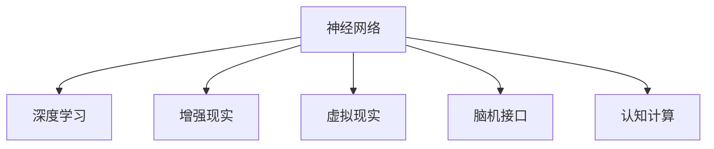

                 

# 认知增强：技术如何扩展人类的思维极限

## 1. 背景介绍

### 1.1 问题由来
人类思维的极限一直是哲学家、心理学家和神经科学家关注的核心问题。随着科技的进步，尤其是人工智能和大数据的发展，我们有了新的手段来拓展人类认知能力。认知增强（Cognitive Enhancement），即通过技术手段提升人类智能和认知水平，正在逐步从科幻走向现实。

近年来，从增强现实(AR)到虚拟现实(VR)，从智能助手到脑机接口(BMI)，这些技术都在不同程度上尝试打破人类思维的界限。然而，如何平衡技术创新与伦理道德，如何在增强智能的同时不失去人的本真，是一个复杂且迫切需要探讨的问题。

### 1.2 问题核心关键点
认知增强技术主要基于以下几个关键点：
- 神经网络：通过模仿人类大脑结构，使用深度学习技术模拟人脑的认知过程。
- 数据驱动：通过大量数据分析，优化模型参数，提升预测准确性。
- 计算能力：利用高性能计算，提供实时处理复杂任务的能力。
- 用户体验：关注用户界面的友好性和使用便捷性，降低技术门槛。
- 伦理道德：探讨技术应用对社会、个人及环境的影响，保障技术应用的道德合法性。

这些关键点不仅决定了认知增强技术的发展方向，也引发了技术哲学、社会学、心理学等多领域的热烈讨论。

## 2. 核心概念与联系

### 2.1 核心概念概述

为更好地理解认知增强技术，本节将介绍几个密切相关的核心概念：

- **神经网络（Neural Network）**：通过模拟人脑神经元的工作原理，构建的复杂计算模型。通常用于图像识别、语音识别、自然语言处理等任务。
- **深度学习（Deep Learning）**：一种特殊的机器学习方法，通过多层神经网络进行数据特征的自动学习和抽象。在图像识别、语音处理、自然语言处理等领域取得了卓越的成绩。
- **增强现实（AR）**：一种将数字信息叠加在现实世界上的技术，通过智能眼镜、手机等设备实现。
- **虚拟现实（VR）**：通过计算机生成虚拟环境，使用户能够沉浸式地体验。常用于教育、娱乐、训练等领域。
- **脑机接口（BMI）**：将人类大脑信号与计算机连接，实现直接的神经控制。用于辅助交流、康复训练等。
- **认知计算（Cognitive Computing）**：结合认知科学和计算科学，开发能够模拟人类认知能力的计算机系统。

这些核心概念之间的逻辑关系可以通过以下Mermaid流程图来展示：



这个流程图展示了几大核心概念及其之间的关系：

1. 神经网络是深度学习、认知计算的基础。
2. 深度学习在图像识别、语音处理等领域取得了突破，是增强现实、虚拟现实、脑机接口的重要技术支持。
3. 增强现实、虚拟现实提供了更为丰富的用户体验。
4. 脑机接口使人类与计算机进行直接交互，是认知增强的重要形式。
5. 认知计算推动了对人类认知机制的模拟和应用。

这些概念共同构成了认知增强技术的发展框架，为我们拓展人类思维极限提供了重要工具。通过理解这些核心概念，我们可以更好地把握认知增强技术的工作原理和应用方向。

## 3. 核心算法原理 & 具体操作步骤
### 3.1 算法原理概述

认知增强技术涉及多种算法，其中最核心的是深度学习和神经网络。本节将重点介绍这些算法的原理。

深度学习算法通过多层神经网络对输入数据进行抽象和分类，典型流程包括数据预处理、特征提取、模型训练和预测等步骤。以图像识别任务为例，其算法流程如下：

1. **数据预处理**：收集和清洗图像数据集，将图像进行归一化处理。
2. **特征提取**：使用卷积神经网络（CNN）提取图像的特征表示，这些特征能够捕捉图像的基本形状和结构。
3. **模型训练**：通过反向传播算法，优化模型参数，使得模型在训练数据上表现最佳。
4. **预测**：将新图像输入模型，输出其分类结果。

神经网络则通过模拟人脑神经元间的连接，实现信息传递和处理。具体过程包括：

1. **前向传播**：输入数据通过神经网络各层进行处理，每层计算出一个激活函数输出。
2. **损失函数计算**：将输出结果与真实标签计算损失，衡量模型预测的准确性。
3. **反向传播**：利用梯度下降算法，反向计算损失函数对参数的梯度，更新模型参数。
4. **模型优化**：通过多次前向传播和反向传播，不断调整模型参数，提升预测准确性。

### 3.2 算法步骤详解

以下详细介绍深度学习算法的具体步骤和原理：

**Step 1: 数据预处理**

数据预处理是深度学习模型的第一步，包括数据清洗、归一化、划分训练集和验证集等操作。常见数据预处理方法包括：

- 数据清洗：去除噪声、修正错误标签等，保证数据质量。
- 数据归一化：将数据按比例缩放到[0,1]或[-1,1]的范围内，加速模型收敛。
- 数据划分：将数据集划分为训练集和验证集，用于模型训练和性能评估。

**Step 2: 特征提取**

特征提取是深度学习模型的核心环节，用于从原始数据中提取出有效的特征表示。以图像识别任务为例，常用方法包括：

- 卷积神经网络（CNN）：通过多层卷积和池化操作，提取图像的局部特征。
- 循环神经网络（RNN）：用于序列数据，如文本、时间序列等，通过门控机制记忆长期依赖。
- 自编码器（AE）：通过重构原始数据，学习到数据的压缩表示，提高特征提取效果。

**Step 3: 模型训练**

模型训练是深度学习模型的关键步骤，目的是通过优化算法更新模型参数，使其在训练集上表现最佳。常用优化算法包括：

- 随机梯度下降（SGD）：每次随机抽取一个样本，更新模型参数。
- 动量（Momentum）：引入动量项，加速梯度更新，避免陷入局部最优。
- Adam优化器：结合动量和梯度的一阶矩估计，在梯度更新时自适应调整学习率，加速收敛。

**Step 4: 模型评估**

模型评估是深度学习模型的最后一步，用于评估模型在测试集上的性能。常用评估指标包括：

- 准确率（Accuracy）：模型正确分类的样本数占总样本数的比例。
- 召回率（Recall）：真实正例中被模型正确预测为正例的比例。
- F1分数（F1 Score）：准确率和召回率的调和平均，综合评估模型的性能。

### 3.3 算法优缺点

深度学习和神经网络算法在拓展人类思维极限方面具有以下优点：

- 强大的特征提取能力：能够从复杂数据中提取出有效的特征，适应各种类型的输入数据。
- 高度自动化的学习过程：通过训练模型，能够自动学习到数据的分布规律，减少人工干预。
- 实时处理能力：利用高性能计算资源，能够在短时间内处理大量数据。
- 广泛的应用领域：在图像识别、语音识别、自然语言处理等领域均有出色的表现。

同时，这些算法也存在以下缺点：

- 数据依赖性强：需要大量高质量标注数据进行训练，数据获取成本高。
- 模型复杂度高：模型参数量庞大，训练复杂度高，对计算资源要求高。
- 可解释性差：深度学习模型通常被视为"黑箱"，难以解释其内部工作机制。
- 泛化能力受限：模型容易出现过拟合，对于未见过的数据泛化能力较差。

尽管存在这些局限性，深度学习和神经网络在认知增强技术中仍是最主流的方法。未来相关研究的重点在于如何进一步降低数据依赖，提高模型的泛化能力和可解释性。

### 3.4 算法应用领域

深度学习和神经网络算法在认知增强技术中有着广泛的应用：

- **图像识别**：通过CNN提取图像特征，实现快速准确的图像分类、检测和识别。
- **语音识别**：通过RNN处理音频信号，实现语音转文本、语音命令识别等应用。
- **自然语言处理**：通过RNN或Transformer模型处理文本数据，实现机器翻译、情感分析、文本生成等任务。
- **增强现实**：通过深度学习技术提取环境特征，实现虚拟信息与现实环境的融合。
- **虚拟现实**：通过深度学习生成逼真的虚拟环境，提升用户体验。
- **脑机接口**：通过脑电信号或MRI图像进行深度学习建模，实现人机交互和康复训练。

这些应用展示了深度学习和神经网络在认知增强中的巨大潜力，推动了各领域的创新发展。

## 4. 数学模型和公式 & 详细讲解 & 举例说明

### 4.1 数学模型构建

以图像识别为例，我们描述其数学模型构建过程：

设输入图像为 $x \in \mathbb{R}^{n}$，输出标签为 $y \in \{1,0\}$。我们假设使用多层卷积神经网络进行特征提取和分类，其结构如图：

```mermaid
graph LR
    Layer[卷积层] --> Classifier[分类器]
    Subscript(Conv1, Conv2, ...), Subscript(ReLU1, ReLU2, ...) --> Layer
    Subscript(Pool1, Pool2, ...) --> Layer
```

其中，卷积层和池化层用于提取图像特征，ReLU激活函数用于引入非线性变换，分类器用于输出最终的分类结果。模型的参数为 $\theta = (W_1, b_1, W_2, b_2, ..., W_L, b_L)$，其中 $W_i$ 和 $b_i$ 分别为第 $i$ 层的卷积核和偏置项。

模型的前向传播过程如下：

$$
h_1 = \sigma(W_1 x + b_1) \\
h_2 = \sigma(W_2 h_1 + b_2) \\
... \\
h_L = \sigma(W_L h_{L-1} + b_L) \\
y = \sigma(W_L h_{L-1} + b_L)
$$

其中，$\sigma$ 为激活函数，可以是ReLU、sigmoid等。

模型的损失函数为交叉熵损失：

$$
\mathcal{L}(y, \hat{y}) = -\frac{1}{N} \sum_{i=1}^N (y_i \log \hat{y}_i + (1-y_i) \log (1-\hat{y}_i))
$$

目标是最小化损失函数，即：

$$
\theta^* = \mathop{\arg\min}_{\theta} \mathcal{L}(y, \hat{y})
$$

通过梯度下降等优化算法，最小化损失函数，得到最优参数 $\theta^*$。

### 4.2 公式推导过程

以下是卷积神经网络（CNN）中卷积层和池化层的详细推导：

**卷积层**

卷积层的权重矩阵为 $W \in \mathbb{R}^{k\times k \times c\times o}$，其中 $k$ 为卷积核大小，$c$ 为输入通道数，$o$ 为输出通道数。卷积操作定义为：

$$
y_{ij} = \sum_{m,n=0}^{k-1} W_{m,n,i,j}x_{m+n,i-j,k}
$$

其中 $x_{ij}$ 为输入特征图在位置 $(i,j)$ 的像素值，$W_{m,n,i,j}$ 为卷积核在位置 $(i,j)$ 的权重值。

卷积层的前向传播过程为：

$$
z = W \ast x + b
$$

其中 $x$ 为输入特征图，$W$ 为卷积核矩阵，$b$ 为偏置项，$\ast$ 表示卷积操作。

**池化层**

池化层用于对特征图进行降维，常用方法包括最大池化和平均池化。以最大池化为例，其公式为：

$$
y_{ij} = \max_{m,n=0}^{k-1} x_{m+n,i-j,k}
$$

其中 $x_{ij}$ 为输入特征图在位置 $(i,j)$ 的像素值，$k$ 为池化核大小。

池化层的前向传播过程为：

$$
z = \max(y_{ij})
$$

其中 $y$ 为输入特征图，$y_{ij}$ 为池化操作后的特征值。

### 4.3 案例分析与讲解

以医学图像识别为例，分析深度学习模型在该任务中的应用。

假设有一个包含肺结节图像的数据集，每个图像的大小为 $256 \times 256$。我们使用一个包含多个卷积层和池化层的卷积神经网络模型进行特征提取和分类。模型的前向传播过程如下：

1. **卷积层**：提取图像的局部特征，如边缘、纹理等。
2. **池化层**：对特征图进行降维，减小计算量。
3. **全连接层**：将提取的特征输入全连接层，进行分类。

模型的损失函数为交叉熵损失，通过反向传播算法优化模型参数。训练完成后，我们将新图像输入模型，输出其分类结果。

## 5. 项目实践：代码实例和详细解释说明
### 5.1 开发环境搭建

在进行深度学习项目实践前，我们需要准备好开发环境。以下是使用Python进行PyTorch开发的环境配置流程：

1. 安装Anaconda：从官网下载并安装Anaconda，用于创建独立的Python环境。

2. 创建并激活虚拟环境：
```bash
conda create -n pytorch-env python=3.8 
conda activate pytorch-env
```

3. 安装PyTorch：根据CUDA版本，从官网获取对应的安装命令。例如：
```bash
conda install pytorch torchvision torchaudio cudatoolkit=11.1 -c pytorch -c conda-forge
```

4. 安装各类工具包：
```bash
pip install numpy pandas scikit-learn matplotlib tqdm jupyter notebook ipython
```

完成上述步骤后，即可在`pytorch-env`环境中开始深度学习实践。

### 5.2 源代码详细实现

这里我们以图像分类任务为例，给出使用PyTorch进行卷积神经网络（CNN）训练的PyTorch代码实现。

首先，定义CNN模型：

```python
import torch
import torch.nn as nn
import torch.nn.functional as F

class CNNModel(nn.Module):
    def __init__(self):
        super(CNNModel, self).__init__()
        self.conv1 = nn.Conv2d(3, 32, 3, 1)
        self.conv2 = nn.Conv2d(32, 64, 3, 1)
        self.pool = nn.MaxPool2d(2, 2)
        self.fc1 = nn.Linear(64 * 7 * 7, 128)
        self.fc2 = nn.Linear(128, 10)
    
    def forward(self, x):
        x = F.relu(self.conv1(x))
        x = F.relu(self.conv2(x))
        x = self.pool(x)
        x = x.view(-1, 64 * 7 * 7)
        x = F.relu(self.fc1(x))
        x = self.fc2(x)
        return F.log_softmax(x, dim=1)
```

然后，定义训练和评估函数：

```python
import torch.optim as optim

device = torch.device('cuda' if torch.cuda.is_available() else 'cpu')

def train_model(model, train_loader, test_loader, epochs, learning_rate):
    model.train()
    optimizer = optim.Adam(model.parameters(), lr=learning_rate)
    criterion = nn.CrossEntropyLoss()
    for epoch in range(epochs):
        for images, labels in train_loader:
            images, labels = images.to(device), labels.to(device)
            optimizer.zero_grad()
            outputs = model(images)
            loss = criterion(outputs, labels)
            loss.backward()
            optimizer.step()
        
        model.eval()
        correct = 0
        total = 0
        with torch.no_grad():
            for images, labels in test_loader:
                images, labels = images.to(device), labels.to(device)
                outputs = model(images)
                _, predicted = torch.max(outputs.data, 1)
                total += labels.size(0)
                correct += (predicted == labels).sum().item()
        
        print('Epoch %d, Loss: %.4f, Accuracy: %.2f %%' % (epoch + 1, loss.item(), (correct / total) * 100))

def evaluate_model(model, test_loader):
    model.eval()
    correct = 0
    total = 0
    with torch.no_grad():
        for images, labels in test_loader:
            images, labels = images.to(device), labels.to(device)
            outputs = model(images)
            _, predicted = torch.max(outputs.data, 1)
            total += labels.size(0)
            correct += (predicted == labels).sum().item()
    
    print('Test Accuracy: %.2f %%' % (correct / total * 100))
```

最后，启动训练流程并在测试集上评估：

```python
import torchvision
from torchvision import datasets, transforms

# 数据预处理
transform = transforms.Compose([
    transforms.ToTensor(),
    transforms.Normalize((0.5, 0.5, 0.5), (0.5, 0.5, 0.5))
])

train_dataset = torchvision.datasets.CIFAR10(root='./data', train=True, download=True, transform=transform)
train_loader = torch.utils.data.DataLoader(train_dataset, batch_size=64, shuffle=True)

test_dataset = torchvision.datasets.CIFAR10(root='./data', train=False, download=True, transform=transform)
test_loader = torch.utils.data.DataLoader(test_dataset, batch_size=64, shuffle=False)

model = CNNModel().to(device)
train_model(model, train_loader, test_loader, epochs=10, learning_rate=0.001)

evaluate_model(model, test_loader)
```

以上就是使用PyTorch进行卷积神经网络训练的完整代码实现。可以看到，得益于PyTorch的强大封装，我们可以用相对简洁的代码完成CNN模型的加载和训练。

### 5.3 代码解读与分析

让我们再详细解读一下关键代码的实现细节：

**CNNModel类**：
- `__init__`方法：初始化卷积层、池化层和全连接层等关键组件。
- `forward`方法：定义模型前向传播的计算流程。

**训练和评估函数**：
- 使用PyTorch的DataLoader对数据集进行批次化加载，供模型训练和推理使用。
- 训练函数`train_model`：对数据以批为单位进行迭代，在每个批次上前向传播计算loss并反向传播更新模型参数，最后返回该epoch的平均loss和测试集准确率。
- 评估函数`evaluate_model`：与训练类似，不同点在于不更新模型参数，并在每个batch结束后将预测和标签结果存储下来，最后使用正确率计算评估指标。

**训练流程**：
- 定义总的epoch数和batch size，开始循环迭代
- 每个epoch内，先在训练集上训练，输出平均loss和测试集准确率
- 所有epoch结束后，在测试集上评估，给出最终测试结果

可以看到，PyTorch配合TensorFlow使得CNN训练的代码实现变得简洁高效。开发者可以将更多精力放在数据处理、模型改进等高层逻辑上，而不必过多关注底层的实现细节。

当然，工业级的系统实现还需考虑更多因素，如模型的保存和部署、超参数的自动搜索、更灵活的任务适配层等。但核心的训练范式基本与此类似。

## 6. 实际应用场景
### 6.1 智能医疗

基于深度学习算法的认知增强技术，可以广泛应用于智能医疗系统的构建。传统医疗诊断往往依赖医生的经验，容易受主观因素影响。通过深度学习模型，可以辅助医生进行疾病预测和诊断，提高诊断的准确性和效率。

在实践中，可以收集各类医疗影像、病历等数据，将疾病标签标注在数据集中。在此基础上对深度学习模型进行微调，使其能够自动判断图像或文本中的疾病类型，甚至进行早期筛查和诊断。微调后的模型能够提供实时、准确的健康评估，辅助医生进行快速决策。

### 6.2 智慧教育

深度学习算法可以用于智能教育系统的开发，提升教育的个性化和互动性。传统教学方式往往难以适应每个学生的不同需求，而通过深度学习，可以定制个性化的学习方案，因材施教。

具体而言，可以收集学生的学习数据，如成绩、兴趣、行为等，通过深度学习模型预测学生的学习行为，生成个性化的学习计划。同时，结合虚拟现实技术，可以创建沉浸式的学习环境，增强学生的学习体验。通过智能教育系统，教师可以更好地跟踪学生学习进度，及时调整教学策略。

### 6.3 智能交通

深度学习算法可以用于智能交通系统的构建，提升交通管理的智能化水平。传统交通管理依赖人工监控，难以实时响应交通状况。通过深度学习模型，可以实时分析和预测交通流量，优化交通信号灯控制，减少交通拥堵。

在实践中，可以收集交通摄像头、传感器等数据，训练深度学习模型进行交通流量预测。微调后的模型能够实时分析交通状况，动态调整信号灯，提高交通流畅度。同时，结合虚拟现实技术，可以创建虚拟驾驶模拟器，用于交通管理和培训，提升交通管理的效率和安全性。

### 6.4 未来应用展望

随着深度学习技术的不断发展，认知增强技术将会在更多领域得到应用，为各行各业带来变革性影响。

在智慧城市治理中，基于深度学习技术的智能安防系统可以实时监控和管理城市安全，提升公共安全水平。在工业制造中，智能机器人可以基于深度学习进行自适应控制，提高生产效率。在金融领域，深度学习模型可以辅助风险评估和投资决策，提升金融服务的智能化水平。

此外，在农业、能源、环境等领域，认知增强技术也将不断涌现，为传统行业带来创新性的变革。相信随着深度学习技术的进一步成熟，认知增强技术必将在各行各业中发挥重要作用，推动人类社会的智能化发展。

## 7. 工具和资源推荐
### 7.1 学习资源推荐

为了帮助开发者系统掌握深度学习技术的理论基础和实践技巧，这里推荐一些优质的学习资源：

1. 《深度学习》书籍：Ian Goodfellow等人合著的深度学习经典教材，全面系统地介绍了深度学习的基本原理和算法。

2. CS231n《卷积神经网络》课程：斯坦福大学开设的计算机视觉课程，系统讲解了卷积神经网络的结构和优化算法。

3. CS224d《自然语言处理与深度学习》课程：斯坦福大学开设的自然语言处理课程，系统介绍了深度学习在自然语言处理中的应用。

4. Udacity深度学习纳米学位课程：提供了从理论到实践的系统学习路径，涵盖深度学习的基础和前沿技术。

5. Kaggle数据科学竞赛平台：提供了丰富的数据集和竞赛任务，帮助开发者实践深度学习模型，提升实战能力。

通过对这些资源的学习实践，相信你一定能够快速掌握深度学习技术的精髓，并用于解决实际的认知增强问题。
###  7.2 开发工具推荐

高效的开发离不开优秀的工具支持。以下是几款用于深度学习开发的常用工具：

1. PyTorch：基于Python的开源深度学习框架，灵活动态的计算图，适合快速迭代研究。大部分深度学习模型都有PyTorch版本的实现。

2. TensorFlow：由Google主导开发的开源深度学习框架，生产部署方便，适合大规模工程应用。同样有丰富的深度学习模型资源。

3. Keras：基于TensorFlow或Theano的高级深度学习框架，提供了简洁易用的API，可以快速搭建深度学习模型。

4. MXNet：由亚马逊开发的深度学习框架，支持多种编程语言和硬件平台，适合分布式训练。

5. Jupyter Notebook：一个免费的Web应用程序，支持交互式计算，适合进行数据探索和模型验证。

6. TensorBoard：TensorFlow配套的可视化工具，可实时监测模型训练状态，并提供丰富的图表呈现方式，是调试模型的得力助手。

合理利用这些工具，可以显著提升深度学习项目的开发效率，加快创新迭代的步伐。

### 7.3 相关论文推荐

深度学习技术的发展源于学界的持续研究。以下是几篇奠基性的相关论文，推荐阅读：

1. AlexNet: ImageNet Classification with Deep Convolutional Neural Networks：提出AlexNet模型，开创了深度卷积神经网络的时代。

2. VGGNet: Very Deep Convolutional Networks for Large-Scale Image Recognition：提出VGGNet模型，展示了深度网络在图像识别任务上的强大能力。

3. ResNet: Deep Residual Learning for Image Recognition：提出ResNet模型，解决了深层网络训练中梯度消失的问题。

4. Inception: GoogLeNet：提出Inception模型，在保持高精度的同时，大幅提升了模型训练和推理的速度。

5. YOLO: You Only Look Once：提出YOLO模型，实现了实时物体检测，推动了计算机视觉的发展。

6. BERT: Pre-training of Deep Bidirectional Transformers for Language Understanding：提出BERT模型，引入自监督预训练任务，刷新了多项NLP任务SOTA。

这些论文代表了大模型微调技术的发展脉络。通过学习这些前沿成果，可以帮助研究者把握学科前进方向，激发更多的创新灵感。

## 8. 总结：未来发展趋势与挑战
### 8.1 总结

本文对深度学习算法的认知增强技术进行了全面系统的介绍。首先阐述了深度学习算法在认知增强技术中的重要作用，明确了深度学习技术的发展方向和应用前景。其次，从原理到实践，详细讲解了深度学习算法的数学模型和关键步骤，给出了深度学习模型训练的完整代码实例。同时，本文还广泛探讨了深度学习技术在智能医疗、智慧教育、智能交通等多个领域的应用前景，展示了深度学习技术的巨大潜力。最后，本文精选了深度学习技术的各类学习资源，力求为读者提供全方位的技术指引。

通过本文的系统梳理，可以看到，深度学习算法在认知增强技术中占据了核心地位，推动了各领域的创新发展。深度学习技术通过强大的特征提取和分类能力，显著提升了认知增强任务的性能，拓展了人类思维的极限。未来，伴随深度学习技术的持续演进，认知增强技术必将在更广泛的领域发挥重要作用，推动人类社会的智能化发展。

### 8.2 未来发展趋势

展望未来，深度学习算法在认知增强技术中呈现以下几个发展趋势：

1. 模型规模持续增大。随着算力成本的下降和数据规模的扩张，深度学习模型的参数量还将持续增长。超大规模模型蕴含的丰富特征表示，有望支撑更复杂的认知增强任务。

2. 模型复杂度降低。随着模型的不断优化，如剪枝、量化等技术的应用，深度学习模型的计算复杂度将大幅降低，提高推理效率，提升用户体验。

3. 应用领域拓展。深度学习技术将进一步渗透到更多行业，如金融、教育、医疗、交通等领域，带来颠覆性创新。

4. 跨领域融合。深度学习技术将与其他前沿技术，如脑机接口、增强现实、虚拟现实等融合，推动认知增强技术的进一步发展。

5. 可解释性增强。深度学习模型的可解释性将得到更多关注，通过可视化技术、注意力机制等手段，提升模型的透明度和可信度。

以上趋势凸显了深度学习算法在认知增强技术中的巨大潜力。这些方向的探索发展，必将进一步提升认知增强技术的性能和应用范围，为人类社会的智能化发展注入新的动力。

### 8.3 面临的挑战

尽管深度学习技术在认知增强领域取得了显著成绩，但在迈向更加智能化、普适化应用的过程中，它仍面临诸多挑战：

1. 数据获取成本高。深度学习算法需要大量高质量标注数据进行训练，数据获取成本较高，尤其在医疗、金融等领域，数据隐私和安全问题也需高度重视。

2. 模型泛化能力不足。深度学习模型容易出现过拟合，对于未见过的数据泛化能力较差，模型在实际应用中可能表现不佳。

3. 模型复杂度高。深度学习模型参数量庞大，训练复杂度高，对计算资源要求高，不利于模型的部署和应用。

4. 可解释性差。深度学习模型通常被视为"黑箱"，难以解释其内部工作机制，不利于模型的可信度和应用推广。

5. 安全性问题。深度学习模型可能被恶意利用，如生成虚假信息、误导决策等，引发伦理和法律问题。

6. 技术门槛高。深度学习算法复杂度较高，需要较高的技术门槛，普通用户难以使用和理解。

尽管存在这些挑战，深度学习技术在认知增强领域仍具有广阔的应用前景。未来相关研究需要在以下几个方面寻求新的突破：

1. 数据增强技术：通过数据增强、迁移学习等手段，降低深度学习算法对标注数据的依赖，提高模型的泛化能力。

2. 模型压缩技术：通过模型剪枝、量化等手段，降低深度学习模型的复杂度，提高模型的推理效率和部署便捷性。

3. 模型可解释性：通过可视化技术、注意力机制等手段，提升深度学习模型的透明度和可信度。

4. 安全性保障：通过数据匿名化、模型鲁棒性训练等手段，保障深度学习模型在实际应用中的安全性。

5. 用户体验优化：通过界面优化、交互设计等手段，降低深度学习算法的技术门槛，提升用户的使用体验。

这些方向的探索和优化，必将进一步提升深度学习算法在认知增强领域的应用效果，推动认知增强技术的不断成熟和落地。

### 8.4 研究展望

随着深度学习技术的不断发展，认知增强技术将在更广泛的领域得到应用，为各行各业带来变革性影响。相信随着学界和产业界的共同努力，深度学习技术必将不断突破，认知增强技术必将在构建智能社会中发挥更加重要的作用。未来，随着深度学习技术的进一步成熟，认知增强技术必将在更广泛的领域发挥重要作用，推动人类社会的智能化发展。

## 9. 附录：常见问题与解答

**Q1：深度学习算法是否适用于所有认知增强任务？**

A: 深度学习算法在许多认知增强任务中取得了卓越的性能，但其适用范围仍有一定局限。例如，对于需要大量非结构化数据的任务，深度学习算法可能难以处理。而对于需要高度符号化推理的任务，深度学习算法可能表现不佳。因此，在实际应用中，需要根据任务特点选择合适的算法。

**Q2：如何提高深度学习算法的泛化能力？**

A: 提高深度学习算法的泛化能力可以从以下几个方面入手：

1. 数据增强：通过旋转、翻转、剪裁等方法扩充训练集，提高模型的鲁棒性。
2. 迁移学习：利用已有模型在新任务上进行微调，提高模型的泛化能力。
3. 正则化：通过L2正则、Dropout等手段，防止过拟合，提高模型的泛化能力。
4. 集成学习：通过模型集成，提高模型的泛化能力和鲁棒性。
5. 对抗训练：引入对抗样本，提高模型的鲁棒性和泛化能力。

**Q3：深度学习算法的训练过程如何优化？**

A: 深度学习算法的训练过程可以通过以下几个方面进行优化：

1. 选择合适的优化器：如Adam、SGD等，并调整学习率、动量等参数。
2. 使用梯度累积技术：通过批次的累积，减少内存占用，加速训练过程。
3. 使用分布式训练：通过多机多卡并行训练，提高训练效率。
4. 使用模型压缩技术：如剪枝、量化等，减少模型参数量，提高推理效率。
5. 使用批量归一化：通过批量归一化，加速模型收敛，提高训练效率。

**Q4：深度学习算法的部署和维护需要注意哪些问题？**

A: 深度学习算法的部署和维护需要注意以下几个问题：

1. 模型量化：将浮点模型转为定点模型，压缩存储空间，提高计算效率。
2. 模型剪枝：去除不必要的层和参数，减小模型尺寸，提高推理速度。
3. 模型压缩：通过模型压缩技术，减少模型参数量，提高推理效率。
4. 模型优化：通过优化算法，提升模型性能和推理速度。
5. 模型监控：实时监控模型运行状态，及时发现和解决问题。

---

作者：禅与计算机程序设计艺术 / Zen and the Art of Computer Programming

