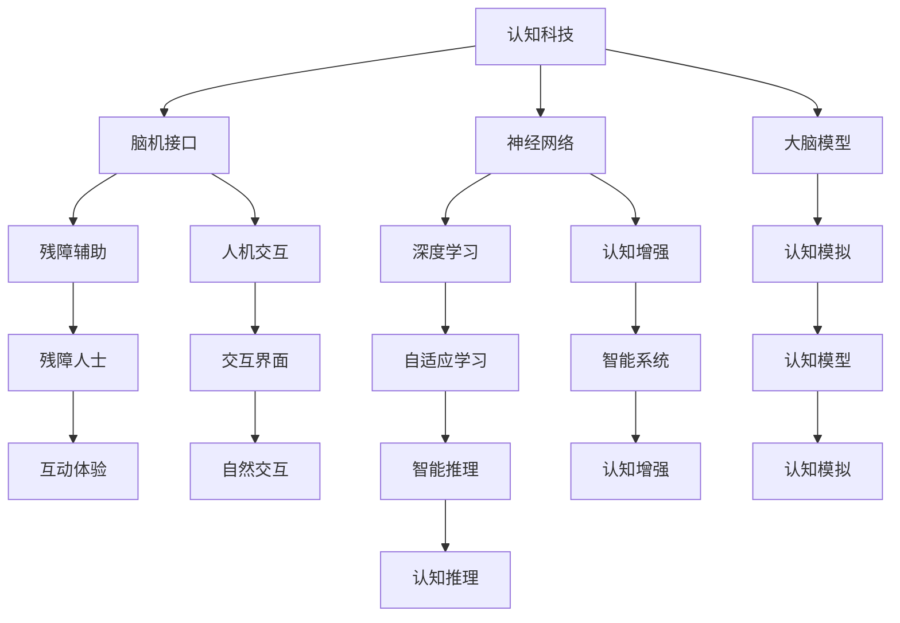

                 

# 认知科技：增强人类智能的前沿探索

> 关键词：认知科技,增强智能,人工智能,脑机接口,神经网络,大脑模型,脑计算

## 1. 背景介绍

### 1.1 问题由来

随着人工智能技术的飞速发展，尤其是深度学习、神经网络等领域的突破，人类智能的增强进入了一个新的阶段。从计算机视觉到自然语言处理，再到智能推荐和机器学习，人工智能技术正在逐步渗透到生活的方方面面。但人类智能的核心在于认知能力，仅靠计算机的计算能力，仍无法完全替代人类大脑的认知功能。

认知科技（Cognitive Technology），即利用先进的技术手段，增强人类智能、提升认知能力，正成为当前科技研究的前沿方向。通过认知科技，人类有望获得更高效的思考、更强大的决策能力和更全面的认知视角。

### 1.2 问题核心关键点

认知科技的研究核心在于探索和构建更高效、更智能的认知模型，以增强人类的智能能力。其中几个关键问题包括：

- 如何构建更高效的大脑模型，以模拟人类认知过程？
- 如何通过脑机接口技术，实现人机交互与脑控计算机？
- 如何结合神经网络、深度学习等技术，提升人工智能的认知推理能力？

这些问题不仅是认知科技研究的核心，也是未来人工智能发展的方向。

## 2. 核心概念与联系

### 2.1 核心概念概述

为了深入理解认知科技的前沿探索，我们需要了解几个核心概念：

- 认知科技（Cognitive Technology）：指通过先进技术手段，增强人类智能和提升认知能力的技术体系。包括脑机接口、神经网络、认知增强等子领域。

- 脑机接口（Brain-Computer Interface, BCIs）：一种通过信号采集和解码，实现人脑与计算机之间的直接通信的技术。脑机接口技术可以帮助残障人士恢复部分功能，也成为人机交互的重要手段。

- 神经网络（Neural Network）：由大量神经元和连接构成的计算模型，模拟人脑的神经元网络，广泛应用于机器学习、深度学习等领域。

- 大脑模型（Brain Model）：通过神经网络、物理模型等方式构建的模拟人类大脑认知过程的计算模型。

- 脑计算（Brain Computing）：利用神经网络、大脑模型等技术手段，模拟人类认知过程，实现更高效、更智能的计算和推理。

这些核心概念之间的联系可以通过以下Mermaid流程图来展示：



这个流程图展示了认知科技与各个子领域之间的联系：

1. 脑机接口：连接人类大脑和计算机，实现信息传递。
2. 神经网络：模拟人脑神经元网络，用于深度学习和认知增强。
3. 大脑模型：构建人类大脑认知过程的计算模型，用于认知模拟和增强。
4. 脑计算：利用神经网络、大脑模型等技术，提升计算和推理能力。
5. 残障辅助：帮助残障人士恢复部分功能。
6. 人机交互：通过脑机接口实现自然交互。
7. 认知增强：通过神经网络、大脑模型等技术，增强人类的智能能力。
8. 深度学习：神经网络的重要组成部分，用于自适应学习和认知推理。
9. 认知模拟：模拟人类大脑认知过程，实现智能推理。
10. 智能推理：通过大脑模型和神经网络，实现更高效的推理和决策。
11. 残障人士：受益于脑机接口和认知科技的技术。
12. 交互界面：人机交互的界面，包括自然交互和智能系统。
13. 智能系统：融合脑计算和认知增强的智能应用。
14. 认知模拟：通过大脑模型模拟人类认知过程。
15. 认知推理：通过神经网络和大脑模型实现高效推理。

这些概念共同构成了认知科技的研究框架，为人类智能的增强提供了技术支撑。

## 3. 核心算法原理 & 具体操作步骤
### 3.1 算法原理概述

认知科技的核心算法原理主要基于神经网络、深度学习和大脑模型。这些算法通过模拟人脑的神经元网络，实现更高效的计算和推理。

神经网络通过大量神经元之间的连接，模拟人脑的神经元网络。深度学习则通过多层神经网络的叠加，实现对复杂数据结构的深度分析。大脑模型则进一步模拟人类大脑的认知过程，实现对智能推理的支持。

### 3.2 算法步骤详解

认知科技的算法步骤通常包括以下几个关键环节：

1. **数据采集与预处理**：通过脑机接口等手段，采集人类大脑的电信号、神经元活动等信息，并进行预处理。

2. **特征提取与编码**：将采集到的信号数据转化为神经网络可以处理的特征向量。这一过程通常包括信号降噪、特征选择、降维等步骤。

3. **神经网络模型训练**：使用大规模标注数据，训练神经网络模型，使其能够模拟人脑的神经元网络。训练过程中，通常使用反向传播算法和梯度下降优化算法。

4. **大脑模型构建**：构建大脑模型，模拟人类大脑的认知过程。这包括建立神经元网络的结构，定义神经元之间的连接方式，以及定义神经元之间的通信规则。

5. **脑计算与推理**：通过神经网络和大脑模型，实现脑计算和智能推理。这一过程中，需要选择合适的任务适配层，如分类层、生成层等，并进行模型微调。

6. **效果评估与优化**：在训练和推理过程中，不断评估模型的效果，通过调整超参数、正则化、对抗训练等手段，优化模型性能。

### 3.3 算法优缺点

认知科技的算法具有以下优点：

- 高效计算：神经网络和深度学习能够实现对复杂数据的高效处理和分析。
- 智能推理：大脑模型能够模拟人类认知过程，实现更智能的推理和决策。
- 人机交互：脑机接口技术可以实现人机交互，提升用户体验。

同时，这些算法也存在一些缺点：

- 数据依赖：脑机接口等技术需要依赖大量的生理信号数据，数据采集和标注成本较高。
- 计算复杂度：大规模神经网络和深度学习模型的训练和推理需要高性能计算资源，计算复杂度较高。
- 算法可解释性不足：神经网络和深度学习模型的决策过程缺乏可解释性，难以进行调试和优化。
- 安全性问题：脑机接口和神经网络等技术存在隐私泄露和滥用的风险。

尽管存在这些局限性，认知科技仍然具有广阔的应用前景和研究价值。

### 3.4 算法应用领域

认知科技的应用领域非常广泛，主要包括以下几个方面：

- **医疗健康**：通过脑机接口和大脑模型，实现对脑部疾病的诊断和治疗，如帕金森病、抑郁症等。

- **教育培训**：通过神经网络和大脑模型，实现个性化的教育培训，提高学习效率。

- **虚拟现实**：通过脑机接口和神经网络，实现虚拟现实交互和沉浸式体验。

- **智能助手**：通过神经网络和大脑模型，实现智能助手的功能，如语音识别、图像识别等。

- **脑控计算机**：通过脑机接口技术，实现人脑直接控制计算机，提升人机交互效率。

这些应用领域展示了认知科技的广泛应用前景，有望在未来的智能时代中发挥重要作用。

## 4. 数学模型和公式 & 详细讲解 & 举例说明
### 4.1 数学模型构建

认知科技的数学模型通常基于神经网络和深度学习模型构建。以一个简单的神经网络为例，其基本结构包括输入层、隐藏层和输出层。

假设输入数据为 $x=(x_1, x_2, ..., x_n)$，神经网络的隐藏层为 $h=(h_1, h_2, ..., h_m)$，输出层为 $y=(y_1, y_2, ..., y_k)$。神经网络的目标是最小化预测输出与真实输出之间的差异，通常使用均方误差（MSE）作为损失函数。

设神经网络的权重矩阵为 $W_1$，偏置向量为 $b_1$，隐藏层与输出层之间的权重矩阵为 $W_2$，偏置向量为 $b_2$。则神经网络的输出可以表示为：

$$
y = f(h) = f(W_2h + b_2)
$$

其中 $f$ 为激活函数，如 sigmoid、ReLU 等。

### 4.2 公式推导过程

神经网络的前向传播过程可以表示为：

$$
h = g(W_1x + b_1)
$$

$$
y = f(W_2h + b_2)
$$

其中 $g$ 为激活函数，通常使用 sigmoid 或 tanh。

神经网络的反向传播过程可以表示为：

$$
\frac{\partial L}{\partial W_2} = \frac{\partial L}{\partial y} \frac{\partial y}{\partial h} \frac{\partial h}{\partial W_2}
$$

$$
\frac{\partial L}{\partial b_2} = \frac{\partial L}{\partial y} \frac{\partial y}{\partial h} \frac{\partial h}{\partial b_2}
$$

$$
\frac{\partial L}{\partial W_1} = \frac{\partial L}{\partial h} \frac{\partial h}{\partial x} \frac{\partial x}{\partial W_1}
$$

$$
\frac{\partial L}{\partial b_1} = \frac{\partial L}{\partial h} \frac{\partial h}{\partial x} \frac{\partial x}{\partial b_1}
$$

其中 $L$ 为损失函数，通常使用均方误差（MSE）。

### 4.3 案例分析与讲解

以一个简单的手写数字识别任务为例，分析神经网络的训练和推理过程。

假设我们有一组训练数据 $(x, y)$，其中 $x$ 为手写数字的图像，$y$ 为对应的标签。神经网络的目标是学习一个映射 $f$，使得 $f(x)$ 能够准确预测 $y$。

假设神经网络包括一个输入层、一个隐藏层和一个输出层，每个神经元使用 sigmoid 激活函数。输入层有 784 个神经元，表示 28x28 的图像像素；隐藏层有 100 个神经元；输出层有 10 个神经元，分别对应 0-9 的数字标签。

神经网络的训练过程可以分为以下几个步骤：

1. 随机初始化神经网络的权重和偏置。
2. 对每个训练样本 $(x_i, y_i)$，进行前向传播计算输出 $y_i$。
3. 计算预测输出与真实输出之间的误差 $L_i$，使用均方误差作为损失函数。
4. 对误差 $L_i$ 进行反向传播，更新神经网络的权重和偏置。
5. 重复上述步骤，直到训练集上的误差最小。

推理过程与训练类似，只是不再进行反向传播，直接使用训练好的神经网络进行前向传播计算输出。

## 5. 项目实践：代码实例和详细解释说明
### 5.1 开发环境搭建

在进行认知科技的实践前，我们需要准备好开发环境。以下是使用Python进行PyTorch开发的环境配置流程：

1. 安装Anaconda：从官网下载并安装Anaconda，用于创建独立的Python环境。

2. 创建并激活虚拟环境：
```bash
conda create -n pytorch-env python=3.8 
conda activate pytorch-env
```

3. 安装PyTorch：根据CUDA版本，从官网获取对应的安装命令。例如：
```bash
conda install pytorch torchvision torchaudio cudatoolkit=11.1 -c pytorch -c conda-forge
```

4. 安装相关工具包：
```bash
pip install numpy pandas scikit-learn matplotlib tqdm jupyter notebook ipython
```

完成上述步骤后，即可在`pytorch-env`环境中开始认知科技的实践。

### 5.2 源代码详细实现

这里我们以手写数字识别任务为例，给出使用PyTorch进行神经网络训练的代码实现。

首先，定义神经网络的模型结构：

```python
import torch
import torch.nn as nn
import torch.nn.functional as F

class NeuralNetwork(nn.Module):
    def __init__(self):
        super(NeuralNetwork, self).__init__()
        self.fc1 = nn.Linear(784, 100)
        self.fc2 = nn.Linear(100, 10)
        self.fc3 = nn.Linear(10, 10)
        
    def forward(self, x):
        x = x.view(-1, 784)
        x = F.relu(self.fc1(x))
        x = F.relu(self.fc2(x))
        x = self.fc3(x)
        return x

# 加载数据集
train_dataset = ...
test_dataset = ...

# 定义模型
model = NeuralNetwork()

# 定义损失函数和优化器
criterion = nn.CrossEntropyLoss()
optimizer = torch.optim.SGD(model.parameters(), lr=0.01)

# 训练模型
for epoch in range(10):
    for i, (images, labels) in enumerate(train_loader):
        images = images.reshape(-1, 28*28)
        labels = labels
        
        # 前向传播
        outputs = model(images)
        loss = criterion(outputs, labels)
        
        # 反向传播和优化
        optimizer.zero_grad()
        loss.backward()
        optimizer.step()
        
        # 打印日志
        print('Epoch [%d/%d], Step [%d/%d], Loss: %.4f'
              % (epoch+1, 10, i+1, total_step, loss.item()))

# 测试模型
correct = 0
total = 0
with torch.no_grad():
    for images, labels in test_loader:
        images = images.reshape(-1, 28*28)
        labels = labels
        
        outputs = model(images)
        _, predicted = torch.max(outputs.data, 1)
        total += labels.size(0)
        correct += (predicted == labels).sum().item()

print('Test Accuracy of the model on the 10000 test images: %d %%' % (100 * correct / total))
```

以上是使用PyTorch进行手写数字识别任务神经网络训练的完整代码实现。可以看到，PyTorch的动态计算图和自动微分功能，使得神经网络的训练和推理过程非常简单高效。

### 5.3 代码解读与分析

让我们再详细解读一下关键代码的实现细节：

**NeuralNetwork类**：
- `__init__`方法：初始化神经网络的权重和偏置。
- `forward`方法：定义神经网络的前向传播过程。

**数据集加载**：
- 使用PyTorch的DataLoader对数据集进行批次化加载，供模型训练和推理使用。

**损失函数和优化器**：
- 使用交叉熵损失函数和随机梯度下降（SGD）优化器。

**训练过程**：
- 对每个训练样本进行前向传播计算损失函数。
- 反向传播计算参数梯度，根据设定的优化算法和学习率更新模型参数。
- 使用`torch.no_grad()`禁用梯度计算，在测试集上进行模型推理。
- 打印训练日志，记录训练过程中的损失值。

**测试过程**：
- 在测试集上计算模型准确率，并输出测试结果。

通过以上代码，可以看出PyTorch框架使得神经网络的训练和推理过程非常直观和高效。开发者可以将更多精力放在数据处理、模型改进等高层逻辑上，而不必过多关注底层的实现细节。

当然，工业级的系统实现还需考虑更多因素，如模型的保存和部署、超参数的自动搜索、更灵活的任务适配层等。但核心的训练和推理流程基本与此类似。

## 6. 实际应用场景
### 6.1 医疗健康

认知科技在医疗健康领域的应用前景广阔。通过脑机接口和神经网络技术，可以实现对脑部疾病的早期诊断和精准治疗。

例如，在帕金森病的诊断中，可以通过脑机接口采集大脑皮层电信号，利用深度学习模型分析信号特征，实现对疾病状态的预测和诊断。在治疗方面，可以通过神经调控技术，实时调整大脑皮层神经元的活动状态，改善帕金森病患者的运动控制能力。

### 6.2 教育培训

在教育培训领域，认知科技可以帮助学生实现个性化学习和高效教学。

例如，通过脑机接口技术，可以实时监测学生的学习状态和认知负荷，并根据学生的学习曲线调整教学内容和难度，实现个性化教育。同时，可以利用神经网络和深度学习技术，分析学生的学习数据，预测学习效果，并根据预测结果进行干预和调整。

### 6.3 虚拟现实

在虚拟现实领域，认知科技可以提升用户体验和互动体验。

例如，通过脑机接口技术，可以实现虚拟现实中的自然交互和沉浸式体验。在虚拟现实游戏中，玩家可以通过大脑直接控制虚拟角色，提升游戏的沉浸感和互动体验。

### 6.4 智能助手

在智能助手领域，认知科技可以实现语音识别、图像识别、自然语言处理等功能。

例如，通过神经网络和深度学习技术，可以实现语音识别和自然语言理解，使智能助手能够自然地与用户交流。同时，通过脑机接口技术，可以实现人机交互的自然化，提升智能助手的使用体验。

### 6.5 脑控计算机

在脑控计算机领域，认知科技可以实现人脑直接控制计算机，提升人机交互效率。

例如，通过脑机接口技术，可以实现人脑直接控制计算机屏幕和鼠标，进行文字输入和图像操作。在控制复杂系统（如机器人）方面，可以通过神经网络技术，分析大脑信号，实现对系统的精准控制。

## 7. 工具和资源推荐
### 7.1 学习资源推荐

为了帮助开发者系统掌握认知科技的理论基础和实践技巧，这里推荐一些优质的学习资源：

1. 《深度学习》课程（Coursera）：由深度学习领域的权威教授吴恩达主讲，系统介绍了深度学习的理论和实践。

2. 《脑机接口原理与应用》（Scientific Reports）：介绍了脑机接口技术的基本原理和应用场景，涵盖了脑信号采集、信号处理和解码等内容。

3. 《神经网络与深度学习》（Deep Learning Book）：深度学习领域的经典书籍，详细介绍了神经网络和深度学习的原理和应用。

4. 《认知科学》（MIT Press）：介绍了认知科学的理论和实验研究，为认知科技的研究提供了理论基础。

5. 《认知计算与神经科学》（Cognitive Computing and Neuroscience）：涵盖了认知计算和神经科学的最新研究进展，为认知科技提供了前沿的思路和方法。

通过对这些资源的学习实践，相信你一定能够快速掌握认知科技的精髓，并用于解决实际的认知问题。

### 7.2 开发工具推荐

高效的开发离不开优秀的工具支持。以下是几款用于认知科技开发的常用工具：

1. PyTorch：基于Python的开源深度学习框架，灵活动态的计算图，适合快速迭代研究。

2. TensorFlow：由Google主导开发的开源深度学习框架，生产部署方便，适合大规模工程应用。

3. Brain-Computer Interface Toolkit（BCI Toolkit）：开源的脑机接口工具包，提供了丰富的算法和接口，方便开发脑机接口应用。

4. OpenBCI：开源的脑电信号采集设备，可以用于脑机接口的研究和实验。

5. Neurosky MindWave Mobile：便携式脑电信号采集设备，适用于移动场景的脑机接口应用。

6. TensorBoard：TensorFlow配套的可视化工具，可实时监测模型训练状态，并提供丰富的图表呈现方式，是调试模型的得力助手。

合理利用这些工具，可以显著提升认知科技的开发效率，加快创新迭代的步伐。

### 7.3 相关论文推荐

认知科技的研究源于学界的持续研究。以下是几篇奠基性的相关论文，推荐阅读：

1. Deep Brain Stimulation Enhances Learning in Humans: Evidence for a Therapeutic Role for Neocortical Stimulation（Nature Reviews Neurology）：研究了深度脑刺激对人类学习的影响，为脑机接口在教育和训练中的应用提供了理论依据。

2. Deep Learning in Brain-Computer Interfaces: A Review（IEEE Transactions on Neural Systems and Rehabilitation Engineering）：综述了深度学习在脑机接口中的应用，包括信号处理、特征提取和解码等技术。

3. Neural Architectures for Learning from Bias Interventions（JMLR）：研究了如何通过神经网络对有偏见的干预进行建模和优化，为认知科技的应用提供了新的思路。

4. Cognitive Computing and Neuroscience（MIT Press）：探讨了认知计算和神经科学的结合，为认知科技的研究提供了理论基础和实践方法。

5. Cognitive Architectures Beyond Neuroscience: The Architecture of Intelligence in Adaptation and Change（MIT Press）：探讨了认知架构在适应和变化中的作用，为认知科技的应用提供了新的视角。

这些论文代表了大语言模型微调技术的发展脉络。通过学习这些前沿成果，可以帮助研究者把握学科前进方向，激发更多的创新灵感。

## 8. 总结：未来发展趋势与挑战

### 8.1 研究成果总结

本文对认知科技的前沿探索进行了全面系统的介绍。首先阐述了认知科技的研究背景和意义，明确了脑机接口、神经网络、大脑模型等核心概念。其次，从原理到实践，详细讲解了神经网络、深度学习等算法的核心原理和操作步骤。同时，本文还广泛探讨了认知科技在医疗健康、教育培训、虚拟现实、智能助手、脑控计算机等领域的实际应用，展示了认知科技的广阔应用前景。

通过本文的系统梳理，可以看到，认知科技的研究方向正在逐步拓展，有望在未来的智能时代中发挥重要作用。

### 8.2 未来发展趋势

展望未来，认知科技将呈现以下几个发展趋势：

1. **脑机接口技术发展**：脑机接口技术将不断提升信号采集和解码的精度和速度，实现更高效的脑控计算机应用。

2. **神经网络优化**：神经网络将进一步优化结构、提高效率，实现更高效、更智能的计算和推理。

3. **大脑模型研究**：大脑模型将不断进步，实现更准确、更全面的认知模拟和增强。

4. **跨学科融合**：认知科技将与脑科学、心理学、神经科学等学科进行更深入的融合，推动认知科技的全面发展。

5. **多模态融合**：认知科技将结合视觉、听觉、触觉等多模态数据，实现更全面、更智能的认知增强。

6. **伦理和安全研究**：认知科技将加强伦理和安全研究，确保技术应用的合法合规和安全性。

以上趋势凸显了认知科技的研究前景，必将进一步推动认知科技的发展和应用。

### 8.3 面临的挑战

尽管认知科技的研究已经取得了显著进展，但在迈向更广泛应用的过程中，仍面临诸多挑战：

1. **数据依赖**：脑机接口等技术需要依赖大量的生理信号数据，数据采集和标注成本较高。

2. **计算资源限制**：大规模神经网络和深度学习模型的训练和推理需要高性能计算资源，计算复杂度较高。

3. **算法可解释性不足**：神经网络和深度学习模型的决策过程缺乏可解释性，难以进行调试和优化。

4. **安全性问题**：脑机接口和神经网络等技术存在隐私泄露和滥用的风险。

5. **伦理道德问题**：认知科技的应用需要考虑伦理道德问题，避免有偏见、有害的输出。

6. **跨学科合作**：认知科技的研究需要跨学科合作，涉及神经科学、脑科学等多个领域，协调难度较大。

7. **技术标准**：认知科技领域缺乏统一的技术标准，不同设备和算法之间的兼容性较差。

正视认知科技面临的这些挑战，积极应对并寻求突破，将是大规模语言模型微调技术走向成熟的必由之路。

### 8.4 研究展望

未来，认知科技的研究需要在以下几个方面寻求新的突破：

1. **无监督学习**：探索无监督和半监督学习的方法，摆脱对大规模标注数据的依赖，利用自监督学习、主动学习等无监督范式，最大限度利用非结构化数据，实现更加灵活高效的认知增强。

2. **参数高效微调**：开发更加参数高效的微调方法，在固定大部分预训练参数的同时，只更新极少量的任务相关参数，减少计算资源消耗。

3. **因果推断**：引入因果推断方法，增强认知模型的因果关系，学习更稳定、更可靠的认知过程。

4. **跨学科融合**：加强与脑科学、心理学、神经科学等学科的融合，结合多模态数据，实现更全面、更智能的认知增强。

5. **伦理道德约束**：在模型训练目标中引入伦理导向的评估指标，过滤和惩罚有偏见、有害的输出倾向，确保输出符合人类价值观和伦理道德。

6. **模型压缩**：采用模型压缩、稀疏化存储等方法，减小模型大小，优化资源占用，提升推理速度。

这些研究方向的探索，必将引领认知科技技术迈向更高的台阶，为构建安全、可靠、可解释、可控的智能系统铺平道路。面向未来，认知科技需要与其他人工智能技术进行更深入的融合，如知识表示、因果推理、强化学习等，多路径协同发力，共同推动认知科技的发展。

## 9. 附录：常见问题与解答

**Q1：认知科技与人工智能的关系是什么？**

A: 认知科技是人工智能的一个重要分支，通过脑机接口、神经网络等技术手段，增强人类的智能能力。人工智能的终极目标是实现与人类智能的协同，认知科技正是实现这一目标的重要手段。

**Q2：如何选择合适的神经网络结构？**

A: 选择合适的神经网络结构需要考虑任务的特点和数据的复杂度。例如，对于图像识别任务，可以使用卷积神经网络（CNN）；对于自然语言处理任务，可以使用循环神经网络（RNN）或变换器（Transformer）。在实际应用中，可以尝试多种网络结构，通过交叉验证选择最优的模型。

**Q3：认知科技的应用前景有哪些？**

A: 认知科技的应用前景非常广泛，包括医疗健康、教育培训、虚拟现实、智能助手、脑控计算机等领域。通过脑机接口和神经网络技术，可以实现对脑部疾病的早期诊断和精准治疗，实现个性化教育和高效教学，提升用户体验和互动体验，实现人脑直接控制计算机等。

**Q4：脑机接口技术面临的挑战有哪些？**

A: 脑机接口技术面临的主要挑战包括信号采集的精度和速度、信号处理的复杂度、解码算法的准确性和鲁棒性等。此外，还需要考虑用户的隐私和安全问题，避免信号泄露和滥用。

**Q5：如何训练高效的神经网络模型？**

A: 训练高效的神经网络模型需要选择合适的超参数、正则化技术、优化算法等。例如，可以使用学习率调优、权重衰减、Dropout等技术提升模型鲁棒性，使用Adam等优化算法提升训练速度和效果。同时，可以尝试多种网络结构和模型参数，通过交叉验证选择最优的模型。

这些问题的解答，展示了认知科技的研究方向和应用前景，为进一步深入学习和研究提供了参考。

---

作者：禅与计算机程序设计艺术 / Zen and the Art of Computer Programming

