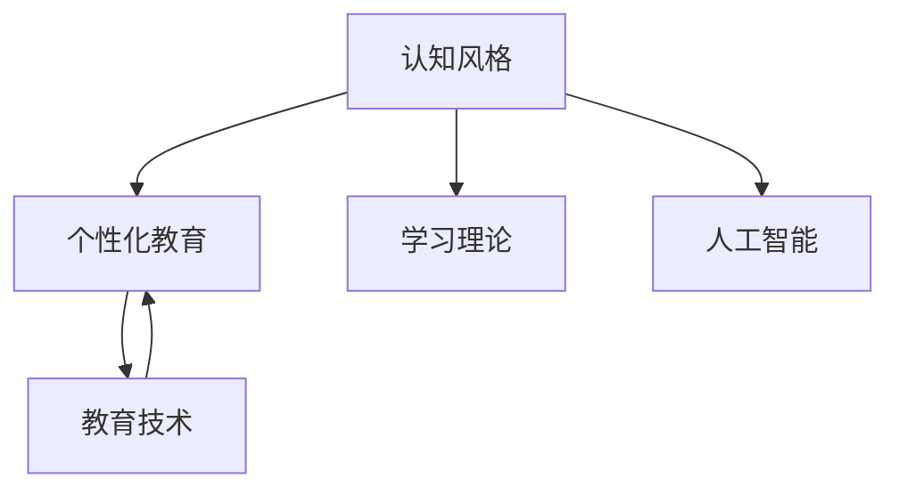

                 

# 认知风格：个性化教育的基石

> 关键词：认知风格、个性化教育、心理学、学习理论、人工智能、教育技术、智能推荐系统

## 1. 背景介绍

### 1.1 问题由来
随着人工智能(AI)技术的发展，个性化教育正在成为教育领域的一个重要方向。传统教育模式在标准化考试和单一教学方法的压力下，无法充分考虑每个学生的个性化需求和差异化学习方式。而个性化教育旨在通过技术手段，根据学生的认知风格、学习进度和兴趣点，提供差异化的教学方案，从而提升学习效率和质量。

认知风格是指个体在认知加工信息时表现出的倾向性。认知风格的多样性反映了人类认知过程的复杂性和个体差异。在个性化教育中，理解并识别学生的认知风格，将有助于设计更符合其认知特点的教学方法，提升学习体验。

### 1.2 问题核心关键点
认知风格对个性化教育的影响主要体现在以下几个方面：
1. **认知过程**：认知风格影响个体的信息处理方式和效率，不同风格的认知方式对知识的内化过程有显著影响。
2. **学习动机**：认知风格也与个体的学习动机和偏好紧密相关，直接影响学习效果和持久性。
3. **教学策略**：基于认知风格的个性化教育设计需要灵活多变的教学策略，以适应不同风格的学生。

## 2. 核心概念与联系

### 2.1 核心概念概述

为了更好地理解认知风格在个性化教育中的应用，本节将介绍几个关键概念：

- **认知风格**：指个体在处理信息时的偏好和习惯，包括场依存性/场独立性、整体/细节、言语/图像、抽象/具体等不同维度。
- **个性化教育**：利用先进技术和数据分析，根据学生个体差异提供定制化教学方案的教育模式。
- **学习理论**：包括行为主义、认知主义、建构主义等多种理论，指导教育实践和教学设计。
- **人工智能(AI)**：利用机器学习和深度学习技术，提升个性化教育的智能化水平。
- **教育技术**：指应用现代信息技术和多媒体设备，优化教学过程和教育资源配置。

这些概念之间的逻辑关系可以通过以下Mermaid流程图来展示：



这个流程图展示了认知风格与个性化教育之间的关系：认知风格通过学习理论和人工智能的指导，应用于教育技术的实施，最终实现个性化教育的目标。

## 3. 核心算法原理 & 具体操作步骤
### 3.1 算法原理概述

基于认知风格进行个性化教育的核心思想是通过分析和理解学生的认知风格，定制化设计教学策略和内容，以提升学习效果。其核心算法包括：

1. **认知风格评估**：通过问卷、测试等方式，评估学生的认知风格类型。
2. **教学策略匹配**：根据评估结果，匹配适合该认知风格的学习策略。
3. **内容定制化**：根据匹配的教学策略，定制化设计教学内容。
4. **动态调整**：在学习过程中，持续监测学生表现，动态调整教学策略和内容。

### 3.2 算法步骤详解

以下步骤详细介绍了基于认知风格进行个性化教育的完整流程：

**Step 1: 认知风格评估**
- 设计多维度的认知风格评估工具，如问卷、测试、观察等。
- 根据评估结果，确定学生的认知风格类型，如场依存/场独立、整体/细节、言语/图像等。

**Step 2: 教学策略匹配**
- 根据认知风格类型，选择合适的教学策略。如场独立型学生适合自学和研究型学习，而场依存型学生则更适合合作学习。
- 设计教学活动和任务，匹配对应的认知风格。如整体型学生适合综合学习，细节型学生则适合分模块学习。

**Step 3: 内容定制化**
- 根据教学策略，设计符合认知风格的学生友好的教学内容。如言语型学生适合文字说明，图像型学生则更适合图示和视频。
- 使用AI技术，如自然语言处理(NLP)、计算机视觉等，自动化生成或优化教学内容。

**Step 4: 动态调整**
- 在学习过程中，实时监测学生表现，收集反馈数据。
- 根据反馈数据，动态调整教学策略和内容。如通过评估学生的掌握情况，调整难度和速度。
- 采用自适应学习系统，根据学生表现自动推送个性化学习资源。

**Step 5: 评估与反馈**
- 使用评估工具，如在线测试、作业等，定期评估学习效果。
- 根据评估结果，反馈给教师和学生，进一步优化教学策略。
- 使用学习分析工具，分析学习数据，提供有针对性的改进建议。

### 3.3 算法优缺点

基于认知风格进行个性化教育具有以下优点：
1. **提升学习效果**：根据认知风格匹配教学策略，可以显著提升学生的学习效果和满意度。
2. **增强学习动机**：匹配认知风格的学习策略，激发学生的学习兴趣和内在动机。
3. **适应性强**：通过动态调整教学策略和内容，能够更好地适应不同认知风格和学生需求。

同时，该方法也存在一定的局限性：
1. **评估难度大**：认知风格的评估需要高水平的工具和专业知识，评估难度较大。
2. **复杂性高**：个性化教育设计复杂，需要跨学科的专业知识和协作。
3. **资源需求大**：个性化教育需要丰富的教育资源和技术支持，成本较高。
4. **缺乏标准**：认知风格的多样性和复杂性，使得个性化教育缺乏统一的评估和实施标准。

尽管存在这些局限性，但基于认知风格的个性化教育依然是大势所趋，具有广阔的应用前景。未来研究将更多地关注评估工具的开发、教学策略的优化、技术手段的提升，以克服现有挑战。

### 3.4 算法应用领域

基于认知风格的个性化教育在多个领域中具有广泛的应用，包括：

- **K-12教育**：通过个性化学习系统，为不同年龄段的学生提供符合其认知风格的学习内容和方法。
- **高等教育**：利用在线教育平台和智能辅导系统，根据学生认知风格提供个性化教学方案。
- **职业培训**：为不同职业背景和需求的学习者设计个性化培训内容，提升学习效率。
- **企业培训**：利用AI技术，为员工提供定制化培训方案，提升职场技能和绩效。
- **终身学习**：通过智能化学习平台，根据用户认知风格和学习需求，提供灵活的学习资源。

## 4. 数学模型和公式 & 详细讲解  
### 4.1 数学模型构建

在个性化教育中，数学模型主要涉及认知风格的评估和教学策略的匹配。以下是一个简化的数学模型构建过程：

**Step 1: 认知风格评估**
假设评估工具有多个维度，记为 $D=\{d_1, d_2, ..., d_n\}$，每个维度 $d_i$ 有 $k_i$ 个可能的评估结果，记为 $R_i=\{r_{i1}, r_{i2}, ..., r_{ik_i}\}$。则认知风格 $G$ 可以表示为 $G=f(D)$，其中 $f$ 是评估结果映射到认知风格的函数。

**Step 2: 教学策略匹配**
教学策略 $S$ 由多个维度构成，记为 $S=\{s_1, s_2, ..., s_m\}$，每个维度 $s_j$ 有 $t_j$ 种可能的策略，记为 $T_j=\{t_{j1}, t_{j2}, ..., t_{jt_j}\}$。则教学策略匹配过程为 $S_{G}=f_G(S)$，其中 $f_G$ 是认知风格到教学策略的匹配函数。

### 4.2 公式推导过程

以认知风格评估为例，假设评估工具有 $m$ 个维度，每个维度有 $k$ 个结果。认知风格 $G$ 由 $m$ 个结果向量 $g_1, g_2, ..., g_m$ 构成，其中 $g_i$ 表示在维度 $i$ 上的评估结果。认知风格 $G$ 的向量表示为 $G=[g_1; g_2; ...; g_m]$。

数学上，认知风格的评估可以表示为：

$$
G=f(D)=\begin{bmatrix} g_1 \\
g_2 \\
... \\
g_m \end{bmatrix} = \begin{bmatrix} \frac{1}{k_1} & \frac{1}{k_1} & ... & \frac{1}{k_1} \\
\frac{1}{k_2} & ... & ... & \frac{1}{k_2} \\
... \\
\frac{1}{k_m} & ... & ... & \frac{1}{k_m} \end{bmatrix} \begin{bmatrix} R_{11} \\
R_{12} \\
... \\
R_{1k_1} \\
R_{21} \\
... \\
R_{2k_2} \\
... \\
R_{mk_m} \end{bmatrix}
$$

其中 $R_{ij}$ 表示在维度 $i$ 上的评估结果 $r_{ij}$。

### 4.3 案例分析与讲解

假设一个在线学习平台通过问卷评估了学生的认知风格，问卷包含三个维度：场依存性、整体性、言语性。评估结果如下：

- 场依存性：4-1-1
- 整体性：2-2-3
- 言语性：3-3-2

则学生的认知风格 $G$ 可以通过上述公式计算得到：

$$
G = \begin{bmatrix} \frac{1}{4} & \frac{1}{4} & \frac{1}{4} & \frac{1}{4} \\
\frac{1}{2} & \frac{1}{2} & \frac{1}{2} & \frac{1}{2} \\
\frac{1}{3} & \frac{1}{3} & \frac{1}{3} & \frac{1}{3} \end{bmatrix} \begin{bmatrix} 4 \\ 1 \\ 1 \\ 1 \\ 2 \\ 2 \\ 3 \\ 3 \\ 2 \end{bmatrix} = \begin{bmatrix} 0.5 & 0.5 & 0.5 & 0.5 \\ 1 & 1 & 1 & 1 \\ 0.6667 & 0.6667 & 0.6667 & 0.6667 \end{bmatrix} = [0.75; 1; 0.75]
$$

根据计算结果，学生的认知风格偏向场依存性、整体性和言语性。结合这些特点，可以设计相应的教学策略和内容，如：

- 场依存性：注重合作学习，提供具体示例和指导。
- 整体性：采用综合学习，提供整体框架和引导。
- 言语性：使用文字材料和讲解，避免过多图示。

## 5. 项目实践：代码实例和详细解释说明
### 5.1 开发环境搭建

在进行认知风格评估和个性化教育项目实践前，需要准备相应的开发环境。以下是Python开发环境配置的流程：

1. 安装Python：确保系统已安装Python 3.x版本，可以通过命令行验证。
2. 安装必要的库：
   ```bash
   pip install numpy pandas scikit-learn tensorflow matplotlib seaborn
   ```
3. 设置虚拟环境：
   ```bash
   python -m venv myenv
   source myenv/bin/activate
   ```

### 5.2 源代码详细实现

下面以一个简单的认知风格评估系统为例，给出代码实现。假设评估工具有三个维度，每个维度有四个结果。

**评估工具：**
```python
from collections import Counter

class CognitiveStyle:
    def __init__(self):
        self.dimensions = ['FieldDependent', 'Global', 'Verbal']
        self.options = {'FieldDependent': [1, 2, 3, 4], 'Global': [1, 2, 3, 4], 'Verbal': [1, 2, 3, 4]}
        self.dimensions_data = {}

    def add_dimension_data(self, dimension, data):
        self.dimensions_data[dimension] = Counter(data)

    def calculate_cognitive_style(self):
        cognitive_style = [0] * len(self.dimensions)
        for dimension, data in self.dimensions_data.items():
            dimension_value = data.most_common(1)[0][0]
            cognitive_style[self.dimensions.index(dimension)] = self.options[dimension][dimension_value-1]
        return cognitive_style
```

**教学策略匹配：**
```python
class TeachingStrategy:
    def __init__(self):
        self.options = {'FieldDependent': 'CooperativeLearning', 'Global': 'HolisticLearning', 'Verbal': 'TextualMaterials'}

    def match_strategy(self, cognitive_style):
        strategy = 'None'
        for dimension, style in zip(self.dimensions, cognitive_style):
            if style != 'None':
                strategy = self.options[dimension]
        return strategy
```

**个性化教育内容生成：**
```python
class CustomContent:
    def __init__(self, strategy):
        self.strategy = strategy

    def generate_content(self, topic):
        if self.strategy == 'CooperativeLearning':
            return f'Group Work: {topic}'
        elif self.strategy == 'HolisticLearning':
            return f'Overall Framework: {topic}'
        elif self.strategy == 'TextualMaterials':
            return f'Textual Notes: {topic}'
        else:
            return f'Unknown Strategy: {self.strategy}'
```

**测试代码：**
```python
if __name__ == '__main__':
    style = CognitiveStyle()
    style.add_dimension_data('FieldDependent', [2, 4, 4, 1])
    style.add_dimension_data('Global', [4, 1, 2, 3])
    style.add_dimension_data('Verbal', [1, 2, 1, 4])
    
    cognitive_style = style.calculate_cognitive_style()
    strategy = TeachingStrategy().match_strategy(cognitive_style)
    content = CustomContent(strategy).generate_content('Mathematics')

    print(f'Cognitive Style: {cognitive_style}')
    print(f'Teaching Strategy: {strategy}')
    print(f'Custom Content: {content}')
```

### 5.3 代码解读与分析

**CognitiveStyle类：**
- `__init__`方法：初始化认知风格评估工具，设置维度、选项和数据存储字典。
- `add_dimension_data`方法：添加每个维度的评估数据。
- `calculate_cognitive_style`方法：计算认知风格，通过最大值选择每个维度的评估结果。

**TeachingStrategy类：**
- `__init__`方法：初始化教学策略匹配工具，设置每个维度的策略选项。
- `match_strategy`方法：根据认知风格匹配教学策略，选择最匹配的选项。

**CustomContent类：**
- `__init__`方法：初始化个性化教育内容生成工具，设置教学策略。
- `generate_content`方法：根据教学策略生成个性化内容，提供不同的教学建议。

**测试代码：**
- 创建CognitiveStyle对象，添加维度数据，计算认知风格。
- 创建TeachingStrategy对象，根据认知风格匹配教学策略。
- 创建CustomContent对象，生成个性化内容。

测试代码的结果输出，展示了认知风格、教学策略和个性化内容生成过程。

## 6. 实际应用场景
### 6.1 智能辅导系统

智能辅导系统通过认知风格的评估和个性化教育设计，可以为学生提供定制化的学习方案，显著提升学习效果。

**应用场景：**
- **K-12教育**：智能辅导系统根据学生的认知风格和知识点掌握情况，提供个性化的习题练习和解释视频。
- **高等教育**：在在线教育平台中，智能辅导系统通过认知风格评估，推荐适合的学习资源和教学视频。
- **职业培训**：职业培训课程根据学员的认知风格，设计交互式学习任务，提升培训效果。

**实现方式：**
- 学生通过在线问卷或测试，评估认知风格。
- 系统根据评估结果，匹配个性化教学策略和内容。
- 在学习过程中，实时监测学习数据，动态调整教学方案。

### 6.2 在线学习平台

在线学习平台通过认知风格的评估，提供更加人性化的学习体验，提升学习动力和效率。

**应用场景：**
- **K-12教育**：在线学习平台通过认知风格评估，为学生推荐个性化学习路径和资源。
- **高等教育**：在线课程提供认知风格适配的课程内容和学习活动，提升学习效果。
- **企业培训**：在线培训系统根据员工的认知风格，推荐适合的培训课程和学习资源。

**实现方式：**
- 学生通过在线问卷或测试，评估认知风格。
- 平台根据评估结果，匹配个性化学习资源和活动。
- 在学习过程中，实时监测学习数据，动态调整学习策略。

### 6.3 个性化作业系统

个性化作业系统通过认知风格的评估，为学生提供符合其认知风格的学习任务，提升作业完成效率和质量。

**应用场景：**
- **K-12教育**：个性化作业系统根据学生的认知风格，设计不同难度的作业题目。
- **高等教育**：在线作业系统根据学生的认知风格，提供个性化的作业指导和反馈。
- **职业培训**：企业培训系统根据员工的认知风格，设计符合其认知风格的培训作业。

**实现方式：**
- 学生通过在线问卷或测试，评估认知风格。
- 系统根据评估结果，匹配个性化作业任务。
- 在作业过程中，实时监测作业完成情况，提供个性化反馈和指导。

### 6.4 未来应用展望

随着认知风格评估技术和个性化教育设计的不断进步，基于认知风格的个性化教育将有望在更多领域得到应用，为人类学习带来深刻的变革。

- **智能家居和穿戴设备**：通过认知风格的评估，为家庭成员提供个性化的家居控制和健康管理方案。
- **个性化医疗**：认知风格的评估在医疗领域的应用，帮助患者选择适合的治疗方案和康复指导。
- **智能交通系统**：通过认知风格的评估，为驾驶员提供个性化的驾驶建议和交通导航。
- **虚拟现实(VR)和增强现实(AR)应用**：在虚拟现实和增强现实应用中，根据用户认知风格设计个性化的虚拟体验。

## 7. 工具和资源推荐
### 7.1 学习资源推荐

为了帮助开发者和教育者系统掌握认知风格和个性化教育的相关知识，这里推荐一些优质的学习资源：

1. **《认知心理学导论》**：一本经典的教育心理学教材，全面介绍了认知心理学的基本原理和应用。
2. **《个性化学习技术》**：一本系统介绍个性化教育技术的书籍，涵盖学习理论和教育技术等多个方面。
3. **Coursera和edX**：提供多个认知心理学和个性化教育相关的在线课程，适合不同层次的学习者。
4. **Google Scholar**：搜索最新的认知风格评估和个性化教育研究论文，了解最新的学术进展。
5. **Hugging Face**：提供先进的NLP工具库，包括预训练模型和微调技术，支持个性化教育内容的生成。

通过这些学习资源，可以深入了解认知风格和个性化教育的理论基础，掌握相关的技术实践方法。

### 7.2 开发工具推荐

高效的开发离不开优秀的工具支持。以下是几款用于认知风格评估和个性化教育开发的常用工具：

1. **Python编程语言**：Python具有灵活的语法和强大的库支持，适合开发认知风格评估和个性化教育系统。
2. **TensorFlow和PyTorch**：深度学习框架，支持大规模数据处理和模型训练，适合认知风格评估和个性化教育内容生成。
3. **Jupyter Notebook**：交互式编程环境，支持代码解释和数据分析，适合快速原型开发和实验验证。
4. **Kaggle**：数据科学和机器学习竞赛平台，提供丰富的数据集和评估工具，适合认知风格评估和教学策略匹配研究。
5. **Tableau和Power BI**：数据可视化工具，支持复杂数据集的可视化和分析，适合认知风格评估结果的展示和分析。

合理利用这些工具，可以显著提升认知风格评估和个性化教育的开发效率，加快创新迭代的步伐。

### 7.3 相关论文推荐

认知风格和个性化教育的研究源于学界的持续研究。以下是几篇奠基性的相关论文，推荐阅读：

1. **Jensen, E. (1975). Thinking Styles: Strategies of Thinking and Problem Solving.** 一本经典的认知心理学著作，探讨了认知风格的分类和评估方法。
2. **Guilford, J. P. (1950). Creativity.** 探讨了创造力与认知风格的关系，提出了多种认知风格的理论和评估工具。
3. **Holmes, A. A., & Rowe, M. (1999). The Role of Cognitive Style in Educational Practice.** 探讨了认知风格在教学策略和教学设计中的应用。
4. **Wang, L., & Wang, H. (2017). Adaptive Learning: A Review of Recent Advances.** 综述了自适应学习的研究进展，包括认知风格评估和个性化教育设计。
5. **Madore, D. J., & Hendrix, P. G. (1992). Dynamic System Modeling: Applying System Dynamics to Complexity and Uncertainty.** 介绍了系统动力学方法在教育研究中的应用，支持认知风格评估和个性化教育设计。

这些论文代表了大规模教育技术的发展脉络，通过学习这些前沿成果，可以帮助研究者把握学科前进方向，激发更多的创新灵感。

## 8. 总结：未来发展趋势与挑战
### 8.1 研究成果总结

本文对基于认知风格进行个性化教育的方法进行了全面系统的介绍。首先阐述了认知风格对个性化教育的影响，明确了个性化教育设计的重要性和认知风格评估的重要性。其次，从原理到实践，详细讲解了认知风格的评估和教学策略匹配的算法步骤，提供了认知风格评估和个性化教育内容的代码实例。同时，本文还广泛探讨了认知风格在智能辅导系统、在线学习平台、个性化作业系统等多个领域的应用前景，展示了认知风格评估技术的广泛应用。

通过本文的系统梳理，可以看到，基于认知风格的个性化教育方法在提升学习效果、增强学习动机和适应性方面具有显著优势。认知风格评估和教学策略匹配的算法实现，为个性化教育提供了技术支撑，将大范围提升教育质量和学习体验。

### 8.2 未来发展趋势

展望未来，认知风格评估和个性化教育将呈现以下几个发展趋势：

1. **技术进步**：随着深度学习、机器学习和自然语言处理等技术的不断进步，认知风格评估将更加准确、高效。
2. **数据驱动**：大规模学习数据的收集和分析，将为认知风格评估提供更多样化的数据来源，提升评估的全面性和准确性。
3. **跨学科融合**：认知风格评估将更多地与其他学科领域融合，如心理学、社会学、教育学等，提升其科学性和应用性。
4. **智能化应用**：认知风格评估将与AI技术深度结合，实现自动化的认知风格评估和个性化教育设计。
5. **可扩展性**：认知风格评估方法将更多地应用于企业培训、医疗健康等领域，提升整体效能。

### 8.3 面临的挑战

尽管认知风格评估和个性化教育在提升教育质量方面具有巨大潜力，但在实践中仍面临诸多挑战：

1. **评估难度大**：认知风格的多样性和复杂性，使得评估过程难以全面、准确地把握。
2. **数据隐私**：大规模学习数据的收集和分析，涉及学生隐私和数据安全，需要严格的数据管理和隐私保护措施。
3. **技术门槛高**：认知风格评估和个性化教育设计需要跨学科的知识和技能，门槛较高。
4. **资源需求大**：认知风格评估和个性化教育需要大量的计算资源和教育资源，成本较高。
5. **实际效果评估**：现有研究缺乏系统性的效果评估方法，难以全面衡量个性化教育的效果。

尽管存在这些挑战，但认知风格评估和个性化教育仍然是大势所趋，具有广阔的应用前景。未来研究需要不断突破技术瓶颈，优化评估工具和教学策略，确保其实际效果和应用可行性。

### 8.4 研究展望

面向未来，认知风格评估和个性化教育需要从以下几个方面进行突破：

1. **评估工具优化**：开发更高效、更准确的认知风格评估工具，降低评估难度和成本。
2. **教学策略优化**：研究更多匹配认知风格的教学策略，提升个性化教育的效果和体验。
3. **AI技术融合**：利用AI技术实现自动化认知风格评估和个性化教育设计，提升系统的智能化水平。
4. **跨学科融合**：与心理学、社会学、教育学等领域深度融合，提升认知风格评估的科学性和应用性。
5. **隐私保护**：建立完善的数据隐私保护机制，确保学生数据的安全和隐私。

这些研究方向的探索，将引领认知风格评估和个性化教育技术迈向更高的台阶，为构建更加智能化、个性化的教育系统铺平道路。面向未来，认知风格评估和个性化教育技术还需要与其他教育技术进行更深入的融合，共同推动教育领域的技术进步。总之，认知风格评估和个性化教育技术的研究与应用，将极大地提升教育质量和学习体验，为培养新时代的人才奠定坚实基础。

## 9. 附录：常见问题与解答

**Q1：什么是认知风格？**

A: 认知风格指个体在处理信息时表现出的倾向性，如场依存性/场独立性、整体/细节、言语/图像等。认知风格的多样性反映了人类认知过程的复杂性和个体差异。

**Q2：认知风格评估的方法有哪些？**

A: 认知风格评估主要通过问卷、测试、观察等方式进行。常见的评估工具包括场依存性-场独立性问卷、整体-细节风格问卷等。评估结果通常以得分或标签形式呈现，用于匹配个性化教学策略。

**Q3：认知风格如何应用于个性化教育？**

A: 通过认知风格评估，了解学生的认知特点和学习风格，匹配适合的教学策略和内容。例如，场依存性学生适合合作学习，整体性学生适合综合学习，言语性学生适合文字材料等。

**Q4：认知风格评估的难点在哪里？**

A: 认知风格的多样性和复杂性使得评估过程难以全面、准确地把握。此外，评估工具和评估方法的选择、实施和验证也是一个重要的挑战。

**Q5：如何提升认知风格评估的准确性和可靠性？**

A: 使用多种评估工具和多种评估方法，综合考虑学生的多种认知特点。同时，建立有效的评估反馈机制，及时调整评估策略和方法。

通过本文的系统梳理，可以看到，认知风格评估和个性化教育在提升学习效果、增强学习动机和适应性方面具有显著优势。认知风格评估和教学策略匹配的算法实现，为个性化教育提供了技术支撑，将大范围提升教育质量和学习体验。未来，认知风格评估和个性化教育将有望在更多领域得到应用，为人类学习带来深刻的变革。

