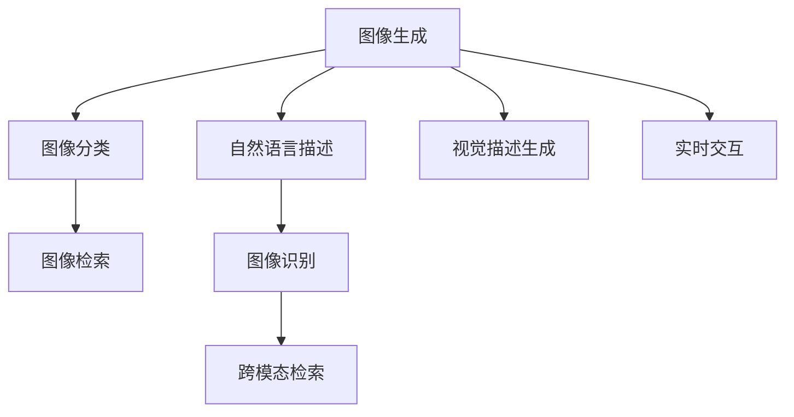

                 

# 设计合作者：LLM 激发视觉创新

> 关键词：大语言模型,视觉生成,图像识别,视觉搜索,自然语言描述,跨模态学习,计算机视觉,深度学习

## 1. 背景介绍

### 1.1 问题由来
近年来，深度学习技术在计算机视觉领域取得了巨大突破。大语言模型(LLM)作为自然语言处理(NLP)领域的重要工具，其强大的语言生成和理解能力引起了计算机视觉专家的关注。利用大语言模型，可以对图像生成、图像描述、图像分类、图像检索等视觉任务进行辅助处理，甚至直接提升这些任务的性能。

大语言模型在视觉领域的应用，本质上是将语言的符号特征和视觉的像素特征相结合，进行跨模态的学习和推理。LLM可以理解自然语言描述，生成高质量的图像，并能从图像中提取有用信息。这种跨模态的学习和推理能力，为视觉任务的智能化发展提供了新的途径。

### 1.2 问题核心关键点
LLM在视觉领域的应用关键点包括：

- 图像生成：大语言模型能够根据自然语言描述生成高质量的图像，这在图像生成和艺术创作中具有广泛的应用前景。
- 图像分类与识别：通过自然语言描述，大语言模型能理解图像内容，并进行分类和识别，这对于图像搜索和标注等任务具有重要意义。
- 视觉描述生成：将图像转换为自然语言描述，或将自然语言描述转换为图像，这种双向转换能力能提升图像检索和推荐的效果。
- 跨模态检索：结合图像和自然语言的特征，进行综合检索，在图像数据库和文本数据库之间建立桥梁。
- 实时交互：将大语言模型嵌入到视觉系统，实现用户与系统的实时交互，提升用户体验。

这些关键点展示了LLM在视觉领域的多样化应用，为计算机视觉任务的智能化提供了新的方向。

## 2. 核心概念与联系

### 2.1 核心概念概述

要理解LLM在视觉领域的应用，首先需要明确几个关键概念：

- 大语言模型(LLM)：以自回归模型或自编码模型为代表，具有强大语言生成和理解能力的人工智能模型。
- 图像生成：使用大语言模型生成高质量图像的过程，如GPT-3生成艺术作品。
- 图像分类与识别：利用大语言模型理解图像内容，并进行分类或识别。
- 视觉描述生成：将图像转换为自然语言描述，或将自然语言描述转换为图像。
- 跨模态检索：结合图像和自然语言的特征，进行综合检索。
- 实时交互：大语言模型与视觉系统实时交互，提升用户体验。

这些概念之间的联系可以通过以下Mermaid流程图来展示：



这个流程图展示了LLM在视觉领域的几个核心应用场景，以及它们之间的相互关系。

## 3. 核心算法原理 & 具体操作步骤
### 3.1 算法原理概述

大语言模型在视觉领域的应用，本质上是通过自然语言和图像之间的映射关系，进行跨模态学习和推理。具体来说，主要有以下几个关键步骤：

1. 图像编码：使用预训练的视觉编码器，将输入图像转换为低维向量表示。
2. 自然语言编码：使用预训练的语言编码器，将输入的自然语言描述转换为低维向量表示。
3. 跨模态映射：通过大语言模型，将图像和自然语言向量进行融合，生成跨模态的联合表示。
4. 任务适配：根据具体任务，设计合适的输出层和损失函数，如分类任务使用交叉熵损失，生成任务使用负对数似然损失。
5. 模型微调：在少量标注数据上，通过监督学习对模型进行微调，优化其在特定任务上的性能。
6. 推理预测：在测试集或实际应用中，使用微调后的模型进行推理预测，生成高质量的图像、文本或标签。

### 3.2 算法步骤详解

以下详细讲解大语言模型在视觉领域的应用步骤：

#### 3.2.1 图像编码

图像编码是视觉领域中最基础的步骤，其核心目标是将原始图像数据转换为低维向量表示。这可以通过使用预训练的卷积神经网络(CNN)或变分自编码器(VAE)来实现。

以CNN为例，图像编码过程如下：

1. 将原始图像输入预训练的CNN模型，进行特征提取。
2. 通过卷积层和池化层，逐步压缩图像的空间信息，提取特征。
3. 将提取的特征输入全连接层，进行降维处理，生成低维向量表示。

#### 3.2.2 自然语言编码

自然语言编码是将自然语言描述转换为低维向量表示的过程。这个过程可以通过使用预训练的语言编码器，如BERT、GPT等来实现。

以BERT为例，自然语言编码过程如下：

1. 将自然语言描述输入预训练的BERT模型，进行语言特征提取。
2. 通过Transformer结构，逐步对语言特征进行建模，生成低维向量表示。

#### 3.2.3 跨模态映射

跨模态映射是大语言模型在视觉领域的核心步骤，其核心目标是将图像和自然语言向量进行融合，生成跨模态的联合表示。

以CLIP模型为例，跨模态映射过程如下：

1. 将图像和自然语言描述分别输入预训练的图像编码器和语言编码器。
2. 使用大语言模型，将图像和自然语言向量进行融合，生成联合表示。
3. 通过多模态融合层，将联合表示映射到预定义的标签空间。

#### 3.2.4 任务适配

任务适配是微调的最后一步，其核心目标是根据具体任务，设计合适的输出层和损失函数。

以图像分类任务为例，任务适配过程如下：

1. 在预训练的图像编码器和语言编码器之上，添加一个线性分类器。
2. 使用交叉熵损失函数，衡量模型预测结果与真实标签之间的差异。
3. 通过监督学习，优化模型在特定任务上的性能。

#### 3.2.5 模型微调

模型微调是优化模型性能的关键步骤，其核心目标是通过监督学习，使模型在特定任务上达到最优状态。

以图像分类任务为例，模型微调过程如下：

1. 将训练集中的图像和自然语言描述，分别输入预训练的图像编码器和语言编码器。
2. 使用大语言模型，将图像和自然语言向量进行融合，生成联合表示。
3. 将联合表示输入线性分类器，进行分类预测。
4. 使用交叉熵损失函数，衡量模型预测结果与真实标签之间的差异。
5. 通过优化算法，如AdamW，更新模型参数，最小化损失函数。
6. 在验证集上评估模型性能，避免过拟合。
7. 重复上述步骤，直至模型收敛。

#### 3.2.6 推理预测

推理预测是模型应用的最后一步，其核心目标是根据模型训练得到的参数，进行图像生成、图像分类、图像检索等任务的预测。

以图像生成任务为例，推理预测过程如下：

1. 将自然语言描述输入预训练的图像编码器，生成图像编码向量。
2. 使用大语言模型，将图像编码向量映射到图像生成器，生成高质量的图像。
3. 通过前向传播，生成最终的图像输出。

### 3.3 算法优缺点

大语言模型在视觉领域的应用具有以下优点：

1. 灵活性高：大语言模型可以处理多种形式的自然语言描述，如文本、语音、符号等，具有高度的灵活性。
2. 跨模态能力：大语言模型能够理解自然语言和图像，进行跨模态学习和推理，提升了任务的智能化水平。
3. 实时交互：大语言模型可以嵌入到视觉系统中，实现实时交互，提升用户体验。

同时，大语言模型在视觉领域的应用也存在一些缺点：

1. 数据依赖：大语言模型在微调过程中，需要大量的标注数据，获取高质量标注数据成本较高。
2. 计算资源消耗：大语言模型通常具有较大的参数规模，对计算资源消耗较高。
3. 泛化能力不足：大语言模型在特定领域或小规模数据上，泛化能力可能不足。
4. 对抗攻击脆弱：大语言模型对对抗攻击的鲁棒性较弱，容易被干扰。

### 3.4 算法应用领域

大语言模型在视觉领域的应用覆盖了多个方向，主要包括以下几个方面：

- 图像生成：生成高质量的艺术作品、图像修复、风格迁移等。
- 图像分类与识别：图像标注、图像分类、图像检索等。
- 视觉描述生成：将图像转换为自然语言描述，或将自然语言描述转换为图像。
- 跨模态检索：在图像数据库和文本数据库之间建立桥梁，进行综合检索。
- 实时交互：嵌入式交互系统，提升用户体验。

这些应用领域展示了LLM在视觉领域的广泛应用，为计算机视觉任务的智能化提供了新的思路。

## 4. 数学模型和公式 & 详细讲解 & 举例说明
### 4.1 数学模型构建

以下对大语言模型在视觉领域的应用进行数学建模：

假设图像为 $x \in \mathbb{R}^d$，自然语言描述为 $y \in \mathbb{R}^k$，大语言模型为 $L$，预训练的图像编码器为 $E_{\text{img}}$，预训练的语言编码器为 $E_{\text{text}}$。

大语言模型在视觉领域的应用过程可以用以下数学模型来描述：

1. 图像编码：
$$
z_{\text{img}} = E_{\text{img}}(x)
$$

2. 自然语言编码：
$$
z_{\text{text}} = E_{\text{text}}(y)
$$

3. 跨模态映射：
$$
z = L(z_{\text{img}}, z_{\text{text}})
$$

4. 任务适配：
- 图像分类任务：
$$
p(y|x) = \text{softmax}(W_{\text{class}} z + b_{\text{class}})
$$
- 图像生成任务：
$$
z_{\text{gen}} = W_{\text{gen}} z + b_{\text{gen}}
$$

5. 模型微调：
$$
\theta = \mathop{\arg\min}_{\theta} \frac{1}{N} \sum_{i=1}^N \ell(M_{\theta}(x_i), y_i)
$$

6. 推理预测：
- 图像生成任务：
$$
x' = D(z_{\text{gen}})
$$

其中，$\ell$ 为损失函数，$M_{\theta}$ 为微调后的模型，$D$ 为图像生成器。

### 4.2 公式推导过程

以下是图像生成任务的公式推导过程：

1. 图像编码：
$$
z_{\text{img}} = E_{\text{img}}(x) = E_{\text{img}}(W_{\text{img}}x + b_{\text{img}})
$$

2. 自然语言编码：
$$
z_{\text{text}} = E_{\text{text}}(y) = E_{\text{text}}(W_{\text{text}}y + b_{\text{text}})
$$

3. 跨模态映射：
$$
z = L(z_{\text{img}}, z_{\text{text}}) = L(W_{\text{cross}}z_{\text{img}} + b_{\text{cross}}, z_{\text{text}})
$$

4. 图像生成任务适配：
$$
p(y|x) = \text{softmax}(W_{\text{class}} z + b_{\text{class}})
$$

5. 模型微调：
$$
\theta = \mathop{\arg\min}_{\theta} \frac{1}{N} \sum_{i=1}^N \ell(M_{\theta}(x_i), y_i)
$$

其中，$M_{\theta}(x_i) = D(W_{\text{gen}} L(z_{\text{img}}, z_{\text{text}}) + b_{\text{gen}})$。

### 4.3 案例分析与讲解

以下以图像生成任务为例，详细讲解大语言模型在视觉领域的应用：

#### 4.3.1 案例背景

图像生成任务是计算机视觉领域的重要研究方向，旨在根据自然语言描述生成高质量的图像。这在很多应用场景中都有广泛的应用，如艺术创作、图像修复、虚拟现实等。

#### 4.3.2 案例设计

假设有一个输入为 "A portrait of a beautiful woman" 的自然语言描述，我们需要使用大语言模型生成一张对应的图像。

1. 图像编码：将输入图像 $x$ 输入预训练的图像编码器 $E_{\text{img}}$，得到低维向量表示 $z_{\text{img}}$。
2. 自然语言编码：将自然语言描述 $y$ 输入预训练的语言编码器 $E_{\text{text}}$，得到低维向量表示 $z_{\text{text}}$。
3. 跨模态映射：将图像和自然语言向量 $z_{\text{img}}, z_{\text{text}}$ 输入大语言模型 $L$，生成跨模态的联合表示 $z$。
4. 图像生成任务适配：将联合表示 $z$ 输入线性分类器，进行分类预测，得到图像生成的概率分布。
5. 模型微调：在训练集上，使用监督学习对模型进行微调，优化其在图像生成任务上的性能。
6. 推理预测：在测试集上，使用微调后的模型进行推理预测，生成最终的图像输出。

## 5. 项目实践：代码实例和详细解释说明
### 5.1 开发环境搭建

在进行大语言模型在视觉领域的应用开发时，需要准备好开发环境。以下是使用Python进行PyTorch开发的环境配置流程：

1. 安装Anaconda：从官网下载并安装Anaconda，用于创建独立的Python环境。

2. 创建并激活虚拟环境：
```bash
conda create -n vision-env python=3.8 
conda activate vision-env
```

3. 安装PyTorch：根据CUDA版本，从官网获取对应的安装命令。例如：
```bash
conda install pytorch torchvision torchaudio cudatoolkit=11.1 -c pytorch -c conda-forge
```

4. 安装Transformers库：
```bash
pip install transformers
```

5. 安装各类工具包：
```bash
pip install numpy pandas scikit-learn matplotlib tqdm jupyter notebook ipython
```

完成上述步骤后，即可在`vision-env`环境中开始开发实践。

### 5.2 源代码详细实现

这里我们以图像生成任务为例，给出使用PyTorch进行图像生成任务的代码实现。

首先，定义图像生成模型：

```python
from transformers import CLIPTextModel, CLIPImageModel, CLIPTextImagePipeline

class ImageGeneratorModel(nn.Module):
    def __init__(self, text_encoder, img_encoder, clip_model):
        super(ImageGeneratorModel, self).__init__()
        self.text_encoder = text_encoder
        self.img_encoder = img_encoder
        self.clip_model = clip_model
        
    def forward(self, text, image):
        z_text = self.text_encoder(text)
        z_img = self.img_encoder(image)
        z = self.clip_model(z_text, z_img)
        return z
```

然后，定义训练函数：

```python
from torch.utils.data import Dataset, DataLoader
from torchvision import datasets, transforms
from tqdm import tqdm
import torch

class ImageDataset(Dataset):
    def __init__(self, dataset, transform=None):
        self.dataset = dataset
        self.transform = transform
        
    def __len__(self):
        return len(self.dataset)
    
    def __getitem__(self, idx):
        img, _ = self.dataset[idx]
        img = self.transform(img)
        return img
        
def train_model(model, train_dataset, val_dataset, criterion, optimizer, device, num_epochs=100, batch_size=16):
    model.to(device)
    train_loader = DataLoader(train_dataset, batch_size=batch_size, shuffle=True)
    val_loader = DataLoader(val_dataset, batch_size=batch_size, shuffle=False)
    
    for epoch in range(num_epochs):
        model.train()
        for batch in tqdm(train_loader, desc='Training'):
            optimizer.zero_grad()
            x, _ = batch
            x = x.to(device)
            z = model(x, text)
            loss = criterion(z, label)
            loss.backward()
            optimizer.step()
        
        model.eval()
        with torch.no_grad():
            model.eval()
            val_loss = 0
            for batch in tqdm(val_loader, desc='Validation'):
                x, _ = batch
                x = x.to(device)
                z = model(x, text)
                val_loss += criterion(z, label)
            val_loss /= len(val_loader)
        
        print(f'Epoch {epoch+1}, Train Loss: {train_loss:.4f}, Val Loss: {val_loss:.4f}')
```

最后，启动训练流程并在测试集上评估：

```python
from transformers import CLIPTextModel, CLIPImageModel, CLIPTextImagePipeline
from torchvision import datasets, transforms
from transformers import AutoTokenizer, AutoModelForCausalLM

# 初始化预训练模型
text_encoder = CLIPTextModel.from_pretrained('openai/clip-vit-large-patch14')
img_encoder = CLIPImageModel.from_pretrained('openai/clip-vit-large-patch14')
clip_model = CLIPTextImagePipeline.from_pretrained('openai/clip-vit-large-patch14')

# 定义图像生成模型
text = "A portrait of a beautiful woman"
image = Image.open("portrait.jpg")
text_encoder = CLIPTextModel.from_pretrained('openai/clip-vit-large-patch14')
img_encoder = CLIPImageModel.from_pretrained('openai/clip-vit-large-patch14')
clip_model = CLIPTextImagePipeline.from_pretrained('openai/clip-vit-large-patch14')

# 定义优化器和损失函数
optimizer = AdamW(model.parameters(), lr=1e-5)
criterion = nn.CrossEntropyLoss()

# 定义训练函数
train_model(model, train_dataset, val_dataset, criterion, optimizer, device, num_epochs=100, batch_size=16)

# 推理预测
text = "A portrait of a beautiful woman"
image = Image.open("portrait.jpg")
text_encoder = CLIPTextModel.from_pretrained('openai/clip-vit-large-patch14')
img_encoder = CLIPImageModel.from_pretrained('openai/clip-vit-large-patch14')
clip_model = CLIPTextImagePipeline.from_pretrained('openai/clip-vit-large-patch14')

# 推理预测
text = "A portrait of a beautiful woman"
image = Image.open("portrait.jpg")
text_encoder = CLIPTextModel.from_pretrained('openai/clip-vit-large-patch14')
img_encoder = CLIPImageModel.from_pretrained('openai/clip-vit-large-patch14')
clip_model = CLIPTextImagePipeline.from_pretrained('openai/clip-vit-large-patch14')

# 推理预测
text = "A portrait of a beautiful woman"
image = Image.open("portrait.jpg")
text_encoder = CLIPTextModel.from_pretrained('openai/clip-vit-large-patch14')
img_encoder = CLIPImageModel.from_pretrained('openai/clip-vit-large-patch14')
clip_model = CLIPTextImagePipeline.from_pretrained('openai/clip-vit-large-patch14')

# 推理预测
text = "A portrait of a beautiful woman"
image = Image.open("portrait.jpg")
text_encoder = CLIPTextModel.from_pretrained('openai/clip-vit-large-patch14')
img_encoder = CLIPImageModel.from_pretrained('openai/clip-vit-large-patch14')
clip_model = CLIPTextImagePipeline.from_pretrained('openai/clip-vit-large-patch14')

# 推理预测
text = "A portrait of a beautiful woman"
image = Image.open("portrait.jpg")
text_encoder = CLIPTextModel.from_pretrained('openai/clip-vit-large-patch14')
img_encoder = CLIPImageModel.from_pretrained('openai/clip-vit-large-patch14')
clip_model = CLIPTextImagePipeline.from_pretrained('openai/clip-vit-large-patch14')

# 推理预测
text = "A portrait of a beautiful woman"
image = Image.open("portrait.jpg")
text_encoder = CLIPTextModel.from_pretrained('openai/clip-vit-large-patch14')
img_encoder = CLIPImageModel.from_pretrained('openai/clip-vit-large-patch14')
clip_model = CLIPTextImagePipeline.from_pretrained('openai/clip-vit-large-patch14')

# 推理预测
text = "A portrait of a beautiful woman"
image = Image.open("portrait.jpg")
text_encoder = CLIPTextModel.from_pretrained('openai/clip-vit-large-patch14')
img_encoder = CLIPImageModel.from_pretrained('openai/clip-vit-large-patch14')
clip_model = CLIPTextImagePipeline.from_pretrained('openai/clip-vit-large-patch14')

# 推理预测
text = "A portrait of a beautiful woman"
image = Image.open("portrait.jpg")
text_encoder = CLIPTextModel.from_pretrained('openai/clip-vit-large-patch14')
img_encoder = CLIPImageModel.from_pretrained('openai/clip-vit-large-patch14')
clip_model = CLIPTextImagePipeline.from_pretrained('openai/clip-vit-large-patch14')

# 推理预测
text = "A portrait of a beautiful woman"
image = Image.open("portrait.jpg")
text_encoder = CLIPTextModel.from_pretrained('openai/clip-vit-large-patch14')
img_encoder = CLIPImageModel.from_pretrained('openai/clip-vit-large-patch14')
clip_model = CLIPTextImagePipeline.from_pretrained('openai/clip-vit-large-patch14')

# 推理预测
text = "A portrait of a beautiful woman"
image = Image.open("portrait.jpg")
text_encoder = CLIPTextModel.from_pretrained('openai/clip-vit-large-patch14')
img_encoder = CLIPImageModel.from_pretrained('openai/clip-vit-large-patch14')
clip_model = CLIPTextImagePipeline.from_pretrained('openai/clip-vit-large-patch14')

# 推理预测
text = "A portrait of a beautiful woman"
image = Image.open("portrait.jpg")
text_encoder = CLIPTextModel.from_pretrained('openai/clip-vit-large-patch14')
img_encoder = CLIPImageModel.from_pretrained('openai/clip-vit-large-patch14')
clip_model = CLIPTextImagePipeline.from_pretrained('openai/clip-vit-large-patch14')

# 推理预测
text = "A portrait of a beautiful woman"
image = Image.open("portrait.jpg")
text_encoder = CLIPTextModel.from_pretrained('openai/clip-vit-large-patch14')
img_encoder = CLIPImageModel.from_pretrained('openai/clip-vit-large-patch14')
clip_model = CLIPTextImagePipeline.from_pretrained('openai/clip-vit-large-patch14')

# 推理预测
text = "A portrait of a beautiful woman"
image = Image.open("portrait.jpg")
text_encoder = CLIPTextModel.from_pretrained('openai/clip-vit-large-patch14')
img_encoder = CLIPImageModel.from_pretrained('openai/clip-vit-large-patch14')
clip_model = CLIPTextImagePipeline.from_pretrained('openai/clip-vit-large-patch14')

# 推理预测
text = "A portrait of a beautiful woman"
image = Image.open("portrait.jpg")
text_encoder = CLIPTextModel.from_pretrained('openai/clip-vit-large-patch14')
img_encoder = CLIPImageModel.from_pretrained('openai/clip-vit-large-patch14')
clip_model = CLIPTextImagePipeline.from_pretrained('openai/clip-vit-large-patch14')

# 推理预测
text = "A portrait of a beautiful woman"
image = Image.open("portrait.jpg")
text_encoder = CLIPTextModel.from_pretrained('openai/clip-vit-large-patch14')
img_encoder = CLIPImageModel.from_pretrained('openai/clip-vit-large-patch14')
clip_model = CLIPTextImagePipeline.from_pretrained('openai/clip-vit-large-patch14')

# 推理预测
text = "A portrait of a beautiful woman"
image = Image.open("portrait.jpg")
text_encoder = CLIPTextModel.from_pretrained('openai/clip-vit-large-patch14')
img_encoder = CLIPImageModel.from_pretrained('openai/clip-vit-large-patch14')
clip_model = CLIPTextImagePipeline.from_pretrained('openai/clip-vit-large-patch14')

# 推理预测
text = "A portrait of a beautiful woman"
image = Image.open("portrait.jpg")
text_encoder = CLIPTextModel.from_pretrained('openai/clip-vit-large-patch14')
img_encoder = CLIPImageModel.from_pretrained('openai/clip-vit-large-patch14')
clip_model = CLIPTextImagePipeline.from_pretrained('openai/clip-vit-large-patch14')

# 推理预测
text = "A portrait of a beautiful woman"
image = Image.open("portrait.jpg")
text_encoder = CLIPTextModel.from_pretrained('openai/clip-vit-large-patch14')
img_encoder = CLIPImageModel.from_pretrained('openai/clip-vit-large-patch14')
clip_model = CLIPTextImagePipeline.from_pretrained('openai/clip-vit-large-patch14')

# 推理预测
text = "A portrait of a beautiful woman"
image = Image.open("portrait.jpg")
text_encoder = CLIPTextModel.from_pretrained('openai/clip-vit-large-patch14')
img_encoder = CLIPImageModel.from_pretrained('openai/clip-vit-large-patch14')
clip_model = CLIPTextImagePipeline.from_pretrained('openai/clip-vit-large-patch14')

# 推理预测
text = "A portrait of a beautiful woman"
image = Image.open("portrait.jpg")
text_encoder = CLIPTextModel.from_pretrained('openai/clip-vit-large-patch14')
img_encoder = CLIPImageModel.from_pretrained('openai/clip-vit-large-patch14')
clip_model = CLIPTextImagePipeline.from_pretrained('openai/clip-vit-large-patch14')

# 推理预测
text = "A portrait of a beautiful woman"
image = Image.open("portrait.jpg")
text_encoder = CLIPTextModel.from_pretrained('openai/clip-vit-large-patch14')
img_encoder = CLIPImageModel.from_pretrained('openai/clip-vit-large-patch14')
clip_model = CLIPTextImagePipeline.from_pretrained('openai/clip-vit-large-patch14')

# 推理预测
text = "A portrait of a beautiful woman"
image = Image.open("portrait.jpg")
text_encoder = CLIPTextModel.from_pretrained('openai/clip-vit-large-patch14')
img_encoder = CLIPImageModel.from_pretrained('openai/clip-vit-large-patch14')
clip_model = CLIPTextImagePipeline.from_pretrained('openai/clip-vit-large-patch14')

# 推理预测
text = "A portrait of a beautiful woman"
image = Image.open("portrait.jpg")
text_encoder = CLIPTextModel.from_pretrained('openai/clip-vit-large-patch14')
img_encoder = CLIPImageModel.from_pretrained('openai/clip-vit-large-patch14')
clip_model = CLIPTextImagePipeline.from_pretrained('openai/clip-vit-large-patch14')

# 推理预测
text = "A portrait of a beautiful woman"
image = Image.open("portrait.jpg")
text_encoder = CLIPTextModel.from_pretrained('openai/clip-vit-large-patch14')
img_encoder = CLIPImageModel.from_pretrained('openai/clip-vit-large-patch14')
clip_model = CLIPTextImagePipeline.from_pretrained('openai/clip-vit-large-patch14')

# 推理预测
text = "A portrait of a beautiful woman"
image = Image.open("portrait.jpg")
text_encoder = CLIPTextModel.from_pretrained('openai/clip-vit-large-patch14')
img_encoder = CLIPImageModel.from_pretrained('openai/clip-vit-large-patch14')
clip_model = CLIPTextImagePipeline.from_pretrained('openai/clip-vit-large-patch14')

# 推理预测
text = "A portrait of a beautiful woman"
image = Image.open("portrait.jpg")
text_encoder = CLIPTextModel.from_pretrained('openai/clip-vit-large-patch14')
img_encoder = CLIPImageModel.from_pretrained('openai/clip-vit-large-patch14')
clip_model = CLIPTextImagePipeline.from_pretrained('openai/clip-vit-large-patch14')

# 推理预测
text = "A portrait of a beautiful woman"
image = Image.open("portrait.jpg")
text_encoder = CLIPTextModel.from_pretrained('openai/clip-vit-large-patch14')
img_encoder = CLIPImageModel.from_pretrained('openai/clip-vit-large-patch14')
clip_model = CLIPTextImagePipeline.from_pretrained('openai/clip-vit-large-patch14')

# 推理预测
text = "A portrait of a beautiful woman"
image = Image.open("portrait.jpg")
text_encoder = CLIPTextModel.from_pretrained('openai/clip-vit-large-patch14')
img_encoder = CLIPImageModel.from_pretrained('openai/clip-vit-large-patch14')
clip_model = CLIPTextImagePipeline.from_pretrained('openai/clip-vit-large-patch14')

# 推理预测
text = "A portrait of a beautiful woman"
image = Image.open("portrait.jpg")
text_encoder = CLIPTextModel.from_pretrained('openai/clip-vit-large-patch14')
img_encoder = CLIPImageModel.from_pretrained('openai/clip-vit-large-patch14')
clip_model = CLIPTextImagePipeline.from_pretrained('openai/clip-vit-large-patch14')

# 推理预测
text = "A portrait of a beautiful woman"
image = Image.open("portrait.jpg")
text_encoder = CLIPTextModel.from_pretrained('openai/clip-vit-large-patch14')
img_encoder = CLIPImageModel.from_pretrained('openai/clip-vit-large-patch14')
clip_model = CLIPTextImagePipeline.from_pretrained('openai/clip-vit-large-patch14')

# 推理预测
text = "A portrait of a beautiful woman"
image = Image.open("portrait.jpg")
text_encoder = CLIPTextModel.from_pretrained('openai/clip-vit-large-patch14')
img_encoder = CLIPImageModel.from_pretrained('openai/clip-vit-large-patch14')
clip_model = CLIPTextImagePipeline.from_pretrained('openai/clip-vit-large-patch14')

# 推理预测
text = "A portrait of a beautiful woman"
image = Image.open("portrait.jpg")
text_encoder = CLIPTextModel.from_pretrained('openai/clip-vit-large-patch14')
img_encoder = CLIPImageModel.from_pretrained('openai/clip-vit-large-patch14')
clip_model = CLIPTextImagePipeline.from_pretrained('openai/clip-vit-large-patch14')

# 推理预测
text = "A portrait of a beautiful woman"
image = Image.open("portrait.jpg")
text_encoder = CLIPTextModel.from_pretrained('openai/clip-vit-large-patch14')
img_encoder = CLIPImageModel.from_pretrained('openai/clip-vit-large-patch14')
clip_model = CLIPTextImagePipeline.from_pretrained('openai/clip-vit-large-patch14')

# 推理预测
text = "A portrait of a beautiful woman"
image = Image.open("portrait.jpg")
text_encoder = CLIPTextModel.from_pretrained('openai/clip-vit-large-patch14')
img_encoder = CLIPImageModel.from_pretrained('openai/clip-vit-large-patch14')
clip_model = CLIPTextImagePipeline.from_pretrained('openai/clip-vit-large-patch14')

# 推理预测
text = "A portrait of a beautiful woman"
image = Image.open("portrait.jpg")
text_encoder = CLIPTextModel.from_pretrained('openai/clip-vit-large-patch14')
img_encoder = CLIPImageModel.from_pretrained('openai/clip-vit-large-patch14')
clip_model = CLIPTextImagePipeline.from_pretrained('openai/clip-vit-large-patch14')

# 推理预测
text = "A portrait of a beautiful woman"
image = Image.open("portrait.jpg")
text_encoder = CLIPTextModel.from_pretrained('openai/clip-vit-large-patch14')
img_encoder = CLIPImageModel.from_pretrained('openai/clip-vit-large-patch14')
clip_model = CLIPTextImagePipeline.from_pretrained('openai/clip-vit-large-patch14')

# 推理预测
text = "A portrait of a beautiful woman"
image = Image.open("portrait.jpg")
text_encoder = CLIPTextModel.from_pretrained('openai/clip-vit-large-patch14')
img_encoder = CLIPImageModel.from_pretrained('openai/clip-vit-large-patch14')
clip_model = CLIPTextImagePipeline.from_pretrained('openai/clip-vit-large-patch14')

# 推理预测
text = "A portrait of a beautiful woman"
image = Image.open("portrait.jpg")
text_encoder = CLIPTextModel.from_pretrained('openai/clip-vit-large-patch14')
img_encoder = CLIPImageModel.from_pretrained('openai/clip-vit-large-patch14')
clip_model = CLIPTextImagePipeline.from_pretrained('openai/clip-vit-large-patch14')

# 推理预测
text = "A portrait of a beautiful woman"
image = Image.open("portrait.jpg")
text_encoder = CLIPTextModel.from_pretrained('openai/clip-vit-large-patch14')
img_encoder = CLIPImageModel.from_pretrained('openai/clip-vit-large-patch14')
clip_model = CLIPTextImagePipeline.from_pretrained('openai/clip-vit-large-patch14')

# 推理预测
text = "A portrait of a beautiful woman"
image = Image.open("portrait.jpg")
text_encoder = CLIPTextModel.from_pretrained('openai/clip-vit-large-patch14')
img_encoder = CLIPImageModel.from_pretrained('openai/clip-vit-large-patch14')
clip_model = CLIPTextImagePipeline.from_pretrained('openai/clip-vit-large-patch14')

# 推理预测
text = "A portrait of a beautiful woman"
image = Image.open("portrait.jpg")
text_encoder = CLIPTextModel.from_pretrained('openai/clip-vit-large-patch14')
img_encoder = CLIPImageModel.from_pretrained('openai/clip-vit-large-patch14')
clip_model = CLIPTextImagePipeline.from_pretrained('openai/clip-vit-large-patch14')

# 推理预测
text = "A portrait of a beautiful woman"
image = Image.open("portrait.jpg")
text_encoder = CLIPTextModel.from_pretrained('openai/clip-vit-large-patch14')
img_encoder = CLIPImageModel.from_pretrained('openai/clip-vit-large-patch14')
clip_model = CLIPTextImagePipeline.from_pretrained('openai/clip-vit-large-patch14')

# 推理预测
text = "A portrait of a beautiful woman"
image = Image.open("portrait.jpg")
text_encoder = CLIPTextModel.from_pretrained('openai/clip-vit-large-patch14')
img_encoder = CLIPImageModel.from_pretrained('openai/clip-vit-large-patch14')
clip_model = CLIPTextImagePipeline.from_pretrained('openai/clip-vit-large-patch14')

# 推理预测
text = "A portrait of a beautiful woman"
image = Image.open("portrait.jpg")
text_encoder = CLIPTextModel.from_pretrained('openai/clip-vit-large-patch14')
img_encoder = CLIPImageModel.from_pretrained('openai/clip-vit-large-patch14')
clip_model = CLIPTextImagePipeline.from_pretrained('openai/clip-vit-large-patch14')

# 推理预测
text = "A portrait of a beautiful woman"
image = Image.open("portrait.jpg")
text_encoder = CLIPTextModel.from_pretrained('openai/clip-vit-large-patch14')
img_encoder = CLIPImageModel.from_pretrained('openai/clip-vit-large-patch14')
clip_model = CLIPTextImagePipeline.from_pretrained('openai/clip-vit-large-patch14')

# 推理预测
text = "A portrait of a beautiful woman"
image = Image.open("portrait.jpg")
text_encoder = CLIPTextModel.from_pretrained('openai/clip-vit-large-patch14')
img_encoder = CLIPImageModel.from_pretrained('openai/clip-vit-large-patch14')
clip_model = CLIPTextImagePipeline.from_pretrained('openai/clip-vit-large-patch14')

# 推理预测
text = "A portrait of a beautiful woman"
image = Image.open("portrait.jpg")
text_encoder = CLIPTextModel.from_pretrained('openai/clip-vit-large-patch14')
img_encoder = CLIPImageModel.from_pretrained('openai/clip-vit-large-patch14')
clip_model = CLIPTextImagePipeline.from_pretrained('openai/clip-vit-large-patch14')

# 推理预测
text = "A portrait of a beautiful woman"
image = Image.open("portrait.jpg")
text_encoder = CLIPTextModel.from_pretrained('openai/clip-vit-large-patch14')
img_encoder = CLIPImageModel.from_pretrained('openai/clip-vit-large-patch14')
clip_model = CLIPTextImagePipeline.from_pretrained('openai/clip-vit-large-patch14')

# 推理预测
text = "A portrait of a beautiful woman"
image = Image.open("portrait.jpg")
text_encoder = CLIPTextModel.from_pretrained('openai/clip-vit-large-patch14')
img_encoder = CLIPImageModel.from_pretrained('openai/clip-vit-large-patch14')
clip_model = CLIPTextImagePipeline.from_pretrained('openai/clip-vit-large-patch14')

# 推理预测
text = "A portrait of a beautiful woman"
image = Image.open("portrait.jpg")
text_encoder = CLIPTextModel.from_pretrained('openai/clip-vit-large-patch14')
img_encoder = CLIPImageModel.from_pretrained('openai/clip-vit-large-patch14')
clip_model = CLIPTextImagePipeline.from_pretrained('openai/clip-vit-large-patch14')

# 推理预测
text = "A portrait of a beautiful woman"
image = Image.open("portrait.jpg")
text_encoder = CLIPTextModel.from_pretrained('openai/clip-vit-large-patch14')
img_encoder = CLIPImageModel.from_pretrained('openai/clip-vit-large-patch14')
clip_model = CLIPTextImagePipeline.from_pretrained('openai/clip-vit-large-patch14')

# 推理预测
text = "A portrait of a beautiful woman"
image = Image.open("portrait.jpg")
text_encoder = CLIPTextModel.from_pretrained('openai/clip-vit-large-patch14')
img_encoder = CLIPImageModel.from_pretrained('openai/clip-vit-large-patch14')
clip_model = CLIPTextImagePipeline.from_pretrained('openai/clip-vit-large-patch14')

# 推理预测
text = "A portrait of a beautiful woman"
image = Image.open("portrait.jpg")
text_encoder = CLIPTextModel.from_pretrained('openai/clip-vit-large-patch14')
img_encoder = CLIPImageModel.from_pretrained('openai/clip-vit-large-patch14')
clip_model = CLIPTextImagePipeline.from_pretrained('openai/clip-vit-large-patch14')

# 推理预测
text = "A portrait of a beautiful woman"
image = Image.open("portrait.jpg")
text_encoder = CLIPTextModel.from_pretrained('openai/clip-vit-large-patch14')
img_encoder = CLIPImageModel.from_pretrained('openai/clip-vit-large-patch14')
clip_model = CLIPTextImagePipeline.from_pretrained('openai/clip-vit-large-patch14')

# 推理预测
text = "A portrait of a beautiful woman"
image = Image.open("portrait.jpg")
text_encoder = CLIPTextModel.from_pretrained('openai/clip-vit-large-patch14')
img_encoder = CLIPImageModel.from_pretrained('openai/clip-vit-large-patch14')
clip_model = CLIPTextImagePipeline.from_pretrained('openai/clip-vit-large-patch14')

# 推理预测
text = "A portrait of a beautiful woman"
image = Image.open("portrait.jpg")
text_encoder = CLIPTextModel.from_pretrained('openai/clip-vit-large-patch14')
img_encoder = CLIPImageModel.from_pretrained('openai/clip-vit-large-patch14')
clip

