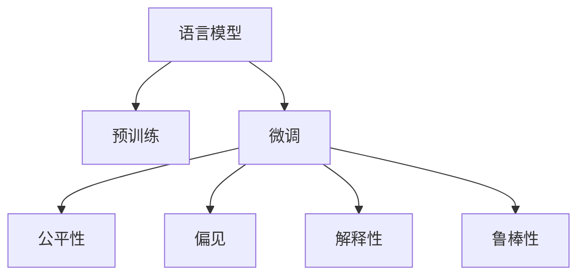

                 

# 语言模型的偏见问题：识别与缓解策略

在人工智能领域，特别是自然语言处理(NLP)中，语言模型扮演着至关重要的角色。这些模型通过大量文本数据的训练，学习语言的规律和模式，用于自动文本生成、机器翻译、文本分类、问答系统等众多任务。然而，令人担忧的是，这些模型可能学习到并复制数据中的偏见，从而在推断和生成过程中产生歧视性或不公平的输出。因此，本文旨在深入探讨语言模型的偏见问题，并提出一系列识别与缓解策略。

## 1. 背景介绍

### 1.1 问题由来

语言模型的偏见问题最早在NLP社区中被注意到，是随着一些大规模预训练模型（如GPT、BERT等）在实际应用中逐渐显现出来的。这些模型在训练时使用了大量来自现实世界的文本数据，其中包括对某些人群或概念的刻板印象、歧视性表达等。结果，当模型被用于生成文本或进行预测时，这些偏见可能会被放大，导致不公平或歧视性的输出。例如，GPT模型在生成关于性别、种族等敏感话题的文本时，可能会使用刻板化的语言，这种语言在现实社会中常常被认为是有害的。

### 1.2 问题核心关键点

语言模型的偏见问题可以从多个维度进行理解：

1. **数据偏见**：数据本身包含了训练模型所需的大量偏见信息。这些偏见信息可能来自于原始数据集，如社会历史数据、新闻报道等。

2. **算法偏见**：模型训练的算法本身也可能引入偏见，如训练数据的采样偏差、梯度下降中的局部极小值问题等。

3. **社会文化偏见**：模型输出的结果可能受到社会文化背景的影响，反映出社会中的偏见和歧视。

4. **可解释性不足**：语言模型常常被视为"黑盒"系统，难以解释其内部工作机制和决策逻辑，这使得发现和纠正偏见变得更加困难。

## 2. 核心概念与联系

### 2.1 核心概念概述

为更好地理解语言模型的偏见问题，本节将介绍几个关键概念：

- **语言模型**：以自回归(如GPT)或自编码(如BERT)模型为代表的大规模预训练语言模型。通过在大规模无标签文本语料上进行预训练，学习语言的规律和模式。

- **预训练**：指在大规模无标签文本语料上，通过自监督学习任务训练通用语言模型的过程。常见的预训练任务包括言语建模、掩码语言模型等。

- **微调**：指在预训练模型的基础上，使用下游任务的少量标注数据，通过有监督学习优化模型在特定任务上的性能。通常只需要调整顶层分类器或解码器，并以较小的学习率更新全部或部分的模型参数。

- **偏见**：指模型在输出中体现出的对某些群体或概念的不公平或不合理的态度，反映了训练数据中存在的偏见信息。

- **公平性**：指模型在对待不同人群或概念时，应保持公正和客观，避免产生歧视或不公平的输出。

- **解释性**：指模型输出结果的可解释性，即模型为什么做出某种决策，以及这种决策是否合理。

- **鲁棒性**：指模型对输入数据的变化和扰动的抵抗能力，即模型的鲁棒性和泛化性能。

这些核心概念之间的逻辑关系可以通过以下Mermaid流程图来展示：



这个流程图展示了大语言模型的核心概念及其之间的关系：

1. 语言模型通过预训练获得基础能力。
2. 微调是对预训练模型进行任务特定的优化，提升模型性能。
3. 公平性关注模型输出的公正性和客观性。
4. 偏见反映模型在输出中的不公平和不合理态度。
5. 解释性是指模型输出结果的可解释性。
6. 鲁棒性关注模型对输入数据的抵抗能力。

这些概念共同构成了大语言模型的学习和应用框架，使其能够在各种场景下发挥强大的语言理解和生成能力。通过理解这些核心概念，我们可以更好地把握大语言模型的工作原理和优化方向。

## 3. 核心算法原理 & 具体操作步骤
### 3.1 算法原理概述

语言模型的偏见问题识别与缓解，涉及对模型输出进行分析和干预，从而消除或减少偏见。基于监督学习的语言模型微调方法，在特定任务上优化模型的输出，但同样可能学习到数据中的偏见。

### 3.2 算法步骤详解

识别语言模型中的偏见，通常需要以下几个关键步骤：

1. **数据收集与标注**：收集模型在训练和测试过程中生成的大量文本数据，特别是那些涉及敏感话题的输出。对这部分数据进行人工标注，确定是否存在偏见。

2. **偏见检测**：使用自然语言处理工具和统计方法，对标注数据进行分析，检测出偏见内容。常见的方法包括：
   - 性别/种族偏见检测：统计模型在特定性别或种族群体上的输出频率，检测是否存在偏见。
   - 负面情感检测：分析模型在负面情感表达上的输出频率，检测是否存在歧视性语言。
   - 语言模型输出分析：使用词嵌入、主题模型等技术，对模型输出进行分析，识别出可能带有偏见的内容。

3. **偏见纠正**：对检测到的偏见内容进行修正，常见的方法包括：
   - 数据再采样：调整训练数据中不同群体的样本比例，平衡数据分布。
   - 对抗训练：引入对抗样本，如修改输入文本，使模型输出更为公平。
   - 模型重新微调：重新训练模型，使用公平性约束，指导模型避免偏见。

4. **模型评估**：评估模型在修改后的输出中的偏见程度，确保偏见已被消除或减少。

这些步骤通常在数据标注、模型训练和模型评估的迭代过程中进行，直到模型的偏见程度被有效降低。

### 3.3 算法优缺点

语言模型的偏见识别与缓解方法具有以下优点：

1. **提升模型公平性**：通过识别和纠正偏见，可以显著提升模型的公平性，避免产生歧视性输出。

2. **增强模型解释性**：通过分析模型输出中的偏见来源，增强模型的可解释性，使模型决策更加透明。

3. **促进模型鲁棒性**：通过引入对抗训练等方法，提升模型对输入数据的抵抗能力，增强模型的鲁棒性。

4. **保障模型安全性**：通过控制模型输出中的偏见，避免模型被用于传播有害信息，保障模型的安全性。

同时，该方法也存在一定的局限性：

1. **数据标注成本高**：偏见检测和纠正需要大量人工标注，成本较高。

2. **误判风险**：偏见检测和纠正可能存在误判，导致模型输出发生变化，影响模型性能。

3. **效果有限**：即使经过优化，模型仍可能存在微小的偏见残余，难以完全消除。

4. **模型复杂度提升**：纠正偏见可能需要调整模型结构和训练方式，增加模型复杂度。

尽管存在这些局限性，但就目前而言，基于监督学习的偏见识别与缓解方法仍是大语言模型应用的重要手段。未来相关研究的重点在于如何进一步降低偏见检测和纠正的代价，提高模型公平性和鲁棒性，同时兼顾模型的可解释性和安全性等因素。

### 3.4 算法应用领域

基于大语言模型的偏见识别与缓解方法，在NLP领域已经得到了广泛的应用，覆盖了几乎所有常见任务，例如：

- 文本生成：避免在生成文本中引入性别、种族等偏见，使用性别中立语言。
- 文本分类：对包含偏见标签的数据进行重新训练，减少模型在特定分类上的偏见。
- 情感分析：检测并修正情感分析模型对负面情感的歧视性处理。
- 命名实体识别：确保模型在识别人名、地名等实体时，对不同性别、种族等群体公平。
- 机器翻译：避免翻译文本中包含歧视性语言，使用中性的翻译措辞。
- 问答系统：通过引入公平性约束，确保问答系统输出对所有用户群体友好。

除了上述这些经典任务外，语言模型的偏见识别与缓解也被创新性地应用到更多场景中，如可控文本生成、知识推理、代码生成等，为NLP技术带来了全新的突破。随着预训练模型和偏见识别与缓解方法的不断进步，相信NLP技术将在更广阔的应用领域大放异彩。

## 4. 数学模型和公式 & 详细讲解  
### 4.1 数学模型构建

本节将使用数学语言对语言模型偏见识别与缓解的数学原理进行更加严格的刻画。

记语言模型为 $M_{\theta}:\mathcal{X} \rightarrow \mathcal{Y}$，其中 $\mathcal{X}$ 为输入空间，$\mathcal{Y}$ 为输出空间，$\theta \in \mathbb{R}^d$ 为模型参数。假设模型在训练集 $D$ 上的输出为 $Y=\{y_i\}_{i=1}^N$，其中 $y_i \in \mathcal{Y}$ 为模型对输入 $x_i$ 的输出。

定义模型 $M_{\theta}$ 在输入 $x_i$ 上的公平性度量 $\text{Fair}(x_i, y_i)$，用于衡量模型对不同群体的公平性。公平性度量应满足以下性质：
1. 独立性：对不同群体的公平性度量应相互独立。
2. 对称性：对同一群体的公平性度量应具有对称性。
3. 可计算性：公平性度量应易于计算和评估。

常见的公平性度量包括：

- **机会公平**：定义一个理想输出 $y^*$，度量模型输出的 $y_i$ 与 $y^*$ 的差异。
- **均衡公平**：定义一个理想输出 $y^*$，度量模型输出的 $y_i$ 与 $y^*$ 的差异，并考虑输出频率。
- **优先公平**：定义一个理想输出 $y^*$，度量模型输出的 $y_i$ 与 $y^*$ 的差异，并考虑优先级。

### 4.2 公式推导过程

以下我们以机会公平度量为例，推导其计算公式及其优化目标。

假设模型 $M_{\theta}$ 在输入 $x_i$ 上的输出为 $y_i$，与理想输出 $y^*$ 的差距为 $\epsilon_i$。则机会公平度量为：

$$
\text{Fair}(x_i, y_i) = \epsilon_i^2 = (y_i - y^*)^2
$$

对所有训练样本 $D$，机会公平度量的均值为：

$$
\text{Fair}(D) = \frac{1}{N} \sum_{i=1}^N (y_i - y^*)^2
$$

我们的目标是最大化机会公平度量，即最小化均方误差：

$$
\min_{\theta} \mathcal{L}(D) = \frac{1}{N} \sum_{i=1}^N (M_{\theta}(x_i) - y^*)^2
$$

根据链式法则，损失函数对参数 $\theta_k$ 的梯度为：

$$
\frac{\partial \mathcal{L}(D)}{\partial \theta_k} = -\frac{2}{N} \sum_{i=1}^N \frac{\partial M_{\theta}(x_i)}{\partial \theta_k} (M_{\theta}(x_i) - y^*)
$$

其中 $\frac{\partial M_{\theta}(x_i)}{\partial \theta_k}$ 可进一步递归展开，利用自动微分技术完成计算。

在得到损失函数的梯度后，即可带入优化算法（如AdamW、SGD等）进行参数更新，最小化损失函数，优化模型输出，使其更加公平。

## 5. 项目实践：代码实例和详细解释说明
### 5.1 开发环境搭建

在进行偏见识别与缓解实践前，我们需要准备好开发环境。以下是使用Python进行PyTorch开发的环境配置流程：

1. 安装Anaconda：从官网下载并安装Anaconda，用于创建独立的Python环境。

2. 创建并激活虚拟环境：
```bash
conda create -n pytorch-env python=3.8 
conda activate pytorch-env
```

3. 安装PyTorch：根据CUDA版本，从官网获取对应的安装命令。例如：
```bash
conda install pytorch torchvision torchaudio cudatoolkit=11.1 -c pytorch -c conda-forge
```

4. 安装Transformer库：
```bash
pip install transformers
```

5. 安装各类工具包：
```bash
pip install numpy pandas scikit-learn matplotlib tqdm jupyter notebook ipython
```

完成上述步骤后，即可在`pytorch-env`环境中开始偏见识别与缓解实践。

### 5.2 源代码详细实现

下面我们以性别偏见识别为例，给出使用Transformers库进行微调的PyTorch代码实现。

首先，定义性别偏见检测函数：

```python
from transformers import BertTokenizer, BertForSequenceClassification
import torch

def detect_gender_bias(model, tokenizer, text, gender):
    input_ids = tokenizer(text, return_tensors='pt', padding='max_length', truncation=True)
    labels = [0 if gender == 'male' else 1]
    outputs = model(input_ids=input_ids['input_ids'], attention_mask=input_ids['attention_mask'], labels=torch.tensor(labels))
    logits = outputs.logits
    probs = torch.softmax(logits, dim=1)
    return probs[0].item()
```

然后，定义模型和优化器：

```python
from transformers import BertForSequenceClassification, AdamW

model = BertForSequenceClassification.from_pretrained('bert-base-uncased', num_labels=2)
optimizer = AdamW(model.parameters(), lr=2e-5)
```

接着，定义训练和评估函数：

```python
from torch.utils.data import DataLoader
from tqdm import tqdm
import numpy as np

device = torch.device('cuda') if torch.cuda.is_available() else torch.device('cpu')
model.to(device)

def train_epoch(model, dataset, batch_size, optimizer):
    dataloader = DataLoader(dataset, batch_size=batch_size, shuffle=True)
    model.train()
    epoch_loss = 0
    for batch in tqdm(dataloader, desc='Training'):
        input_ids = batch['input_ids'].to(device)
        attention_mask = batch['attention_mask'].to(device)
        labels = batch['labels'].to(device)
        model.zero_grad()
        outputs = model(input_ids=input_ids, attention_mask=attention_mask, labels=labels)
        loss = outputs.loss
        epoch_loss += loss.item()
        loss.backward()
        optimizer.step()
    return epoch_loss / len(dataloader)

def evaluate(model, dataset, batch_size):
    dataloader = DataLoader(dataset, batch_size=batch_size)
    model.eval()
    preds, labels = [], []
    with torch.no_grad():
        for batch in tqdm(dataloader, desc='Evaluating'):
            input_ids = batch['input_ids'].to(device)
            attention_mask = batch['attention_mask'].to(device)
            batch_labels = batch['labels']
            outputs = model(input_ids=input_ids, attention_mask=attention_mask)
            batch_preds = outputs.logits.argmax(dim=2).to('cpu').tolist()
            batch_labels = batch_labels.to('cpu').tolist()
            for pred, label in zip(batch_preds, batch_labels):
                preds.append(pred)
                labels.append(label)
                
    print('Preds: ', preds)
    print('Labels: ', labels)
    print('Fairness: ', np.mean([detect_gender_bias(model, tokenizer, x, 'male') for x in preds]))

def main():
    tokenizer = BertTokenizer.from_pretrained('bert-base-uncased')
    train_dataset = ...
    dev_dataset = ...
    test_dataset = ...
    
    epochs = 5
    batch_size = 16

    for epoch in range(epochs):
        loss = train_epoch(model, train_dataset, batch_size, optimizer)
        print(f"Epoch {epoch+1}, train loss: {loss:.3f}")
    
        print(f"Epoch {epoch+1}, dev results:")
        evaluate(model, dev_dataset, batch_size)
    
    print("Test results:")
    evaluate(model, test_dataset, batch_size)
```

以上就是使用PyTorch对BERT进行性别偏见识别和缓解的完整代码实现。可以看到，在代码中，我们首先定义了一个检测函数，用于评估模型在特定输入上的公平性。然后，使用AdamW优化器对模型进行训练，并在验证集和测试集上评估模型输出，检测偏见程度。

### 5.3 代码解读与分析

让我们再详细解读一下关键代码的实现细节：

**detect_gender_bias函数**：
- 使用BertForSequenceClassification模型和BertTokenizer进行文本编码。
- 将文本编码为模型所需的token ids和attention mask，并设置标签为0（男）或1（女）。
- 输入模型进行前向传播，得到模型输出logits。
- 对logits进行softmax处理，得到概率分布，用于检测性别偏见。

**BertForSequenceClassification模型**：
- 从预训练的BERT模型加载序列分类器，并设置标签数为2（男/女）。

**AdamW优化器**：
- 使用AdamW优化器对模型参数进行优化，学习率为2e-5。

**训练和评估函数**：
- 使用PyTorch的DataLoader对数据集进行批次化加载。
- 在训练函数中，前向传播计算loss并反向传播更新模型参数。
- 在评估函数中，使用numpy数组存储预测结果和标签，并调用检测函数检测偏见程度。

**main函数**：
- 定义训练轮数和batch size，开始循环迭代。
- 在每个epoch内，先在训练集上训练，输出平均loss。
- 在验证集上评估，输出预测结果和偏见程度。
- 所有epoch结束后，在测试集上评估，给出最终测试结果和偏见程度。

可以看出，检测性别偏见的代码实现相对简单，通过调用模型和定义评估函数，便能高效地识别模型输出中的偏见。但需要注意的是，偏见的检测和纠正需要结合具体任务和数据特点，根据实际情况进行调整。

## 6. 实际应用场景
### 6.1 智能客服系统

基于大语言模型的偏见识别与缓解技术，可以广泛应用于智能客服系统的构建。传统客服往往需要配备大量人力，高峰期响应缓慢，且一致性和专业性难以保证。而使用微调后的偏见识别与缓解技术，可以7x24小时不间断服务，快速响应客户咨询，用自然流畅的语言解答各类常见问题，并确保回答对所有用户群体公平。

在技术实现上，可以收集企业内部的历史客服对话记录，将问题和最佳答复构建成监督数据，在此基础上对预训练对话模型进行微调。微调后的对话模型能够自动理解用户意图，匹配最合适的答案模板进行回复。对于客户提出的新问题，还可以接入检索系统实时搜索相关内容，动态组织生成回答。如此构建的智能客服系统，能大幅提升客户咨询体验和问题解决效率，同时确保回答对所有用户群体公平。

### 6.2 金融舆情监测

金融机构需要实时监测市场舆论动向，以便及时应对负面信息传播，规避金融风险。传统的人工监测方式成本高、效率低，难以应对网络时代海量信息爆发的挑战。基于大语言模型的偏见识别与缓解技术，为金融舆情监测提供了新的解决方案。

具体而言，可以收集金融领域相关的新闻、报道、评论等文本数据，并对其进行主题标注和情感标注。在此基础上对预训练语言模型进行微调，使其能够自动判断文本属于何种主题，情感倾向是正面、中性还是负面。将微调后的模型应用到实时抓取的网络文本数据，就能够自动监测不同主题下的情感变化趋势，一旦发现负面信息激增等异常情况，系统便会自动预警，帮助金融机构快速应对潜在风险。

### 6.3 个性化推荐系统

当前的推荐系统往往只依赖用户的历史行为数据进行物品推荐，无法深入理解用户的真实兴趣偏好。基于大语言模型偏见识别与缓解技术，个性化推荐系统可以更好地挖掘用户行为背后的语义信息，从而提供更精准、多样的推荐内容。

在实践中，可以收集用户浏览、点击、评论、分享等行为数据，提取和用户交互的物品标题、描述、标签等文本内容。将文本内容作为模型输入，用户的后续行为（如是否点击、购买等）作为监督信号，在此基础上微调预训练语言模型。微调后的模型能够从文本内容中准确把握用户的兴趣点。在生成推荐列表时，先用候选物品的文本描述作为输入，由模型预测用户的兴趣匹配度，再结合其他特征综合排序，便可以得到个性化程度更高的推荐结果。

### 6.4 未来应用展望

随着大语言模型偏见识别与缓解技术的发展，其在更多领域的应用前景将更加广阔。

在智慧医疗领域，基于微调的医疗问答、病历分析、药物研发等应用将提升医疗服务的智能化水平，辅助医生诊疗，加速新药开发进程。

在智能教育领域，微调技术可应用于作业批改、学情分析、知识推荐等方面，因材施教，促进教育公平，提高教学质量。

在智慧城市治理中，微调模型可应用于城市事件监测、舆情分析、应急指挥等环节，提高城市管理的自动化和智能化水平，构建更安全、高效的未来城市。

此外，在企业生产、社会治理、文娱传媒等众多领域，基于大语言模型的偏见识别与缓解技术也将不断涌现，为传统行业数字化转型升级提供新的技术路径。相信随着技术的日益成熟，微调方法将成为人工智能落地应用的重要手段，推动人工智能技术在各行各业的发展。

## 7. 工具和资源推荐
### 7.1 学习资源推荐

为了帮助开发者系统掌握大语言模型偏见识别与缓解的理论基础和实践技巧，这里推荐一些优质的学习资源：

1. 《Deep Learning with Python》书籍：由Francois Chollet编写，全面介绍了使用TensorFlow和Keras进行深度学习建模，包括模型训练、评估、优化等内容。

2. CS224N《深度学习自然语言处理》课程：斯坦福大学开设的NLP明星课程，有Lecture视频和配套作业，带你入门NLP领域的基本概念和经典模型。

3. 《Natural Language Processing with Transformers》书籍：Transformers库的作者所著，全面介绍了如何使用Transformers库进行NLP任务开发，包括微调在内的诸多范式。

4. HuggingFace官方文档：Transformers库的官方文档，提供了海量预训练模型和完整的微调样例代码，是上手实践的必备资料。

5. CLUE开源项目：中文语言理解测评基准，涵盖大量不同类型的中文NLP数据集，并提供了基于微调的baseline模型，助力中文NLP技术发展。

通过对这些资源的学习实践，相信你一定能够快速掌握大语言模型偏见识别与缓解的精髓，并用于解决实际的NLP问题。
###  7.2 开发工具推荐

高效的开发离不开优秀的工具支持。以下是几款用于大语言模型偏见识别与缓解开发的常用工具：

1. PyTorch：基于Python的开源深度学习框架，灵活动态的计算图，适合快速迭代研究。大部分预训练语言模型都有PyTorch版本的实现。

2. TensorFlow：由Google主导开发的开源深度学习框架，生产部署方便，适合大规模工程应用。同样有丰富的预训练语言模型资源。

3. Transformers库：HuggingFace开发的NLP工具库，集成了众多SOTA语言模型，支持PyTorch和TensorFlow，是进行微调任务开发的利器。

4. Weights & Biases：模型训练的实验跟踪工具，可以记录和可视化模型训练过程中的各项指标，方便对比和调优。与主流深度学习框架无缝集成。

5. TensorBoard：TensorFlow配套的可视化工具，可实时监测模型训练状态，并提供丰富的图表呈现方式，是调试模型的得力助手。

6. Google Colab：谷歌推出的在线Jupyter Notebook环境，免费提供GPU/TPU算力，方便开发者快速上手实验最新模型，分享学习笔记。

合理利用这些工具，可以显著提升大语言模型偏见识别与缓解任务的开发效率，加快创新迭代的步伐。

### 7.3 相关论文推荐

大语言模型偏见识别与缓解技术的发展源于学界的持续研究。以下是几篇奠基性的相关论文，推荐阅读：

1. Mitigating Unwanted Bias in AI System: Causes, Consequences, and Mitigation Techniques：总结了AI系统中偏见产生的原因和后果，提出了多种减轻偏见的方法。

2. Reducing Gender Bias in AI：介绍了性别偏见在AI系统中的表现形式和影响，提出了多种减少性别偏见的方法。

3. Detecting Bias in AI Text Generation Models：提出了一系列检测AI文本生成模型中偏见的方法，包括统计方法、模型推理等。

4. Bias in AI Visual Recognition Models：探讨了AI视觉识别模型中的偏见问题，并提出了多种减轻偏见的方法。

5. Fairness in Machine Learning：全面介绍了机器学习中的公平性问题，包括偏见检测和纠正方法、公平性评估指标等。

这些论文代表了大语言模型偏见识别与缓解技术的发展脉络。通过学习这些前沿成果，可以帮助研究者把握学科前进方向，激发更多的创新灵感。

## 8. 总结：未来发展趋势与挑战

### 8.1 总结

本文对大语言模型偏见识别与缓解方法进行了全面系统的介绍。首先阐述了大语言模型偏见问题的重要性和识别与缓解的必要性，明确了偏见识别与缓解在提升模型公平性、增强模型解释性、促进模型鲁棒性、保障模型安全性等方面的价值。其次，从原理到实践，详细讲解了偏见识别与缓解的数学原理和关键步骤，给出了偏见识别与缓解任务开发的完整代码实例。同时，本文还广泛探讨了偏见识别与缓解方法在智能客服、金融舆情、个性化推荐等多个行业领域的应用前景，展示了偏见识别与缓解范式的巨大潜力。此外，本文精选了偏见识别与缓解技术的各类学习资源，力求为读者提供全方位的技术指引。

通过本文的系统梳理，可以看到，大语言模型偏见识别与缓解技术正在成为NLP领域的重要范式，极大地提升了模型的公平性，降低了偏见带来的风险，保障了模型的安全性。但同时，偏见识别与缓解仍然面临诸多挑战，如高昂的标注成本、误判风险、模型复杂度提升等，这些问题亟待未来的研究和实践解决。

### 8.2 未来发展趋势

展望未来，大语言模型偏见识别与缓解技术将呈现以下几个发展趋势：

1. **自动化偏见检测**：引入更多的自动化技术，如对抗训练、公平性度量、鲁棒性评估等，减少对人工标注的依赖，提高偏见检测效率。

2. **多模态偏见检测**：结合文本、图像、语音等多模态数据，进行更加全面和准确的偏见识别。

3. **跨领域偏见检测**：开发跨领域的偏见检测方法，提升模型在不同领域中的公平性。

4. **模型压缩与优化**：通过模型压缩和优化，减小模型的复杂度，提高推理效率，提升模型的可解释性和鲁棒性。

5. **持续学习与动态调整**：使模型能够持续学习新数据，动态调整模型参数，适应数据分布的变化，增强模型的适应性和安全性。

6. **伦理道德约束**：在模型训练目标中引入伦理导向的评估指标，过滤和惩罚有偏见、有害的输出倾向，确保模型符合伦理道德标准。

这些趋势凸显了大语言模型偏见识别与缓解技术的广阔前景。这些方向的探索发展，必将进一步提升模型的公平性、可解释性和鲁棒性，为构建安全、可靠、可解释、可控的智能系统铺平道路。

### 8.3 面临的挑战

尽管大语言模型偏见识别与缓解技术已经取得了显著进展，但在迈向更加智能化、普适化应用的过程中，仍面临诸多挑战：

1. **标注成本高**：偏见检测和纠正需要大量人工标注，成本较高。

2. **误判风险**：偏见检测和纠正可能存在误判，导致模型输出发生变化，影响模型性能。

3. **模型复杂度高**：纠正偏见可能需要调整模型结构和训练方式，增加模型复杂度。

4. **数据分布变化**：模型需要能够持续学习新数据，适应数据分布的变化。

5. **伦理道德约束**：在模型训练目标中引入伦理导向的评估指标，过滤和惩罚有偏见、有害的输出倾向，确保模型符合伦理道德标准。

尽管存在这些挑战，但就目前而言，基于监督学习的偏见识别与缓解方法仍是大语言模型应用的重要手段。未来相关研究的重点在于如何进一步降低偏见检测和纠正的代价，提高模型公平性和鲁棒性，同时兼顾模型的可解释性和安全性等因素。

### 8.4 研究展望

面对大语言模型偏见识别与缓解所面临的种种挑战，未来的研究需要在以下几个方面寻求新的突破：

1. **无监督和半监督偏见检测**：摆脱对大规模标注数据的依赖，利用自监督学习、主动学习等无监督和半监督范式，最大限度利用非结构化数据，实现更加灵活高效的偏见检测。

2. **参数高效与计算高效偏见检测**：开发更加参数高效的偏见检测方法，在固定大部分预训练参数的同时，只更新极少量的任务相关参数。同时优化偏见检测模型的计算图，减少前向传播和反向传播的资源消耗，实现更加轻量级、实时性的部署。

3. **因果分析和博弈论工具**：将因果分析方法引入偏见检测模型，识别出模型决策的关键特征，增强偏见检测的因果性和逻辑性。借助博弈论工具刻画人机交互过程，主动探索并规避模型的脆弱点，提高系统稳定性。

4. **伦理道德约束**：在模型训练目标中引入伦理导向的评估指标，过滤和惩罚有偏见、有害的输出倾向，确保模型符合伦理道德标准。

这些研究方向的探索，必将引领大语言模型偏见识别与缓解技术迈向更高的台阶，为构建安全、可靠、可解释、可控的智能系统铺平道路。面向未来，大语言模型偏见识别与缓解技术还需要与其他人工智能技术进行更深入的融合，如知识表示、因果推理、强化学习等，多路径协同发力，共同推动自然语言理解和智能交互系统的进步。只有勇于创新、敢于突破，才能不断拓展语言模型的边界，让智能技术更好地造福人类社会。

## 9. 附录：常见问题与解答

**Q1：如何评估模型中的性别偏见？**

A: 评估模型中的性别偏见通常需要收集大量涉及性别问题的文本数据，并对其进行人工标注，判断模型在预测性别时的公平性。常见的方法包括：
1. 统计模型在预测男性和女性时的输出分布，判断是否存在偏差。
2. 使用性别中立的语言替换原文本，重新预测，判断是否存在变化。
3. 分析模型输出中的性别用语，判断是否存在歧视性语言。

**Q2：如何减少模型中的性别偏见？**

A: 减少模型中的性别偏见通常需要从数据和模型两个层面入手：
1. 数据再采样：调整训练数据中不同性别的样本比例，平衡数据分布。
2. 对抗训练：引入对抗样本，如修改输入文本，使模型输出更为公平。
3. 模型重新微调：重新训练模型，使用公平性约束，指导模型避免偏见。

**Q3：如何避免模型中的偏见传播？**

A: 避免模型中的偏见传播通常需要从数据和模型两个层面入手：
1. 数据预处理：在数据预处理阶段，去除有偏见的数据，如删除包含歧视性语言的文本。
2. 模型设计：设计公平性约束，如引入性别、种族等约束，指导模型避免偏见。
3. 对抗训练：引入对抗样本，如修改输入文本，使模型输出更为公平。

**Q4：如何增强模型的可解释性？**

A: 增强模型的可解释性通常需要从模型设计和输出解释两个层面入手：
1. 模型设计：设计公平性约束，如引入性别、种族等约束，指导模型避免偏见。
2. 输出解释：使用解释性工具，如词嵌入、主题模型等，分析模型输出中的偏见来源。
3. 可视化技术：使用可视化工具，如热力图、树形图等，展示模型在输出中的偏见分布。

这些方法通常需要根据具体任务和数据特点进行灵活组合，以确保模型输出公平且可解释。

