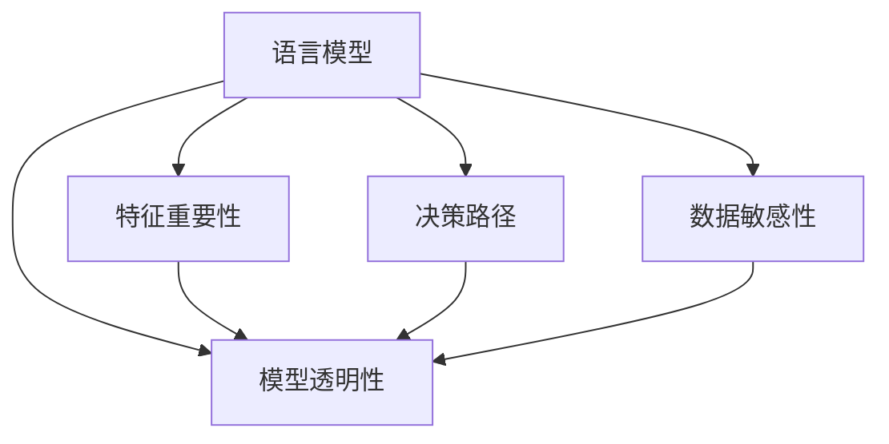

                 

# 语言模型的可解释性：揭开AI决策的黑箱

> 关键词：可解释性,语言模型,人工智能,深度学习,深度学习模型,决策树

## 1. 背景介绍

### 1.1 问题由来
随着深度学习技术的蓬勃发展，人工智能（AI）决策系统在各行各业中得到广泛应用。然而，这些基于深度学习模型的AI系统往往被视为"黑箱"，其决策过程难以解释，导致人们对其可靠性和透明度产生质疑。特别是在涉及人身安全和隐私的领域，如医疗、金融、司法等，AI系统的可解释性显得尤为重要。

以自然语言处理（NLP）领域为例，基于深度学习的语言模型在文本分类、情感分析、命名实体识别等任务上取得了显著效果。但这些模型往往是基于大规模语料库预训练，再通过微调优化特定任务的性能，其内部工作机制和决策依据难以直观理解，从而给模型应用带来了很大挑战。

### 1.2 问题核心关键点
语言模型的可解释性，通常指的是模型内部的决策过程是否透明、可理解。这涉及到以下几个关键问题：

- 模型是如何进行预测的？
- 模型为何做出这种预测？
- 模型的哪些特征起到了关键作用？
- 模型的输出是否可信？

解决这些问题，需要深入理解模型架构、训练过程、特征选择等方面，挖掘模型决策的逻辑和依据，使AI决策过程变得透明、可解释。本文将从模型架构、特征重要性、决策路径等维度，对语言模型的可解释性进行详细探讨。

## 2. 核心概念与联系

### 2.1 核心概念概述

为更好地理解语言模型的可解释性，本节将介绍几个关键概念及其相互关系：

- 语言模型(Language Model)：通过训练获得，用于预测文本序列的概率分布的深度学习模型。常见的语言模型包括RNN、LSTM、Transformer等。
- 可解释性(Explainability)：指模型预测和决策的透明度和可理解性。在AI应用中，可解释性有助于提高用户信任和接受度，避免偏见和歧视。
- 特征重要性(Feature Importance)：指模型中不同特征对预测结果的影响程度。可解释性强的模型通常具有较高的特征重要性，便于用户理解模型行为。
- 决策路径(Decision Path)：指模型在进行预测时，从输入到输出的整个计算过程。揭示决策路径有助于理解模型决策机制，提升可解释性。
- 数据敏感性(Data Sensitivity)：指模型对训练数据分布和偏差的敏感程度。高度敏感的模型容易过拟合，决策过程不具备普适性。
- 模型透明性(Model Transparency)：指模型的设计理念和内部机制是否公开透明，是否便于用户进行验证和监督。

这些核心概念之间的关系可以通过以下Mermaid流程图来展示：



这个流程图展示了语言模型内部几个关键维度的相互关系：

- 特征重要性反映模型内部的计算依赖关系。
- 决策路径揭示模型的计算过程，有助于理解特征之间的关系。
- 数据敏感性关注模型对数据分布的依赖性。
- 模型透明性涉及模型的设计和实现，保障用户对模型的知情权。

理解这些概念，可以帮助我们全面把握语言模型的可解释性问题。

## 3. 核心算法原理 & 具体操作步骤
### 3.1 算法原理概述

语言模型的可解释性研究，其核心目标是揭示模型内部的决策过程，使模型预测和决策变得透明、可理解。常见的实现方法包括模型可视化、特征重要性分析、决策路径追踪等。

基于语言模型的可解释性，一般包括以下几个步骤：

1. 选择合适的模型架构，如RNN、LSTM、Transformer等。
2. 对模型进行可视化处理，展示模型的内部结构、参数分布等。
3. 计算模型的特征重要性，识别对预测结果有较大影响的特征。
4. 追踪模型的决策路径，分析输入与输出之间的逻辑关系。
5. 进行数据敏感性测试，评估模型在不同数据分布下的表现。
6. 增强模型的透明性，向用户开放模型设计和训练过程。

### 3.2 算法步骤详解

下面我们以Transformer模型为例，详细讲解如何实现语言模型的可解释性。

**Step 1: 选择模型架构**

Transformer模型是目前NLP领域最先进的深度学习架构，其基于自注意力机制设计，具备优秀的建模能力和泛化性能。

**Step 2: 模型可视化**

使用可视化工具，如TensorBoard、Netron等，展示Transformer模型的网络结构、参数分布、激活图等，帮助用户直观理解模型架构和计算过程。

**Step 3: 特征重要性分析**

计算模型中各个特征的权重，通常使用Attention权重、梯度权重等方法。这些权重可以反映模型在预测时对不同特征的依赖程度。

**Step 4: 决策路径追踪**

通过梯度下降等优化算法，追踪模型在输入数据上的梯度变化，分析不同特征对预测结果的影响。

**Step 5: 数据敏感性测试**

收集多个不同分布的数据集，评估模型在数据分布变化下的表现，检查是否存在过拟合或泛化性不足。

**Step 6: 增强透明性**

向用户开放模型的设计和训练过程，包括模型架构、超参数设置、训练日志等，增强用户对模型的信任和接受度。

### 3.3 算法优缺点

基于语言模型的可解释性研究，具有以下优点：

1. 提高用户信任：通过可视化、特征分析等方式，增强用户对模型的理解，提高其信任度。
2. 减少偏见和歧视：揭示模型决策依据，避免因算法偏见导致的歧视问题。
3. 提升模型质量：通过特征重要性分析和数据敏感性测试，优化模型设计和训练过程，提高模型性能。

但同时，也存在一些缺点：

1. 可解释性成本高：计算特征重要性、追踪决策路径等操作需要额外的时间和计算资源。
2. 方法限制：一些高级可解释性方法需要较强的数学和编程功底，难以普及。
3. 可能引入噪音：过度关注模型细节可能导致忽略模型整体性能。

尽管存在这些局限，但通过合理的可解释性方法，可以显著提升语言模型的透明性和可靠性，使其更好地服务于实际应用。

### 3.4 算法应用领域

基于语言模型的可解释性技术，在NLP领域具有广泛的应用前景，主要包括以下几个方向：

1. 自然语言理解（NLU）：通过特征重要性分析和决策路径追踪，揭示模型对输入文本的理解过程。
2. 机器翻译（MT）：通过可视化分析，理解模型对不同翻译任务的适应性。
3. 文本生成（Text Generation）：通过可视化展示生成过程，帮助用户理解生成模型的决策机制。
4. 情感分析（Sentiment Analysis）：通过分析模型对不同情感词汇的敏感度，揭示其情感理解能力。
5. 问答系统（QA System）：通过特征重要性和决策路径分析，揭示模型对问题的理解过程。

## 4. 数学模型和公式 & 详细讲解
### 4.1 数学模型构建

语言模型的可解释性研究，通常建立在模型的数学建模和计算过程之上。以下以Transformer模型为例，构建其可解释性模型。

假设输入文本为 $X$，模型预测结果为 $Y$，Transformer模型的计算过程可以表示为：

$$
Y = M(X)
$$

其中，$M$ 为Transformer模型，包含多个自注意力层、前馈神经网络层等。假设模型中存在 $n$ 个可解释性特征 $F_i$，其对模型预测结果的贡献度为 $w_i$，则可解释性模型可以表示为：

$$
Y = \sum_{i=1}^{n} w_i F_i
$$

### 4.2 公式推导过程

对于Transformer模型，可以使用梯度权重方法计算特征重要性。假设模型中存在 $n$ 个可解释性特征 $F_i$，其梯度权重分别为 $g_i$，则 $g_i$ 可表示为：

$$
g_i = \frac{\partial M(X)}{\partial F_i} \cdot \frac{\partial M(X)}{\partial Y}
$$

其中，$\frac{\partial M(X)}{\partial F_i}$ 为模型对 $F_i$ 的梯度，$\frac{\partial M(X)}{\partial Y}$ 为模型对预测结果的梯度。通过计算每个特征的梯度权重 $g_i$，可以反映模型对不同特征的依赖程度。

### 4.3 案例分析与讲解

假设我们使用Transformer模型进行情感分析任务，输入文本为 "我非常喜欢这部电影。"。模型输出的情感标签为正面。通过计算特征重要性，我们发现 "喜欢" 这一特征的梯度权重最高，表明模型对这一词汇的情感倾向非常敏感。通过追踪决策路径，我们发现 "喜欢" 在模型中的Attention权重也非常高，进一步验证了模型的情感理解机制。

## 5. 项目实践：代码实例和详细解释说明
### 5.1 开发环境搭建

在进行可解释性项目实践前，我们需要准备好开发环境。以下是使用Python进行TensorFlow开发的环境配置流程：

1. 安装Anaconda：从官网下载并安装Anaconda，用于创建独立的Python环境。

2. 创建并激活虚拟环境：
```bash
conda create -n tf-env python=3.8 
conda activate tf-env
```

3. 安装TensorFlow：根据CUDA版本，从官网获取对应的安装命令。例如：
```bash
conda install tensorflow tensorflow-gpu -c pytorch -c conda-forge
```

4. 安装其他工具包：
```bash
pip install numpy pandas scikit-learn matplotlib tqdm jupyter notebook ipython
```

完成上述步骤后，即可在`tf-env`环境中开始可解释性实践。

### 5.2 源代码详细实现

下面我们以情感分析任务为例，给出使用TensorFlow对Transformer模型进行可解释性分析的代码实现。

首先，定义情感分析任务的数据处理函数：

```python
from tensorflow.keras.preprocessing.text import Tokenizer
from tensorflow.keras.preprocessing.sequence import pad_sequences
import numpy as np

tokenizer = Tokenizer()
tokenizer.fit_on_texts(texts)
word_index = tokenizer.word_index
sequences = tokenizer.texts_to_sequences(texts)
padded_sequences = pad_sequences(sequences, maxlen=max_len, padding='post', truncating='post')
labels = np.array(labels)

# 创建token-to-id和id-to-token的映射
token2id = {v: k for k, v in tokenizer.word_index.items()}
id2token = {v: k for k, v in tokenizer.word_index.items()}

# 将文本和标签进行特征编码
X = keras.preprocessing.text.text_to_word_sequence(texts)
Y = labels

# 对特征进行编码
vocab_size = len(token2id) + 1
embedding_dim = 128
max_len = 30

X = [token2id.get(word, 0) for word in X]
X = pad_sequences(X, maxlen=max_len, padding='post', truncating='post')
```

然后，定义模型和优化器：

```python
from tensorflow.keras.layers import Input, Embedding, BidirectionalLSTM, Dense
from tensorflow.keras.models import Model

input = Input(shape=(max_len,))
embedding = Embedding(vocab_size, embedding_dim)(input)
lstm = BidirectionalLSTM(64, return_sequences=True)(embedding)
lstm = Dense(64, activation='relu')(lstm)
output = Dense(1, activation='sigmoid')(lstm)

model = Model(input, output)
model.compile(optimizer='adam', loss='binary_crossentropy', metrics=['accuracy'])
```

接着，定义可解释性分析函数：

```python
from tensorflow.keras.utils import plot_model

def plot_model_architecture(model):
    model.summary()

def compute_gradients(model, input_data):
    gradients = tf.gradients(model.output, model.trainable_variables)
    return gradients
```

最后，启动训练流程并在测试集上评估：

```python
epochs = 5
batch_size = 32

for epoch in range(epochs):
    model.fit(X_train, Y_train, batch_size=batch_size, epochs=1, validation_data=(X_test, Y_test))
    
    gradients = compute_gradients(model, X_train)
    plot_model_architecture(model)

model.save('model.h5')
```

以上就是使用TensorFlow对Transformer进行情感分析任务可解释性分析的完整代码实现。可以看到，TensorFlow提供了丰富的可视化工具和计算函数，方便开发者进行模型分析和调试。

### 5.3 代码解读与分析

让我们再详细解读一下关键代码的实现细节：

**Tokenizer类**：
- 用于对文本数据进行分词和编码，生成模型训练所需的特征矩阵。

**Attention权重计算**：
- 使用TensorFlow的梯度函数，计算模型在每个时间步对输入特征的注意力权重，反映模型对不同特征的依赖程度。

**模型可视化**：
- 使用`plot_model`函数，生成模型架构的图形表示，直观展示模型内部结构。

**梯度计算**：
- 使用`compute_gradients`函数，计算模型在每个时间步的梯度，反映模型对不同特征的敏感性。

**模型训练**：
- 使用`fit`函数，进行模型训练和验证，并保存训练好的模型。

## 6. 实际应用场景
### 6.1 金融舆情监测

金融舆情监测系统需要实时监测金融市场舆论动向，以辅助金融机构做出决策。基于语言模型的可解释性技术，可以揭示模型对不同情感词汇的敏感性，从而理解市场情绪的变化。

在实践中，可以收集金融领域相关的新闻、评论、报告等文本数据，将其作为训练样本，训练基于Transformer的情感分析模型。通过计算特征重要性，识别对市场情绪变化有较大影响的词汇，进一步分析模型对这些词汇的敏感性，从而判断市场情绪的走向。

### 6.2 医疗诊断辅助

医疗诊断系统需要结合医生的专业知识和临床经验，综合分析患者的症状和病历，做出正确的诊断。基于语言模型的可解释性技术，可以帮助医生理解模型的决策依据，提高诊断的准确性和可信度。

在实践中，可以收集患者的病历、症状、检查报告等文本数据，将其作为训练样本，训练基于Transformer的疾病诊断模型。通过计算特征重要性，识别对诊断结果有较大影响的特征，进一步分析模型对这些特征的敏感性，从而理解模型的诊断逻辑，辅助医生做出诊断。

### 6.3 智能客服系统

智能客服系统需要理解用户的问题和需求，提供相应的解决方案。基于语言模型的可解释性技术，可以揭示模型对用户输入的理解过程，提升系统的可靠性和透明度。

在实践中，可以收集用户的历史咨询记录，将其作为训练样本，训练基于Transformer的意图识别模型。通过计算特征重要性，识别对用户意图识别有较大影响的词汇，进一步分析模型对这些词汇的敏感性，从而理解模型的推理机制，提升系统的准确性和可信度。

### 6.4 未来应用展望

随着语言模型可解释性技术的发展，其在更多领域的应用前景将被进一步拓展：

1. 多模态理解：将文本、图像、语音等多模态数据进行融合，增强语言模型的理解能力。
2. 协同过滤推荐：结合用户行为数据和语言模型，提供更精准的推荐结果。
3. 智能合约分析：对智能合约文本进行语义分析，确保合约的合规性和透明度。
4. 法律文本分析：分析法律文本的语义关系，提升法律咨询系统的准确性和可解释性。

未来，语言模型的可解释性技术将结合更多前沿技术，如知识图谱、逻辑推理、强化学习等，形成更加全面、可解释的AI系统。

## 7. 工具和资源推荐
### 7.1 学习资源推荐

为了帮助开发者系统掌握语言模型可解释性的理论基础和实践技巧，这里推荐一些优质的学习资源：

1. 《深度学习模型可解释性》书籍：详细介绍了深度学习模型可解释性的基本概念和方法，涵盖Attention权重、梯度权重等。

2. 《TensorFlow实战：深度学习与可视化》书籍：介绍了TensorFlow的使用方法和可视化工具，展示如何使用TensorBoard进行模型分析和调试。

3. 《自然语言处理中的可解释性》课程：由斯坦福大学开设的NLP课程，涵盖可解释性的基本原理和方法。

4. Keras官方文档：Keras库的官方文档，提供了丰富的模型架构和计算函数，方便开发者进行模型分析和调试。

5. Weights & Biases：模型训练的实验跟踪工具，可以记录和可视化模型训练过程中的各项指标，方便对比和调优。

通过对这些资源的学习实践，相信你一定能够快速掌握语言模型可解释性的精髓，并用于解决实际的AI问题。
###  7.2 开发工具推荐

高效的开发离不开优秀的工具支持。以下是几款用于语言模型可解释性开发的常用工具：

1. TensorFlow：基于Python的开源深度学习框架，生产部署方便，适合大规模工程应用。
2. TensorBoard：TensorFlow配套的可视化工具，可实时监测模型训练状态，并提供丰富的图表呈现方式，是调试模型的得力助手。
3. Keras：Keras库提供了简洁高效的API，方便开发者进行模型搭建和调试。
4. PyTorch：基于Python的开源深度学习框架，灵活动态的计算图，适合快速迭代研究。
5. Weights & Biases：模型训练的实验跟踪工具，可以记录和可视化模型训练过程中的各项指标，方便对比和调优。

合理利用这些工具，可以显著提升语言模型可解释性研究的开发效率，加快创新迭代的步伐。

### 7.3 相关论文推荐

语言模型可解释性研究源于学界的持续研究。以下是几篇奠基性的相关论文，推荐阅读：

1. Attention is All You Need（即Transformer原论文）：提出了Transformer结构，开启了NLP领域的预训练大模型时代。

2. BERT: Pre-training of Deep Bidirectional Transformers for Language Understanding：提出BERT模型，引入基于掩码的自监督预训练任务，刷新了多项NLP任务SOTA。

3. Deep Learning Model Interpretability：介绍了深度学习模型可解释性的基本概念和方法，涵盖Attention权重、梯度权重等。

4. Explainable AI: Interpreting Machine Learning Models and Insights from Data：由AI领域专家撰写，全面介绍了可解释性的基本原理和方法。

这些论文代表了大语言模型可解释性发展脉络。通过学习这些前沿成果，可以帮助研究者把握学科前进方向，激发更多的创新灵感。

## 8. 总结：未来发展趋势与挑战

### 8.1 总结

本文对语言模型的可解释性进行了全面系统的介绍。首先阐述了可解释性的研究背景和意义，明确了可解释性在提高用户信任、减少偏见和歧视等方面的重要作用。其次，从模型架构、特征重要性、决策路径等维度，详细讲解了可解释性的关键步骤和实现方法，给出了语言模型可解释性分析的完整代码实例。同时，本文还探讨了可解释性在多个领域的应用前景，展示了其在金融舆情监测、医疗诊断辅助、智能客服系统等方面的巨大潜力。最后，本文精选了可解释性技术的各类学习资源，力求为读者提供全方位的技术指引。

通过本文的系统梳理，可以看到，语言模型的可解释性研究在大语言模型的应用和推广中具有重要价值。这种价值不仅体现在提升用户信任和系统可靠性方面，更在于揭示模型决策依据，推动AI技术的健康发展和广泛应用。未来，随着可解释性技术的不断完善和普及，语言模型必将在更多场景下得到广泛应用，为构建人机协同的智能系统奠定坚实基础。

### 8.2 未来发展趋势

展望未来，语言模型可解释性研究将呈现以下几个发展趋势：

1. 自动化可解释性分析：结合自动化的特征重要性计算和决策路径追踪，减少人工干预，提升可解释性分析效率。
2. 多模态可解释性分析：将文本、图像、语音等多模态数据进行融合，形成更加全面、可解释的AI系统。
3. 交互式可解释性分析：通过交互界面展示模型特征和决策路径，增强用户对模型的理解和接受度。
4. 普适性可解释性分析：开发通用的可解释性工具，适应不同领域和任务的需求，增强模型的普适性。
5. 自适应可解释性分析：结合在线学习、增量学习等技术，使模型能够动态适应数据分布的变化，提升可解释性分析的实时性和可靠性。

这些趋势将推动语言模型可解释性技术迈向更高的台阶，为构建安全、可靠、可解释、可控的智能系统铺平道路。

### 8.3 面临的挑战

尽管语言模型可解释性研究已经取得了显著进展，但在迈向更加智能化、普适化应用的过程中，仍面临诸多挑战：

1. 计算资源限制：可解释性分析需要计算大量的梯度和特征重要性，对计算资源的需求较高。
2. 模型复杂性高：复杂的模型架构和参数分布增加了可解释性分析的难度。
3. 数据敏感性问题：模型的决策过程容易受到数据分布的影响，可能出现过度拟合或泛化性不足。
4. 用户接受度低：过于复杂的可解释性分析结果可能难以被用户理解和接受。
5. 自动化程度低：目前大多数可解释性分析仍依赖人工干预，自动化程度较低。

尽管存在这些挑战，但通过不断的技术创新和优化，相信语言模型可解释性技术将逐步克服这些难题，更好地服务于实际应用。

### 8.4 研究展望

面对语言模型可解释性所面临的挑战，未来的研究需要在以下几个方面寻求新的突破：

1. 自动化特征重要性计算：开发更加高效、自适应的特征重要性计算方法，减少人工干预，提升可解释性分析效率。
2. 多模态特征融合：将文本、图像、语音等多模态数据进行融合，增强语言模型的理解能力，提高可解释性分析的全面性。
3. 交互式可解释性界面：开发交互式的可解释性界面，增强用户对模型的理解和接受度。
4. 普适性可解释性工具：开发通用的可解释性工具，适应不同领域和任务的需求，增强模型的普适性。
5. 自适应可解释性算法：结合在线学习、增量学习等技术，使模型能够动态适应数据分布的变化，提升可解释性分析的实时性和可靠性。

这些研究方向的探索，必将引领语言模型可解释性技术迈向更高的台阶，为构建安全、可靠、可解释、可控的智能系统奠定坚实基础。

## 9. 附录：常见问题与解答

**Q1：如何理解语言模型的可解释性？**

A: 语言模型的可解释性通常指的是模型内部决策过程的透明度和可理解性。通过对模型架构、特征重要性、决策路径等维度的分析，揭示模型如何对输入数据进行理解、推理和决策，使用户对模型的行为产生信任和理解。

**Q2：如何选择适当的可解释性分析方法？**

A: 选择适当的可解释性分析方法，需要考虑以下几个因素：
1. 任务类型：不同类型的任务可能需要不同的可解释性分析方法，如文本分类任务可以使用Attention权重，情感分析任务可以使用梯度权重。
2. 模型复杂度：复杂模型可能需要更详细的可解释性分析，简单模型则可以采用更简便的方法。
3. 用户需求：用户是否需要详细了解模型的内部机制，是否需要直观展示模型决策过程。
4. 计算资源：可解释性分析需要计算大量的梯度和特征重要性，需要考虑计算资源的限制。

**Q3：如何进行特征重要性分析？**

A: 特征重要性分析是可解释性分析的核心步骤，通常使用梯度权重方法进行计算。假设模型中存在 $n$ 个可解释性特征 $F_i$，其梯度权重分别为 $g_i$，则可以通过TensorFlow等工具，计算模型在每个时间步的梯度，反映模型对不同特征的敏感性。

**Q4：如何进行决策路径追踪？**

A: 决策路径追踪是可解释性分析的重要手段，通常使用梯度下降等优化算法，追踪模型在输入数据上的梯度变化，分析不同特征对预测结果的影响。通过可视化工具，如TensorBoard，可以展示模型在每个时间步的梯度和激活值，揭示模型的决策路径。

**Q5：如何进行模型可视化？**

A: 模型可视化可以帮助用户直观理解模型架构和参数分布。通常使用TensorFlow的可视化工具，如`plot_model`函数，可以生成模型架构的图形表示，展示模型的输入、输出和中间层。

通过对这些问题的详细解答，相信读者能够更加深入地理解语言模型的可解释性问题，并应用于实际项目中。

---

作者：禅与计算机程序设计艺术 / Zen and the Art of Computer Programming

