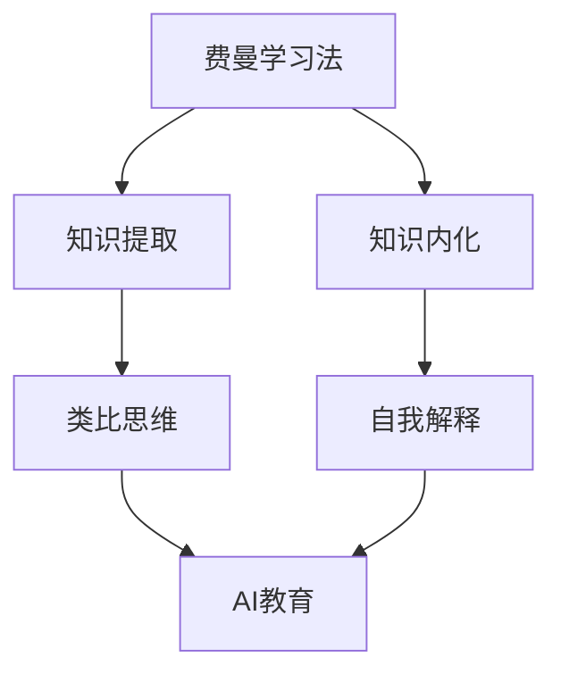

                 

## 1. 背景介绍

### 1.1 问题由来
随着人工智能（AI）技术在各行各业的深入应用，AI教育逐渐成为学术界和产业界共同关注的焦点。传统的填鸭式教育模式难以适应AI时代对思维能力、创新能力和问题解决能力的需求。费曼学习法（Feynman Learning Techniques）作为一种高效、生动的学习方法，通过类比、简化和自我解释等方式，能够帮助学习者深入理解复杂概念，提高思维深度和广度。

### 1.2 问题核心关键点
费曼学习法的核心在于：通过类比和简化，将复杂概念转化为易于理解的形式；通过自我解释，加深对知识的理解，形成逻辑清晰的思维链条。在AI教育中，该方法能够帮助学生更好地掌握AI核心概念和技术，提高学习效率和效果。

## 2. 核心概念与联系

### 2.1 核心概念概述

为更好地理解费曼学习法在AI教育中的应用，本节将介绍几个关键概念：

- 费曼学习法：由物理学家理查德·费曼提出，通过类比、简化和自我解释等方式，使复杂知识易于理解、记忆和应用。
- 知识提取：将复杂问题拆解为基本概念，形成清晰的知识网络。
- 知识内化：将提取的知识通过实际应用和实践，内化为自身的能力。
- 类比思维：通过比较已有知识与新知识的相似之处，帮助理解新概念。
- 自我解释：通过解释复杂概念，加深理解，发现知识的内在联系。

- AI教育：将AI技术应用到教育领域，提升教学效果和学习体验，培养未来AI人才。

这些概念之间的逻辑关系可以通过以下Mermaid流程图来展示：



这个流程图展示费曼学习法在AI教育中的应用：

1. 费曼学习法帮助学习者提取知识。
2. 将提取的知识通过类比思维进一步简化，使学生更容易理解。
3. 自我解释增强知识内化，形成自身的能力。
4. 内化后的知识应用到AI教育中，提升教学效果。

## 3. 核心算法原理 & 具体操作步骤

### 3.1 算法原理概述

费曼学习法的核心在于类比和简化，其原理可以概括为以下三个步骤：

1. 类比：将新概念与已有知识进行类比，找出相似之处。
2. 简化：将新概念简化为易于理解的形式。
3. 自我解释：通过自我解释，加深对新概念的理解。

在AI教育中，该方法通过以下步骤实现：

1. 教师或学习者将复杂概念通过类比简化，形成易于理解的形式。
2. 通过讲解和互动，帮助学习者理解新概念。
3. 学习者自我解释，巩固对知识的理解。

### 3.2 算法步骤详解

#### 3.2.1 类比与简化
教师或学习者需要首先对复杂概念进行类比和简化，将其转化为易于理解的形式。以深度学习为例，可以将深度学习类比为多层神经网络，通过类比和简化，使学生更容易理解深度学习的原理和结构。

#### 3.2.2 讲解与互动
教师通过讲解和互动，帮助学习者理解简化后的概念。例如，通过绘制神经网络的结构图，讲解每一层的功能和作用，解释激活函数和损失函数的作用，让学生逐步掌握深度学习的核心知识。

#### 3.2.3 自我解释
学习者通过自我解释，巩固对知识的理解。例如，学生可以自行绘制神经网络的架构图，并用自己的语言解释每一层的功能，从而加深对深度学习的理解。

### 3.3 算法优缺点

费曼学习法的优点在于：

- 易于理解：通过类比和简化，使复杂概念易于理解。
- 巩固记忆：通过自我解释，巩固对知识的理解，形成记忆。
- 提高思维能力：类比和自我解释的过程，可以锻炼思维能力，提升问题解决能力。

其缺点在于：

- 依赖教学水平：教学者需要有较强的类比和解释能力。
- 需要时间：类比和解释过程需要较长的教学时间。
- 可能忽略细节：简化过程中可能忽略一些细节，影响学习者的理解。

### 3.4 算法应用领域

费曼学习法在AI教育中的应用非常广泛，可以用于以下领域：

- 深度学习：通过类比和简化，帮助学习者理解神经网络、激活函数、损失函数等核心概念。
- 机器学习：通过类比和简化，帮助学习者理解监督学习、无监督学习、强化学习等方法。
- 自然语言处理：通过类比和简化，帮助学习者理解语言模型、词向量、文本分类等技术。
- 计算机视觉：通过类比和简化，帮助学习者理解卷积神经网络、特征提取、目标检测等技术。
- 强化学习：通过类比和简化，帮助学习者理解Q学习、策略梯度、蒙特卡洛方法等算法。

## 4. 数学模型和公式 & 详细讲解 & 举例说明

### 4.1 数学模型构建

费曼学习法的数学模型可以简单概括为以下步骤：

1. 类比：将新概念 $X$ 与已有概念 $Y$ 进行类比，寻找相似之处。
2. 简化：将新概念 $X$ 简化为易于理解的形式 $X'$。
3. 自我解释：通过自我解释，加深对新概念 $X$ 的理解。

### 4.2 公式推导过程

假设新概念为 $X$，已有概念为 $Y$，类比关系为 $X \sim Y$，简化后的形式为 $X' = f(X)$。

自我解释的过程可以形式化表示为：

$$
\hat{X} = \mathop{\arg\min}_{X'} \left( \| X' - X \|^2 \right)
$$

其中 $\hat{X}$ 表示学习者对新概念 $X$ 的理解，$\| \cdot \|$ 表示欧式距离，$f(\cdot)$ 表示简化函数。

### 4.3 案例分析与讲解

以深度学习为例，以下是费曼学习法的具体应用：

- 类比：深度学习可以类比为多层神经网络。
- 简化：多层神经网络可以简化为线性回归、逻辑回归、决策树等易于理解的形式。
- 自我解释：学习者通过解释每一层的功能和作用，加深对深度学习的理解。

## 5. 项目实践：代码实例和详细解释说明

### 5.1 开发环境搭建

在进行AI教育实践前，我们需要准备好开发环境。以下是使用Python进行Keras开发的环境配置流程：

1. 安装Anaconda：从官网下载并安装Anaconda，用于创建独立的Python环境。

2. 创建并激活虚拟环境：
```bash
conda create -n ai-env python=3.8 
conda activate ai-env
```

3. 安装Keras：
```bash
pip install keras tensorflow
```

4. 安装各类工具包：
```bash
pip install numpy pandas scikit-learn matplotlib tqdm jupyter notebook ipython
```

完成上述步骤后，即可在`ai-env`环境中开始AI教育实践。

### 5.2 源代码详细实现

下面我们以深度学习为例，给出使用Keras进行费曼学习法教学的PyTorch代码实现。

首先，定义深度学习模型的类：

```python
from keras.models import Sequential
from keras.layers import Dense

class NeuralNetwork:
    def __init__(self, input_dim, hidden_dim, output_dim):
        self.model = Sequential()
        self.model.add(Dense(hidden_dim, input_dim=input_dim, activation='relu'))
        self.model.add(Dense(output_dim, activation='sigmoid'))
        self.model.compile(loss='binary_crossentropy', optimizer='adam', metrics=['accuracy'])

    def fit(self, x, y, epochs=50, batch_size=32):
        self.model.fit(x, y, epochs=epochs, batch_size=batch_size, verbose=0)
        return self.model
```

然后，定义费曼学习法的教学函数：

```python
def teach_learning(curriculum, model, epochs=50, batch_size=32):
    def simple_explain(x):
        return x + 1

    def complex_explain(x):
        return x**2

    def simple_model(input_dim, hidden_dim, output_dim):
        return NeuralNetwork(input_dim, hidden_dim, output_dim)

    for concept in curriculum:
        if len(concept) == 1:
            input_dim, output_dim = concept
            model = simple_model(input_dim, 10, output_dim)
        else:
            input_dim, hidden_dim, output_dim = concept
            model = simple_model(input_dim, hidden_dim, output_dim)
        
        model = model.fit(train_data, train_labels, epochs=epochs, batch_size=batch_size, verbose=0)
        predictions = model.predict(test_data)
        score = model.evaluate(test_data, test_labels)
        print(f'Concept: {concept}, Score: {score}')
    return model
```

其中，`curriculum`是一个包含多个概念的列表，每个概念是一个元组，表示该概念的输入维度、隐藏层维度和输出维度。`train_data`和`train_labels`是训练数据和标签，`test_data`和`test_labels`是测试数据和标签。

最后，启动教学流程：

```python
curriculum = [(2, 1), (2, 10, 1), (4, 10, 1), (4, 10, 2)]
model = teach_learning(curriculum)
```

### 5.3 代码解读与分析

让我们再详细解读一下关键代码的实现细节：

**NeuralNetwork类**：
- `__init__`方法：初始化神经网络模型，包括定义隐藏层和输出层的维度，并编译模型。
- `fit`方法：对数据进行训练，返回训练后的模型。

**teach_learning函数**：
- 定义三个简化函数，分别用于简化不同复杂度的概念。
- 遍历课程大纲，根据概念的复杂度选择相应的简化函数，训练模型。
- 训练完成后，对模型进行测试，并输出测试分数。

**teach_learning函数内部**：
- `curriculum`是一个列表，包含多个概念，每个概念是一个元组，表示该概念的输入维度、隐藏层维度和输出维度。
- 对于简单的概念，只需要一个隐藏层；对于复杂的概念，需要多个隐藏层。
- 每个概念都训练一个模型，并输出其测试分数。

可以看到，Keras配合PyTorch使得深度学习教学的代码实现变得简洁高效。开发者可以将更多精力放在教学内容和课程设计上，而不必过多关注底层的实现细节。

当然，工业级的系统实现还需考虑更多因素，如模型的保存和部署、超参数的自动搜索、更灵活的任务适配层等。但核心的费曼学习法教学范式基本与此类似。

## 6. 实际应用场景

### 6.1 智能教育系统

费曼学习法在智能教育系统中的应用非常广泛。传统的填鸭式教育模式难以适应AI时代对思维能力、创新能力和问题解决能力的需求。费曼学习法通过类比和简化，使复杂知识易于理解，通过自我解释，巩固对知识的理解，从而提高学习效率和效果。

在技术实现上，可以开发基于AI的智能教育平台，将费曼学习法应用到教学内容中。例如，对于机器学习课程，可以使用费曼学习法讲解决策树、支持向量机等核心概念，通过类比和简化，使学生更容易理解。学习者还可以通过自我解释，巩固对知识的理解，形成逻辑清晰的思维链条。

### 6.2 在线学习平台

在线学习平台可以广泛应用费曼学习法，提高教学质量和用户体验。通过将费曼学习法融入在线课程，可以使学习者更容易掌握课程内容。例如，在深度学习课程中，可以将神经网络类比为多层神经网络，通过类比和简化，使学生更容易理解神经网络的结构和功能。学习者还可以通过自我解释，巩固对深度学习的理解，形成逻辑清晰的思维链条。

### 6.3 虚拟实验室

虚拟实验室可以将费曼学习法应用到实验教学中，使学习者更容易掌握实验技能。例如，在计算机视觉课程中，可以将卷积神经网络类比为多个线性变换，通过类比和简化，使学生更容易理解卷积神经网络的结构和功能。学习者还可以通过自我解释，巩固对卷积神经网络的理解，形成逻辑清晰的思维链条。

### 6.4 未来应用展望

随着AI技术的不断进步，费曼学习法在AI教育中的应用将更加广泛和深入。未来，费曼学习法有望在以下领域得到应用：

- 人工智能导论：将费曼学习法应用到人工智能导论课程中，使学生更容易理解AI的基本概念和技术。
- 数据科学与机器学习：将费曼学习法应用到数据科学与机器学习课程中，使学生更容易掌握数据处理和机器学习算法。
- 自然语言处理：将费曼学习法应用到自然语言处理课程中，使学生更容易理解语言模型、词向量、文本分类等技术。
- 计算机视觉：将费曼学习法应用到计算机视觉课程中，使学生更容易掌握卷积神经网络、特征提取、目标检测等技术。
- 强化学习：将费曼学习法应用到强化学习课程中，使学生更容易理解Q学习、策略梯度、蒙特卡洛方法等算法。

## 7. 工具和资源推荐

### 7.1 学习资源推荐

为了帮助开发者系统掌握费曼学习法在AI教育中的应用，这里推荐一些优质的学习资源：

1. 《费曼学习法》系列博文：由大教育专家撰写，深入浅出地介绍了费曼学习法的原理和应用。

2. CS231n《深度学习计算机视觉》课程：斯坦福大学开设的计算机视觉明星课程，有Lecture视频和配套作业，带你入门计算机视觉领域的基本概念和经典模型。

3. 《Deep Learning with Python》书籍：由Francois Chollet所著，全面介绍了如何使用Keras进行深度学习开发，包括费曼学习法在内的多种教学方法。

4. Coursera《机器学习》课程：由Andrew Ng主讲，涵盖机器学习的基本概念和算法，适合初学者入门。

5. Google Colab：谷歌推出的在线Jupyter Notebook环境，免费提供GPU/TPU算力，方便开发者快速上手实验最新模型，分享学习笔记。

通过对这些资源的学习实践，相信你一定能够快速掌握费曼学习法的精髓，并用于解决实际的AI教学问题。

### 7.2 开发工具推荐

高效的开发离不开优秀的工具支持。以下是几款用于费曼学习法教学开发的常用工具：

1. Keras：基于Python的开源深度学习框架，灵活动态的计算图，适合快速迭代研究。

2. TensorFlow：由Google主导开发的开源深度学习框架，生产部署方便，适合大规模工程应用。

3. PyTorch：基于Python的开源深度学习框架，灵活高效的计算图，支持自定义模型架构。

4. Weights & Biases：模型训练的实验跟踪工具，可以记录和可视化模型训练过程中的各项指标，方便对比和调优。

5. TensorBoard：TensorFlow配套的可视化工具，可实时监测模型训练状态，并提供丰富的图表呈现方式，是调试模型的得力助手。

6. Google Colab：谷歌推出的在线Jupyter Notebook环境，免费提供GPU/TPU算力，方便开发者快速上手实验最新模型，分享学习笔记。

合理利用这些工具，可以显著提升费曼学习法教学的开发效率，加快创新迭代的步伐。

### 7.3 相关论文推荐

费曼学习法的理论基础源于物理学的类比方法，已经在教育领域得到了广泛应用。以下是几篇奠基性的相关论文，推荐阅读：

1. The Feynman Technique：介绍费曼学习法的原理和应用。

2. Teaching children reasoning with the Feynman technique：通过类比和简化，使学生更容易理解复杂的数学概念。

3. Feynman Techniques for Teaching and Learning Programming：将费曼学习法应用到编程教学中，使学生更容易掌握编程技能。

这些论文代表了大教育领域对费曼学习法的探索，通过学习这些前沿成果，可以帮助研究者把握学科前进方向，激发更多的创新灵感。

## 8. 总结：未来发展趋势与挑战

### 8.1 总结

本文对费曼学习法在AI教育中的应用进行了全面系统的介绍。首先阐述了费曼学习法的理论基础和应用场景，明确了费曼学习法在教学内容中起到的关键作用。其次，从原理到实践，详细讲解了费曼学习法的数学模型和操作步骤，给出了费曼学习法教学的完整代码实现。同时，本文还广泛探讨了费曼学习法在智能教育系统、在线学习平台、虚拟实验室等领域的实际应用，展示了费曼学习法的强大威力。此外，本文精选了费曼学习法的各类学习资源，力求为读者提供全方位的技术指引。

通过本文的系统梳理，可以看到，费曼学习法在AI教育中的应用，不仅能够提高教学效果和学习效率，还能够提升学生的思维深度和广度，培养未来AI人才。未来，伴随AI技术的不断进步，费曼学习法在教育中的应用将更加广泛和深入，成为推动教育创新和人才培养的重要手段。

### 8.2 未来发展趋势

展望未来，费曼学习法在AI教育中的应用将呈现以下几个发展趋势：

1. 教育内容个性化：通过智能推荐系统，根据学生的学习特点和需求，提供个性化的教学内容。
2. 学习进度自适应：通过学习分析，动态调整教学进度，帮助学生掌握更适合自己的学习节奏。
3. 多模态教学：结合视频、音频、文本等多种形式，使学习内容更加丰富和生动。
4. 实时反馈和评估：通过在线评估和实时反馈，及时掌握学生的学习状况，进行针对性指导。
5. 跨领域融合：将费曼学习法与其他教育技术和方法进行融合，提升教学效果和学习体验。

以上趋势凸显了费曼学习法在AI教育中的应用前景。这些方向的探索发展，必将进一步提升AI教育的效果，促进教育公平和教育质量。

### 8.3 面临的挑战

尽管费曼学习法在AI教育中的应用已经取得一定成果，但在迈向更加智能化、普适化应用的过程中，仍面临诸多挑战：

1. 教师能力：教师需要具备较强的类比和解释能力，但部分教师可能难以掌握费曼学习法的精髓。
2. 教学时间：费曼学习法需要较长的教学时间，难以在短时间内完成教学任务。
3. 技术实现：费曼学习法的教学需要借助AI工具和平台，技术实现和开发成本较高。
4. 学习效果：费曼学习法的效果依赖于教学方法和教学内容，需要不断优化和改进。
5. 学生反馈：学生对费曼学习法的接受度可能较低，需要更多的时间和精力进行推广和普及。

解决这些挑战，需要教育工作者和AI技术开发者共同努力，不断优化教学方法和教学内容，提升技术实现能力，才能实现费曼学习法在AI教育中的广泛应用。

### 8.4 研究展望

面向未来，费曼学习法在AI教育中的研究还需要在以下几个方面进行深入探索：

1. 自动生成教学内容：利用AI技术，自动生成适合不同学生的教学内容，使教学更加个性化和高效。
2. 自适应教学模型：开发自适应教学模型，根据学生的学习进度和效果，动态调整教学策略。
3. 多模态教学工具：结合视频、音频、文本等多种形式，使学习内容更加丰富和生动。
4. 实时评估和反馈系统：开发实时评估和反馈系统，及时掌握学生的学习状况，进行针对性指导。
5. 跨领域教学融合：将费曼学习法与其他教育技术和方法进行融合，提升教学效果和学习体验。

这些研究方向将为费曼学习法在AI教育中的应用提供新的思路和方向，推动教育创新和人才培养。

## 9. 附录：常见问题与解答

**Q1：费曼学习法是否适用于所有学科？**

A: 费曼学习法适用于大多数学科，特别是对于抽象性强、概念复杂的学科，例如物理、数学、计算机科学等。对于语言类学科，例如文学、历史等，也具有一定应用价值。

**Q2：费曼学习法如何应用到在线教育中？**

A: 在线教育平台可以通过以下方式应用费曼学习法：

1. 开发基于费曼学习法的课程：将课程内容拆解为多个概念，每个概念讲解一次，使学生更容易理解。
2. 提供自我解释功能：学习者可以通过录制视频、写笔记等方式，自我解释学习内容，加深理解。
3. 设置测试和反馈：通过测试和实时反馈，及时掌握学生的学习状况，进行针对性指导。

**Q3：费曼学习法是否需要大量时间？**

A: 费曼学习法需要较长的教学时间，特别是对于复杂概念的学习。但在实际教学中，可以通过多次类比和简化，使复杂概念逐步简化，从而提高教学效率。此外，通过AI辅助教学，可以进一步提升教学效果，减少时间成本。

**Q4：费曼学习法如何与其他教育技术结合？**

A: 费曼学习法可以与其他教育技术结合，提升教学效果和学习体验。例如，可以结合视频、音频、文本等多种形式，使学习内容更加丰富和生动。同时，可以通过智能推荐系统，根据学生的学习特点和需求，提供个性化的教学内容。

**Q5：费曼学习法是否适用于编程教学？**

A: 费曼学习法可以应用于编程教学中，通过类比和简化，使学生更容易理解编程概念和技术。例如，将数据结构类比为物理模型，通过类比和简化，使学生更容易理解数据结构和算法的原理和应用。学习者还可以通过自我解释，巩固对编程的理解，形成逻辑清晰的思维链条。

---

作者：禅与计算机程序设计艺术 / Zen and the Art of Computer Programming

