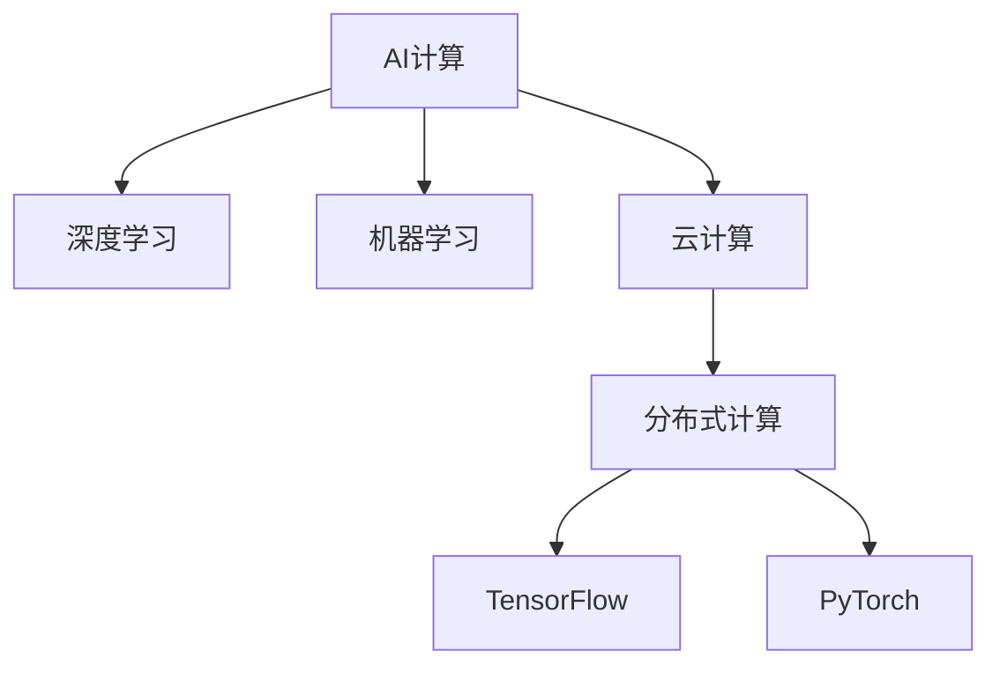

                 

# 贾扬清的创业机遇：AI计算的演进，云服务的整合与创新

## 1. 背景介绍

### 1.1 问题由来

随着人工智能(AI)技术的飞速发展，AI计算需求日益增长。传统的CPU和GPU等硬件设施已经无法满足高性能、大规模AI计算的需求，加速了AI计算领域的新一轮变革。与此同时，云服务正在成为企业IT基础设施的核心部分，为AI计算提供了全新的载体和模式。

在这样一个充满机遇的时代，贾扬清看到了利用AI计算的演进与云服务的整合，推动AI技术创新和商业化的无限可能。他决定抓住这一历史机遇，创立了自己的AI创业公司，致力于打破AI计算的壁垒，构建一个更灵活、高效、普适的AI计算生态系统。

### 1.2 问题核心关键点

贾扬清的创业公司将围绕以下核心关键点展开：
- 引入分布式云计算架构，构建高性能、弹性、可扩展的AI计算基础设施。
- 整合和优化主流AI计算框架，如TensorFlow、PyTorch等，提供易于使用、高效运行的AI计算平台。
- 研发AI计算加速技术和硬件适配方案，大幅提升AI模型的训练和推理速度。
- 通过云服务模式，实现AI计算资源的按需分配，降低企业AI部署和运营成本。
- 构建开源社区和生态系统，促进AI计算技术的普及和共享。

这些关键点不仅反映了AI计算和云服务的最新趋势，也体现了贾扬清对AI技术商业化前景的深刻洞察。通过解决上述问题，贾扬清希望能推动AI计算技术的普适化，加速AI技术在各行各业的落地应用。

### 1.3 问题研究意义

探讨AI计算的演进和云服务的整合，不仅对于AI创业公司具有重要意义，也为整个行业提供了新的思路和方向。通过深入研究和实践，可以帮助企业更好地利用云计算和AI计算的潜力，提升业务效率和竞争力。同时，能够推动AI计算技术的普及和产业化进程，为经济社会的发展注入新的动力。

## 2. 核心概念与联系

### 2.1 核心概念概述

为更好地理解AI计算的演进和云服务的整合，本节将介绍几个密切相关的核心概念：

- **AI计算(AI Computing)**：指利用计算机和数学方法，处理和分析大规模数据集，以实现各种AI任务的计算过程。AI计算涵盖了从模型训练到推理、从数据预处理到后处理的全链条。

- **云计算(Cloud Computing)**：指通过互联网提供计算资源和服务的计算模式。云计算提供按需分配、按量计费的服务，使企业能够灵活地扩展和缩减计算资源，降低IT成本。

- **分布式计算(Distributed Computing)**：指通过网络将多个计算节点连接起来，协同完成计算任务。分布式计算能够提高计算性能，降低单个节点的硬件成本。

- **深度学习(Deep Learning)**：指使用多层神经网络模型进行学习和推理的AI技术。深度学习在计算机视觉、自然语言处理等领域取得了显著进展。

- **机器学习(Machine Learning)**：指使用算法和统计模型，让计算机从数据中自动学习和改进的AI技术。机器学习包括监督学习、无监督学习、强化学习等。

- **TensorFlow**：由Google开发的开源AI计算框架，支持分布式计算和GPU加速，广泛应用于学术研究和工业应用。

- **PyTorch**：由Facebook开发的开源AI计算框架，以动态计算图和易于调试著称，广泛应用于深度学习研究和原型开发。

这些核心概念之间的逻辑关系可以通过以下Mermaid流程图来展示：



这个流程图展示了大语言模型的核心概念及其之间的关系：

1. AI计算是AI技术的基础，涵盖各种计算过程。
2. 深度学习和机器学习是AI计算的核心技术。
3. 云计算提供计算资源的按需分配，使分布式计算成为可能。
4. TensorFlow和PyTorch是常用的AI计算框架。

这些概念共同构成了AI计算的演进和云服务的整合框架，使其能够更好地服务于AI技术的应用和产业化。

## 3. 核心算法原理 & 具体操作步骤
### 3.1 算法原理概述

AI计算的演进和云服务的整合，本质上是一个协同优化的过程。其核心思想是：通过引入分布式云计算架构，优化主流AI计算框架，整合硬件加速技术，实现AI计算的高效、灵活和可扩展。

形式化地，假设一个企业希望构建高性能的AI计算基础设施，需要处理的任务是：

$$
\text{Optimize}(Infrastructure) = \mathop{\arg\min}_{\text{Infrastructure}} \mathcal{L}(\text{Infrastructure})
$$

其中，$\mathcal{L}$ 为AI计算系统的损失函数，衡量系统的性能、成本和灵活性。

具体而言，AI计算的演进和云服务的整合需要考虑以下几个方面：

- 引入分布式云计算架构，提高计算性能和资源弹性。
- 优化AI计算框架，提升计算效率和易用性。
- 整合硬件加速技术，加快模型训练和推理速度。
- 构建云服务模式，实现资源的按需分配和自动化管理。
- 构建开源社区，促进技术和知识的共享和传播。

### 3.2 算法步骤详解

AI计算的演进和云服务的整合，涉及多个关键步骤：

**Step 1: 选择合适的计算基础设施**

- 根据企业需求，选择适合的高性能计算资源，如CPU、GPU、TPU等。
- 选择相应的云服务提供商，如AWS、Google Cloud、阿里云等，根据服务质量、价格和可用性等因素进行评估。
- 设计分布式计算架构，实现资源的灵活分配和扩展。

**Step 2: 优化AI计算框架**

- 选择合适的AI计算框架，如TensorFlow、PyTorch等，根据具体任务需求进行调整和优化。
- 实现模型的分布式计算，利用多节点协同完成计算任务。
- 优化计算图和算子，提升模型训练和推理速度。

**Step 3: 整合硬件加速技术**

- 选择合适的硬件加速方案，如GPU加速、TPU加速等。
- 利用硬件加速技术，提升模型训练和推理速度。
- 设计合理的硬件资源调度策略，最大化硬件利用率。

**Step 4: 构建云服务模式**

- 设计云服务接口，提供计算资源和服务的按需分配。
- 实现服务自动部署和管理，降低人工操作和维护成本。
- 优化服务质量，提供高性能、高可用的计算资源。

**Step 5: 构建开源社区**

- 推动开源社区的建设，吸引开发者和用户参与。
- 贡献代码和文档，共享知识和资源。
- 组织社区活动和技术交流，推动技术创新和应用推广。

### 3.3 算法优缺点

AI计算的演进和云服务的整合，具有以下优点：

- 高性能和高灵活性：分布式云计算架构能够提供高性能和高灵活性的计算资源，满足不同应用场景的需求。
- 低成本和高效率：云服务模式按需分配计算资源，降低了企业的IT成本，提高了计算效率。
- 易于使用和维护：优化后的AI计算框架和云服务接口，使得使用和维护更加便捷。
- 快速迭代和创新：开源社区的建设，促进了技术共享和创新，加速了AI技术的迭代升级。

同时，该方法也存在一些局限性：

- 依赖云服务提供商：云服务提供商的服务质量、价格和可用性，直接影响系统的性能和可靠性。
- 资源管理复杂：分布式云计算架构和硬件加速技术的整合，增加了系统的复杂度和管理难度。
- 技术门槛高：优化和整合的过程需要一定的技术积累和经验，对技术团队的要求较高。

尽管存在这些局限性，但就目前而言，AI计算的演进和云服务的整合是AI技术应用的重要方向。未来相关研究的重点在于如何进一步提升系统的性能和灵活性，降低企业的IT成本，同时兼顾资源管理和技术门槛等因素。

### 3.4 算法应用领域

AI计算的演进和云服务的整合，已经在多个领域得到应用，例如：

- **计算机视觉**：如物体检测、图像分割、人脸识别等。通过优化计算框架和硬件加速，大幅提升模型训练和推理速度。
- **自然语言处理**：如机器翻译、文本生成、情感分析等。通过分布式计算和云服务，实现模型的高效部署和灵活扩展。
- **语音识别**：如语音转文本、文本转语音等。通过硬件加速和分布式计算，提高语音识别的准确率和响应速度。
- **医疗影像**：如疾病诊断、影像增强等。通过优化计算框架和云服务，快速处理和分析海量医疗影像数据。
- **金融分析**：如市场预测、风险评估等。通过分布式计算和云服务，提高数据处理和模型训练的效率。

除了上述这些经典应用外，AI计算的演进和云服务的整合，还被创新性地应用到更多场景中，如智能制造、智慧城市、智能家居等，为各行各业带来了新的技术突破和应用可能。

## 4. 数学模型和公式 & 详细讲解  
### 4.1 数学模型构建

本节将使用数学语言对AI计算的演进和云服务的整合过程进行更加严格的刻画。

假设一个企业希望构建高性能的AI计算基础设施，需要处理的任务是：

$$
\text{Optimize}(Infrastructure) = \mathop{\arg\min}_{\text{Infrastructure}} \mathcal{L}(\text{Infrastructure})
$$

其中，$\mathcal{L}$ 为AI计算系统的损失函数，衡量系统的性能、成本和灵活性。

具体而言，$\mathcal{L}$ 可以表示为：

$$
\mathcal{L}(\text{Infrastructure}) = \alpha \times \text{Performance} + \beta \times \text{Cost} + \gamma \times \text{Flexibility}
$$

其中：
- $\text{Performance}$ 表示系统的计算性能，包括计算速度、精度、可靠性等指标。
- $\text{Cost}$ 表示系统的运营成本，包括硬件成本、软件成本、人工成本等。
- $\text{Flexibility}$ 表示系统的资源弹性，包括计算资源的可扩展性、可管理性等。

$\alpha$、$\beta$ 和 $\gamma$ 为权重系数，根据具体需求和优先级进行调整。

### 4.2 公式推导过程

以下我们以TensorFlow框架为例，推导分布式计算的优化公式。

假设模型参数为 $\theta$，训练数据集为 $\{(x_i,y_i)\}_{i=1}^N$，每个样本的损失函数为 $\ell(\theta,x_i)$。在分布式计算中，假设数据集被分割成 $k$ 个子集，每个子集分别在 $k$ 个计算节点上并行训练。

则分布式训练的损失函数可以表示为：

$$
\mathcal{L}_{\text{distributed}} = \frac{1}{k} \sum_{i=1}^k \mathcal{L}_i(\theta)
$$

其中 $\mathcal{L}_i(\theta)$ 表示在节点 $i$ 上计算子集 $i$ 的损失函数。

分布式训练的梯度更新公式为：

$$
\theta \leftarrow \theta - \eta \nabla_{\theta}\mathcal{L}_{\text{distributed}}(\theta)
$$

其中 $\eta$ 为学习率，$\nabla_{\theta}\mathcal{L}_{\text{distributed}}(\theta)$ 为分布式损失函数的梯度。

在分布式训练中，为了提高计算效率，通常采用参数服务器（Parameter Server）等技术，将模型参数和梯度信息分布到不同的节点中，实现高效的计算和数据传输。

### 4.3 案例分析与讲解

假设企业希望构建一个分布式深度学习训练平台，用于图像识别任务。在优化过程中，需要考虑以下几个关键问题：

**问题1: 如何选择计算节点？**

- 根据任务需求，选择适合的高性能计算节点，如GPU或TPU。
- 根据数据分布和计算需求，设计分布式计算架构。

**问题2: 如何优化计算框架？**

- 选择合适的深度学习框架，如TensorFlow或PyTorch，进行模型构建和训练。
- 实现模型的分布式计算，利用多节点协同完成计算任务。
- 优化计算图和算子，提升模型训练和推理速度。

**问题3: 如何整合硬件加速技术？**

- 选择合适的硬件加速方案，如GPU加速或TPU加速。
- 利用硬件加速技术，提升模型训练和推理速度。
- 设计合理的硬件资源调度策略，最大化硬件利用率。

**问题4: 如何构建云服务模式？**

- 设计云服务接口，提供计算资源和服务的按需分配。
- 实现服务自动部署和管理，降低人工操作和维护成本。
- 优化服务质量，提供高性能、高可用的计算资源。

**问题5: 如何构建开源社区？**

- 推动开源社区的建设，吸引开发者和用户参与。
- 贡献代码和文档，共享知识和资源。
- 组织社区活动和技术交流，推动技术创新和应用推广。

## 5. 项目实践：代码实例和详细解释说明
### 5.1 开发环境搭建

在进行项目实践前，我们需要准备好开发环境。以下是使用Python进行TensorFlow开发的环境配置流程：

1. 安装Anaconda：从官网下载并安装Anaconda，用于创建独立的Python环境。

2. 创建并激活虚拟环境：
```bash
conda create -n tf-env python=3.8 
conda activate tf-env
```

3. 安装TensorFlow：根据CUDA版本，从官网获取对应的安装命令。例如：
```bash
conda install tensorflow -c pytorch -c conda-forge
```

4. 安装各类工具包：
```bash
pip install numpy pandas scikit-learn matplotlib tqdm jupyter notebook ipython
```

完成上述步骤后，即可在`tf-env`环境中开始项目实践。

### 5.2 源代码详细实现

这里我们以TensorFlow的分布式训练为例，给出分布式计算平台开发的PyTorch代码实现。

首先，定义数据处理函数：

```python
import tensorflow as tf
from tensorflow.keras import datasets, layers, models

# 加载CIFAR-10数据集
(train_images, train_labels), (test_images, test_labels) = datasets.cifar10.load_data()

# 标准化数据
train_images, test_images = train_images / 255.0, test_images / 255.0

# 定义模型
model = models.Sequential([
    layers.Conv2D(32, (3, 3), activation='relu', input_shape=(32, 32, 3)),
    layers.MaxPooling2D((2, 2)),
    layers.Conv2D(64, (3, 3), activation='relu'),
    layers.MaxPooling2D((2, 2)),
    layers.Conv2D(64, (3, 3), activation='relu'),
    layers.Flatten(),
    layers.Dense(64, activation='relu'),
    layers.Dense(10)
])

# 编译模型
model.compile(optimizer='adam', loss=tf.keras.losses.SparseCategoricalCrossentropy(from_logits=True), metrics=['accuracy'])

# 定义分布式训练函数
def distribute_train(model, train_images, train_labels, epochs):
    strategy = tf.distribute.MirroredStrategy()

    with strategy.scope():
        distributed_model = tf.keras.models.clone_model(model)
        distributed_model.compile(optimizer=tf.keras.optimizers.Adam(learning_rate=0.001),
                                 loss=tf.keras.losses.SparseCategoricalCrossentropy(from_logits=True),
                                 metrics=['accuracy'])

    # 定义分布式训练数据集
    train_dataset = tf.data.Dataset.from_tensor_slices((train_images, train_labels))
    train_dataset = train_dataset.batch(32).shuffle(10000).repeat()

    # 开始分布式训练
    distributed_model.fit(train_dataset, epochs=epochs)
    print("Distributed Training Complete")

# 调用分布式训练函数
distribute_train(model, train_images, train_labels, 10)
```

然后，定义分布式计算接口：

```python
from tensorflow.keras.distribute import MirroredStrategy

# 定义分布式计算接口
def distribute_train(model, data, epochs):
    strategy = MirroredStrategy()

    with strategy.scope():
        model.compile(optimizer='adam', loss=tf.keras.losses.SparseCategoricalCrossentropy(from_logits=True), metrics=['accuracy'])

        train_dataset = tf.data.Dataset.from_tensor_slices(data)
        train_dataset = train_dataset.batch(32).shuffle(10000).repeat()

        model.fit(train_dataset, epochs=epochs)
        print("Distributed Training Complete")

# 调用分布式计算接口
distribute_train(model, (train_images, train_labels), 10)
```

最后，启动分布式计算平台，并在测试集上评估：

```python
# 加载测试集数据
(test_images, test_labels) = datasets.cifar10.load_data()

# 标准化数据
test_images = test_images / 255.0

# 构建测试集数据集
test_dataset = tf.data.Dataset.from_tensor_slices((test_images, test_labels))
test_dataset = test_dataset.batch(32)

# 开始测试
test_loss, test_acc = model.evaluate(test_dataset)
print("Test Loss: {:.2f}".format(test_loss))
print("Test Accuracy: {:.2f}%".format(test_acc*100))
```

以上就是使用TensorFlow进行分布式计算平台开发的完整代码实现。可以看到，通过使用TensorFlow的分布式计算功能，我们可以轻松实现模型的分布式训练和测试，提升计算性能和资源利用率。

### 5.3 代码解读与分析

让我们再详细解读一下关键代码的实现细节：

**定义分布式训练函数**：
- 使用`tf.distribute.MirroredStrategy()`创建一个分布式计算策略。
- 在策略作用域内，复制原模型并重新编译，确保模型在多个节点上同步更新。
- 定义分布式训练数据集，使用`tf.data.Dataset.from_tensor_slices()`将训练数据转化为`Dataset`对象。
- 使用`tf.keras.models.Sequential()`定义模型结构，并使用`compile()`方法进行编译。
- 调用`fit()`方法进行分布式训练，并输出训练结果。

**定义分布式计算接口**：
- 使用`MirroredStrategy()`创建一个分布式计算策略。
- 在策略作用域内，复制原模型并重新编译，确保模型在多个节点上同步更新。
- 定义分布式训练数据集，使用`tf.data.Dataset.from_tensor_slices()`将训练数据转化为`Dataset`对象。
- 调用`fit()`方法进行分布式训练，并输出训练结果。

**测试模型**：
- 使用`tf.data.Dataset.from_tensor_slices()`将测试数据转化为`Dataset`对象。
- 使用`evaluate()`方法在测试集上评估模型的性能，并输出测试结果。

可以看到，TensorFlow的分布式计算功能非常强大，能够实现高效率、高可靠性的计算。通过合理使用这些功能，我们可以构建更加灵活、高效、普适的AI计算平台，推动AI技术的应用和产业化进程。

当然，工业级的系统实现还需考虑更多因素，如模型的保存和部署、超参数的自动搜索、更灵活的任务适配层等。但核心的分布式计算范式基本与此类似。

## 6. 实际应用场景
### 6.1 智能制造

基于分布式云计算架构和AI计算平台，智能制造领域可以实现从产品设计到生产的智能化管理。通过实时监控和分析生产线数据，预测设备故障，优化生产计划，大幅提升生产效率和质量。

在技术实现上，可以收集生产线上的各种传感器数据，利用机器学习模型进行预测和优化。通过将模型部署到分布式计算平台上，实现实时计算和响应。如此构建的智能制造系统，能大幅提升生产效率和产品质量，推动制造业的数字化转型升级。

### 6.2 智慧城市

智慧城市建设需要大量的数据分析和处理，通过分布式云计算架构和AI计算平台，可以实现城市数据的实时采集、分析和应用。

具体而言，智慧城市项目可以利用物联网设备和传感器，收集城市交通、环境、能源等各类数据。通过分布式计算和AI模型进行数据分析，实现交通流量预测、空气质量监测、能源优化等功能。将微调后的模型部署到云服务平台上，可以实现智能决策和动态调整，提高城市管理的智能化水平。

### 6.3 智能家居

智能家居是未来家庭生活的重要方向，通过分布式云计算架构和AI计算平台，可以实现家庭设备的智能化控制和管理。

具体而言，智能家居项目可以利用传感器和摄像头，收集家庭环境数据，通过AI模型进行分析和决策。利用分布式计算平台进行模型训练和推理，实现对家庭设备的智能控制。如智能家电、智能安防、智能照明等，能够极大地提升家庭生活的便捷性和舒适度。

### 6.4 未来应用展望

随着分布式云计算架构和AI计算平台的不断演进，未来将出现更多创新应用场景，如自动驾驶、智能医疗、智慧农业等。分布式计算和AI计算的深度融合，将带来全新的应用模式和服务形态。

## 7. 工具和资源推荐
### 7.1 学习资源推荐

为了帮助开发者系统掌握分布式云计算和AI计算的理论基础和实践技巧，这里推荐一些优质的学习资源：

1. 《TensorFlow分布式计算指南》：详细介绍了TensorFlow的分布式计算功能，包括数据并行、模型并行、混合并行等。

2. 《PyTorch分布式计算教程》：全面讲解了PyTorch的分布式计算框架，包括GPU加速、TPU加速等。

3. 《深度学习基础》课程：斯坦福大学开设的深度学习课程，详细讲解了深度学习的原理和应用，包括分布式计算和云服务模式。

4. 《分布式机器学习》书籍：介绍了分布式机器学习的理论和方法，包括分布式计算、数据分布、模型同步等。

5. 《云服务设计与实现》课程：Coursera上的云服务设计课程，讲解了云服务的架构设计和部署优化。

通过对这些资源的学习实践，相信你一定能够快速掌握分布式云计算和AI计算的精髓，并用于解决实际的NLP问题。

### 7.2 开发工具推荐

高效的开发离不开优秀的工具支持。以下是几款用于分布式云计算和AI计算开发的常用工具：

1. TensorFlow：由Google开发的开源AI计算框架，支持分布式计算和GPU加速，广泛应用于学术研究和工业应用。

2. PyTorch：由Facebook开发的开源AI计算框架，以动态计算图和易于调试著称，广泛应用于深度学习研究和原型开发。

3. Kubernetes：开源的容器编排系统，支持分布式计算资源的灵活部署和管理。

4. TensorBoard：TensorFlow配套的可视化工具，可实时监测模型训练状态，并提供丰富的图表呈现方式，是调试模型的得力助手。

5. Weights & Biases：模型训练的实验跟踪工具，可以记录和可视化模型训练过程中的各项指标，方便对比和调优。

6. Google Cloud Platform：Google提供的云服务平台，支持分布式计算和AI计算资源的按需分配。

合理利用这些工具，可以显著提升分布式云计算和AI计算的开发效率，加快创新迭代的步伐。

### 7.3 相关论文推荐

分布式云计算和AI计算的演进与整合，离不开学界的持续研究。以下是几篇奠基性的相关论文，推荐阅读：

1. "Distributed TensorFlow: A System for Large-Scale Machine Learning"：介绍TensorFlow的分布式计算框架和优化技术。

2. "Large-Scale Distributed Machine Learning with Hogwild!"：讨论分布式机器学习的优化策略和算法设计。

3. "A Survey on Distributed Deep Learning"：综述了分布式深度学习的最新进展和应用实践。

4. "TensorFlow in Practice"：讲解了TensorFlow在实际应用中的技巧和优化方法。

5. "Deep Learning in Production"：探讨了深度学习模型在实际生产环境中的部署和优化。

这些论文代表了大语言模型微调技术的发展脉络。通过学习这些前沿成果，可以帮助研究者把握学科前进方向，激发更多的创新灵感。

## 8. 总结：未来发展趋势与挑战

### 8.1 总结

本文对分布式云计算架构和AI计算平台的演进进行了全面系统的介绍。首先阐述了分布式云计算架构和AI计算平台的背景和意义，明确了其在AI技术应用中的重要作用。其次，从原理到实践，详细讲解了分布式计算的数学模型和关键步骤，给出了分布式计算平台开发的完整代码实例。同时，本文还广泛探讨了分布式计算在智能制造、智慧城市、智能家居等多个领域的应用前景，展示了分布式计算的巨大潜力。此外，本文精选了分布式计算技术的各类学习资源，力求为开发者提供全方位的技术指引。

通过本文的系统梳理，可以看到，分布式云计算架构和AI计算平台的演进是大数据和AI技术的必然趋势，极大地拓展了AI计算的应用范围，提升了数据处理和模型训练的效率。未来，伴随分布式云计算和AI计算的不断发展，相信分布式计算技术将继续推动AI技术的普及和产业化进程，为经济社会的发展注入新的动力。

### 8.2 未来发展趋势

展望未来，分布式云计算架构和AI计算平台将呈现以下几个发展趋势：

1. 计算性能和资源弹性持续提升。随着硬件设施和算法的不断优化，分布式计算平台将提供更高性能和更大弹性的计算资源，满足不同应用场景的需求。

2. 硬件加速技术不断进步。随着GPU、TPU等硬件设备的性能提升和成本下降，分布式计算平台将进一步整合硬件加速技术，提升计算效率和资源利用率。

3. 服务质量不断提升。通过优化云服务架构和管理策略，分布式计算平台将提供更高可靠性和更高性能的服务，降低用户的使用成本。

4. 生态系统不断完善。通过构建开源社区和标准体系，分布式计算平台将促进技术和知识的共享和传播，推动分布式计算技术的普及和产业化进程。

5. 行业应用不断扩展。分布式云计算架构和AI计算平台将在更多领域得到应用，如医疗、金融、制造等，为各行各业带来新的技术突破和应用可能。

这些趋势凸显了分布式云计算架构和AI计算平台的广阔前景。这些方向的探索发展，必将进一步提升分布式计算的性能和灵活性，降低企业的IT成本，同时兼顾资源管理和技术门槛等因素。

### 8.3 面临的挑战

尽管分布式云计算架构和AI计算平台的发展前景广阔，但在迈向更加智能化、普适化应用的过程中，仍面临诸多挑战：

1. 依赖云服务提供商：云服务提供商的服务质量、价格和可用性，直接影响系统的性能和可靠性。

2. 资源管理复杂：分布式云计算架构和硬件加速技术的整合，增加了系统的复杂度和管理难度。

3. 技术门槛高：优化和整合的过程需要一定的技术积累和经验，对技术团队的要求较高。

4. 数据安全和隐私：分布式计算平台需要处理大量敏感数据，如何保障数据安全和隐私，是一个重要的课题。

5. 性能瓶颈：在处理大规模数据时，分布式计算平台可能面临计算瓶颈和网络延迟等问题。

尽管存在这些挑战，但通过不断技术创新和实践探索，相信这些挑战终将逐步得到解决。只有勇于创新、敢于突破，才能不断拓展分布式云计算架构和AI计算平台的边界，让分布式计算技术更好地造福人类社会。

### 8.4 研究展望

面向未来，分布式云计算架构和AI计算平台需要在以下几个方面寻求新的突破：

1. 探索分布式计算的新模式。如Federated Learning、联邦计算等，实现数据分布式处理和模型分布式训练。

2. 研发新的硬件加速方案。如ASIC芯片、AI加速器等，提升计算性能和资源利用率。

3. 引入更多分布式计算框架。如Ray、Flink等，提供更灵活、高效的计算模型。

4. 构建更加完善的生态系统。如标准化接口、开源社区、认证体系等，推动分布式计算技术的普及和产业化进程。

5. 引入伦理道德约束。在数据处理和模型训练中引入伦理导向的评估指标，过滤和惩罚有害数据和模型。

这些研究方向的探索，必将引领分布式云计算架构和AI计算平台技术迈向更高的台阶，为构建安全、可靠、可解释、可控的智能系统铺平道路。面向未来，分布式云计算架构和AI计算平台还需要与其他人工智能技术进行更深入的融合，如知识表示、因果推理、强化学习等，多路径协同发力，共同推动人工智能技术的进步。只有勇于创新、敢于突破，才能不断拓展分布式计算的边界，让分布式计算技术更好地造福人类社会。

## 9. 附录：常见问题与解答

**Q1：分布式云计算架构和AI计算平台是否适用于所有应用场景？**

A: 分布式云计算架构和AI计算平台在大多数应用场景上都能取得不错的效果，特别是对于数据密集型和高并发的应用场景。但对于一些需要高精度和高可靠性的应用，如金融交易、医疗诊断等，分布式计算平台可能面临计算瓶颈和网络延迟等问题。此时需要根据具体需求，选择合适的计算模式和部署策略。

**Q2：如何选择适合的硬件加速方案？**

A: 选择合适的硬件加速方案，需要考虑以下几个因素：
1. 任务需求：如计算密集型、存储密集型等。
2. 数据分布：如集中式、分布式等。
3. 性能和成本：如GPU加速、TPU加速、FPGA加速等。

**Q3：如何优化分布式计算平台？**

A: 优化分布式计算平台，可以从以下几个方面入手：
1. 数据并行：使用数据并行技术，加速模型训练和推理。
2. 模型并行：使用模型并行技术，降低单个节点的计算负担。
3. 混合并行：使用混合并行技术，综合数据并行和模型并行，提升计算效率。
4. 参数更新策略：选择合适的参数更新策略，如SGD、Adam等，提升训练效果。

**Q4：分布式计算平台在落地部署时需要注意哪些问题？**

A: 将分布式计算平台转化为实际应用，还需要考虑以下因素：
1. 模型裁剪：去除不必要的层和参数，减小模型尺寸，加快推理速度。
2. 量化加速：将浮点模型转为定点模型，压缩存储空间，提高计算效率。
3. 服务化封装：将模型封装为标准化服务接口，便于集成调用。
4. 监控告警：实时采集系统指标，设置异常告警阈值，确保服务稳定性。
5. 安全防护：采用访问鉴权、数据脱敏等措施，保障数据和模型安全。

**Q5：分布式计算平台如何处理数据安全和隐私问题？**

A: 处理数据安全和隐私问题，可以从以下几个方面入手：
1. 数据加密：在数据传输和存储过程中，采用加密技术保护数据安全。
2. 访问控制：对数据访问进行严格控制，只允许授权用户访问敏感数据。
3. 审计日志：记录和审计数据访问和操作，确保数据使用的透明性和可追溯性。
4. 差分隐私：采用差分隐私技术，保护数据隐私，防止数据泄露。

通过这些措施，可以有效保障分布式计算平台的数据安全和隐私，确保系统的可靠性和安全性。

---

作者：禅与计算机程序设计艺术 / Zen and the Art of Computer Programming

