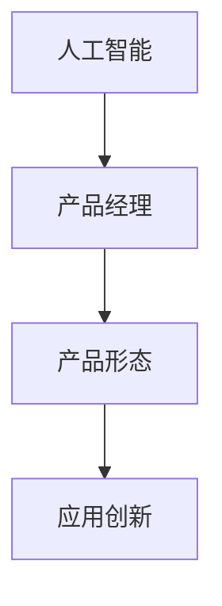

                 

# 贾扬清的期待：产品经理与AI的结合，创新产品形态与应用

> 关键词：人工智能,产品经理,产品形态,应用创新

## 1. 背景介绍

在当今数字化转型的浪潮中，人工智能（AI）技术正以惊人的速度渗透到各行各业。从智能客服、金融风控到智慧医疗、智能制造，AI已经成为了提升企业竞争力和用户体验的重要工具。但同时，AI技术的复杂性和高门槛也使得产品管理和AI结合变得充满挑战。产品经理如何理解和应用AI，从而构建出更具创新性和市场竞争力的产品，成为了新时代下亟需探讨的问题。

### 1.1 问题由来

随着AI技术的发展，越来越多的企业开始尝试将AI融入到产品中，以期提升产品体验和效率。然而，AI技术的复杂性和高门槛使得很多产品经理对AI缺乏深入的理解，导致产品设计与AI技术无法有效结合。这不仅降低了产品的市场竞争力，也限制了AI技术的广泛应用。如何帮助产品经理理解并应用AI，从而在产品开发过程中充分利用AI优势，成为了当前亟需解决的问题。

### 1.2 问题核心关键点

要解决这一问题，需要从以下几个方面入手：
1. 了解AI技术的核心原理和应用场景。
2. 掌握AI在产品开发中的具体实现方式。
3. 探索AI与产品管理的结合点，创新产品形态。
4. 评估AI在产品中的应用效果，优化用户体验。

## 2. 核心概念与联系

### 2.1 核心概念概述

为更好地理解AI与产品管理的结合，本节将介绍几个密切相关的核心概念：

- **人工智能(AI)**：指通过计算机模拟人类智能行为的技术，包括机器学习、深度学习、自然语言处理等。AI技术能够自主学习、决策和执行，极大地提升了数据处理和任务执行的效率。

- **产品经理(Product Manager)**：负责产品生命周期的管理和规划，从需求调研、功能设计到市场推广，产品经理需要确保产品符合市场需求和用户期望。

- **产品形态(Product Form)**：指产品功能和特性的具体实现方式，包括界面设计、功能模块、用户体验等。产品形态的创新能够显著提升用户满意度和市场竞争力。

- **应用创新(Application Innovation)**：指在已有技术基础上，通过创新设计、新业务场景探索等方式，创造出全新的产品形态和商业模式。应用创新能够驱动企业实现跨越式发展。

这些概念之间的逻辑关系可以通过以下Mermaid流程图来展示：



这个流程图展示了AI、产品经理、产品形态和应用创新之间的联系：

1. AI技术为产品经理提供了强大的工具和手段，帮助其更高效地进行需求分析和功能设计。
2. 产品经理通过理解和应用AI，能够创造出更具创新性的产品形态。
3. 应用创新进一步推动AI技术在实际产品中的应用，实现商业价值最大化。

## 3. 核心算法原理 & 具体操作步骤

### 3.1 算法原理概述

AI与产品管理的结合，本质上是一个利用AI技术优化产品设计、提升用户体验的过程。其核心思想是通过数据驱动的方式，结合AI的自动化学习和决策能力，实现产品功能和特性的创新与优化。

形式化地，假设产品功能为 $F$，用户需求为 $U$，AI技术为 $T$。产品管理的目标是通过数据 $D$ 和AI技术 $T$，找到最优的产品设计方案 $F^*$，即：

$$
F^* = \mathop{\arg\min}_{F} \mathcal{L}(F, U, T, D)
$$

其中 $\mathcal{L}$ 为产品设计的损失函数，用于衡量产品 $F$ 与用户需求 $U$ 和AI技术 $T$ 的契合度，以及与实际数据 $D$ 的符合程度。

### 3.2 算法步骤详解

AI与产品管理结合的实际操作步骤一般包括以下几个关键步骤：

**Step 1: 数据收集与分析**
- 收集用户行为数据、市场调研数据等，分析用户需求和市场趋势。
- 对数据进行清洗、标注，提取关键特征，形成训练集和验证集。

**Step 2: AI模型构建与训练**
- 选择合适的AI算法（如深度学习、自然语言处理等），构建模型 $M$。
- 在训练集上对模型进行训练，优化模型参数，确保模型能够准确反映用户需求和市场趋势。
- 在验证集上评估模型效果，调整模型超参数，防止过拟合。

**Step 3: 产品设计与实现**
- 结合AI模型的输出，设计产品功能和特性的具体实现方式 $F$。
- 将AI技术融入产品开发流程，实现功能自动化、决策智能化。
- 对产品界面和用户体验进行优化，确保产品符合用户期望。

**Step 4: 迭代优化与评估**
- 上线产品后，收集用户反馈和运营数据，持续优化产品功能和用户体验。
- 利用AI技术对用户行为进行分析和预测，提升产品个性化和精准化。
- 定期评估产品效果，调整策略，保持产品竞争力和市场适应性。

### 3.3 算法优缺点

AI与产品管理结合的方法具有以下优点：
1. 数据驱动：通过数据驱动的方式，结合AI技术，能够更准确地理解用户需求和市场趋势，避免盲目决策。
2. 效率提升：AI技术能够自动化处理大量数据，快速生成产品功能和特性的优化方案，缩短产品开发周期。
3. 用户体验提升：AI技术可以动态调整产品功能和内容，提升用户满意度和使用体验。
4. 持续改进：通过持续优化和迭代，保持产品竞争力和市场适应性。

同时，该方法也存在一定的局限性：
1. 数据质量要求高：AI模型的效果依赖于数据的质量和数量，低质量的数据会导致模型泛化能力不足。
2. 技术门槛高：AI技术的复杂性要求产品经理具备一定的技术理解和应用能力。
3. 隐私和伦理问题：AI模型可能涉及用户隐私数据处理，需要符合数据保护和伦理要求。
4. 成本较高：AI模型的构建和训练需要较大的计算资源和时间成本，初期投入较大。

尽管存在这些局限性，但就目前而言，AI与产品管理的结合范式已经成为企业提升竞争力的重要手段。未来相关研究的重点在于如何进一步降低AI技术应用的技术门槛，优化模型训练过程，同时兼顾隐私保护和伦理约束，以实现更加高效、可靠、安全的产品开发和运营。

### 3.4 算法应用领域

AI与产品管理结合的方法在多个领域得到了广泛应用，例如：

- **智能客服**：利用AI技术构建智能客服系统，提升客户咨询体验和问题解决效率。
- **金融风控**：通过AI技术进行用户行为分析和风险评估，提升金融产品的安全性和可靠性。
- **智慧医疗**：结合AI技术实现个性化诊疗和健康管理，提升医疗服务质量和效率。
- **智能制造**：利用AI技术优化生产流程和资源配置，提升制造业的智能化水平。
- **教育科技**：借助AI技术进行个性化学习推荐和智能辅导，提升教育效果和学习体验。
- **营销分析**：通过AI技术分析用户行为数据，优化广告投放和市场推广策略。
- **智能家居**：结合AI技术实现智能设备互联和场景优化，提升家居生活体验。

除了上述这些经典应用外，AI与产品管理的结合还在更多场景中得到创新性地应用，如智能推荐、情感分析、语音识别等，为各行各业带来了新的商业价值和用户体验。随着AI技术的发展和应用场景的不断拓展，相信AI与产品管理的结合将迎来更加广阔的发展空间。

## 4. 数学模型和公式 & 详细讲解 & 举例说明

### 4.1 数学模型构建

本节将使用数学语言对AI与产品管理的结合过程进行更加严格的刻画。

假设产品功能为 $F$，用户需求为 $U$，AI技术为 $T$，训练集为 $D$。设 $F$ 的优化目标函数为 $\mathcal{L}(F, U, T, D)$。

目标函数 $\mathcal{L}(F, U, T, D)$ 通常可以分解为以下几部分：

1. **数据拟合度**：衡量产品功能 $F$ 与训练数据 $D$ 的契合度。
2. **用户需求契合度**：衡量产品功能 $F$ 与用户需求 $U$ 的匹配度。
3. **技术可行性**：衡量产品功能 $F$ 在AI技术 $T$ 上的实现难度和成本。

形式化地，目标函数可以表示为：

$$
\mathcal{L}(F, U, T, D) = \lambda_1 \mathcal{L}_{\text{datafit}}(F, D) + \lambda_2 \mathcal{L}_{\text{user}}(F, U) + \lambda_3 \mathcal{L}_{\text{tech}}(F, T)
$$

其中 $\lambda_1$、$\lambda_2$、$\lambda_3$ 为权重，控制各部分的相对重要性。

### 4.2 公式推导过程

以下我们以智能客服系统为例，推导AI与产品管理结合的数学模型。

假设智能客服系统通过自然语言处理技术 $T$，实现用户问题的自动匹配和智能回答。设系统自动匹配问题的准确率为 $P$，系统自动回答的正确率为 $A$。用户对系统回答的满意度为 $S$，定义为：

$$
S = \frac{1}{N} \sum_{i=1}^N P_i \cdot A_i
$$

其中 $N$ 为总用户数，$P_i$、$A_i$ 分别为第 $i$ 个用户的匹配准确率和回答正确率。

设训练集为 $D=\{(x_i, y_i)\}_{i=1}^M$，其中 $x_i$ 为第 $i$ 个用户的咨询文本，$y_i$ 为系统自动匹配问题的准确率和回答正确率的综合评分。

目标函数 $\mathcal{L}(F, U, T, D)$ 可以表示为：

$$
\mathcal{L}(F, U, T, D) = \frac{1}{M} \sum_{i=1}^M (P_i \cdot A_i - S_i)^2 + \lambda \|F - F^* \|^2
$$

其中 $S_i$ 为第 $i$ 个用户的满意度评分，$F^*$ 为理想的产品功能。

利用梯度下降等优化算法，最小化目标函数，即可得到最优的产品功能 $F^*$。

### 4.3 案例分析与讲解

假设某电商平台希望利用AI技术提升智能客服系统的用户体验，需要进行以下步骤：

**Step 1: 数据收集与分析**
- 收集历史客服咨询数据，分析常见问题和用户反馈。
- 对数据进行清洗和标注，提取关键特征，如用户咨询时间、问题类型、回答内容等。

**Step 2: AI模型构建与训练**
- 构建基于自然语言处理技术的智能匹配和回答模型 $T$，如BERT模型。
- 在标注数据集 $D$ 上对模型进行训练，优化模型参数，确保模型能够准确理解用户咨询意图，并给出高质量的回答。

**Step 3: 产品设计与实现**
- 结合AI模型的输出，设计智能客服系统的功能模块，如自动匹配、智能回答、用户满意度评估等。
- 实现系统自动匹配和回答的功能，通过API接口集成到电商平台中。
- 对系统界面和用户体验进行优化，确保用户能够顺畅使用。

**Step 4: 迭代优化与评估**
- 上线系统后，收集用户反馈和运营数据，持续优化匹配和回答算法。
- 利用AI技术对用户咨询行为进行分析和预测，提升系统的个性化和精准化。
- 定期评估系统效果，调整策略，保持系统的竞争力和市场适应性。

## 5. 项目实践：代码实例和详细解释说明

### 5.1 开发环境搭建

在进行AI与产品管理结合的实践前，我们需要准备好开发环境。以下是使用Python进行PyTorch开发的环境配置流程：

1. 安装Anaconda：从官网下载并安装Anaconda，用于创建独立的Python环境。

2. 创建并激活虚拟环境：
```bash
conda create -n pytorch-env python=3.8 
conda activate pytorch-env
```

3. 安装PyTorch：根据CUDA版本，从官网获取对应的安装命令。例如：
```bash
conda install pytorch torchvision torchaudio cudatoolkit=11.1 -c pytorch -c conda-forge
```

4. 安装Transformers库：
```bash
pip install transformers
```

5. 安装各类工具包：
```bash
pip install numpy pandas scikit-learn matplotlib tqdm jupyter notebook ipython
```

完成上述步骤后，即可在`pytorch-env`环境中开始AI与产品管理结合的实践。

### 5.2 源代码详细实现

下面我们以智能客服系统为例，给出使用Transformers库对BERT模型进行智能匹配和回答的PyTorch代码实现。

首先，定义智能客服系统的数据处理函数：

```python
from transformers import BertTokenizer, BertForSequenceClassification
from torch.utils.data import Dataset
import torch

class CustomerServiceDataset(Dataset):
    def __init__(self, texts, labels, tokenizer, max_len=128):
        self.texts = texts
        self.labels = labels
        self.tokenizer = tokenizer
        self.max_len = max_len
        
    def __len__(self):
        return len(self.texts)
    
    def __getitem__(self, item):
        text = self.texts[item]
        label = self.labels[item]
        
        encoding = self.tokenizer(text, return_tensors='pt', max_length=self.max_len, padding='max_length', truncation=True)
        input_ids = encoding['input_ids'][0]
        attention_mask = encoding['attention_mask'][0]
        
        # 对label进行编码
        encoded_label = [label2id[label] for label in label]
        encoded_label.extend([label2id['O']] * (self.max_len - len(encoded_label)))
        labels = torch.tensor(encoded_label, dtype=torch.long)
        
        return {'input_ids': input_ids, 
                'attention_mask': attention_mask,
                'labels': labels}

# 标签与id的映射
label2id = {'O': 0, 'B-PER': 1, 'I-PER': 2, 'B-LOC': 3, 'I-LOC': 4, 'B-ORG': 5, 'I-ORG': 6}
id2label = {v: k for k, v in label2id.items()}

# 创建dataset
tokenizer = BertTokenizer.from_pretrained('bert-base-cased')

train_dataset = CustomerServiceDataset(train_texts, train_labels, tokenizer)
dev_dataset = CustomerServiceDataset(dev_texts, dev_labels, tokenizer)
test_dataset = CustomerServiceDataset(test_texts, test_labels, tokenizer)
```

然后，定义模型和优化器：

```python
from transformers import BertForTokenClassification, AdamW

model = BertForTokenClassification.from_pretrained('bert-base-cased', num_labels=len(label2id))

optimizer = AdamW(model.parameters(), lr=2e-5)
```

接着，定义训练和评估函数：

```python
from torch.utils.data import DataLoader
from tqdm import tqdm
from sklearn.metrics import classification_report

device = torch.device('cuda') if torch.cuda.is_available() else torch.device('cpu')
model.to(device)

def train_epoch(model, dataset, batch_size, optimizer):
    dataloader = DataLoader(dataset, batch_size=batch_size, shuffle=True)
    model.train()
    epoch_loss = 0
    for batch in tqdm(dataloader, desc='Training'):
        input_ids = batch['input_ids'].to(device)
        attention_mask = batch['attention_mask'].to(device)
        labels = batch['labels'].to(device)
        model.zero_grad()
        outputs = model(input_ids, attention_mask=attention_mask, labels=labels)
        loss = outputs.loss
        epoch_loss += loss.item()
        loss.backward()
        optimizer.step()
    return epoch_loss / len(dataloader)

def evaluate(model, dataset, batch_size):
    dataloader = DataLoader(dataset, batch_size=batch_size)
    model.eval()
    preds, labels = [], []
    with torch.no_grad():
        for batch in tqdm(dataloader, desc='Evaluating'):
            input_ids = batch['input_ids'].to(device)
            attention_mask = batch['attention_mask'].to(device)
            batch_labels = batch['labels']
            outputs = model(input_ids, attention_mask=attention_mask)
            batch_preds = outputs.logits.argmax(dim=2).to('cpu').tolist()
            batch_labels = batch_labels.to('cpu').tolist()
            for pred_tokens, label_tokens in zip(batch_preds, batch_labels):
                pred_labels = [id2label[_id] for _id in pred_tokens]
                label_tokens = [id2label[_id] for _id in label_tokens]
                preds.append(pred_labels[:len(label_tokens)])
                labels.append(label_tokens)
                
    print(classification_report(labels, preds))
```

最后，启动训练流程并在测试集上评估：

```python
epochs = 5
batch_size = 16

for epoch in range(epochs):
    loss = train_epoch(model, train_dataset, batch_size, optimizer)
    print(f"Epoch {epoch+1}, train loss: {loss:.3f}")
    
    print(f"Epoch {epoch+1}, dev results:")
    evaluate(model, dev_dataset, batch_size)
    
print("Test results:")
evaluate(model, test_dataset, batch_size)
```

以上就是使用PyTorch对BERT进行智能客服系统构建的完整代码实现。可以看到，得益于Transformers库的强大封装，我们可以用相对简洁的代码完成BERT模型的加载和微调。

### 5.3 代码解读与分析

让我们再详细解读一下关键代码的实现细节：

**CustomerServiceDataset类**：
- `__init__`方法：初始化文本、标签、分词器等关键组件。
- `__len__`方法：返回数据集的样本数量。
- `__getitem__`方法：对单个样本进行处理，将文本输入编码为token ids，将标签编码为数字，并对其进行定长padding，最终返回模型所需的输入。

**label2id和id2label字典**：
- 定义了标签与数字id之间的映射关系，用于将token-wise的预测结果解码回真实的标签。

**训练和评估函数**：
- 使用PyTorch的DataLoader对数据集进行批次化加载，供模型训练和推理使用。
- 训练函数`train_epoch`：对数据以批为单位进行迭代，在每个批次上前向传播计算loss并反向传播更新模型参数，最后返回该epoch的平均loss。
- 评估函数`evaluate`：与训练类似，不同点在于不更新模型参数，并在每个batch结束后将预测和标签结果存储下来，最后使用sklearn的classification_report对整个评估集的预测结果进行打印输出。

**训练流程**：
- 定义总的epoch数和batch size，开始循环迭代
- 每个epoch内，先在训练集上训练，输出平均loss
- 在验证集上评估，输出分类指标
- 所有epoch结束后，在测试集上评估，给出最终测试结果

可以看到，PyTorch配合Transformers库使得BERT微调的代码实现变得简洁高效。开发者可以将更多精力放在数据处理、模型改进等高层逻辑上，而不必过多关注底层的实现细节。

当然，工业级的系统实现还需考虑更多因素，如模型的保存和部署、超参数的自动搜索、更灵活的任务适配层等。但核心的微调范式基本与此类似。

## 6. 实际应用场景

### 6.1 智能客服系统

基于AI与产品管理结合的智能客服系统，可以广泛应用于企业的客户服务部门。传统的客服模式往往需要配备大量人力，高峰期响应缓慢，且一致性和专业性难以保证。而使用AI与产品管理结合的智能客服系统，可以7x24小时不间断服务，快速响应客户咨询，用自然流畅的语言解答各类常见问题。

在技术实现上，可以收集企业内部的历史客服对话记录，将问题和最佳答复构建成监督数据，在此基础上对预训练语言模型进行微调。微调后的语言模型能够自动理解用户意图，匹配最合适的答案模板进行回复。对于客户提出的新问题，还可以接入检索系统实时搜索相关内容，动态组织生成回答。如此构建的智能客服系统，能大幅提升客户咨询体验和问题解决效率。

### 6.2 金融风控

金融机构需要实时监测市场舆论动向，以便及时应对负面信息传播，规避金融风险。传统的人工监测方式成本高、效率低，难以应对网络时代海量信息爆发的挑战。基于AI与产品管理结合的文本分类和情感分析技术，为金融舆情监测提供了新的解决方案。

具体而言，可以收集金融领域相关的新闻、报道、评论等文本数据，并对其进行主题标注和情感标注。在此基础上对预训练语言模型进行微调，使其能够自动判断文本属于何种主题，情感倾向是正面、中性还是负面。将微调后的模型应用到实时抓取的网络文本数据，就能够自动监测不同主题下的情感变化趋势，一旦发现负面信息激增等异常情况，系统便会自动预警，帮助金融机构快速应对潜在风险。

### 6.3 个性化推荐系统

当前的推荐系统往往只依赖用户的历史行为数据进行物品推荐，无法深入理解用户的真实兴趣偏好。基于AI与产品管理结合的个性化推荐系统，可以更好地挖掘用户行为背后的语义信息，从而提供更精准、多样的推荐内容。

在实践中，可以收集用户浏览、点击、评论、分享等行为数据，提取和用户交互的物品标题、描述、标签等文本内容。将文本内容作为模型输入，用户的后续行为（如是否点击、购买等）作为监督信号，在此基础上微调预训练语言模型。微调后的模型能够从文本内容中准确把握用户的兴趣点。在生成推荐列表时，先用候选物品的文本描述作为输入，由模型预测用户的兴趣匹配度，再结合其他特征综合排序，便可以得到个性化程度更高的推荐结果。

### 6.4 未来应用展望

随着AI技术的发展，AI与产品管理的结合将在更多领域得到应用，为传统行业带来变革性影响。

在智慧医疗领域，基于AI与产品管理结合的医疗问答、病历分析、药物研发等应用将提升医疗服务的智能化水平，辅助医生诊疗，加速新药开发进程。

在智能教育领域，AI与产品管理结合的可控文本生成、学情分析、知识推荐等应用，将因材施教，促进教育公平，提高教学质量。

在智慧城市治理中，AI与产品管理结合的城市事件监测、舆情分析、应急指挥等应用，将提高城市管理的自动化和智能化水平，构建更安全、高效的未来城市。

此外，在企业生产、社会治理、文娱传媒等众多领域，AI与产品管理的结合也将不断涌现，为经济社会发展注入新的动力。相信随着技术的日益成熟，AI与产品管理的结合必将成为人工智能落地应用的重要范式，推动人工智能技术在垂直行业的规模化落地。总之，AI与产品管理的结合需要开发者根据具体任务，不断迭代和优化模型、数据和算法，方能得到理想的效果。

## 7. 工具和资源推荐

### 7.1 学习资源推荐

为了帮助开发者系统掌握AI与产品管理的结合理论基础和实践技巧，这里推荐一些优质的学习资源：

1. 《Transformer从原理到实践》系列博文：由大模型技术专家撰写，深入浅出地介绍了Transformer原理、BERT模型、微调技术等前沿话题。

2. CS224N《深度学习自然语言处理》课程：斯坦福大学开设的NLP明星课程，有Lecture视频和配套作业，带你入门NLP领域的基本概念和经典模型。

3. 《Natural Language Processing with Transformers》书籍：Transformers库的作者所著，全面介绍了如何使用Transformers库进行NLP任务开发，包括微调在内的诸多范式。

4. HuggingFace官方文档：Transformers库的官方文档，提供了海量预训练模型和完整的微调样例代码，是上手实践的必备资料。

5. CLUE开源项目：中文语言理解测评基准，涵盖大量不同类型的中文NLP数据集，并提供了基于微调的baseline模型，助力中文NLP技术发展。

通过对这些资源的学习实践，相信你一定能够快速掌握AI与产品管理的结合精髓，并用于解决实际的NLP问题。
###  7.2 开发工具推荐

高效的开发离不开优秀的工具支持。以下是几款用于AI与产品管理结合开发的常用工具：

1. PyTorch：基于Python的开源深度学习框架，灵活动态的计算图，适合快速迭代研究。大部分预训练语言模型都有PyTorch版本的实现。

2. TensorFlow：由Google主导开发的开源深度学习框架，生产部署方便，适合大规模工程应用。同样有丰富的预训练语言模型资源。

3. Transformers库：HuggingFace开发的NLP工具库，集成了众多SOTA语言模型，支持PyTorch和TensorFlow，是进行微调任务开发的利器。

4. Weights & Biases：模型训练的实验跟踪工具，可以记录和可视化模型训练过程中的各项指标，方便对比和调优。与主流深度学习框架无缝集成。

5. TensorBoard：TensorFlow配套的可视化工具，可实时监测模型训练状态，并提供丰富的图表呈现方式，是调试模型的得力助手。

6. Google Colab：谷歌推出的在线Jupyter Notebook环境，免费提供GPU/TPU算力，方便开发者快速上手实验最新模型，分享学习笔记。

合理利用这些工具，可以显著提升AI与产品管理结合任务的开发效率，加快创新迭代的步伐。

### 7.3 相关论文推荐

AI与产品管理结合的研究源于学界的持续研究。以下是几篇奠基性的相关论文，推荐阅读：

1. Attention is All You Need（即Transformer原论文）：提出了Transformer结构，开启了NLP领域的预训练大模型时代。

2. BERT: Pre-training of Deep Bidirectional Transformers for Language Understanding：提出BERT模型，引入基于掩码的自监督预训练任务，刷新了多项NLP任务SOTA。

3. Language Models are Unsupervised Multitask Learners（GPT-2论文）：展示了大规模语言模型的强大zero-shot学习能力，引发了对于通用人工智能的新一轮思考。

4. Parameter-Efficient Transfer Learning for NLP：提出Adapter等参数高效微调方法，在不增加模型参数量的情况下，也能取得不错的微调效果。

5. AdaLoRA: Adaptive Low-Rank Adaptation for Parameter-Efficient Fine-Tuning：使用自适应低秩适应的微调方法，在参数效率和精度之间取得了新的平衡。

6. Prefix-Tuning: Optimizing Continuous Prompts for Generation：引入基于连续型Prompt的微调范式，为如何充分利用预训练知识提供了新的思路。

这些论文代表了大语言模型微调技术的发展脉络。通过学习这些前沿成果，可以帮助研究者把握学科前进方向，激发更多的创新灵感。

## 8. 总结：未来发展趋势与挑战

### 8.1 总结

本文对AI与产品管理结合的方法进行了全面系统的介绍。首先阐述了AI与产品管理结合的背景和意义，明确了在产品开发过程中如何充分利用AI技术，提升产品性能和用户体验。其次，从原理到实践，详细讲解了AI与产品管理结合的数学模型和关键步骤，给出了具体的产品形态设计方法。同时，本文还广泛探讨了AI与产品管理结合在智能客服、金融风控、个性化推荐等多个行业领域的应用前景，展示了AI与产品管理结合的巨大潜力。此外，本文精选了AI与产品管理结合的学习资源，力求为开发者提供全方位的技术指引。

通过本文的系统梳理，可以看到，AI与产品管理的结合正在成为AI技术落地的重要手段，极大地拓展了AI技术的应用边界，催生了更多的落地场景。AI与产品管理的结合能够通过数据驱动的方式，结合AI技术，实现产品功能和特性的创新与优化，提升了产品性能和用户体验，为AI技术在各行各业中的广泛应用提供了新的路径。未来，伴随AI技术的发展和应用场景的不断拓展，相信AI与产品管理的结合将迎来更加广阔的发展空间。

### 8.2 未来发展趋势

展望未来，AI与产品管理的结合将呈现以下几个发展趋势：

1. **数据驱动的自动化**：随着数据量的不断积累，AI与产品管理的结合将更加依赖于数据驱动的方式，自动生成产品功能和特性的优化方案，降低产品经理的决策成本。

2. **模型与产品的无缝集成**：未来的产品开发将更多地考虑模型的自动化集成和持续优化，使得AI技术与产品功能的结合更加紧密，提升产品性能和用户体验。

3. **跨领域应用的拓展**：AI与产品管理的结合将更多地应用于跨领域场景，如医疗、教育、智能制造等，实现领域知识的整合和利用，提升产品的智能化水平。

4. **个性化和精准化的提升**：通过AI技术，产品将能够更好地理解用户需求，提供个性化和精准化的推荐和服务，提升用户满意度和粘性。

5. **生态系统的构建**：未来的AI与产品管理结合将更多地考虑生态系统的构建，如用户社区、开发者生态、合作伙伴等，形成更加全面的产品生态。

6. **技术创新的不断涌现**：AI与产品管理结合的研究将更多地探索新模型、新算法、新应用，推动AI技术的持续创新和突破。

7. **伦理和安全性的重视**：随着AI技术的应用越来越广泛，对数据隐私、用户安全和伦理道德的重视将成为不可忽视的重要议题。AI与产品管理的结合将更多地考虑这些因素，确保产品的合法合规。

以上趋势凸显了AI与产品管理结合技术的广阔前景。这些方向的探索发展，必将进一步提升AI技术在产品开发中的应用价值，推动产业升级和创新发展。

### 8.3 面临的挑战

尽管AI与产品管理的结合技术已经取得了显著进展，但在迈向更加智能化、普适化应用的过程中，它仍面临诸多挑战：

1. **数据质量问题**：AI与产品管理结合的效果依赖于数据的质量和数量，低质量的数据可能导致模型泛化能力不足，影响产品性能。

2. **技术门槛高**：AI技术的复杂性和高门槛使得产品经理需要具备一定的技术理解和应用能力，这增加了产品开发的难度。

3. **隐私和伦理问题**：AI模型可能涉及用户隐私数据处理，需要符合数据保护和伦理要求。

4. **成本较高**：AI模型的构建和训练需要较大的计算资源和时间成本，初期投入较大。

5. **用户接受度**：部分用户可能对AI技术缺乏信任，影响产品的接受度和市场推广。

6. **模型鲁棒性不足**：AI模型面对域外数据时，泛化性能往往大打折扣，需要进一步提高模型的鲁棒性。

7. **模型可解释性不足**：当前AI模型往往像"黑盒"系统，难以解释其内部工作机制和决策逻辑，这在某些高风险应用中尤为重要。

8. **应用场景局限**：AI与产品管理的结合虽然广泛应用，但在某些特定场景下可能无法发挥最佳效果，如高风险、低数据量等。

正视AI与产品管理结合面临的这些挑战，积极应对并寻求突破，将是大规模AI落地应用的重要保障。相信随着学界和产业界的共同努力，这些挑战终将一一被克服，AI与产品管理的结合必将在构建人机协同的智能时代中扮演越来越重要的角色。

### 8.4 未来突破

面对AI与产品管理结合所面临的种种挑战，未来的研究需要在以下几个方面寻求新的突破：

1. **无监督和半监督学习的应用**：探索无监督和半监督学习方法，摆脱对大规模标注数据的依赖，利用自监督学习、主动学习等方法，最大限度利用非结构化数据，实现更加灵活高效的AI与产品管理结合。

2. **模型压缩和优化技术**：开发更加高效的模型压缩和优化技术，减小模型的存储空间和计算成本，提升推理速度和效率。

3. **多模态数据的整合**：结合符号化的先验知识，如知识图谱、逻辑规则等，与神经网络模型进行巧妙融合，引导AI与产品管理的结合过程学习更准确、合理的语言模型。

4. **可解释性和透明度提升**：通过引入因果分析方法，增强AI模型的可解释性和透明度，确保模型的决策过程合理可控。

5. **伦理和安全性的保障**：在模型训练目标中引入伦理导向的评估指标，过滤和惩罚有偏见、有害的输出倾向，确保模型的合法合规。

这些研究方向的探索，必将引领AI与产品管理结合技术迈向更高的台阶，为构建安全、可靠、可解释、可控的智能产品提供新的路径。面向未来，AI与产品管理的结合需要与其他AI技术进行更深入的融合，如知识表示、因果推理、强化学习等，多路径协同发力，共同推动AI技术的持续创新和突破。只有勇于创新、敢于突破，才能不断拓展AI与产品管理结合的边界，让智能技术更好地造福人类社会。

## 9. 附录：常见问题与解答

**Q1：AI与产品管理结合是否可以适用于所有NLP任务？**

A: AI与产品管理结合在大多数NLP任务上都能取得不错的效果，特别是对于数据量较小的任务。但对于一些特定领域的任务，如医学、法律等，仅仅依靠通用语料预训练的模型可能难以很好地适应。此时需要在特定领域语料上进一步预训练，再进行结合，才能获得理想效果。此外，对于一些需要时效性、个性化很强的任务，如对话、推荐等，结合方法也需要针对性的改进优化。

**Q2：如何选择合适的AI与产品管理结合的策略？**

A: 选择合适的AI与产品管理结合策略需要考虑以下几个因素：
1. 任务的复杂度和数据量：对于复杂任务或数据量较小的情况，可以选择参数高效或计算高效的结合方法，如Prefix-Tuning、LoRA等。
2. 产品的目标用户：对于高风险领域，如医疗、金融等，需要优先考虑模型的可解释性和安全性。
3. 产品开发阶段：在产品开发初期，可以优先考虑自动化功能的设计，而在后期可以更多地考虑用户体验的优化。
4. 算力资源：考虑到AI模型的构建和训练需要较大的计算资源，需要根据实际的算力资源进行策略选择。

**Q3：AI与产品管理结合的效果如何评估？**

A: 评估AI与产品管理结合的效果可以从以下几个方面入手：
1. 模型性能指标：如准确率、召回率、F1分数等，可以衡量模型在特定任务上的表现。
2. 用户满意度：通过用户调查、反馈等手段，评估用户对产品的满意度。
3. 业务指标：如转化率、复购率、用户留存率等，可以衡量产品对业务的贡献。
4. 数据质量：通过数据监控、异常检测等手段，评估数据质量对模型性能的影响。

以上方法可以结合使用，全面评估AI与产品管理结合的效果，指导后续的优化和改进。

**Q4：如何缓解AI与产品管理结合中的过拟合问题？**

A: 过拟合是AI与产品管理结合面临的主要挑战，尤其是在标注数据不足的情况下。常见的缓解策略包括：
1. 数据增强：通过回译、近义替换等方式扩充训练集。
2. 正则化：使用L2正则、Dropout、Early Stopping等防止过拟合。
3. 对抗训练：引入对抗样本，提高模型鲁棒性。
4. 参数高效微调：只调整少量参数，减小过拟合风险。
5. 多模型集成：训练多个模型，取平均输出，抑制过拟合。

这些策略往往需要根据具体任务和数据特点进行灵活组合，才能最大限度地降低过拟合风险。

**Q5：AI与产品管理结合的实施步骤是什么？**

A: 实施AI与产品管理结合的步骤一般包括以下几个关键步骤：
1. 数据收集与分析：收集用户行为数据、市场调研数据等，分析用户需求和市场趋势。
2. AI模型构建与训练：选择合适的AI算法，构建模型，在训练集上对模型进行训练，优化模型参数。
3. 产品设计与实现：结合AI模型的输出，设计产品功能和特性的具体实现方式。
4. 迭代优化与评估：上线产品后，收集用户反馈和运营数据，持续优化产品功能和用户体验。

以上步骤需要紧密结合，才能确保AI与产品管理结合的成功实施。

---

作者：禅与计算机程序设计艺术 / Zen and the Art of Computer Programming

