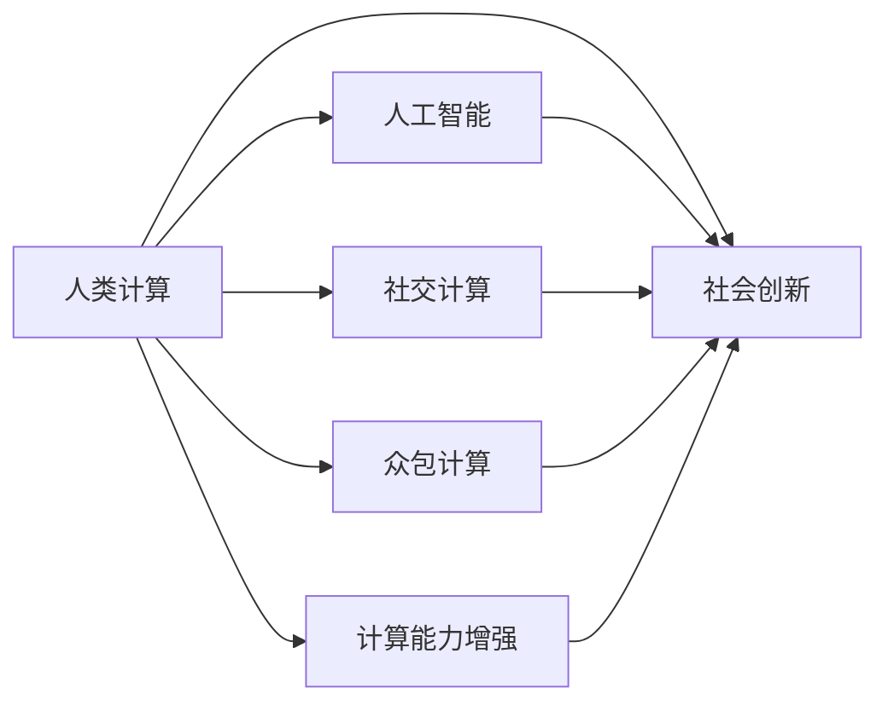

                 

# 赋能个人与社区：人类计算的社会价值

在数字时代，计算机技术的发展极大地改变了我们的生活和工作方式。从个人电脑、互联网到移动互联网，再到人工智能、物联网等新兴技术，每一次技术的飞跃都带来了深刻的社会影响。本文旨在探讨人类计算在赋能个人与社区、提升社会价值方面的独特价值，并展望未来发展趋势与挑战。

## 1. 背景介绍

### 1.1 问题由来

随着计算技术的普及，越来越多的个人和社区得以利用计算能力改善自身的生活质量。互联网的普及使得信息获取、沟通交流更加便捷，计算机辅助设计、生产制造提升了工作效率，人工智能和大数据技术则让预测分析、智能决策成为可能。这些计算技术的应用不仅改善了人们的生活，还促进了知识的传播、文化的交流，增强了社会的协作与创新。然而，尽管计算技术带来了许多便利，其在社会价值方面的潜能尚未被充分挖掘。本文将探讨人类计算技术如何通过赋能个人与社区，提升社会整体的协作效率、创新能力和生活质量。

### 1.2 问题核心关键点

本文的核心问题是：人类计算技术如何通过提升个人与社区的信息处理、协作交流、知识创造等能力，进而赋能社会的发展。要回答这个问题，需要从以下几个方面进行深入探讨：
1. 个人计算能力提升的路径与方法。
2. 社区计算资源共享与协作的方式。
3. 社会创新与协作的机制与平台。
4. 计算技术在提升社会生活质量方面的应用。

## 2. 核心概念与联系

### 2.1 核心概念概述

为更好地理解人类计算的社会价值，本文将介绍几个关键概念及其之间的联系：

- **人类计算（Human Computation）**：指利用人类智能与计算机技术的结合，解决复杂问题的过程。它包括人工计算、众包计算、社交计算等多种形式。
- **人工智能（Artificial Intelligence, AI）**：通过机器学习、深度学习等技术，使计算机具备类似人类的智能决策能力。AI可以辅助人类进行数据分析、预测、自动化等任务。
- **社交计算（Social Computing）**：通过社交网络、在线社区等平台，实现信息的交流、协作、知识共享等功能。社交计算是提升社区协作效率的重要手段。
- **众包计算（Crowdsourcing）**：利用互联网平台，将大量小任务分配给众多人完成，以此汇聚分散的知识和能力，提升任务处理效率。
- **计算能力增强（Enhanced Computational Capabilities）**：通过软硬件升级、算法优化、数据处理等手段，提升个人与社区的计算能力，使其能够处理更复杂的任务。
- **社会创新（Social Innovation）**：利用计算技术推动社会新模式、新业态的涌现，提升社会整体的创新能力。

这些核心概念之间通过协同工作，共同推动计算技术的社会价值实现。

### 2.2 核心概念原理和架构的 Mermaid 流程图



这个流程图展示了人类计算与人工智能、社交计算、众包计算、计算能力增强和社会创新之间的关系。每个概念通过特定技术或方法，影响社会价值实现的路径。

## 3. 核心算法原理 & 具体操作步骤

### 3.1 算法原理概述

人类计算的社会价值实现，依赖于计算技术与人类智能的协同工作。其基本原理是通过算法优化、数据处理等手段，提升计算能力，并通过社交平台、众包平台等途径，促进知识共享与协作，进而实现社会创新与进步。

### 3.2 算法步骤详解

1. **数据采集与预处理**：利用传感器、互联网平台等手段，采集社会各领域的数据。通过数据清洗、标准化等预处理，确保数据的准确性和可用性。

2. **算法设计与优化**：根据具体任务需求，设计合适的算法模型。通过机器学习、深度学习等方法，优化算法的性能，提升计算效率。

3. **知识共享与协作**：利用社交网络、在线社区等平台，促进知识共享与协作。通过众包平台分配任务，汇聚分散的知识和能力。

4. **社会创新与实践**：将优化后的算法应用于社会各个领域，如医疗、教育、农业等，提升社会整体的创新能力和生活质量。

### 3.3 算法优缺点

#### 优点：
1. **提高效率**：通过计算技术的优化，大幅提升数据处理和任务执行的效率。
2. **促进创新**：利用计算技术推动新模式、新业态的涌现，提升社会创新能力。
3. **赋能个体**：通过计算平台，提供丰富资源，赋能个人提升自我能力。

#### 缺点：
1. **数据隐私问题**：大量数据采集和处理可能导致隐私泄露，需加强数据保护措施。
2. **算法公平性**：优化算法可能存在偏见，需确保算法公平性。
3. **计算资源不均**：计算资源分配不均可能导致资源浪费和效率下降。

### 3.4 算法应用领域

#### 医疗领域
计算技术在医疗领域的应用，可以通过数据挖掘、图像识别等方法，提升疾病诊断、治疗方案制定等能力。例如，利用深度学习算法分析医学影像，早期发现病变，提升医疗效率。

#### 教育领域
在教育领域，通过在线教育平台、智能辅导系统等，利用计算技术提升教学质量和个性化教育。例如，智能推荐系统可以根据学生的学习习惯和能力，推荐合适的学习内容。

#### 农业领域
农业领域可以利用计算技术优化种植、养殖等过程，提升农作物产量和农业生产效率。例如，通过大数据分析，预测天气变化，优化灌溉和施肥策略。

#### 智能城市
智能城市利用计算技术提升城市管理水平，如交通流量优化、能源消耗监控等。通过实时数据分析，优化城市基础设施配置，提高城市运行效率。

## 4. 数学模型和公式 & 详细讲解 & 举例说明

### 4.1 数学模型构建

以智能推荐系统为例，其核心数学模型包括用户-物品评分矩阵 $R$、用户特征向量 $U$、物品特征向量 $V$ 和目标函数 $L$。评分矩阵 $R$ 表示用户对物品的评分，$U$ 和 $V$ 分别表示用户和物品的特征向量，$L$ 为目标函数。

### 4.2 公式推导过程

目标函数 $L$ 通常采用矩阵分解的方法，将用户-物品评分矩阵 $R$ 分解为用户特征向量 $U$ 和物品特征向量 $V$ 的乘积。

$$
R \approx UV^T
$$

通过最小化目标函数 $L$，可以求解出最优的用户特征向量 $U$ 和物品特征向量 $V$。

### 4.3 案例分析与讲解

以Netflix智能推荐系统为例，通过上述数学模型，Netflix 可以预测用户对未观看电影的评分，从而推荐用户感兴趣的电影。该系统通过实时更新 $U$ 和 $V$，不断优化推荐结果。

## 5. 项目实践：代码实例和详细解释说明

### 5.1 开发环境搭建

1. **Python环境准备**：
   - 安装Anaconda，并创建虚拟环境。
   - 安装必要的Python包，如NumPy、Pandas、Scikit-learn等。

2. **数据准备**：
   - 收集用户-物品评分数据，并进行预处理。

3. **模型搭建与训练**：
   - 使用深度学习框架（如TensorFlow、PyTorch）搭建推荐模型。
   - 通过交叉验证等方法，优化模型参数。

4. **模型评估与优化**：
   - 使用测试数据集评估模型效果。
   - 通过A/B测试等方法，优化模型性能。

### 5.2 源代码详细实现

```python
import numpy as np
import pandas as pd
from sklearn.decomposition import TruncatedSVD
from sklearn.metrics.pairwise import cosine_similarity

# 数据加载
data = pd.read_csv('rating.csv')

# 数据预处理
user_ids = data['user_id'].unique()
item_ids = data['item_id'].unique()
rating_matrix = np.zeros((len(user_ids), len(item_ids)))

for i, row in data.iterrows():
    user_id = row['user_id']
    item_id = row['item_id']
    rating = row['rating']
    rating_matrix[user_ids.index(user_id), item_ids.index(item_id)] = rating

# 模型训练
model = TruncatedSVD(n_components=50)
user_factors = model.fit_transform(rating_matrix)

# 模型评估
def get_user_similarity(user_id):
    user_row = user_factors[user_ids.index(user_id)]
    return cosine_similarity(user_row[:, None], user_factors)

# 获取推荐结果
def get_recommendations(user_id):
    similarity_scores = get_user_similarity(user_id)
    recommended_items = np.argsort(similarity_scores)[1:]  # 排除自己
    return recommended_items
```

### 5.3 代码解读与分析

上述代码实现了基于奇异值分解（SVD）的推荐系统。代码首先加载和预处理评分数据，然后进行奇异值分解，获取用户特征向量。最后，通过计算用户相似度，获取推荐结果。

## 6. 实际应用场景

### 6.1 医疗领域

在医疗领域，计算技术可以应用于疾病预测、治疗方案推荐等任务。例如，利用机器学习算法分析电子病历数据，预测患者的疾病发展趋势，提前采取干预措施。

### 6.2 教育领域

在教育领域，计算技术可以提升个性化教育效果。例如，智能辅导系统根据学生的学习情况，推荐合适的学习资源和练习题。

### 6.3 农业领域

在农业领域，计算技术可以优化农业生产过程，提高农作物产量和农业生产效率。例如，利用大数据分析，优化灌溉和施肥策略，提升作物产量。

### 6.4 智能城市

智能城市利用计算技术提升城市管理水平，如交通流量优化、能源消耗监控等。通过实时数据分析，优化城市基础设施配置，提高城市运行效率。

## 7. 工具和资源推荐

### 7.1 学习资源推荐

1. **《Python数据分析》**：系统介绍了Python在数据分析中的应用，适合初学者入门。
2. **《深度学习》**：吴恩达教授在Coursera上的课程，全面介绍了深度学习的基本原理和应用。
3. **《机器学习实战》**：通过实践项目，详细讲解了机器学习算法的实现。
4. **Kaggle**：提供大量数据集和竞赛，适合学习数据科学和机器学习。
5. **GitHub**：提供开源项目和代码库，方便学习和交流。

### 7.2 开发工具推荐

1. **Python**：广泛使用的编程语言，支持丰富的数据处理和机器学习库。
2. **TensorFlow**：谷歌开发的深度学习框架，支持分布式计算和GPU加速。
3. **PyTorch**：Facebook开发的深度学习框架，支持动态计算图和灵活模型设计。
4. **Jupyter Notebook**：交互式编程环境，适合数据科学和机器学习开发。
5. **WeChat Mini Program**：用于开发小程序，方便在移动端进行计算和数据处理。

### 7.3 相关论文推荐

1. **《The Future of Human Computation》**：探讨了未来计算技术的发展趋势及其对社会的影响。
2. **《Social Computing: The Next Generation of Collaborative Web Science》**：介绍了社交计算在促进知识共享和协作方面的作用。
3. **《Crowdsourcing: A Field Guide》**：详细介绍了众包计算的原理和实践应用。

## 8. 总结：未来发展趋势与挑战

### 8.1 研究成果总结

本文介绍了人类计算技术在提升个人与社区计算能力、促进社会创新方面的独特价值。通过数据分析、算法优化和社交计算等手段，计算技术赋能了社会各领域的创新与进步。

### 8.2 未来发展趋势

未来，人类计算技术将向更加智能化、普及化和集成化方向发展。计算技术将在教育、医疗、农业等领域得到广泛应用，提升社会整体的创新能力和生活质量。

### 8.3 面临的挑战

1. **数据隐私问题**：大规模数据采集和处理可能导致隐私泄露，需加强数据保护措施。
2. **算法公平性**：优化算法可能存在偏见，需确保算法公平性。
3. **计算资源不均**：计算资源分配不均可能导致资源浪费和效率下降。

### 8.4 研究展望

未来，需进一步探索数据隐私保护、算法公平性和计算资源优化等问题的解决方案。同时，推动跨领域、跨学科的合作，实现计算技术与人类智能的协同进化，进一步提升人类计算的社会价值。

## 9. 附录：常见问题与解答

**Q1：人类计算在提升社会价值方面有哪些具体应用？**

A: 人类计算技术可以应用于医疗、教育、农业、智能城市等多个领域，提升各领域的工作效率和创新能力。

**Q2：如何确保计算技术的公平性？**

A: 通过引入多样性数据和公平性评估指标，确保计算模型不产生偏见。同时，加强模型的可解释性，方便进行公平性分析和调整。

**Q3：计算资源的分配不均会导致什么问题？**

A: 计算资源的分配不均可能导致资源浪费和效率下降。需通过优化算法、资源共享等方式，提高计算资源的利用效率。

**Q4：如何保护用户的数据隐私？**

A: 通过数据匿名化、加密存储等手段，保护用户数据的隐私。同时，加强用户数据的访问控制和审计，确保数据使用的合法性和安全性。

**Q5：计算技术在提升社会生活质量方面的应用有哪些？**

A: 计算技术可以应用于智能推荐、疾病预测、智能交通等领域，提升生活质量。例如，智能推荐系统可以根据用户兴趣推荐个性化内容，智能交通系统可以优化交通流量，减少拥堵。

---

作者：禅与计算机程序设计艺术 / Zen and the Art of Computer Programming

