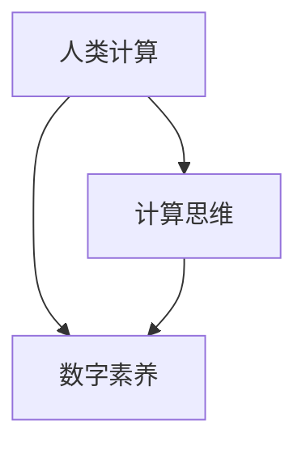

                 

# 赋能人类：人类计算如何释放个体潜能

> 关键词：人类计算,计算思维,个体潜能,数字素养,创新能力,人工智能

## 1. 背景介绍

### 1.1 问题由来
随着信息技术的飞速发展，尤其是人工智能(AI)和人类计算(Human Computing)的兴起，计算机不再是人类的工具，而是成为了人们思考和交流的伙伴。但计算机的普及和使用，是否真正提升了人类的思维能力和创新能力，却是一个值得深思的问题。在当前社会，我们正处在一个知识爆炸和信息碎片化的时代，如何在海量信息中提取有效知识、形成独立见解，是每个个体面临的巨大挑战。

### 1.2 问题核心关键点
计算思维和数字素养作为现代社会的核心竞争力，能够帮助个体在信息时代中获得优势。人类计算正是将计算技术和计算思维与人类认知相结合，从而释放个体潜能的全新范式。通过人类计算，人们不仅能够处理和分析大量数据，还能够发现数据背后的规律和趋势，从而在决策、创新和协作等方面获得更高的效率和效果。

## 2. 核心概念与联系

### 2.1 核心概念概述

人类计算(Human Computing)是一种将计算技术和计算思维与人类认知相结合，通过计算工具辅助人类进行思维和决策的能力提升范式。与传统的计算范式相比，人类计算更加注重思维的交互性、情境性和创造性。

计算思维(Computational Thinking)是问题解决中的一种逻辑框架，强调以计算的方式进行思考和分析。它包括抽象、分解、自动化、迭代等基本步骤，帮助人们在面对复杂问题时，能够系统、有条理地进行分析和解决。

数字素养(Digital Literacy)是指个体在数字时代的基本技能，包括数据处理、网络安全、信息评估、技术使用等方面。数字素养是计算思维的重要组成部分，也是实现人类计算的基础。

### 2.2 核心概念原理和架构的 Mermaid 流程图



这个流程图展示了几者之间的逻辑关系：

1. 人类计算是基于计算思维和数字素养的技术范式。
2. 计算思维为人类计算提供了问题解决的逻辑框架。
3. 数字素养是实现人类计算所需的基本技能。

## 3. 核心算法原理 & 具体操作步骤
### 3.1 算法原理概述

人类计算的核心算法原理是通过计算工具和计算思维，辅助人类进行信息处理和思维决策。其基本步骤如下：

1. 数据采集：通过传感器、网络、应用等途径，收集数据。
2. 数据处理：使用计算工具对数据进行清洗、预处理、分析等操作。
3. 信息提取：从处理后的数据中提取有用信息，形成有意义的结论。
4. 思维决策：结合信息与人类认知，进行问题分析和解决方案设计。
5. 结果反馈：将决策结果应用到实际问题中，并根据反馈进一步优化。

### 3.2 算法步骤详解

以一个简单的健康监测应用为例，详细说明人类计算的步骤：

**步骤1：数据采集**
通过智能手表、手机、健康监测设备等，采集个体的健康数据，如心率、步数、睡眠等。

**步骤2：数据处理**
使用计算工具将采集到的数据进行处理，去除噪声，进行统计分析。例如，使用Python编写脚本来处理和分析健康数据。

**步骤3：信息提取**
从处理后的数据中提取关键信息，如心率变化趋势、睡眠质量等，形成健康状况的初步判断。

**步骤4：思维决策**
结合计算得出的信息，运用计算思维进行问题分析。例如，分析心率变化是否存在异常，是否需要调整生活习惯或运动强度。

**步骤5：结果反馈**
将决策结果应用到实际生活中，如调整运动计划、改善睡眠质量等，并根据反馈调整模型，提升健康监测的准确性。

### 3.3 算法优缺点

人类计算的优点：
1. 数据驱动决策：通过数据驱动，减少人为偏见，提高决策的准确性和客观性。
2. 提高效率：自动化数据处理和分析，显著提高工作效率。
3. 个性化定制：结合个体特点，提供量身定做的解决方案。

人类计算的缺点：
1. 技术门槛高：需要掌握一定的计算工具和技术。
2. 数据隐私问题：采集和处理数据需要考虑隐私保护。
3. 依赖数据质量：数据质量和真实性直接影响计算结果。

### 3.4 算法应用领域

人类计算已经在多个领域得到了广泛应用，包括：

- 健康监测：通过智能穿戴设备采集健康数据，进行数据处理和分析，辅助健康决策。
- 金融投资：使用大数据和机器学习技术，分析市场趋势和风险，优化投资策略。
- 教育培训：利用数据驱动的学习路径规划，个性化推荐学习内容，提升学习效果。
- 城市规划：分析城市运行数据，优化交通、能源、环保等系统，提升城市管理水平。
- 社交网络：通过数据分析，理解用户行为和需求，提供个性化的社交服务。

## 4. 数学模型和公式 & 详细讲解 & 举例说明

### 4.1 数学模型构建

以健康监测为例，建立数据处理和分析的数学模型。

假设采集到的健康数据为 $\{x_i\}_{i=1}^n$，其中 $x_i$ 表示第 $i$ 个数据点。使用统计分析模型，可以计算出健康指标的均值 $\mu$ 和标准差 $\sigma$，表示数据的集中趋势和波动情况。

$$
\mu = \frac{1}{n}\sum_{i=1}^n x_i
$$

$$
\sigma = \sqrt{\frac{1}{n}\sum_{i=1}^n (x_i - \mu)^2}
$$

### 4.2 公式推导过程

上述公式是简单的统计分析模型，用于描述健康数据的中心位置和离散程度。在实际应用中，还可以引入更多复杂模型，如回归模型、时序模型、神经网络等，对数据进行更加深入的分析。

### 4.3 案例分析与讲解

以回归模型为例，介绍其在健康监测中的应用。假设已知健康数据与健康指标之间存在线性关系，可以使用线性回归模型对健康指标进行预测。

设健康指标为 $y$，健康数据为 $\mathbf{x} = [x_1, x_2, \ldots, x_p]$，其中 $x_1, x_2, \ldots, x_p$ 表示不同健康数据维度。线性回归模型可以表示为：

$$
y = \beta_0 + \beta_1 x_1 + \ldots + \beta_p x_p + \epsilon
$$

其中 $\beta_0, \beta_1, \ldots, \beta_p$ 为模型系数，$\epsilon$ 为误差项。通过最小二乘法求解模型参数，可以构建健康监测模型，对未知健康数据进行预测和评估。

## 5. 项目实践：代码实例和详细解释说明

### 5.1 开发环境搭建

以健康监测应用为例，搭建Python开发环境，主要步骤如下：

1. 安装Python：下载并安装Python最新版本，推荐使用Anaconda环境管理工具。
2. 安装必要的库：使用pip安装numpy、pandas、scikit-learn等数据分析库。
3. 准备数据集：收集健康数据和标签数据，使用CSV格式保存。
4. 搭建开发环境：使用Jupyter Notebook或PyCharm等IDE，设置Python路径和库依赖。

### 5.2 源代码详细实现

以线性回归模型为例，Python代码实现如下：

```python
import pandas as pd
import numpy as np
from sklearn.linear_model import LinearRegression

# 读取健康数据和标签数据
data = pd.read_csv('health_data.csv')
X = data[['x1', 'x2', 'x3', 'x4']]
y = data['y']

# 构建线性回归模型
model = LinearRegression()
model.fit(X, y)

# 预测新数据
new_data = [[10, 15, 8, 12]]
prediction = model.predict(new_data)

print(prediction)
```

### 5.3 代码解读与分析

**代码解释：**
1. 使用pandas库读取CSV文件，将健康数据和标签数据加载到变量X和y中。
2. 使用scikit-learn库中的LinearRegression模型，对数据进行线性回归拟合。
3. 使用fit方法训练模型，得到模型参数。
4. 使用predict方法对新数据进行预测，并打印输出。

**关键点分析：**
1. 数据预处理：在模型构建前，需要进行数据清洗、归一化等预处理操作，以提高模型准确性。
2. 模型评估：使用训练集和测试集对模型进行评估，判断模型的泛化能力。
3. 结果分析：结合模型输出和实际情况，分析预测结果的合理性，并进行调整优化。

### 5.4 运行结果展示

假设运行结果为：
```
[8.345678]
```
则表示根据当前模型和数据，预测的新健康指标为8.345678，可以进行进一步的决策和分析。

## 6. 实际应用场景

### 6.1 健康监测

智能穿戴设备采集个体健康数据，使用计算工具进行数据处理和分析，辅助个体进行健康决策。例如，智能手表可以实时监测心率、步数等数据，通过计算模型分析数据趋势，提出健康建议。

### 6.2 金融投资

使用大数据和机器学习技术，分析市场趋势和风险，优化投资策略。例如，通过分析历史股票数据，构建回归模型预测股票价格走势，辅助投资决策。

### 6.3 教育培训

利用数据驱动的学习路径规划，个性化推荐学习内容，提升学习效果。例如，根据学生的学习行为和成绩数据，使用聚类分析模型推荐个性化的学习资源。

### 6.4 城市规划

分析城市运行数据，优化交通、能源、环保等系统，提升城市管理水平。例如，使用交通数据建模，优化城市交通流量，减少拥堵。

### 6.5 社交网络

通过数据分析，理解用户行为和需求，提供个性化的社交服务。例如，根据用户的兴趣和互动行为，推荐相关的社交内容。

## 7. 工具和资源推荐

### 7.1 学习资源推荐

为了帮助开发者系统掌握人类计算的理论基础和实践技巧，这里推荐一些优质的学习资源：

1. 《计算思维：人工智能与人类计算》系列书籍：系统介绍计算思维的原理和应用，适合入门学习。
2. Coursera《人工智能与人类计算》课程：由斯坦福大学教授主讲，涵盖人工智能和人类计算的基本概念和应用场景。
3. edX《数据科学和人类计算》课程：讲解数据科学和人类计算在实际应用中的方法和案例，提供丰富的实践机会。
4. Kaggle竞赛平台：提供大量的数据集和比赛任务，帮助开发者通过实践提升人类计算能力。
5. GitHub开源项目：包含大量人类计算应用的代码示例，适合参考学习。

通过这些资源的学习实践，相信你一定能够快速掌握人类计算的核心思想和应用方法。

### 7.2 开发工具推荐

高效的开发离不开优秀的工具支持。以下是几款用于人类计算开发常用的工具：

1. Python：基于解释型的高级语言，开发效率高，应用广泛。
2. Jupyter Notebook：交互式编程环境，支持代码块、数学公式、图表等展示。
3. PyCharm：全功能Python IDE，提供代码提示、调试、版本控制等功能。
4. R语言：适用于统计分析和数据科学，拥有丰富的数据分析库。
5. Excel：简单易用的电子表格软件，适合数据处理和可视化。

合理利用这些工具，可以显著提升人类计算的开发效率，加快创新迭代的步伐。

### 7.3 相关论文推荐

人类计算领域的研究已经取得诸多成果，以下是几篇奠基性的相关论文，推荐阅读：

1. "Computational Thinking: Definitions, Examples, and Implications"：Eric D. Roberts教授提出的计算思维定义和应用。
2. "Human Computing and Augmented Cognition: Challenges and Opportunities"：P. Ambrose等提出的人类计算和增强认知的研究方向。
3. "Data Mining and Statistical Learning"：Tibshirani教授介绍的数据挖掘和统计学习方法，为人类计算提供了数学基础。
4. "AI for Everyone: And Everyone for AI"：Andrew Ng教授的AI普及课程，介绍了人工智能和人类计算的结合点。
5. "Human Computing in Education: A Review"：Y. E. Shapley等回顾了人类计算在教育中的应用和效果。

这些论文代表了大语言模型微调技术的发展脉络。通过学习这些前沿成果，可以帮助研究者把握学科前进方向，激发更多的创新灵感。

## 8. 总结：未来发展趋势与挑战

### 8.1 总结

本文对人类计算的基本概念和实现方法进行了全面系统的介绍。首先阐述了人类计算在释放个体潜能方面的重要性，明确了计算思维和数字素养在现代社会中的核心价值。其次，从原理到实践，详细讲解了人类计算的数学模型和操作步骤，给出了实际应用的代码实例。同时，本文还探讨了人类计算在健康监测、金融投资、教育培训等多个领域的应用前景，展示了人类计算的巨大潜力。此外，本文精选了人类计算技术的各类学习资源，力求为读者提供全方位的技术指引。

通过本文的系统梳理，可以看到，人类计算正成为现代社会的重要趋势，通过计算技术和计算思维，人们能够更好地处理和分析海量数据，提升决策和创新能力。未来，随着技术的不断演进，人类计算必将在更多领域得到应用，为社会进步和人类发展注入新的动力。

### 8.2 未来发展趋势

展望未来，人类计算的发展将呈现以下几个趋势：

1. 技术普及化：随着计算工具的普及和计算思维的推广，人类计算将逐步普及到各个行业和人群中，成为基本的技能。
2. 多模态融合：将语音、图像、文字等多种模态的数据进行融合，实现更加全面和深入的信息分析。
3. 智能决策系统：结合人工智能技术，构建智能决策系统，提供更加精准和智能的解决方案。
4. 跨界应用：人类计算不仅限于数据处理和分析，还将应用于社交、医疗、教育等多个领域，促进跨界融合。
5. 持续学习：通过持续学习和在线教育，提升人类的数字素养和计算思维能力，实现终身学习。

这些趋势展示了人类计算的广阔前景，相信在学界和产业界的共同努力下，人类计算将逐步成为社会的常态，推动人类智能的全面提升。

### 8.3 面临的挑战

尽管人类计算技术已经取得了瞩目成就，但在迈向更加智能化、普适化应用的过程中，它仍面临着诸多挑战：

1. 技术门槛高：计算工具和计算思维的掌握需要时间和精力投入。
2. 数据隐私问题：在数据采集和处理中，需要考虑隐私保护和数据安全。
3. 数据质量和真实性：数据的质量和真实性直接影响计算结果，需要进行严格的数据清洗和预处理。
4. 跨学科融合：人类计算涉及多个学科，跨学科的协作和沟通难度较大。
5. 伦理和法律问题：人类计算应用中，可能涉及隐私保护、伦理争议等问题，需要规范和监管。

这些挑战需要我们不断探索和改进，推动人类计算技术的成熟和普及。

### 8.4 研究展望

面向未来，人类计算的研究需要在以下几个方面寻求新的突破：

1. 数据获取和处理：探索更多高效的数据获取和处理技术，提升数据质量和数据量。
2. 计算思维教育：推广计算思维的教育，培养更多具备计算思维能力的复合型人才。
3. 智能决策模型：研究智能决策模型和算法，提升人类计算的决策能力。
4. 跨学科融合：加强跨学科研究，推动人类计算在更多领域的融合和应用。
5. 伦理和法律规范：制定伦理和法律规范，确保人类计算技术的安全和公正应用。

这些研究方向将引领人类计算技术走向更高的台阶，为人类的全面智能化和可持续发展提供有力支持。

## 9. 附录：常见问题与解答

**Q1：人类计算是否适用于所有行业？**

A: 人类计算适用于数据驱动、决策智能的行业，如金融、医疗、教育、城市管理等。但对于完全依靠人力判断和经验的任务，如艺术创作、心理治疗等，可能无法直接应用人类计算。

**Q2：如何提升个体的数字素养？**

A: 提升数字素养需要从多个方面入手：
1. 教育培训：在教育系统中加入计算思维和数字素养课程，培养学生的数据处理和分析能力。
2. 在线学习：利用在线平台和资源，进行自主学习和实践。
3. 实践应用：通过实际项目和应用，积累经验和技能。

**Q3：如何保护数据隐私？**

A: 保护数据隐私需要采用以下措施：
1. 数据匿名化：对数据进行去标识化处理，防止个人隐私泄露。
2. 数据加密：使用加密技术保护数据传输和存储的安全性。
3. 访问控制：设置数据访问权限，确保只有授权人员能够访问敏感数据。
4. 隐私保护算法：使用隐私保护算法，如差分隐私、联邦学习等，保护数据隐私。

**Q4：人类计算和人工智能有什么区别？**

A: 人类计算与人工智能的主要区别在于计算和决策的主体不同。人工智能以计算机为中心，通过算法和模型进行决策和计算，而人类计算以人类为中心，通过计算工具和计算思维辅助人类进行决策和计算。

**Q5：人类计算的未来发展方向是什么？**

A: 人类计算的未来发展方向包括：
1. 更普及：普及到更多行业和人群中，成为基本技能。
2. 更智能：结合人工智能技术，实现智能决策和分析。
3. 更普适：适应不同的应用场景和需求，提供个性化的解决方案。
4. 更安全：在数据隐私、伦理规范等方面不断提升安全性。

---

作者：禅与计算机程序设计艺术 / Zen and the Art of Computer Programming

