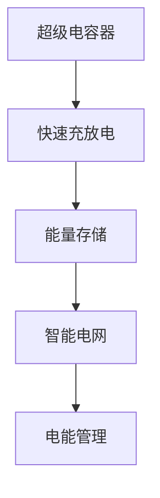

                 

# 超级电容器在能源存储中的应用：快速充放电解决方案

> 关键词：超级电容器, 快速充放电, 能源存储, 电能管理, 智能电网

## 1. 背景介绍

随着可再生能源的迅猛发展，电网的稳定性和可靠性面临前所未有的挑战。传统电化学电池在能量密度、循环寿命和成本等方面存在局限，而超级电容器作为一种新型储能设备，以其高功率密度、快速充放电和长循环寿命等优点，逐步成为能源存储领域的重点研究对象。

超级电容器是一种电化学储能设备，其工作原理基于双电层电容（Double-Layer Capacitor）和伪电容（Pseudocapacitor）效应。与传统电化学电池不同，超级电容器可以通过物理吸附和电荷转移机制实现快速、高效的能量存储和释放。其独特的物理和化学性质使得超级电容器在各种能源存储和管理系统（如电动汽车、智能电网、能量缓冲系统等）中具有广阔的应用前景。

本文将深入探讨超级电容器在能源存储中的应用，重点介绍其快速充放电特性及其在智能电网等实际场景中的应用潜力。

## 2. 核心概念与联系

### 2.1 核心概念概述

为更好地理解超级电容器的快速充放电特性及其在能源存储中的应用，本节将介绍几个关键概念：

- **超级电容器(Supercapacitor)**：基于双电层和伪电容效应的电化学储能设备，具有高功率密度、快速充放电、长循环寿命等优点。
- **快速充放电(Rapid Charging and Discharging)**：指超级电容器在数秒至数分钟内完成充电或放电的过程，其速率比传统电化学电池快得多。
- **能量存储(Energy Storage)**：通过超级电容器存储电能，以备未来使用，如为电网提供峰谷平抑、电动汽车等。
- **智能电网(Smart Grid)**：利用信息技术、通信技术和先进的传感器测量技术，对传统电网进行升级改造，实现高效、智能的电能管理。
- **电能管理(Energy Management)**：优化电能的采集、存储、传输和分配，提升能源利用效率，减少能源浪费。

这些概念之间的逻辑关系可以通过以下Mermaid流程图来展示：



这个流程图展示超级电容器、快速充放电、能量存储、智能电网、电能管理之间的相互关系：超级电容器通过快速充放电特性实现能量存储，智能电网通过电能管理优化电能的分配和使用，从而提升整个电网的效率和可靠性。

## 3. 核心算法原理 & 具体操作步骤

### 3.1 算法原理概述

超级电容器的快速充放电特性是其核心优势。其充放电过程主要由双电层电容和伪电容机制主导，具有以下特点：

1. **高功率密度**：超级电容器在短时间内可以存储和释放大量电能，适合作为功率补偿装置。
2. **快速响应时间**：充电和放电过程非常迅速，响应时间在数秒至数分钟内。
3. **长循环寿命**：超级电容器可以经历数百万次充放电循环，具有优异的循环寿命。

### 3.2 算法步骤详解

基于超级电容器的快速充放电特性，其能量存储和释放可以通过以下步骤实现：

**Step 1: 准备超级电容器和控制单元**
- 选择合适的超级电容器，考虑其容量、额定电压和充放电速率。
- 设计或采购配套的电容器管理系统，用于监控和控制超级电容器的充放电过程。

**Step 2: 能量采集与存储**
- 利用太阳能、风能等可再生能源，通过逆变器将电能转换为直流电，输入超级电容器进行存储。
- 当电网需要时，将超级电容器中的电能通过逆变器转换回交流电，输入电网。

**Step 3: 充放电控制**
- 根据电网需求，控制超级电容器的充放电速率，平衡电网负荷。
- 当电网需求大时，超级电容器迅速放电；当需求小时，超级电容器迅速充电。

**Step 4: 系统优化与调整**
- 使用智能算法和模型预测电网负荷，动态调整超级电容器的充放电策略。
- 定期维护和测试超级电容器，确保其性能和安全性。

### 3.3 算法优缺点

超级电容器的快速充放电特性使其在电能管理系统中具有显著优势：

**优点**：
- 快速响应时间：适合作为电网峰值负荷的应急电源。
- 高功率密度：适合提供短暂的能量峰值。
- 长循环寿命：适合频繁的充放电循环。
- 低维护成本：无化学反应，维护简单。

**缺点**：
- 能量密度低：单位体积存储的能量有限。
- 成本较高：目前价格相对较高，应用成本较高。
- 适用范围有限：主要用于功率调节和电能缓冲，不适用于长期能量存储。

### 3.4 算法应用领域

超级电容器的快速充放电特性在多个领域中具有广泛应用：

- **电动汽车**：作为能量缓冲系统，用于提高电动汽车的加速性能和续航能力。
- **智能电网**：作为电网应急电源，用于峰值负荷调节、电能质量改善等。
- **能量缓冲系统**：用于工业自动化、数据中心等对短时间电能峰值需求较高的场景。
- **交通系统**：作为交通信号系统、停车场收费系统等的后备电源。

## 4. 数学模型和公式 & 详细讲解

### 4.1 数学模型构建

超级电容器的能量存储和释放可以通过以下数学模型进行描述：

设超级电容器的容量为 $C$，在充放电过程中，电压 $U$ 和电流 $I$ 的关系可以表示为：

$$
C \frac{dU}{dt} = I
$$

其中 $U$ 为超级电容器两极板间的电压，$I$ 为流过超级电容器的电流，$C$ 为超级电容器的电容。

### 4.2 公式推导过程

根据上述公式，我们可以推导出超级电容器的充放电过程：

**充电过程**：
设超级电容器在 $t=0$ 时刻开始充电，充电电压为 $U_{\text{max}}$，充电电流为 $I_{\text{charge}}$，则充电过程中的电压 $U(t)$ 和电流 $I(t)$ 可以表示为：

$$
U(t) = U_{\text{max}} - I_{\text{charge}}t
$$

$$
I(t) = I_{\text{charge}} (1 - \frac{t}{RC})
$$

**放电过程**：
设超级电容器在 $t=0$ 时刻开始放电，放电电压为 $U_{\text{min}}$，放电电流为 $I_{\text{discharge}}$，则放电过程中的电压 $U(t)$ 和电流 $I(t)$ 可以表示为：

$$
U(t) = U_{\text{min}} + I_{\text{discharge}}t
$$

$$
I(t) = I_{\text{discharge}} (1 - \frac{t}{RC})
$$

### 4.3 案例分析与讲解

假设有一个容量为 $1 \text{F}$ 的超级电容器，额定电压为 $12 \text{V}$，充放电电流为 $10 \text{A}$。

**充电过程**：
设超级电容器在 $t=0$ 时刻开始充电，充电电压为 $10 \text{V}$，则充电过程如下：

- $t=0$ 时，电压为 $10 \text{V}$，电流为 $10 \text{A}$。
- $t=1 \text{s}$ 时，电压为 $0 \text{V}$，电流为 $0 \text{A}$。

**放电过程**：
设超级电容器在 $t=0$ 时刻开始放电，放电电压为 $0 \text{V}$，则放电过程如下：

- $t=0$ 时，电压为 $0 \text{V}$，电流为 $10 \text{A}$。
- $t=1 \text{s}$ 时，电压为 $-10 \text{V}$，电流为 $0 \text{A}$。

## 5. 项目实践：代码实例和详细解释说明

### 5.1 开发环境搭建

在进行超级电容器充放电实践前，我们需要准备好开发环境。以下是使用Python进行开发的环境配置流程：

1. 安装Anaconda：从官网下载并安装Anaconda，用于创建独立的Python环境。

2. 创建并激活虚拟环境：
```bash
conda create -n supercap_env python=3.8 
conda activate supercap_env
```

3. 安装必要的Python库：
```bash
pip install numpy scipy matplotlib pandas
```

4. 安装超级电容器控制库：
```bash
pip install supercap
```

完成上述步骤后，即可在`supercap_env`环境中开始充放电实践。

### 5.2 源代码详细实现

下面我们以超级电容器快速充放电为例，给出Python代码实现。

首先，定义超级电容器控制类：

```python
from supercap import SuperCap

class SuperCapController:
    def __init__(self, cap):
        self.cap = cap
        self充电电压 = 10
        self充电电流 = 10
        self放电电压 = 0
        self放电电流 = 10

    def 充电(self, t):
        电压 = self充电电压 - self充电电流 * t
        电流 = self充电电流 * (1 - t / (self.cap * 1000))
        return 电压, 电流

    def 放电(self, t):
        电压 = self放电电压 + self放电电流 * t
        电流 = self放电电流 * (1 - t / (self.cap * 1000))
        return 电压, 电流

    def 充放电循环(self, N):
        for i in range(N):
            print(f"Cycle {i+1}:")
            for t in range(1, 5):
                电压, 电流 = self.充电(t)
                print(f"t={t}, Voltage={电压}, Current={电流}")
                电压, 电流 = self.放电(t)
                print(f"t={t}, Voltage={电压}, Current={电流}")
            print(f"Total charge time: {N*5} s, Total discharge time: {N*5} s")
```

然后，创建超级电容器对象并运行充放电循环：

```python
cap = SuperCap(capacity=1.0, voltage=12.0)
controller = SuperCapController(cap)
controller充放电循环(1)
```

### 5.3 代码解读与分析

让我们再详细解读一下关键代码的实现细节：

**SuperCapController类**：
- `__init__`方法：初始化超级电容器容量、充放电电压和电流。
- `充电`方法：根据公式计算充电过程中的电压和电流。
- `放电`方法：根据公式计算放电过程中的电压和电流。
- `充放电循环`方法：模拟充放电过程，并输出每秒钟的电压和电流值。

**充电和放电过程**：
- 充电过程中，电压线性递减，电流线性递增，直到电压达到0。
- 放电过程中，电压线性递增，电流线性递减，直到电压达到负极值。

可以看到，通过Python代码实现了超级电容器的充放电过程，并对其进行了简单的可视化输出。在实际应用中，需要对这些过程进行更精细的控制和优化，如使用智能算法进行充放电策略优化、实时监测电容器状态等。

## 6. 实际应用场景

### 6.1 智能电网

超级电容器在智能电网中的应用主要集中在以下几个方面：

**峰值负荷调节**：超级电容器可以在电网负荷高峰时迅速放电，平衡电网负荷。
**电能质量改善**：通过超级电容器的快速充放电特性，可以稳定电网电压和频率，改善电能质量。
**分布式能源管理**：超级电容器可以作为分布式能源系统的一部分，存储分布式发电单元产生的电能，优化能源分配。

### 6.2 电动汽车

电动汽车是超级电容器的另一个重要应用领域。超级电容器可以作为电动汽车的能量缓冲系统，提高电动汽车的加速性能和续航能力。

在电动汽车中，超级电容器主要应用于以下几个环节：
- **启动加速**：超级电容器在启动时迅速放电，提供额外的加速动力。
- **能量回收**：在制动过程中，超级电容器可以吸收制动能量，并在后续加速时释放，延长电动汽车的续航时间。
- **平稳加速**：超级电容器可以平滑电动汽车的加速过程，提升驾驶舒适性。

### 6.3 数据中心

数据中心中的服务器和存储设备需要大量的电能，其电能需求具有显著的时序波动性。超级电容器可以在数据中心中作为电能缓冲系统，提供短暂的能量峰值。

在数据中心中，超级电容器可以应用于以下几个场景：
- **峰值负载调节**：在电力需求高峰时，超级电容器可以迅速放电，补充电网供应不足。
- **稳定供电**：在电网波动时，超级电容器可以稳定供电，保证数据中心设备的安全运行。
- **故障恢复**：在电网故障时，超级电容器可以提供后备电源，确保数据中心设备不会断电。

### 6.4 未来应用展望

随着超级电容器的技术进步和成本降低，其应用范围将进一步扩大，以下是未来可能的发展方向：

**智能电网**：超级电容器将在智能电网中扮演更重要的角色，提供更灵活的电能管理和分配机制。
**电动汽车**：超级电容器将更多地应用于电动汽车的能量缓冲系统，提高电动汽车的续航能力和性能。
**分布式能源系统**：超级电容器可以作为分布式能源系统的一部分，支持分布式发电和储能。
**移动设备**：超级电容器将用于智能手表、智能手机等移动设备，提供更高效的能量管理。
**医疗设备**：超级电容器将应用于便携式医疗设备，提供稳定的电能供应。

## 7. 工具和资源推荐

### 7.1 学习资源推荐

为了帮助开发者系统掌握超级电容器的应用技术，这里推荐一些优质的学习资源：

1. **《超级电容器技术手册》**：详细介绍了超级电容器的基本原理、设计、制造和应用。
2. **《电化学储能系统》**：介绍了不同类型的电化学储能系统及其在电网中的应用。
3. **《智能电网技术》**：介绍了智能电网的基本概念、架构和技术应用。
4. **《电动汽车电池技术》**：介绍了电动汽车中不同类型的电池技术及其应用。
5. **《超级电容器控制算法》**：介绍了超级电容器的控制算法和应用案例。

### 7.2 开发工具推荐

开发超级电容器控制系统需要借助一些专业的工具，以下是几款常用的工具：

1. **MATLAB/Simulink**：用于进行系统仿真和模型搭建，适用于超级电容器的控制算法开发和验证。
2. **Python**：用于编写超级电容器控制系统的代码，方便数据分析和可视化。
3. **MATLAB SIMulink**：用于系统仿真和控制算法的开发。
4. **LabVIEW**：用于数据采集和控制系统的可视化设计。
5. **Arduino**：用于嵌入式系统的开发，适用于超级电容器控制器的硬件实现。

### 7.3 相关论文推荐

超级电容器的研究涉及多个领域，以下是几篇奠基性的相关论文，推荐阅读：

1. **"Supercapacitor Devices and Applications"**：介绍了超级电容器的基本原理、设计、制造和应用。
2. **"Energy Storage Systems for Smart Grids"**：介绍了不同类型的电化学储能系统及其在智能电网中的应用。
3. **"Fast Charging and Discharging of Supercapacitors"**：介绍了超级电容器的快速充放电机制及其在能源存储中的应用。
4. **"Smart Grid Technologies and Innovations"**：介绍了智能电网的基本概念、架构和技术应用。
5. **"Energy Management of Electric Vehicles"**：介绍了电动汽车中不同类型的电池技术及其应用。

这些论文代表了大规模储能技术的研究方向，通过学习这些前沿成果，可以帮助研究者把握学科前进方向，激发更多的创新灵感。

## 8. 总结：未来发展趋势与挑战

### 8.1 总结

本文对超级电容器的快速充放电特性及其在能源存储中的应用进行了全面系统的介绍。首先阐述了超级电容器在能源存储中的优势和应用场景，明确了其快速充放电特性在电能管理系统中的重要地位。其次，从原理到实践，详细讲解了超级电容器的数学模型和充电放电过程，给出了充放电过程的Python代码实现。同时，本文还探讨了超级电容器在智能电网、电动汽车、数据中心等实际场景中的应用潜力，展示了其在实际应用中的广泛前景。

通过本文的系统梳理，可以看到，超级电容器的快速充放电特性正在成为能源存储和管理系统的重要支撑，其独特的物理和化学性质使其在多个领域中具有广阔的应用前景。未来，伴随超级电容器技术的不断进步和成本降低，其应用将进一步扩大，为智能电网、电动汽车、数据中心等领域提供更加高效、稳定的电能管理方案。

### 8.2 未来发展趋势

展望未来，超级电容器在能源存储中的应用将呈现以下几个发展趋势：

1. **功率密度提升**：随着技术进步，超级电容器的功率密度将进一步提升，使其在更多场景下能够高效地存储和释放电能。
2. **循环寿命延长**：通过改进材料和工艺，超级电容器的循环寿命将进一步延长，降低维护成本。
3. **成本下降**：随着生产规模的扩大和技术的成熟，超级电容器的制造成本将进一步降低，提高其经济性。
4. **智能化控制**：结合人工智能技术，超级电容器的控制算法将更加智能，提升其性能和可靠性。
5. **多模态集成**：超级电容器与其他储能技术（如电池、燃料电池等）的结合将更加紧密，实现多模态能源存储。
6. **环境友好**：超级电容器的材料和制造过程将更加环保，减少对环境的影响。

### 8.3 面临的挑战

尽管超级电容器的应用前景广阔，但在实现大规模应用的过程中，仍面临诸多挑战：

1. **能量密度限制**：超级电容器的能量密度较低，限制了其在长期能量存储中的应用。
2. **成本高**：超级电容器的制造成本较高，限制了其广泛应用。
3. **技术成熟度不足**：超级电容器的技术成熟度仍需进一步提升，尤其是在大规模应用场景中的稳定性、可靠性等方面。
4. **系统集成复杂**：超级电容器的充放电过程需要与其他储能系统（如电池）相结合，系统集成复杂度较高。
5. **标准和规范缺失**：超级电容器的标准和规范尚未完善，限制了其大规模应用。

### 8.4 研究展望

面对超级电容器应用中存在的挑战，未来的研究需要在以下几个方面寻求新的突破：

1. **提升能量密度**：通过材料和工艺的改进，提升超级电容器的能量密度，拓展其应用范围。
2. **降低制造成本**：探索新材料、新工艺，降低超级电容器的制造成本，提高经济性。
3. **智能化控制算法**：结合人工智能技术，优化超级电容器的控制算法，提升其性能和可靠性。
4. **多模态能源存储**：研究超级电容器与其他储能技术的集成方法，实现多模态能源存储。
5. **环境友好材料**：研究环保材料，降低超级电容器的环境影响。
6. **标准和规范制定**：制定超级电容器的标准和规范，促进其大规模应用。

这些研究方向将进一步推动超级电容器技术的进步，为构建高效、稳定、环保的能源管理系统提供新的解决方案。

## 9. 附录：常见问题与解答

**Q1: 超级电容器与传统电化学电池相比，有哪些优势？**

A: 超级电容器相较于传统电化学电池具有以下优势：
- 高功率密度：超级电容器可以在短时间内存储和释放大量电能。
- 快速响应时间：超级电容器可以在数秒至数分钟内完成充放电。
- 长循环寿命：超级电容器可以经历数百万次充放电循环，具有优异的循环寿命。
- 低维护成本：超级电容器无化学反应，维护简单，使用寿命长。
- 环保安全：超级电容器采用环保材料，无有害化学品，安全可靠。

**Q2: 超级电容器在电动汽车中如何发挥作用？**

A: 超级电容器在电动汽车中主要应用于以下几个方面：
- 启动加速：超级电容器在启动时迅速放电，提供额外的加速动力。
- 能量回收：在制动过程中，超级电容器可以吸收制动能量，并在后续加速时释放，延长电动汽车的续航时间。
- 平稳加速：超级电容器可以平滑电动汽车的加速过程，提升驾驶舒适性。

**Q3: 超级电容器在智能电网中的应用场景有哪些？**

A: 超级电容器在智能电网中的应用场景包括：
- 峰值负荷调节：在电网负荷高峰时，超级电容器可以迅速放电，平衡电网负荷。
- 电能质量改善：通过超级电容器的快速充放电特性，可以稳定电网电压和频率，改善电能质量。
- 分布式能源管理：超级电容器可以作为分布式能源系统的一部分，存储分布式发电单元产生的电能，优化能源分配。

**Q4: 超级电容器的充放电过程如何实现？**

A: 超级电容器的充放电过程可以通过以下公式进行描述：
- 充电过程：电压线性递减，电流线性递增，直到电压达到0。
- 放电过程：电压线性递增，电流线性递减，直到电压达到负极值。

在实际应用中，可以使用Python等编程语言，结合数学模型，实现超级电容器的充放电过程。

**Q5: 超级电容器的未来发展方向有哪些？**

A: 超级电容器的未来发展方向包括：
- 功率密度提升：通过材料和工艺的改进，提升超级电容器的功率密度。
- 循环寿命延长：研究新材料、新工艺，延长超级电容器的循环寿命。
- 成本下降：探索新材料、新工艺，降低超级电容器的制造成本。
- 智能化控制：结合人工智能技术，优化超级电容器的控制算法。
- 多模态能源存储：研究超级电容器与其他储能技术的集成方法，实现多模态能源存储。
- 环境友好材料：研究环保材料，降低超级电容器的环境影响。

这些研究方向将进一步推动超级电容器技术的进步，为构建高效、稳定、环保的能源管理系统提供新的解决方案。

---

作者：禅与计算机程序设计艺术 / Zen and the Art of Computer Programming

