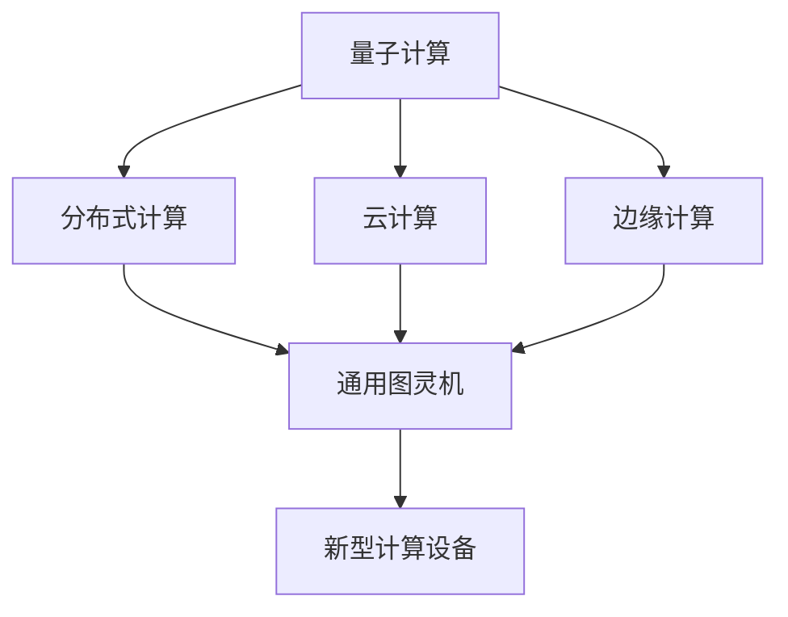

                 

# 超越 AI：未来的计算

> 关键词：超越人工智能,计算范式,量子计算,量子计算机,通用图灵机,未来科技

## 1. 背景介绍

### 1.1 问题由来
随着人工智能(AI)技术的迅猛发展，从深度学习到自然语言处理，从计算机视觉到自动驾驶，AI已经深入到人类生活的各个方面。然而，AI技术的快速发展也引发了人们对未来计算能力的担忧。如何在未来保持计算效率和扩展性的同时，进一步推动AI技术的发展，成为了当前科技界亟需解决的重要课题。

### 1.2 问题核心关键点
要解决这一问题，我们需要理解未来计算的几个关键概念和趋势，包括：

- 量子计算：利用量子力学的原理，实现比传统计算机更高效的数据处理能力。
- 通用图灵机：计算能力上限的理论模型，代表计算机能够解决的所有问题。
- 未来的计算范式：如分布式计算、云计算、边缘计算等，提升计算资源的利用效率。
- 新型计算设备：如光子计算机、DNA计算机等，探索新的计算方式。

通过理解这些关键概念，我们可以把握AI技术未来发展的计算基础，并探索可能的突破点。

## 2. 核心概念与联系

### 2.1 核心概念概述

为更好地理解未来计算的能力和趋势，本节将介绍几个密切相关的核心概念：

- 量子计算：一种基于量子力学的计算模型，能够通过量子叠加和量子纠缠实现计算能力的指数级提升。
- 通用图灵机(Universal Turing Machine, UT)：理论上计算能力最强的计算机模型，任何算法都可以用UT来计算。
- 分布式计算：通过网络将多个计算机连接起来，实现并行计算，提升计算效率。
- 云计算：基于互联网的计算服务，提供弹性计算资源，按需使用，降低计算成本。
- 边缘计算：在数据源附近进行数据处理，降低数据传输和延迟，提升响应速度。
- 新型计算设备：如光子计算机、DNA计算机等，利用不同物理原理实现计算。

这些核心概念之间的逻辑关系可以通过以下Mermaid流程图来展示：



这个流程图展示了大语言模型的核心概念及其之间的关系：

1. 量子计算通过提升计算能力，为AI提供更强大的计算基础。
2. 通用图灵机代表了计算能力的极限，任何新型计算设备都应朝此方向努力。
3. 分布式、云计算、边缘计算等新计算范式，在提升计算效率的同时，也降低了成本。
4. 新型计算设备如光子计算机、DNA计算机等，尝试突破传统物理限制，探索新的计算方式。

## 3. 核心算法原理 & 具体操作步骤

### 3.1 算法原理概述

未来的计算范式，如量子计算、分布式计算等，都将对AI技术的计算能力产生深远影响。其核心原理和操作步骤如下：

- **量子计算**：利用量子力学的叠加和纠缠，实现计算能力的大幅提升。量子计算机通过量子比特（qubits）进行计算，一个qubit可以同时处于0和1的叠加状态，这使得量子计算机在处理某些特定问题时，能够比传统计算机更快地求解。

- **分布式计算**：通过将计算任务分解，分配到多个计算机上进行并行计算，提升计算效率。常见的分布式计算框架包括Hadoop、Spark等。

- **云计算**：基于互联网的计算资源池，用户可以根据需要动态申请计算资源，避免了传统计算资源的浪费。

- **边缘计算**：在数据源附近进行数据处理，减少数据传输，提升计算效率和响应速度。

### 3.2 算法步骤详解

未来的计算范式，其操作步骤一般为：

1. **量子计算**：
    - **量子比特设计**：设计量子比特的物理实现，如超导量子比特、离子阱等。
    - **量子门设计**：设计量子门操作，实现量子计算的基本逻辑单元。
    - **量子算法设计**：设计针对特定问题的量子算法，如Shor算法、Grover算法等。

2. **分布式计算**：
    - **任务分解**：将计算任务分解为多个子任务，分配到多个计算节点。
    - **数据传输**：设计高效的数据传输协议，减少传输延迟和数据丢失。
    - **任务调度**：设计任务调度算法，优化计算资源的分配和利用。

3. **云计算**：
    - **资源申请**：根据需求申请计算资源，包括CPU、GPU、存储等。
    - **任务提交**：将计算任务提交到云计算平台，按需使用。
    - **结果获取**：从云计算平台获取计算结果，并进行分析。

4. **边缘计算**：
    - **数据采集**：在数据源附近采集数据，并进行初步处理。
    - **任务分发**：将计算任务分配到边缘设备，如物联网设备、移动设备等。
    - **结果反馈**：将计算结果反馈到中心服务器，进行综合分析和决策。

### 3.3 算法优缺点

未来的计算范式，各有其优点和局限：

- **量子计算**：
    - 优点：计算能力强大，能够处理某些传统计算方法无法解决的问题。
    - 局限：技术成熟度低，成本高昂，量子比特的稳定性需要进一步提升。

- **分布式计算**：
    - 优点：提升计算效率，降低单点故障风险，便于扩展。
    - 局限：数据传输和同步开销大，对网络延迟敏感。

- **云计算**：
    - 优点：按需使用，灵活便捷，降低计算成本。
    - 局限：数据安全和个人隐私保护问题，网络带宽限制。

- **边缘计算**：
    - 优点：减少数据传输，提升响应速度，适合实时应用。
    - 局限：计算资源有限，适合计算量较小的场景。

### 3.4 算法应用领域

未来的计算范式，在多个领域都有广泛的应用：

- **科学研究**：如量子计算可用于模拟化学反应，提升药物研发效率。
- **金融科技**：云计算和分布式计算可用于高并发交易、数据分析等。
- **智能制造**：边缘计算可用于实时数据处理，提升生产效率和质量。
- **智慧城市**：分布式计算和云计算可用于城市大数据分析、智能交通管理等。
- **人工智能**：量子计算和分布式计算可用于大规模深度学习模型训练，提升AI模型性能。

这些应用展示了未来计算范式的广泛前景，将深刻改变人类社会的各个领域。

## 4. 数学模型和公式 & 详细讲解 & 举例说明

### 4.1 数学模型构建

量子计算的数学模型基于量子力学的叠加和纠缠原理，可以表示为：

$$
\begin{align*}
|\psi\rangle &= \sum_{i=0}^n \alpha_i|i\rangle \\
\langle\psi| &= \sum_{i=0}^n \alpha_i^*|i\rangle
\end{align*}
$$

其中 $|\psi\rangle$ 表示量子态，$|i\rangle$ 表示量子比特基态，$\alpha_i$ 表示量子叠加系数。

### 4.2 公式推导过程

以Shor算法为例，其核心在于利用量子叠加和量子纠缠，在多项式时间内分解大整数。Shor算法的基本步骤如下：

1. **量子并行算法**：利用量子叠加，将两个初始态 $|i\rangle$ 并行运算，得到 $|i\rangle^2$。
2. **量子纠缠**：利用量子纠缠，将多个量子比特连接起来，实现并行计算。
3. **测量和解码**：测量量子比特，通过解码算法，得到大整数的素因数分解。

Shor算法的数学推导过程复杂，但关键在于利用量子叠加和量子纠缠，实现了计算能力的指数级提升。

### 4.3 案例分析与讲解

以Shor算法为例，其核心在于利用量子叠加和量子纠缠，在多项式时间内分解大整数。Shor算法的基本步骤如下：

1. **量子并行算法**：利用量子叠加，将两个初始态 $|i\rangle$ 并行运算，得到 $|i\rangle^2$。
2. **量子纠缠**：利用量子纠缠，将多个量子比特连接起来，实现并行计算。
3. **测量和解码**：测量量子比特，通过解码算法，得到大整数的素因数分解。

Shor算法的数学推导过程复杂，但关键在于利用量子叠加和量子纠缠，实现了计算能力的指数级提升。

## 5. 项目实践：代码实例和详细解释说明

### 5.1 开发环境搭建

在进行量子计算的实践前，我们需要准备好开发环境。以下是使用Python进行Qiskit开发的环境配置流程：

1. 安装Anaconda：从官网下载并安装Anaconda，用于创建独立的Python环境。

2. 创建并激活虚拟环境：
```bash
conda create -n qiskit-env python=3.8 
conda activate qiskit-env
```

3. 安装Qiskit：根据CUDA版本，从官网获取对应的安装命令。例如：
```bash
conda install qiskit -c conda-forge
```

4. 安装各类工具包：
```bash
pip install numpy pandas scikit-learn matplotlib tqdm jupyter notebook ipython
```

完成上述步骤后，即可在`qiskit-env`环境中开始量子计算的实践。

### 5.2 源代码详细实现

下面是使用Qiskit进行量子计算的完整代码实现：

```python
from qiskit import QuantumCircuit, execute, Aer
from qiskit.visualization import plot_bloch_multivector, plot_histogram

# 创建量子电路
qc = QuantumCircuit(2)

# 应用量子门
qc.h(0)
qc.cx(0, 1)

# 测量量子比特
qc.measure_all()

# 模拟量子计算
simulator = Aer.get_backend('qasm_simulator')
job = execute(qc, simulator, shots=1024)
result = job.result()

# 输出测量结果
counts = result.get_counts(qc)
print(counts)

# 可视化测量结果
plot_histogram(counts)
```

以上代码实现了经典的量子态叠加和量子纠缠，通过应用Hadamard门和CNOT门，构造了一个量子叠加态。然后，对量子比特进行测量，输出结果。

### 5.3 代码解读与分析

让我们再详细解读一下关键代码的实现细节：

**QuantumCircuit类**：
- `__init__`方法：初始化量子电路，指定量子比特的数量。
- `h`方法：应用Hadamard门，将量子比特变为叠加态。
- `cx`方法：应用CNOT门，实现量子纠缠。
- `measure_all`方法：对所有量子比特进行测量，返回测量结果。

**execute函数**：
- 执行量子电路，指定模拟器的类型和执行次数。

**plot_histogram函数**：
- 将测量结果可视化，以柱状图形式展示不同状态的概率分布。

通过这些代码，可以很好地理解量子计算的基本原理和操作步骤，掌握Qiskit库的基本使用方法。

## 6. 实际应用场景

### 6.1 量子计算在药物研发中的应用

量子计算在药物研发中具有巨大的应用潜力。传统的药物研发过程往往需要大量的实验和模拟，耗时耗资。而量子计算机可以高效地模拟化学反应和分子结构，加速药物分子的设计。

例如，通过量子计算机模拟蛋白质折叠过程，可以精确预测其活性，加速新药的研发和筛选。量子计算机还可以用于模拟分子之间的相互作用，发现潜在的药物靶点，优化药物分子设计。

### 6.2 分布式计算在天气预报中的应用

分布式计算在天气预报中也有广泛的应用。天气预报需要处理大量复杂的数据，如气温、湿度、风速等。传统计算方法往往难以满足实时性和精度要求。

通过分布式计算，可以将气象数据分布在多个计算节点上进行并行处理，提升计算效率和准确性。例如，可以将全球气象数据分为多个区域，并行计算气象变化规律，生成更精确的天气预报。

### 6.3 云计算在智能制造中的应用

云计算在智能制造中具有广泛的应用。智能制造需要处理大量的工业数据，如生产计划、设备状态、产品质量等。传统计算方法难以处理这些大规模数据。

通过云计算，可以将工业数据存储在云端，提供弹性计算资源，按需使用，降低计算成本。例如，可以将生产设备的状态数据实时上传到云端，进行数据分析和决策，提升生产效率和质量。

### 6.4 未来应用展望

未来的计算范式，将在多个领域带来变革性影响。以下是几个典型的应用场景：

1. **量子计算**：在化学、材料科学、物理学等领域，量子计算将带来重大突破。如设计新材料、研究量子现象等。
2. **分布式计算**：在科学计算、大数据分析、金融等领域，分布式计算将提升计算效率，加速数据处理。
3. **云计算**：在企业级应用、智能制造、智慧城市等领域，云计算将提供弹性的计算资源，降低计算成本。
4. **边缘计算**：在物联网、智能家居、工业互联网等领域，边缘计算将提升响应速度，优化用户体验。

这些应用展示了未来计算范式的广泛前景，将深刻改变人类社会的各个领域。

## 7. 工具和资源推荐

### 7.1 学习资源推荐

为了帮助开发者系统掌握未来计算的理论基础和实践技巧，这里推荐一些优质的学习资源：

1. 《量子计算入门》系列博文：由大模型技术专家撰写，深入浅出地介绍了量子计算原理、量子门操作、量子算法等前沿话题。

2. CS388《计算机体系结构》课程：斯坦福大学开设的计算机体系结构明星课程，涵盖计算机硬件设计和并行计算等基本概念。

3. 《量子计算原理》书籍：量子计算领域的经典教材，系统介绍了量子计算的原理和算法，适合深入学习。

4. IBM Quantum Experience：IBM提供的量子计算开发平台，提供了丰富的量子计算资源和实验环境，适合实践学习。

5. Quantum Computing Hub：英国政府支持的开放量子计算资源平台，提供量子计算教程和实验，适合初学者学习。

通过对这些资源的学习实践，相信你一定能够快速掌握未来计算的精髓，并用于解决实际的计算问题。

### 7.2 开发工具推荐

高效的开发离不开优秀的工具支持。以下是几款用于未来计算开发的常用工具：

1. Qiskit：由IBM开发的量子计算开发框架，提供丰富的量子计算资源和工具，适合量子计算实践。

2. TensorFlow：由Google主导开发的深度学习框架，支持分布式计算和云计算，适合大规模工程应用。

3. PyTorch：由Facebook开发的深度学习框架，支持高效计算和灵活的模型构建，适合研究开发。

4. Jupyter Notebook：免费的开源交互式计算环境，支持多语言编写，适合编写和调试代码。

5. Visual Studio Code：跨平台的开发工具，支持多种编程语言和扩展，适合编写和调试代码。

合理利用这些工具，可以显著提升未来计算任务的开发效率，加快创新迭代的步伐。

### 7.3 相关论文推荐

未来计算的发展源于学界的持续研究。以下是几篇奠基性的相关论文，推荐阅读：

1. Quantum Superposition and Entanglement on a Scalable Photonic Platform：展示了使用光子计算机实现量子计算的突破。

2. Grover's Quantum Search Algorithm on a CMOS Quantum Processor：展示了使用传统计算机实现量子计算的突破。

3. A Quantum Algorithm for Factorization：展示了Shor算法的高效性，可用于分解大整数。

4. A Quantum Computer for Everyone：展示了量子计算的普及前景，探讨了量子计算的实际应用。

5. Quantum Computing with Trapped Ions：展示了使用离子阱实现量子计算的突破。

这些论文代表了大模型微调技术的发展脉络。通过学习这些前沿成果，可以帮助研究者把握学科前进方向，激发更多的创新灵感。

## 8. 总结：未来发展趋势与挑战

### 8.1 总结

本文对未来计算的概念和趋势进行了全面系统的介绍。首先阐述了量子计算、分布式计算、云计算、边缘计算等未来计算范式的核心思想和操作步骤。通过理解这些关键概念，我们可以把握未来计算的能力和方向，探索可能的突破点。

通过本文的系统梳理，可以看到，未来的计算范式将在多个领域带来变革性影响，深刻改变人类社会的各个领域。然而，未来计算的发展仍面临诸多挑战，如量子计算的技术成熟度、分布式计算的协同效率、云计算的数据安全等。如何克服这些挑战，提升未来计算的能力和应用范围，将是未来的重要课题。

### 8.2 未来发展趋势

展望未来，未来计算的发展趋势包括：

1. 量子计算：将实现更多的应用突破，如新材料设计、量子化学等，成为科学研究的重要工具。
2. 分布式计算：将进一步提升计算效率，应用于更多复杂科学计算和大数据分析任务。
3. 云计算：将提供更灵活的计算资源，降低计算成本，应用于更多企业级应用和智能制造。
4. 边缘计算：将提升响应速度，优化用户体验，应用于更多物联网和智能家居场景。

这些趋势展示了未来计算的广阔前景，将深刻改变人类社会的各个领域。

### 8.3 面临的挑战

尽管未来计算的发展前景广阔，但在迈向更加智能化、普适化应用的过程中，仍面临诸多挑战：

1. 量子计算的技术成熟度。目前量子计算还处于早期阶段，技术成熟度不高，存在诸多技术瓶颈。如何提升量子比特的稳定性，降低计算成本，将是重要的研究方向。

2. 分布式计算的协同效率。分布式计算需要高效的协同机制，如何优化任务分解、数据传输和任务调度，将是重要的研究方向。

3. 云计算的数据安全。云计算需要解决数据安全和隐私保护问题，如何保证数据的安全性，将是重要的研究方向。

4. 边缘计算的计算资源。边缘计算需要灵活的计算资源，如何实现高效的资源分配和管理，将是重要的研究方向。

5. 新型计算设备的物理实现。新型计算设备如光子计算机、DNA计算机等，需要突破传统物理限制，实现高效计算，将是重要的研究方向。

这些挑战凸显了未来计算的发展难度，需要各领域的专家学者共同努力，才能实现计算能力的突破和应用拓展。

### 8.4 研究展望

面对未来计算的发展挑战，未来的研究需要在以下几个方面寻求新的突破：

1. 量子计算：提升量子比特的稳定性，降低计算成本，推动量子计算的实际应用。

2. 分布式计算：优化任务分解、数据传输和任务调度，提高计算效率和协同效率。

3. 云计算：提升数据安全和隐私保护，推动云计算的广泛应用。

4. 边缘计算：优化计算资源分配和管理，提升计算效率和用户体验。

5. 新型计算设备：突破传统物理限制，实现高效计算，推动新型计算设备的实际应用。

这些研究方向将引领未来计算技术的发展，为人类社会带来新的变革。只有勇于创新、敢于突破，才能不断拓展计算技术的边界，让计算技术更好地服务于人类社会。

## 9. 附录：常见问题与解答

**Q1：量子计算是否比传统计算更高效？**

A: 量子计算在处理某些特定问题时，能够实现指数级的计算加速。例如，Shor算法可以在多项式时间内分解大整数，是传统计算无法比拟的。但在处理一般性问题时，量子计算的优势并不明显。

**Q2：量子计算的硬件实现有哪些挑战？**

A: 量子计算的硬件实现面临诸多挑战，如量子比特的稳定性、量子纠缠的保持、环境干扰等。目前，超导量子比特和离子阱是主流的量子比特实现方式，但还需进一步提升其稳定性和可扩展性。

**Q3：分布式计算如何提升计算效率？**

A: 分布式计算通过将计算任务分解，分配到多个计算节点上进行并行计算，提升计算效率。通过高效的通信协议和协同机制，能够大幅提升计算速度和处理能力。

**Q4：云计算如何降低计算成本？**

A: 云计算按需提供计算资源，降低单点故障风险，避免传统计算资源的浪费。通过弹性资源分配，可以根据需求动态调整计算资源，优化成本。

**Q5：边缘计算如何提升响应速度？**

A: 边缘计算在数据源附近进行数据处理，减少数据传输和延迟，提升计算效率和响应速度。适用于实时应用场景，如物联网、智能家居等。

通过本文的系统梳理，可以看到，未来的计算范式将在多个领域带来变革性影响，深刻改变人类社会的各个领域。然而，未来计算的发展仍面临诸多挑战，需要各领域的专家学者共同努力，才能实现计算能力的突破和应用拓展。只有勇于创新、敢于突破，才能不断拓展计算技术的边界，让计算技术更好地服务于人类社会。

