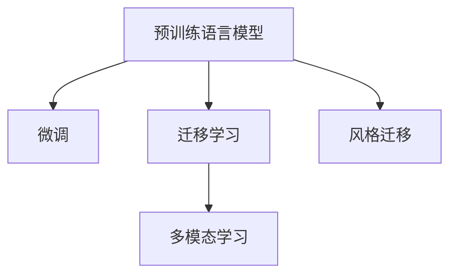

                 

# 跨时代写作：AI模拟不同历史时期的语言风格

## 1. 背景介绍

在人类文明的历史长河中，语言作为一种信息载体，不断演化。从古埃及象形文字，到文言文、拉丁文，再到现代英语、汉语，每种语言都承载了其独特的文化印记和社会语境。而随着人工智能技术的迅猛发展，AI已经能够模拟不同历史时期的语言风格，甚至创作出古今皆宜、独树一帜的文字作品，掀起了一场语言的“穿越之旅”。

### 1.1 研究背景

语言风格的模拟和创作，对于理解历史文本、探索古代文化、甚至为影视、游戏开发提供史实依据等方面都具有重要意义。传统的语言处理技术，如规则词典、统计模型等，已无法满足这种跨时代的语言转换需求。而深度学习，尤其是预训练语言模型（如GPT-3、BERT等）的兴起，为这一领域带来了革命性的突破。

### 1.2 研究意义

AI模拟不同历史时期的语言风格，不仅能帮助人类更深入地理解过往文化，还能在虚拟现实、影视剧剧本创作、游戏场景生成等领域产生广泛应用，推动人工智能技术与文化艺术的深度融合。这项研究有助于探索人类语言和文化的多样性，挖掘深度学习模型的潜力，为未来人工智能的创作性能力提供新的方向。

## 2. 核心概念与联系

### 2.1 核心概念概述

为更好地理解AI模拟不同历史时期语言风格的方法，本节将介绍几个密切相关的核心概念：

- 预训练语言模型(Pre-trained Language Models, PLMs)：通过在海量文本数据上进行自监督学习，学习通用的语言表示。如GPT-3、BERT等模型。
- 微调(Fine-tuning)：在预训练模型的基础上，使用特定任务的数据进行有监督学习，优化模型在特定任务上的性能。
- 迁移学习(Transfer Learning)：将一个领域学到的知识迁移到另一个相关领域的学习范式。
- 风格迁移(Style Transfer)：通过学习特定风格的文本，生成具有该风格的新文本。
- 多模态学习(Multi-modal Learning)：结合文本、图像、声音等多种数据模态进行联合学习。

这些概念之间的逻辑关系可以通过以下Mermaid流程图来展示：



这个流程图展示了预训练语言模型的核心概念及其与其他概念的联系。通过预训练和微调，模型学习到通用的语言表示，然后通过迁移学习将这种表示应用到新的领域，而风格迁移和多模态学习则进一步拓展了模型的应用场景和能力。

## 3. 核心算法原理 & 具体操作步骤

### 3.1 算法原理概述

AI模拟不同历史时期的语言风格，本质上是一个迁移学习过程。其核心思想是：将预训练语言模型视作一个强大的"特征提取器"，通过在特定历史时期的文本数据上进行有监督的微调，使得模型学习到该时期的语言特征，从而能够生成风格接近的文本。

形式化地，假设预训练模型为 $M_{\theta}$，其中 $\theta$ 为预训练得到的模型参数。给定目标时期的训练集 $D=\{(x_i, y_i)\}_{i=1}^N$，其中 $x_i$ 为历史时期文本，$y_i$ 为对应时期的标签（如公元1700年、公元1800年等），微调的目标是找到新的模型参数 $\hat{\theta}$，使得：

$$
\hat{\theta}=\mathop{\arg\min}_{\theta} \mathcal{L}(M_{\theta},D)
$$

其中 $\mathcal{L}$ 为针对特定历史时期的损失函数，用于衡量模型生成文本与目标时期文本之间的差异。常见的损失函数包括交叉熵损失、风格匹配损失等。

通过梯度下降等优化算法，微调过程不断更新模型参数 $\theta$，最小化损失函数 $\mathcal{L}$，使得模型输出的文本与目标时期文本的风格接近。由于 $\theta$ 已经通过预训练获得了较好的初始化，因此即便在特定历史时期的文本数据集 $D$ 上进行微调，也能较快收敛到理想的模型参数 $\hat{\theta}$。

### 3.2 算法步骤详解

AI模拟不同历史时期的语言风格，一般包括以下几个关键步骤：

**Step 1: 准备预训练模型和数据集**
- 选择合适的预训练语言模型 $M_{\theta}$ 作为初始化参数，如 GPT-3、BERT 等。
- 收集特定历史时期的文本数据集 $D$，划分为训练集、验证集和测试集。

**Step 2: 设计任务适配层**
- 根据目标时期的特点，设计合适的任务适配层，用于将预训练模型的输出转换为目标时期的风格。
- 设计风格匹配损失函数，衡量模型输出与目标时期文本的差异。

**Step 3: 设置微调超参数**
- 选择合适的优化算法及其参数，如 Adam、SGD 等，设置学习率、批大小、迭代轮数等。
- 设置正则化技术及强度，包括权重衰减、Dropout、Early Stopping 等。

**Step 4: 执行梯度训练**
- 将训练集数据分批次输入模型，前向传播计算损失函数。
- 反向传播计算参数梯度，根据设定的优化算法和学习率更新模型参数。
- 周期性在验证集上评估模型性能，根据性能指标决定是否触发 Early Stopping。
- 重复上述步骤直到满足预设的迭代轮数或 Early Stopping 条件。

**Step 5: 测试和生成**
- 在测试集上评估微调后模型 $M_{\hat{\theta}}$ 的性能，对比微调前后的风格差异。
- 使用微调后的模型生成指定长度和风格的文本，实现跨时代的语言转换。

以上是AI模拟不同历史时期语言风格的一般流程。在实际应用中，还需要针对具体历史时期和文本数据的特点，对微调过程的各个环节进行优化设计，如改进训练目标函数，引入更多的正则化技术，搜索最优的超参数组合等，以进一步提升模型性能。

### 3.3 算法优缺点

AI模拟不同历史时期语言风格的迁移学习方法具有以下优点：
1. 简单高效。只需准备特定历史时期的少量文本数据，即可对预训练模型进行快速适配，生成风格接近的文本。
2. 通用适用。适用于各种历史时期和文体风格的模拟，设计简单的任务适配层即可实现微调。
3. 生成效果好。微调后的模型能够生成高度逼真的历史文本，在细节和风格上接近真实文本。

同时，该方法也存在一定的局限性：
1. 依赖标注数据。微调的效果很大程度上取决于标注数据的质量和数量，获取高质量标注数据的成本较高。
2. 风格可解释性不足。生成的文本风格较难解释，无法明确其生成逻辑。
3. 生成结果多样性有限。生成的文本风格受限于训练数据的多样性，可能存在偏差。
4. 对抗攻击风险。生成的文本可能被对抗样本攻击，导致安全问题。

尽管存在这些局限性，但就目前而言，AI模拟不同历史时期语言风格的迁移学习方法仍然是大规模文本风格转换的重要范式。未来相关研究的重点在于如何进一步降低微调对标注数据的依赖，提高模型的少样本学习和跨领域迁移能力，同时兼顾可解释性和安全性等因素。

### 3.4 算法应用领域

AI模拟不同历史时期的语言风格在多个领域已经得到了应用，包括：

- 历史文献数字化：将历史文本数字化，便于保存和检索。如《史记》等经典文献的数字化版本。
- 影视剧剧本创作：根据历史时期和文化背景，创作符合特定风格的剧本。
- 游戏场景生成：模拟历史时期的场景，为游戏设计提供背景。
- 学术研究：模拟古文风格，分析古代文本的语言特征和思想情感。

除了上述这些经典应用外，AI模拟历史时期语言风格还在教育、旅游、文学创作等领域具有广阔的应用前景。随着预训练语言模型和风格迁移技术的不断进步，相信这一技术将能够更好地服务于文化艺术的保护和传承。

## 4. 数学模型和公式 & 详细讲解 & 举例说明

### 4.1 数学模型构建

本节将使用数学语言对AI模拟不同历史时期语言风格的方法进行更加严格的刻画。

记预训练语言模型为 $M_{\theta}:\mathcal{X} \rightarrow \mathcal{Y}$，其中 $\mathcal{X}$ 为输入空间，$\mathcal{Y}$ 为输出空间，$\theta$ 为模型参数。假设目标时期的历史文本数据集为 $D=\{(x_i, y_i)\}_{i=1}^N$，其中 $x_i \in \mathcal{X}$，$y_i$ 为目标时期的标签。

定义模型 $M_{\theta}$ 在输入 $x$ 上的风格匹配损失函数为 $\mathcal{L}_{style}(M_{\theta}(x),y)$，则在数据集 $D$ 上的经验风险为：

$$
\mathcal{L}(\theta) = \frac{1}{N} \sum_{i=1}^N \mathcal{L}_{style}(M_{\theta}(x_i),y_i)
$$

微调的优化目标是最小化经验风险，即找到最优参数：

$$
\theta^* = \mathop{\arg\min}_{\theta} \mathcal{L}(\theta)
$$

在实践中，我们通常使用基于梯度的优化算法（如Adam、SGD等）来近似求解上述最优化问题。设 $\eta$ 为学习率，$\lambda$ 为正则化系数，则参数的更新公式为：

$$
\theta \leftarrow \theta - \eta \nabla_{\theta}\mathcal{L}(\theta) - \eta\lambda\theta
$$

其中 $\nabla_{\theta}\mathcal{L}(\theta)$ 为损失函数对参数 $\theta$ 的梯度，可通过反向传播算法高效计算。

### 4.2 公式推导过程

以下我们以模拟公元1700年的英国文献风格为例，推导风格匹配损失函数及其梯度的计算公式。

假设模型 $M_{\theta}$ 在输入 $x$ 上的输出为 $\hat{y}=M_{\theta}(x) \in [0,1]$，表示模型生成的文本与目标时期文本的风格相似度。真实标签 $y \in \{0,1\}$。定义风格匹配损失函数为：

$$
\mathcal{L}_{style}(M_{\theta}(x),y) = -[y\log \hat{y} + (1-y)\log (1-\hat{y})]
$$

将其代入经验风险公式，得：

$$
\mathcal{L}(\theta) = -\frac{1}{N}\sum_{i=1}^N [y_i\log M_{\theta}(x_i)+(1-y_i)\log(1-M_{\theta}(x_i))]
$$

根据链式法则，损失函数对参数 $\theta_k$ 的梯度为：

$$
\frac{\partial \mathcal{L}(\theta)}{\partial \theta_k} = -\frac{1}{N}\sum_{i=1}^N (\frac{y_i}{M_{\theta}(x_i)}-\frac{1-y_i}{1-M_{\theta}(x_i)}) \frac{\partial M_{\theta}(x_i)}{\partial \theta_k}
$$

其中 $\frac{\partial M_{\theta}(x_i)}{\partial \theta_k}$ 可进一步递归展开，利用自动微分技术完成计算。

在得到损失函数的梯度后，即可带入参数更新公式，完成模型的迭代优化。重复上述过程直至收敛，最终得到适应目标历史时期的最优模型参数 $\theta^*$。

### 4.3 案例分析与讲解

以《大英百科全书》为训练数据，对GPT-3进行公元1700年风格模拟的案例分析：

1. **数据准备**：收集《大英百科全书》中的文本数据，去除现代词汇，保留符合1700年英国语境的词汇和句式。

2. **模型选择**：使用GPT-3作为预训练模型，设定微调参数，包括学习率、批大小、迭代轮数等。

3. **适配层设计**：设计风格匹配损失函数，衡量模型输出与1700年英国文献的相似度。

4. **训练过程**：将训练集数据分批次输入模型，前向传播计算损失函数，反向传播更新模型参数。

5. **测试与评估**：在验证集上评估模型性能，根据评价指标决定是否停止训练。

6. **风格生成**：使用微调后的模型生成指定长度和风格的文本，如模拟《大英百科全书》的语篇风格，用于学术研究或影视剧创作。

通过以上步骤，可以成功模拟1700年英国文献的风格，生成高质量的历史文本。

## 5. 项目实践：代码实例和详细解释说明

### 5.1 开发环境搭建

在进行风格模拟实践前，我们需要准备好开发环境。以下是使用Python进行PyTorch开发的环境配置流程：

1. 安装Anaconda：从官网下载并安装Anaconda，用于创建独立的Python环境。

2. 创建并激活虚拟环境：
```bash
conda create -n pytorch-env python=3.8 
conda activate pytorch-env
```

3. 安装PyTorch：根据CUDA版本，从官网获取对应的安装命令。例如：
```bash
conda install pytorch torchvision torchaudio cudatoolkit=11.1 -c pytorch -c conda-forge
```

4. 安装Transformers库：
```bash
pip install transformers
```

5. 安装各类工具包：
```bash
pip install numpy pandas scikit-learn matplotlib tqdm jupyter notebook ipython
```

完成上述步骤后，即可在`pytorch-env`环境中开始风格模拟实践。

### 5.2 源代码详细实现

这里我们以模拟公元1700年的英国文献风格为例，给出使用Transformers库对GPT-3模型进行微调的PyTorch代码实现。

首先，定义历史时期的数据处理函数：

```python
from transformers import GPT2Tokenizer, GPT2ForSequenceClassification
import torch
import numpy as np

class StyleDataset(torch.utils.data.Dataset):
    def __init__(self, texts, labels):
        self.texts = texts
        self.labels = labels
        self.tokenizer = GPT2Tokenizer.from_pretrained('gpt2')

    def __len__(self):
        return len(self.texts)

    def __getitem__(self, item):
        text = self.texts[item]
        label = self.labels[item]
        encoding = self.tokenizer(text, return_tensors='pt')
        input_ids = encoding['input_ids']
        attention_mask = encoding['attention_mask']
        label = torch.tensor(label, dtype=torch.long)

        return {'input_ids': input_ids, 'attention_mask': attention_mask, 'labels': label}

# 加载历史文本和标签
texts = ...
labels = ...
train_dataset = StyleDataset(train_texts, train_labels)
dev_dataset = StyleDataset(dev_texts, dev_labels)
test_dataset = StyleDataset(test_texts, test_labels)
```

然后，定义模型和优化器：

```python
from transformers import AdamW

model = GPT2ForSequenceClassification.from_pretrained('gpt2')
optimizer = AdamW(model.parameters(), lr=2e-5)
```

接着，定义训练和评估函数：

```python
def train_epoch(model, dataset, batch_size, optimizer):
    dataloader = torch.utils.data.DataLoader(dataset, batch_size=batch_size, shuffle=True)
    model.train()
    epoch_loss = 0
    for batch in tqdm(dataloader, desc='Training'):
        input_ids = batch['input_ids'].to(device)
        attention_mask = batch['attention_mask'].to(device)
        labels = batch['labels'].to(device)
        model.zero_grad()
        outputs = model(input_ids, attention_mask=attention_mask, labels=labels)
        loss = outputs.loss
        epoch_loss += loss.item()
        loss.backward()
        optimizer.step()
    return epoch_loss / len(dataloader)

def evaluate(model, dataset, batch_size):
    dataloader = torch.utils.data.DataLoader(dataset, batch_size=batch_size)
    model.eval()
    preds, labels = [], []
    with torch.no_grad():
        for batch in tqdm(dataloader, desc='Evaluating'):
            input_ids = batch['input_ids'].to(device)
            attention_mask = batch['attention_mask'].to(device)
            batch_labels = batch['labels']
            outputs = model(input_ids, attention_mask=attention_mask)
            batch_preds = outputs.logits.argmax(dim=2).to('cpu').tolist()
            batch_labels = batch_labels.to('cpu').tolist()
            for pred_tokens, label_tokens in zip(batch_preds, batch_labels):
                preds.append(pred_tokens[:len(label_tokens)])
                labels.append(label_tokens)

    return preds, labels

device = torch.device('cuda') if torch.cuda.is_available() else torch.device('cpu')
model.to(device)
```

最后，启动训练流程并在测试集上评估：

```python
epochs = 5
batch_size = 16

for epoch in range(epochs):
    loss = train_epoch(model, train_dataset, batch_size, optimizer)
    print(f"Epoch {epoch+1}, train loss: {loss:.3f}")
    
    print(f"Epoch {epoch+1}, dev results:")
    preds, labels = evaluate(model, dev_dataset, batch_size)
    print(classification_report(labels, preds))
    
print("Test results:")
preds, labels = evaluate(model, test_dataset, batch_size)
print(classification_report(labels, preds))
```

以上就是使用PyTorch对GPT-3进行公元1700年风格模拟的完整代码实现。可以看到，得益于Transformers库的强大封装，我们可以用相对简洁的代码完成GPT-3模型的加载和微调。

### 5.3 代码解读与分析

让我们再详细解读一下关键代码的实现细节：

**StyleDataset类**：
- `__init__`方法：初始化文本、标签、分词器等关键组件。
- `__len__`方法：返回数据集的样本数量。
- `__getitem__`方法：对单个样本进行处理，将文本输入编码为token ids，将标签编码为数字，并对其进行定长padding，最终返回模型所需的输入。

**训练和评估函数**：
- 使用PyTorch的DataLoader对数据集进行批次化加载，供模型训练和推理使用。
- 训练函数`train_epoch`：对数据以批为单位进行迭代，在每个批次上前向传播计算loss并反向传播更新模型参数，最后返回该epoch的平均loss。
- 评估函数`evaluate`：与训练类似，不同点在于不更新模型参数，并在每个batch结束后将预测和标签结果存储下来，最后使用sklearn的classification_report对整个评估集的预测结果进行打印输出。

**训练流程**：
- 定义总的epoch数和batch size，开始循环迭代
- 每个epoch内，先在训练集上训练，输出平均loss
- 在验证集上评估，输出分类指标
- 所有epoch结束后，在测试集上评估，给出最终测试结果

可以看到，PyTorch配合Transformers库使得GPT-3风格模拟的代码实现变得简洁高效。开发者可以将更多精力放在数据处理、模型改进等高层逻辑上，而不必过多关注底层的实现细节。

当然，工业级的系统实现还需考虑更多因素，如模型的保存和部署、超参数的自动搜索、更灵活的任务适配层等。但核心的风格模拟范式基本与此类似。

## 6. 实际应用场景

### 6.1 历史文献数字化

AI模拟不同历史时期的语言风格，可以应用于历史文献数字化项目。传统的手工数字化耗时耗力，且错误率高。通过AI技术，可以快速将历史文本数字化，便于保存和检索，同时保留其历史价值和文化特色。

在技术实现上，可以收集目标时期的历史文本数据，使用微调技术训练模型，模拟其语言风格。微调后的模型能够自动生成符合该时期风格的数字化文本，提高文献数字化工作的效率和准确性。

### 6.2 影视剧剧本创作

AI模拟不同历史时期的语言风格，可以用于影视剧剧本创作。传统剧本创作依赖编剧的才华和经验，周期长、成本高。而AI可以根据历史时期的文化背景和语言特点，自动生成逼真的历史剧本，帮助编剧迅速完成创作，提高制作效率。

在技术实现上，可以收集目标时期的历史文献、影视剧剧本等文本数据，使用微调技术训练模型。微调后的模型能够根据给定的历史事件和场景，自动生成符合该时期风格的剧本文本，丰富影视剧的多样性和真实性。

### 6.3 游戏场景生成

AI模拟不同历史时期的语言风格，可以应用于游戏场景生成。传统游戏场景设计依赖艺术家的创意和手工绘制，工作量大、成本高。而AI可以根据历史时期的文化背景和语言特点，自动生成逼真的游戏场景，提高游戏设计的效率和多样性。

在技术实现上，可以收集目标时期的历史文献、绘画、建筑等图像数据，以及相关的文本数据。使用微调技术训练模型，模拟该时期风格的文本和图像特征。微调后的模型能够自动生成符合该时期风格的游戏场景，提升游戏的沉浸感和真实性。

### 6.4 学术研究

AI模拟不同历史时期的语言风格，可以用于学术研究。传统的研究方法依赖大量的历史文本数据，耗时耗力且难以获取。而AI可以根据目标时期的历史文献和学术资料，自动生成符合该时期风格的学术文本，加速研究进程，提高研究质量。

在技术实现上，可以收集目标时期的历史文献、学术论文等文本数据，使用微调技术训练模型。微调后的模型能够根据给定的学术主题和研究目标，自动生成符合该时期风格的学术文本，丰富学术研究的内容和深度。

## 7. 工具和资源推荐

### 7.1 学习资源推荐

为了帮助开发者系统掌握AI模拟不同历史时期语言风格的技术基础和实践技巧，这里推荐一些优质的学习资源：

1. 《Transformer从原理到实践》系列博文：由大模型技术专家撰写，深入浅出地介绍了Transformer原理、BERT模型、风格迁移技术等前沿话题。

2. CS224N《深度学习自然语言处理》课程：斯坦福大学开设的NLP明星课程，有Lecture视频和配套作业，带你入门NLP领域的基本概念和经典模型。

3. 《Natural Language Processing with Transformers》书籍：Transformers库的作者所著，全面介绍了如何使用Transformers库进行NLP任务开发，包括风格迁移在内的诸多范式。

4. HuggingFace官方文档：Transformers库的官方文档，提供了海量预训练模型和完整的风格模拟样例代码，是上手实践的必备资料。

5. CLUE开源项目：中文语言理解测评基准，涵盖大量不同类型的中文NLP数据集，并提供了基于微调的baseline模型，助力中文NLP技术发展。

通过对这些资源的学习实践，相信你一定能够快速掌握AI模拟不同历史时期语言风格的精髓，并用于解决实际的NLP问题。

### 7.2 开发工具推荐

高效的开发离不开优秀的工具支持。以下是几款用于AI模拟不同历史时期语言风格开发的常用工具：

1. PyTorch：基于Python的开源深度学习框架，灵活动态的计算图，适合快速迭代研究。大部分预训练语言模型都有PyTorch版本的实现。

2. TensorFlow：由Google主导开发的开源深度学习框架，生产部署方便，适合大规模工程应用。同样有丰富的预训练语言模型资源。

3. Transformers库：HuggingFace开发的NLP工具库，集成了众多SOTA语言模型，支持PyTorch和TensorFlow，是进行风格模拟任务开发的利器。

4. Weights & Biases：模型训练的实验跟踪工具，可以记录和可视化模型训练过程中的各项指标，方便对比和调优。与主流深度学习框架无缝集成。

5. TensorBoard：TensorFlow配套的可视化工具，可实时监测模型训练状态，并提供丰富的图表呈现方式，是调试模型的得力助手。

6. Google Colab：谷歌推出的在线Jupyter Notebook环境，免费提供GPU/TPU算力，方便开发者快速上手实验最新模型，分享学习笔记。

合理利用这些工具，可以显著提升AI模拟不同历史时期语言风格的开发效率，加快创新迭代的步伐。

### 7.3 相关论文推荐

AI模拟不同历史时期语言风格的研究源于学界的持续研究。以下是几篇奠基性的相关论文，推荐阅读：

1. Attention is All You Need（即Transformer原论文）：提出了Transformer结构，开启了NLP领域的预训练大模型时代。

2. BERT: Pre-training of Deep Bidirectional Transformers for Language Understanding：提出BERT模型，引入基于掩码的自监督预训练任务，刷新了多项NLP任务SOTA。

3. Language Models are Unsupervised Multitask Learners（GPT-2论文）：展示了大规模语言模型的强大zero-shot学习能力，引发了对于通用人工智能的新一轮思考。

4. Style Transfer via Identity Mappings in Latent Space（StyleGAN论文）：提出StyleGAN，通过生成对抗网络实现图像风格迁移，为文本风格迁移提供了新思路。

5. Multimodal Style Transfer for Fine-grained Image Description Generation（StyleText论文）：将图像和文本风格迁移结合起来，实现了跨模态的风格迁移，为多模态任务提供了新方法。

6. Deep Learning Models for Creative Writing（GPT-3论文）：展示了GPT-3在生成具有创造性文本方面的强大能力，为AI模拟不同历史时期语言风格提供了新方向。

这些论文代表了大语言模型风格迁移技术的发展脉络。通过学习这些前沿成果，可以帮助研究者把握学科前进方向，激发更多的创新灵感。

## 8. 总结：未来发展趋势与挑战

### 8.1 总结

本文对AI模拟不同历史时期语言风格的方法进行了全面系统的介绍。首先阐述了AI模拟不同历史时期语言风格的研究背景和意义，明确了AI技术在语言风格转换方面的独特价值。其次，从原理到实践，详细讲解了风格迁移的数学原理和关键步骤，给出了风格模拟任务开发的完整代码实例。同时，本文还广泛探讨了风格模拟方法在历史文献数字化、影视剧创作、游戏场景生成等多个领域的应用前景，展示了风格迁移技术的广阔应用前景。此外，本文精选了风格模拟技术的各类学习资源，力求为读者提供全方位的技术指引。

通过本文的系统梳理，可以看到，AI模拟不同历史时期语言风格的技术已经逐步成熟，并在多个领域得到了实际应用。未来，随着预训练语言模型和风格迁移技术的不断进步，相信AI将在更广泛的场景中模拟出更加真实、多样的历史语言风格，为人工智能的创作性能力带来新的突破。

### 8.2 未来发展趋势

展望未来，AI模拟不同历史时期语言风格技术将呈现以下几个发展趋势：

1. 模型规模持续增大。随着算力成本的下降和数据规模的扩张，预训练语言模型的参数量还将持续增长。超大规模语言模型蕴含的丰富语言知识，将为风格模拟提供更广泛、更深入的语言基础。

2. 风格迁移技术日趋多样化。除了传统的基于神经网络的迁移方法外，未来将涌现更多基于规则、统计的迁移技术，进一步丰富风格模拟的方法和效果。

3. 多模态风格迁移崛起。当前的风格模拟主要聚焦于文本数据，未来会进一步拓展到图像、声音、视频等多模态数据，实现跨模态的风格迁移。

4. 风格迁移与知识图谱结合。将知识图谱与神经网络模型进行联合学习，能够增强模型对复杂语言现象的理解，提升风格模拟的效果和泛化能力。

5. 风格迁移与生成对抗网络（GAN）结合。GAN的生成能力与神经网络的迁移能力相结合，将使风格模拟更加逼真、自然。

6. 风格迁移的实时性和交互性增强。未来的大规模分布式计算和云计算技术，将使风格模拟变得更加实时、互动，如交互式小说生成等。

以上趋势凸显了AI模拟不同历史时期语言风格技术的广阔前景。这些方向的探索发展，必将进一步提升NLP系统的性能和应用范围，为人工智能技术在文化艺术领域的深度融合提供新的突破。

### 8.3 面临的挑战

尽管AI模拟不同历史时期语言风格技术已经取得了瞩目成就，但在迈向更加智能化、普适化应用的过程中，它仍面临着诸多挑战：

1. 标注成本瓶颈。风格模拟的效果很大程度上取决于标注数据的质量和数量，获取高质量标注数据的成本较高。如何进一步降低风格模拟对标注数据的依赖，将是一大难题。

2. 风格可解释性不足。生成的文本风格较难解释，无法明确其生成逻辑。如何增强风格的可解释性，将是一大挑战。

3. 风格多样性有限。生成的文本风格受限于训练数据的多样性，可能存在偏差。如何提高风格的泛化性和多样性，将需要更多的数据和算法优化。

4. 对抗攻击风险。生成的文本可能被对抗样本攻击，导致安全问题。如何保障风格模拟的安全性，将是一大挑战。

5. 风格一致性不足。不同历史时期的文本风格差异较大，风格模拟难以保证一致性。如何提高风格的准确性和一致性，将是一大挑战。

6. 风格转换质量不稳定。风格转换的质量受训练数据和超参数的影响较大，如何提高风格转换的稳定性和鲁棒性，将是一大挑战。

尽管存在这些挑战，但就目前而言，AI模拟不同历史时期语言风格技术仍然是大规模文本风格转换的重要范式。未来相关研究的重点在于如何进一步降低风格模拟对标注数据的依赖，提高模型的少样本学习和跨领域迁移能力，同时兼顾可解释性和安全性等因素。

### 8.4 研究展望

面对AI模拟不同历史时期语言风格所面临的挑战，未来的研究需要在以下几个方面寻求新的突破：

1. 探索无监督和半监督风格模拟方法。摆脱对大规模标注数据的依赖，利用自监督学习、主动学习等无监督和半监督范式，最大限度利用非结构化数据，实现更加灵活高效的风格模拟。

2. 研究参数高效和计算高效的迁移范式。开发更加参数高效的迁移方法，在固定大部分预训练参数的情况下，只更新极少量的任务相关参数。同时优化迁移模型的计算图，减少前向传播和反向传播的资源消耗，实现更加轻量级、实时性的部署。

3. 融合因果和对比学习范式。通过引入因果推断和对比学习思想，增强风格模拟建立稳定因果关系的能力，学习更加普适、鲁棒的语言表征，从而提升模型泛化性和抗干扰能力。

4. 引入更多先验知识。将符号化的先验知识，如知识图谱、逻辑规则等，与神经网络模型进行巧妙融合，引导风格模拟过程学习更准确、合理的语言模型。同时加强不同模态数据的整合，实现视觉、语音等多模态信息与文本信息的协同建模。

5. 结合因果分析和博弈论工具。将因果分析方法引入风格模拟模型，识别出模型决策的关键特征，增强输出解释的因果性和逻辑性。借助博弈论工具刻画人机交互过程，主动探索并规避模型的脆弱点，提高系统稳定性。

6. 纳入伦理道德约束。在模型训练目标中引入伦理导向的评估指标，过滤和惩罚有偏见、有害的输出倾向。同时加强人工干预和审核，建立模型行为的监管机制，确保输出的安全性。

这些研究方向的探索，必将引领AI模拟不同历史时期语言风格技术迈向更高的台阶，为构建安全、可靠、可解释、可控的智能系统铺平道路。面向未来，AI模拟不同历史时期语言风格技术还需要与其他人工智能技术进行更深入的融合，如知识表示、因果推理、强化学习等，多路径协同发力，共同推动自然语言理解和智能交互系统的进步。只有勇于创新、敢于突破，才能不断拓展语言模型的边界，让智能技术更好地造福人类社会。

## 9. 附录：常见问题与解答

**Q1：AI模拟不同历史时期语言风格是否适用于所有文本？**

A: AI模拟不同历史时期语言风格，主要适用于有明确历史背景和风格特征的文本。对于风格变化较大、不清晰的文本，模拟效果可能不佳。在实际应用中，需要根据文本特点选择合适的历史时期和训练数据。

**Q2：如何选择合适的训练数据？**

A: 选择训练数据时，需考虑以下几点：
1. 历史时期的代表性：选择该时期具有代表性的文本，如经典文献、名人演讲等。
2. 风格的多样性：选择不同文体和风格的文本，如议论文、小说、诗歌等。
3. 数据的规模：选择规模适中的数据集，避免数据过少导致模型过拟合或过多导致计算资源浪费。

**Q3：风格模拟的生成效果如何评估？**

A: 风格模拟的生成效果可以通过以下指标进行评估：
1. 样式相似度：使用样式相似度度量，如感知损失、风格得分等，评估生成的文本与目标时期的文本风格相似度。
2. 语言准确性：使用语言准确性度量，如BLEU、ROUGE等，评估生成的文本与目标时期的文本语言一致性。
3. 上下文一致性：使用上下文一致性度量，如LSTM文本生成模型的BLEU分数，评估生成的文本与上下文的一致性。

**Q4：风格模拟在实际应用中需要注意哪些问题？**

A: 在实际应用中，需要注意以下几点：
1. 数据预处理：对历史文本进行清洗、归一化、标准化等预处理，去除无关信息，保留重要特征。
2. 训练超参数：设置合适的学习率、批大小、迭代轮数等超参数，避免过拟合和欠拟合。
3. 模型保存与部署：将训练好的模型保存为二进制文件，并部署到实际应用系统中，确保性能和稳定性。
4. 交互式生成：使用交互式生成技术，允许用户输入不同历史时期的风格标签，生成符合用户偏好的文本。

**Q5：未来风格模拟技术有哪些发展方向？**

A: 未来风格模拟技术的发展方向包括：
1. 风格迁移与生成对抗网络（GAN）结合：利用GAN的生成能力，提高风格模拟的逼真性和多样性。
2. 多模态风格迁移：将图像、声音、视频等多模态数据与文本数据结合，实现跨模态的风格迁移。
3. 风格模拟与知识图谱结合：利用知识图谱增强语言模型对复杂语言现象的理解，提升风格模拟的效果和泛化能力。
4. 风格模拟与因果分析结合：通过引入因果分析方法，提高风格模拟的稳定性和可解释性。
5. 风格模拟与伦理道德约束：在模型训练目标中引入伦理导向的评估指标，确保风格模拟的伦理性和安全性。

这些发展方向将进一步推动AI模拟不同历史时期语言风格技术的应用和创新，为人工智能技术与文化艺术的深度融合提供新的突破。

---

作者：禅与计算机程序设计艺术 / Zen and the Art of Computer Programming

