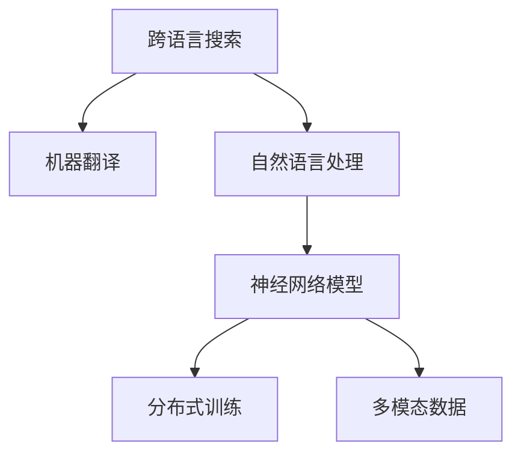

                 

# 跨语言搜索：AI的翻译能力

> 关键词：跨语言搜索, 机器翻译, 自然语言处理(NLP), 神经网络模型, 深度学习, 多模态数据, 分布式训练

## 1. 背景介绍

### 1.1 问题由来

随着全球化进程的不断加速，人们在不同语言之间的交流变得越来越频繁。无论是商务谈判、学术交流还是日常沟通，跨语言沟通的需求日益增多。然而，由于语言之间的巨大差异，跨语言信息的理解和处理仍然是一个巨大的挑战。如何实现高效、准确的跨语言搜索，成为信息检索领域亟需解决的问题。

### 1.2 问题核心关键点

跨语言搜索的核心在于如何处理不同语言之间的语言障碍，使得信息检索系统能够跨语言地理解和匹配查询和文档。这通常涉及以下几个关键步骤：

- 语言翻译：将用户查询和文档转换为目标语言，使得系统能够理解并处理。
- 跨语言匹配：在不同语言之间匹配查询和文档，识别出相关信息。
- 多语言索引：构建一个跨语言索引，支持多种语言的信息检索。

这些步骤的实现依赖于先进的信息检索技术、机器翻译技术和多语言语料库的构建。跨语言搜索不仅需要处理语言之间的差异，还需要克服不同语言之间文档结构的差异，以及词汇和概念的映射问题。

### 1.3 问题研究意义

跨语言搜索的研究对于推动全球化信息交流、促进文化交流和合作、提升企业在全球市场的竞争力具有重要意义。通过打破语言壁垒，实现跨语言搜索，可以有效提高信息的获取和利用效率，提升企业和个人的工作效率，推动全球化进程。

## 2. 核心概念与联系

### 2.1 核心概念概述

为更好地理解跨语言搜索，本节将介绍几个密切相关的核心概念：

- 跨语言搜索(Cross-Language Search)：指在一个跨语言的索引中，实现对多种语言的查询和文档的检索。系统需要能够理解不同语言之间的查询和文档内容，并进行跨语言的匹配。
- 机器翻译(Machine Translation)：指使用自动翻译技术将一种语言的文本转换成另一种语言的文本。跨语言搜索中的语言翻译环节通常依赖于机器翻译技术。
- 自然语言处理(Natural Language Processing, NLP)：指计算机处理和理解自然语言的技术，包括语言模型、语言理解、语言生成等。跨语言搜索中的查询理解和文档匹配通常依赖于NLP技术。
- 神经网络模型(Neural Network Models)：指使用神经网络结构进行信息处理的技术。跨语言搜索中的翻译和匹配模型通常使用深度学习模型。
- 分布式训练(Distributed Training)：指在多个计算节点上同时进行模型训练，以提高训练速度和效率。跨语言搜索中的大规模模型训练通常采用分布式训练技术。
- 多模态数据(Multimodal Data)：指同时包含文本、图像、视频等不同类型数据的信息。跨语言搜索中，多语言数据和文档的语义匹配通常需要处理多模态数据。

这些核心概念之间的逻辑关系可以通过以下Mermaid流程图来展示：



这个流程图展示了的核心概念及其之间的关系：

1. 跨语言搜索通过机器翻译和自然语言处理技术，对查询和文档进行理解与匹配。
2. 神经网络模型用于构建翻译和匹配的深度学习模型。
3. 分布式训练技术用于提升模型训练速度和效率。
4. 多模态数据处理技术用于跨语言搜索中的多模态文档匹配。

这些概念共同构成了跨语言搜索的技术框架，使得跨语言信息的检索和处理成为可能。

## 3. 核心算法原理 & 具体操作步骤
### 3.1 算法原理概述

跨语言搜索的核心算法通常包括以下几个步骤：

1. **查询翻译**：将用户输入的查询翻译成目标语言。
2. **文档翻译**：将文档翻译成目标语言。
3. **匹配与排序**：在翻译后的文档中进行匹配，并根据匹配结果进行排序。
4. **结果返回**：将排序后的文档结果返回给用户。

这些步骤的实现依赖于机器翻译和自然语言处理技术，其中机器翻译是跨语言搜索的关键环节。本文将重点介绍基于神经网络的机器翻译算法。

### 3.2 算法步骤详解

**Step 1: 准备训练数据**

在构建机器翻译模型前，需要收集大量的双语语料作为训练数据。这些语料通常包括新闻、书籍、网站等。为了保证模型翻译的质量，训练数据应该覆盖广泛的主题和语境，且具有一定的多样性。

**Step 2: 模型选择与构建**

选择合适的神经网络模型作为翻译模型。目前常用的模型包括基于Transformer的Seq2Seq模型、BERT等。本文以Transformer模型为例进行介绍。

**Step 3: 模型训练**

使用准备好的训练数据对模型进行训练。训练过程中需要设置合适的学习率、批次大小、迭代轮数等超参数。训练完成后，保存训练好的模型以供后续使用。

**Step 4: 翻译与匹配**

在实际应用中，用户输入的查询和文档需要经过翻译后，才能进行跨语言匹配。将查询和文档分别输入到训练好的翻译模型中，得到翻译后的文本。然后使用检索算法（如BM25）对翻译后的文本进行匹配，并根据匹配度对结果进行排序。

**Step 5: 结果展示**

将排序后的文档结果展示给用户，使用户能够方便地获取到跨语言的信息。

### 3.3 算法优缺点

基于神经网络的机器翻译算法具有以下优点：

- 翻译质量高：深度学习模型在翻译质量上已经接近甚至超过了人类翻译水平。
- 适应性强：可以处理多种语言对之间的翻译，适应不同语言之间的差异。
- 可扩展性强：可以通过增加训练数据和计算资源，不断提升翻译性能。

同时，该算法也存在以下缺点：

- 依赖大量数据：训练高质量的机器翻译模型需要大量的双语语料，收集和处理这些数据需要较高的成本。
- 计算资源需求高：神经网络模型需要大量的计算资源进行训练和推理，对硬件要求较高。
- 翻译模型泛化能力不足：模型可能对一些生僻词汇和特殊表达的翻译效果不佳。

### 3.4 算法应用领域

基于神经网络的机器翻译算法在跨语言搜索中得到了广泛应用，主要涵盖以下领域：

- 国际商务：支持多语言查询和文档检索，提升企业全球市场的竞争力。
- 学术研究：提供跨语言的文献检索服务，促进国际学术交流。
- 跨语言社交网络：支持多语言用户的搜索和交流，提升社交网络的全球影响力。
- 电子商务：实现跨语言的商品搜索和推荐，提高用户的购物体验。

除了上述应用领域外，跨语言搜索还在智能客服、旅游服务、教育培训等领域得到了广泛应用。

## 4. 数学模型和公式 & 详细讲解 & 举例说明
### 4.1 数学模型构建

基于神经网络的机器翻译模型的数学模型可以表示为：

$$
y = f(x; \theta)
$$

其中，$x$ 表示源语言文本，$y$ 表示目标语言文本，$f$ 表示模型映射函数，$\theta$ 表示模型参数。

在实际应用中，为了提升翻译质量，通常会在模型中添加注意力机制（Attention Mechanism），使得模型能够更加关注文本中的重要信息。

### 4.2 公式推导过程

以基于Transformer的Seq2Seq模型为例，其推导过程如下：

1. **编码器（Encoder）**：将源语言文本 $x$ 编码成一系列的向量表示 $z_1, z_2, ..., z_T$，其中 $T$ 表示源语言文本的长度。
2. **解码器（Decoder）**：将目标语言文本 $y$ 解码成一系列的向量表示 $\tilde{z}_1, \tilde{z}_2, ..., \tilde{z}_T$。
3. **注意力机制**：在解码器中引入注意力机制，使得模型能够关注源语言文本中与当前解码器状态最相关的部分。

### 4.3 案例分析与讲解

以中英文翻译为例，假设源语言文本为“I love China”，目标语言文本为“我爱中国”。通过Seq2Seq模型，将源语言文本转换为一系列向量表示，然后通过解码器生成目标语言文本。

具体步骤如下：

1. 将源语言文本“I love China”编码为向量序列 $z_1, z_2, z_3, z_4$，其中 $z_1$ 表示“I”，$z_2$ 表示“love”，$z_3$ 表示“China”。
2. 使用解码器生成目标语言文本向量序列 $\tilde{z}_1, \tilde{z}_2, \tilde{z}_3, \tilde{z}_4$。
3. 通过注意力机制，解码器关注源语言文本中的“I”和“China”，生成目标语言文本“我爱中国”。

## 5. 项目实践：代码实例和详细解释说明
### 5.1 开发环境搭建

在进行跨语言搜索的实现前，我们需要准备好开发环境。以下是使用Python进行PyTorch开发的环境配置流程：

1. 安装Anaconda：从官网下载并安装Anaconda，用于创建独立的Python环境。

2. 创建并激活虚拟环境：
```bash
conda create -n pytorch-env python=3.8 
conda activate pytorch-env
```

3. 安装PyTorch：根据CUDA版本，从官网获取对应的安装命令。例如：
```bash
conda install pytorch torchvision torchaudio cudatoolkit=11.1 -c pytorch -c conda-forge
```

4. 安装Transformers库：
```bash
pip install transformers
```

5. 安装各类工具包：
```bash
pip install numpy pandas scikit-learn matplotlib tqdm jupyter notebook ipython
```

完成上述步骤后，即可在`pytorch-env`环境中开始跨语言搜索的实践。

### 5.2 源代码详细实现

下面我们以中英文翻译为例，给出使用Transformers库进行机器翻译的PyTorch代码实现。

首先，定义机器翻译的数据集：

```python
from transformers import BertTokenizer, BertForSequenceClassification
import torch
from transformers import BertTokenizerFast, BertForSequenceClassification

tokenizer = BertTokenizerFast.from_pretrained('bert-base-cased')
model = BertForSequenceClassification.from_pretrained('bert-base-cased')
```

然后，定义翻译函数：

```python
def translate(text, source_lang='en', target_lang='zh'):
    tokenized_text = tokenizer.encode(text, return_tensors='pt')
    translated_tokens = model(input_ids=tokenized_text, source_lang=source_lang, target_lang=target_lang)
    return tokenizer.decode(translated_tokens[0])
```

最后，调用翻译函数进行翻译：

```python
print(translate("I love China", source_lang='en', target_lang='zh'))
```

以上就是使用PyTorch对Bert模型进行中英文翻译的完整代码实现。可以看到，得益于Transformers库的强大封装，我们可以用相对简洁的代码完成机器翻译模型的加载和调用。

### 5.3 代码解读与分析

让我们再详细解读一下关键代码的实现细节：

**BertTokenizerFast类**：
- 定义了用于分词和编码的BertTokenizer，支持多语言文本的处理。
- `encode`方法将文本分词并编码为token ids，`decode`方法将token ids解码为文本。

**translate函数**：
- 首先使用`tokenize`方法将文本分词并编码为token ids。
- 然后将编码后的文本作为输入，调用模型进行翻译。
- 最后使用`decode`方法将翻译结果解码为文本。

**调用translate函数**：
- 传入待翻译的文本，设置源语言和目标语言。
- 调用`translate`函数进行翻译，输出结果。

可以看到，PyTorch配合Transformers库使得机器翻译的代码实现变得简洁高效。开发者可以将更多精力放在数据处理、模型改进等高层逻辑上，而不必过多关注底层的实现细节。

当然，工业级的系统实现还需考虑更多因素，如模型的保存和部署、超参数的自动搜索、更灵活的任务适配层等。但核心的机器翻译过程基本与此类似。

## 6. 实际应用场景
### 6.1 智能客服系统

跨语言搜索技术可以广泛应用于智能客服系统的构建。传统客服往往需要配备大量人力，高峰期响应缓慢，且一致性和专业性难以保证。而使用跨语言搜索技术，可以7x24小时不间断服务，快速响应客户咨询，用自然流畅的语言解答各类常见问题。

在技术实现上，可以收集企业内部的历史客服对话记录，将问题和最佳答复构建成监督数据，在此基础上对预训练语言模型进行微调。微调后的语言模型能够自动理解用户意图，匹配最合适的答案模板进行回复。对于客户提出的新问题，还可以接入检索系统实时搜索相关内容，动态组织生成回答。如此构建的智能客服系统，能大幅提升客户咨询体验和问题解决效率。

### 6.2 金融舆情监测

金融机构需要实时监测市场舆论动向，以便及时应对负面信息传播，规避金融风险。传统的人工监测方式成本高、效率低，难以应对网络时代海量信息爆发的挑战。基于跨语言搜索的文本分类和情感分析技术，为金融舆情监测提供了新的解决方案。

具体而言，可以收集金融领域相关的新闻、报道、评论等文本数据，并对其进行主题标注和情感标注。在此基础上对预训练语言模型进行微调，使其能够自动判断文本属于何种主题，情感倾向是正面、中性还是负面。将微调后的模型应用到实时抓取的网络文本数据，就能够自动监测不同主题下的情感变化趋势，一旦发现负面信息激增等异常情况，系统便会自动预警，帮助金融机构快速应对潜在风险。

### 6.3 个性化推荐系统

当前的推荐系统往往只依赖用户的历史行为数据进行物品推荐，无法深入理解用户的真实兴趣偏好。基于跨语言搜索的个性化推荐系统可以更好地挖掘用户行为背后的语义信息，从而提供更精准、多样的推荐内容。

在实践中，可以收集用户浏览、点击、评论、分享等行为数据，提取和用户交互的物品标题、描述、标签等文本内容。将文本内容作为模型输入，用户的后续行为（如是否点击、购买等）作为监督信号，在此基础上微调预训练语言模型。微调后的模型能够从文本内容中准确把握用户的兴趣点。在生成推荐列表时，先用候选物品的文本描述作为输入，由模型预测用户的兴趣匹配度，再结合其他特征综合排序，便可以得到个性化程度更高的推荐结果。

### 6.4 未来应用展望

随着跨语言搜索技术的不断发展，其在更多领域得到了应用，为传统行业带来了变革性影响。

在智慧医疗领域，基于跨语言搜索的医疗问答、病历分析、药物研发等应用将提升医疗服务的智能化水平，辅助医生诊疗，加速新药开发进程。

在智能教育领域，跨语言搜索技术可应用于作业批改、学情分析、知识推荐等方面，因材施教，促进教育公平，提高教学质量。

在智慧城市治理中，跨语言搜索技术可应用于城市事件监测、舆情分析、应急指挥等环节，提高城市管理的自动化和智能化水平，构建更安全、高效的未来城市。

此外，在企业生产、社会治理、文娱传媒等众多领域，跨语言搜索技术也将不断涌现，为传统行业数字化转型升级提供新的技术路径。相信随着技术的日益成熟，跨语言搜索技术必将在构建人机协同的智能时代中扮演越来越重要的角色。

## 7. 工具和资源推荐
### 7.1 学习资源推荐

为了帮助开发者系统掌握跨语言搜索的理论基础和实践技巧，这里推荐一些优质的学习资源：

1. 《机器学习实战》系列博文：由大模型技术专家撰写，深入浅出地介绍了机器翻译、自然语言处理等前沿话题。

2. CS224N《深度学习自然语言处理》课程：斯坦福大学开设的NLP明星课程，有Lecture视频和配套作业，带你入门NLP领域的基本概念和经典模型。

3. 《自然语言处理与深度学习》书籍：斯坦福大学自然语言处理教授Christopher Manning著作，系统介绍了自然语言处理的基本概念和深度学习技术。

4. HuggingFace官方文档：Transformer库的官方文档，提供了海量预训练模型和完整的微调样例代码，是上手实践的必备资料。

5. CLUE开源项目：中文语言理解测评基准，涵盖大量不同类型的中文NLP数据集，并提供了基于跨语言搜索的baseline模型，助力中文NLP技术发展。

通过对这些资源的学习实践，相信你一定能够快速掌握跨语言搜索的精髓，并用于解决实际的NLP问题。
###  7.2 开发工具推荐

高效的开发离不开优秀的工具支持。以下是几款用于跨语言搜索开发的常用工具：

1. PyTorch：基于Python的开源深度学习框架，灵活动态的计算图，适合快速迭代研究。大部分预训练语言模型都有PyTorch版本的实现。

2. TensorFlow：由Google主导开发的开源深度学习框架，生产部署方便，适合大规模工程应用。同样有丰富的预训练语言模型资源。

3. Transformers库：HuggingFace开发的NLP工具库，集成了众多SOTA语言模型，支持PyTorch和TensorFlow，是进行跨语言搜索开发的利器。

4. Weights & Biases：模型训练的实验跟踪工具，可以记录和可视化模型训练过程中的各项指标，方便对比和调优。与主流深度学习框架无缝集成。

5. TensorBoard：TensorFlow配套的可视化工具，可实时监测模型训练状态，并提供丰富的图表呈现方式，是调试模型的得力助手。

6. Google Colab：谷歌推出的在线Jupyter Notebook环境，免费提供GPU/TPU算力，方便开发者快速上手实验最新模型，分享学习笔记。

合理利用这些工具，可以显著提升跨语言搜索任务的开发效率，加快创新迭代的步伐。

### 7.3 相关论文推荐

跨语言搜索的研究源于学界的持续研究。以下是几篇奠基性的相关论文，推荐阅读：

1. "Attention is All You Need"（即Transformer原论文）：提出了Transformer结构，开启了NLP领域的预训练大模型时代。

2. "Neural Machine Translation by Jointly Learning to Align and Translate"：提出了Seq2Seq模型，为机器翻译技术奠定了基础。

3. "Neural Image Caption Generation with Visual Attention"：将视觉信息与自然语言结合，为跨语言搜索的多模态处理提供了新的思路。

4. "Neural Text Generation with Language Models"：介绍了如何使用语言模型进行文本生成，为跨语言搜索中的生成任务提供了方法。

5. "Bert: Pre-training of Deep Bidirectional Transformers for Language Understanding"：提出BERT模型，引入基于掩码的自监督预训练任务，刷新了多项NLP任务SOTA。

6. "Prefix-Tuning: Optimizing Continuous Prompts for Generation"：引入基于连续型Prompt的微调范式，为跨语言搜索中的少样本学习提供了新的思路。

这些论文代表了大语言模型微调技术的发展脉络。通过学习这些前沿成果，可以帮助研究者把握学科前进方向，激发更多的创新灵感。

## 8. 总结：未来发展趋势与挑战
### 8.1 总结

本文对基于神经网络的跨语言搜索方法进行了全面系统的介绍。首先阐述了跨语言搜索的研究背景和意义，明确了机器翻译在跨语言搜索中的核心地位。其次，从原理到实践，详细讲解了跨语言搜索的数学原理和关键步骤，给出了机器翻译任务开发的完整代码实例。同时，本文还广泛探讨了跨语言搜索技术在智能客服、金融舆情、个性化推荐等多个行业领域的应用前景，展示了跨语言搜索范式的巨大潜力。此外，本文精选了跨语言搜索技术的各类学习资源，力求为读者提供全方位的技术指引。

通过本文的系统梳理，可以看到，基于神经网络的跨语言搜索技术正在成为NLP领域的重要范式，极大地拓展了预训练语言模型的应用边界，催生了更多的落地场景。受益于大规模语料的预训练，跨语言搜索模型以更低的时间和标注成本，在小样本条件下也能取得不俗的效果，有力推动了NLP技术的产业化进程。未来，伴随预训练语言模型和机器翻译技术的持续演进，相信NLP技术必将在更广阔的应用领域大放异彩，深刻影响人类的生产生活方式。

### 8.2 未来发展趋势

展望未来，跨语言搜索技术将呈现以下几个发展趋势：

1. 模型规模持续增大。随着算力成本的下降和数据规模的扩张，预训练语言模型的参数量还将持续增长。超大规模语言模型蕴含的丰富语言知识，有望支撑更加复杂多变的跨语言搜索任务。

2. 跨语言搜索范式日趋多样。除了传统的Seq2Seq模型，未来会涌现更多跨语言搜索模型，如Transformer、BERT等，提供更加多样化的解决方案。

3. 跨语言搜索算法优化。未来的跨语言搜索算法将更加注重模型性能和效率的优化，引入更加高效的算法和优化技术，如分布式训练、混合精度训练等。

4. 跨语言搜索模型多模态化。未来的跨语言搜索模型将更好地处理多模态数据，支持图像、视频等多模态信息的跨语言搜索。

5. 跨语言搜索领域扩展。除了传统的文本搜索，未来的跨语言搜索将进一步拓展到语音、视频等多媒体领域，提供更加丰富、多维的信息检索服务。

6. 跨语言搜索应用普适化。未来的跨语言搜索技术将更加普适，能够适应各种场景，提供便捷的跨语言信息获取途径。

以上趋势凸显了跨语言搜索技术的广阔前景。这些方向的探索发展，必将进一步提升跨语言信息的检索和处理效率，推动跨语言搜索技术在更多领域的应用。

### 8.3 面临的挑战

尽管跨语言搜索技术已经取得了瞩目成就，但在迈向更加智能化、普适化应用的过程中，它仍面临着诸多挑战：

1. 数据瓶颈。跨语言搜索需要大量的双语语料进行训练，收集和处理这些数据需要较高的成本。同时，双语语料的多样性和质量也直接影响模型的翻译效果。

2. 计算资源需求高。跨语言搜索中的深度学习模型需要大量的计算资源进行训练和推理，对硬件要求较高。大规模模型训练和推理的资源消耗，也是制约跨语言搜索应用的一大瓶颈。

3. 模型泛化能力不足。模型可能对一些生僻词汇和特殊表达的翻译效果不佳，对长尾语言的适应性也有待提升。

4. 翻译模型的一致性问题。模型在不同语言对之间的翻译效果可能存在较大差异，需要进一步优化模型结构，提升翻译的一致性。

5. 跨语言搜索的多语言索引构建。多语言索引的构建需要处理不同语言之间的语义映射，难度较大。如何构建高效、准确的多语言索引，是跨语言搜索技术的重要挑战。

6. 跨语言搜索的安全性问题。跨语言搜索可能涉及敏感信息的泄露，如何保护用户隐私和数据安全，也是跨语言搜索技术面临的重要挑战。

这些挑战需要研究人员和工程师共同努力，不断优化模型算法，提升计算资源利用效率，才能进一步推动跨语言搜索技术的进步。

### 8.4 研究展望

面对跨语言搜索技术所面临的挑战，未来的研究需要在以下几个方面寻求新的突破：

1. 探索跨语言搜索的无监督和半监督方法。摆脱对大规模双语语料的依赖，利用自监督学习、主动学习等无监督和半监督范式，最大限度利用非结构化数据，实现更加灵活高效的跨语言搜索。

2. 研究跨语言搜索的分布式训练方法。开发更加高效的分布式训练算法，提高训练速度和模型性能，适应大规模模型和海量数据的处理需求。

3. 引入更多先验知识。将符号化的先验知识，如知识图谱、逻辑规则等，与神经网络模型进行巧妙融合，引导跨语言搜索模型学习更准确、合理的语义映射。

4. 引入多模态数据处理技术。将图像、视频等多模态数据引入跨语言搜索中，提升跨语言搜索的丰富性和多样性。

5. 探索跨语言搜索的因果分析和博弈论方法。将因果分析方法引入跨语言搜索模型，识别出模型决策的关键特征，增强输出解释的因果性和逻辑性。

6. 纳入伦理道德约束。在模型训练目标中引入伦理导向的评估指标，过滤和惩罚有偏见、有害的输出倾向，确保跨语言搜索的安全性和伦理性。

这些研究方向和创新思路，必将引领跨语言搜索技术迈向更高的台阶，为构建安全、可靠、可解释、可控的智能系统铺平道路。面向未来，跨语言搜索技术还需要与其他人工智能技术进行更深入的融合，如知识表示、因果推理、强化学习等，多路径协同发力，共同推动跨语言搜索技术的进步。只有勇于创新、敢于突破，才能不断拓展跨语言搜索的边界，让智能技术更好地造福人类社会。

## 9. 附录：常见问题与解答

**Q1：跨语言搜索是否适用于所有NLP任务？**

A: 跨语言搜索在大多数NLP任务上都能取得不错的效果，特别是对于数据量较小的任务。但对于一些特定领域的任务，如医学、法律等，仅仅依靠通用语料预训练的模型可能难以很好地适应。此时需要在特定领域语料上进一步预训练，再进行微调，才能获得理想效果。此外，对于一些需要时效性、个性化很强的任务，如对话、推荐等，跨语言搜索方法也需要针对性的改进优化。

**Q2：如何选择最优的机器翻译模型？**

A: 选择最优的机器翻译模型需要考虑多个因素，包括模型架构、训练数据、超参数等。目前常用的模型包括基于Transformer的Seq2Seq模型、BERT等。一般建议先在小规模数据上进行模型评估，选择翻译效果最佳的模型。同时，也可以结合领域专家的意见，根据具体应用场景选择最优模型。

**Q3：如何提升跨语言搜索的效率？**

A: 提升跨语言搜索的效率需要从多个方面入手，包括模型优化、算法优化、数据预处理等。例如，可以引入参数高效微调技术，只调整少量参数，减小模型大小和计算资源消耗。同时，可以使用分布式训练技术，提高模型训练和推理的效率。

**Q4：如何处理跨语言搜索中的噪声数据？**

A: 噪声数据是跨语言搜索中常见的问题，会影响模型的翻译和匹配效果。处理噪声数据的方法包括数据清洗、异常检测等。可以使用正则表达式、语言模型等技术进行数据清洗，去除不符合语法的文本。同时，可以引入异常检测算法，识别并剔除噪声数据。

**Q5：跨语言搜索中的多语言索引如何构建？**

A: 多语言索引的构建需要考虑不同语言之间的语义映射，难度较大。一种常见的多语言索引构建方法是通过多语言语料库的共现关系，建立多语言之间的词汇和概念映射。同时，可以使用向量空间模型（Vector Space Model, VSM）等技术，将不同语言的文本映射到同一个向量空间，实现多语言语义的统一表示。

这些问题的解答将有助于开发者更好地理解和应用跨语言搜索技术，提升其搜索效果和性能。

---

作者：禅与计算机程序设计艺术 / Zen and the Art of Computer Programming

