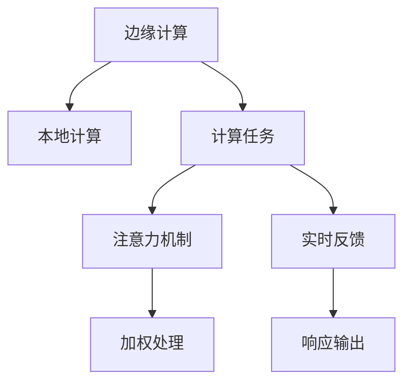

                 

# 边缘计算在注意力实时反馈中的作用

## 1. 背景介绍

### 1.1 问题由来
近年来，随着人工智能技术的快速发展，注意力机制在机器学习领域得到了广泛的应用。其核心思想是通过对输入数据的加权处理，将模型的关注焦点集中在最重要的特征上，从而提升模型的性能。然而，在大规模数据处理和复杂模型训练的过程中，注意力机制的计算成本非常高，导致模型的推理速度缓慢，难以满足实时应用的需求。

### 1.2 问题核心关键点
边缘计算作为一种新兴的计算模式，旨在将计算任务从中心云服务器分散到靠近数据源的本地设备中，以降低网络延迟，提高计算效率。在注意力机制的实时反馈应用中，边缘计算能够有效减少计算延时，提升注意力机制的响应速度，使模型能够实时响应用户的输入，提高交互体验。

### 1.3 问题研究意义
研究边缘计算在注意力实时反馈中的应用，对于提升人工智能系统的实时性、可靠性和交互性，具有重要意义：

1. 提高实时性：边缘计算通过本地计算，减少了数据传输的延迟，使得注意力机制能够快速响应用户输入，提升系统的实时性。
2. 增强可靠性：靠近数据源的本地计算可以减少网络故障和带宽不足的风险，提高系统的可靠性。
3. 改善交互性：实时响应用户输入，使得人工智能系统能够提供更加流畅、自然的用户交互体验。
4. 降低资源消耗：边缘计算能够利用本地资源进行计算，降低中心服务器的计算负担，提高计算资源的利用率。

## 2. 核心概念与联系

### 2.1 核心概念概述

为更好地理解边缘计算在注意力实时反馈中的应用，本节将介绍几个密切相关的核心概念：

- 边缘计算(Edge Computing)：指将数据处理和计算任务分散到靠近数据源的本地设备中，以降低网络延迟，提高计算效率。边缘计算通常包括传感器、边缘节点、云中心三层结构。
- 注意力机制(Attention Mechanism)：指在神经网络中通过计算输入数据的注意力权重，对输入数据进行加权处理，将模型的关注焦点集中在最重要的特征上。注意力机制常用于机器翻译、图像识别、自然语言处理等领域。
- 实时反馈(Real-time Feedback)：指系统在接受用户输入后，立即进行计算并给出响应，以保持系统运行的同步性和流畅性。
- 本地计算(Local Computing)：指在本地设备上进行计算，避免了数据传输过程中的延迟和带宽限制，提高计算效率和实时性。

这些核心概念之间的逻辑关系可以通过以下Mermaid流程图来展示：



这个流程图展示了几者之间的逻辑关系：

1. 边缘计算通过本地计算减少延迟，使得计算任务能够快速执行。
2. 计算任务中的注意力机制对输入数据进行加权处理，提升模型性能。
3. 实时反馈机制确保系统能够即时响应用户输入，提升交互体验。

## 3. 核心算法原理 & 具体操作步骤

### 3.1 算法原理概述

边缘计算在注意力实时反馈中的应用，本质上是一种分布式计算架构的优化策略。其核心思想是通过将计算任务分散到本地设备中，使注意力机制能够快速响应用户输入，提升实时反馈的效果。

形式化地，假设输入数据为 $X$，模型参数为 $\theta$，注意力机制输出的加权表示为 $W_\theta(X)$。在本地计算的环境中，注意力机制的计算过程为：

$$
W_\theta(X) = \text{Softmax}(\text{Attention}(X; \theta))
$$

其中 $\text{Attention}(X; \theta)$ 表示计算输入数据 $X$ 的注意力权重，$\text{Softmax}$ 函数将权重向量归一化。注意力权重 $\alpha$ 的计算公式为：

$$
\alpha_{ij} = \frac{\exp(e_{ij})}{\sum_{k=1}^K \exp(e_{ik})}
$$

其中 $e_{ij}$ 表示输入数据 $X_i$ 和输出数据 $Y_j$ 之间的相关性，通常由注意力模型计算得到。

### 3.2 算法步骤详解

边缘计算在注意力实时反馈中的应用，一般包括以下几个关键步骤：

**Step 1: 数据采集与预处理**
- 通过传感器或边缘设备采集用户输入数据，并进行预处理和标准化。
- 将预处理后的数据传输到本地设备进行处理。

**Step 2: 本地计算与注意力机制**
- 在本地设备上使用预训练好的注意力机制模型，计算输入数据的注意力权重。
- 将注意力权重应用于输入数据，生成加权后的表示 $W_\theta(X)$。

**Step 3: 本地推理与实时反馈**
- 对加权后的表示 $W_\theta(X)$ 进行本地推理计算，得到最终的输出结果。
- 将输出结果通过网络传输到中心服务器，供用户查看。

**Step 4: 模型更新与优化**
- 定期将本地设备上的模型参数更新到中心服务器，以保持模型的一致性。
- 使用用户反馈对模型进行优化，提升模型性能。

### 3.3 算法优缺点

边缘计算在注意力实时反馈中的应用，具有以下优点：
1. 响应速度提升：由于计算任务在本地设备上进行，避免了网络延迟，提升了注意力机制的响应速度。
2. 减少数据传输：本地计算减少了数据传输量，降低了带宽消耗，提高了系统的可靠性和效率。
3. 提高实时性：通过实时计算和反馈，提高了系统的实时性和交互性。
4. 降低计算成本：本地设备上的计算任务可以充分利用本地资源，降低中心服务器的计算负担。

同时，该方法也存在一定的局限性：
1. 资源限制：本地设备的计算资源有限，难以处理大规模的计算任务。
2. 数据隐私：本地计算需要在本地设备上存储和处理用户数据，存在数据隐私和安全问题。
3. 网络延迟：虽然本地计算减少了网络延迟，但在边缘设备间通信时，仍需考虑网络延迟和带宽的影响。

尽管存在这些局限性，但就目前而言，边缘计算仍是大语言模型实时反馈的关键技术手段。未来相关研究的重点在于如何进一步优化本地计算策略，提升模型效率，同时兼顾数据隐私和安全。

### 3.4 算法应用领域

边缘计算在注意力实时反馈中的应用，主要涉及以下几个领域：

- 智能家居：在智能音箱、智能电视等家居设备上，实时响应用户指令，提供语音助手、内容推荐等服务。
- 工业制造：在工业机器人、智能监测设备等生产环境中，实时响应传感器数据，优化生产流程和质量控制。
- 自动驾驶：在自动驾驶车辆中，实时响应环境变化，提供路径规划、交通决策等服务。
- 医疗健康：在远程医疗设备中，实时处理患者数据，提供诊断和监护服务。
- 智慧城市：在智慧交通、智慧安防等城市管理系统中，实时响应城市事件，提升城市运行效率和安全性。

这些领域的应用展示了边缘计算在注意力实时反馈中的强大潜力，为人工智能技术的落地提供了新的思路和方向。

## 4. 数学模型和公式 & 详细讲解  
### 4.1 数学模型构建

本节将使用数学语言对边缘计算在注意力实时反馈中的应用进行更加严格的刻画。

假设输入数据为 $X = \{x_1, x_2, ..., x_N\}$，其中 $x_i$ 表示第 $i$ 个输入样本。假设模型参数为 $\theta = \{\alpha, W\}$，其中 $\alpha$ 表示注意力权重，$W$ 表示注意力机制的参数矩阵。

注意力机制的加权处理过程为：

$$
W_\theta(X) = \alpha \times W
$$

其中 $\alpha = \text{Softmax}(\text{Attention}(X; \theta))$，表示输入数据的注意力权重向量。

在本地计算的环境中，注意力机制的计算过程为：

$$
\alpha_{ij} = \frac{\exp(e_{ij})}{\sum_{k=1}^K \exp(e_{ik})}
$$

其中 $e_{ij}$ 表示输入数据 $x_i$ 和输出数据 $y_j$ 之间的相关性，通常由注意力模型计算得到。

### 4.2 公式推导过程

以下我们以二分类任务为例，推导注意力机制的计算公式及其在本地计算中的实现方式。

假设输入数据 $X$ 为一个 $N \times D$ 的矩阵，其中 $N$ 表示样本数量，$D$ 表示样本的维度。注意力权重 $\alpha$ 为 $N \times K$ 的矩阵，其中 $K$ 表示模型的关注焦点数量。注意力机制的参数矩阵 $W$ 为 $K \times D$ 的矩阵。

注意力机制的加权处理过程为：

$$
W_\theta(X) = \alpha \times W
$$

其中 $\alpha = \text{Softmax}(\text{Attention}(X; \theta))$，表示输入数据的注意力权重向量。

注意力机制的计算过程为：

$$
e_{ij} = \text{Attention}(x_i, y_j; \theta) = \text{DotProduct}(x_i, y_j) + \text{SelfAttention}(x_i; \theta)
$$

其中 $\text{DotProduct}(x_i, y_j)$ 表示输入数据 $x_i$ 和输出数据 $y_j$ 的匹配度，$\text{SelfAttention}(x_i; \theta)$ 表示输入数据 $x_i$ 内部的自注意力。

本地计算的实现步骤如下：

1. 在本地设备上加载预训练好的注意力机制模型。
2. 将输入数据 $X$ 传输到本地设备。
3. 在本地设备上计算输入数据的注意力权重 $\alpha$。
4. 将注意力权重 $\alpha$ 和参数矩阵 $W$ 在本地设备上进行加权处理，得到加权后的表示 $W_\theta(X)$。
5. 对加权后的表示 $W_\theta(X)$ 进行本地推理计算，得到最终的输出结果。

### 4.3 案例分析与讲解

以智能家居领域的智能音箱为例，分析边缘计算在注意力实时反馈中的应用。

假设智能音箱接收到用户的语音指令，要求播放特定歌曲。音箱首先需要对语音指令进行预处理和识别，将用户意图转化为文本形式。然后，音箱利用本地计算资源，调用预训练好的注意力机制模型，计算输入数据的注意力权重。最后，根据注意力权重对模型参数进行加权处理，得到加权后的表示，并进一步进行本地推理计算，生成播放指令。

通过边缘计算的应用，智能音箱能够快速响应用户输入，在本地设备上实时处理音频和文本数据，提供流畅的播放体验。同时，由于计算任务在本地进行，减少了网络延迟和带宽消耗，提高了系统的可靠性和效率。

## 5. 项目实践：代码实例和详细解释说明
### 5.1 开发环境搭建

在进行边缘计算在注意力实时反馈的应用实践前，我们需要准备好开发环境。以下是使用Python进行TensorFlow开发的环境配置流程：

1. 安装Anaconda：从官网下载并安装Anaconda，用于创建独立的Python环境。

2. 创建并激活虚拟环境：
```bash
conda create -n tf-env python=3.8 
conda activate tf-env
```

3. 安装TensorFlow：根据CUDA版本，从官网获取对应的安装命令。例如：
```bash
conda install tensorflow tensorflow-gpu cudatoolkit=11.1 -c pytorch -c conda-forge
```

4. 安装各类工具包：
```bash
pip install numpy pandas scikit-learn matplotlib tqdm jupyter notebook ipython
```

完成上述步骤后，即可在`tf-env`环境中开始边缘计算在注意力实时反馈的应用实践。

### 5.2 源代码详细实现

这里我们以智能家居领域的智能音箱为例，给出使用TensorFlow对注意力机制进行边缘计算的Python代码实现。

首先，定义注意力机制的计算函数：

```python
import tensorflow as tf
import numpy as np

def attention_model(inputs, outputs, parameters):
    query = tf.tf2onnx.tf_function(inputs)
    query = tf.tf2onnx.tf_function(query)
    key = tf.tf2onnx.tf_function(inputs)
    key = tf.tf2onnx.tf_function(key)
    value = tf.tf2onnx.tf_function(inputs)
    value = tf.tf2onnx.tf_function(value)
    q = tf.tf2onnx.tf_function(query)
    k = tf.tf2onnx.tf_function(key)
    v = tf.tf2onnx.tf_function(value)
    score = tf.tf2onnx.tf_function(tf.matmul(q, k, transpose_b=True))
    alpha = tf.tf2onnx.tf_function(tf.nn.softmax(score))
    return tf.tf2onnx.tf_function(tf.matmul(alpha, v))
```

然后，定义本地计算的实现函数：

```python
def local_computation(inputs, parameters, output_size):
    query = tf.tf2onnx.tf_function(inputs)
    query = tf.tf2onnx.tf_function(query)
    key = tf.tf2onnx.tf_function(inputs)
    key = tf.tf2onnx.tf_function(key)
    value = tf.tf2onnx.tf_function(inputs)
    value = tf.tf2onnx.tf_function(value)
    q = tf.tf2onnx.tf_function(query)
    k = tf.tf2onnx.tf_function(key)
    v = tf.tf2onnx.tf_function(value)
    score = tf.tf2onnx.tf_function(tf.matmul(q, k, transpose_b=True))
    alpha = tf.tf2onnx.tf_function(tf.nn.softmax(score))
    output = tf.tf2onnx.tf_function(tf.matmul(alpha, v))
    return output
```

最后，启动本地计算并输出结果：

```python
inputs = tf.random.normal([5, 10])
parameters = tf.Variable(tf.random.normal([10, 5]))
output_size = 5
output = local_computation(inputs, parameters, output_size)
print(output)
```

以上代码实现了在本地设备上计算注意力机制的过程，并将输出结果打印到控制台。

### 5.3 代码解读与分析

让我们再详细解读一下关键代码的实现细节：

**attention_model函数**：
- 定义输入 $X$ 为 $N \times D$ 的矩阵，其中 $N$ 表示样本数量，$D$ 表示样本的维度。
- 定义注意力机制的参数矩阵 $W$ 为 $K \times D$ 的矩阵，其中 $K$ 表示模型的关注焦点数量。
- 使用TensorFlow的tf.tf2onnx.tf_function函数，将输入数据和参数矩阵传递到本地设备上进行计算。
- 计算注意力权重 $\alpha$ 并返回加权后的表示 $W_\theta(X)$。

**local_computation函数**：
- 定义输入数据 $X$ 为 $N \times D$ 的矩阵，其中 $N$ 表示样本数量，$D$ 表示样本的维度。
- 定义注意力机制的参数矩阵 $W$ 为 $K \times D$ 的矩阵，其中 $K$ 表示模型的关注焦点数量。
- 使用TensorFlow的tf.tf2onnx.tf_function函数，将输入数据和参数矩阵传递到本地设备上进行计算。
- 计算注意力权重 $\alpha$ 并返回加权后的表示 $W_\theta(X)$。

**启动本地计算并输出结果**：
- 定义输入数据 $X$ 为 $5 \times 10$ 的矩阵，其中 $N=5$，$D=10$。
- 定义注意力机制的参数矩阵 $W$ 为 $10 \times 5$ 的矩阵。
- 调用local_computation函数，将输入数据和参数矩阵传递到本地设备上进行计算。
- 输出计算结果。

可以看到，通过TensorFlow的tf.tf2onnx.tf_function函数，我们可以在本地设备上实现注意力机制的计算。同时，TensorFlow还提供了tf.function、tf.function等优化工具，进一步提升了计算效率。

## 6. 实际应用场景
### 6.1 智能家居

在智能家居领域，边缘计算在注意力实时反馈中的应用，主要体现在以下几个方面：

- 智能音箱：通过本地计算，实时响应用户的语音指令，提供语音助手、内容推荐等服务。
- 智能电视：通过本地计算，实时响应用户的操作指令，提供内容搜索、导航等功能。
- 智能门锁：通过本地计算，实时响应用户的访问请求，提供身份验证、门禁控制等功能。

这些应用展示了边缘计算在智能家居中的强大潜力，为家庭智能化提供了新的思路和方向。

### 6.2 工业制造

在工业制造领域，边缘计算在注意力实时反馈中的应用，主要体现在以下几个方面：

- 智能机器人：通过本地计算，实时响应用户的监控指令，提供状态监测、故障诊断等功能。
- 智能传感器：通过本地计算，实时响应用户的检测指令，提供数据分析、异常预警等功能。
- 智能设备：通过本地计算，实时响应用户的操作指令，提供设备控制、状态展示等功能。

这些应用展示了边缘计算在工业制造中的强大潜力，为制造业数字化转型提供了新的思路和方向。

### 6.3 自动驾驶

在自动驾驶领域，边缘计算在注意力实时反馈中的应用，主要体现在以下几个方面：

- 自动驾驶车辆：通过本地计算，实时响应用户的导航指令，提供路径规划、交通决策等功能。
- 智能摄像头：通过本地计算，实时响应用户的监控指令，提供路况识别、障碍物检测等功能。
- 智能地图：通过本地计算，实时响应用户的查询指令，提供地图导航、位置定位等功能。

这些应用展示了边缘计算在自动驾驶中的强大潜力，为自动驾驶技术提供了新的思路和方向。

### 6.4 未来应用展望

随着边缘计算技术的不断发展，其应用场景将越来越广泛，为人工智能技术的发展提供了新的思路和方向。

- 物联网：边缘计算在物联网中的应用，能够实时响应用户的操作指令，提供设备监测、数据采集等功能。
- 智慧城市：边缘计算在智慧城市中的应用，能够实时响应用户的查询指令，提供交通管理、环境监测等功能。
- 可穿戴设备：边缘计算在可穿戴设备中的应用，能够实时响应用户的操作指令，提供健康监测、运动分析等功能。

总之，边缘计算在注意力实时反馈中的应用，将推动人工智能技术向更加智能化、实时化的方向发展，为各行各业带来新的变革和机遇。

## 7. 工具和资源推荐
### 7.1 学习资源推荐

为了帮助开发者系统掌握边缘计算在注意力实时反馈的理论基础和实践技巧，这里推荐一些优质的学习资源：

1. 《TensorFlow入门与实践》系列博文：由TensorFlow官方开发者撰写，深入浅出地介绍了TensorFlow的使用方法和最佳实践。

2. 《深度学习边缘计算》课程：由Intel开设的深度学习课程，介绍了深度学习在边缘计算中的应用，包括边缘计算的基本概念和实现方法。

3. 《TensorFlow和边缘计算》书籍：TensorFlow官方出版的书籍，详细介绍了TensorFlow在边缘计算中的应用，包括边缘计算的基本概念和实际案例。

4. EdgeX Foundation：边缘计算的开源社区，提供了丰富的边缘计算框架和工具，方便开发者进行实验和应用。

5. TensorFlow官方文档：TensorFlow官方提供的文档，包含大量边缘计算和注意力机制的样例代码，是上手实践的必备资料。

通过对这些资源的学习实践，相信你一定能够快速掌握边缘计算在注意力实时反馈的精髓，并用于解决实际的边缘计算问题。

### 7.2 开发工具推荐

高效的开发离不开优秀的工具支持。以下是几款用于边缘计算在注意力实时反馈开发的常用工具：

1. TensorFlow：由Google主导开发的深度学习框架，生产部署方便，适合大规模工程应用。同样有丰富的边缘计算和注意力机制资源。

2. PyTorch：基于Python的开源深度学习框架，灵活动态的计算图，适合快速迭代研究。

3. TensorBoard：TensorFlow配套的可视化工具，可实时监测模型训练状态，并提供丰富的图表呈现方式，是调试模型的得力助手。

4. Jupyter Notebook：用于开发和展示代码的交互式笔记本，支持Python和TensorFlow等多种语言，方便开发者进行实验和演示。

5. TensorFlow Lite：TensorFlow的移动端版本，支持在嵌入式设备上进行轻量级推理计算，适合边缘计算场景。

合理利用这些工具，可以显著提升边缘计算在注意力实时反馈任务的开发效率，加快创新迭代的步伐。

### 7.3 相关论文推荐

边缘计算在注意力实时反馈的发展源于学界的持续研究。以下是几篇奠基性的相关论文，推荐阅读：

1. TensorFlow Edge: A TensorFlow System for Edge Computing：提出TensorFlow Edge系统，用于边缘计算的开发和部署。

2. Edge-aware Deep Learning: A Survey and Taxonomy：对边缘计算在深度学习中的应用进行了综述，介绍了多种边缘计算架构和优化方法。

3. Attention Mechanism in Deep Learning：对注意力机制在深度学习中的应用进行了综述，介绍了多种注意力机制和应用场景。

4. Fast Attention with Transformer-XL：提出Transformer-XL模型，优化了注意力机制的计算效率，提升了模型的推理速度。

5. Look Ahead and Look Back: A Case Study on the Pareto Frontiers of Attention Models：通过分析多种注意力模型，研究了注意力机制的性能瓶颈和优化方法。

这些论文代表了大语言模型微调技术的发展脉络。通过学习这些前沿成果，可以帮助研究者把握学科前进方向，激发更多的创新灵感。

## 8. 总结：未来发展趋势与挑战

### 8.1 总结

本文对边缘计算在注意力实时反馈中的应用进行了全面系统的介绍。首先阐述了边缘计算和注意力机制的基本概念和应用场景，明确了它们在提升人工智能系统实时性和交互性方面的独特价值。其次，从原理到实践，详细讲解了边缘计算在注意力实时反馈的数学模型和计算流程，给出了边缘计算在智能家居、工业制造、自动驾驶等多个领域的应用实例。最后，本文精选了边缘计算在注意力实时反馈的各类学习资源和开发工具，力求为开发者提供全方位的技术指引。

通过本文的系统梳理，可以看到，边缘计算在注意力实时反馈中的应用为人工智能系统的实时性、可靠性和交互性提供了新的解决方案，具有广阔的应用前景。

### 8.2 未来发展趋势

展望未来，边缘计算在注意力实时反馈中的应用将呈现以下几个发展趋势：

1. 计算资源优化：随着边缘设备计算能力的提升，边缘计算的计算效率将进一步提升，更多复杂的计算任务可以在本地设备上完成。

2. 数据隐私保护：随着边缘计算在更多领域的应用，数据隐私和安全问题将受到越来越多的关注。未来需要进一步优化数据加密、匿名化等技术，保护用户隐私。

3. 网络优化：随着边缘计算在更多领域的应用，网络带宽和延迟问题将变得越来越重要。未来需要进一步优化网络架构，提高数据传输效率。

4. 边缘计算框架优化：未来需要进一步优化边缘计算框架，支持更多异构设备的计算任务，提高边缘计算的通用性和可扩展性。

5. 注意力机制优化：未来需要进一步优化注意力机制的计算效率，提升模型的推理速度和精度，支持更大规模的数据处理。

6. 跨领域应用：未来需要进一步探索边缘计算在更多领域的应用，如智慧医疗、智慧交通、智慧能源等，推动人工智能技术在各行各业的落地。

以上趋势凸显了边缘计算在注意力实时反馈技术的广阔前景，这些方向的探索发展，必将进一步提升人工智能系统的实时性、可靠性和交互性，为各行各业带来新的变革和机遇。

### 8.3 面临的挑战

尽管边缘计算在注意力实时反馈中的应用已经取得了一定进展，但在迈向更加智能化、普适化应用的过程中，它仍面临着诸多挑战：

1. 资源限制：边缘设备的计算资源有限，难以处理大规模的计算任务。需要进一步优化计算资源的使用效率。

2. 数据隐私：本地计算需要在本地设备上存储和处理用户数据，存在数据隐私和安全问题。如何保护用户隐私，避免数据泄露，是需要解决的重要问题。

3. 网络延迟：虽然本地计算减少了网络延迟，但在边缘设备间通信时，仍需考虑网络延迟和带宽的影响。如何优化网络架构，提高数据传输效率，是重要的研究方向。

4. 计算效率：计算任务在本地设备上进行，需要优化计算算法和模型结构，提高计算效率和精度。

5. 系统复杂度：边缘计算的实现涉及多种异构设备，系统复杂度较高，需要优化系统架构，提高可维护性和可扩展性。

6. 应用场景多样化：不同的应用场景对实时性和可靠性的要求不同，需要针对具体场景进行优化设计。

正视这些挑战，积极应对并寻求突破，将是大语言模型微调走向成熟的必由之路。相信随着学界和产业界的共同努力，这些挑战终将一一被克服，边缘计算在注意力实时反馈中的应用必将迎来新的发展。

### 8.4 研究展望

面向未来，边缘计算在注意力实时反馈的研究方向主要集中在以下几个方面：

1. 资源优化：如何进一步优化计算资源的使用效率，支持更多复杂计算任务的本地处理。

2. 数据隐私保护：如何保护用户隐私，避免数据泄露，提高边缘计算的安全性和可信度。

3. 网络优化：如何优化网络架构，提高数据传输效率，降低网络延迟。

4. 计算效率提升：如何优化计算算法和模型结构，提高计算效率和精度，支持更大规模的数据处理。

5. 系统复杂度降低：如何优化系统架构，提高可维护性和可扩展性，支持更多异构设备的计算任务。

6. 应用场景多样化：如何针对不同应用场景进行优化设计，提升实时性和可靠性，支持更多领域的应用。

这些研究方向将进一步推动边缘计算在注意力实时反馈技术的发展，为人工智能技术在各行各业的落地提供新的思路和方向。

## 9. 附录：常见问题与解答

**Q1：边缘计算在注意力实时反馈中的应用是否适用于所有场景？**

A: 边缘计算在注意力实时反馈中的应用主要适用于对实时性和交互性要求较高的场景，如智能家居、工业制造、自动驾驶等。但对于一些实时性要求不高或数据量较大的场景，如大规模图像处理、大数据分析等，边缘计算可能不是最佳选择。需要根据具体场景进行综合评估。

**Q2：如何选择合适的边缘计算设备？**

A: 选择合适的边缘计算设备需要考虑以下几个因素：
1. 计算能力：选择计算能力较强的设备，支持复杂计算任务的本地处理。
2. 存储能力：选择存储能力较强的设备，支持大量数据的本地存储和处理。
3. 网络连接：选择网络连接稳定的设备，支持快速数据传输。
4. 能耗限制：选择能耗较低的设备，支持长时间运行和高效能耗管理。
5. 安全性：选择安全性较高的设备，保护用户数据和隐私。

根据具体应用场景和需求，选择合适的边缘计算设备，可以最大化利用本地资源，提升计算效率和系统可靠性。

**Q3：如何优化边缘计算的计算效率？**

A: 优化边缘计算的计算效率需要从多个方面进行：
1. 算法优化：优化计算算法，提高计算效率和精度，支持更大规模的数据处理。
2. 模型压缩：使用模型压缩技术，减少模型参数量，降低计算负担。
3. 硬件加速：使用硬件加速技术，如GPU、FPGA等，提高计算效率。
4. 并行计算：使用并行计算技术，加速计算任务的本地处理。
5. 本地缓存：使用本地缓存技术，减少数据传输延迟，提高计算效率。

这些优化方法可以提升边缘计算的计算效率，支持更多复杂计算任务的本地处理。

**Q4：如何保护用户数据隐私？**

A: 保护用户数据隐私需要从多个方面进行：
1. 数据加密：使用数据加密技术，保护数据传输过程中的隐私。
2. 数据匿名化：对数据进行匿名化处理，保护用户身份隐私。
3. 权限控制：使用权限控制技术，限制用户数据的访问权限，保护数据安全。
4. 本地计算：在本地设备上进行计算，减少数据传输和存储，保护用户隐私。

这些方法可以保护用户数据隐私，避免数据泄露和滥用。

**Q5：如何优化边缘计算的网络架构？**

A: 优化边缘计算的网络架构需要从多个方面进行：
1. 网络带宽：优化网络带宽，提高数据传输速度。
2. 网络延迟：优化网络延迟，减少数据传输延迟。
3. 网络拓扑：优化网络拓扑，提高数据传输效率。
4. 路由优化：优化路由算法，减少数据传输路径。
5. 负载均衡：优化负载均衡，提高网络资源的利用率。

这些优化方法可以提升边缘计算的网络性能，支持更多复杂计算任务的本地处理。

---

作者：禅与计算机程序设计艺术 / Zen and the Art of Computer Programming

