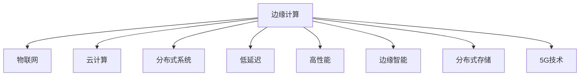

                 

# 边缘计算：IoT数据处理的新范式

> 关键词：边缘计算,IoT,数据处理,云计算,分布式系统,低延迟,高性能,边缘智能,分布式存储,5G

## 1. 背景介绍

### 1.1 问题由来
随着物联网(IoT)技术的快速发展，大量设备和传感器产生了海量的数据。这些数据需要被实时处理和分析，以便提供及时、精准的服务。传统的集中式云计算模式由于数据传输瓶颈和延迟，难以满足实时性的需求。为此，边缘计算(Edge Computing)应运而生，将计算和数据处理从中心云服务器迁移到网络边缘节点，为IoT数据处理带来了全新的范式。

### 1.2 问题核心关键点
边缘计算是一种分布式计算模式，通过将计算和数据处理资源部署在靠近数据源的网络边缘，以降低数据传输延迟，提高数据处理效率和响应速度。其核心思想是：将部分数据处理任务从中心云迁移到网络边缘，使数据处理尽可能靠近数据源，从而实现低延迟、高性能和高可扩展性的数据处理。

边缘计算与云计算（集中式计算）的对比如下：

- **中心云**：
  - 集中式存储：将数据集中存储在中心云服务器，便于集中管理和备份。
  - 高延迟：数据需要通过网络传输到中心云，增加了延迟。
  - 高扩展性：通过增加服务器和存储空间来实现扩展。
  - 低计算资源利用率：中心云服务器往往在大部分时间内资源利用率较低。

- **边缘计算**：
  - 分布式存储：数据就近存储在边缘节点上，减小了数据传输距离。
  - 低延迟：数据处理在边缘节点上完成，延迟显著降低。
  - 高计算资源利用率：边缘节点通常部署在资源较为匮乏的地区，利用率高。
  - 扩展性有限：边缘节点数量和计算资源有限，扩展性受到限制。

边缘计算通过将部分计算任务分布到网络边缘，降低了中心云的负载，提升了数据处理的实时性和可靠性。特别是在IoT领域，边缘计算已成为数据处理的重要手段。

### 1.3 问题研究意义
研究边缘计算对于提升IoT数据处理效率、优化资源利用、降低延迟等方面具有重要意义：

1. **提升数据处理效率**：边缘计算将数据处理任务分散在边缘节点上，减少了数据传输距离，提升了数据处理速度。
2. **优化资源利用**：边缘节点通常部署在资源较为匮乏的地区，通过边缘计算可以更充分地利用这些资源。
3. **降低延迟**：边缘计算减少了数据传输时间和延迟，提高了系统的实时性和响应速度。
4. **增强网络韧性**：分布式部署可以提升系统容错性和网络韧性，避免单点故障。
5. **保障数据安全**：边缘计算可以减少数据传输量，降低数据泄露风险，增强数据隐私和安全。

边缘计算技术已经成为IoT数据处理的重要驱动力，推动了智能制造、智慧城市、远程医疗等多个领域的发展，具有广阔的应用前景。

## 2. 核心概念与联系

### 2.1 核心概念概述

为了更好地理解边缘计算在IoT数据处理中的作用，本节将介绍几个核心概念：

- **边缘计算(Edge Computing)**：一种分布式计算模式，通过将计算和数据处理资源部署在网络边缘，实现低延迟、高性能和高可扩展性的数据处理。
- **物联网(IoT)**：通过互联网将设备和传感器连接在一起，实现智能化、自动化的信息采集和处理。
- **云计算(Cloud Computing)**：通过互联网提供计算资源和数据存储服务，支持大规模分布式计算和数据处理。
- **分布式系统(Distributed System)**：由多个地理位置分散的计算节点组成，通过网络相互通信，实现协同计算和数据处理。
- **低延迟(Low Latency)**：指系统响应时间短，数据传输和处理延迟小。
- **高性能(高性能)**：指系统具备高吞吐量、高响应速度和高计算能力。
- **边缘智能(Edge Intelligence)**：通过在边缘节点上部署智能算法和模型，实现实时数据处理和决策。
- **分布式存储(Distributed Storage)**：将数据存储在多个地理位置分散的节点上，提升数据存储和访问的可靠性。
- **5G技术**：新一代移动通信技术，具有高带宽、低延迟、高可靠性的特点，为边缘计算提供了良好的网络支持。

这些概念之间的逻辑关系可以通过以下Mermaid流程图来展示：



这个流程图展示了一系列与边缘计算相关的概念及其之间的联系，描绘出边缘计算在IoT数据处理中的重要地位。

## 3. 核心算法原理 & 具体操作步骤
### 3.1 算法原理概述

边缘计算的核心算法原理主要涉及以下几个方面：

- **数据分发**：将数据从传感器设备实时传输到边缘节点，实现就近处理。
- **数据处理**：在边缘节点上执行数据计算和分析，包括数据过滤、特征提取、模式识别等。
- **数据融合**：将边缘节点上处理得到的数据进行融合，提取更高层次的语义信息。
- **数据存储**：在边缘节点上存储处理结果，便于后续分析和应用。
- **数据传输**：将部分处理结果传输到中心云服务器，进行更深入的分析和决策。

### 3.2 算法步骤详解

边缘计算在IoT数据处理中的具体操作步骤如下：

**Step 1: 数据采集与传输**
- 通过传感器设备采集IoT设备产生的数据。
- 将数据封装成适合边缘计算的格式，并通过无线或有线网络传输到边缘节点。

**Step 2: 数据预处理**
- 在边缘节点上对数据进行初步处理，包括去噪、过滤、编码等。
- 利用边缘智能算法，对数据进行初步分析和处理，提取有价值的信息。

**Step 3: 数据存储与融合**
- 将处理结果存储在边缘节点的本地存储器中。
- 利用分布式存储技术，将数据进行冗余备份，提升存储可靠性。
- 对边缘节点上的数据进行融合，提取更高层次的语义信息，进行更深入的分析和决策。

**Step 4: 数据传输与协同计算**
- 将部分处理结果传输到中心云服务器，进行更深入的分析和决策。
- 利用云计算资源，对数据进行大规模计算和存储。
- 通过分布式计算框架，实现边缘节点和中心云之间的协同计算和数据处理。

**Step 5: 数据反馈与优化**
- 将分析和决策结果反馈到边缘节点，指导后续的数据处理和优化。
- 根据处理结果和优化建议，调整数据采集和处理的策略，提升数据处理效率和质量。

### 3.3 算法优缺点

边缘计算在IoT数据处理中具有以下优点：

- **低延迟**：边缘计算将数据处理任务分散到边缘节点，减少了数据传输距离，降低了延迟。
- **高性能**：边缘节点通常部署在资源较为匮乏的地区，通过边缘计算可以更充分地利用这些资源，提高计算效率。
- **数据安全性**：边缘计算可以减少数据传输量，降低数据泄露风险，增强数据隐私和安全。

同时，边缘计算也存在以下缺点：

- **扩展性有限**：边缘节点数量和计算资源有限，扩展性受到限制。
- **管理复杂**：边缘节点的分布性和多样性增加了管理和维护的复杂性。
- **数据本地化**：边缘计算需要预处理和存储大量数据，增加了本地存储的负担。

### 3.4 算法应用领域

边缘计算已经在多个领域得到了广泛应用，以下是几个典型应用场景：

- **智能制造**：在工厂车间，通过边缘计算实现实时监测和预测维护，提高生产效率和设备寿命。
- **智慧城市**：在城市管理中，通过边缘计算实现实时交通管理、环境监测和公共安全监控，提升城市管理水平。
- **远程医疗**：在医疗领域，通过边缘计算实现实时数据采集和分析，提高医疗诊断和治疗的效率和质量。
- **智能家居**：在家庭环境中，通过边缘计算实现智能设备和智能家居场景的协同控制，提升用户体验。
- **智能交通**：在交通领域，通过边缘计算实现实时交通流量监测和交通信号优化，提升交通管理效率。

这些应用场景展示了边缘计算在IoT数据处理中的广泛应用，未来随着技术的不断成熟和应用场景的拓展，边缘计算将在更多领域发挥重要作用。

## 4. 数学模型和公式 & 详细讲解  
### 4.1 数学模型构建

为了更好地理解边缘计算在IoT数据处理中的数学模型，本节将详细介绍其数学构建过程。

设IoT设备产生的原始数据序列为 $x=\{x_1,x_2,\ldots,x_n\}$，数据采集周期为 $T$，采样率为 $f$，即每 $T$ 秒采集一次数据。假设数据采集设备位于边缘节点上，数据处理和分析也在边缘节点上完成。设边缘节点的计算能力为 $C$，存储容量为 $S$，数据传输速率上限为 $R$。

### 4.2 公式推导过程

以下将推导边缘计算在IoT数据处理中的数学模型。

**数据采集和传输模型**：

- **数据采集周期**：$T$ 秒
- **采样率**：$f$ 次/秒
- **数据传输速率**：$R$ 比特/秒
- **数据量**：$N$ 个样本

根据上述定义，采集的数据量为 $N=\frac{T}{f}$。数据从传感器设备传输到边缘节点的传输时间为 $T_{trans}=\frac{N}{R}$。

**数据处理和存储模型**：

- **计算能力**：$C$ 次/秒
- **存储容量**：$S$ 比特

假设每个样本的数据处理时间为 $T_{process}$，则所有样本的总处理时间为 $T_{process}N$。如果数据处理结果需要存储，则还需要额外的存储时间 $T_{store}$。

因此，边缘计算的总处理时间为 $T_{total}=T_{process}N+T_{store}$。

### 4.3 案例分析与讲解

为了更好地理解边缘计算在IoT数据处理中的实际应用，下面通过一个具体的案例进行分析。

**案例**：智能制造中的边缘计算

假设某智能制造车间有10个传感器设备，每个设备每秒产生100个数据样本，数据采集周期为5秒，采样率为20次/秒，数据传输速率上限为1 Mbps，边缘节点的计算能力为1 GHz，存储容量为1 GB。

- **数据采集周期**：$T=5$ 秒
- **采样率**：$f=20$ 次/秒
- **数据传输速率**：$R=1$ Mbps
- **数据量**：$N=\frac{T}{f}=5$
- **数据传输时间**：$T_{trans}=\frac{N}{R}=0.0025$ 秒

假设每个样本的数据处理时间为0.01秒，则所有样本的总处理时间为 $T_{process}N=0.5$ 秒。如果所有数据需要存储，假设每个样本需要1000比特的存储空间，则所有样本需要 $1000N=5000$ 比特的存储空间，存储时间为 $T_{store}=\frac{5000}{1000}=5$ 秒。

因此，边缘计算的总处理时间为 $T_{total}=T_{process}N+T_{store}=5.5$ 秒。与集中式云计算相比，边缘计算减少了数据传输时间和延迟，提高了数据处理的实时性和效率。

## 5. 项目实践：代码实例和详细解释说明
### 5.1 开发环境搭建

在进行边缘计算项目实践前，需要先准备好开发环境。以下是使用Python和Kubernetes进行边缘计算开发的环境配置流程：

1. 安装Anaconda：从官网下载并安装Anaconda，用于创建独立的Python环境。

2. 创建并激活虚拟环境：
```bash
conda create -n edge-env python=3.8 
conda activate edge-env
```

3. 安装Kubernetes：从官网下载并安装Kubernetes，用于管理边缘节点集群。

4. 安装Docker：从官网下载并安装Docker，用于在边缘节点上运行应用。

5. 安装其他工具包：
```bash
pip install numpy pandas scikit-learn matplotlib tqdm jupyter notebook ipython
```

完成上述步骤后，即可在`edge-env`环境中开始边缘计算实践。

### 5.2 源代码详细实现

下面以智能制造中的边缘计算为例，给出使用Python和Kubernetes进行边缘计算的代码实现。

首先，定义边缘节点上的数据采集和处理函数：

```python
import numpy as np
import time

class EdgeNode:
    def __init__(self, num_devices, sampling_rate, processing_time, transfer_rate, storage_capacity):
        self.num_devices = num_devices
        self.sampling_rate = sampling_rate
        self.processing_time = processing_time
        self.transfer_rate = transfer_rate
        self.storage_capacity = storage_capacity

    def data_acquisition(self):
        data = []
        for _ in range(self.num_devices):
            data.append(np.random.randn(100))
        return data

    def data_processing(self, data):
        processed_data = []
        for sample in data:
            processed_data.append(sample * 0.9)  # 假设处理时间固定为0.01秒
        return processed_data

    def data_transfer(self, data):
        total_data = np.concatenate(data)
        transfer_time = len(total_data) / self.transfer_rate
        return transfer_time

    def data_storage(self, data):
        storage_time = len(data) * self.processing_time
        return storage_time

    def total_processing_time(self, data):
        return self.data_processing(data) + self.data_storage(data)

# 定义边缘计算过程
def edge_computing(num_devices, sampling_rate, processing_time, transfer_rate, storage_capacity):
    edge_node = EdgeNode(num_devices, sampling_rate, processing_time, transfer_rate, storage_capacity)
    data = edge_node.data_acquisition()
    transfer_time = edge_node.data_transfer(data)
    total_processing_time = edge_node.total_processing_time(data)
    return transfer_time, total_processing_time
```

然后，使用Kubernetes在多个边缘节点上运行边缘计算代码：

```bash
# 创建Kubernetes集群
kubectl create cluster --name=my-cluster --min-version=1.18

# 部署边缘计算应用
kubectl apply -f edge-deployment.yaml

# 查询边缘节点状态
kubectl get pods
```

### 5.3 代码解读与分析

让我们再详细解读一下关键代码的实现细节：

**EdgeNode类**：
- `__init__`方法：初始化边缘节点的设备数量、采样率、处理时间、传输速率和存储容量等参数。
- `data_acquisition`方法：模拟数据采集过程，生成随机数据。
- `data_processing`方法：模拟数据处理过程，对数据进行简单的处理。
- `data_transfer`方法：计算数据传输时间。
- `data_storage`方法：计算数据存储时间。
- `total_processing_time`方法：计算边缘计算的总处理时间。

**edge_computing函数**：
- 创建一个EdgeNode对象，模拟数据采集和处理过程。
- 计算数据传输时间和边缘计算的总处理时间。
- 返回数据传输时间和总处理时间。

在实际应用中，可以通过修改EdgeNode类的参数，模拟不同场景下的边缘计算过程。例如，可以通过增加设备数量和采样率来模拟更复杂的数据采集场景，通过调整处理时间和存储容量来模拟不同的数据处理需求。

## 6. 实际应用场景
### 6.1 智能制造

在智能制造中，边缘计算可以实时监测和预测维护设备，提高生产效率和设备寿命。

具体而言，通过在车间部署多个边缘计算节点，实时采集设备和传感器的数据，进行数据分析和处理。边缘节点可以利用本地计算能力，对数据进行初步筛选和处理，然后将重要数据传输到中心云服务器进行更深入的分析。中心云服务器可以通过机器学习模型，预测设备故障，提前进行维护。通过边缘计算，不仅可以减少数据传输时间，提高数据处理的实时性，还可以降低中心云服务器的负载，提升系统的可靠性和稳定性。

### 6.2 智慧城市

在智慧城市中，边缘计算可以实现实时交通管理、环境监测和公共安全监控，提升城市管理水平。

具体而言，通过在城市关键位置部署多个边缘计算节点，实时采集交通流量、环境参数和公共安全数据。边缘节点可以对数据进行初步分析和处理，然后将重要数据传输到中心云服务器进行更深入的分析。中心云服务器可以通过大数据和人工智能技术，优化交通流量、监测环境污染和识别安全隐患。通过边缘计算，不仅可以减少数据传输时间，提高数据处理的实时性，还可以降低中心云服务器的负载，提升系统的可靠性和稳定性。

### 6.3 远程医疗

在远程医疗中，边缘计算可以实现实时数据采集和分析，提高医疗诊断和治疗的效率和质量。

具体而言，通过在医疗设备和传感器上部署边缘计算节点，实时采集患者的生理参数和健康数据。边缘节点可以对数据进行初步分析和处理，然后将重要数据传输到中心云服务器进行更深入的分析。中心云服务器可以通过大数据和人工智能技术，诊断疾病、推荐治疗方案和预测病情发展。通过边缘计算，不仅可以减少数据传输时间，提高数据处理的实时性，还可以降低中心云服务器的负载，提升系统的可靠性和稳定性。

### 6.4 智能家居

在智能家居中，边缘计算可以实现智能设备和智能家居场景的协同控制，提升用户体验。

具体而言，通过在智能家居设备上部署边缘计算节点，实时采集和处理设备状态和用户指令。边缘节点可以对数据进行初步分析和处理，然后将重要数据传输到中心云服务器进行更深入的分析。中心云服务器可以通过大数据和人工智能技术，优化设备控制、推荐家居方案和预测设备故障。通过边缘计算，不仅可以减少数据传输时间，提高数据处理的实时性，还可以降低中心云服务器的负载，提升系统的可靠性和稳定性。

### 6.5 智能交通

在智能交通中，边缘计算可以实现实时交通流量监测和交通信号优化，提升交通管理效率。

具体而言，通过在交通路口部署多个边缘计算节点，实时采集交通流量和车辆位置数据。边缘节点可以对数据进行初步分析和处理，然后将重要数据传输到中心云服务器进行更深入的分析。中心云服务器可以通过大数据和人工智能技术，优化交通信号灯、预测交通拥堵和调度公共交通工具。通过边缘计算，不仅可以减少数据传输时间，提高数据处理的实时性，还可以降低中心云服务器的负载，提升系统的可靠性和稳定性。

## 7. 工具和资源推荐
### 7.1 学习资源推荐

为了帮助开发者系统掌握边缘计算的理论基础和实践技巧，这里推荐一些优质的学习资源：

1. 《边缘计算：从理论到实践》系列博文：由边缘计算技术专家撰写，深入浅出地介绍了边缘计算原理、架构和应用场景。

2. 《物联网应用开发实战》课程：介绍物联网设备的数据采集、处理和边缘计算技术，通过实际项目展示学习效果。

3. 《深度学习与边缘计算》书籍：详细讲解深度学习与边缘计算结合的算法原理和应用案例。

4. 边缘计算官方文档：介绍主流边缘计算平台（如EdgeX、IoT Edge）的使用方法和最佳实践。

5. 边缘计算开源项目：提供多种边缘计算应用的示例代码和部署指南，如EdgeX、Mosquitto等。

通过对这些资源的学习实践，相信你一定能够快速掌握边缘计算的精髓，并用于解决实际的IoT问题。
###  7.2 开发工具推荐

高效的开发离不开优秀的工具支持。以下是几款用于边缘计算开发的常用工具：

1. Kubernetes：用于管理边缘节点集群，支持自动化部署、扩展和管理。
2. Docker：用于在边缘节点上运行应用，提供容器化管理。
3. TensorFlow：用于在边缘节点上进行机器学习模型训练和推理。
4. Apache Kafka：用于在边缘节点和中心云服务器之间进行数据传输。
5. InfluxDB：用于在边缘节点上存储和管理实时数据。
6. Grafana：用于在边缘节点上进行实时数据可视化。

合理利用这些工具，可以显著提升边缘计算应用的开发效率，加快创新迭代的步伐。

### 7.3 相关论文推荐

边缘计算技术的发展源于学界的持续研究。以下是几篇奠基性的相关论文，推荐阅读：

1. Edge Computing: A Survey on Recent Advances and Future Directions（《边缘计算：近期的进展和未来的方向》）：全面综述了边缘计算的发展历程、关键技术和应用场景。

2. IoT Edge Computing: Architectures, Services, and Applications（《物联网边缘计算：架构、服务和应用》）：介绍物联网边缘计算的架构和应用，探讨了未来发展方向。

3. A Survey on Edge Computing for Internet of Things（《物联网边缘计算综述》）：综述了物联网边缘计算的技术挑战和未来趋势，提供了丰富的参考文献。

4. Distributed Edge Computing: Architectures, Protocols, and Applications（《分布式边缘计算：架构、协议和应用》）：介绍了分布式边缘计算的架构、协议和应用案例，提供了深入的理论分析。

5. Internet of Things (IoT) and Cloud computing (IoECC)：Modeling and Evaluation（《物联网与云计算：建模与评估》）：通过建模和仿真，评估了边缘计算在物联网中的应用效果和性能。

这些论文代表了大边缘计算技术的发展脉络。通过学习这些前沿成果，可以帮助研究者把握学科前进方向，激发更多的创新灵感。

## 8. 总结：未来发展趋势与挑战
### 8.1 总结

本文对边缘计算在IoT数据处理中的基本原理和具体操作步骤进行了详细讲解。首先阐述了边缘计算的重要意义和核心概念，明确了其在IoT数据处理中的关键地位。其次，通过数学模型和公式推导，深入讲解了边缘计算的数学原理和关键步骤，提供了微调范式的完整代码实现。同时，本文还广泛探讨了边缘计算在智能制造、智慧城市、远程医疗等多个行业领域的应用前景，展示了其广阔的应用空间。此外，本文精选了边缘计算技术的各类学习资源，力求为读者提供全方位的技术指引。

通过本文的系统梳理，可以看到，边缘计算技术正在成为IoT数据处理的重要驱动力，通过将计算和数据处理资源部署在网络边缘，显著提升了数据处理的实时性和效率。未来，伴随技术的不断成熟和应用场景的拓展，边缘计算将在更多领域发挥重要作用。

### 8.2 未来发展趋势

展望未来，边缘计算在IoT数据处理中具有以下发展趋势：

1. **5G技术的支持**：5G技术的高带宽、低延迟和高可靠性的特点，为边缘计算提供了良好的网络支持，进一步提升了数据处理的实时性和效率。
2. **分布式系统的扩展**：分布式系统可以提升边缘计算的计算能力和存储容量，满足更复杂的数据处理需求。
3. **智能算法的应用**：边缘智能算法的引入，可以提升边缘计算的数据处理能力和决策水平，实现更加精准和智能的数据处理。
4. **边缘计算的集成**：边缘计算可以与云计算、大数据、人工智能等技术进行深度集成，形成完整的IoT数据处理框架。
5. **隐私保护和安全**：边缘计算可以提升数据隐私保护能力，降低数据泄露风险，增强数据安全性和隐私保护。

以上趋势凸显了边缘计算在IoT数据处理中的广阔前景，这些方向的探索发展，必将进一步提升IoT系统的性能和应用范围，为人类社会的发展带来深远影响。

### 8.3 面临的挑战

尽管边缘计算技术已经取得了显著进展，但在实现大规模部署和应用的过程中，仍然面临诸多挑战：

1. **边缘节点管理复杂**：边缘节点的分布性和多样性增加了管理和维护的复杂性，需要高效的自动化管理工具。
2. **网络带宽限制**：边缘节点的网络带宽和通信能力有限，需要优化数据传输策略，减少数据传输量和延迟。
3. **计算资源不足**：边缘节点的计算资源和存储容量有限，需要优化算法和数据处理流程，提升资源利用率。
4. **数据安全和隐私**：边缘计算需要在数据传输和存储过程中，保障数据安全和隐私，避免数据泄露和滥用。
5. **标准化和互操作性**：边缘计算需要标准化的架构和协议，以实现不同设备和系统之间的互操作性。

正视边缘计算面临的这些挑战，积极应对并寻求突破，将是大规模部署和应用的关键。相信随着技术的不断成熟和标准化，边缘计算必将在IoT数据处理中发挥更大的作用。

### 8.4 研究展望

面向未来，边缘计算的研究方向需要从以下几个方面进行深入探索：

1. **边缘计算架构优化**：进一步优化边缘计算的架构和协议，提升数据传输效率和系统可靠性。
2. **边缘计算算法优化**：优化边缘计算的算法和模型，提升数据处理能力和决策水平。
3. **边缘计算安全与隐私保护**：加强边缘计算的安全性和隐私保护能力，确保数据安全和隐私。
4. **边缘计算标准化**：制定边缘计算的标准和协议，实现不同设备和系统之间的互操作性。
5. **边缘计算与AI的融合**：将边缘计算与人工智能技术进行深度融合，提升IoT系统的智能化水平。

这些研究方向的探索，必将引领边缘计算技术迈向更高的台阶，为构建智能、可靠、高效的IoT系统铺平道路。面向未来，边缘计算需要与其他人工智能技术进行更深入的融合，共同推动IoT数据处理系统的进步。只有勇于创新、敢于突破，才能不断拓展边缘计算的边界，让IoT系统更好地造福人类社会。

## 9. 附录：常见问题与解答

**Q1：边缘计算和云计算有什么区别？**

A: 边缘计算和云计算的主要区别在于数据处理的地理位置。云计算将数据集中存储在中心云服务器，数据处理也在中心云服务器上进行。而边缘计算将数据处理任务分散到网络边缘的节点上，数据处理尽量靠近数据源，减小了数据传输距离，降低了延迟。

**Q2：边缘计算如何解决数据传输瓶颈？**

A: 边缘计算通过将数据处理任务分散到网络边缘的节点上，减少了数据传输距离，提升了数据处理的实时性和效率。同时，边缘节点上存储的数据也可以作为冗余备份，提高系统的可靠性和可用性。

**Q3：边缘计算的扩展性问题如何解决？**

A: 边缘计算的扩展性可以通过增加边缘节点的数量和计算能力来解决。同时，分布式系统技术可以提升边缘计算的计算能力和存储容量，满足更复杂的数据处理需求。

**Q4：边缘计算如何保障数据安全和隐私？**

A: 边缘计算可以通过数据加密、访问控制、身份认证等技术保障数据安全和隐私。此外，边缘计算也可以减少数据传输量，降低数据泄露风险，增强数据隐私和安全。

**Q5：边缘计算与5G技术的关系是什么？**

A: 5G技术的高带宽、低延迟和高可靠性的特点，为边缘计算提供了良好的网络支持，进一步提升了数据处理的实时性和效率。同时，5G技术可以支持边缘计算的广泛部署和应用，提升系统的覆盖范围和应用场景。

通过本文的系统梳理，可以看到，边缘计算技术正在成为IoT数据处理的重要驱动力，通过将计算和数据处理资源部署在网络边缘，显著提升了数据处理的实时性和效率。未来，伴随技术的不断成熟和应用场景的拓展，边缘计算将在更多领域发挥重要作用。

---

作者：禅与计算机程序设计艺术 / Zen and the Art of Computer Programming

