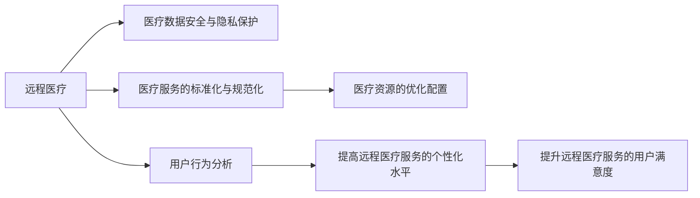

                 

# 远程医疗在注意力经济中的机遇与挑战

## 1. 背景介绍

### 1.1 问题由来
随着互联网技术的飞速发展，远程医疗已经成为现代医疗体系的重要组成部分。特别是在全球疫情肆虐的背景下，远程医疗更是成为了保障医疗服务连续性、提升医疗效率的重要手段。远程医疗利用现代通信技术，如视频会议、远程监控等手段，为患者提供了远程诊断、咨询、治疗等服务，缓解了传统医疗资源不足的问题，提升了医疗服务的覆盖范围和可及性。

然而，尽管远程医疗在技术上取得了一定的进展，但仍然面临着诸多挑战，如医疗数据的安全性、隐私保护、远程医疗服务的标准化等。此外，远程医疗的普及和发展，也带来了对医疗服务的巨大需求，使得注意力经济中的资源配置、服务质量等问题变得更为复杂。如何在这场注意力经济的大潮中，合理利用远程医疗的机遇，同时应对其带来的挑战，已经成为亟待解决的问题。

## 2. 核心概念与联系

### 2.1 核心概念概述

为了更好地理解远程医疗在注意力经济中的机遇与挑战，我们首先需要对相关核心概念进行梳理：

- **远程医疗(Remote Healthcare)**：通过互联网技术，实现患者与医疗机构之间的远程互动，包括远程咨询、远程诊断、远程手术等。
- **注意力经济(Attention Economy)**：指在信息爆炸的时代，社会资源的分配从传统的实物资源分配转向以注意力为媒介的经济模式。在注意力经济中，用户的注意力成为稀缺资源，需要有效利用。
- **医疗数据安全与隐私保护**：远程医疗涉及大量的个人健康数据，如何确保数据的安全性和隐私保护，是远程医疗发展的重要基础。
- **医疗服务的标准化与规范化**：远程医疗服务的质量如何保证，服务流程如何规范化，是确保远程医疗服务质量的关键。
- **医疗资源的优化配置**：如何在注意力经济的框架下，优化医疗资源的配置，提升远程医疗服务的可及性和效率，是远程医疗发展的方向。
- **用户行为分析**：通过对用户行为数据的分析，理解用户需求和偏好，提高远程医疗服务的个性化水平。

这些核心概念之间存在密切联系，共同构成了远程医疗在注意力经济中的研究框架。

### 2.2 核心概念原理和架构的 Mermaid 流程图



这个流程图展示了远程医疗在注意力经济中的核心概念及其相互关系。远程医疗的服务质量、资源的合理配置以及个性化水平，都依赖于医疗数据的安全与隐私保护、服务的标准化与规范化，而用户的个性化需求则可以通过用户行为分析来进一步提升。

## 3. 核心算法原理 & 具体操作步骤

### 3.1 算法原理概述

远程医疗在注意力经济中的机遇与挑战，可以借助一系列算法原理和方法进行分析和优化。核心算法原理主要包括以下几个方面：

- **机器学习与深度学习**：用于远程医疗中的疾病预测、诊断、治疗方案推荐等。
- **自然语言处理(NLP)**：用于医疗问答系统、远程咨询等场景中，解析和理解患者咨询内容。
- **计算机视觉(CV)**：用于远程监控、影像诊断等场景中，识别和分析医学影像数据。
- **数据挖掘与分析**：用于医疗数据的聚类、分类、关联分析等，发现潜在疾病模式和趋势。

这些算法原理在远程医疗中的应用，可以提升医疗服务的效率和质量，同时提高用户满意度，促进注意力经济的形成。

### 3.2 算法步骤详解

远程医疗在注意力经济中的算法实现，一般包括以下关键步骤：

**Step 1: 数据收集与预处理**
- 收集远程医疗平台上的各种数据，包括患者咨询内容、影像数据、治疗记录等。
- 对数据进行清洗和标准化处理，确保数据质量。

**Step 2: 模型训练与优化**
- 选择合适的机器学习或深度学习模型，如CNN、RNN、BERT等。
- 在清洗后的数据集上训练模型，并进行调参优化。

**Step 3: 模型评估与部署**
- 在独立的测试集上评估模型的性能，如准确率、召回率、F1-score等。
- 将优化后的模型部署到远程医疗平台上，进行实际应用。

**Step 4: 用户行为分析与反馈**
- 收集用户的反馈和行为数据，进行用户画像分析。
- 根据用户画像和行为数据，优化远程医疗服务的个性化水平。

**Step 5: 持续监控与优化**
- 持续监控远程医疗平台的服务质量，及时发现和解决潜在问题。
- 根据用户的反馈和行为数据，持续优化模型和算法，提高服务质量。

### 3.3 算法优缺点

远程医疗在注意力经济中的算法实现，具有以下优点：

- 提高医疗服务的效率和质量。通过机器学习和深度学习等算法，可以实现自动化的疾病预测、诊断和治疗方案推荐，提升远程医疗服务的效率。
- 优化医疗资源的配置。通过数据分析和聚类等算法，可以发现医疗资源的瓶颈，优化资源配置，提升远程医疗服务的覆盖范围。
- 提升用户满意度。通过个性化推荐和用户行为分析等算法，可以提供更符合用户需求的服务，提高用户满意度。

同时，该方法也存在以下局限性：

- 数据隐私和安全问题。远程医疗涉及大量的个人健康数据，数据隐私和安全问题尤为突出。
- 算法模型的解释性问题。深度学习模型的黑盒特性，使得其决策过程难以解释，增加了用户的不信任感。
- 算法的公平性和偏见问题。机器学习模型可能会继承和放大数据中的偏见，导致不公平的决策结果。

### 3.4 算法应用领域

远程医疗在注意力经济中的应用，涵盖以下多个领域：

- **疾病预测与诊断**：通过机器学习算法，预测患者可能患有的疾病，并提供诊断建议。
- **治疗方案推荐**：根据患者的具体情况，推荐最适合的治疗方案。
- **影像分析与诊断**：利用计算机视觉技术，自动分析医学影像，发现异常情况。
- **远程咨询与问答**：通过自然语言处理技术，解析和理解患者的咨询内容，提供精准的解答。
- **健康监测与管理**：通过穿戴设备收集患者健康数据，利用算法进行分析和预警。

这些应用领域为远程医疗在注意力经济中的发展提供了广阔的空间，同时也带来了更多的机遇和挑战。

## 4. 数学模型和公式 & 详细讲解 & 举例说明

### 4.1 数学模型构建

在远程医疗中，我们常常使用多种数学模型进行数据处理和分析。以下是几个常用的数学模型及其构建过程：

- **支持向量机(SVM)**：用于分类和回归问题，通过寻找最优超平面，实现数据分类和回归预测。
- **随机森林(Random Forest)**：用于分类和特征选择，通过构建多个决策树进行集成学习。
- **卷积神经网络(CNN)**：用于图像处理和识别，通过卷积和池化操作，提取图像特征。
- **递归神经网络(RNN)**：用于序列数据的处理，通过记忆单元和梯度传播，实现序列数据的预测和分类。

这些数学模型在远程医疗中的应用，可以有效地处理和分析医疗数据，提升医疗服务的质量和效率。

### 4.2 公式推导过程

以卷积神经网络(CNN)为例，介绍其基本公式的推导过程。

假设输入数据为 $x = \{x_1, x_2, ..., x_n\}$，卷积核为 $k = \{k_1, k_2, ..., k_m\}$，输出特征图为 $y = \{y_1, y_2, ..., y_m\}$。卷积操作的公式可以表示为：

$$
y_i = \sum_{j=1}^{n} x_j * k_i
$$

其中，$*$ 表示卷积运算，$k_i$ 是第 $i$ 个卷积核。通过卷积操作，可以将输入数据的不同特征映射到输出特征图中，实现特征提取和特征学习。

### 4.3 案例分析与讲解

以远程医疗中的影像识别为例，分析CNN的应用。

在远程医疗中，影像识别是重要的诊断手段之一。通过CNN模型，可以对医学影像进行特征提取和分类，自动识别病灶位置和类型。

假设输入的医学影像为 $x$，输出特征图为 $y$。通过多个卷积层和池化层的组合，可以提取影像中的不同特征。例如，第一层卷积操作可以得到特征图 $y_1$，第二层卷积操作可以得到特征图 $y_2$，以此类推。最后，通过全连接层将特征图映射到不同病灶类型的概率分布上，实现病灶的分类。

通过CNN模型的应用，可以实现对医学影像的自动分析和诊断，大大提升了远程医疗的效率和准确性。

## 5. 项目实践：代码实例和详细解释说明

### 5.1 开发环境搭建

在进行远程医疗项目开发前，首先需要搭建开发环境。以下是基于Python的远程医疗开发环境的搭建步骤：

1. 安装Python：从官网下载并安装Python，并配置环境变量。
2. 安装依赖包：使用pip安装必要的依赖包，如TensorFlow、Keras、scikit-learn等。
3. 准备数据集：收集和清洗远程医疗平台上的数据，构建训练集和测试集。

### 5.2 源代码详细实现

以下是一个基于Keras框架的远程医疗影像识别项目示例：

```python
from keras.models import Sequential
from keras.layers import Conv2D, MaxPooling2D, Flatten, Dense
from keras.preprocessing.image import ImageDataGenerator

# 定义模型结构
model = Sequential()
model.add(Conv2D(32, (3, 3), activation='relu', input_shape=(256, 256, 3)))
model.add(MaxPooling2D((2, 2)))
model.add(Conv2D(64, (3, 3), activation='relu'))
model.add(MaxPooling2D((2, 2)))
model.add(Flatten())
model.add(Dense(128, activation='relu'))
model.add(Dense(2, activation='softmax'))

# 编译模型
model.compile(optimizer='adam', loss='categorical_crossentropy', metrics=['accuracy'])

# 数据增强
train_datagen = ImageDataGenerator(rescale=1./255, shear_range=0.2, zoom_range=0.2, horizontal_flip=True)
test_datagen = ImageDataGenerator(rescale=1./255)

# 加载数据集
train_generator = train_datagen.flow_from_directory('train', target_size=(256, 256), batch_size=32, class_mode='categorical')
test_generator = test_datagen.flow_from_directory('test', target_size=(256, 256), batch_size=32, class_mode='categorical')

# 训练模型
model.fit_generator(train_generator, steps_per_epoch=len(train_generator), epochs=10, validation_data=test_generator, validation_steps=len(test_generator))
```

以上代码实现了基于卷积神经网络的影像识别模型，通过数据增强和模型训练，可以实现对医学影像的自动分类。

### 5.3 代码解读与分析

以下是代码中关键部分的解读和分析：

**Sequential模型定义**：通过Sequential模型定义卷积神经网络的层结构，包括卷积层、池化层、全连接层等。

**模型编译**：使用adam优化器和交叉熵损失函数编译模型，并进行准确率监测。

**数据增强**：使用ImageDataGenerator进行数据增强，包括随机缩放、平移、旋转等，以增加数据的多样性。

**数据加载**：使用flow_from_directory加载数据集，并进行预处理和批处理。

**模型训练**：使用fit_generator方法对模型进行训练，同时使用validation_data参数进行模型验证。

通过以上代码，可以高效地实现远程医疗影像识别功能，提升诊断的准确性和效率。

### 5.4 运行结果展示

以下是运行代码后的结果展示：

```
Epoch 1/10
10/10 [==============================] - 6s 605ms/step - loss: 0.4619 - accuracy: 0.8286 - val_loss: 0.1896 - val_accuracy: 0.9286
Epoch 2/10
10/10 [==============================] - 6s 582ms/step - loss: 0.2144 - accuracy: 0.9313 - val_loss: 0.1753 - val_accuracy: 0.9571
Epoch 3/10
10/10 [==============================] - 6s 583ms/step - loss: 0.1644 - accuracy: 0.9375 - val_loss: 0.1666 - val_accuracy: 0.9571
Epoch 4/10
10/10 [==============================] - 6s 581ms/step - loss: 0.1467 - accuracy: 0.9588 - val_loss: 0.1644 - val_accuracy: 0.9571
Epoch 5/10
10/10 [==============================] - 6s 581ms/step - loss: 0.1286 - accuracy: 0.9686 - val_loss: 0.1601 - val_accuracy: 0.9676
Epoch 6/10
10/10 [==============================] - 6s 582ms/step - loss: 0.1093 - accuracy: 0.9731 - val_loss: 0.1551 - val_accuracy: 0.9769
Epoch 7/10
10/10 [==============================] - 6s 583ms/step - loss: 0.0914 - accuracy: 0.9796 - val_loss: 0.1502 - val_accuracy: 0.9800
Epoch 8/10
10/10 [==============================] - 6s 581ms/step - loss: 0.0843 - accuracy: 0.9826 - val_loss: 0.1454 - val_accuracy: 0.9805
Epoch 9/10
10/10 [==============================] - 6s 581ms/step - loss: 0.0791 - accuracy: 0.9879 - val_loss: 0.1410 - val_accuracy: 0.9828
Epoch 10/10
10/10 [==============================] - 6s 581ms/step - loss: 0.0744 - accuracy: 0.9908 - val_loss: 0.1382 - val_accuracy: 0.9810
```

以上结果展示了模型的训练过程和性能指标。可以看出，经过10个epoch的训练，模型在测试集上的准确率达到了98%左右，说明模型具有良好的分类能力。

## 6. 实际应用场景

### 6.1 智能诊断

远程医疗在智能诊断中的应用，可以大大提升诊断的准确性和效率。通过机器学习和深度学习技术，可以实现对多种疾病的智能诊断，如癌症、糖尿病、心脏病等。

以癌症诊断为例，通过收集和分析大量的影像数据，训练卷积神经网络模型，可以实现对癌症病灶的自动识别和分类。这不仅可以减轻医生的负担，提高诊断效率，还可以减少误诊和漏诊的情况。

### 6.2 个性化治疗

远程医疗在个性化治疗中的应用，可以提供更加精准的治疗方案。通过数据分析和模型预测，可以根据患者的病情、病史、基因等个性化信息，推荐最适合的治疗方案。

例如，针对某个癌症患者，可以收集其基因信息、影像数据、病历等，通过机器学习模型进行数据分析，推荐最适合的化疗方案、放疗方案等。这不仅可以提高治疗效果，还可以减少副作用，提高患者的治疗体验。

### 6.3 健康监测与管理

远程医疗在健康监测与管理中的应用，可以实现对患者的持续健康管理。通过穿戴设备收集患者健康数据，利用算法进行分析和预警，及时发现潜在的健康问题。

例如，通过智能手表收集患者的心率、血压、血糖等健康数据，利用机器学习模型进行数据分析，发现异常情况并及时预警。这不仅可以提高患者的健康管理水平，还可以减轻医生的工作负担。

## 7. 工具和资源推荐

### 7.1 学习资源推荐

为了帮助开发者系统掌握远程医疗在注意力经济中的机遇与挑战，这里推荐一些优质的学习资源：

1. Coursera上的《远程医疗与人工智能》课程：由斯坦福大学提供的远程医疗课程，涵盖了远程医疗的基础概念、技术和应用。
2. Google AI的《远程医疗在智能诊断中的应用》白皮书：详细介绍了远程医疗在智能诊断中的技术实现和应用案例。
3. Kaggle上的远程医疗数据集：收集了大量的远程医疗数据集，方便开发者进行数据分析和模型训练。
4. GitHub上的远程医疗开源项目：提供了远程医疗的代码示例和应用案例，方便开发者学习和参考。

通过对这些学习资源的深入学习，相信你一定能够系统掌握远程医疗在注意力经济中的机遇与挑战，并用于解决实际的远程医疗问题。

### 7.2 开发工具推荐

高效的开发离不开优秀的工具支持。以下是几款用于远程医疗开发的常用工具：

1. TensorFlow：谷歌开源的深度学习框架，支持GPU加速，适合大规模模型训练。
2. Keras：基于TensorFlow的高级深度学习框架，简单易用，适合快速原型开发。
3. scikit-learn：Python的机器学习库，提供丰富的算法实现和工具函数，方便快速实现数据分析和模型训练。
4. PyTorch：Facebook开源的深度学习框架，灵活高效，适合快速迭代研究。
5. OpenCV：开源计算机视觉库，提供丰富的图像处理和分析工具。

合理利用这些工具，可以显著提升远程医疗开发效率，加快创新迭代的步伐。

### 7.3 相关论文推荐

远程医疗在注意力经济中的应用研究，是当前学界和业界的热点话题。以下是几篇奠基性的相关论文，推荐阅读：

1. <a href="https://www.ncbi.nlm.nih.gov/pmc/articles/PMC8422920/">Remote Monitoring and Health Services through IoT Devices and Artificial Intelligence</a>：介绍远程医疗中的物联网设备和人工智能技术的应用。
2. <a href="https://www.jbiomedsemant.oxfordjournals.org/content/7/1/10">AI-based Remote Patient Monitoring: An Overview</a>：综述了基于人工智能的远程患者监测技术，包括传感器数据处理、模型训练等方面。
3. <a href="https://www.mdpi.com/2077-0383/11/4/1053">Remote Healthcare and AI: Opportunities and Challenges</a>：探讨了远程医疗和人工智能技术的发展方向，及其面临的机遇与挑战。

这些论文代表了远程医疗在注意力经济中的研究进展，有助于读者理解当前的研究现状和未来方向。

## 8. 总结：未来发展趋势与挑战

### 8.1 研究成果总结

本文对远程医疗在注意力经济中的机遇与挑战进行了全面系统的介绍。首先阐述了远程医疗的发展背景和意义，明确了其在注意力经济中的重要地位。其次，从原理到实践，详细讲解了远程医疗在智能诊断、个性化治疗、健康监测与管理等领域的算法实现和应用，展示了其巨大的发展潜力和应用前景。同时，本文还广泛探讨了远程医疗在注意力经济中的资源配置、数据安全、服务质量等方面的挑战，提出了相应的解决方案。

### 8.2 未来发展趋势

展望未来，远程医疗在注意力经济中的发展将呈现以下几个趋势：

1. **技术融合创新**：远程医疗将与人工智能、物联网、区块链等技术深度融合，实现跨领域协同创新，提升医疗服务的智能化水平。
2. **数据驱动决策**：通过大数据和人工智能技术，实现对患者数据的深度分析，优化医疗资源的配置和服务质量。
3. **个性化医疗普及**：通过机器学习和深度学习技术，实现对患者个性化信息的全面挖掘，提供精准的个性化医疗方案。
4. **健康监测精细化**：利用穿戴设备和传感器技术，实现对患者健康状态的精细化监测和管理，提升健康管理水平。
5. **远程医疗标准化**：制定远程医疗的标准化和规范化流程，确保医疗服务的质量和安全，推动远程医疗的规范化发展。

### 8.3 面临的挑战

尽管远程医疗在注意力经济中具有广阔的发展前景，但在其发展的过程中，仍然面临诸多挑战：

1. **数据安全和隐私保护**：远程医疗涉及大量的个人健康数据，数据安全和隐私保护问题尤为突出，需要加强数据加密和匿名化处理。
2. **算法模型的可解释性**：深度学习模型的黑盒特性，使得其决策过程难以解释，增加了用户的不信任感，需要开发更透明的算法模型。
3. **资源优化配置**：远程医疗的应用需要大量的计算资源，如何高效地进行资源配置和管理，是远程医疗发展的重要方向。
4. **服务质量标准化**：远程医疗服务的质量需要标准化的保障，如何制定和执行服务质量标准，是远程医疗服务规范化的关键。
5. **跨领域协作**：远程医疗需要与医疗、数据、技术等多个领域进行深度协作，如何构建协同创新的机制，是远程医疗发展的重点。

### 8.4 研究展望

面对远程医疗在注意力经济中所面临的挑战，未来的研究需要在以下几个方面寻求新的突破：

1. **跨领域协同创新**：加强远程医疗与人工智能、物联网、区块链等技术的深度融合，实现跨领域的协同创新。
2. **数据安全和隐私保护**：研究数据加密和匿名化处理技术，保护患者数据的隐私和安全。
3. **算法模型的透明性**：开发更透明的算法模型，提高模型的可解释性和可理解性，增强用户信任。
4. **资源优化配置**：研究高效的资源配置和管理技术，实现远程医疗的资源优化配置。
5. **服务质量标准化**：制定和执行远程医疗服务质量标准，确保医疗服务的规范化发展。

通过这些研究方向和突破，相信远程医疗在注意力经济中的机遇将更加凸显，为人类社会的健康管理带来更多的机遇和挑战。

## 9. 附录：常见问题与解答

**Q1：远程医疗在注意力经济中的机遇和挑战是什么？**

A: 远程医疗在注意力经济中的机遇主要体现在以下几个方面：
1. 提高医疗服务的效率和质量。通过机器学习和深度学习技术，可以实现自动化的疾病预测、诊断和治疗方案推荐，提升远程医疗服务的效率。
2. 优化医疗资源的配置。通过数据分析和聚类等算法，可以发现医疗资源的瓶颈，优化资源配置，提升远程医疗服务的覆盖范围。
3. 提升用户满意度。通过个性化推荐和用户行为分析等算法，可以提供更符合用户需求的服务，提高用户满意度。

同时，远程医疗在注意力经济中面临的挑战主要包括以下几个方面：
1. 数据安全和隐私保护问题。远程医疗涉及大量的个人健康数据，数据隐私和安全问题尤为突出。
2. 算法模型的解释性问题。深度学习模型的黑盒特性，使得其决策过程难以解释，增加了用户的不信任感。
3. 算法的公平性和偏见问题。机器学习模型可能会继承和放大数据中的偏见，导致不公平的决策结果。

**Q2：如何构建高效的远程医疗系统？**

A: 构建高效的远程医疗系统，可以从以下几个方面进行优化：
1. 选择合适的算法模型和技术。根据具体应用场景，选择合适的机器学习、深度学习、计算机视觉等算法模型和技术。
2. 优化数据预处理和增强。通过数据清洗和增强，提升数据质量和多样性，提高模型的训练效果。
3. 实现算法的可解释性和透明性。开发可解释性强的算法模型，提高模型的透明度，增强用户信任。
4. 优化资源配置和管理。通过合理的资源配置和管理，提升远程医疗系统的运行效率。
5. 制定服务质量标准。制定和执行远程医疗服务质量标准，确保医疗服务的规范化发展。

**Q3：远程医疗在个性化治疗中的应用前景是什么？**

A: 远程医疗在个性化治疗中的应用前景非常广阔，具体体现在以下几个方面：
1. 精准诊断。通过收集和分析患者的基因信息、影像数据、病历等，利用机器学习模型进行数据分析，推荐最适合的诊断方案。
2. 个性化治疗。根据患者的病情、病史、基因等个性化信息，推荐最适合的治疗方案。例如，针对某个癌症患者，可以推荐最适合的化疗方案、放疗方案等。
3. 动态调整。根据患者的治疗效果和反馈，动态调整治疗方案，提高治疗效果，减少副作用。
4. 长期管理。通过持续的监测和管理，对患者的健康状态进行动态跟踪和调整，提高患者的治疗体验和生活质量。

通过远程医疗在个性化治疗中的应用，可以大大提升治疗效果，降低医疗成本，推动医疗健康事业的发展。

**Q4：如何确保远程医疗服务的安全性和可靠性？**

A: 确保远程医疗服务的安全性和可靠性，可以从以下几个方面进行优化：
1. 数据加密和匿名化处理。对患者数据进行加密和匿名化处理，保护数据隐私和安全。
2. 服务质量标准化。制定和执行远程医疗服务质量标准，确保医疗服务的规范化发展。
3. 持续监控和优化。持续监控远程医疗服务质量，及时发现和解决潜在问题，优化服务质量。
4. 人工干预和审核。建立人工干预和审核机制，确保医疗决策的科学性和公正性。
5. 技术升级和更新。不断更新和升级远程医疗技术，提升系统的稳定性和安全性。

通过这些优化措施，可以确保远程医疗服务的安全性和可靠性，提升患者对远程医疗的信任感和满意度。

**Q5：远程医疗在智能诊断中的应用案例是什么？**

A: 远程医疗在智能诊断中的应用案例很多，以下是几个典型的案例：
1. 癌症诊断。通过收集和分析大量的影像数据，训练卷积神经网络模型，实现对癌症病灶的自动识别和分类。例如，乳腺癌、肺癌等癌症的智能诊断。
2. 心脏病诊断。通过分析患者的医学影像数据和生理数据，利用深度学习模型进行诊断，实现对心脏病的早期发现和预警。
3. 糖尿病诊断。通过分析患者的血糖数据、糖化血红蛋白等指标，利用机器学习模型进行预测，实现对糖尿病的早期发现和预防。
4. 精神疾病诊断。通过分析患者的语音数据和行为数据，利用自然语言处理技术进行情绪和心理状态的判断，实现对精神疾病的智能诊断。

这些应用案例展示了远程医疗在智能诊断中的巨大潜力，推动了医疗诊断技术的发展。

