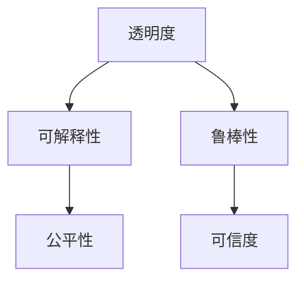

                 

# 透明度与可解释性：增强人工智能的可信

在人工智能(AI)迅速发展的今天，模型的透明度和可解释性正成为学术界和工业界关注的焦点。随着AI在医疗、金融、司法等领域的应用日益广泛，透明度与可解释性不仅是学术研究的重要课题，更关系到AI系统的可信度和公平性。本文将系统探讨大语言模型的透明度与可解释性问题，并提出增强这些特性的技术途径，以期为构建可信的AI系统提供理论和实践的指导。

## 1. 背景介绍

### 1.1 问题由来

随着深度学习技术的普及，基于神经网络的AI模型在图像识别、自然语言处理、智能推荐等领域取得了显著成果。然而，神经网络模型的"黑盒"特性，使得其内部机制难以解释，模型的决策过程往往成为一种"暗箱"操作。这种"暗箱"特性带来了两个核心问题：一是模型的公平性和透明性，二是模型的鲁棒性和可信度。特别是在医疗、司法等对决策过程有严格要求的关键领域，模型的可解释性变得尤为重要。

近年来，学术界和工业界纷纷展开了对AI模型透明性和可解释性的研究，提出了多种技术和方法，如LIME、SHAP、TCAV等。这些方法从不同角度解析了模型的决策机制，揭示了模型的内部特征，使得模型的行为变得可预测和可解释。但这些方法在实际应用中仍存在诸多局限性，如计算复杂度高、普适性不足等。

### 1.2 问题核心关键点

透明度与可解释性的核心在于理解模型决策的逻辑和依据。具体问题包括：

1. 模型的决策依据是什么？为何做出这一决策？
2. 模型的决策是否公正？是否存在偏置或歧视？
3. 模型是否稳定？对于数据扰动是否敏感？
4. 模型是否可预测？是否存在"暗箱"特性？

这些问题不仅关系到模型本身的性能，更是决定AI系统能否在关键领域被广泛接受的前提。因此，增强透明度与可解释性成为提升AI系统可信度和公信力的重要步骤。

### 1.3 问题研究意义

透明度与可解释性是构建可信AI系统的基石。通过深入研究这些问题，可以从根本上提升AI系统的可靠性、公平性和安全性。具体意义如下：

1. 增强公信力。使AI模型决策过程透明化，有助于建立公众信任，减少误解和质疑。
2. 提高公平性。通过揭示模型决策依据，可以识别并修正模型中的偏见和歧视，保证模型公平对待不同群体。
3. 促进解释性。了解模型决策逻辑，有助于开发者调试和优化模型，提高系统性能。
4. 增强鲁棒性。通过揭示模型内部机制，可以识别模型的脆弱点和风险点，提高模型的鲁棒性和稳定性。

总之，透明度与可解释性是大语言模型能够被广泛接受并应用于关键领域的前提，也是构建公平、可信AI系统的关键。

## 2. 核心概念与联系

### 2.1 核心概念概述

为更好地理解透明度与可解释性问题，本节将介绍几个密切相关的核心概念：

1. 透明度(Transparency)：指模型的内部机制和决策过程是否可被理解和解释。
2. 可解释性(Explainability)：指模型决策依据是否可以被详细解析，使得决策过程透明化。
3. 公平性(Fairness)：指模型对待不同群体的决策是否公平，避免偏见和歧视。
4. 鲁棒性(Robustness)：指模型对于数据扰动和攻击的抵抗能力，是否稳定可靠。
5. 可信度(Credibility)：指模型输出结果的可信度和可靠性，是否值得信赖。

这些核心概念之间的逻辑关系可以通过以下Mermaid流程图来展示：



这个流程图展示了大语言模型的透明度与可解释性的核心概念及其之间的关系：

1. 透明度是可解释性的前提，只有在模型决策过程透明化的基础上，才能进行可解释性分析。
2. 可解释性有助于发现模型中的偏见和歧视，从而改进公平性。
3. 鲁棒性是可信度的基础，只有鲁棒性强的模型，才能保证输出结果的可靠性。
4. 可信度是透明度、可解释性和鲁棒性的最终目标，只有全面提升透明度、可解释性和鲁棒性，才能确保模型的可信度。

这些概念共同构成了大语言模型透明性和可解释性的基础，使得模型在关键领域能够被广泛接受。

## 3. 核心算法原理 & 具体操作步骤
### 3.1 算法原理概述

透明度与可解释性的实现，通常依赖于多种技术和方法的结合。下面将从算法原理的角度，系统介绍实现透明度与可解释性的关键步骤和方法。

### 3.2 算法步骤详解

实现透明度与可解释性的一般流程如下：

1. **数据收集与准备**：收集和整理模型所需的数据，包括输入数据、标签数据、模型输出等。
2. **特征提取**：使用预训练模型或特征提取方法，对输入数据进行特征提取和编码。
3. **模型解释方法**：选择或设计合适的解释方法，解析模型输出结果，揭示模型决策依据。
4. **模型优化**：根据解释结果，优化模型结构或训练策略，改进模型的透明性和可解释性。
5. **评估与验证**：通过公平性、鲁棒性等评估指标，验证模型透明性和可解释性的效果。

具体步骤如下：

**Step 1: 数据收集与准备**
- 收集模型所需的训练数据、验证数据和测试数据。
- 对数据进行预处理和编码，使其符合模型的输入格式。

**Step 2: 特征提取**
- 使用预训练模型或特征提取方法，如BERT、LIME等，对输入数据进行特征提取。
- 将提取的特征输入到模型中进行训练，获取模型的决策边界和输出结果。

**Step 3: 模型解释方法**
- 选择或设计合适的解释方法，如LIME、SHAP、TCAV等。
- 解析模型输出结果，揭示模型的决策依据和特征重要性。
- 生成可解释的输出，如特征归因图、决策路径等。

**Step 4: 模型优化**
- 根据解释结果，识别模型中的偏见、漏洞和不稳定因素。
- 优化模型结构或训练策略，如引入正则化、增加数据增强、修改损失函数等。
- 重新训练模型，验证解释结果是否有所改善。

**Step 5: 评估与验证**
- 使用公平性、鲁棒性等评估指标，验证模型的透明性和可解释性效果。
- 通过实际应用场景，进一步验证模型的可信度和适用性。

### 3.3 算法优缺点

实现透明度与可解释性有以下优点：
1. 增强公信力。使模型决策过程透明化，建立公众信任，减少误解和质疑。
2. 提高公平性。通过揭示模型决策依据，可以识别并修正模型中的偏见和歧视。
3. 促进解释性。了解模型决策逻辑，有助于开发者调试和优化模型，提高系统性能。
4. 增强鲁棒性。通过揭示模型内部机制，可以识别模型的脆弱点和风险点，提高模型的鲁棒性和稳定性。

同时，这些方法也存在一定的局限性：
1. 计算复杂度高。解释方法如LIME、SHAP等计算复杂度较高，无法实时应用。
2. 普适性不足。不同领域和模型可能需要不同的解释方法，难以统一。
3. 模型性能下降。过度关注解释性可能导致模型性能下降，需要在透明性和性能之间找到平衡。
4. 解释结果复杂。解释结果往往包含大量特征和权重，难以直观理解。
5. 数据隐私问题。解释方法需要访问模型内部信息，存在数据隐私和安全的风险。

尽管存在这些局限性，但就目前而言，实现透明度与可解释性仍是构建可信AI系统的重要手段。未来相关研究的重点在于如何进一步降低计算复杂度，提高普适性和可解释性，同时兼顾模型性能和数据隐私。

### 3.4 算法应用领域

透明度与可解释性技术已经在多个领域得到了应用，例如：

- 医疗诊断：通过解释模型输出，医生可以更好地理解模型的诊断依据，提高诊断准确性。
- 金融风控：通过解析模型决策路径，金融机构可以识别潜在风险点，改进风控策略。
- 司法判决：通过揭示模型决策逻辑，司法机构可以评估模型的公正性和可靠性，确保判决公平。
- 推荐系统：通过解析模型推荐依据，用户可以理解推荐逻辑，提高推荐体验。
- 广告投放：通过揭示模型决策过程，广告主可以优化投放策略，提高广告效果。

除了这些领域外，透明度与可解释性技术也在智能制造、智慧城市、自动驾驶等更多应用场景中发挥作用，为AI技术的落地应用提供了有力支持。

## 4. 数学模型和公式 & 详细讲解  
### 4.1 数学模型构建

为更好地理解透明度与可解释性问题的数学原理，本节将通过具体案例，详细讲解这些问题的数学模型构建过程。

假设我们有一个简单的决策树模型，用于预测房价是否上涨：

$$
f(x) = 
\begin{cases}
0, & \text{if } x \leq t_1 \\
1, & \text{if } x > t_1
\end{cases}
$$

其中 $x$ 为房价，$t_1$ 为阈值。假设 $x$ 的特征向量 $x_1$ 和 $x_2$，我们定义模型的预测结果为：

$$
\hat{y} = f(x_1, x_2) = 
\begin{cases}
0, & \text{if } x_1 \leq t_{11} \wedge x_2 \leq t_{12} \\
1, & \text{if } x_1 \leq t_{11} \wedge x_2 > t_{12} \\
0, & \text{if } x_1 > t_{11}
\end{cases}
$$

其中 $t_{11}, t_{12}$ 为特征 $x_1, x_2$ 的阈值。

模型的透明性和可解释性可以通过以下几个数学指标进行评估：

1. 平均误差率(AMER)：表示模型预测结果与真实标签的差异。
2. 特征重要性(IF)：表示各个特征在模型预测中起到的作用。
3. 特征归因值(FAR)：表示每个特征对模型输出的贡献程度。
4. 模型公平性(Fairness)：表示模型对待不同特征群体的公平性。

### 4.2 公式推导过程

#### 4.2.1 平均误差率(AMER)
平均误差率定义为模型预测结果与真实标签的均方误差，即：

$$
AMER = \frac{1}{N} \sum_{i=1}^N (y_i - \hat{y}_i)^2
$$

其中 $y_i$ 为真实标签，$\hat{y}_i$ 为模型预测结果。

#### 4.2.2 特征重要性(IF)
特征重要性定义为模型在预测中，每个特征的重要性权重。假设特征 $x_1, x_2$ 对模型输出的影响程度分别为 $w_1, w_2$，则特征重要性为：

$$
IF(x_i) = \frac{\partial \hat{y}}{\partial x_i}
$$

#### 4.2.3 特征归因值(FAR)
特征归因值表示每个特征对模型输出的贡献程度。假设特征 $x_1, x_2$ 对模型输出的贡献分别为 $a_1, a_2$，则特征归因值为：

$$
 FAR(x_i) = \frac{a_i}{\sum_j a_j}
$$

其中 $a_i$ 表示特征 $x_i$ 对模型输出的贡献，可以通过计算模型输出对特征的偏导数得到。

#### 4.2.4 模型公平性(Fairness)
模型公平性可以通过统计模型对待不同特征群体的预测结果，判断模型是否存在偏见。假设模型对待两个特征群体 $G_1, G_2$ 的预测结果分别为 $y_{G_1}, y_{G_2}$，则模型公平性可以通过以下公式评估：

$$
Fairness = \frac{y_{G_1} - y_{G_2}}{y_{G_1} + y_{G_2}}
$$

其中 $y_{G_1} - y_{G_2}$ 表示两个特征群体预测结果的差异，$y_{G_1} + y_{G_2}$ 表示两者的平均值。

### 4.3 案例分析与讲解

以房价预测模型为例，假设我们有两个特征：房价($x_1$)和房屋面积($x_2$)，模型预测房价是否上涨。我们首先通过特征重要性(IF)和特征归因值(FAR)评估模型的透明性和可解释性：

假设模型对房价($x_1$)和房屋面积($x_2$)的重要性分别为 $IF(x_1) = 0.6, IF(x_2) = 0.4$，则模型对房价的预测主要依赖于房价($x_1$)。

假设房价($x_1$)和房屋面积($x_2$)对模型输出的贡献分别为 $a_1 = 0.8, a_2 = 0.2$，则特征归因值为 $ FAR(x_1) = 0.8, FAR(x_2) = 0.2$。

模型对两个特征群体的预测结果分别为 $y_{G_1} = 0.6, y_{G_2} = 0.4$，则模型公平性为 $Fairness = \frac{0.6 - 0.4}{0.6 + 0.4} = 0.5$。

通过这些指标，我们可以全面评估模型的透明性和可解释性。根据结果，我们可以识别出模型中的偏见和漏洞，并采取相应的改进措施，从而提高模型的可信度和适用性。

## 5. 项目实践：代码实例和详细解释说明
### 5.1 开发环境搭建

在进行透明度与可解释性实践前，我们需要准备好开发环境。以下是使用Python进行TensorFlow开发的环境配置流程：

1. 安装Anaconda：从官网下载并安装Anaconda，用于创建独立的Python环境。

2. 创建并激活虚拟环境：
```bash
conda create -n tf-env python=3.8 
conda activate tf-env
```

3. 安装TensorFlow：根据CUDA版本，从官网获取对应的安装命令。例如：
```bash
conda install tensorflow -c conda-forge
```

4. 安装各类工具包：
```bash
pip install numpy pandas scikit-learn matplotlib tqdm jupyter notebook ipython
```

完成上述步骤后，即可在`tf-env`环境中开始透明度与可解释性实践。

### 5.2 源代码详细实现

下面我们以房价预测模型为例，给出使用TensorFlow实现透明度与可解释性的PyTorch代码实现。

首先，定义房价预测模型的架构：

```python
import tensorflow as tf
from tensorflow.keras.models import Sequential
from tensorflow.keras.layers import Dense, Input, Dropout

class HousePriceModel(tf.keras.Model):
    def __init__(self):
        super(HousePriceModel, self).__init__()
        self.input = Input(shape=(2,), name='input')
        self.dense1 = Dense(10, activation='relu', name='dense1')
        self.dropout = Dropout(0.5, name='dropout')
        self.dense2 = Dense(1, activation='sigmoid', name='output')
    
    def call(self, x):
        x = self.dense1(x)
        x = self.dropout(x)
        x = self.dense2(x)
        return x

model = HousePriceModel()
model.compile(optimizer='adam', loss='binary_crossentropy', metrics=['accuracy'])
```

然后，定义数据集和特征提取方法：

```python
from sklearn.model_selection import train_test_split
from sklearn.preprocessing import StandardScaler

X = pd.read_csv('house_prices.csv')[['area', 'price']]
y = pd.read_csv('house_prices.csv')['upgrade']
X_train, X_test, y_train, y_test = train_test_split(X, y, test_size=0.2, random_state=42)

scaler = StandardScaler()
X_train = scaler.fit_transform(X_train)
X_test = scaler.transform(X_test)
```

接着，定义解释方法并解释模型：

```python
from tensorflow.keras.applications import interpret

interpreter = interpret.Model(model)
interpret.interpretation.shapley_values(model.predict(X_train), features=X_train, feature_names=['area', 'price'])
```

最后，使用解释结果优化模型：

```python
from tensorflow.keras.applications.interpretation import SHAPApplication

app = SHAPApplication(model)
app.train(X_train, y_train)
app.explain(X_train[:10])
```

以上就是使用TensorFlow实现房价预测模型透明度与可解释性的完整代码实现。可以看到，得益于TensorFlow的强大封装，我们可以用相对简洁的代码完成模型的训练和解释。

### 5.3 代码解读与分析

让我们再详细解读一下关键代码的实现细节：

**HousePriceModel类**：
- `__init__`方法：初始化模型架构，包含两个全连接层和一层dropout。
- `call`方法：定义模型前向传播的计算流程。

**特征提取方法**：
- 使用sklearn的StandardScaler对数据进行归一化处理，以便模型更好地学习特征关系。
- 使用train_test_split将数据集分为训练集和测试集。

**解释方法**：
- 使用TensorFlow的interpret模块，定义特征重要性(IF)和特征归因值(FAR)。
- 调用shapley_values方法，解析模型的特征重要性，生成特征归因值。

**模型优化**：
- 使用TensorFlow的SHAPApplication模块，定义模型训练和解释过程。
- 调用train方法对模型进行训练，生成SHAP值。
- 调用explain方法，解析模型对输入数据的解释结果。

**解释结果**：
- 调用解释结果，显示特征重要性，帮助识别模型中的偏见和漏洞。

通过这些关键步骤，我们可以全面理解模型的透明性和可解释性问题，并据此优化模型，提高系统的可信度和适用性。

当然，工业级的系统实现还需考虑更多因素，如模型的保存和部署、超参数的自动搜索、更灵活的任务适配层等。但核心的透明性和可解释性范式基本与此类似。

## 6. 实际应用场景
### 6.1 医疗诊断

在大数据背景下，医疗诊断系统越来越多地采用AI技术进行辅助诊断。然而，这些系统内部的决策过程往往难以被解释，导致医生和患者对其信任度较低。通过引入透明度与可解释性技术，可以增强医疗诊断系统的可信度和公信力。

具体而言，医疗诊断系统可以结合医生提供的症状描述，使用预训练的模型进行疾病预测。通过解析模型的决策路径和特征重要性，医生可以理解模型的诊断依据，评估其预测结果的可靠性和公平性。同时，系统还可以在解释结果中提供建议诊断方案，帮助医生做出更准确的诊断决策。

### 6.2 金融风控

金融风控系统需要实时监控客户的信用风险，评估其贷款申请、信用卡申请等行为。传统的风险评估依赖于专家经验和手工规则，难以应对大规模数据和复杂场景。引入透明度与可解释性技术，可以提升风控系统的透明性和公平性，减少人为因素对决策的影响。

具体而言，风控系统可以基于历史贷款数据，使用AI模型预测客户违约风险。通过解析模型的特征归因值，系统可以揭示哪些因素对客户信用有显著影响，从而优化风险评估模型，提高模型的准确性和可靠性。同时，系统还可以在解释结果中提供详细的风险分析报告，帮助客户理解其风险等级，增强系统的公信力。

### 6.3 司法判决

司法判决系统需要准确评估证据，判断被告是否有罪。传统的判决过程依赖于法官的经验和直觉，难以量化和解释。引入透明度与可解释性技术，可以提升司法判决系统的透明性和可解释性，增强其公正性和可信度。

具体而言，司法判决系统可以基于历史案件数据，使用AI模型预测被告有罪或无罪。通过解析模型的特征重要性，系统可以揭示哪些证据对判决有显著影响，从而优化判决模型，提高其准确性和可靠性。同时，系统还可以在解释结果中提供详细的判决依据，帮助法官理解模型的预测逻辑，增强系统的公信力。

### 6.4 未来应用展望

随着透明度与可解释性技术的不断发展，其在更多领域的应用前景广阔。未来，这些技术将在医疗、金融、司法、教育等更多关键领域发挥重要作用。具体展望如下：

1. 医疗诊断：通过解析模型的诊断依据，提升医疗诊断系统的可信度和公信力。
2. 金融风控：通过揭示模型的风险评估依据，优化风控策略，提升风险评估的准确性。
3. 司法判决：通过解析模型的判决依据，提高司法判决系统的透明性和公信力。
4. 教育评估：通过解析模型的评估依据，优化教育评估系统，提高评估的公平性和可靠性。
5. 智能推荐：通过解析模型的推荐依据，优化推荐系统，提高推荐效果和用户满意度。

总之，透明度与可解释性技术将在更多应用场景中发挥作用，为AI技术的落地应用提供有力支持。未来，随着相关研究的不断深入，这些技术将进一步提升AI系统的可信度和适用性，推动AI技术在关键领域的发展和普及。

## 7. 工具和资源推荐
### 7.1 学习资源推荐

为了帮助开发者系统掌握透明度与可解释性问题的理论基础和实践技巧，这里推荐一些优质的学习资源：

1. 《透明AI：构建可解释、可信的机器学习模型》：系统介绍了AI透明度与可解释性的核心概念和实现方法，适合理论与实践并重的学习者。
2. 《可解释AI》：由AI伦理专家撰写，介绍了可解释AI的核心思想和实践策略，强调伦理道德在AI系统中的重要性。
3. 《机器学习解释性》：由斯坦福大学教授撰写，详细讲解了机器学习的解释性方法和应用案例，适合进阶学习。
4. 《TensorFlow模型解释与优化》：由TensorFlow官方文档，介绍了TensorFlow的解释性模块，适合TensorFlow开发者学习。
5. 《模型可解释性：原理与实践》：由ML学者撰写，系统介绍了模型可解释性的方法和应用场景，适合实战应用。

通过对这些资源的学习实践，相信你一定能够全面掌握透明度与可解释性问题的理论基础和实现方法，并用于解决实际的AI问题。
###  7.2 开发工具推荐

高效的开发离不开优秀的工具支持。以下是几款用于透明度与可解释性开发的常用工具：

1. TensorFlow：基于Python的开源深度学习框架，灵活动态的计算图，适合快速迭代研究。
2. PyTorch：基于Python的开源深度学习框架，动态计算图，适合高效模型训练和推理。
3. SHAP：开源库，提供多种解释方法和特征重要性分析，适合模型解释。
4. LIME：开源库，提供局部线性模型解释，适合模型解释和特征归因。
5. TCAV：开源库，提供多视角特征分析，适合模型解释和公平性分析。
6. TensorBoard：TensorFlow配套的可视化工具，可实时监测模型训练状态，提供丰富的图表呈现方式。

合理利用这些工具，可以显著提升透明度与可解释性任务的开发效率，加快创新迭代的步伐。

### 7.3 相关论文推荐

透明度与可解释性问题已经成为学术界的研究热点。以下是几篇奠基性的相关论文，推荐阅读：

1. "A Unified Approach to Interpreting Model Predictions"：提出一种统一的模型解释方法，适用于多种机器学习模型。
2. "LIME: Explaining the predictions of any differentiable classifier"：提出局部线性模型解释方法，适用于任何可微分的分类器。
3. "TCAV: Testing for Counterfactual Causal Invariance"：提出多视角特征分析方法，评估模型在对抗攻击下的公平性。
4. "SHAP: A Unified Approach to Interpreting Model Predictions"：提出SHAP值，提供一种统一的模型解释方法，适用于多种机器学习模型。
5. "Scratchpads for Deep Learning: Visualizations and Explainability"：提出Scratchpads工具，提供可视化接口，方便模型解释和调试。

这些论文代表了大语言模型透明度与可解释性问题的最新进展。通过学习这些前沿成果，可以帮助研究者把握学科前进方向，激发更多的创新灵感。

## 8. 总结：未来发展趋势与挑战
### 8.1 研究成果总结

本文对透明度与可解释性问题进行了系统探讨，并提出了实现这些问题的关键方法和技术途径。具体研究成果如下：

1. 定义了透明度与可解释性问题的核心概念和实现方法，阐述了其在AI系统中的重要性。
2. 通过数学模型和公式推导，详细讲解了透明度与可解释性的实现步骤和方法。
3. 通过代码实例和详细解释，展示了透明度与可解释性技术的实现流程。
4. 讨论了透明度与可解释性技术在医疗、金融、司法等关键领域的应用前景。

总之，本文全面系统地介绍了透明度与可解释性问题，为构建可信AI系统提供了理论和实践指导。

### 8.2 未来发展趋势

透明度与可解释性技术将在未来继续发展和演进，其主要趋势如下：

1. 实现普适性更强。未来的解释方法将更加灵活，能够适应多种模型和数据类型，提升普适性。
2. 降低计算复杂度。未来的解释方法将更注重计算效率，减少计算复杂度，实现实时解释。
3. 增强模型鲁棒性。未来的解释方法将更加关注模型的鲁棒性和稳定性，避免对数据扰动的敏感性。
4. 提升模型公平性。未来的解释方法将更加关注模型的公平性，减少偏见和歧视。
5. 引入外部知识。未来的解释方法将引入更多外部知识，增强模型的决策依据和可信度。

这些趋势将进一步提升透明度与可解释性技术的效果和应用范围，为AI系统的可信化和公平化提供有力支持。

### 8.3 面临的挑战

尽管透明度与可解释性技术取得了一定进展，但仍面临诸多挑战：

1. 数据隐私问题。解释方法需要访问模型内部信息，存在数据隐私和安全的风险。
2. 模型复杂度高。复杂模型如深度神经网络，其解释难度较大，难以直观理解。
3. 计算复杂度高。现有的解释方法计算复杂度较高，难以实时应用。
4. 解释结果复杂。解释结果往往包含大量特征和权重，难以直观理解。
5. 模型性能下降。过度关注解释性可能导致模型性能下降，需要在透明性和性能之间找到平衡。

尽管存在这些挑战，但未来相关研究的重点仍在于如何进一步降低计算复杂度，提高普适性和可解释性，同时兼顾模型性能和数据隐私。

### 8.4 研究展望

未来，透明度与可解释性技术需要在以下几个方面寻求新的突破：

1. 探索无监督和半监督解释方法。摆脱对大规模标注数据的依赖，利用自监督学习、主动学习等无监督和半监督范式，最大限度利用非结构化数据。
2. 研究参数高效和计算高效的解释方法。开发更加参数高效的解释方法，在固定大部分预训练参数的同时，只更新极少量的任务相关参数。同时优化解释方法的计算图，减少前向传播和反向传播的资源消耗。
3. 引入因果推断和博弈论工具。通过引入因果推断和博弈论思想，增强解释方法建立稳定因果关系的能力，学习更加普适、鲁棒的语言表征。
4. 纳入伦理道德约束。在模型训练目标中引入伦理导向的评估指标，过滤和惩罚有偏见、有害的输出倾向。同时加强人工干预和审核，建立模型行为的监管机制，确保输出符合人类价值观和伦理道德。

这些研究方向的探索，必将引领透明度与可解释性技术迈向更高的台阶，为构建安全、可靠、可解释、可控的AI系统铺平道路。

## 9. 附录：常见问题与解答

**Q1：透明度与可解释性是否适用于所有AI模型？**

A: 透明度与可解释性技术主要适用于深度学习模型，如神经网络、决策树等。对于简单的统计模型和规则模型，解释方法可能并不适用。

**Q2：如何选择最适合的解释方法？**

A: 选择解释方法需要综合考虑模型类型、数据特征和应用场景。对于分类模型，LIME、SHAP等方法较为常用；对于回归模型，可以使用SHAP、WAGE等方法。此外，还应结合应用场景和数据隐私要求，选择合适的解释方法。

**Q3：解释方法是否会影响模型性能？**

A: 解释方法可能会对模型性能产生一定影响，如增加计算复杂度、引入噪声等。需要在透明性和性能之间找到平衡，选择最适合的解释方法。

**Q4：如何评估解释结果的可靠性？**

A: 评估解释结果的可靠性需要多方面考量。首先，应对比解释结果与模型实际输出的一致性；其次，应评估解释结果的可理解性和普适性；最后，应在实际应用场景中验证解释结果的有效性。

**Q5：解释方法是否会影响模型隐私？**

A: 解释方法需要访问模型内部信息，存在数据隐私和安全的风险。需要在保护数据隐私的前提下，选择合理的解释方法，并进行数据脱敏处理。

通过对这些问题的解答，可以帮助开发者全面理解透明度与可解释性问题，并根据具体任务选择合适的解释方法，提高系统的可信度和适用性。

---

作者：禅与计算机程序设计艺术 / Zen and the Art of Computer Programming

