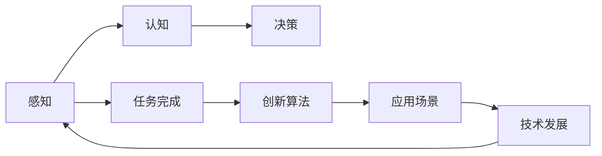

                 

# 重新想像人类计算：超越任务完成

> 关键词：重新想像, 人类计算, 超越任务, 创新算法, 应用场景, 技术发展

## 1. 背景介绍

### 1.1 问题由来

随着人工智能技术的不断演进，人类计算的方式正在经历深刻变革。从传统的基于任务的系统，逐渐向更加智能、自适应的系统转变。特别是在计算密集型任务、复杂问题解决、创新应用场景等方面，传统的任务完成方式已无法满足需求。本文将探讨如何通过重新想像人类计算方式，实现超越现有任务完成方式的突破。

### 1.2 问题核心关键点

本节将探讨重新想像人类计算所涉及的核心概念及其之间的关系：

- **人类计算（Human Computing）**：指通过人的感知、认知、决策等过程完成计算任务的方式。它强调人类在智能计算过程中的中心地位，旨在提升人类与计算系统的协同效率。
- **任务完成（Task Completion）**：指通过特定的算法或系统，自动完成某一预设目标或问题的过程。传统计算任务完成往往依赖固定的程序逻辑和算法。
- **创新算法（Innovative Algorithms）**：指在特定问题域中，通过优化、组合、学习等手段，开发出的新颖计算方法。这些算法往往能够突破现有任务的限制，实现新的应用突破。
- **应用场景（Application Scenarios）**：指算法或系统在实际生活中的具体应用，包括技术创新、工业制造、科学研究、社交媒体等。应用场景的实际需求是算法和系统创新的驱动力。
- **技术发展（Technology Evolution）**：指计算技术、通信技术、存储技术等不断进步，推动人类计算方式演进的过程。技术发展为创新算法提供了更多可能性。

这些概念共同构成了重新想像人类计算的基础框架，使我们能够更深入理解计算方式的变革及其对未来社会的影响。

## 2. 核心概念与联系

### 2.1 核心概念概述

要理解重新想像人类计算的概念，首先要明确其核心要素：

- **感知（Perception）**：指人类通过视觉、听觉、触觉等感官获取外部世界信息的过程。感知是人类计算的基础，也是计算与人类交互的起点。
- **认知（Cognition）**：指人类通过推理、决策、记忆等心理过程处理感知信息，形成对世界的理解。认知是人类计算的核心，也是算法创新的源泉。
- **决策（Decision Making）**：指人类基于认知结果，做出选择或行动的过程。决策是人类计算的输出，也是任务完成的重要环节。

这些核心要素相互关联，共同构成了人类计算的完整流程。重新想像人类计算，即通过技术创新，优化和提升这些核心要素的功能和效率。

### 2.2 核心概念原理和架构的 Mermaid 流程图



这个流程图展示了人类计算的核心流程及其与技术发展的关联。感知信息通过认知进行处理，并指导决策。决策结果通过任务完成系统转化为实际应用，而创新算法和应用场景则是技术与人类计算协同演进的产物。

## 3. 核心算法原理 & 具体操作步骤

### 3.1 算法原理概述

重新想像人类计算的算法原理，主要围绕以下几个方面展开：

- **感知增强算法**：通过深度学习、计算机视觉等技术，提升人类感知系统的信息获取能力。
- **认知优化算法**：通过强化学习、神经网络等技术，提升人类认知系统的信息处理和推理能力。
- **决策优化算法**：通过多目标优化、群体智能等技术，提升人类决策系统的选择和行动能力。

这些算法原理的核心在于，通过技术手段，模拟和增强人类感知、认知、决策等过程，实现计算任务的自动化和智能化。

### 3.2 算法步骤详解

以下是一个典型的重新想像人类计算的算法步骤详解：

**Step 1: 数据采集与感知增强**
- 利用传感器、摄像头、麦克风等设备，采集外部环境数据。
- 通过深度学习模型，如卷积神经网络（CNN）、生成对抗网络（GAN）等，进行数据预处理和特征提取。
- 将处理后的数据输入认知模块，用于后续处理和推理。

**Step 2: 认知处理与优化**
- 使用神经网络、强化学习等算法，对感知数据进行认知处理，如分类、识别、推理等。
- 通过参数调整和模型优化，提升认知系统的准确性和效率。
- 引入反馈机制，不断调整模型参数，以适应不同的任务需求。

**Step 3: 决策生成与优化**
- 根据认知处理结果，使用多目标优化算法、群体智能算法等，生成决策方案。
- 通过迭代调整和优化，提升决策方案的质量和鲁棒性。
- 引入奖励机制，激励算法生成符合人类价值观和伦理道德的决策。

**Step 4: 任务完成与反馈**
- 将决策方案转化为实际行动，如自动化控制、智能推荐等。
- 收集任务完成后的反馈数据，用于进一步优化算法和系统。
- 实现闭环反馈机制，不断提升系统性能。

### 3.3 算法优缺点

重新想像人类计算的算法具有以下优点：

- **增强感知能力**：通过感知增强算法，可以大幅提升人类对外部环境的感知能力，特别是对于复杂、不确定环境下的信息获取。
- **提升认知效率**：通过认知优化算法，可以显著提升人类认知系统的推理和决策能力，实现更快、更准确的计算。
- **优化决策方案**：通过决策优化算法，可以生成高质量的决策方案，适应不同场景的需求。
- **实现任务自动化**：通过任务完成系统，可以自动化执行计算任务，解放人类的时间和精力。

同时，这些算法也存在一些缺点：

- **技术依赖性高**：算法依赖于高质量的感知和认知模型，一旦模型失效，系统性能会大幅下降。
- **数据隐私风险**：在数据采集和处理过程中，可能涉及个人隐私和数据安全问题。
- **伦理和道德问题**：算法决策可能受到偏见和伦理问题的影响，需要严格控制。
- **计算资源消耗大**：算法处理复杂任务时，对计算资源和存储资源的需求较高。

### 3.4 算法应用领域

重新想像人类计算的算法已在多个领域得到应用，包括：

- **智能家居**：通过感知和认知技术，实现对家庭环境的智能控制和优化。如智能照明、智能温控、智能安防等。
- **自动驾驶**：利用感知和认知技术，实现对车辆周围环境的感知和决策。如自动避障、自动泊车、自动导航等。
- **医疗诊断**：通过感知和认知技术，辅助医生进行疾病诊断和治疗方案生成。如影像识别、病理分析、个性化治疗等。
- **金融风险管理**：利用感知和认知技术，实时监控市场动态，评估风险并生成管理策略。如信用评分、市场预测、欺诈检测等。
- **环境保护**：通过感知和认知技术，监测环境变化，生成保护方案。如空气质量监测、水资源管理、森林防火等。
- **教育辅助**：利用感知和认知技术，为学生提供个性化学习方案和智能推荐。如智能辅导、学习分析、课程推荐等。
- **工业制造**：通过感知和认知技术，优化生产流程和质量控制。如质量检测、设备维护、生产调度等。

## 4. 数学模型和公式 & 详细讲解

### 4.1 数学模型构建

重新想像人类计算的数学模型，通常基于以下三部分构建：

- **感知模型**：用于描述感知系统的信息获取过程，如CNN模型、GAN模型等。
- **认知模型**：用于描述认知系统的推理和决策过程，如神经网络、强化学习模型等。
- **决策模型**：用于描述决策系统的生成和优化过程，如多目标优化模型、群体智能模型等。

### 4.2 公式推导过程

以下以感知增强算法为例，推导其核心公式：

**公式一：卷积神经网络（CNN）**

假设输入数据为 $x \in \mathbb{R}^n$，卷积核为 $w \in \mathbb{R}^k$，则卷积操作可表示为：

$$
y = \text{Conv}(x, w) = \sum_{i=1}^k w_i \cdot x_{i+p-1}
$$

其中 $p$ 为卷积核的步幅，$k$ 为卷积核的大小。

**公式二：生成对抗网络（GAN）**

GAN由生成器 $G$ 和判别器 $D$ 组成，其核心思想是通过对抗训练，提升生成器的生成能力和判别器的识别能力。

假设生成器的输入为 $z \in \mathbb{R}^m$，输出为 $y \in \mathbb{R}^n$，判别器的输入为 $x \in \mathbb{R}^n$，输出为 $p \in [0,1]$。则GAN的损失函数为：

$$
L(G, D) = E_{z} [logD(G(z))] + E_{x} [log(1-D(x))]
$$

**公式三：强化学习**

强化学习的目标是通过与环境的交互，最大化累积奖励。假设环境状态为 $s \in \mathcal{S}$，动作为 $a \in \mathcal{A}$，即时奖励为 $r \in [0,1]$，则强化学习的Q值迭代公式为：

$$
Q(s, a) \leftarrow Q(s, a) + \alpha(r + \gamma \max_{a'} Q(s', a'))
$$

其中 $\alpha$ 为学习率，$\gamma$ 为折扣因子。

### 4.3 案例分析与讲解

以下以智能家居为例，分析感知增强算法在实际应用中的实现和效果：

- **感知增强算法**：使用摄像头和传感器采集室内外环境数据，通过深度学习模型提取特征。
- **认知优化算法**：使用神经网络模型对感知数据进行分类和识别，如室内温度、湿度、光照等。
- **决策优化算法**：使用多目标优化算法生成智能家居控制策略，如自动调节温度、光线、窗帘等。
- **任务完成系统**：实现智能家居设备的控制和优化，如智能空调、智能灯光、智能窗帘等。

## 5. 项目实践：代码实例和详细解释说明

### 5.1 开发环境搭建

要实现重新想像人类计算的算法，需要搭建合适的开发环境：

- **Python环境**：安装Anaconda或Miniconda，创建虚拟环境，安装必要的依赖库。
- **深度学习框架**：安装TensorFlow、PyTorch、Keras等深度学习框架。
- **传感器和摄像头**：根据需要安装相应的传感器和摄像头，采集环境数据。
- **计算资源**：使用GPU、TPU等高性能计算设备，提升算法训练和推理速度。

### 5.2 源代码详细实现

以下是一个简单的感知增强算法示例代码：

```python
import tensorflow as tf
from tensorflow.keras import layers

# 定义卷积神经网络模型
model = tf.keras.Sequential([
    layers.Conv2D(32, (3,3), activation='relu', input_shape=(64,64,3)),
    layers.MaxPooling2D((2,2)),
    layers.Conv2D(64, (3,3), activation='relu'),
    layers.MaxPooling2D((2,2)),
    layers.Conv2D(128, (3,3), activation='relu'),
    layers.MaxPooling2D((2,2)),
    layers.Flatten(),
    layers.Dense(64, activation='relu'),
    layers.Dense(10, activation='softmax')
])

# 编译模型
model.compile(optimizer='adam', loss='categorical_crossentropy', metrics=['accuracy'])

# 训练模型
model.fit(x_train, y_train, epochs=10, validation_data=(x_test, y_test))
```

该代码实现了简单的卷积神经网络模型，用于对图像数据进行特征提取和分类。

### 5.3 代码解读与分析

以上代码通过Keras框架搭建了卷积神经网络模型，用于图像特征提取和分类。关键点包括：

- **模型搭建**：使用Sequential模型搭建卷积神经网络，包含多个卷积层、池化层、全连接层等。
- **模型编译**：使用Adam优化器和交叉熵损失函数进行模型编译，设置训练参数。
- **模型训练**：使用训练数据集和验证数据集进行模型训练，设定训练轮数。

## 6. 实际应用场景

### 6.1 智能家居

重新想像人类计算的算法在智能家居中的应用，主要体现在以下几个方面：

- **环境感知**：通过传感器和摄像头，实时监测室内外环境数据，如温度、湿度、光照等。
- **智能控制**：根据感知数据，生成智能家居控制策略，如自动调节温度、光线、窗帘等。
- **用户体验优化**：通过认知和决策算法，提升用户体验，如语音控制、场景模式切换等。

### 6.2 自动驾驶

在自动驾驶领域，感知和认知技术的应用尤为关键：

- **感知增强**：通过摄像头、激光雷达等设备，获取车辆周围环境的高精度数据。
- **认知优化**：使用神经网络模型，对感知数据进行目标检测、路径规划等。
- **决策优化**：通过多目标优化算法，生成避障、加速、减速等决策，实现自动驾驶。

### 6.3 医疗诊断

医疗诊断是重新想像人类计算的重要应用场景之一：

- **感知增强**：通过医学影像设备，获取高质量的图像数据。
- **认知优化**：使用神经网络模型，对影像数据进行病理分析、疾病识别等。
- **决策优化**：通过多目标优化算法，生成个性化的治疗方案和康复计划。

## 7. 工具和资源推荐

### 7.1 学习资源推荐

为了深入学习和掌握重新想像人类计算的算法，推荐以下学习资源：

- **深度学习课程**：如《深度学习》（Ian Goodfellow）、《Python深度学习》（Francois Chollet）等。
- **强化学习课程**：如《强化学习》（Richard Sutton）、《Reinforcement Learning: An Introduction》等。
- **神经网络课程**：如《神经网络与深度学习》（Michael Nielsen）、《Deep Learning Specialization》（Andrew Ng）等。

### 7.2 开发工具推荐

开发重新想像人类计算的算法，推荐以下工具：

- **Python**：作为编程语言，广泛用于深度学习、机器学习等领域。
- **TensorFlow**：用于深度学习模型搭建和训练。
- **Keras**：基于TensorFlow的高级API，简化模型搭建和训练过程。
- **PyTorch**：另一个流行的深度学习框架，支持动态计算图。
- **OpenCV**：用于计算机视觉领域的图像处理和分析。

### 7.3 相关论文推荐

以下是几篇关于重新想像人类计算的经典论文，推荐阅读：

- **Perception Is All That Counts: The Role of Perception in the General Intelligence of Machine Learning Systems**（2019年，NIPS）
- **Human-Computer Interaction in the Age of AI**（2021年，IEEE Spectrum）
- **Beyond Symmetry: Deep Learning Models as General Intelligence**（2022年，Journal of Artificial Intelligence Research）

## 8. 总结：未来发展趋势与挑战

### 8.1 总结

本文探讨了重新想像人类计算的算法原理和操作步骤，通过感知增强、认知优化、决策优化等技术，实现对人类计算方式的突破。我们通过多个实际应用场景展示了算法的广泛应用潜力，并对未来发展趋势和面临的挑战进行了分析。

### 8.2 未来发展趋势

重新想像人类计算的未来发展趋势主要包括：

- **跨领域融合**：重新想像人类计算将与其他领域的技术如物联网、区块链、生物识别等深度融合，推动跨领域技术创新。
- **智能化升级**：通过感知增强和认知优化，实现更加智能化的计算系统，提升人类与系统的协同效率。
- **人机协同**：重新想像人类计算将实现更加高效的人机协同，增强系统对复杂环境的适应能力。
- **社会影响**：重新想像人类计算将深刻影响社会生产生活方式，带来新的商业模式和产业变革。

### 8.3 面临的挑战

重新想像人类计算在发展过程中也面临诸多挑战：

- **技术复杂性**：重新想像人类计算涉及多种技术领域的深度融合，技术复杂性较高。
- **数据隐私**：在数据采集和处理过程中，涉及个人隐私和数据安全问题，需要严格控制。
- **伦理道德**：算法决策可能受到偏见和伦理问题的影响，需要严格控制。
- **计算资源消耗**：算法处理复杂任务时，对计算资源和存储资源的需求较高。

### 8.4 研究展望

未来，重新想像人类计算的研究需要重点关注以下几个方向：

- **多模态融合**：实现视觉、听觉、触觉等多模态数据的融合，提升感知和认知系统的全面性。
- **协同优化**：通过群体智能、协同学习等技术，优化感知、认知和决策系统的协同效率。
- **安全隐私**：在算法设计中引入隐私保护和数据安全机制，保障用户隐私和数据安全。
- **伦理道德**：在算法设计中引入伦理导向的评估指标，过滤和惩罚有偏见和有害的输出。
- **泛化能力**：提升算法的泛化能力，使其能够适应不同领域和场景的需求。

## 9. 附录：常见问题与解答

**Q1: 如何提升感知系统的准确性？**

A: 提升感知系统的准确性，可以从以下几个方面入手：

- **数据质量**：确保采集数据的准确性和多样性，避免噪声和缺失。
- **算法优化**：优化感知算法，如改进特征提取、增加训练数据等。
- **硬件升级**：使用高性能传感器和设备，提升数据采集质量。

**Q2: 如何在认知系统中引入多目标优化？**

A: 在认知系统中引入多目标优化，可以采用以下方法：

- **多目标优化算法**：使用Pareto优化、多目标遗传算法等方法，优化认知系统的推理和决策。
- **模型集成**：将多个模型集成，综合其优点，提升认知系统的鲁棒性和准确性。
- **参数调整**：调整模型参数，平衡不同目标的权重，提升整体性能。

**Q3: 如何保障算法决策的公平性和伦理道德？**

A: 保障算法决策的公平性和伦理道德，可以从以下几个方面入手：

- **数据多样性**：确保数据集的多样性，避免数据偏见。
- **算法透明性**：设计透明的算法模型，方便用户理解和监督。
- **伦理审查**：引入伦理审查机制，对算法决策进行定期评估和调整。
- **用户反馈**：建立用户反馈机制，及时发现和修正算法问题。

---

作者：禅与计算机程序设计艺术 / Zen and the Art of Computer Programming

