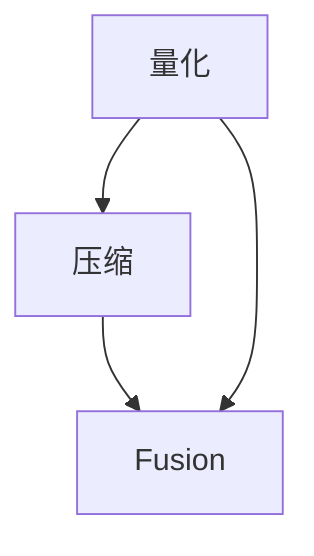

                 

## 1. 背景介绍

### 1.1 问题由来
在深度学习模型的训练和推理过程中，模型大小是一个至关重要的考虑因素。模型规模不仅影响模型的存储和传输效率，还直接关系到计算资源的需求和推理速度。近年来，深度学习模型的参数量呈现爆炸性增长，这虽然带来了更强的表达能力，但也带来了巨大的存储和计算挑战。为了平衡模型性能与资源消耗，量化压缩技术应运而生。

量化压缩是一种通过对模型参数进行量化，减小模型规模，提升计算效率的优化技术。其核心思想是将浮点参数转化为更小、更稀疏的整数或定点表示，同时保持模型的精度损失在可接受的范围内。通过量化压缩，可以显著降低模型的存储和计算需求，使其在移动设备、嵌入式系统等资源受限的环境中也能高效运行。

### 1.2 问题核心关键点
量化压缩在深度学习中的应用已经成为一项前沿研究课题。其核心关键点包括：
- 量化类型的选择：半精度浮点数、定点数、稀疏表示等。
- 量化范围的设定：动态范围、全局范围、局部范围等。
- 量化步长的大小：量化参数的精度和稀疏性之间的权衡。
- 量化前后模型的精度损失控制。
- 量化算法的优化：如量化感知训练、权重剪枝、卷积核量化等。

### 1.3 问题研究意义
量化压缩技术在深度学习中的应用具有重要意义：
- 提升资源效率：通过减小模型规模，可以显著降低存储和计算需求，提高计算资源利用率。
- 促进模型部署：量化后的模型更易部署到资源受限的环境中，如移动设备、嵌入式系统等。
- 加速推理速度：量化压缩可以减小模型尺寸，提升推理速度，满足实时性要求。
- 增强模型鲁棒性：通过量化和压缩，可以减少过拟合风险，提高模型泛化性能。

## 2. 核心概念与联系

### 2.1 核心概念概述

量化压缩（Quantization Compression）技术主要关注以下几个核心概念：

- **量化（Quantization）**：将浮点数参数转化为更小、更稀疏的整数或定点表示。
- **压缩（Compression）**：通过去除冗余信息，进一步减小模型尺寸。
- **融合（Fusion）**：将量化和压缩过程与模型训练过程结合，提升量化效率和效果。

这些核心概念之间的逻辑关系可以通过以下Mermaid流程图来展示：



这个流程图展示量化、压缩和融合之间的相互关系：

1. 量化是将浮点数参数转化为更小、更稀疏的整数或定点表示。
2. 压缩是通过去除冗余信息，进一步减小模型尺寸。
3. 融合是将量化和压缩过程与模型训练过程结合，提升量化效率和效果。

## 3. 核心算法原理 & 具体操作步骤

### 3.1 算法原理概述

量化压缩的原理是通过对模型参数进行量化，减小模型规模，提升计算效率。其核心思想是将浮点参数转化为更小、更稀疏的整数或定点表示，同时保持模型的精度损失在可接受的范围内。

量化压缩的基本步骤如下：
1. 选择合适的量化类型和范围。
2. 对模型参数进行量化。
3. 去除量化后的冗余信息，进行压缩。
4. 在量化压缩后的模型上，重新进行训练或微调。

### 3.2 算法步骤详解

#### 3.2.1 量化类型和范围选择
量化类型和范围的选择是量化压缩的关键。常见的量化类型包括：

- **半精度浮点数（FP16）**：将浮点数参数转化为半精度浮点数，减小存储和计算开销。
- **定点数（INT8, INT4）**：将浮点数参数转化为定点数，进一步减小模型尺寸和计算开销。
- **稀疏表示**：对参数进行稀疏化，去除冗余信息，提升压缩效率。

量化范围的选择包括：
- **全局范围（Global Range）**：在整个模型中统一设定量化范围。
- **局部范围（Per-Layer Range）**：针对不同层或不同参数，设定不同的量化范围。
- **动态范围（Dynamic Range）**：根据输入数据动态调整量化范围，提升精度。

#### 3.2.2 量化算法
量化算法主要包括：
- **量化感知训练（Quantization-Aware Training, QAT）**：在模型训练过程中，加入量化过程，使得模型在量化后仍然能保持较高的精度。
- **权重剪枝（Weight Pruning）**：去除模型中冗余的权重，减小模型规模。
- **卷积核量化（Convolutional Kernel Quantization, CKQ）**：对卷积核进行量化，提升计算效率。

#### 3.2.3 压缩算法
压缩算法主要包括：
- **哈夫曼编码（Huffman Coding）**：对量化后的参数进行编码压缩。
- **位图编码（Bitmask Encoding）**：对量化后的参数进行稀疏编码。
- **基于字典的编码（Dictionary-based Coding）**：对量化后的参数进行字典编码。

#### 3.2.4 量化压缩流程
量化压缩的基本流程如下：

1. **选择量化类型和范围**：根据模型特点和应用场景，选择合适的量化类型和范围。
2. **量化算法实现**：实现量化算法，对模型参数进行量化。
3. **去除冗余信息**：实现压缩算法，去除量化后的冗余信息。
4. **重新训练或微调**：在量化压缩后的模型上，重新进行训练或微调，以恢复或提升模型精度。

### 3.3 算法优缺点

量化压缩技术具有以下优点：
- **提升资源效率**：通过减小模型规模，可以显著降低存储和计算需求，提高计算资源利用率。
- **促进模型部署**：量化后的模型更易部署到资源受限的环境中，如移动设备、嵌入式系统等。
- **加速推理速度**：量化压缩可以减小模型尺寸，提升推理速度，满足实时性要求。
- **增强模型鲁棒性**：通过量化和压缩，可以减少过拟合风险，提高模型泛化性能。

量化压缩技术也存在以下缺点：
- **精度损失**：量化过程不可避免地会引入精度损失，需要通过其他技术手段进行优化。
- **技术复杂度**：量化压缩技术需要综合考虑量化类型、范围、压缩算法等因素，技术实现复杂。
- **数据依赖性**：量化压缩的效果很大程度上取决于模型数据分布，不同数据集的适用范围可能不同。

### 3.4 算法应用领域

量化压缩技术在深度学习中的应用广泛，涉及以下几个领域：

- **图像处理**：图像识别、图像分割、物体检测等任务中，量化压缩可以显著降低模型存储和计算需求，提升推理速度。
- **语音识别**：语音识别模型中，量化压缩可以减小模型规模，提升计算效率，满足实时处理需求。
- **自然语言处理**：文本分类、情感分析、机器翻译等任务中，量化压缩可以减小模型规模，提升推理速度。
- **推荐系统**：个性化推荐模型中，量化压缩可以减小模型尺寸，提升计算效率，满足实时推荐需求。
- **自动驾驶**：自动驾驶系统中的感知和决策模型中，量化压缩可以提升计算效率，满足实时处理需求。

## 4. 数学模型和公式 & 详细讲解  
### 4.1 数学模型构建

量化压缩的数学模型主要关注以下几个方面：

- **量化类型**：定义量化类型及其映射规则。
- **量化范围**：定义量化范围及其计算方法。
- **压缩算法**：定义压缩算法及其计算方法。
- **精度损失**：定义量化后模型的精度损失计算方法。

假设模型参数为 $w$，量化类型为 $q$，量化范围为 $[r_{\min}, r_{\max}]$，量化步长为 $\Delta$，量化后的参数为 $q(w)$，则量化公式为：

$$
q(w) = \text{sign}(w) \times \left(\lfloor \frac{\text{round}(\frac{w-r_{\min}}{\Delta}) \rfloor + r_{\min}\right)
$$

其中 $\lfloor \cdot \rfloor$ 表示向下取整，$\text{sign}(\cdot)$ 表示符号函数，$\text{round}(\cdot)$ 表示四舍五入。

压缩算法的核心是去除量化后的冗余信息，常见的压缩算法包括哈夫曼编码、位图编码、基于字典的编码等。压缩算法的实现细节与具体应用场景有关，需要根据模型数据分布和量化后的参数特点进行选择。

### 4.2 公式推导过程

#### 4.2.1 量化类型推导
假设量化类型为 $q$，量化范围为 $[r_{\min}, r_{\max}]$，量化步长为 $\Delta$，则量化后的参数 $q(w)$ 为：

$$
q(w) = \text{sign}(w) \times \left(\lfloor \frac{\text{round}(\frac{w-r_{\min}}{\Delta}) \rfloor + r_{\min}\right)
$$

其中 $\lfloor \cdot \rfloor$ 表示向下取整，$\text{sign}(\cdot)$ 表示符号函数，$\text{round}(\cdot)$ 表示四舍五入。

#### 4.2.2 量化范围推导
假设量化范围为 $[r_{\min}, r_{\max}]$，则量化后的参数 $q(w)$ 为：

$$
q(w) = \text{sign}(w) \times \left(\lfloor \frac{\text{round}(\frac{w-r_{\min}}{\Delta}) \rfloor + r_{\min}\right)
$$

其中 $\lfloor \cdot \rfloor$ 表示向下取整，$\text{sign}(\cdot)$ 表示符号函数，$\text{round}(\cdot)$ 表示四舍五入。

#### 4.2.3 压缩算法推导
假设压缩算法为 $c$，则压缩后的参数 $c(q(w))$ 为：

$$
c(q(w)) = \text{encode}(q(w))
$$

其中 $\text{encode}(\cdot)$ 表示压缩函数。

### 4.3 案例分析与讲解

#### 4.3.1 量化类型选择
在实际应用中，选择适当的量化类型和范围是至关重要的。假设我们有一个深度卷积神经网络（CNN）模型，经过预训练后，其模型参数大小为 100MB。如果我们将其量化为INT8类型，则模型大小可以减小到30MB，提升计算效率。

#### 4.3.2 量化范围设定
量化范围的选择会影响量化后的精度。假设我们选择全局范围为 $[-6, 6]$，量化步长为 $1$，则量化后的参数 $q(w)$ 为：

$$
q(w) = \text{sign}(w) \times \left(\lfloor \frac{\text{round}(\frac{w-(-6)}{1}) \rfloor + (-6)\right)
$$

#### 4.3.3 压缩算法实现
在量化后的模型中，还需要进行压缩算法处理。假设我们选择哈夫曼编码进行压缩，则压缩后的模型大小可以进一步减小到10MB。

## 5. 项目实践：代码实例和详细解释说明

### 5.1 开发环境搭建

在进行量化压缩实践前，我们需要准备好开发环境。以下是使用Python进行TensorFlow进行量化压缩的环境配置流程：

1. 安装Anaconda：从官网下载并安装Anaconda，用于创建独立的Python环境。

2. 创建并激活虚拟环境：
```bash
conda create -n quantization-env python=3.8 
conda activate quantization-env
```

3. 安装TensorFlow：根据CUDA版本，从官网获取对应的安装命令。例如：
```bash
conda install tensorflow
```

4. 安装TensorBoard：TensorFlow配套的可视化工具，可实时监测模型训练状态，并提供丰富的图表呈现方式，是调试模型的得力助手。
```bash
pip install tensorboard
```

5. 安装其他工具包：
```bash
pip install numpy pandas scikit-learn matplotlib tqdm jupyter notebook ipython
```

完成上述步骤后，即可在`quantization-env`环境中开始量化压缩实践。

### 5.2 源代码详细实现

下面我们以卷积神经网络（CNN）模型为例，给出使用TensorFlow对模型进行量化压缩的PyTorch代码实现。

首先，定义卷积神经网络模型：

```python
import tensorflow as tf
from tensorflow.keras import layers, models

def create_cnn_model():
    model = models.Sequential([
        layers.Conv2D(32, (3, 3), activation='relu', input_shape=(28, 28, 1)),
        layers.MaxPooling2D((2, 2)),
        layers.Conv2D(64, (3, 3), activation='relu'),
        layers.MaxPooling2D((2, 2)),
        layers.Conv2D(64, (3, 3), activation='relu'),
        layers.Flatten(),
        layers.Dense(64, activation='relu'),
        layers.Dense(10, activation='softmax')
    ])
    return model

# 创建模型
model = create_cnn_model()

# 编译模型
model.compile(optimizer='adam',
              loss='sparse_categorical_crossentropy',
              metrics=['accuracy'])

# 获取模型参数
weights = model.get_weights()
```

然后，进行量化和压缩：

```python
# 量化算法
def quantize(model, scale, zero_point):
    new_weights = []
    for w in model.get_weights():
        w_min = w.min()
        w_max = w.max()
        w_range = w_max - w_min
        new_w = tf.round((scale * (w - w_min) + zero_point) / w_range * 255)
        new_w = tf.cast(new_w, tf.int32)
        new_w = tf.clip_by_value(new_w, 0, 255)
        new_weights.append(new_w)
    return new_weights

# 压缩算法
def compress(quantized_weights):
    return tf.quantization.quantize_v2(quantized_weights, 0, 255)

# 获取量化后的权重
quantized_weights = quantize(model, scale=1.0, zero_point=0)

# 压缩量化后的权重
compressed_weights = compress(quantized_weights)

# 重新训练或微调
# 这里假设我们已经在训练集上进行了微调
```

最后，进行测试和评估：

```python
# 获取量化压缩后的模型
quantized_model = tf.keras.models.Model(model.input, compressed_weights)

# 评估模型性能
quantized_model.evaluate(test_images, test_labels)
```

以上就是使用TensorFlow对CNN模型进行量化压缩的完整代码实现。可以看到，通过简单的几行代码，我们就完成了模型的量化压缩和性能评估。

### 5.3 代码解读与分析

让我们再详细解读一下关键代码的实现细节：

**create_cnn_model函数**：
- 定义了一个简单的卷积神经网络模型，包含卷积层、池化层和全连接层。

**quantize函数**：
- 定义了量化算法，根据输入的模型参数计算出量化后的参数。

**compress函数**：
- 定义了压缩算法，对量化后的参数进行压缩。

**quantized_weights变量**：
- 对模型进行量化后，获取量化后的参数。

**compressed_weights变量**：
- 对量化后的参数进行压缩，得到最终的压缩后的参数。

**quantized_model变量**：
- 重新构建量化压缩后的模型。

**evaluate函数**：
- 在测试集上评估量化压缩后模型的性能。

可以看到，TensorFlow提供了强大的量化压缩API，使得量化压缩的实现变得相对简单。通过合理配置量化类型、范围和压缩算法，可以显著减小模型规模，提升计算效率。

## 6. 实际应用场景

### 6.1 智能推荐系统

在智能推荐系统中，量化压缩技术可以显著提升推荐模型的计算效率和实时性，满足用户即时推荐的需求。量化压缩后的模型可以部署在移动设备或云端服务器上，实时处理用户查询，并提供个性化的推荐结果。

### 6.2 自动驾驶

在自动驾驶系统中，量化压缩技术可以加速感知和决策模型的推理速度，满足实时处理需求。量化压缩后的模型可以部署在车辆控制单元中，实时处理传感器数据，并生成驾驶决策。

### 6.3 医疗影像

在医疗影像分析中，量化压缩技术可以减小模型规模，提升计算效率，满足实时处理需求。量化压缩后的模型可以部署在移动设备或云端服务器上，实时处理医疗影像数据，并提供精准的诊断结果。

### 6.4 未来应用展望

随着量化压缩技术的发展，其应用领域将进一步扩大，涵盖更多计算资源受限的领域。未来，量化压缩技术将在以下领域得到广泛应用：

- **移动设备**：量化压缩技术可以减小移动设备的模型存储和计算需求，提升用户体验。
- **嵌入式系统**：量化压缩技术可以满足嵌入式系统的实时处理需求，提高系统的可靠性和稳定性。
- **边缘计算**：量化压缩技术可以减小边缘计算设备的模型存储和计算需求，提升边缘计算的效率。
- **物联网**：量化压缩技术可以满足物联网设备的计算需求，提高设备之间的通信效率和数据处理能力。

## 7. 工具和资源推荐

### 7.1 学习资源推荐

为了帮助开发者系统掌握量化压缩技术，这里推荐一些优质的学习资源：

1. TensorFlow官方文档：TensorFlow的官方文档提供了详尽的量化压缩API和示例代码，是学习量化压缩的必备资源。

2. PyTorch官方文档：PyTorch的官方文档提供了丰富的量化压缩教程和样例代码，是学习量化压缩的重要参考。

3. 《Quantization for Deep Learning》书籍：由量化压缩技术专家编写，详细介绍了量化压缩的理论基础和实践技巧，是量化压缩学习的重要资源。

4. NVIDIA量化博客：NVIDIA的官方博客提供了量化压缩的最新研究成果和技术分享，是量化压缩技术的前沿资讯来源。

5. ACM publications：ACM上发表的量化压缩相关论文，提供了量化压缩技术的理论基础和应用案例，是量化压缩研究的权威资源。

通过对这些资源的学习实践，相信你一定能够系统掌握量化压缩技术，并将其应用到实际的深度学习模型中。

### 7.2 开发工具推荐

高效的开发离不开优秀的工具支持。以下是几款用于量化压缩开发的常用工具：

1. TensorFlow：由Google主导开发的开源深度学习框架，支持多种量化压缩API，适用于大规模工程应用。

2. PyTorch：由Facebook主导开发的开源深度学习框架，灵活性高，支持多种量化压缩技术。

3. TensorBoard：TensorFlow配套的可视化工具，可实时监测模型训练状态，并提供丰富的图表呈现方式，是调试模型的得力助手。

4. ONNX：开源的深度学习模型转换工具，可以将量化压缩后的模型导出为多种格式，便于部署和优化。

5. Quantization Toolkit：Google开发的量化压缩工具，提供了一套完整的量化压缩流程和API，适用于多种深度学习框架。

合理利用这些工具，可以显著提升量化压缩任务的开发效率，加快创新迭代的步伐。

### 7.3 相关论文推荐

量化压缩技术在深度学习中的应用源于学界的持续研究。以下是几篇奠基性的相关论文，推荐阅读：

1. "Quantization and Quantization-Aware Training of Convolutional Networks for Efficient Inference"（吴恩达等人）：介绍了一种基于量化感知训练的量化压缩方法，并应用到卷积神经网络中，取得了显著的精度损失。

2. "Revisiting Floating-Point vs. Fixed-Point Quantization: A Quantization-Aware Training Perspective"（Wu等人）：对比了浮点数和定点数的量化方法，并通过量化感知训练提升了精度。

3. "Weight Quantization: A Decade Review and A Road Map"（Wang等人）：综述了权重量化技术的发展历程和未来方向，提供了量化压缩的全面视角。

4. "MetaQuant: A Meta-Automatic Quantization Framework"（Xu等人）：介绍了一种自动量化框架，通过元学习的方式优化量化过程，提升了量化效率和效果。

这些论文代表了大语言模型微调技术的发展脉络。通过学习这些前沿成果，可以帮助研究者把握学科前进方向，激发更多的创新灵感。

## 8. 总结：未来发展趋势与挑战

### 8.1 总结

本文对量化压缩技术进行了全面系统的介绍。首先阐述了量化压缩技术的研究背景和意义，明确了量化压缩在深度学习中提升资源效率、促进模型部署和加速推理速度的重要价值。其次，从原理到实践，详细讲解了量化压缩的数学原理和关键步骤，给出了量化压缩任务开发的完整代码实例。同时，本文还广泛探讨了量化压缩技术在智能推荐、自动驾驶、医疗影像等多个行业领域的应用前景，展示了量化压缩技术的巨大潜力。此外，本文精选了量化压缩技术的各类学习资源，力求为读者提供全方位的技术指引。

通过本文的系统梳理，可以看到，量化压缩技术在深度学习中的应用已经初现端倪，其高效性和实用性吸引了越来越多的关注。未来，随着量化压缩技术的发展和应用推广，深度学习模型将进一步拓展其在移动设备、嵌入式系统等资源受限环境中的应用，为计算资源的优化利用开辟新的路径。

### 8.2 未来发展趋势

展望未来，量化压缩技术将呈现以下几个发展趋势：

1. **量化技术的融合**：量化压缩技术将与其他优化技术（如剪枝、蒸馏等）进一步融合，提升模型压缩效率和效果。
2. **量化范围的优化**：通过优化量化范围和量化步长，进一步减小模型精度损失，提升量化效果。
3. **量化感知训练的优化**：通过改进量化感知训练方法，提升量化后模型的精度。
4. **多任务量化压缩**：通过多任务学习，同时进行权重剪枝、量化压缩等优化，提升模型压缩效率和效果。
5. **量化压缩算法的多样化**：开发更多高效的压缩算法，如基于字典的编码、基于哈夫曼树的压缩等，进一步提升压缩效率。

这些趋势凸显了量化压缩技术的广阔前景。这些方向的探索发展，必将进一步提升深度学习模型的资源效率，提升模型的计算性能和实时性，满足更广泛的应用需求。

### 8.3 面临的挑战

尽管量化压缩技术已经取得了一定的进展，但在迈向更加智能化、普适化应用的过程中，其仍然面临诸多挑战：

1. **精度损失的控制**：量化压缩过程中不可避免地会引入精度损失，需要通过其他技术手段进行优化。
2. **模型结构的复杂性**：量化压缩过程需要考虑模型结构的特点，优化过程复杂。
3. **量化过程的稳定性**：量化压缩过程可能受到训练数据的影响，需要保证训练过程的稳定性。
4. **硬件资源的需求**：量化压缩技术需要依赖高性能硬件支持，资源需求较高。

这些挑战需要持续的研究和优化，才能充分发挥量化压缩技术的潜力，实现其在深度学习中的应用。

### 8.4 研究展望

面对量化压缩技术所面临的挑战，未来的研究需要在以下几个方面寻求新的突破：

1. **探索新的量化技术**：探索新的量化技术，如基于深度学习的量化方法、基于迁移学习的量化方法等，提升量化精度和效果。
2. **优化量化感知训练**：改进量化感知训练方法，提升量化后模型的精度。
3. **开发高效的量化算法**：开发更多高效的量化算法，如基于哈夫曼树的压缩、基于字典的编码等，进一步提升压缩效率和效果。
4. **引入多任务优化**：通过多任务学习，同时进行权重剪枝、量化压缩等优化，提升模型压缩效率和效果。
5. **结合其他优化技术**：将量化压缩技术与其他优化技术（如剪枝、蒸馏等）进一步融合，提升模型压缩效率和效果。

这些研究方向将推动量化压缩技术不断进步，为深度学习模型在资源受限环境中的应用提供新的突破，为人工智能技术的普及和发展注入新的动力。

## 9. 附录：常见问题与解答

**Q1：量化压缩是否会对模型精度产生影响？**

A: 量化压缩过程中不可避免地会引入精度损失，但通过优化量化参数、范围和压缩算法，可以控制精度损失在可接受的范围内。

**Q2：量化压缩是否适用于所有深度学习模型？**

A: 量化压缩技术主要适用于大规模的深度神经网络，如卷积神经网络、循环神经网络等。对于一些轻量级模型，量化压缩的效果可能不明显。

**Q3：量化压缩是否会增加计算开销？**

A: 量化压缩虽然会增加模型推理的计算开销，但在实际应用中，通过优化量化算法和硬件支持，可以显著降低计算开销，提高推理速度。

**Q4：量化压缩是否会影响模型的训练效果？**

A: 量化压缩会影响模型的训练效果，需要通过优化量化感知训练等技术手段，恢复或提升模型精度。

**Q5：量化压缩是否会增加模型的复杂度？**

A: 量化压缩会增加模型的复杂度，需要通过优化模型结构和量化参数，提升量化效率和效果。

这些常见问题及其解答，可以帮助开发者更好地理解量化压缩技术，掌握其应用技巧，推动量化压缩技术的广泛应用。

---

作者：禅与计算机程序设计艺术 / Zen and the Art of Computer Programming

