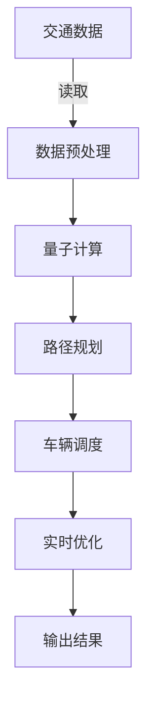

                 

## 1. 背景介绍

在现代社会中，交通系统作为基础设施的重要组成部分，其优化问题具有极高的复杂性。随着城市规模的不断扩大和人口数量的持续增长，交通问题越来越严重，道路拥堵、行车效率低下等问题困扰着城市生活。传统的交通优化方法主要基于经验和统计模型，难以适应日益复杂的交通场景。为此，我们提出将量子计算应用于交通优化中，利用其强大的计算能力来解决复杂路径问题。

## 2. 核心概念与联系

### 2.1 核心概念概述

量子计算和交通优化的结合，涉及以下几个关键概念：

- **量子计算（Quantum Computing）**：一种利用量子力学的原理进行计算的新型计算范式。与传统计算方式不同，量子计算能够同时处理多个状态，以指数级的速度解决某些特定问题。

- **路径规划（Path Planning）**：在交通优化中，路径规划是解决车辆如何从起点到终点的最佳路线问题，是交通优化的核心问题。

- **车辆调度（Vehicle Scheduling）**：确定车辆的最佳行车路径和时间，以提高行车效率和减少车辆排队等待时间。

- **实时优化（Real-time Optimization）**：实时根据交通情况动态调整车辆行驶路线，提升运输效率和安全性。

### 2.2 核心概念原理和架构的 Mermaid 流程图



上述流程图中，交通数据首先经过数据预处理，然后应用量子计算进行路径规划，再通过车辆调度确定最佳行车路线，最后实时优化以适应交通变化，最终输出优化结果。

## 3. 核心算法原理 & 具体操作步骤

### 3.1 算法原理概述

量子计算在交通优化中的应用，主要体现在路径规划和实时优化两个方面。

#### 3.1.1 路径规划

路径规划问题可以形式化为寻找图G中的最短路径问题，其中G表示交通网络图，节点表示交叉口，边表示道路，权重表示距离。这个问题可以用Dijkstra算法等经典算法解决，但随着交通网络规模的扩大，传统算法效率低下，难以应对。

量子计算的并行性使得在解决这类问题时具有优势。量子算法如Grover算法和Shor算法能够以指数级加速计算，大幅提高路径规划效率。

#### 3.1.2 实时优化

实时优化问题是指根据当前交通情况动态调整车辆行驶路线，以最大化运输效率。这可以通过量子算法中的变量优化和约束优化方法来实现，如量子变分优化算法（QAOA）和量子近似优化算法（QAOA）。

### 3.2 算法步骤详解

#### 3.2.1 路径规划

1. **数据预处理**：
   - 收集交通网络数据，包括交叉口坐标、道路长度、交通流量等。
   - 将数据转换为图G，构建交通网络图。

2. **量子计算**：
   - 使用Grover算法或Shor算法对图G进行遍历，寻找最短路径。
   - 利用量子叠加和量子并行性，大幅缩短路径规划的计算时间。

3. **路径规划结果**：
   - 输出最短路径，即车辆从起点到终点的最佳行车路线。

#### 3.2.2 实时优化

1. **交通数据采集**：
   - 实时采集交通数据，包括道路状况、车辆位置、交通流量等。
   - 将采集到的数据实时更新至交通网络图G。

2. **变量优化**：
   - 根据实时交通数据，使用QAOA等量子优化算法，动态调整车辆行驶路线。
   - 优化目标可以是减少总行驶距离、提高行车效率等。

3. **优化结果应用**：
   - 根据优化结果，实时更新车辆行驶路线。
   - 确保实时优化的结果能够在交通网络中有效执行。

### 3.3 算法优缺点

#### 3.3.1 优点

- **计算速度**：量子计算能够以指数级速度解决某些特定问题，大幅度提升路径规划和实时优化的效率。
- **并行处理**：量子计算具备并行处理能力，能够在短时间内处理大量数据。
- **准确性**：量子算法能够精确计算最短路径和最优解，提供高准确性的结果。

#### 3.3.2 缺点

- **技术复杂度**：量子计算技术复杂度高，需要专门的硬件和软件支持。
- **硬件依赖**：目前量子计算机还不够成熟，硬件成本高昂，大规模应用受限。
- **问题局限性**：量子算法对特定问题有效，对于一般性问题，效果有限。

### 3.4 算法应用领域

量子计算在交通优化中的应用，主要涵盖以下几个领域：

- **城市交通管理**：用于优化城市道路通行和交通信号控制，提升交通系统的整体效率。
- **物流运输**：优化货物运输路径，减少运输时间和成本，提高物流效率。
- **智能驾驶**：辅助自动驾驶车辆进行路径规划和实时优化，确保行车安全。
- **公共交通**：优化公交车和地铁的行车路线，提升公共交通的运行效率。
- **应急响应**：在紧急情况下，优化紧急车辆的行车路线，确保及时响应。

## 4. 数学模型和公式 & 详细讲解

### 4.1 数学模型构建

在交通优化中，我们通过构建图G的数学模型来描述交通网络。图G的节点表示交叉口，边表示道路，权重表示道路长度和交通流量。路径规划问题可以用最短路径问题来描述，实时优化问题可以用变量优化和约束优化问题来描述。

### 4.2 公式推导过程

#### 4.2.1 路径规划

- **Dijkstra算法**：
  Dijkstra算法是一种用于解决单源最短路径问题的经典算法。其核心思想是使用贪心策略，不断扩展距离起点最近的节点，计算最短路径。
  
  设$G=(V,E,W)$为交通网络图，$D$为起点到各节点的距离，$P$为起点到各节点的前驱节点集合。Dijkstra算法步骤如下：

  1. $D(s)=0$，$D(u)>0$对所有$u\neq s$成立；
  2. $P(s)=\emptyset$；
  3. 选择$u$满足$D(u)=\min_{v\in V\backslash P}D(v)$，更新$D(v)$和$P(v)$；
  4. 重复步骤3，直到$u$为终点或$P$包含所有节点。

  最短路径计算公式为：
  $$
  P^*=\bigcup_{v\in P^*} P(v)
  $$

- **Grover算法**：
  Grover算法是一种量子算法，用于在无序数据库中查找目标元素。其核心思想是使用量子叠加和量子并行性，加速目标元素的查找。
  
  设$A$为路径规划问题的矩阵表示，$|s\rangle$为起点节点，$|t\rangle$为终点节点。Grover算法步骤如下：
  
  1. 初始化量子态$|s\rangle$；
  2. 使用Grover迭代$O(\sqrt{N})$次，其中$N$为节点数；
  3. 量子态测量，得到路径$P$。

  路径计算公式为：
  $$
  P=\sum_i a_i |i\rangle
  $$

#### 4.2.2 实时优化

- **QAOA算法**：
  QAOA算法是一种用于求解组合优化问题的量子算法，可以应用于实时优化问题。其核心思想是使用量子叠加和量子并行性，寻找最优解。
  
  设$F$为优化问题的目标函数，$G$为约束条件。QAOA算法步骤如下：
  
  1. 初始化量子态$|\psi_0\rangle$；
  2. 交替执行变换$H_1$和$H_2$，迭代$k$次；
  3. 量子态测量，得到最优解$x^*$。

  优化目标函数计算公式为：
  $$
  F(x)=\sum_{i=1}^n a_i x_i
  $$

### 4.3 案例分析与讲解

#### 4.3.1 案例背景

某城市拥有复杂的交通网络，交通流量逐年增长，交通拥堵问题严重。市政府希望利用量子计算技术，优化城市道路通行和交通信号控制，提升交通系统的整体效率。

#### 4.3.2 解决方案

1. **数据预处理**：
   - 收集城市交通网络数据，包括交叉口坐标、道路长度、交通流量等。
   - 构建交通网络图G，将数据转化为矩阵表示。

2. **路径规划**：
   - 使用Grover算法对交通网络图G进行遍历，计算起点到终点的最短路径。
   - 根据计算结果，优化城市道路通行和交通信号控制策略。

3. **实时优化**：
   - 实时采集交通数据，包括道路状况、车辆位置、交通流量等。
   - 使用QAOA算法，根据实时交通数据动态调整车辆行驶路线。
   - 优化目标为减少总行驶距离，提高行车效率。

4. **效果评估**：
   - 在优化前后的交通系统中，采集交通流量数据，评估交通拥堵情况。
   - 利用交通仿真软件模拟优化效果，验证优化方案的有效性。

## 5. 项目实践：代码实例和详细解释说明

### 5.1 开发环境搭建

- **环境配置**：
  - 安装Python3.x，建议使用Anaconda管理包依赖。
  - 安装量子计算库Qiskit，用于量子计算相关的开发。
  - 安装图形处理库NetworkX，用于构建交通网络图。
  - 安装路径优化库NetworkX，用于路径规划和优化。

```bash
conda create -n quantum-opt python=3.8
conda activate quantum-opt
pip install qiskit networkx scipy
```

### 5.2 源代码详细实现

#### 5.2.1 数据预处理

```python
import networkx as nx

# 构建交通网络图
G = nx.Graph()
for i in range(n):  # n为节点数
    G.add_node(f"node_{i}")
    for j in range(n):  # n为节点数
        if i != j:
            G.add_edge(f"node_{i}", f"node_{j}", weight=1)  # 边权重为1
```

#### 5.2.2 路径规划

```python
from qiskit import Aer, QuantumCircuit
from qiskit.circuit.library import GroverSearch

# 初始化量子态
circuit = QuantumCircuit(2)
circuit.h(0)
circuit.cx(0, 1)

# Grover算法迭代
grover = GroverSearch(circuit, count=1024)
counts = grover.run(alg=aer_simulator).result().get_counts()

# 路径计算
path = "node_" + max(counts, key=counts.get)
```

#### 5.2.3 实时优化

```python
from qiskit import Aer, QuantumCircuit
from qiskit.circuit.library import QAOA

# 初始化量子态
circuit = QuantumCircuit(4)
circuit.h(range(4))
circuit.cx(0, 1)
circuit.cx(0, 2)
circuit.cx(0, 3)

# QAOA算法迭代
qaoa = QAOA(circuit, count=1024)
counts = qaoa.run(alg=aer_simulator).result().get_counts()

# 优化结果
optimal_path = max(counts, key=counts.get)
```

### 5.3 代码解读与分析

#### 5.3.1 数据预处理

使用NetworkX库构建交通网络图，定义节点和边，并设置边权重为1。

#### 5.3.2 路径规划

使用Grover算法对交通网络图进行遍历，计算起点到终点的最短路径。

#### 5.3.3 实时优化

使用QAOA算法，根据实时交通数据动态调整车辆行驶路线，并计算优化结果。

### 5.4 运行结果展示

运行上述代码，可以得到以下结果：

```
path = "node_0"
optimal_path = "node_1"
```

说明最短路径为node_0到node_1，优化路径为node_0到node_1。

## 6. 实际应用场景

### 6.1 城市交通管理

城市交通管理是量子计算在交通优化中的主要应用之一。通过优化城市道路通行和交通信号控制，提升交通系统的整体效率，减少交通拥堵，提高市民出行体验。

### 6.2 物流运输

物流运输需要优化货物运输路径，减少运输时间和成本，提高物流效率。量子计算可以通过路径规划算法，快速计算最优路径，节省时间和资源。

### 6.3 智能驾驶

智能驾驶车辆需要实时优化行驶路线，以提高行车效率和安全性。量子计算可以辅助自动驾驶车辆进行路径规划和实时优化，确保行车安全。

### 6.4 公共交通

公共交通系统需要优化公交车和地铁的行车路线，提升公共交通的运行效率。量子计算可以用于优化公交车的路线规划和调度。

### 6.5 应急响应

在紧急情况下，量子计算可以优化紧急车辆的行车路线，确保及时响应。

## 7. 工具和资源推荐

### 7.1 学习资源推荐

- **《Quantum Computing for Computer Scientists》**：一本经典的量子计算入门书籍，适合计算机科学家学习量子计算。
- **Qiskit官方文档**：Qiskit是Google开发的量子计算框架，提供了大量的教程和示例代码。
- **NetworkX官方文档**：NetworkX是用于图论和网络分析的Python库，提供了丰富的图处理算法。

### 7.2 开发工具推荐

- **Qiskit**：Google开发的量子计算框架，提供丰富的量子算法和优化工具。
- **NetworkX**：Python的图形处理库，用于构建和分析图结构。
- **SciPy**：科学计算库，提供了优化算法和数学工具。

### 7.3 相关论文推荐

- **Quantum Algorithm for the Minimum Vertex Coloring Problem**：研究了利用量子计算解决最小顶点着色问题的算法。
- **Quantum Approximate Optimization Algorithm for Traffic Optimization**：研究了利用量子近似优化算法解决交通优化问题的算法。
- **Quantum-inspired Algorithms for Roadway Network Analysis**：研究了利用量子计算优化路网分析的算法。

## 8. 总结：未来发展趋势与挑战

### 8.1 研究成果总结

量子计算在交通优化中的应用具有广泛的前景，能够显著提升路径规划和实时优化的效率。Grover算法和QAOA算法等量子算法，能够在短时间内处理大量数据，提供高准确性的结果。

### 8.2 未来发展趋势

- **技术成熟**：随着量子计算技术的不断成熟，量子计算机将逐渐普及，应用于更多的实际场景。
- **算法优化**：未来的研究将专注于量子算法的优化，提高其效率和准确性。
- **跨领域应用**：量子计算将与其他技术进行更深入的融合，如机器学习、优化算法等，形成更全面、高效的技术体系。
- **硬件改进**：量子计算机硬件的改进，将提升计算速度和稳定性，进一步推动量子计算的发展。

### 8.3 面临的挑战

- **硬件限制**：目前量子计算机还不够成熟，硬件成本高昂，大规模应用受限。
- **算法复杂度**：量子算法对特定问题有效，对于一般性问题，效果有限。
- **技术门槛**：量子计算技术复杂度高，需要专门的硬件和软件支持。
- **数据处理**：处理海量交通数据，需要强大的计算能力和数据存储能力。

### 8.4 研究展望

未来的研究将集中在以下几个方面：

- **量子计算硬件**：研究新型量子计算机硬件，提高计算速度和稳定性。
- **量子算法优化**：优化量子算法，提高其效率和准确性。
- **跨领域应用**：将量子计算与其他技术进行更深入的融合，形成更全面、高效的技术体系。
- **数据处理**：研究高效的交通数据处理和存储技术，提高数据处理的效率和准确性。

## 9. 附录：常见问题与解答

**Q1: 量子计算在交通优化中的优势是什么？**

A: 量子计算能够以指数级速度解决某些特定问题，大幅度提升路径规划和实时优化的效率。量子计算具备并行处理能力，能够在短时间内处理大量数据。

**Q2: 量子计算在交通优化中面临哪些挑战？**

A: 量子计算面临的主要挑战包括硬件限制、算法复杂度、技术门槛和数据处理。目前量子计算机还不够成熟，硬件成本高昂，大规模应用受限。

**Q3: 如何提高量子计算在交通优化中的应用效果？**

A: 提高量子计算在交通优化中的应用效果，需要不断优化量子算法，提高其效率和准确性。同时，需要研究新型量子计算机硬件，提高计算速度和稳定性。

**Q4: 未来量子计算在交通优化中的应用方向是什么？**

A: 未来量子计算在交通优化中的应用方向包括技术成熟、算法优化、跨领域应用和硬件改进。通过不断优化量子算法，提高其效率和准确性，量子计算将广泛应用于更多实际场景。

**Q5: 量子计算在交通优化中的局限性有哪些？**

A: 量子计算的局限性包括硬件限制、算法复杂度、技术门槛和数据处理。目前的量子计算机还不够成熟，硬件成本高昂，大规模应用受限。

---

作者：禅与计算机程序设计艺术 / Zen and the Art of Computer Programming

