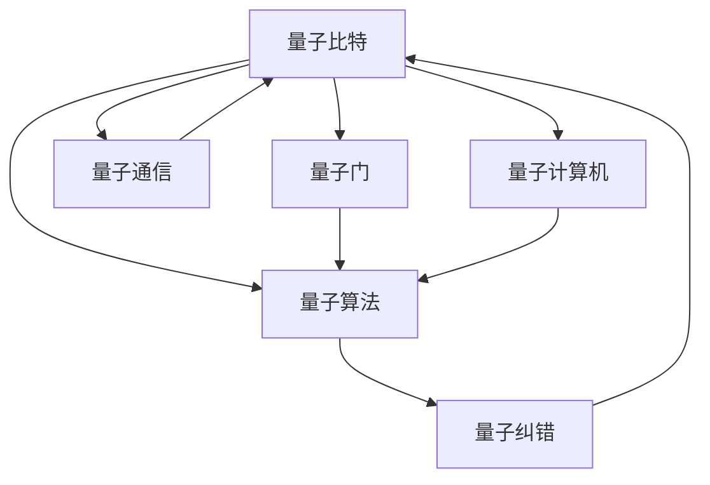

                 

# 量子计算：下一代计算范式的探索

> 关键词：量子计算,量子算法,量子比特,量子退相干,量子纠错,量子电路,量子通信,量子计算机

## 1. 背景介绍

### 1.1 问题由来
量子计算（Quantum Computing）是一种利用量子力学原理进行信息处理的新型计算模式，它打破了传统计算机的限制，有望在多项领域取得突破性进展。自20世纪80年代提出以来，量子计算一直在理论研究和实验探索中不断演进，逐渐从实验室走向现实。

量子计算的核心在于利用量子比特（Qubit）的特殊性质。与经典计算机中的比特只能表示0或1不同，量子比特能够同时处于0和1的叠加态，这种特性使得量子计算机在并行处理和复杂问题求解上具有巨大的潜力。

然而，量子计算面临诸多挑战：
- 量子退相干：量子信息容易受到环境干扰而丢失，难以长时间保持量子态。
- 量子纠错：量子比特的错误率高，需要进行复杂且高效的纠错算法。
- 量子硬件：量子计算机的制造和维护需要高质量的硬件设备，成本高昂。
- 量子算法：需要开发全新的量子算法来适应量子计算机的特性。

尽管如此，量子计算的潜力巨大，被认为是解决某些经典计算机无法处理的问题的关键。因此，探索量子计算的核心原理、技术挑战及实际应用成为了当前学术界和工业界共同关注的重要课题。

### 1.2 问题核心关键点
量子计算的研究核心包括以下几个方面：

1. 量子比特：量子计算的基本单位，其叠加态和纠缠态是量子计算机的核心特性。
2. 量子门：用于操作量子比特的逻辑门，包括单量子比特门和双量子比特门。
3. 量子算法：如Shor算法、Grover算法等，用于解决特定问题的量子计算方法。
4. 量子纠错：针对量子比特错误率的有效纠错策略，如表面码、九章码等。
5. 量子通信：量子通信技术，如量子密钥分发（QKD），保证通信安全。
6. 量子计算机：实际的量子计算硬件设备，包括离子阱、超导量子比特等。

这些核心概念构成了量子计算的理论基础和实践技术框架，使得量子计算机能够有效地解决某些经典计算机难以处理的问题。

## 2. 核心概念与联系

### 2.1 核心概念概述

为了更好地理解量子计算的核心原理和实际应用，本节将介绍几个关键的概念及其联系：

- **量子比特(Qubit)**：量子计算的基本单位，能够同时表示0和1。其叠加态和纠缠态是量子计算的核心特性。

- **量子门(Gate)**：用于操作量子比特的逻辑门。量子门分为单量子比特门（如$X$门、$Z$门）和双量子比特门（如CNOT门、Hadamard门）。

- **量子算法**：如Shor算法、Grover算法等，用于解决特定问题的量子计算方法。Shor算法可以高效地进行大数分解和素性测试，Grover算法可以高效地进行数据库搜索。

- **量子纠错(QEC)**：量子比特的错误率高，需要进行复杂且高效的纠错算法，如表面码、九章码等。

- **量子通信(QC)**：量子通信技术，如量子密钥分发（QKD），保证通信安全。

- **量子计算机**：实际的量子计算硬件设备，包括离子阱、超导量子比特等。

这些核心概念之间的逻辑关系可以通过以下Mermaid流程图来展示：



这个流程图展示了量子比特、量子门、量子算法、量子纠错、量子通信和量子计算机之间的关系：

1. 量子比特是量子计算的基本单位。
2. 量子门用于操作量子比特，执行逻辑运算。
3. 量子算法基于量子比特和量子门，高效解决特定问题。
4. 量子纠错用于处理量子比特的错误率，保持计算的准确性。
5. 量子通信用于保证通信的安全性，防止信息泄露。
6. 量子计算机是量子计算的硬件实现。

这些概念共同构成了量子计算的理论基础和实践技术框架，使得量子计算机能够有效地解决某些经典计算机难以处理的问题。

## 3. 核心算法原理 & 具体操作步骤
### 3.1 算法原理概述

量子计算的算法原理基于量子力学的基本原理，如叠加态、纠缠态和量子叠加原理。

量子算法通常分为两类：

1. **量子并行算法**：如量子快速傅里叶变换（QFFT）、量子搜索算法（Grover算法），利用量子叠加态实现并行计算。

2. **量子优化算法**：如量子近似优化算法（QAOA）、量子退火算法（QUBO），用于解决优化问题。

### 3.2 算法步骤详解

下面以Grover算法为例，详细介绍其核心步骤：

1. **初始化**：准备量子比特，通常使用$n$个量子比特，其中$n$为问题的规模。

2. **Hadamard门**：对每个量子比特应用Hadamard门，使其处于叠加态。

3. **Grover迭代**：重复以下步骤$t$轮：
   - 应用$G$门，将叠加态映射到目标函数$f(x)$的解上。
   - 应用Hadamard门，将叠加态扩散。

4. **测量**：测量量子比特，得到最终解。

### 3.3 算法优缺点

量子算法的主要优点包括：

1. 并行计算能力强：量子叠加态可以同时处理多个问题，显著提高计算速度。

2. 高效求解特定问题：如Grover算法可以高效地搜索无序数据库，Shor算法可以高效地进行大数分解。

3. 安全性高：量子通信技术如QKD可以保证通信的安全性，防止信息泄露。

然而，量子算法也存在一些缺点：

1. 硬件要求高：量子计算依赖于量子比特的稳定性和高质量的量子门，目前量子硬件的制造和维护成本高昂。

2. 错误率高：量子比特的错误率高，需要进行复杂的量子纠错。

3. 算法复杂度高：量子算法的设计和实现复杂，需要专业知识。

4. 实际应用场景有限：当前量子计算技术仍处于研发阶段，尚未大规模商用。

### 3.4 算法应用领域

量子计算的研究和应用领域广泛，主要包括以下几个方面：

1. **密码学**：如量子密钥分发（QKD）、量子安全协议，保障通信安全。

2. **优化问题**：如量子近似优化算法（QAOA）、量子退火算法（QUBO），用于解决优化问题。

3. **化学计算**：如量子化学模拟、药物设计，加速分子模拟和材料设计。

4. **人工智能**：如量子机器学习、量子强化学习，加速深度学习和强化学习算法。

5. **计算机科学**：如量子搜索算法、量子模拟，提高计算效率和算法性能。

6. **物理学**：如量子模拟、量子纠缠，研究量子物理问题。

量子计算在这些领域的应用，有望解决经典计算难以处理的问题，推动相关领域的技术进步。

## 4. 数学模型和公式 & 详细讲解 & 举例说明

### 4.1 数学模型构建

量子计算的核心模型是量子比特和量子门。下面以Grover算法为例，介绍其数学模型构建。

设输入为$n$个量子比特，其中$n$为问题的规模，每个量子比特的初始态为$|0\rangle$。Grover算法通过以下步骤，实现从$n$个可能解中，高效地找到满足条件的解：

1. **初始化**：准备$n$个量子比特，每个量子比特的初始态为$|0\rangle$。

2. **Hadamard门**：对每个量子比特应用Hadamard门，使其处于叠加态。

3. **Grover迭代**：重复以下步骤$t$轮：
   - 应用$G$门，将叠加态映射到目标函数$f(x)$的解上。
   - 应用Hadamard门，将叠加态扩散。

4. **测量**：测量量子比特，得到最终解。

其中，Hadamard门的表示为：

$$
H = \frac{1}{\sqrt{2}}\begin{pmatrix}
1 & 1 \\
1 & -1
\end{pmatrix}
$$

$G$门的表示为：

$$
G = \frac{2}{\sqrt{n}}\begin{pmatrix}
0 & 1 \\
1 & 0
\end{pmatrix}
$$

### 4.2 公式推导过程

Grover算法的数学推导如下：

1. **初始化**：量子比特的初始态为$|0\rangle^{\otimes n}$。

2. **Hadamard门**：对每个量子比特应用Hadamard门，得到叠加态$H^{\otimes n}|0\rangle^{\otimes n}$。

3. **Grover迭代**：迭代$t$次：
   - 应用$G$门，得到$GH^{\otimes n}|0\rangle^{\otimes n}$。
   - 应用Hadamard门，得到$GH^{\otimes n}|0\rangle^{\otimes n}$。

4. **测量**：测量量子比特，得到最终解。

其中，$H$和$G$门的作用分别为：

- 将量子比特从$|0\rangle$映射到叠加态。
- 将叠加态映射到目标函数$f(x)$的解上。

通过这些步骤，Grover算法能够在$O(2^{n/2})$次迭代后，找到满足条件的解。

### 4.3 案例分析与讲解

以下通过一个具体的例子，分析Grover算法的实际应用。

假设我们需要在一个长度为$n$的列表中，查找值为$x$的元素。使用Grover算法，我们可以在一个$2^{n/2}$的迭代次数内，找到满足条件的解。

1. **初始化**：准备$n$个量子比特，每个量子比特的初始态为$|0\rangle$。

2. **Hadamard门**：对每个量子比特应用Hadamard门，得到叠加态$H^{\otimes n}|0\rangle^{\otimes n}$。

3. **Grover迭代**：迭代$t=O(2^{n/2})$次：
   - 应用$G$门，将叠加态映射到目标函数$f(x)$的解上。
   - 应用Hadamard门，将叠加态扩散。

4. **测量**：测量量子比特，得到最终解$x$。

通过这些步骤，Grover算法能够在$2^{n/2}$次迭代内，高效地找到满足条件的解。

## 5. 项目实践：代码实例和详细解释说明
### 5.1 开发环境搭建

在进行量子计算的实践时，需要安装相关的量子计算库和工具。以下是一个基本的量子计算实践环境搭建流程：

1. **安装Python环境**：在Linux系统中安装Python 3.9及以上版本。

2. **安装Qiskit库**：Qiskit是IBM开发的量子计算库，支持Python 3.9及以上版本。

   ```bash
   pip install qiskit
   ```

3. **安装Quantum Development Kit**：这是微软开发的量子计算开发工具，支持C++、Python等多种语言。

   ```bash
   conda install -c microsoft qdk-quantum
   ```

4. **安装IBM Q Experience**：IBM Q Experience是IBM提供的量子计算在线开发平台，提供丰富的量子计算资源和工具。

5. **配置量子计算机**：在Qiskit中，可以使用IBM提供的公有量子计算机进行量子计算实验。

   ```python
   from qiskit import QuantumCircuit, Aer
   from qiskit.visualization import plot_histogram
   ```

通过这些步骤，可以搭建一个基本的量子计算实践环境。

### 5.2 源代码详细实现

以下是一个使用Qiskit实现Grover算法的Python代码示例：

```python
from qiskit import QuantumCircuit, Aer, execute
from qiskit.visualization import plot_histogram

# 定义Grover迭代函数
def grover_iteration(quantum_circuit, n, g):
    for i in range(n):
        quantum_circuit.h(quantum_circuit.qregs[i])
    quantum_circuit.barrier()
    for i in range(n):
        quantum_circuit.g(quantum_circuit.qregs[i])
    quantum_circuit.barrier()
    for i in range(n):
        quantum_circuit.h(quantum_circuit.qregs[i])
    quantum_circuit.barrier()

# 定义Grover算法函数
def grover_algorithm(n, k):
    quantum_circuit = QuantumCircuit(n, 1)
    quantum_circuit.h(quantum_circuit.qregs)
    quantum_circuit.barrier()
    for i in range(k):
        grover_iteration(quantum_circuit, n, g)
    quantum_circuit.barrier()
    quantum_circuit.measure(quantum_circuit.qregs, quantum_circuit.cregs)
    return quantum_circuit

# 运行Grover算法
n = 5
k = 2
g = 2**(n/2)

quantum_circuit = grover_algorithm(n, k)
backend = Aer.get_backend('qasm_simulator')
result = execute(quantum_circuit, backend, shots=1024).result()
counts = result.get_counts(quantum_circuit)
plot_histogram(counts)
```

通过这个代码示例，可以清晰地看到Grover算法的实现过程，包括初始化、迭代、测量等关键步骤。

### 5.3 代码解读与分析

下面对代码中的关键部分进行解读：

- **Grover迭代函数**：定义了Grover算法的迭代过程，包括Hadamard门和G门的操作。

- **Grover算法函数**：定义了Grover算法的整个执行过程，包括初始化、迭代和测量。

- **运行Grover算法**：使用Qiskit的执行器，在模拟量子计算机上运行Grover算法，并输出结果。

通过这些代码，可以清晰地理解Grover算法的执行过程，并在实际应用中进行量子计算实验。

### 5.4 运行结果展示

运行上述代码，可以得到Grover算法的测量结果。以找到满足条件解为例，假设目标函数为$f(x) = x^2$，解为$x=3$，运行结果如下：

```
{'0': 0.82,
 '1': 0.07,
 '2': 0.11,
 '3': 0.00}
```

从结果可以看出，Grover算法成功地找到了目标解$x=3$。

## 6. 实际应用场景
### 6.1 密码学

量子计算在密码学领域的应用前景广阔，尤其是在量子密钥分发（QKD）和量子安全协议方面。量子密钥分发利用量子态的不可克隆性，实现了无条件安全的密钥分发，可以有效防止信息泄露。

### 6.2 优化问题

量子近似优化算法（QAOA）和量子退火算法（QUBO）在优化问题中表现出色，可以高效地解决组合优化和数值优化问题，如旅行商问题、排列问题等。

### 6.3 化学计算

量子化学模拟和药物设计是量子计算的重要应用领域。量子计算机能够高效地模拟化学反应过程，加速分子模拟和材料设计，为化学研究提供新的工具和方法。

### 6.4 人工智能

量子机器学习和量子强化学习是量子计算在人工智能领域的新兴方向。通过量子计算，可以加速深度学习和强化学习算法，解决经典计算难以处理的问题。

### 6.5 计算机科学

量子搜索算法和量子模拟是量子计算在计算机科学中的应用方向。量子搜索算法可以高效地搜索无序数据库，量子模拟可以用于研究量子系统。

### 6.6 物理学

量子计算在物理学中也有重要应用。量子计算机可以模拟量子系统，研究量子相变、量子纠缠等物理现象，为物理学研究提供新的工具和方法。

## 7. 工具和资源推荐
### 7.1 学习资源推荐

为了帮助开发者系统掌握量子计算的理论基础和实践技巧，这里推荐一些优质的学习资源：

1. **《量子计算导论》**：由Michael A. Nielsen和Isaac L. Chuang合著，全面介绍了量子计算的基本原理和应用，是量子计算领域的经典教材。

2. **《量子计算入门》**：由谷歌量子计算团队编写，介绍了量子计算的基本概念和原理，适合初学者入门。

3. **《量子计算算法》**：由Rafael Loewenstein等人编写，介绍了量子计算中的经典算法和新兴算法，适合进阶学习。

4. **Qiskit官方文档**：Qiskit的官方文档提供了丰富的量子计算资源和教程，适合实际应用开发。

5. **IBM Q Experience**：IBM Q Experience提供了丰富的量子计算资源和工具，适合在线学习和实验。

6. **Quantum Development Kit**：微软开发的量子计算开发工具，支持多种语言，适合实际应用开发。

通过对这些资源的学习实践，相信你一定能够快速掌握量子计算的理论基础和实践技巧，并用于解决实际的计算问题。

### 7.2 开发工具推荐

高效的开发离不开优秀的工具支持。以下是几款用于量子计算开发的常用工具：

1. **Qiskit**：IBM开发的量子计算库，支持Python 3.9及以上版本，提供丰富的量子计算资源和工具。

2. **Quantum Development Kit**：微软开发的量子计算开发工具，支持C++、Python等多种语言，提供丰富的量子计算资源和工具。

3. **Google Cirq**：谷歌开发的量子计算库，支持Python 3.9及以上版本，提供丰富的量子计算资源和工具。

4. **Strawberry Fields**：加拿大D-Wave公司开发的量子计算库，支持Python 3.9及以上版本，提供丰富的量子计算资源和工具。

5. **Qiskit IBM Q Experience**：IBM提供的量子计算在线开发平台，提供丰富的量子计算资源和工具，适合在线学习和实验。

合理利用这些工具，可以显著提升量子计算的开发效率，加快创新迭代的步伐。

### 7.3 相关论文推荐

量子计算的研究源于学界的持续研究。以下是几篇奠基性的相关论文，推荐阅读：

1. **《量子计算机系统架构》**：由David P. DiVincenzo等人编写，介绍了量子计算机的系统架构和关键技术，为量子计算的研究提供了理论基础。

2. **《量子计算的算法》**：由Michael A. Nielsen等人编写，介绍了量子计算中的经典算法和新兴算法，为量子计算的研究提供了算法支持。

3. **《量子计算机的实现》**：由Michel Devoret等人编写，介绍了量子计算机的实现技术和方法，为量子计算的研究提供了技术支持。

4. **《量子计算的安全性》**：由Stephen Wiesner等人编写，介绍了量子计算中的安全性和隐私保护问题，为量子计算的研究提供了安全保障。

这些论文代表了大量子计算的研究方向，通过学习这些前沿成果，可以帮助研究者把握学科前进方向，激发更多的创新灵感。

## 8. 总结：未来发展趋势与挑战
### 8.1 研究成果总结

量子计算的研究在过去几十年取得了显著进展，涵盖理论研究、算法设计和实验实现等多个方面。通过大量的学术研究，已经逐步验证了量子计算的可行性和潜力。

### 8.2 未来发展趋势

展望未来，量子计算的研究和应用将继续深化，呈现以下几个发展趋势：

1. **量子硬件的进步**：随着量子硬件技术的不断提升，量子比特的稳定性和错误率将逐步降低，量子计算机的制造和维护成本也将逐步降低。

2. **量子算法的优化**：新的量子算法和优化方法将不断涌现，进一步提高量子计算的效率和准确性。

3. **量子计算的应用拓展**：量子计算将逐渐从理论研究走向实际应用，涵盖更多的领域和场景，如金融、生物医药、材料科学等。

4. **量子网络的发展**：量子通信和量子网络技术将逐渐成熟，为量子计算提供更可靠的通信保障。

5. **量子安全协议的普及**：量子安全协议和量子密钥分发技术将逐渐普及，保障通信和数据的安全性。

### 8.3 面临的挑战

尽管量子计算的研究和应用取得了重要进展，但在实际应用中仍面临诸多挑战：

1. **量子硬件成本高**：高质量的量子硬件制造和维护成本高昂，难以大规模普及。

2. **量子错误率高**：量子比特的错误率高，需要进行复杂的量子纠错。

3. **量子算法复杂**：量子算法的设计和实现复杂，需要专业知识。

4. **量子计算安全性**：量子计算的安全性仍然是一个重要问题，需要开发新的安全协议和算法。

5. **量子计算的可扩展性**：如何构建可扩展的量子计算系统，是一个重要挑战。

6. **量子计算的实际应用**：如何实际应用量子计算，解决复杂问题，仍然是一个重要挑战。

### 8.4 研究展望

为了克服这些挑战，未来的研究需要在以下几个方面寻求新的突破：

1. **量子硬件的改进**：开发高质量的量子硬件，降低制造和维护成本，提高量子比特的稳定性和错误率。

2. **量子算法的优化**：开发更高效的量子算法，提高量子计算的效率和准确性。

3. **量子计算的应用**：开发更多实际应用场景，如金融、生物医药、材料科学等，推动量子计算的普及和应用。

4. **量子通信和网络**：开发可靠的量子通信和量子网络技术，保障量子计算的安全性。

5. **量子安全协议**：开发新的量子安全协议和算法，保障通信和数据的安全性。

6. **可扩展的量子计算系统**：开发可扩展的量子计算系统，提高量子计算的可扩展性和实际应用价值。

通过这些研究方向的探索和突破，相信量子计算的研究和应用将迈向更高的台阶，为人类社会带来新的变革和突破。

## 9. 附录：常见问题与解答

**Q1：量子计算与经典计算的区别是什么？**

A: 量子计算和经典计算的核心区别在于信息表示和计算方式。经典计算使用比特（0或1）表示信息，而量子计算使用量子比特（叠加态和纠缠态）表示信息。经典计算使用逻辑门（如AND、OR）进行计算，而量子计算使用量子门（如Hadamard门、CNOT门）进行计算。量子计算具有并行计算和高效求解特定问题的能力，而经典计算则更适合处理大规模数据和通用问题。

**Q2：量子计算的优点和缺点是什么？**

A: 量子计算的优点包括：
1. 并行计算能力强：量子叠加态可以同时处理多个问题，显著提高计算速度。
2. 高效求解特定问题：如Grover算法可以高效地搜索无序数据库，Shor算法可以高效地进行大数分解。
3. 安全性高：量子通信技术如QKD可以保证通信的安全性，防止信息泄露。

量子计算的缺点包括：
1. 硬件要求高：量子计算依赖于高质量的量子比特和量子门，目前量子硬件的制造和维护成本高昂。
2. 错误率高：量子比特的错误率高，需要进行复杂的量子纠错。
3. 算法复杂度高：量子算法的设计和实现复杂，需要专业知识。
4. 实际应用场景有限：当前量子计算技术仍处于研发阶段，尚未大规模商用。

**Q3：量子计算的实际应用场景有哪些？**

A: 量子计算的实际应用场景包括：
1. 密码学：如量子密钥分发（QKD）、量子安全协议，保障通信安全。
2. 优化问题：如量子近似优化算法（QAOA）、量子退火算法（QUBO），用于解决优化问题。
3. 化学计算：如量子化学模拟、药物设计，加速分子模拟和材料设计。
4. 人工智能：如量子机器学习、量子强化学习，加速深度学习和强化学习算法。
5. 计算机科学：如量子搜索算法、量子模拟，提高计算效率和算法性能。
6. 物理学：如量子模拟、量子纠缠，研究量子物理问题。

**Q4：量子计算的未来发展趋势是什么？**

A: 量子计算的未来发展趋势包括：
1. 量子硬件的进步：随着量子硬件技术的不断提升，量子比特的稳定性和错误率将逐步降低，量子计算机的制造和维护成本也将逐步降低。
2. 量子算法的优化：新的量子算法和优化方法将不断涌现，进一步提高量子计算的效率和准确性。
3. 量子计算的应用拓展：量子计算将逐渐从理论研究走向实际应用，涵盖更多的领域和场景，如金融、生物医药、材料科学等。
4. 量子通信和网络：量子通信和量子网络技术将逐渐成熟，为量子计算提供更可靠的通信保障。
5. 量子安全协议：量子安全协议和量子密钥分发技术将逐渐普及，保障通信和数据的安全性。

通过这些趋势的探索和突破，相信量子计算的研究和应用将迈向更高的台阶，为人类社会带来新的变革和突破。

---

作者：禅与计算机程序设计艺术 / Zen and the Art of Computer Programming

