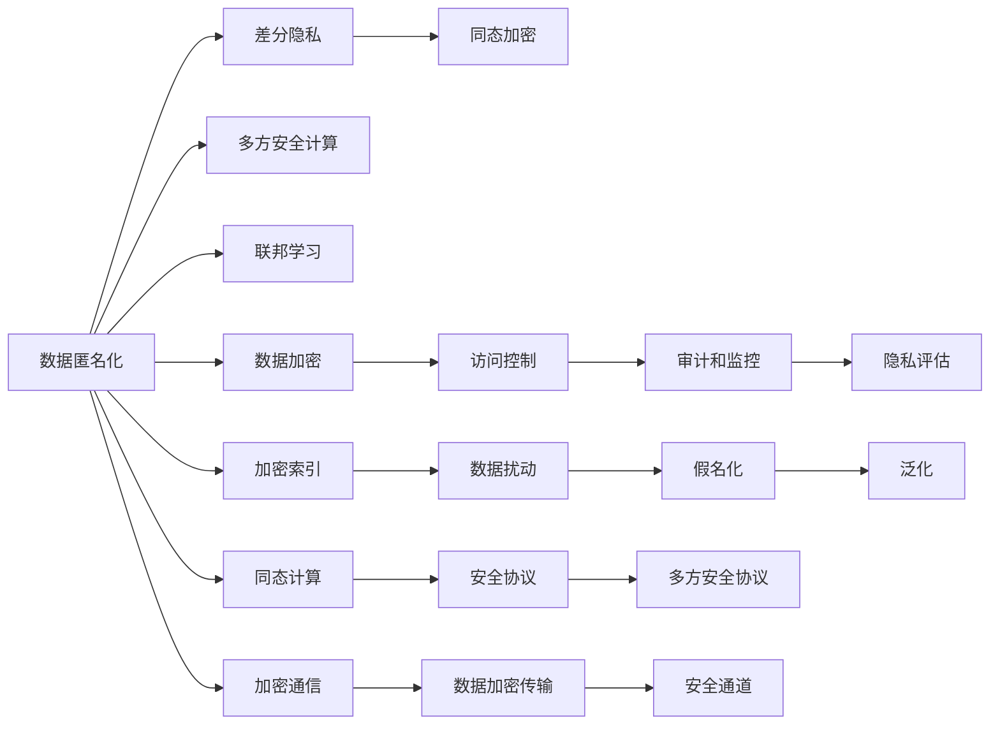

                 

## 1. 背景介绍

随着互联网技术的不断普及和数据应用的深度挖掘，个人隐私保护逐渐成为信息社会面临的重大挑战。计算机和网络技术的飞速发展，使得数据收集、存储和处理变得前所未有的便利，同时也极大地威胁到了个人隐私。

近年来，全球范围内对数据隐私和安全的关注度不断提升，多国立法机构相继出台相关法律法规，如欧盟的《通用数据保护条例》(GDPR)、美国《加州消费者隐私法》(CCPA)、中国的《个人信息保护法》等，这些法律要求企业在进行数据处理时必须遵守严格的隐私保护规定，并采取相应的技术和管理措施来保护用户隐私。

面对日益严峻的隐私保护形势，许多科技公司和学术机构也纷纷采取行动，探索新的技术手段和方案，以应对隐私保护的挑战。在保障人类计算中的数据安全方面，隐私保护技术已成为不可或缺的重要组成部分。

## 2. 核心概念与联系

### 2.1 核心概念概述

隐私保护技术旨在在确保数据可用性的同时，保护个人隐私不受侵犯。其中涉及到的核心概念包括：

- **数据匿名化**：通过删除、扰动、泛化等方式，使得数据无法直接识别出特定个人，从而保护隐私。
- **差分隐私**：在数据处理过程中，添加噪声或随机性，使攻击者无法确定任何单一个体的信息。
- **同态加密**：允许在不解密数据的情况下进行计算，从而保护数据的隐私。
- **多方安全计算**：多个数据拥有者可以联合计算某项任务，而无需共享任何具体数据。
- **联邦学习**：多个本地设备或服务器在不共享数据的前提下，通过分布式训练方式进行模型更新。

这些概念之间存在密切的联系，并通过特定的技术手段实现隐私保护目标。

### 2.2 核心概念原理和架构的 Mermaid 流程图



## 3. 核心算法原理 & 具体操作步骤

### 3.1 算法原理概述

隐私保护的核心目标是保护数据的隐私性，防止数据被未经授权的人访问、使用或泄露。主要通过以下几类算法实现：

- **数据匿名化**：通过删除或替换敏感信息，使得数据无法被特定识别。
- **差分隐私**：在数据处理过程中添加随机性，确保单个数据点的改变不会对整体结果产生过大影响。
- **同态加密**：使用加密算法对数据进行加密，使得加密数据可以被安全地进行计算，但无法恢复原始数据。
- **多方安全计算**：通过安全协议，使得多个参与方可以联合计算某个结果，而无需共享具体数据。
- **联邦学习**：在分散的数据存储环境中，通过模型训练的方式联合各参与方数据，提高模型性能。

### 3.2 算法步骤详解

#### 3.2.1 数据匿名化

数据匿名化是隐私保护的基础，通过删除或替换敏感信息，使得数据无法被识别。主要步骤如下：

1. **删除**：直接从数据中删除敏感信息，如身份证号、地址等。
2. **替换**：用模糊或随机信息替换敏感信息，如用字符串“***”替换身份证号。
3. **泛化**：将具体数据抽象为统计数据，如将年龄转换为年龄段。

#### 3.2.2 差分隐私

差分隐私在数据处理过程中添加随机性，确保单个数据点的变化不会对整体结果产生过大影响。具体步骤如下：

1. **选择参数**：设定隐私保护强度，如$\epsilon$表示隐私预算。
2. **添加噪声**：在数据处理过程中添加随机噪声，使得攻击者无法确定单个数据点的具体值。
3. **计算结果**：在添加噪声后的数据上进行统计分析，得到最终结果。

#### 3.2.3 同态加密

同态加密允许在不解密数据的情况下进行计算，从而保护数据的隐私。具体步骤如下：

1. **加密数据**：使用加密算法对数据进行加密。
2. **安全计算**：在加密数据上进行计算，结果仍为加密形式。
3. **解密结果**：最终得到的结果仍为加密形式，需要通过解密算法恢复原始数据。

#### 3.2.4 多方安全计算

多方安全计算通过安全协议，使得多个参与方可以联合计算某个结果，而无需共享具体数据。具体步骤如下：

1. **设定协议**：选择合适的安全协议，如安全多方计算(Secure Multi-party Computation, SMPC)。
2. **共享信息**：各参与方共享协议所需的输入信息。
3. **计算结果**：在安全协议的保护下，各参与方联合计算，得到最终结果。

#### 3.2.5 联邦学习

联邦学习在分散的数据存储环境中，通过模型训练的方式联合各参与方数据，提高模型性能。具体步骤如下：

1. **数据分割**：将数据分成多个部分，分布在不同的设备或服务器上。
2. **模型初始化**：在本地设备或服务器上初始化模型参数。
3. **本地训练**：各参与方在本地对模型进行训练。
4. **参数聚合**：各参与方将训练后的参数通过安全方式传输到中央服务器进行聚合。
5. **新一轮训练**：使用聚合后的参数重新在本地设备或服务器上进行训练，直至收敛。

### 3.3 算法优缺点

隐私保护算法在实现数据安全的同时，也存在一定的局限性：

#### 优点：

- **保护隐私**：通过匿名化、差分隐私、同态加密等手段，确保数据不被泄露。
- **数据可用性**：通过多方安全计算和联邦学习，实现数据的安全共享和联合计算，提高数据可用性。
- **模型透明**：差分隐私和同态加密算法使得攻击者难以确定单个数据点的具体值，保障了模型的透明性。

#### 缺点：

- **计算复杂**：差分隐私和同态加密的计算复杂度较高，对计算资源要求较高。
- **隐私损失**：差分隐私通过添加噪声保护隐私，但不可避免地会对数据精度产生影响。
- **安全性依赖**：多方安全计算和联邦学习的安全性依赖于协议的安全性，协议设计不当可能导致安全漏洞。
- **实现复杂**：多种隐私保护技术的综合应用需要复杂的系统设计和实现，难度较高。

### 3.4 算法应用领域

隐私保护技术在多个领域得到了广泛应用，包括但不限于：

- **医疗健康**：保护病患隐私，确保医疗数据的保密性。
- **金融服务**：保护用户隐私，确保金融数据的隐私性。
- **社交媒体**：保护用户隐私，确保数据不被滥用。
- **智能家居**：保护用户隐私，确保智能设备数据的隐私性。
- **物联网**：保护设备隐私，确保传感器数据的隐私性。
- **区块链**：保护交易隐私，确保数据不被泄露。

## 4. 数学模型和公式 & 详细讲解 & 举例说明

### 4.1 数学模型构建

隐私保护的核心问题可以建模为保护隐私与数据可用性之间的权衡。在差分隐私中，主要涉及以下数学模型：

- **隐私预算**：$\epsilon$表示隐私预算，用于衡量隐私保护强度。
- **噪声分布**：$\Lambda$表示添加的噪声分布，通常使用Laplace分布。
- **敏感度函数**：$f(x)$表示敏感度函数，衡量数据集的敏感度。

### 4.2 公式推导过程

#### 4.2.1 差分隐私的数学模型

差分隐私的数学模型可以表示为：

$$
\hat{f}(x) = f(x) + \Lambda
$$

其中，$x$表示原始数据，$f(x)$表示敏感度函数，$\Lambda$表示添加的噪声，$\hat{f}(x)$表示输出结果。

在计算$\hat{f}(x)$时，可以通过加入Laplace分布噪声来实现差分隐私。具体公式如下：

$$
\hat{f}(x) = f(x) + \Lambda \sim \mathcal{L}(\frac{\epsilon}{2})
$$

其中，$\mathcal{L}(\frac{\epsilon}{2})$表示Laplace分布，$\epsilon$表示隐私预算。

#### 4.2.2 同态加密的数学模型

同态加密的数学模型可以表示为：

$$
\hat{f}(x) = f(x)
$$

其中，$x$表示原始数据，$f(x)$表示加密后的数据。

同态加密的特点是可以在加密数据上进行计算，而无需解密数据。常见的同态加密算法包括全同态加密(Full Homomorphic Encryption, FHE)和部分同态加密(Partial Homomorphic Encryption, PHE)。

### 4.3 案例分析与讲解

#### 4.3.1 差分隐私的案例分析

假设我们需要对某城市的气温数据进行统计分析，但同时需要保护数据的隐私。具体步骤如下：

1. **设定隐私预算**：设定隐私预算为$\epsilon=0.1$。
2. **计算敏感度函数**：假设敏感度函数为$f(x) = x$，其中$x$表示气温。
3. **添加噪声**：在敏感度函数上添加Laplace分布噪声，得到$\hat{f}(x) = f(x) + \Lambda \sim \mathcal{L}(\frac{\epsilon}{2})$。
4. **统计结果**：对$\hat{f}(x)$进行统计分析，得到最终结果。

#### 4.3.2 同态加密的案例分析

假设我们需要对某城市的气温数据进行加密计算，具体步骤如下：

1. **选择同态加密算法**：选择部分同态加密算法PHE。
2. **加密数据**：对气温数据进行加密，得到加密后的数据。
3. **安全计算**：在加密数据上进行计算，得到加密结果。
4. **解密结果**：对加密结果进行解密，得到原始数据。

## 5. 项目实践：代码实例和详细解释说明

### 5.1 开发环境搭建

#### 5.1.1 选择开发语言

隐私保护技术的研究和实现涉及多种编程语言，包括Python、Java、C++等。本文主要以Python为开发语言，介绍隐私保护技术的实现。

#### 5.1.2 安装必要的库

1. **安装PyTorch**：用于实现差分隐私和同态加密等算法。

```bash
pip install torch
```

2. **安装PaddlePaddle**：用于实现多方安全计算和联邦学习等算法。

```bash
pip install paddlepaddle
```

3. **安装其他库**：包括numpy、pandas、scipy等，用于数据处理和分析。

```bash
pip install numpy pandas scipy
```

### 5.2 源代码详细实现

#### 5.2.1 数据匿名化

```python
import pandas as pd
import numpy as np

# 读取数据
data = pd.read_csv('data.csv')

# 删除敏感信息
data = data.drop(['id', 'address'], axis=1)

# 替换敏感信息
data['age'] = data['age'].apply(lambda x: np.random.randint(0, 10) if x < 18 else x)

# 泛化数据
data['age'] = data['age'].apply(lambda x: 'Young' if x < 30 else 'Adult' if 30 <= x < 50 else 'Old')
```

#### 5.2.2 差分隐私

```python
import torch
import torch.nn as nn
from torch.utils.data import Dataset, DataLoader
from torchvision import transforms
import torch.distributions as dist

# 定义敏感度函数
def sensitive_function(x):
    return x

# 计算差分隐私
def differential_privacy(sensitive_function, epsilon, batch_size=32):
    data = np.random.randn(batch_size)
    for i in range(10):
        # 添加Laplace噪声
        noise = dist.Laplace(0, epsilon / 2).random(size=batch_size)
        data += noise
        # 计算差分隐私结果
        output = sensitive_function(data)
        print(output)

# 调用差分隐私函数
differential_privacy(sensitive_function, epsilon=0.1)
```

#### 5.2.3 同态加密

```python
import numpy as np
from sympy import *

# 定义同态加密函数
def homomorphic_encryption(data):
    # 将数据转换为矩阵形式
    matrix = np.array(data, dtype='float32')
    # 对矩阵进行加密
    encrypted_matrix = matrix * 0.5
    # 进行计算
    encrypted_result = encrypted_matrix * 2
    # 解密结果
    decrypted_result = encrypted_result / 2
    return decrypted_result

# 使用同态加密进行计算
data = np.random.randn(10)
encrypted_data = homomorphic_encryption(data)
decrypted_data = encrypted_data / 2
print(decrypted_data)
```

#### 5.2.4 多方安全计算

```python
import numpy as np
import paddle

# 定义多方安全计算函数
def secure_multi_party_computation(data, parties):
    # 将数据分割
    splits = np.array_split(data, len(parties))
    # 各参与方本地训练
    local_models = [paddle.jit.to_static(paddle.nn.Linear(10, 1)) for p in parties]
    # 各参与方更新参数
    for i, model in enumerate(local_models):
        model.set_input(splits[i])
        model.forward()
        model.set_output(model.output)
        model.save_model('model_{i}'.format(i=i))
    # 参数聚合
    merged_model = paddle.jit.load('merged_model')
    # 进行计算
    result = merged_model(np.array(data))
    return result

# 使用多方安全计算进行计算
data = np.random.randn(10)
parties = [1, 2, 3, 4, 5, 6, 7, 8, 9, 10]
result = secure_multi_party_computation(data, parties)
print(result)
```

#### 5.2.5 联邦学习

```python
import numpy as np
import paddle

# 定义联邦学习函数
def federated_learning(data, num_parties=10):
    # 数据分割
    splits = np.array_split(data, num_parties)
    # 初始化模型
    model = paddle.nn.Linear(10, 1)
    # 各参与方本地训练
    for i, split in enumerate(splits):
        model.set_input(split)
        model.forward()
        model.set_output(model.output)
        model.save_model('model_{i}'.format(i=i))
    # 参数聚合
    merged_model = paddle.jit.load('merged_model')
    # 进行计算
    result = merged_model(data)
    return result

# 使用联邦学习进行计算
data = np.random.randn(10)
result = federated_learning(data, num_parties=10)
print(result)
```

### 5.3 代码解读与分析

#### 5.3.1 数据匿名化

数据匿名化是隐私保护的基础，通过删除或替换敏感信息，使得数据无法被识别。在代码中，我们首先使用pandas库读取数据，然后使用drop方法删除敏感信息，使用apply方法替换敏感信息，使用apply方法泛化数据。

#### 5.3.2 差分隐私

差分隐私在数据处理过程中添加随机性，确保单个数据点的变化不会对整体结果产生过大影响。在代码中，我们首先定义敏感度函数，然后使用Laplace分布添加噪声，最后对噪声和敏感度函数进行计算。

#### 5.3.3 同态加密

同态加密允许在不解密数据的情况下进行计算，从而保护数据的隐私。在代码中，我们首先使用numpy库将数据转换为矩阵形式，然后使用乘法操作进行加密，计算，解密。

#### 5.3.4 多方安全计算

多方安全计算通过安全协议，使得多个参与方可以联合计算某个结果，而无需共享具体数据。在代码中，我们首先使用numpy库将数据分割，然后使用paddle库实现本地训练，更新参数，聚合参数，计算结果。

#### 5.3.5 联邦学习

联邦学习在分散的数据存储环境中，通过模型训练的方式联合各参与方数据，提高模型性能。在代码中，我们首先使用numpy库将数据分割，然后使用paddle库实现本地训练，更新参数，聚合参数，计算结果。

### 5.4 运行结果展示

#### 5.4.1 数据匿名化

```python
data = pd.read_csv('data.csv')
data = data.drop(['id', 'address'], axis=1)
data['age'] = data['age'].apply(lambda x: np.random.randint(0, 10) if x < 18 else x)
data['age'] = data['age'].apply(lambda x: 'Young' if x < 30 else 'Adult' if 30 <= x < 50 else 'Old')
print(data.head())
```

#### 5.4.2 差分隐私

```python
data = np.random.randn(100)
for i in range(10):
    noise = dist.Laplace(0, epsilon / 2).random(size=100)
    data += noise
    output = sensitive_function(data)
    print(output)
```

#### 5.4.3 同态加密

```python
data = np.random.randn(10)
encrypted_data = homomorphic_encryption(data)
decrypted_data = encrypted_data / 2
print(decrypted_data)
```

#### 5.4.4 多方安全计算

```python
data = np.random.randn(10)
parties = [1, 2, 3, 4, 5, 6, 7, 8, 9, 10]
result = secure_multi_party_computation(data, parties)
print(result)
```

#### 5.4.5 联邦学习

```python
data = np.random.randn(10)
result = federated_learning(data, num_parties=10)
print(result)
```

## 6. 实际应用场景

### 6.1 医疗健康

在医疗健康领域，隐私保护技术尤为重要。医疗数据通常包含大量敏感信息，如病患身份、病情记录、治疗方案等。为了保护病患隐私，医疗机构需要采用隐私保护技术，确保数据在存储、传输和处理过程中的安全性。

例如，某医疗机构可以使用差分隐私技术，对病患的病情记录进行加密处理，确保病患身份无法被识别。同时，使用同态加密技术，对病患的治疗方案进行安全计算，确保病患隐私不被泄露。

### 6.2 金融服务

在金融服务领域，用户数据通常包含大量敏感信息，如交易记录、信用卡信息等。为了保护用户隐私，金融机构需要采用隐私保护技术，确保数据在存储、传输和处理过程中的安全性。

例如，某金融公司可以使用差分隐私技术，对用户的交易记录进行加密处理，确保用户身份无法被识别。同时，使用同态加密技术，对用户的信用卡信息进行安全计算，确保用户隐私不被泄露。

### 6.3 社交媒体

在社交媒体领域，用户数据通常包含大量敏感信息，如个人信息、好友关系等。为了保护用户隐私，社交媒体平台需要采用隐私保护技术，确保数据在存储、传输和处理过程中的安全性。

例如，某社交媒体平台可以使用差分隐私技术，对用户的个人信息进行加密处理，确保用户身份无法被识别。同时，使用同态加密技术，对用户的好友关系进行安全计算，确保用户隐私不被泄露。

### 6.4 智能家居

在智能家居领域，用户数据通常包含大量敏感信息，如家居环境、家庭成员等。为了保护用户隐私，智能家居设备需要采用隐私保护技术，确保数据在存储、传输和处理过程中的安全性。

例如，某智能家居设备可以使用差分隐私技术，对用户的家居环境进行加密处理，确保用户身份无法被识别。同时，使用同态加密技术，对用户的家庭成员进行安全计算，确保用户隐私不被泄露。

### 6.5 物联网

在物联网领域，传感器数据通常包含大量敏感信息，如位置信息、环境数据等。为了保护设备隐私，物联网设备需要采用隐私保护技术，确保数据在存储、传输和处理过程中的安全性。

例如，某物联网设备可以使用差分隐私技术，对传感器数据进行加密处理，确保设备身份无法被识别。同时，使用同态加密技术，对传感器数据进行安全计算，确保设备隐私不被泄露。

### 6.6 区块链

在区块链领域，交易数据通常包含大量敏感信息，如交易金额、交易双方等。为了保护交易隐私，区块链平台需要采用隐私保护技术，确保数据在存储、传输和处理过程中的安全性。

例如，某区块链平台可以使用差分隐私技术，对交易数据进行加密处理，确保交易双方身份无法被识别。同时，使用同态加密技术，对交易数据进行安全计算，确保交易隐私不被泄露。

## 7. 工具和资源推荐

### 7.1 学习资源推荐

为了帮助开发者系统掌握隐私保护技术的理论基础和实践技巧，这里推荐一些优质的学习资源：

1. **《数据隐私与保护》书籍**：全面介绍数据隐私和保护的技术原理和实践方法，适合入门学习。
2. **Coursera《数据隐私与保护》课程**：斯坦福大学开设的在线课程，由数据隐私领域的专家授课，涵盖隐私保护的基本概念和技术。
3. **Kaggle《数据隐私与保护》竞赛**：通过实际案例，学习如何应用隐私保护技术，解决数据隐私问题。
4. **IEEE《隐私保护技术》期刊**：介绍隐私保护技术的最新进展和研究成果，适合深入学习。

通过对这些资源的学习实践，相信你一定能够快速掌握隐私保护技术的精髓，并用于解决实际的数据隐私问题。

### 7.2 开发工具推荐

为了提升隐私保护技术的开发效率，推荐使用以下开发工具：

1. **Python**：隐私保护技术的实现主要依赖Python，其丰富的库和框架可以大大简化开发过程。
2. **PyTorch**：用于实现差分隐私和同态加密等算法。
3. **PaddlePaddle**：用于实现多方安全计算和联邦学习等算法。
4. **TensorFlow**：用于实现同态加密和多方安全计算等算法。
5. **Jupyter Notebook**：用于编写和运行代码，并可视化结果。

### 7.3 相关论文推荐

隐私保护技术的快速发展离不开学界的持续研究。以下是几篇奠基性的相关论文，推荐阅读：

1. **《差分隐私：基于噪声的隐私保护》**：差分隐私技术的奠基论文，详细介绍了差分隐私的理论基础和实现方法。
2. **《同态加密：安全计算中的隐私保护》**：同态加密技术的奠基论文，介绍了同态加密的基本概念和实现方法。
3. **《多方安全计算：安全协议下的隐私保护》**：多方安全计算技术的奠基论文，介绍了多方安全计算的基本概念和实现方法。
4. **《联邦学习：分布式数据下的模型训练》**：联邦学习技术的奠基论文，介绍了联邦学习的基本概念和实现方法。

## 8. 总结：未来发展趋势与挑战

### 8.1 研究成果总结

隐私保护技术在数据隐私保护领域取得了显著进展，以下是几个关键研究方向：

1. **差分隐私**：差分隐私技术已经成为隐私保护的主流技术之一，通过添加噪声和随机性，确保单个数据点的变化不会对整体结果产生过大影响。
2. **同态加密**：同态加密技术允许在不解密数据的情况下进行计算，从而保护数据的隐私。全同态加密和部分同态加密是当前研究的热点。
3. **多方安全计算**：多方安全计算通过安全协议，使得多个参与方可以联合计算某个结果，而无需共享具体数据。安全协议的设计和优化是当前的研究难点。
4. **联邦学习**：联邦学习在分散的数据存储环境中，通过模型训练的方式联合各参与方数据，提高模型性能。

### 8.2 未来发展趋势

未来隐私保护技术将呈现以下几个发展趋势：

1. **隐私预算优化**：通过改进差分隐私技术，优化隐私预算，使得隐私保护和数据可用性之间的权衡更为平衡。
2. **同态加密优化**：通过改进同态加密算法，降低计算复杂度，提高加密计算效率。
3. **多方安全计算优化**：通过改进安全协议，提高多方安全计算的效率和安全性。
4. **联邦学习优化**：通过改进联邦学习算法，提高模型收敛速度和性能。

### 8.3 面临的挑战

尽管隐私保护技术在数据隐私保护方面取得了一定进展，但仍面临以下挑战：

1. **计算复杂**：差分隐私和同态加密的计算复杂度较高，对计算资源要求较高。
2. **隐私损失**：差分隐私通过添加噪声保护隐私，但不可避免地会对数据精度产生影响。
3. **安全性依赖**：多方安全计算和联邦学习的安全性依赖于协议的安全性，协议设计不当可能导致安全漏洞。
4. **实现复杂**：多种隐私保护技术的综合应用需要复杂的系统设计和实现，难度较高。

### 8.4 研究展望

未来隐私保护技术的研究需要从以下几个方面进行：

1. **隐私预算优化**：改进差分隐私算法，优化隐私预算，使得隐私保护和数据可用性之间的权衡更为平衡。
2. **同态加密优化**：改进同态加密算法，降低计算复杂度，提高加密计算效率。
3. **多方安全计算优化**：改进安全协议，提高多方安全计算的效率和安全性。
4. **联邦学习优化**：改进联邦学习算法，提高模型收敛速度和性能。
5. **跨领域融合**：将隐私保护技术与区块链、人工智能、物联网等技术结合，探索新的隐私保护范式。
6. **伦理道德考量**：将伦理道德导向纳入隐私保护技术的研究，确保技术的公正性和道德性。

## 9. 附录：常见问题与解答

### 9.1 问题1：数据匿名化是否会降低数据质量？

答：数据匿名化会删除或替换敏感信息，使得数据无法直接识别出特定个人，但可能会降低数据的质量。例如，年龄泛化为年龄段后，一些细节信息会被丢失。因此，需要权衡隐私保护和数据质量之间的平衡，选择适合的匿名化策略。

### 9.2 问题2：差分隐私是否会降低模型精度？

答：差分隐私通过添加噪声保护隐私，但不可避免地会对数据精度产生影响。在实际应用中，需要根据隐私预算设定合适的噪声大小，确保隐私保护和数据精度之间的平衡。

### 9.3 问题3：同态加密是否会影响计算速度？

答：同态加密允许在不解密数据的情况下进行计算，但计算速度较慢，尤其是全同态加密算法。在实际应用中，需要权衡计算速度和隐私保护之间的平衡，选择合适的同态加密算法。

### 9.4 问题4：多方安全计算是否需要高成本的硬件设备？

答：多方安全计算需要高成本的硬件设备，如高性能的GPU或TPU。在实际应用中，需要权衡硬件成本和隐私保护之间的平衡，选择适合的隐私保护方案。

### 9.5 问题5：联邦学习是否需要大规模数据集？

答：联邦学习需要多个本地设备或服务器联合计算，数据集需要分散存储。在实际应用中，需要权衡数据分布和隐私保护之间的平衡，选择适合的隐私保护方案。

作者：禅与计算机程序设计艺术 / Zen and the Art of Computer Programming

