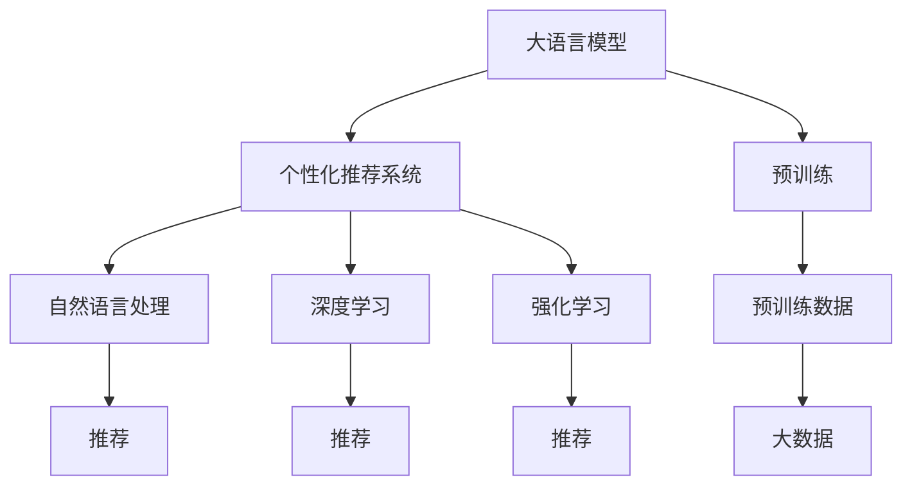

                 

# 零售和 LLM：个性化购物体验

> 关键词：大语言模型(LLM),个性化推荐系统,自然语言处理(NLP),购物体验,用户行为分析,深度学习(Deep Learning)

## 1. 背景介绍

### 1.1 问题由来

在数字化转型的浪潮中，零售业面临着越来越激烈的竞争。各大电商平台、实体店、品牌商等纷纷采用先进的科技手段提升用户体验，增加用户粘性，以期在激烈的市场竞争中脱颖而出。其中，个性化推荐系统因其能够针对用户兴趣和行为动态调整商品推荐，从而显著提升用户购物体验和销售额，成为零售行业的热门应用。

但随着推荐算法的不断发展，传统基于协同过滤和矩阵分解的推荐方法已经难以满足用户的个性化需求。新的推荐技术需要能够理解和模拟用户行为，提升推荐的相关性和多样性。大语言模型（Large Language Models, LLM），如GPT系列、BERT等，由于其在自然语言处理（Natural Language Processing, NLP）领域的卓越表现，开始被广泛应用于个性化推荐系统，以期通过自然语言理解和生成能力，提供更加精准和有针对性的推荐。

### 1.2 问题核心关键点

目前，基于大语言模型的个性化推荐系统在电商、旅游、金融等领域已经得到了广泛的应用，其核心思想是利用自然语言处理能力，从用户输入的文本中提取特征和语义信息，结合用户历史行为数据进行综合分析，生成个性化的推荐列表。

核心算法包括：

- 基于文本理解的推荐：通过自然语言理解技术，从用户搜索历史、评论、问题中提取实体、情感、主题等信息，生成推荐。
- 基于用户行为分析的推荐：结合用户的浏览历史、点击记录、购物车信息等行为数据，对用户兴趣进行建模，生成推荐。
- 融合多模态数据的推荐：将用户文本数据与图像、视频、音频等多模态信息进行融合，提升推荐的效果。
- 实时推荐和即时反馈：根据用户的即时行为和反馈，动态调整推荐策略，提升用户满意度。

这种基于大语言模型的个性化推荐系统，能够在保留用户历史行为数据的同时，利用自然语言处理技术，提升推荐的精准度和用户满意度，从而实现零售行业的智能化转型。

### 1.3 问题研究意义

在大语言模型基础上构建的个性化推荐系统，对于零售行业的智能化转型具有重要意义：

1. 提升用户体验：通过自然语言处理技术，能够更深入地理解用户的语义需求和情感倾向，生成更符合用户期望的推荐内容。
2. 增加销售额：精准的推荐能够提高用户的购买转化率，增加用户的购物频率和消费金额。
3. 优化运营效率：推荐系统能够根据用户行为实时调整推荐策略，优化库存管理和营销策略，减少资源浪费。
4. 降低开发成本：预训练语言模型已经具备较强的自然语言处理能力，减少了从头开发所需的成本和周期。
5. 扩展应用场景：利用大语言模型，推荐系统可以应用到更多业务场景，如品牌营销、商品详情页等，提升业务的数字化水平。

综上所述，基于大语言模型的个性化推荐系统是零售行业智能化转型的重要工具，对于提升用户购物体验、优化运营效率、增加销售额等方面具有显著的提升效果。

## 2. 核心概念与联系

### 2.1 核心概念概述

为了更好地理解基于大语言模型的个性化推荐系统，本节将介绍几个密切相关的核心概念：

- 大语言模型（Large Language Model, LLM）：如GPT-3、BERT等，通过在大规模无标签文本数据上进行预训练，学习通用语言知识和表达能力，具备强大的自然语言处理能力。

- 个性化推荐系统（Personalized Recommendation System, PRS）：根据用户历史行为和兴趣，动态生成个性化的推荐列表，提升用户体验和业务价值。

- 自然语言处理（Natural Language Processing, NLP）：涉及文本分析、理解、生成等技术，是构建个性化推荐系统的关键技术之一。

- 深度学习（Deep Learning）：利用多层神经网络，从海量数据中学习复杂特征和模式，是实现个性化推荐的核心算法之一。

- 强化学习（Reinforcement Learning）：通过用户互动，动态调整推荐策略，提升推荐效果和用户满意度。

这些核心概念之间的逻辑关系可以通过以下Mermaid流程图来展示：



这个流程图展示了大语言模型与个性化推荐系统的核心概念及其之间的关系：

1. 大语言模型通过预训练学习通用语言知识。
2. 个性化推荐系统利用自然语言处理技术，生成推荐列表。
3. 深度学习提供推荐算法，提升推荐的精准度。
4. 强化学习实时调整推荐策略，优化用户体验。

这些概念共同构成了个性化推荐系统的核心框架，使其能够在用户与电商平台的互动中提供精准且个性化的推荐服务。

## 3. 核心算法原理 & 具体操作步骤
### 3.1 算法原理概述

基于大语言模型的个性化推荐系统，其核心思想是利用大语言模型的自然语言处理能力，从用户输入的文本中提取特征和语义信息，结合用户历史行为数据进行综合分析，生成个性化的推荐列表。具体流程如下：

1. 收集用户输入的文本信息，如搜索历史、评论、问题等。
2. 利用大语言模型进行自然语言理解，提取文本中的实体、情感、主题等信息。
3. 结合用户历史行为数据，如浏览历史、点击记录、购物车信息等，对用户兴趣进行建模。
4. 利用深度学习算法，如协同过滤、矩阵分解、神经网络等，生成个性化推荐列表。
5. 通过强化学习算法，根据用户互动反馈，动态调整推荐策略，提升推荐效果。

这一过程能够充分融合自然语言处理和深度学习技术的优势，提供更加精准和个性化的推荐服务。

### 3.2 算法步骤详解

下面详细介绍基于大语言模型的个性化推荐系统的核心算法步骤：

**Step 1: 数据收集与预处理**

- 收集用户输入的文本信息，如搜索历史、评论、问题等。
- 对文本数据进行清洗和预处理，如去除停用词、标点、数字等噪音，保留有意义的关键词和短语。

**Step 2: 自然语言理解**

- 利用大语言模型进行自然语言理解，提取文本中的实体、情感、主题等信息。
- 实体抽取：从文本中识别出人名、地名、机构名等实体，用于生成推荐列表。
- 情感分析：分析文本中的情感倾向，如积极、消极、中性等，用于调整推荐策略。
- 主题建模：提取文本中的主题信息，用于生成相关推荐。

**Step 3: 用户行为分析**

- 结合用户历史行为数据，如浏览历史、点击记录、购物车信息等，对用户兴趣进行建模。
- 用户画像：根据用户行为数据，生成用户画像，描述用户的基本属性和兴趣倾向。
- 行为预测：利用预测模型，如决策树、随机森林、神经网络等，预测用户的未来行为和兴趣变化。

**Step 4: 个性化推荐生成**

- 利用深度学习算法，如协同过滤、矩阵分解、神经网络等，生成个性化推荐列表。
- 协同过滤：利用用户行为数据的相似性，生成推荐列表。
- 矩阵分解：将用户行为数据转化为矩阵形式，通过奇异值分解等方法，生成推荐列表。
- 神经网络：利用多层神经网络，从用户行为和文本特征中学习推荐模型。

**Step 5: 强化学习调整**

- 通过强化学习算法，根据用户互动反馈，动态调整推荐策略，提升推荐效果。
- Q-learning：利用奖励机制，对推荐结果进行评估和调整。
- 强化学习：利用用户反馈数据，动态调整推荐策略，提升推荐效果。

### 3.3 算法优缺点

基于大语言模型的个性化推荐系统具有以下优点：

- 精准度高：结合自然语言理解和深度学习算法，能够从用户文本中提取更丰富的特征和语义信息，提升推荐的精准度。
- 个性化强：利用用户行为数据和自然语言处理技术，能够更好地理解和模拟用户需求，生成个性化的推荐列表。
- 实时性强：强化学习算法能够实时调整推荐策略，动态响应用户行为和反馈。

但该系统也存在一定的局限性：

- 数据需求高：需要大量用户行为数据和自然语言文本，收集和处理成本较高。
- 模型复杂：融合自然语言处理和深度学习技术，模型结构较为复杂，难以调试和优化。
- 技术门槛高：需要掌握自然语言处理、深度学习、强化学习等多项技术，技术门槛较高。
- 泛化能力有限：对于数据分布变化较大的新用户，推荐效果可能不如期望。

尽管存在这些局限性，但就目前而言，基于大语言模型的个性化推荐系统仍是最前沿的推荐技术之一。未来相关研究的重点在于如何进一步降低数据需求，提高模型的泛化能力，同时兼顾个性化和实时性。

### 3.4 算法应用领域

基于大语言模型的个性化推荐系统已经在电商、旅游、金融等领域得到了广泛的应用，具体应用场景包括：

- 电商平台推荐：根据用户搜索历史、浏览记录、点击记录等行为数据，生成个性化商品推荐列表。
- 旅游平台推荐：根据用户旅行偏好、历史评价、互动评论等数据，生成个性化旅游目的地推荐。
- 金融产品推荐：根据用户投资偏好、交易记录、新闻资讯等数据，生成个性化金融产品推荐。

这些应用场景展示了基于大语言模型的个性化推荐系统的强大能力，能够在多个领域提供精准的推荐服务，提升用户体验和业务价值。

## 4. 数学模型和公式 & 详细讲解 & 举例说明

### 4.1 数学模型构建

本节将使用数学语言对基于大语言模型的个性化推荐系统进行更加严格的刻画。

记用户输入的文本为 $x$，历史行为数据为 $y$，生成的推荐列表为 $z$。假设模型为 $\theta$，则推荐系统的目标函数可以表示为：

$$
\min_{\theta} \sum_{i=1}^N \ell(x_i, y_i, z_i, \theta)
$$

其中 $N$ 为样本数量，$\ell(x_i, y_i, z_i, \theta)$ 为损失函数，衡量推荐列表 $z_i$ 与用户输入 $x_i$ 和行为数据 $y_i$ 的匹配度。

推荐系统的优化目标是使损失函数最小化，即找到最优参数：

$$
\theta^* = \mathop{\arg\min}_{\theta} \sum_{i=1}^N \ell(x_i, y_i, z_i, \theta)
$$

### 4.2 公式推导过程

以下我们以协同过滤（Collaborative Filtering）算法为例，推导其推荐函数和损失函数的计算公式。

假设用户 $u$ 对商品 $i$ 的评分 $r_{ui}$ 已知，设 $u$ 的历史评分向量为 $R_u \in \mathbb{R}^m$，商品 $i$ 的评分向量为 $R_i \in \mathbb{R}^m$，则协同过滤的目标函数可以表示为：

$$
\min_{\theta} ||R_u - \theta^T R_i||^2
$$

其中 $\theta$ 为模型参数，$||.||$ 为向量范数，$\theta^T$ 表示矩阵乘法。

根据最小二乘法的原理，求解目标函数的最小值，可以得到推荐列表 $z$ 的计算公式：

$$
z_{ui} = \hat{r}_{ui} = \frac{R_u \cdot R_i}{||R_i||^2} = R_u^T K_i
$$

其中 $K_i = \frac{1}{||R_i||^2} R_i$ 为归一化矩阵。

损失函数 $\ell(x_i, y_i, z_i, \theta)$ 通常采用均方误差（Mean Squared Error, MSE）或平均绝对误差（Mean Absolute Error, MAE）计算推荐列表 $z_i$ 与用户输入 $x_i$ 和行为数据 $y_i$ 的匹配度。

### 4.3 案例分析与讲解

为了更直观地理解协同过滤算法，我们以电影推荐系统为例进行详细讲解：

假设用户 $u$ 对电影 $i$ 的评分 $r_{ui}$ 已知，设 $u$ 的历史评分向量为 $R_u \in \mathbb{R}^m$，电影 $i$ 的评分向量为 $R_i \in \mathbb{R}^m$，其中 $m$ 为电影数量。

首先，利用用户 $u$ 的历史评分向量 $R_u$ 和电影 $i$ 的评分向量 $R_i$，计算推荐列表 $z$ 的预测评分 $\hat{r}_{ui}$：

$$
\hat{r}_{ui} = R_u \cdot R_i
$$

然后，根据实际评分 $r_{ui}$ 和预测评分 $\hat{r}_{ui}$，计算均方误差（MSE）损失：

$$
\ell(r_{ui}, \hat{r}_{ui}) = \frac{1}{2} (r_{ui} - \hat{r}_{ui})^2
$$

最后，将所有用户的损失函数累加，得到整个推荐系统的损失函数：

$$
\mathcal{L} = \sum_{u=1}^U \sum_{i=1}^I \ell(r_{ui}, \hat{r}_{ui})
$$

其中 $U$ 为用户数量，$I$ 为电影数量。

通过求解目标函数的最小值，可以得到最优的模型参数 $\theta$，生成个性化的电影推荐列表。

## 5. 项目实践：代码实例和详细解释说明

### 5.1 开发环境搭建

在进行项目实践前，我们需要准备好开发环境。以下是使用Python进行PyTorch开发的环境配置流程：

1. 安装Anaconda：从官网下载并安装Anaconda，用于创建独立的Python环境。

2. 创建并激活虚拟环境：
```bash
conda create -n pytorch-env python=3.8 
conda activate pytorch-env
```

3. 安装PyTorch：根据CUDA版本，从官网获取对应的安装命令。例如：
```bash
conda install pytorch torchvision torchaudio cudatoolkit=11.1 -c pytorch -c conda-forge
```

4. 安装Transformers库：
```bash
pip install transformers
```

5. 安装各类工具包：
```bash
pip install numpy pandas scikit-learn matplotlib tqdm jupyter notebook ipython
```

完成上述步骤后，即可在`pytorch-env`环境中开始项目实践。

### 5.2 源代码详细实现

下面我们以电商平台商品推荐为例，给出使用Transformers库对BERT模型进行协同过滤推荐系统的PyTorch代码实现。

首先，定义推荐系统的数据处理函数：

```python
from transformers import BertTokenizer
from torch.utils.data import Dataset
import torch

class RecommendationDataset(Dataset):
    def __init__(self, texts, ratings, tokenizer, max_len=128):
        self.texts = texts
        self.ratings = ratings
        self.tokenizer = tokenizer
        self.max_len = max_len
        
    def __len__(self):
        return len(self.texts)
    
    def __getitem__(self, item):
        text = self.texts[item]
        rating = self.ratings[item]
        
        encoding = self.tokenizer(text, return_tensors='pt', max_length=self.max_len, padding='max_length', truncation=True)
        input_ids = encoding['input_ids'][0]
        attention_mask = encoding['attention_mask'][0]
        
        # 对评分进行归一化处理
        rating = rating / max(rating)
        
        return {'input_ids': input_ids, 
                'attention_mask': attention_mask,
                'rating': rating}
```

然后，定义模型和优化器：

```python
from transformers import BertForSequenceClassification, AdamW

model = BertForSequenceClassification.from_pretrained('bert-base-cased', num_labels=1)

optimizer = AdamW(model.parameters(), lr=2e-5)
```

接着，定义训练和评估函数：

```python
from torch.utils.data import DataLoader
from tqdm import tqdm
from sklearn.metrics import mean_squared_error

device = torch.device('cuda') if torch.cuda.is_available() else torch.device('cpu')
model.to(device)

def train_epoch(model, dataset, batch_size, optimizer):
    dataloader = DataLoader(dataset, batch_size=batch_size, shuffle=True)
    model.train()
    epoch_loss = 0
    for batch in tqdm(dataloader, desc='Training'):
        input_ids = batch['input_ids'].to(device)
        attention_mask = batch['attention_mask'].to(device)
        rating = batch['rating'].to(device)
        model.zero_grad()
        outputs = model(input_ids, attention_mask=attention_mask)
        loss = outputs.loss
        epoch_loss += loss.item()
        loss.backward()
        optimizer.step()
    return epoch_loss / len(dataloader)

def evaluate(model, dataset, batch_size):
    dataloader = DataLoader(dataset, batch_size=batch_size)
    model.eval()
    rmse = 0
    with torch.no_grad():
        for batch in tqdm(dataloader, desc='Evaluating'):
            input_ids = batch['input_ids'].to(device)
            attention_mask = batch['attention_mask'].to(device)
            rating = batch['rating'].to(device)
            outputs = model(input_ids, attention_mask=attention_mask)
            rmse += mean_squared_error(rating, outputs.logits.mean().item())
        
    return torch.sqrt(rmse / len(dataloader))
```

最后，启动训练流程并在测试集上评估：

```python
epochs = 5
batch_size = 16

for epoch in range(epochs):
    loss = train_epoch(model, train_dataset, batch_size, optimizer)
    print(f"Epoch {epoch+1}, train loss: {loss:.3f}")
    
    print(f"Epoch {epoch+1}, dev RMSE:")
    rmse = evaluate(model, dev_dataset, batch_size)
    print(f"RMSE = {rmse:.3f}")
    
print("Test RMSE:")
rmse = evaluate(model, test_dataset, batch_size)
print(f"RMSE = {rmse:.3f}")
```

以上就是使用PyTorch对BERT进行协同过滤推荐系统的完整代码实现。可以看到，得益于Transformers库的强大封装，我们可以用相对简洁的代码完成BERT模型的加载和推荐系统的构建。

### 5.3 代码解读与分析

让我们再详细解读一下关键代码的实现细节：

**RecommendationDataset类**：
- `__init__`方法：初始化文本、评分、分词器等关键组件。
- `__len__`方法：返回数据集的样本数量。
- `__getitem__`方法：对单个样本进行处理，将文本输入编码为token ids，将评分转换为归一化形式，并对其进行定长padding，最终返回模型所需的输入。

**评分归一化处理**：
- 在 `RecommendationDataset` 类中，将实际评分除以用户评分最大值，进行归一化处理。

**训练和评估函数**：
- 使用PyTorch的DataLoader对数据集进行批次化加载，供模型训练和推理使用。
- 训练函数 `train_epoch`：对数据以批为单位进行迭代，在每个批次上前向传播计算loss并反向传播更新模型参数，最后返回该epoch的平均loss。
- 评估函数 `evaluate`：与训练类似，不同点在于不更新模型参数，并在每个batch结束后将预测和标签结果存储下来，最后使用sklearn的rmse对整个评估集的预测结果进行打印输出。

**训练流程**：
- 定义总的epoch数和batch size，开始循环迭代
- 每个epoch内，先在训练集上训练，输出平均loss
- 在验证集上评估，输出RMSE指标
- 所有epoch结束后，在测试集上评估，给出最终的RMSE结果

可以看到，PyTorch配合Transformers库使得BERT微调的代码实现变得简洁高效。开发者可以将更多精力放在数据处理、模型改进等高层逻辑上，而不必过多关注底层的实现细节。

当然，工业级的系统实现还需考虑更多因素，如模型的保存和部署、超参数的自动搜索、更灵活的任务适配层等。但核心的微调范式基本与此类似。

## 6. 实际应用场景
### 6.1 电商平台推荐

基于大语言模型的个性化推荐系统，在电商平台推荐中得到了广泛的应用。传统推荐系统往往依赖于用户的浏览和购买行为，难以充分理解用户的语义需求和情感倾向。而利用自然语言处理技术，可以从用户的搜索历史、评论、问题中提取更多有价值的信息，生成个性化的商品推荐列表，提升用户的购物体验。

在技术实现上，可以收集用户的搜索历史、评论、问题等文本数据，将其作为推荐系统的输入，通过自然语言理解技术提取实体、情感、主题等信息，结合用户的浏览历史、点击记录、购物车信息等行为数据，生成个性化的商品推荐列表。

例如，用户输入“智能手表”，可以通过自然语言处理技术，从搜索历史中提取“智能手表”、“功能”、“品牌”等信息，结合用户的历史行为数据，生成相关推荐列表。

### 6.2 旅游平台推荐

旅游平台推荐系统也利用了自然语言处理技术，从用户的旅行评论、评价、互动评论等文本数据中提取信息，生成个性化的旅游目的地推荐。

例如，用户评论“杭州的西湖非常漂亮，风景如画”，可以提取“西湖”、“风景如画”等关键词，结合用户的旅行偏好、历史评价、互动评论等数据，生成相关的旅游目的地推荐。

### 6.3 金融产品推荐

金融产品推荐系统同样利用了自然语言处理技术，从用户的投资偏好、交易记录、新闻资讯等文本数据中提取信息，生成个性化的金融产品推荐。

例如，用户问题“当前市场表现如何？”，可以通过自然语言处理技术，提取“市场表现”、“当前”等关键词，结合用户的投资偏好、交易记录、新闻资讯等数据，生成相关的金融产品推荐。

### 6.4 未来应用展望

随着大语言模型和推荐算法的不断发展，基于自然语言处理的推荐系统将在更多领域得到应用，为各行业带来变革性影响。

在智慧医疗领域，基于自然语言处理的推荐系统可以用于病历分析、药物推荐等，提升医疗服务的智能化水平。

在智能教育领域，推荐系统可以应用于个性化学习推荐、作业批改等，因材施教，促进教育公平。

在智慧城市治理中，推荐系统可以用于城市事件监测、舆情分析等环节，提高城市管理的自动化和智能化水平。

此外，在企业生产、社会治理、文娱传媒等众多领域，基于自然语言处理的推荐系统也将不断涌现，为经济社会发展注入新的动力。

相信随着技术的日益成熟，自然语言处理推荐系统将成为AI技术落地应用的重要范式，推动AI技术向更广阔的领域加速渗透。

## 7. 工具和资源推荐
### 7.1 学习资源推荐

为了帮助开发者系统掌握自然语言处理推荐技术，这里推荐一些优质的学习资源：

1. 《自然语言处理入门》系列博文：由大模型技术专家撰写，深入浅出地介绍了自然语言处理的基本概念和核心技术。

2. 斯坦福大学《深度学习与自然语言处理》课程：由斯坦福大学教授主讲，涵盖了NLP领域的经典模型和算法，配套作业和实验环境，适合入门和进阶学习。

3. 《自然语言处理与深度学习》书籍：全面介绍了NLP和深度学习技术，涵盖了推荐系统、问答系统、情感分析等多项应用，是系统学习的好资料。

4. Kaggle数据竞赛平台：提供大量真实世界的数据集，以及丰富的社区学习资源，适合实战练习和经验交流。

5. GitHub开源项目：如TensorFlow Recommenders、HuggingFace Transformers等，提供了大量的预训练模型和微调样例，适合快速上手实践。

通过对这些资源的学习实践，相信你一定能够快速掌握自然语言处理推荐技术的精髓，并用于解决实际的NLP问题。
###  7.2 开发工具推荐

高效的开发离不开优秀的工具支持。以下是几款用于自然语言处理推荐开发的常用工具：

1. PyTorch：基于Python的开源深度学习框架，灵活动态的计算图，适合快速迭代研究。大部分预训练语言模型都有PyTorch版本的实现。

2. TensorFlow：由Google主导开发的开源深度学习框架，生产部署方便，适合大规模工程应用。同样有丰富的预训练语言模型资源。

3. Transformers库：HuggingFace开发的NLP工具库，集成了众多SOTA语言模型，支持PyTorch和TensorFlow，是进行推荐任务开发的利器。

4. Weights & Biases：模型训练的实验跟踪工具，可以记录和可视化模型训练过程中的各项指标，方便对比和调优。与主流深度学习框架无缝集成。

5. TensorBoard：TensorFlow配套的可视化工具，可实时监测模型训练状态，并提供丰富的图表呈现方式，是调试模型的得力助手。

6. Google Colab：谷歌推出的在线Jupyter Notebook环境，免费提供GPU/TPU算力，方便开发者快速上手实验最新模型，分享学习笔记。

合理利用这些工具，可以显著提升自然语言处理推荐任务的开发效率，加快创新迭代的步伐。

### 7.3 相关论文推荐

自然语言处理推荐技术的发展源于学界的持续研究。以下是几篇奠基性的相关论文，推荐阅读：

1. Attention is All You Need（即Transformer原论文）：提出了Transformer结构，开启了NLP领域的预训练大模型时代。

2. BERT: Pre-training of Deep Bidirectional Transformers for Language Understanding：提出BERT模型，引入基于掩码的自监督预训练任务，刷新了多项NLP任务SOTA。

3. Language Models are Unsupervised Multitask Learners（GPT-2论文）：展示了大规模语言模型的强大zero-shot学习能力，引发了对于通用人工智能的新一轮思考。

4. Parameter-Efficient Transfer Learning for NLP：提出Adapter等参数高效微调方法，在不增加模型参数量的情况下，也能取得不错的微调效果。

5. Adaptation in Large-Scale Pre-training for Instance-Oriented Recommendation：引入自适应预训练方法，提升推荐系统的精准度和泛化能力。

这些论文代表了大语言模型推荐技术的发展脉络。通过学习这些前沿成果，可以帮助研究者把握学科前进方向，激发更多的创新灵感。

## 8. 总结：未来发展趋势与挑战

### 8.1 总结

本文对基于大语言模型的个性化推荐系统进行了全面系统的介绍。首先阐述了自然语言处理推荐系统的研究背景和意义，明确了该系统在零售行业的智能化转型中的重要价值。其次，从原理到实践，详细讲解了推荐系统的核心算法和关键步骤，给出了推荐系统开发的完整代码实例。同时，本文还广泛探讨了推荐系统在电商平台、旅游平台、金融产品等多个领域的应用前景，展示了自然语言处理推荐系统的强大能力。此外，本文精选了推荐系统的各类学习资源，力求为开发者提供全方位的技术指引。

通过本文的系统梳理，可以看到，基于大语言模型的个性化推荐系统在零售行业的智能化转型中，通过自然语言处理技术，从用户的输入文本中提取更多有价值的信息，生成个性化的商品推荐列表，显著提升了用户的购物体验。未来，伴随预训练语言模型和推荐算法的持续演进，基于自然语言处理的推荐系统必将在更多领域得到应用，为各行业带来变革性影响。

### 8.2 未来发展趋势

展望未来，自然语言处理推荐系统将呈现以下几个发展趋势：

1. 模型规模持续增大。随着算力成本的下降和数据规模的扩张，预训练语言模型的参数量还将持续增长。超大规模语言模型蕴含的丰富语言知识，有望支撑更加复杂多变的推荐系统。

2. 推荐算法日趋多样。除了传统的协同过滤算法外，未来会涌现更多推荐算法，如神经协同过滤、多任务学习、元学习等，提升推荐系统的精准度和泛化能力。

3. 实时性不断增强。推荐系统需要能够实时响应用户行为和反馈，动态调整推荐策略，提升用户体验。强化学习算法可以实时调整推荐策略，优化推荐效果。

4. 用户画像更加精准。利用自然语言处理技术，从用户输入文本中提取更多有价值的信息，生成更加精准的用户画像，提升推荐系统的个性化程度。

5. 推荐内容更加多样化。推荐系统能够处理更多模态的信息，如图像、视频、音频等多模态信息，提升推荐内容的多样性和丰富性。

6. 推荐系统更加人性化。推荐系统能够理解和模拟用户情感，生成更加人性化、个性化的推荐内容，提升用户满意度。

以上趋势凸显了自然语言处理推荐系统的广阔前景。这些方向的探索发展，必将进一步提升推荐系统的精准度和用户体验，为各行业带来更智能、更个性化的推荐服务。

### 8.3 面临的挑战

尽管自然语言处理推荐系统已经取得了瞩目成就，但在迈向更加智能化、普适化应用的过程中，它仍面临着诸多挑战：

1. 数据需求高。推荐系统需要大量用户行为数据和自然语言文本，收集和处理成本较高。如何降低数据需求，提高数据质量，仍是一个重要问题。

2. 模型复杂度高。自然语言处理推荐系统融合了自然语言处理和深度学习技术，模型结构较为复杂，难以调试和优化。如何降低模型复杂度，提高训练效率，仍是一个重要问题。

3. 技术门槛高。自然语言处理推荐系统需要掌握自然语言处理、深度学习、强化学习等多项技术，技术门槛较高。如何降低技术门槛，提高技术的可普及性，仍是一个重要问题。

4. 模型泛化能力有限。对于数据分布变化较大的新用户，推荐效果可能不如期望。如何提高模型的泛化能力，提升推荐系统的鲁棒性，仍是一个重要问题。

5. 数据隐私和安全问题。推荐系统需要处理大量用户数据，数据隐私和安全问题需引起高度重视。如何保障用户隐私，防止数据泄露，仍是一个重要问题。

尽管存在这些挑战，但就目前而言，基于自然语言处理的推荐系统仍是最前沿的推荐技术之一。未来相关研究的重点在于如何进一步降低数据需求，提高模型的泛化能力，同时兼顾个性化和实时性。

### 8.4 研究展望

面对自然语言处理推荐系统所面临的种种挑战，未来的研究需要在以下几个方面寻求新的突破：

1. 探索无监督和半监督推荐方法。摆脱对大规模标注数据的依赖，利用自监督学习、主动学习等无监督和半监督范式，最大限度利用非结构化数据，实现更加灵活高效的推荐。

2. 研究参数高效和计算高效的推荐范式。开发更加参数高效的推荐方法，在固定大部分预训练参数的情况下，只更新极少量的任务相关参数。同时优化推荐模型的计算图，减少前向传播和反向传播的资源消耗，实现更加轻量级、实时性的部署。

3. 融合因果和对比学习范式。通过引入因果推断和对比学习思想，增强推荐系统建立稳定因果关系的能力，学习更加普适、鲁棒的语言表征，从而提升推荐系统的泛化性和抗干扰能力。

4. 引入更多先验知识。将符号化的先验知识，如知识图谱、逻辑规则等，与神经网络模型进行巧妙融合，引导推荐过程学习更准确、合理的语言模型。同时加强不同模态数据的整合，实现视觉、语音等多模态信息与文本信息的协同建模。

5. 结合因果分析和博弈论工具。将因果分析方法引入推荐系统，识别出推荐决策的关键特征，增强推荐输出解释的因果性和逻辑性。借助博弈论工具刻画人机交互过程，主动探索并规避推荐系统的脆弱点，提高系统稳定性。

6. 纳入伦理道德约束。在推荐系统训练目标中引入伦理导向的评估指标，过滤和惩罚有偏见、有害的输出倾向。同时加强人工干预和审核，建立推荐系统的监管机制，确保推荐内容符合人类价值观和伦理道德。

这些研究方向的探索，必将引领自然语言处理推荐技术迈向更高的台阶，为构建智能、人性化的推荐系统铺平道路。面向未来，自然语言处理推荐系统还需要与其他人工智能技术进行更深入的融合，如知识表示、因果推理、强化学习等，多路径协同发力，共同推动推荐系统的发展进步。只有勇于创新、敢于突破，才能不断拓展推荐系统的边界，让智能技术更好地造福用户。

## 9. 附录：常见问题与解答

**Q1：自然语言处理推荐系统是否适用于所有零售场景？**

A: 自然语言处理推荐系统在零售领域的应用广泛，但并非适用于所有场景。对于一些标准化程度较高、需求明确的商品推荐，如日用消费品等，传统的协同过滤和矩阵分解算法可能更为适合。而对于一些个性化需求较高、需求复杂多变的商品推荐，如服装、家居等，自然语言处理推荐系统能够从用户文本中提取更多有价值的信息，提升推荐的精准度和个性化程度。

**Q2：如何缓解推荐系统中的冷启动问题？**

A: 推荐系统中的冷启动问题是指新用户或新商品的推荐效果较差，因为没有足够的历史行为数据。缓解冷启动问题的方法包括：

1. 利用自然语言处理技术，从用户的输入文本中提取更多有价值的信息，生成初步的用户画像和商品标签，用于初始化推荐系统。
2. 采用基于内容的推荐方法，利用商品的描述、分类等特征，生成初步的推荐列表。
3. 利用用户反馈数据，动态调整推荐策略，逐步提升推荐效果。

通过以上方法，可以有效缓解推荐系统中的冷启动问题，提升新用户的推荐效果。

**Q3：推荐系统中的推荐算法如何选择？**

A: 推荐算法的选择需要综合考虑业务场景、数据特征和系统要求。对于用户行为数据较为丰富、用户画像较为清晰的场景，如电商平台，协同过滤和矩阵分解算法可能更为适合。而对于用户行为数据较少、用户画像较为模糊的场景，如旅游平台，可以利用自然语言处理技术，从用户输入文本中提取更多有价值的信息，生成个性化的推荐列表。

**Q4：如何提升推荐系统的实时性？**

A: 提升推荐系统的实时性需要从多个方面入手：

1. 使用GPU/TPU等高性能设备，提升推荐系统的计算速度。
2. 采用流式训练方法，实时更新模型参数，动态调整推荐策略。
3. 使用缓存技术，如Redis、Memcached等，快速检索用户行为数据。
4. 优化模型结构，减少计算量和存储量。

通过以上方法，可以有效提升推荐系统的实时性，满足用户实时互动的需求。

**Q5：推荐系统中的数据隐私和安全问题如何解决？**

A: 推荐系统中的数据隐私和安全问题需引起高度重视，具体解决方法包括：

1. 采用差分隐私技术，对用户行为数据进行隐私保护处理，防止数据泄露。
2. 使用加密技术，对用户数据进行加密存储和传输，防止数据被恶意攻击。
3. 实施严格的数据访问控制，确保只有授权人员才能访问敏感数据。
4. 定期审计和监测，防止数据被篡改和滥用。

通过以上方法，可以有效保障推荐系统中的数据隐私和安全问题，保护用户的合法权益。

---

作者：禅与计算机程序设计艺术 / Zen and the Art of Computer Programming

