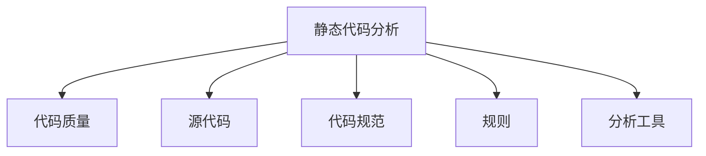

                 

# 静态代码分析：提高代码质量的工具

## 1. 背景介绍

在软件开发过程中，代码质量一直是决定项目成功与否的关键因素。代码质量不仅仅涉及可读性、可维护性、可扩展性，还包括代码的健壮性、可复用性和可测试性等方面。随着软件系统的规模和复杂度不断增加，代码质量控制变得更加重要。静态代码分析作为一种代码质量保证技术，通过在源代码执行之前对其进行检查，自动发现潜在的问题和缺陷，从而提高代码质量。

### 1.1 问题由来

在软件开发中，代码质量问题通常分为两类：

- **功能缺陷**：如语法错误、逻辑错误、边界条件问题等。
- **结构问题**：如代码重复、模块间耦合度过高、函数过长、复杂度高等。

这些问题在软件开发的早期阶段可能导致严重的后果，包括代码难以维护、性能问题、安全性漏洞等。因此，如何在软件开发生命周期的各个阶段进行有效的代码质量控制，是软件开发中的重要议题。

### 1.2 问题核心关键点

静态代码分析作为一种代码质量保证技术，具备以下几个关键点：

- **自动化**：无需人工介入，自动化执行，提高效率。
- **实时反馈**：在编写代码的过程中即时发现问题，避免潜在的错误。
- **全面覆盖**：覆盖从设计、编码、测试到部署的全生命周期。
- **定制化**：根据项目需求和团队习惯，进行定制化配置和规则。
- **可扩展性**：支持插件扩展，灵活应对新需求。

## 2. 核心概念与联系

### 2.1 核心概念概述

为更好地理解静态代码分析技术，本节将介绍几个密切相关的核心概念：

- **静态代码分析(Static Code Analysis)**：一种自动化的分析技术，通过对源代码进行静态检查，发现潜在的错误、漏洞和安全问题。
- **代码质量(Quality of Code)**：指代码的可读性、可维护性、可扩展性、健壮性、可复用性和可测试性等方面的综合评价。
- **源代码(Source Code)**：软件开发过程中编写的程序源代码。
- **代码规范(Coding Standards)**：编程语言的规范和标准，如PVS-Studio、SonarQube等。
- **规则(Rules)**：定义代码检查的标准，用于自动检测代码中不符合规范和标准的部分。
- **分析工具(Analysis Tools)**：用于静态代码分析的软件工具，如Cobertura、Checkstyle等。

这些概念之间的逻辑关系可以通过以下Mermaid流程图来展示：



这个流程图展示静态代码分析的核心概念及其之间的关系：

1. 静态代码分析通过对源代码进行静态检查，提高代码质量。
2. 代码质量涉及代码的多个方面，通过静态代码分析进行全面评价。
3. 源代码是静态代码分析的对象。
4. 代码规范定义了代码检查的标准。
5. 规则是根据代码规范定义的自动检测标准。
6. 分析工具是实施静态代码分析的自动化软件。

## 3. 核心算法原理 & 具体操作步骤
### 3.1 算法原理概述

静态代码分析的原理是，通过对源代码进行语法、语义、结构等方面的静态检查，自动识别潜在的问题和缺陷。其核心算法包括：

- **语法分析**：通过语法解析器解析源代码，检查语法错误。
- **语义分析**：通过符号表和控制流分析，检查变量作用域、类型一致性等问题。
- **结构分析**：通过代码复杂度、依赖关系等分析，检查代码的复杂度和可读性。

静态代码分析的目标是，通过自动化的工具和规则，发现源代码中的潜在问题和缺陷，并提供改进建议。

### 3.2 算法步骤详解

静态代码分析通常包括以下关键步骤：

**Step 1: 准备源代码和配置文件**
- 收集项目中的源代码文件。
- 配置分析工具所需的规则和选项。

**Step 2: 初始化分析工具**
- 安装并启动静态代码分析工具，如PVS-Studio、SonarQube、Checkstyle等。
- 连接源代码库，进行初始化配置。

**Step 3: 执行分析**
- 通过分析工具对源代码进行逐个文件和逐个函数的扫描。
- 对代码执行语法、语义、结构等方面的检查，生成报告。

**Step 4: 处理报告**
- 根据报告中的问题分类，进行优先级排序。
- 修改源代码，解决发现的问题。
- 重复执行分析，直到所有问题被解决。

**Step 5: 持续集成**
- 将静态代码分析集成到持续集成(CI)流程中，自动触发分析。
- 定期生成分析报告，进行质量跟踪和评估。

### 3.3 算法优缺点

静态代码分析具备以下优点：
1. **自动化和及时性**：自动执行，发现问题及时反馈。
2. **全面覆盖**：全面覆盖代码的各个方面，如语法、语义、结构等。
3. **低成本**：成本低于手动代码审查，且覆盖更广。
4. **可定制化**：可根据项目需求和团队习惯进行配置和规则定制。
5. **可扩展性**：支持插件扩展，灵活应对新需求。

同时，静态代码分析也存在一定的局限性：
1. **假阳性**：规则配置不当可能导致大量的假阳性报告。
2. **上下文问题**：一些问题需要在特定上下文中才能理解，静态分析无法处理。
3. **难以解决复杂问题**：一些复杂的逻辑错误需要手动审查。
4. **依赖外部工具**：需要依赖于外部工具和规则库，可能存在兼容性问题。
5. **数据隐私问题**：分析和修改过程中可能涉及代码和数据的隐私问题。

尽管存在这些局限性，但静态代码分析仍是提高代码质量的重要工具，特别适用于大型、复杂的代码库。

### 3.4 算法应用领域

静态代码分析技术在软件开发中得到了广泛的应用，覆盖了以下领域：

- **软件开发**：对源代码进行全面检查，提高代码质量。
- **自动化测试**：集成到测试框架中，自动检测代码中的潜在问题。
- **持续集成(CI)**：自动触发静态代码分析，集成到CI流程中。
- **代码审查**：作为代码审查的工具，帮助团队快速发现问题。
- **配置管理**：集成到配置管理工具中，进行代码规范检查。

除了上述这些领域，静态代码分析还在安全审计、自动化部署等场景中得到应用，帮助开发者提升代码质量，保障软件系统的可靠性。

## 4. 数学模型和公式 & 详细讲解 & 举例说明

### 4.1 数学模型构建

静态代码分析的数学模型主要涉及代码规范和规则的数学描述，以及分析结果的计算。

**代码规范**：
- **语法规范**：如C++的语法规范，可以使用正则表达式描述。
- **语义规范**：如变量命名规范，可以使用字符串匹配描述。

**规则**：
- **语法规则**：如变量未初始化、类型不匹配等。
- **语义规则**：如函数调用不匹配、循环变量使用错误等。

**分析结果**：
- **问题分类**：如语法错误、语义错误、结构问题等。
- **位置信息**：如行号、函数名等。
- **问题严重度**：如高、中、低等。

### 4.2 公式推导过程

以变量未初始化问题为例，推导其数学模型。

设变量 $x$ 在代码中未被初始化，则其对应的规则为：

$$
R_{\text{未初始化}}(x) = \text{False}
$$

若在代码中发现变量 $x$ 未被初始化，则规则 $R_{\text{未初始化}}$ 被触发，生成如下问题：

$$
P_{\text{未初始化}} = (x, \text{未初始化})
$$

其中 $(x, \text{未初始化})$ 表示变量 $x$ 未被初始化的问题。

### 4.3 案例分析与讲解

假设在以下C++代码中，变量 $x$ 未被初始化：

```cpp
void test() {
    x = 1;
    // ...
}
```

使用静态代码分析工具PVS-Studio对该代码进行分析，得到如下报告：

```
C:\Users\user\Desktop\test.cpp(3): Warning C3856: Variable 'x' may be uninitialized
```

其中，警告类型 $C3856$ 表示变量 $x$ 可能未被初始化，位置为代码行号 $3$。

## 5. 项目实践：代码实例和详细解释说明
### 5.1 开发环境搭建

在进行静态代码分析项目实践前，我们需要准备好开发环境。以下是使用Python进行SonarQube开发的典型环境配置流程：

1. 安装SonarQube：从官网下载并安装SonarQube，启动服务。
2. 安装SonarQube Plugin：从官网下载并安装SonarQube Plugin，连接源代码库。
3. 安装SonarLint：从官网下载并安装SonarLint，集成到IDE中。

完成上述步骤后，即可在SonarQube环境中开始静态代码分析的实践。

### 5.2 源代码详细实现

下面我们以变量未初始化问题为例，使用SonarQube对C++代码进行静态代码分析。

首先，定义一个包含变量未初始化问题的C++源文件：

```cpp
#include <iostream>
#include <string>

void test() {
    x = 1;
    // ...
}
```

接下来，在SonarQube中配置静态代码分析规则：

1. 进入SonarQube管理控制台。
2. 选择项目，进入规则配置。
3. 添加变量未初始化问题规则，并进行配置。

最后，运行静态代码分析，查看分析报告：

```bash
sonar-runner-executor -p . -b src
```

运行结果为：

```
SONARScanner: Project test
```

在SonarQube控制台中查看分析报告，发现变量未初始化问题。

### 5.3 代码解读与分析

让我们再详细解读一下关键代码的实现细节：

**SonarQube规则配置**：
- 在SonarQube管理控制台中，选择项目，进入规则配置。
- 添加变量未初始化问题规则，并进行配置。

**SonarLint集成**：
- 在IDE中安装SonarLint插件。
- 开启SonarLint分析，实时检查代码中的潜在问题。

**分析报告**：
- 通过SonarQube生成的分析报告，可以清晰地看到代码中的问题位置和类型。
- 根据报告中的问题分类，进行优先级排序，快速解决问题。

**问题解决**：
- 在代码中修改变量 $x$ 的初始化，使其符合规则要求。
- 重复执行静态代码分析，确认问题已解决。

## 6. 实际应用场景
### 6.1 软件开发

在软件开发中，静态代码分析通常作为持续集成(CI)的一部分，集成到构建和测试流程中。在每次提交代码时，自动触发静态代码分析，生成分析报告，快速定位和解决问题。

### 6.2 自动化测试

静态代码分析可以集成到自动化测试框架中，自动检测代码中的潜在问题。通过设置分析规则，将代码审查和测试任务结合起来，提高测试覆盖率和代码质量。

### 6.3 持续集成(CI)

静态代码分析可以集成到持续集成(CI)流程中，自动触发分析。在每次提交代码时，自动生成分析报告，进行质量跟踪和评估。

### 6.4 代码审查

静态代码分析可以作为代码审查的工具，帮助团队快速发现问题。通过集成到代码审查平台，如Gerrit、Bitbucket等，提升代码审查的效率和质量。

### 6.5 配置管理

静态代码分析可以集成到配置管理工具中，进行代码规范检查。通过设置规范和规则，确保代码符合统一的标准，提升代码的可维护性和可读性。

## 7. 工具和资源推荐
### 7.1 学习资源推荐

为了帮助开发者系统掌握静态代码分析的理论基础和实践技巧，这里推荐一些优质的学习资源：

1. 《C++编程风格》：阐述了C++代码的最佳实践，包括代码规范、结构设计等方面。
2. 《静态代码分析基础》：详细介绍了静态代码分析的原理、工具和应用，是入门静态代码分析的必读书籍。
3. 《SonarQube官方文档》：官方文档提供了详细的配置和使用指南，是SonarQube的权威参考。
4. 《静态代码分析技术》：讲解了静态代码分析的原理、方法和应用场景，帮助开发者掌握代码质量保证的核心技术。
5. 《代码审查与持续集成》：介绍了代码审查和持续集成的实践技巧，提升代码质量和开发效率。

通过对这些资源的学习实践，相信你一定能够快速掌握静态代码分析的精髓，并用于解决实际的代码问题。

### 7.2 开发工具推荐

高效的开发离不开优秀的工具支持。以下是几款用于静态代码分析开发的常用工具：

1. SonarQube：集成了代码质量分析、代码审查、代码覆盖率等功能，适用于大型项目。
2. PVS-Studio：专门用于C++代码的静态分析工具，提供丰富的规则库和报告格式。
3. Checkstyle：用于Java代码的静态分析工具，支持代码规范和风格检查。
4. PMD：用于Java代码的静态分析工具，支持代码质量检查和代码优化。
5. FindBugs：用于Java代码的静态分析工具，提供丰富的规则库和报告格式。

合理利用这些工具，可以显著提升静态代码分析任务的开发效率，加快创新迭代的步伐。

### 7.3 相关论文推荐

静态代码分析技术的发展源于学界的持续研究。以下是几篇奠基性的相关论文，推荐阅读：

1. "Code Checking: A Survey" by Gries et al.：对代码检查技术进行了全面的综述，包括语法、语义、结构等方面的分析方法。
2. "Static Code Analysis in Software Engineering: A Survey" by Junghare et al.：介绍了静态代码分析在软件工程中的应用，包括工具、技术和挑战。
3. "Automatic Code Quality Checking in Software Development" by O'Leary et al.：研究了自动代码质量检查技术的发展，包括规则设计、应用效果等方面。
4. "A Survey on Static Analysis for Mobile Applications" by Li et al.：介绍了移动应用中的静态分析技术，包括自动化测试、代码优化等方面。
5. "Safety Verification of Software Using Static Analysis" by Jensen et al.：研究了静态分析在软件安全性验证中的应用，包括形式化方法和工具。

这些论文代表了几十年来静态代码分析技术的发展脉络。通过学习这些前沿成果，可以帮助研究者把握学科前进方向，激发更多的创新灵感。

## 8. 总结：未来发展趋势与挑战

### 8.1 总结

本文对静态代码分析技术进行了全面系统的介绍。首先阐述了静态代码分析在提高代码质量方面的重要性，明确了静态代码分析在软件开发生命周期中的关键作用。其次，从原理到实践，详细讲解了静态代码分析的数学模型和操作步骤，给出了静态代码分析任务开发的完整代码实例。同时，本文还广泛探讨了静态代码分析技术在软件开发、自动化测试、持续集成等领域的应用前景，展示了静态代码分析的巨大潜力。

通过本文的系统梳理，可以看到，静态代码分析技术正在成为软件质量保证的重要工具，极大地提高了软件开发中的代码质量。未来，伴随静态代码分析技术的持续演进，相信软件开发质量将得到更大的提升，代码的健壮性、可维护性和可复用性将得到更好的保障。

### 8.2 未来发展趋势

展望未来，静态代码分析技术将呈现以下几个发展趋势：

1. **智能化**：结合人工智能技术，实现更精准的问题检测和分析。
2. **自动化和集成化**：集成到持续集成(CI)和代码审查平台中，提升自动化水平。
3. **多语言支持**：支持多种编程语言，实现跨语言代码质量保证。
4. **实时分析和反馈**：实现实时分析，即时提供反馈，提高代码质量改进效率。
5. **数据驱动分析**：结合大数据分析技术，进行代码质量趋势分析和预测。

这些趋势凸显了静态代码分析技术的广阔前景。这些方向的探索发展，必将进一步提升静态代码分析技术的应用范围和效果，为软件开发质量的提升提供强有力的技术保障。

### 8.3 面临的挑战

尽管静态代码分析技术已经取得了瞩目成就，但在迈向更加智能化、普适化应用的过程中，它仍面临着诸多挑战：

1. **规则配置复杂性**：规则配置不当可能导致大量的假阳性报告，影响代码审查效率。
2. **误报率和漏报率**：误报和漏报率高，难以全面覆盖代码质量问题。
3. **依赖外部工具**：需要依赖于外部工具和规则库，可能存在兼容性问题。
4. **数据隐私问题**：分析和修改过程中可能涉及代码和数据的隐私问题。
5. **扩展性不足**：工具扩展性和灵活性有待提高，难以适应快速变化的需求。

尽管存在这些挑战，但静态代码分析仍是提高代码质量的重要工具，特别适用于大型、复杂的代码库。未来研究需要在以下几个方面寻求新的突破：

1. **智能化和自动化**：结合人工智能技术，实现更精准的问题检测和分析。
2. **规则定制化**：提供更灵活的规则配置选项，减少误报和漏报率。
3. **多语言支持**：实现跨语言代码质量保证，支持多种编程语言。
4. **实时分析和反馈**：实现实时分析，即时提供反馈，提高代码质量改进效率。
5. **数据驱动分析**：结合大数据分析技术，进行代码质量趋势分析和预测。

这些研究方向将引领静态代码分析技术迈向更高的台阶，为软件开发质量的提升提供强有力的技术保障。

### 8.4 研究展望

未来，静态代码分析技术需要在以下几个方面进行深入研究：

1. **智能化分析**：结合人工智能技术，实现更精准的问题检测和分析。
2. **多语言支持**：实现跨语言代码质量保证，支持多种编程语言。
3. **实时分析和反馈**：实现实时分析，即时提供反馈，提高代码质量改进效率。
4. **数据驱动分析**：结合大数据分析技术，进行代码质量趋势分析和预测。
5. **扩展性和灵活性**：提供更灵活的工具扩展选项，适应快速变化的需求。

这些研究方向将引领静态代码分析技术迈向更高的台阶，为软件开发质量的提升提供强有力的技术保障。相信伴随技术的发展，静态代码分析将更好地服务软件开发，推动软件行业的进步。

## 9. 附录：常见问题与解答

**Q1：静态代码分析是否适用于所有编程语言？**

A: 静态代码分析适用于多种编程语言，如C++、Java、Python等。但不同的语言有不同的规范和规则，需要针对性地进行配置和分析。

**Q2：静态代码分析如何处理假阳性报告？**

A: 假阳性报告主要是由于规则配置不当导致的。解决假阳性报告的方法包括：
1. 细化规则配置，避免过于泛泛的规则。
2. 结合手动审查，对问题进行验证和修正。
3. 增加规则的例外选项，适应特定的代码场景。

**Q3：静态代码分析如何与其他工具集成？**

A: 静态代码分析可以集成到持续集成(CI)和代码审查平台中，如Jenkins、GitHub等。通过配置自动化脚本和API接口，实现自动化触发和报告生成。

**Q4：静态代码分析对代码质量的影响有多大？**

A: 静态代码分析可以显著提升代码质量，减少开发过程中的错误和缺陷。但仅靠静态分析是不够的，还需要结合手动审查、自动化测试等手段，全面提升代码质量。

**Q5：静态代码分析是否需要人工介入？**

A: 静态代码分析通常是自动执行的，但发现问题后需要人工介入进行修复和验证。人工审查可以确保问题得到彻底解决，提升代码质量。

---

作者：禅与计算机程序设计艺术 / Zen and the Art of Computer Programming

