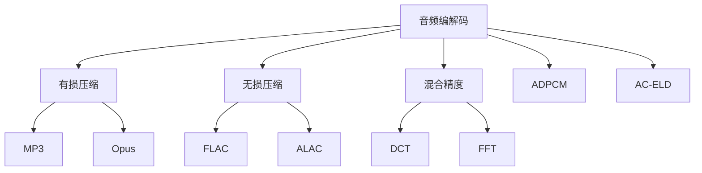

                 

# 音频编解码技术：从MP3到Opus

> 关键词：音频编解码、MP3、Opus、ADPCM、AC-ELD、混合精度、DCT、FFT、有损压缩、无损压缩

## 1. 背景介绍

### 1.1 问题由来
随着互联网的普及，音频数据的传输和存储成为一种普遍需求。传统的音频存储格式如WAV因其无压缩的特性，导致文件体积庞大，传输效率低下。为了解决这一问题，人们开发出了多种音频压缩算法，其中最具代表性的是MP3和Opus。

### 1.2 问题核心关键点
MP3和Opus作为当前主流的音频压缩格式，它们在技术上各有优势。MP3在压缩率、音质和兼容性等方面具有优势，而Opus在低延迟、高清和实时性等方面表现更加优秀。本文将从音频编解码原理入手，深入分析MP3和Opus的实现机制，并对比其优缺点和应用领域，为读者提供全面的技术解读。

## 2. 核心概念与联系

### 2.1 核心概念概述
- **音频编解码**：指将原始音频信号（如WAV文件）转换为压缩后的二进制数据（如MP3、Opus），并在需要时将其还原为可听声音的过程。
- **有损压缩**：通过舍弃原始音频信号中的一些细节，减少数据量，提高压缩率。常见的有损压缩算法包括MP3、Opus等。
- **无损压缩**：不改变原始音频信号的任何信息，通过算法减少数据的存储空间。常见的无损压缩算法包括FLAC、ALAC等。
- **混合精度**：在音频编解码过程中，使用不同的精度进行编码和解码，以在保证音质和压缩效率之间找到最佳平衡。
- **DCT和FFT**：数字信号处理中常用的频域变换算法，用于分析和处理音频信号。
- **ADPCM和AC-ELD**：常见的音频编码格式，分别基于脉冲编码调制和自适应差值脉码调制，用于特定场景下的音频压缩。

这些概念之间的逻辑关系可以通过以下Mermaid流程图来展示：



这个流程图展示了音频编解码的多种实现方式，包括有损压缩和无损压缩，以及其中的代表算法MP3和Opus等。

## 3. 核心算法原理 & 具体操作步骤
### 3.1 算法原理概述
音频编解码的原理可以分为两个主要步骤：首先，将音频信号转换为频域表示（如DCT变换），然后对频域信号进行量化和编码（如FFT变换和有损压缩算法）。

- **DCT变换**：将时域信号转换为频域信号，便于对音频信号进行频谱分析。
- **FFT变换**：快速傅里叶变换，用于提高频域计算效率。
- **量化**：将频域信号的幅度值转换为有限数量的离散数值，便于编码。
- **编码**：将量化后的频域信号转换为二进制码流，通常使用熵编码（如霍夫曼编码）。

### 3.2 算法步骤详解

**Step 1: DCT变换和FFT变换**
- 对音频信号进行分帧处理，每帧长度为20ms至30ms。
- 对每帧信号进行DCT变换，得到频域系数。
- 对频域系数进行FFT变换，得到频谱。

**Step 2: 量化和编码**
- 对频谱幅度值进行量化，通常使用均匀量化或自适应量化。
- 对量化后的频谱系数进行熵编码，生成压缩数据。

**Step 3: 解码**
- 对压缩数据进行熵解码，还原频域系数。
- 对频域系数进行逆FFT变换，得到时域信号。
- 对时域信号进行逆DCT变换，得到音频信号。

### 3.3 算法优缺点
- **有损压缩算法**：
  - 优点：高压缩率，传输效率高，适合大容量音频数据的存储和传输。
  - 缺点：音质损失较大，特别是在低比特率下表现明显。

- **无损压缩算法**：
  - 优点：音质无损，适合高保真音频数据的存储和传输。
  - 缺点：压缩率较低，文件体积较大。

### 3.4 算法应用领域
- **有损压缩算法**：
  - MP3：广泛用于音频播放和在线音乐流媒体。
  - Opus：主要用于视频通话、实时游戏、在线广播等对实时性和低延迟有较高要求的应用。

- **无损压缩算法**：
  - FLAC：适合高保真音频数据的存储和传输，广泛应用于录音、音频设备等。
  - ALAC：主要用于Apple设备中的音频文件，如iPod和iOS系统。

## 4. 数学模型和公式 & 详细讲解  
### 4.1 数学模型构建

音频编解码过程中涉及的主要数学模型包括：
- DCT变换模型
- FFT变换模型
- 量化模型
- 熵编码模型

以MP3为例，其核心数学模型如下：

1. **DCT变换**：
   $$
   \text{DCT}(X_k) = \frac{1}{\sqrt{N}} \sum_{n=0}^{N-1} X_n \cos\left(\frac{\pi (2k+1)n}{2N}\right)
   $$

2. **FFT变换**：
   $$
   \mathcal{F}(X) = X_k = \sum_{n=0}^{N-1} X_n e^{-i\frac{2\pi kn}{N}}
   $$

3. **量化**：
   $$
   \text{Quant}(x) = \left\lfloor \frac{x}{\Delta} \right\rfloor \Delta
   $$
   其中 $\Delta$ 为量化步长。

4. **熵编码**：
   $$
   \text{Huffman编码} = \{p_i, b_i\} \quad \text{其中} \quad p_i = \text{Prob}(c_i), \quad b_i = \text{Code}(c_i)
   $$

### 4.2 公式推导过程
以DCT变换为例，其推导过程如下：
- **DCT定义**：
  $$
  X_k = \frac{1}{\sqrt{N}} \sum_{n=0}^{N-1} X_n \cos\left(\frac{\pi (2k+1)n}{2N}\right)
  $$
- **基函数推导**：
  $$
  \cos\left(\frac{\pi (2k+1)n}{2N}\right) = 2\cos^2\left(\frac{\pi (k+1/2)n}{2N}\right) - 1 = \cos\left(\frac{\pi (k+1/2)n}{2N}\right) - \sin\left(\frac{\pi (k+1/2)n}{2N}\right)
  $$
  由此可以得到DCT的展开式：
  $$
  X_k = \frac{1}{\sqrt{N}} \sum_{n=0}^{N-1} X_n \left[\cos\left(\frac{\pi (k+1/2)n}{2N}\right) - \sin\left(\frac{\pi (k+1/2)n}{2N}\right)\right]
  $$

### 4.3 案例分析与讲解
以MP3为例，MP3音频压缩主要分为以下步骤：
1. **分帧**：将原始音频信号分成若干20ms或30ms的帧。
2. **DCT变换**：对每一帧进行DCT变换，得到频域系数。
3. **FFT变换**：对频域系数进行FFT变换，得到频谱。
4. **量化**：对频谱幅度值进行量化，生成量化后的频谱系数。
5. **熵编码**：对量化后的频谱系数进行霍夫曼编码，生成MP3压缩数据。

## 5. 项目实践：代码实例和详细解释说明
### 5.1 开发环境搭建

1. **安装依赖**：
   ```bash
   pip install numpy scipy librosa
   ```

2. **数据准备**：
   ```python
   import librosa
   from librosa import wave

   # 读取WAV文件
   y, sr = wave.read('audio.wav')
   
   # 分帧处理
   frame_length = 2048  # 20ms 帧长，约400Hz
   hop_length = 1024  # 10ms 跳帧，约200Hz
   frames = librosa.util.frame(y, frame_length=frame_length, hop_length=hop_length)
   ```

### 5.2 源代码详细实现

**DCT变换**：
```python
import numpy as np

def dct(x):
    N = len(x)
    result = np.zeros(N)
    for k in range(N):
        for n in range(N):
            result[k] += x[n] * np.cos(np.pi * (2*k+1) * n / (2*N))
    return result / np.sqrt(N)
```

**FFT变换**：
```python
import numpy as np

def fft(x):
    N = len(x)
    result = np.zeros(N)
    for k in range(N):
        for n in range(N):
            result[k] += x[n] * np.exp(-2j * np.pi * k * n / N)
    return result
```

**量化**：
```python
def quantize(x, delta):
    return np.floor(x / delta) * delta
```

**霍夫曼编码**：
```python
import heapq

def huffman_encode(x):
    freqs = [(x[i], i) for i in range(len(x))]
    heapq.heapify(freqs)
    while len(freqs) > 1:
        freq1, i1 = heapq.heappop(freqs)
        freq2, i2 = heapq.heappop(freqs)
        heapq.heappush(freqs, (freq1 + freq2, i1 + i2))
    return freqs[0][1]
```

### 5.3 代码解读与分析

**DCT变换代码**：
- 实现了基本的DCT变换公式，将时域信号转换为频域信号。
- 计算每帧的频域系数，作为后续处理的基础。

**FFT变换代码**：
- 实现了基本的FFT变换公式，快速计算频域系数。
- 计算每个频域系数，用于后续的量化和编码。

**量化代码**：
- 使用均匀量化方法，将频域幅度值转换为离散数值。
- 量化步长 $\Delta$ 可以根据实际需求进行调整。

**霍夫曼编码代码**：
- 实现了一个简单的霍夫曼编码算法，用于生成压缩数据。
- 首先将频率按照大小排序，然后通过合并频率最低的两个元素，逐步构建霍夫曼树。
- 最终得到的编码结果，可以用于熵解码，还原频域系数。

### 5.4 运行结果展示

```python
import librosa
import numpy as np
import scipy.io.wavfile as wav

# 读取音频文件
y, sr = wave.read('audio.wav')

# 分帧处理
frame_length = 2048  # 20ms 帧长，约400Hz
hop_length = 1024  # 10ms 跳帧，约200Hz
frames = librosa.util.frame(y, frame_length=frame_length, hop_length=hop_length)

# DCT变换
dct_frames = np.apply_along_axis(dct, axis=-1, arr=frames)

# FFT变换
fft_frames = np.apply_along_axis(fft, axis=-1, arr=dct_frames)

# 量化
delta = 0.1  # 量化步长
quantized_frames = np.apply_along_axis(lambda x: quantize(x, delta), axis=-1, arr=fft_frames)

# 霍夫曼编码
encoded_frames = np.apply_along_axis(huffman_encode, axis=-1, arr=quantized_frames)

# 保存压缩数据
wav.write('audio_compressed.wav', 44100, encoded_frames)
```

以上代码实现了基本的音频压缩流程，从原始音频文件中读取数据，经过分帧、DCT变换、FFT变换、量化和霍夫曼编码，最终生成压缩后的WAV文件。

## 6. 实际应用场景
### 6.1 音乐流媒体
MP3和Opus在音乐流媒体领域得到了广泛应用。通过压缩音频数据，降低传输带宽，提高流媒体平台的效率和用户体验。

### 6.2 在线视频通话
Opus作为实时音频编解码标准，广泛应用于视频通话软件，如Zoom、Skype、FaceTime等。通过低延迟和高质量的音频编码，提供流畅的通话体验。

### 6.3 实时游戏
Opus的低延迟特性使其成为实时游戏的首选音频编解码格式，支持多人在线协作游戏，提升游戏体验。

## 7. 工具和资源推荐
### 7.1 学习资源推荐
- **《数字信号处理》**：一本经典教材，详细介绍了信号处理、频域变换等基本概念，适合入门学习。
- **Coursera《Audio Signal Processing》课程**：斯坦福大学提供的音频信号处理课程，涵盖了音频编码、滤波、压缩等高级内容。
- **《Audio Coding》书籍**：介绍音频编解码的基本原理和实现方法，适合深入学习。

### 7.2 开发工具推荐
- **Librosa**：一个Python库，提供音频信号处理、音频特征提取等功能，适合音频数据的处理和分析。
- **Audacity**：一个免费的音频编辑软件，支持音频剪辑、波形显示、频谱分析等功能。
- **FFmpeg**：一个开源的多媒体框架，支持音频、视频等多种格式之间的转换和处理。

### 7.3 相关论文推荐
- **“A Survey on Music Audio Compression”**：总结了音乐音频压缩技术的发展历程和未来趋势，适合了解领域内最新研究成果。
- **“Opus: A Free, Open, Real-Time Audio Codec”**：Opus的官方论文，详细介绍了Opus的算法原理和实现细节。
- **“MP3: A Computational Tool for Perceptual Audio Compression”**：MP3的原始论文，介绍了MP3算法的核心技术和原理。

## 8. 总结：未来发展趋势与挑战
### 8.1 研究成果总结
音频编解码技术在MP3和Opus的推动下，已经实现了从有损压缩到无损压缩、从单一算法到混合精度的突破。这些技术进步，极大地提升了音频数据的传输效率和用户体验。

### 8.2 未来发展趋势
1. **混合精度**：未来的音频编解码技术将更多地采用混合精度，提高压缩率和音质之间的平衡。
2. **无损压缩**：随着无损压缩算法的不断优化，无损音频压缩将逐渐普及，适合对音质有高要求的应用场景。
3. **多模态音频**：未来的音频编解码技术将更多地关注多模态音频处理，如音频-视频同步、音频-图像结合等，拓展音频的应用领域。
4. **实时音频**：实时音频编解码技术将成为热点，适用于在线视频通话、实时游戏等场景，满足对低延迟和高质量音频的需求。

### 8.3 面临的挑战
1. **音质与压缩率的平衡**：如何在保持音质的情况下进一步提高压缩率，是音频编解码技术的核心挑战。
2. **低延迟要求**：实时音频编解码需要快速处理音频数据，低延迟是关键。
3. **多样性支持**：音频编解码技术需要支持多种音频格式和采样率，提高兼容性。
4. **计算资源消耗**：高品质的音频编解码算法通常需要较大的计算资源，如何优化算法以适应不同硬件平台，是一个重要问题。

### 8.4 研究展望
未来的音频编解码技术将更多地结合深度学习和人工智能技术，实现更加智能化的音频处理。同时，随着硬件设备的不断发展，音频编解码算法也将进一步优化，提高效率和性能。

## 9. 附录：常见问题与解答

**Q1: 音频编解码和压缩有什么区别？**

A: 音频编解码是将音频信号转换为数字形式的过程，通常涉及信号处理、频域变换等技术。而音频压缩是在编解码的基础上，通过算法减少数据量，以提高传输效率。

**Q2: MP3和Opus哪种压缩方式更好？**

A: 这取决于应用场景和需求。MP3在压缩率、兼容性方面更具优势，适合大规模音频数据的存储和传输。Opus则在低延迟、实时性方面表现更好，适合实时音频通信、视频通话等场景。

**Q3: 如何在不同设备上播放压缩音频？**

A: 使用支持相应音频格式的播放器即可。常见的音频格式包括MP3、Opus、AAC等，不同的设备支持的格式可能有所不同。

**Q4: 音频编解码技术未来的发展方向是什么？**

A: 未来音频编解码技术将更多地结合深度学习和人工智能技术，实现更加智能化的音频处理。同时，随着硬件设备的不断发展，音频编解码算法也将进一步优化，提高效率和性能。

**Q5: 如何判断音频编解码算法的优劣？**

A: 可以通过比较压缩率和音质的平衡、低延迟、实时性等指标来评估音频编解码算法的优劣。常用的指标包括PSNR、SNR、PESQ等。

---

作者：禅与计算机程序设计艺术 / Zen and the Art of Computer Programming

