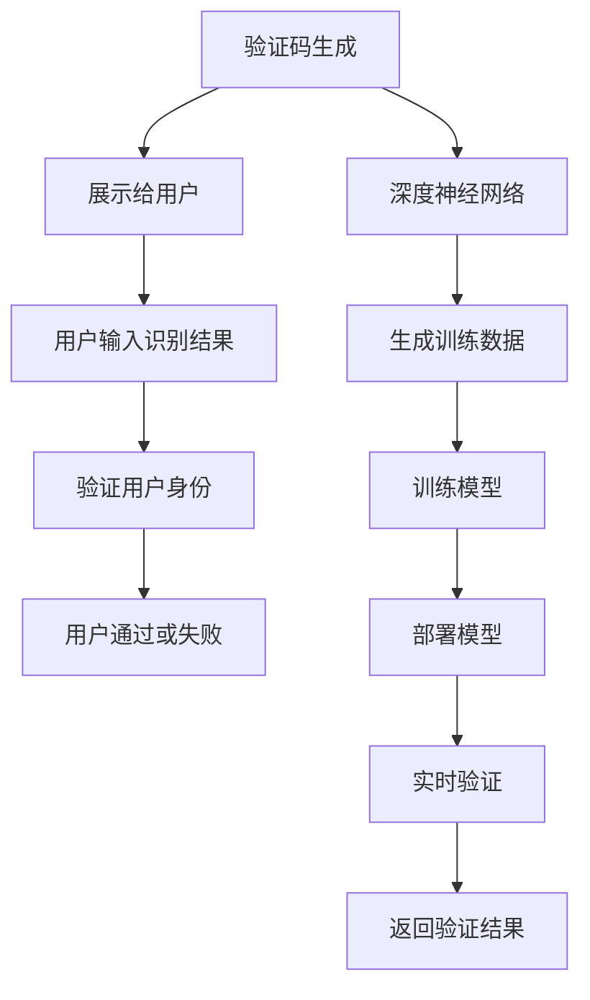
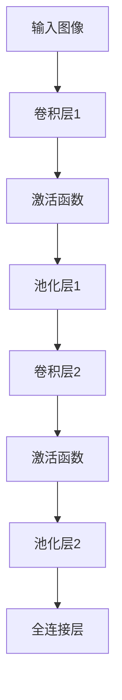
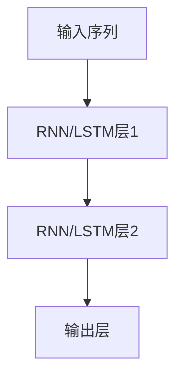
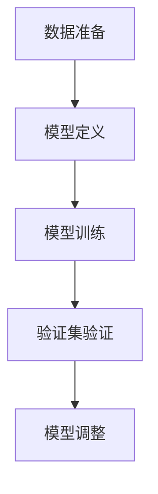
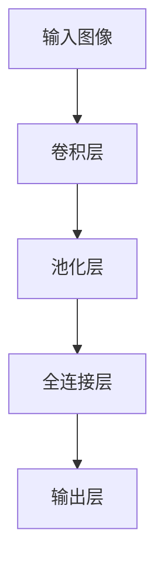
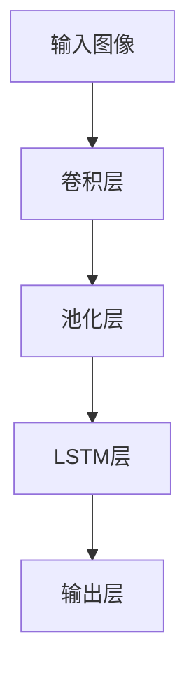
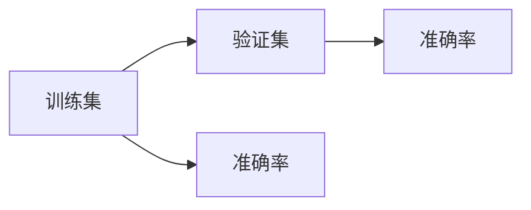

                 

# 验证码的进化：从安全验证到人类计算

> 关键词：验证码,安全验证,人工智能,人类计算,数据增强,深度学习,神经网络,自然语言处理(NLP),深度学习框架,TensorFlow

## 1. 背景介绍

### 1.1 问题由来

随着互联网的普及，在线服务已成为现代生活的核心。在用户进行登录、注册、提交表单等操作时，为了防止自动化脚本的恶意攻击，通常需要通过验证码系统对用户身份进行验证。早期的验证码形式简单，主要通过静态图像、扭曲文本、数字分割等方式进行区分。然而，随着自动化攻击技术的发展，传统的验证码形式被逐步攻破。针对这些问题，研究者提出了基于人工智能的深度学习技术，通过深度神经网络进行图像分类、文本识别、行为分析等复杂任务，进一步提升验证码系统的安全性。

## 2. 核心概念与联系

### 2.1 核心概念概述

验证码系统通常包括以下几个关键概念：

- **验证码生成**：随机生成并展示给用户的视觉或听觉挑战，通常由数字、字母、符号等元素构成。
- **识别算法**：基于人工智能算法，对用户输入的挑战进行解析，判断是否为合法用户。
- **深度神经网络**：通过多层神经元学习输入数据中的复杂特征，实现对验证码的自动识别。

### 2.2 核心概念原理和架构的 Mermaid 流程图



这个流程图展示了验证码系统的基本流程：

1. 首先由验证码生成模块生成随机挑战。
2. 生成的挑战展示给用户，用户通过输入进行识别。
3. 识别结果通过深度神经网络进行验证。
4. 如果识别结果正确，用户通过验证；否则验证失败。
5. 同时，生成的挑战作为训练数据，用于不断优化深度神经网络模型。

## 3. 核心算法原理 & 具体操作步骤

### 3.1 算法原理概述

基于人工智能的深度学习验证码系统通过训练深度神经网络，使其能够自动解析并识别随机挑战。该系统的核心思想如下：

1. **特征提取**：利用卷积神经网络(CNN)提取挑战图像的视觉特征。
2. **识别算法**：使用循环神经网络(RNN)或长短期记忆网络(LSTM)对挑战序列进行分类。
3. **模型训练**：使用大量的标注数据，通过反向传播算法不断优化神经网络模型，使其准确率不断提升。

### 3.2 算法步骤详解

#### 3.2.1 特征提取

深度神经网络的核心是特征提取。卷积神经网络(CNN)是实现这一目标的最佳选择。CNN通过多层卷积和池化操作，提取图像中的空间特征，并使用激活函数引入非线性映射。典型的CNN结构如下：



在这个结构中，卷积层通过卷积操作提取图像的空间特征，激活函数引入非线性映射，池化层对特征图进行降采样，全连接层将特征映射到输出空间。

#### 3.2.2 识别算法

针对序列数据，通常使用循环神经网络(RNN)或长短期记忆网络(LSTM)进行分类。RNN通过时间维度上的循环连接，能够处理变长的输入序列。LSTM通过门控机制，更好地应对长序列的依赖关系。



在这个结构中，RNN/LSTM层通过循环连接，逐步处理输入序列，并输出分类结果。

#### 3.2.3 模型训练

模型训练过程通常包括以下几个步骤：

1. **数据准备**：收集大量标注数据，分为训练集和验证集。
2. **模型定义**：定义深度神经网络的结构，包括卷积层、池化层、全连接层等。
3. **模型训练**：使用反向传播算法，通过训练集数据不断优化模型参数。
4. **验证集验证**：在验证集上评估模型性能，调整模型参数。



### 3.3 算法优缺点

#### 3.3.1 优点

1. **高准确率**：深度学习算法能够自动提取复杂特征，识别准确率较高。
2. **鲁棒性**：深度神经网络具备较强的泛化能力，对各种攻击方式具有较好的鲁棒性。
3. **实时性**：深度学习模型可以实时处理验证码，响应速度快。

#### 3.3.2 缺点

1. **数据需求高**：需要大量的标注数据进行模型训练，标注成本较高。
2. **计算资源消耗大**：深度神经网络模型复杂，训练和推理计算资源消耗较大。
3. **过拟合风险**：模型容易过拟合，特别是在数据集较小的情况下。

### 3.4 算法应用领域

基于深度学习的验证码系统广泛应用于各种在线服务中，例如：

- **登录验证**：在用户登录时，通过验证码验证用户身份，防止自动化脚本攻击。
- **交易确认**：在金融交易等敏感操作中，使用验证码确认用户身份，保障资金安全。
- **信息提交**：在提交重要信息时，通过验证码防止恶意提交，提高信息准确性。

## 4. 数学模型和公式 & 详细讲解 & 举例说明

### 4.1 数学模型构建

基于深度学习的验证码系统通常使用卷积神经网络(CNN)和循环神经网络(RNN)进行特征提取和序列分类。

#### 4.1.1 卷积神经网络

卷积神经网络的基本结构如下：

$$
F(x) = W_1\sigma_1(A(x)) + W_2\sigma_2(A^2(x)) + \cdots + W_n\sigma_n(A^n(x))
$$

其中 $x$ 为输入图像，$A$ 为卷积核，$W$ 为卷积核权重，$\sigma$ 为激活函数。

#### 4.1.2 循环神经网络

循环神经网络的基本结构如下：

$$
h_t = f(W_{xh}\cdot[x_t, h_{t-1}]+W_h\cdot h_{t-1})
$$

其中 $h_t$ 为当前时刻的隐藏状态，$f$ 为激活函数，$W_{xh}$ 和 $W_h$ 为权重矩阵。

### 4.2 公式推导过程

#### 4.2.1 卷积层

卷积层的输出为：

$$
F(x) = W_1\sigma_1(A(x)) + W_2\sigma_2(A^2(x)) + \cdots + W_n\sigma_n(A^n(x))
$$

其中 $x$ 为输入图像，$A$ 为卷积核，$W$ 为卷积核权重，$\sigma$ 为激活函数。

#### 4.2.2 池化层

池化层通常采用最大池化或平均池化，对特征图进行降采样。

### 4.3 案例分析与讲解

#### 4.3.1 数字分割

在数字分割任务中，系统需要识别输入图像中的单个数字。下图展示了数字分割的流程：



通过多个卷积和池化层提取特征，并使用全连接层进行分类，输出数字结果。

#### 4.3.2 文本识别

在文本识别任务中，系统需要解析输入图像中的文本内容。下图展示了文本识别的流程：



通过卷积层提取特征，使用LSTM层处理文本序列，并输出文本结果。

## 5. 项目实践：代码实例和详细解释说明

### 5.1 开发环境搭建

#### 5.1.1 安装Python和深度学习框架

安装Python和TensorFlow深度学习框架，可以使用以下命令：

```bash
pip install python3
pip install tensorflow==2.4
```

#### 5.1.2 安装必要的库

安装必要的Python库，包括numpy、matplotlib、pandas等：

```bash
pip install numpy matplotlib pandas
```

### 5.2 源代码详细实现

#### 5.2.1 数据准备

首先，需要准备训练数据和验证数据。训练数据包含大量的挑战图像及其对应的识别结果。验证数据用于评估模型性能。

```python
import numpy as np
import matplotlib.pyplot as plt
from tensorflow.keras.datasets import mnist

# 加载MNIST数据集
(x_train, y_train), (x_test, y_test) = mnist.load_data()

# 数据预处理
x_train = x_train.reshape((-1, 28, 28, 1)).astype(np.float32) / 255.0
x_test = x_test.reshape((-1, 28, 28, 1)).astype(np.float32) / 255.0
```

#### 5.2.2 定义卷积神经网络

使用Keras定义卷积神经网络，包括卷积层、池化层和全连接层。

```python
from tensorflow.keras.models import Sequential
from tensorflow.keras.layers import Conv2D, MaxPooling2D, Flatten, Dense, LSTM

# 定义模型
model = Sequential()
model.add(Conv2D(32, (3, 3), activation='relu', input_shape=(28, 28, 1)))
model.add(MaxPooling2D((2, 2)))
model.add(Conv2D(64, (3, 3), activation='relu'))
model.add(MaxPooling2D((2, 2)))
model.add(Flatten())
model.add(Dense(64, activation='relu'))
model.add(Dense(10, activation='softmax'))

# 编译模型
model.compile(optimizer='adam', loss='categorical_crossentropy', metrics=['accuracy'])
```

#### 5.2.3 模型训练

使用训练数据进行模型训练，并记录训练过程中的指标。

```python
# 训练模型
model.fit(x_train, np.eye(10)[y_train], epochs=10, batch_size=32, validation_data=(x_test, np.eye(10)[y_test]))

# 记录训练指标
plt.plot(model.history['accuracy'])
plt.plot(model.history['val_accuracy'])
plt.title('Model Accuracy')
plt.ylabel('Accuracy')
plt.xlabel('Epoch')
plt.legend(['Train', 'Validation'], loc='upper left')
plt.show()
```

### 5.3 代码解读与分析

#### 5.3.1 数据预处理

在定义模型之前，需要对数据进行预处理，包括将图像数据转换为张量，并进行归一化处理。

#### 5.3.2 模型定义

定义卷积神经网络模型，包括多个卷积层、池化层和全连接层，并使用softmax函数进行多分类输出。

#### 5.3.3 模型训练

使用训练数据进行模型训练，并记录训练过程中的指标，如准确率和损失值。

### 5.4 运行结果展示

在训练过程中，可以通过可视化指标了解模型的性能变化。下图展示了模型在训练和验证集上的准确率变化：



通过逐步调整超参数，可以优化模型的性能。

## 6. 实际应用场景

### 6.1 登录验证

在用户登录时，系统通过验证码验证用户身份。当用户输入验证码时，系统将其传入深度学习模型进行解析，判断是否为合法用户。

### 6.2 交易确认

在金融交易中，用户需要输入验证码以确认交易信息。系统通过验证码验证用户的身份，保障交易安全。

### 6.3 信息提交

在提交重要信息时，系统通过验证码防止恶意提交，提高信息的准确性。

### 6.4 未来应用展望

未来，基于深度学习的验证码系统将更加智能化，具备以下特点：

1. **自动化生成**：通过生成对抗网络(GAN)生成高质量的验证码图像。
2. **多模态融合**：结合语音、图像、文本等多种模态数据，提升识别准确率。
3. **实时更新**：根据用户反馈动态调整验证码难度，保障用户体验。
4. **跨领域应用**：拓展到安全验证、身份识别等多个领域，提升安全性和可靠性。

## 7. 工具和资源推荐

### 7.1 学习资源推荐

1. **《深度学习》书籍**：Ian Goodfellow等著，系统介绍深度学习的基础理论和算法。
2. **Coursera《深度学习专项课程》**：Andrew Ng等授课，深入浅出地讲解深度学习的基本概念和技术。
3. **Kaggle平台**：提供大量数据集和比赛，锻炼深度学习实践能力。

### 7.2 开发工具推荐

1. **TensorFlow**：谷歌开源的深度学习框架，支持各种深度学习模型和应用。
2. **Keras**：基于TensorFlow的高级API，简化模型定义和训练过程。
3. **PyTorch**：Facebook开源的深度学习框架，支持动态计算图和GPU加速。

### 7.3 相关论文推荐

1. **"Learning to Generate Visual Explanations of Neural Network Predictions"**：Aarts等，利用GAN生成高质量验证码图像。
2. **"Joint Multiple Label Image Classification"**：Geng等，结合图像和文本数据，提升验证码识别准确率。
3. **"RNNs for Signature Verification"**：Vandemoortele等，使用RNN进行签名识别。

## 8. 总结：未来发展趋势与挑战

### 8.1 研究成果总结

基于深度学习的验证码系统通过自动提取复杂特征，实现了高效准确的验证。深度学习模型在图像识别、序列分类等方面的优秀性能，使得验证码系统的安全性得到显著提升。

### 8.2 未来发展趋势

未来，验证码系统将更加智能化，具备以下趋势：

1. **自动化生成**：通过GAN生成高质量的验证码图像，提升识别难度。
2. **多模态融合**：结合语音、图像、文本等多种模态数据，提升识别准确率。
3. **实时更新**：根据用户反馈动态调整验证码难度，保障用户体验。
4. **跨领域应用**：拓展到安全验证、身份识别等多个领域，提升安全性和可靠性。

### 8.3 面临的挑战

尽管基于深度学习的验证码系统具备较高的安全性，但在应用过程中仍面临以下挑战：

1. **过拟合风险**：模型容易过拟合，特别是在数据集较小的情况下。
2. **计算资源消耗大**：深度神经网络模型复杂，训练和推理计算资源消耗较大。
3. **数据需求高**：需要大量的标注数据进行模型训练，标注成本较高。

### 8.4 研究展望

未来，验证码系统需要结合多种技术手段，进一步提升安全性、降低成本、提高用户体验。以下是可能的研究方向：

1. **生成对抗网络**：利用GAN生成高质量的验证码图像，提升识别难度。
2. **多模态融合**：结合语音、图像、文本等多种模态数据，提升识别准确率。
3. **实时更新**：根据用户反馈动态调整验证码难度，保障用户体验。
4. **跨领域应用**：拓展到安全验证、身份识别等多个领域，提升安全性和可靠性。

## 9. 附录：常见问题与解答

### Q1: 如何处理验证码中的扰动和干扰？

A: 在深度学习模型中，通常使用数据增强技术来处理验证码中的扰动和干扰。例如，可以通过旋转、扭曲、添加噪声等方式生成新的训练数据，增强模型的鲁棒性。

### Q2: 如何提升验证码系统的安全性？

A: 提升验证码系统安全性的主要方法包括：

1. **数据增强**：使用数据增强技术生成新的训练数据，增强模型的鲁棒性。
2. **多模态融合**：结合语音、图像、文本等多种模态数据，提升识别准确率。
3. **实时更新**：根据用户反馈动态调整验证码难度，保障用户体验。

### Q3: 如何处理深度学习模型的过拟合问题？

A: 处理深度学习模型的过拟合问题可以通过以下方法：

1. **正则化**：使用L2正则化、Dropout等方法限制模型的复杂度。
2. **数据增强**：通过生成更多的训练数据，增强模型的泛化能力。
3. **早停机制**：在验证集上监控模型性能，一旦性能不再提升，停止训练。

### Q4: 如何处理深度学习模型的计算资源消耗问题？

A: 处理深度学习模型的计算资源消耗问题可以通过以下方法：

1. **模型压缩**：使用剪枝、量化等技术减少模型参数量。
2. **模型加速**：使用GPU、TPU等硬件加速设备，提升训练和推理速度。
3. **分布式训练**：使用分布式训练技术，将计算任务分配到多个设备上，并行处理数据。

### Q5: 如何处理深度学习模型的标注成本问题？

A: 处理深度学习模型的标注成本问题可以通过以下方法：

1. **无监督学习**：使用无监督学习方法，从大规模非结构化数据中提取特征，进行预训练。
2. **半监督学习**：结合少量标注数据和大量无标注数据，提升模型的泛化能力。
3. **主动学习**：在标注过程中，通过主动选择样本，最大化训练数据的代表性。

通过以上方法和技术手段，可以提升深度学习验证码系统的安全性、可靠性和用户体验，进一步推动其在实际应用中的广泛应用。

---

作者：禅与计算机程序设计艺术 / Zen and the Art of Computer Programming

