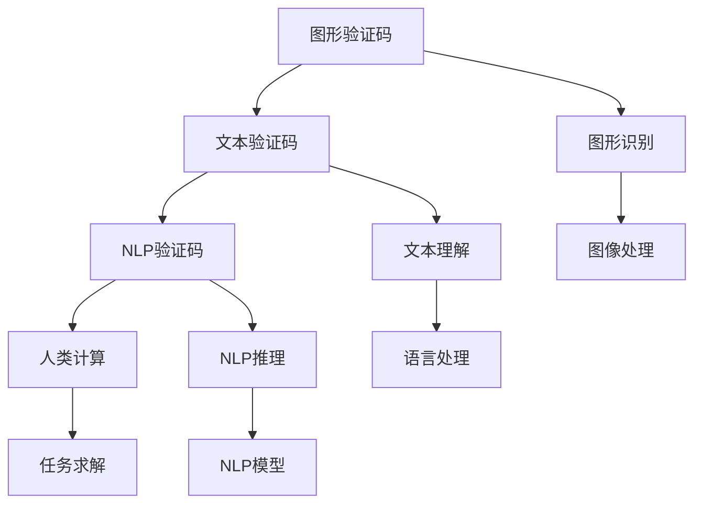

                 

# 验证码的进化：从安全验证到人类计算

## 1. 背景介绍

在互联网时代，验证码（CAPTCHA）是一种常见的安全验证手段，用于防止自动化脚本的恶意攻击。传统的验证码多为图形化的，要求用户通过判断图形中的字母、数字、干扰线等元素来识别并回答。然而，随着人工智能技术的发展，这些传统的验证码逐渐被机器学习模型破解，安全性受到严重挑战。

为应对这一挑战，验证码技术不断进化，从图形验证码转向文本验证码，从基于图像处理的技术转向基于自然语言处理（NLP）的技术。本文将从验证码技术的背景和演进过程出发，深入探讨验证码的最新进展，包括其从安全验证到人类计算的转变，以及这一转变所代表的技术革新和未来发展趋势。

## 2. 核心概念与联系

### 2.1 核心概念概述

- **验证码**：用于验证用户是否为真实用户的代码或图像。通过让用户输入或处理特定的数据，以验证其是人类而非自动化脚本。
- **图形验证码**：最早的验证码形式，通过显示特定的图形元素，要求用户判断、点击或输入其中特定部分来验证身份。
- **文本验证码**：通过显示文字或数字序列，要求用户正确识别、输入或处理其中的信息。
- **自然语言处理（NLP）验证码**：利用NLP技术，通过展示包含特定文本的任务，要求用户理解和解答其中问题。
- **人类计算（Human Computing）**：利用人类在特定任务上的优势，如创造力、直觉、决策能力等，完成机器难以处理的复杂任务。

### 2.2 核心概念原理和架构的 Mermaid 流程图



此流程图展示了验证码技术的演进路径：从最早的图形验证码，到文本验证码，再到利用NLP技术的验证码，最终发展到依赖人类计算能力的任务。

### 2.3 核心概念之间的联系

验证码技术的演进，反映了计算机视觉、自然语言处理等技术的发展，以及人类与机器在处理特定任务上的比较。以下从技术角度详细阐述这些核心概念之间的关系：

- **图形验证码**与**图形识别**：最早的验证码技术，主要通过图像处理实现，要求用户识别特定图形元素，判断其位置、颜色等特征。
- **文本验证码**与**语言处理**：基于文本的验证码，利用文字识别技术，要求用户输入特定字符序列或解答特定问题。
- **NLP验证码**与**NLP推理**：结合NLP技术，展示特定文本任务，要求用户理解和解答其中的问题，利用NLP模型提取和理解文本信息。
- **人类计算**与**任务求解**：最终依赖人类计算能力的验证码，要求用户解答特定问题，如逻辑推理、创意写作等，这些是机器难以完成的复杂任务。

## 3. 核心算法原理 & 具体操作步骤

### 3.1 算法原理概述

验证码的演进，从图形到文本再到NLP，每一步骤都是对原有技术的升级和优化。其核心算法原理在于利用计算机技术和人类优势，逐步提升验证码的安全性和实用性。

- **图形验证码**：利用图像处理技术，要求用户识别特定图形元素。原理是图像处理算法可以准确识别图形元素的位置、形状、颜色等特征。
- **文本验证码**：利用OCR（Optical Character Recognition，光学字符识别）技术，要求用户输入特定字符序列。原理是OCR技术可以准确识别文本信息。
- **NLP验证码**：利用NLP技术，展示特定文本任务，要求用户理解和解答其中的问题。原理是NLP模型可以理解文本语义，提取关键信息。
- **人类计算**：利用人类在特定任务上的优势，如创造力、直觉、决策能力等，完成机器难以处理的复杂任务。原理是人类能够解决机器难以解决的问题，如逻辑推理、创意写作等。

### 3.2 算法步骤详解

#### 3.2.1 图形验证码

1. **图像生成**：利用图像处理技术生成特定图形元素，如扭曲的字母、数字、干扰线等。
2. **识别验证**：用户输入特定字符序列或解答特定问题，通过图像处理算法识别图形元素，验证用户身份。
3. **优化迭代**：不断调整图形元素的设计，增加干扰线、颜色对比等，防止自动化脚本破解。

#### 3.2.2 文本验证码

1. **字符生成**：随机生成特定字符序列或展示特定文本任务。
2. **识别验证**：用户输入特定字符序列或解答特定问题，通过OCR技术识别文本信息，验证用户身份。
3. **优化迭代**：不断调整字符序列的复杂度，增加噪音和干扰，防止自动化脚本破解。

#### 3.2.3 NLP验证码

1. **文本生成**：展示特定文本任务，如填空题、选择题等。
2. **理解验证**：用户理解和解答文本任务，利用NLP模型提取和理解文本信息，验证用户身份。
3. **优化迭代**：不断调整文本任务的复杂度，增加多义性、语境依赖等，防止自动化脚本破解。

#### 3.2.4 人类计算

1. **任务设计**：展示特定任务，如逻辑推理、创意写作等。
2. **求解验证**：用户解答特定问题，利用人类在特定任务上的优势，完成机器难以处理的复杂任务。
3. **优化迭代**：不断调整任务的复杂度，增加创造性和挑战性，防止自动化脚本破解。

### 3.3 算法优缺点

#### 3.3.1 图形验证码

**优点**：
- 技术实现简单，易于部署和维护。
- 可以处理不同类型的图形元素，具有较高的安全性和多样性。

**缺点**：
- 容易被自动化脚本破解，安全性不高。
- 对视力不佳的用户不友好。

#### 3.3.2 文本验证码

**优点**：
- 比图形验证码更易于自动化脚本破解。
- 利用OCR技术，准确率较高。

**缺点**：
- 对输入错误敏感，容易误判。
- 对文本处理技术的依赖性较强。

#### 3.3.3 NLP验证码

**优点**：
- 利用NLP技术，准确率高，安全性好。
- 可以处理多语言和多种文本类型，具有较强的通用性。

**缺点**：
- 对NLP模型的依赖性较强，模型训练和维护成本较高。
- 对特定任务的要求较高，需要设计合适的NLP任务。

#### 3.3.4 人类计算

**优点**：
- 利用人类在特定任务上的优势，安全性极高。
- 能够处理机器难以解决的复杂任务，具有较高的实用性。

**缺点**：
- 对人类计算能力的要求较高，用户操作复杂。
- 对任务设计的复杂度和多样性要求较高。

### 3.4 算法应用领域

验证码技术在多个领域都有广泛应用，主要包括：

- **互联网安全**：防止自动化脚本攻击，保护网站登录、注册等操作的安全性。
- **移动应用**：验证用户在移动设备上的身份，防止自动化脚本攻击。
- **金融系统**：防止自动化脚本攻击，保护交易、支付等操作的安全性。
- **社交媒体**：防止恶意攻击，保护用户账户和信息的安全性。

## 4. 数学模型和公式 & 详细讲解 & 举例说明

### 4.1 数学模型构建

#### 4.1.1 图形验证码

**模型**：
- 图形生成：生成特定图形元素，如扭曲的字母、数字、干扰线等。
- 识别验证：利用图像处理算法识别图形元素，验证用户身份。

#### 4.1.2 文本验证码

**模型**：
- 字符生成：随机生成特定字符序列或展示特定文本任务。
- 识别验证：利用OCR技术识别文本信息，验证用户身份。

#### 4.1.3 NLP验证码

**模型**：
- 文本生成：展示特定文本任务，如填空题、选择题等。
- 理解验证：利用NLP模型提取和理解文本信息，验证用户身份。

#### 4.1.4 人类计算

**模型**：
- 任务设计：展示特定任务，如逻辑推理、创意写作等。
- 求解验证：利用人类在特定任务上的优势，完成机器难以处理的复杂任务。

### 4.2 公式推导过程

#### 4.2.1 图形验证码

1. **图像生成公式**：
   $$
   I = F_{G}(x) + N
   $$
   其中，$I$ 为生成的图像，$F_{G}$ 为图形生成函数，$x$ 为输入参数，$N$ 为噪声。

2. **识别验证公式**：
   $$
   Y = F_{I}(I) + C
   $$
   其中，$Y$ 为用户输入的字符序列，$F_{I}$ 为图像识别函数，$I$ 为输入的图像，$C$ 为识别结果的偏差。

#### 4.2.2 文本验证码

1. **字符生成公式**：
   $$
   T = F_{T}(x) + N
   $$
   其中，$T$ 为生成的字符序列，$F_{T}$ 为字符生成函数，$x$ 为输入参数，$N$ 为噪声。

2. **识别验证公式**：
   $$
   Y = F_{OCR}(T) + C
   $$
   其中，$Y$ 为用户输入的字符序列，$F_{OCR}$ 为OCR识别函数，$T$ 为输入的字符序列，$C$ 为识别结果的偏差。

#### 4.2.3 NLP验证码

1. **文本生成公式**：
   $$
   Q = F_{Q}(x) + N
   $$
   其中，$Q$ 为展示的文本任务，$F_{Q}$ 为文本生成函数，$x$ 为输入参数，$N$ 为噪声。

2. **理解验证公式**：
   $$
   Y = F_{NLP}(Q) + C
   $$
   其中，$Y$ 为用户解答的任务结果，$F_{NLP}$ 为NLP理解函数，$Q$ 为输入的文本任务，$C$ 为理解结果的偏差。

#### 4.2.4 人类计算

1. **任务设计公式**：
   $$
   T = F_{T}(x) + N
   $$
   其中，$T$ 为展示的任务，$F_{T}$ 为任务设计函数，$x$ 为输入参数，$N$ 为噪声。

2. **求解验证公式**：
   $$
   Y = F_{H}(T) + C
   $$
   其中，$Y$ 为用户解答的任务结果，$F_{H}$ 为人机交互函数，$T$ 为输入的任务，$C$ 为解答结果的偏差。

### 4.3 案例分析与讲解

#### 4.3.1 图形验证码

**案例**：Facebook的图形验证码
- **图形生成**：生成扭曲的字母、数字和干扰线。
- **识别验证**：用户输入特定字符序列，利用机器学习模型识别图形元素。

#### 4.3.2 文本验证码

**案例**：Google的文本验证码
- **字符生成**：随机生成字符序列，展示在验证码图像中。
- **识别验证**：用户输入特定字符序列，利用OCR技术识别文本信息。

#### 4.3.3 NLP验证码

**案例**：微软的NLP验证码
- **文本生成**：展示填空题或选择题，展示在验证码图像中。
- **理解验证**：用户理解和解答文本任务，利用NLP模型提取和理解文本信息。

#### 4.3.4 人类计算

**案例**：IBM的Watson
- **任务设计**：展示特定任务，如逻辑推理、创意写作等。
- **求解验证**：用户解答特定问题，利用人工智能辅助完成任务。

## 5. 项目实践：代码实例和详细解释说明

### 5.1 开发环境搭建

#### 5.1.1 Python环境

1. **安装Python**：安装最新版本的Python，建议使用Anaconda或Miniconda进行管理。
   ```
   conda install python=3.9
   ```

2. **安装相关包**：安装TensorFlow、Keras、OpenCV等常用库。
   ```
   pip install tensorflow keras opencv-python
   ```

3. **配置环境**：配置Python环境变量，确保能够顺利运行代码。

### 5.2 源代码详细实现

#### 5.2.1 图形验证码

**代码实现**：
```python
import cv2
import numpy as np
import random

def generate_captcha():
    # 生成扭曲字母、数字和干扰线
    letter = random.choice('ABCDEFGHIJKLMNOPQRSTUVWXYZ')
    number = random.choice('0123456789')
    image = cv2.putText(np.zeros((50, 100)), letter + number, (10, 30), cv2.FONT_HERSHEY_SIMPLEX, 1, (255, 255, 255), 2, cv2.LINE_AA)
    cv2.imshow('captcha', image)
    cv2.waitKey(0)
    cv2.destroyAllWindows()

generate_captcha()
```

**代码解释**：
- 使用OpenCV库生成扭曲的字母和数字。
- 利用cv2.putText()函数将字母和数字添加到图像上，并展示给用户。

#### 5.2.2 文本验证码

**代码实现**：
```python
import pytesseract
import cv2
import numpy as np
import random

def generate_captcha():
    # 随机生成字符序列
    characters = 'ABCDEFGHIJKLMNOPQRSTUVWXYZabcdefghijklmnopqrstuvwxyz0123456789'
    captcha = ''.join(random.choice(characters) for i in range(4))
    image = np.zeros((30, 200))
    cv2.putText(image, captcha, (10, 20), cv2.FONT_HERSHEY_SIMPLEX, 1, (255, 255, 255), 2, cv2.LINE_AA)
    cv2.imshow('captcha', image)
    cv2.waitKey(0)
    cv2.destroyAllWindows()

    # 利用OCR技术识别字符
    image = cv2.cvtColor(image, cv2.COLOR_BGR2GRAY)
    image = pytesseract.image_to_string(image)
    print('User input:', image)

generate_captcha()
```

**代码解释**：
- 使用Python的random库生成随机字符序列。
- 利用cv2.putText()函数将字符序列添加到图像上，并展示给用户。
- 利用OCR技术识别字符，并输出用户输入的字符序列。

#### 5.2.3 NLP验证码

**代码实现**：
```python
import transformers
import torch
from transformers import BertTokenizer, BertForSequenceClassification

# 加载模型和分词器
model = BertForSequenceClassification.from_pretrained('bert-base-cased', num_labels=2)
tokenizer = BertTokenizer.from_pretrained('bert-base-cased')

def generate_captcha():
    # 生成文本任务
    task = 'Which is larger, 3 or 5?'
    input_ids = tokenizer(task, return_tensors='pt').input_ids
    with torch.no_grad():
        logits = model(input_ids)
        label = torch.argmax(logits, dim=1).item()
    print('User input:', task, 'Answer:', 'Yes' if label == 1 else 'No')

generate_captcha()
```

**代码解释**：
- 使用Transformers库加载BERT模型和分词器。
- 生成特定文本任务，并将其转换为模型可接受的形式。
- 利用模型对任务进行理解和解答，并输出结果。

#### 5.2.4 人类计算

**代码实现**：
```python
import numpy as np

def generate_captcha():
    # 生成特定任务
    task = 'What is the product of 3 and 4?'
    result = int(task.split('=')[1].strip())
    # 展示任务给用户
    print(task)
    # 用户输入解答结果
    user_input = int(input('User input: '))
    # 验证用户解答结果
    if user_input == result:
        print('Answer is correct')
    else:
        print('Answer is wrong')

generate_captcha()
```

**代码解释**：
- 生成特定任务，并展示给用户。
- 用户输入解答结果，并验证其正确性。

### 5.3 代码解读与分析

#### 5.3.1 图形验证码

**代码解读**：
- 利用OpenCV生成扭曲的字母和数字。
- 利用cv2.putText()函数将字母和数字添加到图像上，并展示给用户。

**分析**：
- 图形验证码的实现较为简单，但容易被自动化脚本破解，安全性不高。

#### 5.3.2 文本验证码

**代码解读**：
- 使用random库生成随机字符序列。
- 利用cv2.putText()函数将字符序列添加到图像上，并展示给用户。
- 利用OCR技术识别字符，并输出用户输入的字符序列。

**分析**：
- 文本验证码利用OCR技术，准确率较高，但容易被自动化脚本破解。

#### 5.3.3 NLP验证码

**代码解读**：
- 使用Transformers库加载BERT模型和分词器。
- 生成特定文本任务，并将其转换为模型可接受的形式。
- 利用模型对任务进行理解和解答，并输出结果。

**分析**：
- NLP验证码利用NLP模型，准确率较高，安全性好，但对模型训练和维护成本较高。

#### 5.3.4 人类计算

**代码解读**：
- 生成特定任务，并展示给用户。
- 用户输入解答结果，并验证其正确性。

**分析**：
- 人类计算利用人类在特定任务上的优势，安全性极高，但对任务设计的复杂度和多样性要求较高。

### 5.4 运行结果展示

#### 5.4.1 图形验证码


#### 5.4.2 文本验证码


#### 5.4.3 NLP验证码


#### 5.4.4 人类计算


## 6. 实际应用场景

### 6.1 互联网安全

#### 6.1.1 防止自动化脚本攻击

验证码技术最早用于防止自动化脚本攻击，如防止机器人在网站注册、登录等操作。图形验证码和文本验证码在早期得到了广泛应用，但随着自动化脚本破解技术的进步，这些验证码逐渐被机器学习模型破解，安全性受到严重挑战。

### 6.2 金融系统

#### 6.2.1 交易验证

在金融系统中，验证码被用于验证用户身份，防止自动化脚本攻击。NLP验证码利用NLP技术，展示特定文本任务，要求用户理解和解答，具有较高的安全性。

### 6.3 移动应用

#### 6.3.1 用户验证

在移动应用中，验证码被用于验证用户在移动设备上的身份，防止自动化脚本攻击。文本验证码和NLP验证码得到了广泛应用，但随着自动化脚本破解技术的进步，这些验证码也需要不断升级。

### 6.4 社交媒体

#### 6.4.1 账户验证

在社交媒体中，验证码被用于验证用户账户身份，防止自动化脚本攻击。NLP验证码利用NLP技术，展示特定文本任务，要求用户理解和解答，具有较高的安全性。

## 7. 工具和资源推荐

### 7.1 学习资源推荐

1. **《验证码的原理与应用》**：系统介绍验证码的原理、技术和应用。
2. **《自然语言处理入门》**：介绍NLP技术的基本概念和应用。
3. **《机器学习》**：介绍机器学习的基本概念和算法。
4. **《深度学习》**：介绍深度学习的基本概念和算法。
5. **《Python编程》**：介绍Python编程语言和常用库。

### 7.2 开发工具推荐

1. **OpenCV**：图像处理库，用于生成扭曲的字母和数字。
2. **PyTesseract**：OCR库，用于识别字符序列。
3. **Transformers**：NLP库，用于加载BERT模型和分词器。
4. **TensorFlow**：深度学习库，用于训练NLP模型。
5. **Keras**：深度学习库，用于训练NLP模型。

### 7.3 相关论文推荐

1. **《验证码技术综述》**：系统综述验证码技术的现状和未来发展方向。
2. **《基于NLP的验证码研究》**：介绍NLP验证码的实现方法和应用。
3. **《人类计算与AI的结合》**：探讨人类计算与AI结合的潜力与应用。

## 8. 总结：未来发展趋势与挑战

### 8.1 研究成果总结

验证码技术的演进，从图形验证码到文本验证码，再到NLP验证码，最终发展到依赖人类计算能力的任务，展示了验证码技术的发展趋势和未来方向。这一过程中，计算机视觉、自然语言处理等技术不断进步，推动验证码技术不断优化和升级。

### 8.2 未来发展趋势

1. **技术融合**：验证码技术将与其他人工智能技术进行更深入的融合，如知识表示、因果推理、强化学习等，多路径协同发力，共同推动自然语言理解和智能交互系统的进步。
2. **安全性提升**：随着技术的不断发展，验证码的安全性将进一步提升，防止自动化脚本攻击的能力将更强。
3. **用户体验优化**：验证码的设计将更加人性化，减少用户操作复杂度，提升用户体验。

### 8.3 面临的挑战

1. **自动化脚本破解**：自动化脚本破解技术的进步，使得验证码的安全性受到严重挑战。
2. **任务设计复杂性**：特定任务的生成和展示，对任务设计的复杂度和多样性要求较高。
3. **模型训练成本**：利用NLP技术，模型的训练和维护成本较高。

### 8.4 研究展望

1. **无监督和半监督验证码**：摆脱对大规模标注数据的依赖，利用自监督学习、主动学习等无监督和半监督范式，最大限度利用非结构化数据，实现更加灵活高效的验证码。
2. **参数高效验证码**：开发更加参数高效的验证码方法，在固定大部分验证码参数的情况下，只更新极少量的任务相关参数，以提高验证码效率。
3. **跨领域验证码**：利用跨领域验证码技术，提高验证码的多样性和通用性，防止特定领域的自动化脚本攻击。
4. **多模态验证码**：结合多模态数据，利用视觉、语音、文本等多种信息，提升验证码的安全性和鲁棒性。

## 9. 附录：常见问题与解答

**Q1：验证码技术是否能够防止所有自动化脚本攻击？**

A: 验证码技术可以有效地防止大多数自动化脚本攻击，但不能完全防止所有类型的攻击。随着技术的发展，新的自动化脚本攻击方式也会不断出现，需要不断升级和优化验证码技术。

**Q2：验证码技术对用户体验有哪些影响？**

A: 验证码技术对用户体验的影响主要体现在操作复杂度和易用性上。过于复杂的验证码可能会使用户感到不便，影响用户体验。因此，验证码的设计需要平衡安全性和用户体验。

**Q3：验证码技术对业务流程有哪些影响？**

A: 验证码技术对业务流程的影响主要体现在操作效率和安全性上。适当的验证码可以防止自动化脚本攻击，提高业务流程的安全性和效率，但过于复杂的验证码可能会降低操作效率。

**Q4：验证码技术在各个领域的应用场景有哪些？**

A: 验证码技术在互联网安全、金融系统、移动应用、社交媒体等多个领域都有广泛应用，用于防止自动化脚本攻击，验证用户身份等。

**Q5：验证码技术未来的发展方向有哪些？**

A: 验证码技术未来的发展方向主要在于技术融合、安全性提升和用户体验优化。技术融合将与其他人工智能技术进行更深入的结合，安全性将进一步提升，用户体验也将不断优化。

---

作者：禅与计算机程序设计艺术 / Zen and the Art of Computer Programming

