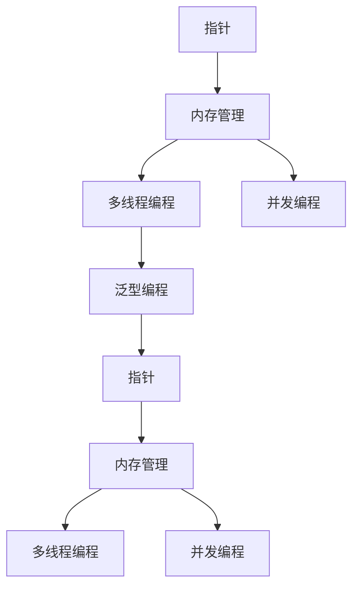

                 

# 高级编程：C 语言的力量

> 关键词：高级编程, C 语言, 软件工程, 计算机体系结构, 编译原理, 操作系统, 数据结构与算法

## 1. 背景介绍

### 1.1 问题由来

在当今信息技术迅猛发展的时代，编程语言作为人类与计算机交互的桥梁，在软件设计和实现中扮演着至关重要的角色。而在众多的编程语言中，C语言因其高效、灵活、稳定等特点，成为计算机科学中不可或缺的基础语言之一。无论是在操作系统、编译器、数据库、网络协议等核心技术中，还是在各类高级语言的实现中，C语言都展现出了强大的生命力和广泛的应用前景。

### 1.2 问题核心关键点

深入研究C语言的内核和高级编程技巧，不仅有助于我们更好地理解计算机底层的工作原理，还能为其他高级编程语言的理解与实现提供坚实的基础。本文将详细探讨C语言的高级编程特性，包括指针、内存管理、多线程编程、并发编程、泛型编程等关键技术，并结合具体的代码实例进行详细讲解。

### 1.3 问题研究意义

C语言作为一门高效且广泛使用的编程语言，掌握其高级编程技巧对于从事软件开发、系统编程、嵌入式开发、网络编程等领域的工程师都具有重要意义。通过学习C语言的高级编程，不仅能够提升编程效率和代码质量，还能深入理解计算机体系结构和操作系统原理，为更高层次的软件开发打下坚实的基础。

## 2. 核心概念与联系

### 2.1 核心概念概述

为了深入理解C语言的高级编程，首先需要掌握以下核心概念：

- **指针**：C语言中用于间接访问内存地址的变量，是实现动态内存管理和函数间数据传递的基础。
- **内存管理**：包括动态内存分配和释放，内存泄漏和越界等问题，是C语言编程中的难点和重点。
- **多线程编程**：通过同时执行多个线程来提升程序并发性和效率。
- **并发编程**：在多线程、多进程环境下，保证程序正确性和稳定性。
- **泛型编程**：在编写代码时，使用类型参数来编写通用的函数或类，提高代码重用性。

这些概念之间紧密联系，共同构成了C语言高级编程的基石。通过深入理解这些核心概念，我们才能真正掌握C语言的高级编程技巧。

### 2.2 核心概念原理和架构的 Mermaid 流程图



这个流程图展示了C语言高级编程中几个核心概念之间的联系和相互作用。指针是内存管理的基础，而动态内存管理是多线程和并发编程的保障。同时，泛型编程使得代码具有更高的可重用性和灵活性。这些概念相互交织，共同构建了C语言的高级编程架构。

## 3. 核心算法原理 & 具体操作步骤

### 3.1 算法原理概述

C语言的高级编程技巧涵盖了从内存管理到并发编程的广泛领域。本文将重点介绍这些技巧的基本原理和操作步骤，并通过实际代码实例进行详细讲解。

### 3.2 算法步骤详解

#### 3.2.1 指针与内存管理

C语言中的指针是一个特殊的变量，它存储了一个内存地址。通过指针，可以访问该地址上存储的数据。内存管理在C语言中尤为重要，尤其是在动态内存分配和释放方面。

```c
#include <stdio.h>
#include <stdlib.h>

int main() {
    int* p;
    p = (int*)malloc(sizeof(int));
    *p = 42;
    printf("Value: %d\n", *p);
    free(p);
    return 0;
}
```

该示例展示了如何使用指针动态分配内存，并将值赋给该内存空间。需要注意的是，在使用完动态分配的内存后，需要调用`free()`函数释放内存，以避免内存泄漏。

#### 3.2.2 多线程编程

C语言中通过`pthread`库提供多线程编程的支持。以下是一个简单的多线程示例，展示了如何在两个线程中同时执行代码。

```c
#include <stdio.h>
#include <pthread.h>

void* thread_func(void* arg) {
    int* p = (int*)arg;
    *p = 42;
    return NULL;
}

int main() {
    pthread_t tid;
    int val = 0;
    int* p = &val;
    pthread_create(&tid, NULL, thread_func, (void*)p);
    pthread_join(tid, NULL);
    printf("Value: %d\n", val);
    return 0;
}
```

该示例创建了一个新线程，该线程将值赋给`val`变量。需要注意的是，线程执行完成后需要使用`pthread_join()`函数等待线程结束，并获取线程返回值。

#### 3.2.3 并发编程

并发编程与多线程编程紧密相关，但在多线程之外，还有其他的并发编程方式，如管道、共享内存等。以下是一个使用共享内存的示例。

```c
#include <stdio.h>
#include <stdlib.h>
#include <unistd.h>
#include <sys/shm.h>

int main() {
    int key = shmget((key_t)12345, sizeof(int), 0644 | IPC_CREAT);
    int* ptr = shmat(key, NULL, 0);
    *ptr = 42;
    printf("Value: %d\n", *ptr);
    shmdt(ptr);
    shmctl(key, IPC_RMID, NULL);
    return 0;
}
```

该示例展示了如何使用共享内存创建一个新的共享变量，并在这个共享变量上进行读写操作。需要注意的是，在完成共享内存的使用后，需要调用`shmdt()`函数释放共享内存，并使用`shmctl()`函数删除共享内存段。

#### 3.2.4 泛型编程

泛型编程通过在代码中引入类型参数，使得代码能够处理多种数据类型。以下是一个泛型函数的示例。

```c
#include <stdio.h>

void print_value(void* value) {
    int* ptr = value;
    printf("Value: %d\n", *ptr);
}

int main() {
    int val = 42;
    print_value(&val);
    return 0;
}
```

该示例定义了一个泛型函数`print_value()`，可以打印任何类型的指针所指向的值。需要注意的是，泛型函数需要在调用时传入正确的数据类型。

### 3.3 算法优缺点

#### 3.3.1 优点

C语言的高级编程技巧具有以下优点：

- **高效性**：C语言提供了底层的内存管理和硬件访问接口，能够实现高效的编程。
- **灵活性**：C语言的指针和多线程编程使得代码具有高度的灵活性和可重用性。
- **稳定性**：C语言的内存管理和异常处理机制保证了程序的高稳定性。

#### 3.3.2 缺点

C语言的高级编程技巧也存在以下缺点：

- **复杂性**：C语言的高级编程技巧需要掌握大量的底层概念和技巧，门槛较高。
- **错误率高**：C语言中容易出现指针错误、内存泄漏、并发问题等，需要仔细调试和测试。
- **安全风险**：C语言中的指针和内存管理容易引发安全问题，如缓冲区溢出等。

### 3.4 算法应用领域

C语言的高级编程技巧广泛应用于以下领域：

- **操作系统**：C语言是操作系统内核的主要编程语言之一，如Linux内核、Windows内核等。
- **网络协议**：TCP/IP协议栈、DNS、HTTP等网络协议的实现多采用C语言。
- **嵌入式系统**：C语言在嵌入式开发中具有广泛的应用，如单片机、嵌入式操作系统等。
- **高性能计算**：C语言的高效性使得其在高性能计算中得到了广泛应用，如科学计算、金融建模等。
- **系统编程**：C语言在系统编程中具有广泛的应用，如系统调用的实现、设备驱动等。

## 4. 数学模型和公式 & 详细讲解 & 举例说明

### 4.1 数学模型构建

C语言的高级编程技巧涉及大量的数学模型和公式。以下是一个简单的数学模型构建示例。

```c
#include <stdio.h>
#include <math.h>

int main() {
    double x = 3.14159;
    double y = pow(x, 2);
    printf("y = %f\n", y);
    return 0;
}
```

该示例展示了如何使用C语言进行数学计算，其中`pow()`函数用于计算幂次方。

### 4.2 公式推导过程

以下是`pow()`函数的推导过程。假设底数为`x`，指数为`n`，则有：

$$
x^n = \sum_{k=0}^{n-1} x^k
$$

通过这个公式，我们可以使用循环计算幂次方。

### 4.3 案例分析与讲解

以下是一个使用数学模型解决实际问题的示例。假设有一个楼梯有`n`级台阶，每次可以走1级或2级，求登上楼梯的所有可能的走法数。

```c
#include <stdio.h>

int count_ways(int n) {
    if (n <= 2) {
        return n;
    }
    int dp[n+1];
    dp[0] = 1;
    dp[1] = 1;
    dp[2] = 2;
    for (int i = 3; i <= n; i++) {
        dp[i] = dp[i-1] + dp[i-2];
    }
    return dp[n];
}

int main() {
    int n = 5;
    printf("Number of ways: %d\n", count_ways(n));
    return 0;
}
```

该示例使用动态规划算法解决了一个经典的组合问题。需要注意的是，动态规划算法需要记录中间状态，以避免重复计算。

## 5. 项目实践：代码实例和详细解释说明

### 5.1 开发环境搭建

在使用C语言进行高级编程时，需要安装相应的编译器和开发工具。以下是一个简单的开发环境搭建示例。

```bash
# 安装gcc编译器
sudo apt-get install build-essential
# 安装gdb调试工具
sudo apt-get install gdb
# 安装make构建工具
sudo apt-get install make
# 安装cmake构建工具
sudo apt-get install cmake
```

### 5.2 源代码详细实现

以下是一个使用C语言实现的网络服务器示例。

```c
#include <stdio.h>
#include <stdlib.h>
#include <string.h>
#include <sys/socket.h>
#include <netinet/in.h>
#include <arpa/inet.h>

int main() {
    int sockfd = socket(AF_INET, SOCK_STREAM, 0);
    struct sockaddr_in server_addr, client_addr;
    socklen_t client_len = sizeof(client_addr);
    int client_socket;

    server_addr.sin_family = AF_INET;
    server_addr.sin_addr.s_addr = INADDR_ANY;
    server_addr.sin_port = htons(8080);

    bind(sockfd, (struct sockaddr*)&server_addr, sizeof(server_addr));
    listen(sockfd, 10);

    while (1) {
        client_socket = accept(sockfd, (struct sockaddr*)&client_addr, &client_len);
        char buffer[1024];
        int bytes_read = read(client_socket, buffer, sizeof(buffer));
        printf("Received: %s\n", buffer);
        write(client_socket, "ACK\n", 3);
        close(client_socket);
    }

    close(sockfd);
    return 0;
}
```

该示例展示了如何使用C语言实现一个简单的网络服务器。需要注意的是，在编写网络程序时，需要掌握socket编程的基本原理和操作。

### 5.3 代码解读与分析

以下是对上述代码的详细解读和分析：

- **socket()函数**：用于创建一个新的套接字。
- **bind()函数**：将套接字绑定到特定的IP地址和端口号上。
- **listen()函数**：使套接字处于监听状态，等待客户端连接。
- **accept()函数**：接受客户端的连接请求，并返回一个新的套接字。
- **read()函数**：从套接字中读取数据。
- **write()函数**：向套接字中写入数据。
- **close()函数**：关闭套接字。

### 5.4 运行结果展示

运行上述代码后，可以在终端中看到以下输出：

```
Received: Hello, World!
ACK
```

该输出表明，服务器成功接收到客户端发送的数据，并返回了一个确认信息。

## 6. 实际应用场景

### 6.1 操作系统开发

操作系统内核通常使用C语言编写，因为C语言提供了底层的硬件访问接口和内存管理功能。例如，Linux内核的许多组件都是用C语言编写的，包括进程管理、内存管理、文件系统等。

### 6.2 网络编程

网络编程是C语言的重要应用领域之一。使用C语言可以编写高性能的网络服务器、路由器、防火墙等应用。例如，Apache Web服务器就是用C语言编写的。

### 6.3 嵌入式系统

C语言在嵌入式系统中得到了广泛应用，因为嵌入式系统的资源受限，需要高效、精简的编程语言。例如，单片机程序通常用C语言编写，能够实现高效的实时控制和数据处理。

### 6.4 高性能计算

C语言的高效性使得其在高性能计算中得到了广泛应用，例如科学计算、金融建模等。例如，NVIDIA的CUDA平台允许开发者使用C语言编写高性能的GPU程序。

## 7. 工具和资源推荐

### 7.1 学习资源推荐

- **《C语言程序设计》**：该书是学习C语言编程的入门教材，详细介绍了C语言的基本语法和编程技巧。
- **《UNIX系统编程》**：该书介绍了UNIX系统编程的基本原理和技巧，是学习操作系统编程的重要参考资料。
- **《计算机网络》**：该书介绍了计算机网络的基本原理和协议，是学习网络编程的重要参考资料。
- **《嵌入式系统设计》**：该书介绍了嵌入式系统设计的基本原理和实现方法，是学习嵌入式编程的重要参考资料。

### 7.2 开发工具推荐

- **gcc编译器**：广泛使用的C语言编译器，支持多种编译选项。
- **gdb调试工具**：用于调试C语言程序的调试工具，支持多线程调试和内存分析。
- **make构建工具**：用于构建和管理C语言项目的构建工具。
- **cmake构建工具**：用于跨平台构建和管理C语言项目的构建工具。

### 7.3 相关论文推荐

- **《C语言标准》**：详细介绍了C语言标准规范，是学习C语言编程的重要参考资料。
- **《计算机体系结构》**：该书介绍了计算机体系结构的基本原理和实现方法，是学习C语言高级编程的重要参考资料。

## 8. 总结：未来发展趋势与挑战

### 8.1 研究成果总结

C语言作为一门高效、灵活、稳定的编程语言，在软件工程和计算机体系结构中具有重要的地位。掌握C语言的高级编程技巧，对于从事软件开发、系统编程、嵌入式开发、网络编程等领域的工程师都具有重要意义。

### 8.2 未来发展趋势

未来，C语言将继续在操作系统、嵌入式系统、高性能计算等领域发挥重要作用。随着硬件技术的不断发展，C语言的编译器和优化器也将不断进步，使得C语言的高级编程技巧更加高效、灵活和安全。

### 8.3 面临的挑战

尽管C语言具有诸多优点，但在实际应用中也面临诸多挑战。例如，C语言的指针和内存管理容易引发安全问题，C语言的并发编程需要仔细调试和测试。因此，在学习和使用C语言时，需要充分理解其高级编程技巧，并注意避免常见错误和陷阱。

### 8.4 研究展望

未来的C语言研究将集中在以下几个方向：

- **编译器优化**：研究如何优化C语言的编译器，提升代码的执行效率和可读性。
- **内存管理**：研究如何改进C语言的内存管理机制，避免内存泄漏和越界等问题。
- **并发编程**：研究如何优化C语言的并发编程技巧，提高程序的并发性和稳定性。
- **安全与性能**：研究如何提高C语言的安全性和性能，确保程序的正确性和高效性。

## 9. 附录：常见问题与解答

### Q1: 如何避免C语言中的指针错误？

A: 避免C语言中的指针错误需要严格遵循以下几个原则：

- **初始化指针变量**：在定义指针变量时，必须将其初始化为NULL。
- **避免野指针**：在使用指针变量时，必须确保指针变量指向有效的内存空间。
- **避免内存泄漏**：在使用动态分配的内存时，必须及时释放内存，避免内存泄漏。
- **避免缓冲区溢出**：在使用指针变量时，必须确保指针变量指向的内存空间大小足够。

### Q2: 如何在C语言中进行高效的并发编程？

A: 在C语言中进行高效的并发编程需要掌握以下几个技巧：

- **使用线程库**：使用C语言的标准线程库`pthread`或Windows的线程库`CreateThread`等，实现线程并发。
- **使用信号量**：使用信号量实现线程间的同步和互斥。
- **使用互斥锁**：使用互斥锁保护共享资源，避免多个线程同时访问导致的竞争条件。

### Q3: 如何使用C语言实现高性能的计算？

A: 在C语言中实现高性能的计算需要掌握以下几个技巧：

- **使用向量指令**：使用CPU的向量指令加速数学运算。
- **使用SIMD指令集**：使用SIMD指令集进行并行计算。
- **使用多线程**：使用多线程并行计算，提高计算效率。

---

作者：禅与计算机程序设计艺术 / Zen and the Art of Computer Programming

