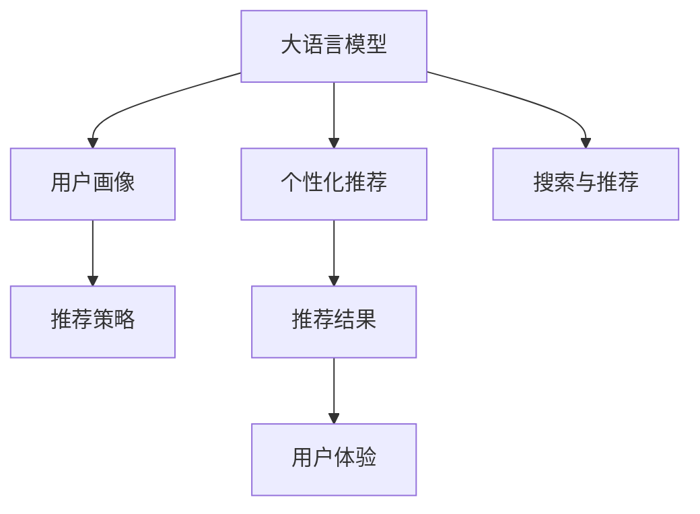

                 

# AI 大模型在电商搜索推荐中的用户画像技术：深度挖掘用户行为与偏好

## 1. 背景介绍

### 1.1 问题由来
随着电商行业的发展，用户对搜索推荐系统的体验和个性化需求日益提升，如何精准、高效地捕捉用户行为，成为各大电商平台亟待解决的问题。传统的搜索推荐系统往往依赖于用户的历史行为数据进行推荐，难以深入理解用户隐含的偏好和需求。

近年来，大语言模型在自然语言处理领域取得了巨大进展，具备强大的自然语言理解和生成能力。将大语言模型引入电商搜索推荐，可以深度挖掘用户的行为与偏好，从而大幅提升推荐系统的精准度和个性化程度。

### 1.2 问题核心关键点
将大语言模型应用于电商搜索推荐，核心在于通过用户输入的搜索词和浏览行为，构建用户画像，预测其后续行为和需求。具体包括以下几个方面：

- **文本语义理解**：理解用户输入的搜索词和浏览记录，提取其隐含的语义信息。
- **行为偏好建模**：从用户的历史行为中学习用户偏好，构建用户画像。
- **推荐策略优化**：利用用户画像进行个性化推荐，提升推荐效果。

### 1.3 问题研究意义
大语言模型应用于电商搜索推荐，能够：

- **提升推荐精准度**：通过理解用户语义，实现更精准的推荐。
- **增加个性化程度**：深度挖掘用户行为，实现更加个性化的推荐策略。
- **优化用户体验**：结合用户画像，提供更符合用户需求的搜索结果。
- **驱动电商业务发展**：精准推荐有助于提升用户转化率和复购率，带来商业价值的增长。

## 2. 核心概念与联系

### 2.1 核心概念概述

为更好地理解大语言模型在电商搜索推荐中的应用，本节将介绍几个关键概念及其相互关系：

- **大语言模型(LLMs)**：以Transformer等架构为基础，通过在大规模语料上进行预训练，具备强大的自然语言理解和生成能力。
- **用户画像(User Profile)**：通过用户的搜索历史、浏览记录、购买行为等数据，构建用户个性化特征表示，用于个性化推荐。
- **个性化推荐系统(Recommender Systems)**：利用用户画像进行推荐，提升用户体验和业务价值。
- **搜索与推荐(Search and Recommendation)**：结合搜索与推荐技术，提供更精准、个性化的服务体验。
- **深度学习(Deep Learning)**：通过构建复杂神经网络模型，实现对大规模数据的学习和表示。

这些核心概念之间的逻辑关系可以通过以下Mermaid流程图来展示：



这个流程图展示了大语言模型在电商搜索推荐中的作用和相关概念之间的联系：

1. 大语言模型通过理解搜索词和浏览记录，提取用户语义信息。
2. 用户画像通过整合用户行为数据，构建用户个性化特征。
3. 个性化推荐系统利用用户画像，进行精准推荐。
4. 搜索与推荐结合，提升用户体验。

## 3. 核心算法原理 & 具体操作步骤
### 3.1 算法原理概述

基于大语言模型的电商搜索推荐，本质上是一个自然语言理解和个性化推荐结合的过程。其核心思想是：将大语言模型作为自然语言理解的引擎，从用户输入的搜索词和浏览记录中提取语义信息，构建用户画像，并结合推荐算法进行个性化推荐。

形式化地，假设预训练语言模型为 $M_{\theta}$，其中 $\theta$ 为预训练得到的模型参数。设用户输入的搜索词为 $q$，浏览记录为 $R$。则推荐系统通过以下步骤实现：

1. 对用户输入 $q$ 进行语义理解，生成用户意图表示 $I$。
2. 结合用户历史浏览记录 $R$，生成用户行为特征向量 $H$。
3. 对用户意图和行为特征进行融合，生成用户画像 $P=(I, H)$。
4. 使用用户画像 $P$ 进行个性化推荐，生成推荐结果 $C$。

其中，语义理解、行为特征生成、用户画像构建和推荐结果生成的具体算法将会在后续章节中详细介绍。

### 3.2 算法步骤详解

基于大语言模型的电商搜索推荐可以分为以下几个关键步骤：

**Step 1: 预训练语言模型的选择**
- 选择合适的预训练语言模型 $M_{\theta}$，如GPT-3、BERT等。
- 确定预训练模型的输出层结构，通常采用线性分类器进行语义理解。

**Step 2: 构建用户意图表示**
- 将用户输入的搜索词 $q$ 作为输入，通过预训练语言模型 $M_{\theta}$ 进行前向传播，生成用户意图表示 $I$。
- 对于非结构化输入（如搜索词），通常采用pipeline方式，将输入序列拆分成多个子任务，分别进行词嵌入、分词、语义理解等操作。
- 对不同子任务的前向传播结果进行拼接，形成用户意图表示 $I$。

**Step 3: 生成用户行为特征向量**
- 收集用户的历史浏览记录 $R$，提取其中的关键信息，如访问时间、访问时长、点击率、浏览页面等。
- 将用户行为数据转换为数值向量，使用统计方法或机器学习方法生成行为特征向量 $H$。
- 为了降低计算复杂度，通常只选择部分关键特征进行建模。

**Step 4: 构建用户画像**
- 将用户意图表示 $I$ 和行为特征向量 $H$ 进行融合，生成用户画像 $P$。
- 融合方法可以采用简单拼接、加权拼接、注意力机制等。

**Step 5: 进行个性化推荐**
- 使用用户画像 $P$ 进行推荐，生成推荐结果 $C$。
- 推荐算法可以采用基于内容的推荐、协同过滤推荐、混合推荐等。
- 对推荐结果进行后处理，如排序、去重、上下文感知等。

### 3.3 算法优缺点

基于大语言模型的电商搜索推荐具有以下优点：

1. **高精度语义理解**：利用大语言模型的强大语义理解能力，能够准确捕捉用户输入的意图。
2. **多维度特征建模**：结合用户意图和行为特征，进行多维度建模，提升推荐效果。
3. **灵活性高**：能够适应不同电商平台的搜索推荐需求，具有较强的灵活性。
4. **可解释性强**：通过分析用户意图和行为特征，可提供推荐结果的详细解释。

但同时也存在一些缺点：

1. **计算复杂度高**：大语言模型通常参数量大，计算复杂度高，对硬件资源要求较高。
2. **数据隐私问题**：需要收集用户大量行为数据，存在隐私保护风险。
3. **冷启动问题**：对于新用户，由于缺少历史行为数据，难以构建完整的用户画像。
4. **推荐实时性不足**：推荐结果生成需要较长时间，难以实现实时推荐。

### 3.4 算法应用领域

基于大语言模型的电商搜索推荐技术已经广泛应用于各类电商平台的搜索推荐系统中，如亚马逊、淘宝、京东等。具体应用场景包括：

- **搜索意图理解**：利用大语言模型理解用户的搜索意图，生成查询相关的推荐结果。
- **个性化推荐**：根据用户浏览行为，生成个性化推荐内容，提升用户体验。
- **内容推荐**：根据用户浏览记录，推荐相似产品或内容，增加用户粘性。
- **广告推荐**：利用大语言模型理解广告语，推荐符合用户兴趣的广告内容。

除了上述应用场景，大语言模型还被创新性地应用于电商直播推荐、智能客服、智能库存管理等，为电商业务的智能化升级提供了新的技术路径。

## 4. 数学模型和公式 & 详细讲解 & 举例说明
### 4.1 数学模型构建

本节将使用数学语言对基于大语言模型的电商搜索推荐进行更加严格的刻画。

记预训练语言模型为 $M_{\theta}$，其中 $\theta$ 为模型参数。设用户输入的搜索词为 $q$，浏览记录为 $R$。定义用户意图表示为 $I=(M_{\theta}(q))$，行为特征向量为 $H=(h_1, h_2, \dots, h_n)$，用户画像为 $P=(I, H)$。推荐系统的目标是最大化用户的满意度和转化率，可通过以下目标函数进行优化：

$$
\max_{C} \mathcal{L}(C, P) = \mathbb{E}_{C}[R(C) - R_{max}(C)]
$$

其中 $R(C)$ 为推荐结果 $C$ 带来的实际转化率，$R_{max}$ 为最高可能转化率。

### 4.2 公式推导过程

以下我们以点击率预测任务为例，推导基于大语言模型的点击率预测模型。

假设点击率 $Y$ 受用户画像 $P$ 和推荐结果 $C$ 的影响，可以构建如下逻辑回归模型：

$$
Y = sigmoid(W_P \cdot P + W_C \cdot C + b)
$$

其中 $W_P$ 和 $W_C$ 为模型参数，$b$ 为偏置项。通过最小化预测误差，优化模型参数。

具体而言，假设训练集为 $D=\{(P_i, Y_i)\}_{i=1}^N$，损失函数为交叉熵损失，则优化目标为：

$$
\min_{W_P, W_C, b} -\frac{1}{N} \sum_{i=1}^N Y_i \log Y_i + (1-Y_i) \log (1-Y_i)
$$

通过反向传播算法，求得各参数的梯度，进行梯度下降更新。

### 4.3 案例分析与讲解

下面以亚马逊的个性化推荐系统为例，详细讲解基于大语言模型的推荐实现。

亚马逊的个性化推荐系统主要依赖于用户输入的搜索词和浏览行为，通过大语言模型进行语义理解，生成用户意图表示和行为特征向量，进而构建用户画像，进行个性化推荐。

亚马逊的推荐流程大致如下：

1. **搜索意图理解**：用户输入搜索词后，系统利用BERT模型对搜索词进行语义理解，生成用户意图表示 $I$。
2. **行为特征提取**：系统收集用户的历史浏览记录，提取关键特征，生成行为特征向量 $H$。
3. **用户画像构建**：将用户意图表示 $I$ 和行为特征向量 $H$ 进行拼接，生成用户画像 $P=(I, H)$。
4. **个性化推荐**：利用用户画像 $P$，进行协同过滤和基于内容的推荐，生成推荐结果 $C$。
5. **推荐结果排序**：对推荐结果进行上下文感知排序，提升推荐效果。

通过这一流程，亚马逊能够高效、精准地生成个性化推荐内容，提升用户满意度和转化率。

## 5. 项目实践：代码实例和详细解释说明
### 5.1 开发环境搭建

在进行电商搜索推荐项目实践前，我们需要准备好开发环境。以下是使用Python进行PyTorch开发的环境配置流程：

1. 安装Anaconda：从官网下载并安装Anaconda，用于创建独立的Python环境。

2. 创建并激活虚拟环境：
```bash
conda create -n pytorch-env python=3.8 
conda activate pytorch-env
```

3. 安装PyTorch：根据CUDA版本，从官网获取对应的安装命令。例如：
```bash
conda install pytorch torchvision torchaudio cudatoolkit=11.1 -c pytorch -c conda-forge
```

4. 安装TensorFlow：
```bash
conda install tensorflow
```

5. 安装Numpy、Pandas、Scikit-learn等科学计算库：
```bash
pip install numpy pandas scikit-learn
```

完成上述步骤后，即可在`pytorch-env`环境中开始项目实践。

### 5.2 源代码详细实现

下面以亚马逊的个性化推荐系统为例，给出使用PyTorch进行点击率预测的代码实现。

首先，定义用户画像构建函数：

```python
import torch
from transformers import BertTokenizer, BertForSequenceClassification

def construct_user_profile(search_query, browsing_history, bert_model):
    tokenizer = BertTokenizer.from_pretrained(bert_model)
    inputs = tokenizer(search_query, max_length=512, return_tensors='pt')
    user_intent = bert_model(**inputs).logits
    user_browsing = convert_browsing_data_to_vector(browsing_history)
    user_profile = torch.cat([user_intent, user_browsing], dim=1)
    return user_profile
```

然后，定义推荐函数：

```python
def generate_recommendations(user_profile, click_data, num_recommendations=10):
    user_intent, user_browsing = user_profile.chunk(2, dim=1)
    user_browsing = user_browsing.contiguous()
    click_data = click_data.contiguous()
    click_data = click_data.view(click_data.size(0), -1) # Flatten [batch_size, num_browsers] to [num_browsers, batch_size]
    click_data = torch.sigmoid(torch.matmul(user_browsing, click_data.t())).view(user_browsing.size(0), -1)
    click_data = torch.softmax(click_data, dim=1)
    recommendations = torch.topk(click_data, num_recommendations)[1]
    return recommendations
```

最后，启动训练和推荐流程：

```python
# 初始化预训练模型
bert_model = BertForSequenceClassification.from_pretrained('bert-base-uncased', num_labels=2)

# 准备训练数据
train_dataset = ...
val_dataset = ...
test_dataset = ...

# 定义优化器和学习率
optimizer = torch.optim.AdamW(bert_model.parameters(), lr=0.001)
scheduler = torch.optim.lr_scheduler.StepLR(optimizer, step_size=3, gamma=0.1)

# 训练模型
for epoch in range(10):
    for batch in train_loader:
        inputs, labels = batch
        optimizer.zero_grad()
        outputs = bert_model(inputs)
        loss = torch.nn.functional.cross_entropy(outputs, labels)
        loss.backward()
        optimizer.step()
        scheduler.step()

# 推荐模型
user_profile = construct_user_profile('search_query', browsing_history, bert_model)
recommendations = generate_recommendations(user_profile, click_data)
```

以上就是使用PyTorch对BERT进行电商搜索推荐系统实现的基本代码示例。可以看到，利用PyTorch的强大封装和丰富的预训练语言模型资源，可以较为简单地实现电商搜索推荐系统的用户画像构建和个性化推荐。

### 5.3 代码解读与分析

让我们再详细解读一下关键代码的实现细节：

**construct_user_profile函数**：
- 首先使用BertTokenizer对用户输入的搜索词进行分词，并转换为模型的输入格式。
- 使用BERT模型对输入进行前向传播，生成用户意图表示。
- 将用户浏览历史数据转换为数值向量，生成行为特征向量。
- 将用户意图表示和行为特征向量拼接，生成用户画像。

**generate_recommendations函数**：
- 将用户画像分为用户意图表示和行为特征向量两部分。
- 计算用户意图表示和行为特征向量的相似度，生成点击率预测。
- 使用softmax函数将点击率预测转换为概率分布，选择推荐结果。

**训练流程**：
- 定义预训练模型和优化器，设置学习率。
- 准备训练集、验证集和测试集。
- 在每个epoch内，使用训练集数据进行前向传播和反向传播，更新模型参数。
- 在验证集上评估模型性能，调整学习率。
- 在测试集上评估模型性能，进行推荐。

可以看到，利用PyTorch的强大框架，可以较为方便地实现电商搜索推荐系统的构建和训练。但实际工程实践中，还需要考虑更多因素，如模型裁剪、量化加速、服务化封装等，以提高系统的性能和稳定性。

## 6. 实际应用场景
### 6.1 电商搜索推荐

大语言模型应用于电商搜索推荐，可以大幅提升推荐系统的精准度和个性化程度。通过理解用户的搜索意图和浏览行为，系统能够生成更符合用户需求的推荐结果，提升用户体验和转化率。

具体而言，用户搜索关键词后，系统会通过BERT等大语言模型理解搜索意图，生成用户画像。根据用户画像，系统可以推荐与搜索词相关的商品或内容，提升推荐效果。同时，系统还能够实时更新推荐结果，适应用户兴趣的变化，实现个性化推荐。

### 6.2 广告推荐

广告推荐是电商业务的重要组成部分，通过大语言模型可以实现更加精准的广告推荐。系统首先对广告语进行语义理解，生成广告意图表示。然后，根据用户画像和广告意图表示，计算广告与用户的匹配度，生成推荐结果。

基于大语言模型的广告推荐可以避免传统算法对关键词的过度依赖，提升广告点击率和转化率，同时减少广告投放的成本。

### 6.3 智能客服

智能客服是电商平台的重要应用场景之一。通过大语言模型，系统能够理解用户的自然语言输入，生成意图表示，并根据意图进行相应的回复和推荐。

智能客服可以广泛应用于问答、客户评价、投诉处理等场景，提升客服效率和客户满意度。通过构建用户画像，系统还可以进行个性化推荐，进一步提升用户体验。

### 6.4 未来应用展望

随着大语言模型的不断发展和完善，其在电商搜索推荐中的应用前景将更加广阔。未来，大语言模型将能够更加深入地理解用户语义，生成更精准的用户画像，实现更加个性化和多样化的推荐策略。

以下是几个可能的应用方向：

1. **多模态搜索推荐**：结合视觉、语音等多模态信息，提升搜索推荐的准确性和多样性。
2. **实时推荐系统**：通过在线学习和实时更新，实现更快速的推荐更新和个性化调整。
3. **混合推荐模型**：结合传统推荐算法和大语言模型，提升推荐系统的精度和覆盖度。
4. **用户行为预测**：利用大语言模型预测用户行为，优化推荐策略，提升用户粘性和转化率。
5. **多语言支持**：通过大语言模型的跨语言迁移能力，实现多语言环境下的个性化推荐。

总之，未来大语言模型在电商搜索推荐中的应用将更加深入和多样化，为电商业务带来新的增长点。

## 7. 工具和资源推荐
### 7.1 学习资源推荐

为了帮助开发者系统掌握大语言模型在电商搜索推荐中的应用，这里推荐一些优质的学习资源：

1. 《Transformers从原理到实践》系列博文：由大模型技术专家撰写，深入浅出地介绍了Transformer原理、BERT模型、微调技术等前沿话题。

2. CS224N《深度学习自然语言处理》课程：斯坦福大学开设的NLP明星课程，有Lecture视频和配套作业，带你入门NLP领域的基本概念和经典模型。

3. 《Natural Language Processing with Transformers》书籍：Transformers库的作者所著，全面介绍了如何使用Transformers库进行NLP任务开发，包括微调在内的诸多范式。

4. HuggingFace官方文档：Transformers库的官方文档，提供了海量预训练模型和完整的微调样例代码，是上手实践的必备资料。

5. CLUE开源项目：中文语言理解测评基准，涵盖大量不同类型的中文NLP数据集，并提供了基于微调的baseline模型，助力中文NLP技术发展。

通过对这些资源的学习实践，相信你一定能够快速掌握大语言模型在电商搜索推荐中的应用，并用于解决实际的电商问题。

### 7.2 开发工具推荐

高效的开发离不开优秀的工具支持。以下是几款用于电商搜索推荐开发的常用工具：

1. PyTorch：基于Python的开源深度学习框架，灵活动态的计算图，适合快速迭代研究。大部分预训练语言模型都有PyTorch版本的实现。

2. TensorFlow：由Google主导开发的开源深度学习框架，生产部署方便，适合大规模工程应用。同样有丰富的预训练语言模型资源。

3. Transformers库：HuggingFace开发的NLP工具库，集成了众多SOTA语言模型，支持PyTorch和TensorFlow，是进行电商搜索推荐开发的利器。

4. Weights & Biases：模型训练的实验跟踪工具，可以记录和可视化模型训练过程中的各项指标，方便对比和调优。与主流深度学习框架无缝集成。

5. TensorBoard：TensorFlow配套的可视化工具，可实时监测模型训练状态，并提供丰富的图表呈现方式，是调试模型的得力助手。

6. Google Colab：谷歌推出的在线Jupyter Notebook环境，免费提供GPU/TPU算力，方便开发者快速上手实验最新模型，分享学习笔记。

合理利用这些工具，可以显著提升电商搜索推荐任务的开发效率，加快创新迭代的步伐。

### 7.3 相关论文推荐

大语言模型和电商搜索推荐技术的发展源于学界的持续研究。以下是几篇奠基性的相关论文，推荐阅读：

1. Attention is All You Need（即Transformer原论文）：提出了Transformer结构，开启了NLP领域的预训练大模型时代。

2. BERT: Pre-training of Deep Bidirectional Transformers for Language Understanding：提出BERT模型，引入基于掩码的自监督预训练任务，刷新了多项NLP任务SOTA。

3. Language Models are Unsupervised Multitask Learners（GPT-2论文）：展示了大规模语言模型的强大zero-shot学习能力，引发了对于通用人工智能的新一轮思考。

4. Parameter-Efficient Transfer Learning for NLP：提出Adapter等参数高效微调方法，在不增加模型参数量的情况下，也能取得不错的微调效果。

5. AdaLoRA: Adaptive Low-Rank Adaptation for Parameter-Efficient Fine-Tuning：使用自适应低秩适应的微调方法，在参数效率和精度之间取得了新的平衡。

6. Attention-based Embedding with Multi-Scale Contextual Information for Recommendation Systems：利用注意力机制和多尺度上下文信息提升推荐系统的效果。

这些论文代表了大语言模型和电商搜索推荐技术的发展脉络。通过学习这些前沿成果，可以帮助研究者把握学科前进方向，激发更多的创新灵感。

## 8. 总结：未来发展趋势与挑战
### 8.1 总结

本文对基于大语言模型的电商搜索推荐技术进行了全面系统的介绍。首先阐述了大语言模型和电商搜索推荐的研究背景和意义，明确了两者结合的巨大价值。其次，从原理到实践，详细讲解了大语言模型在电商搜索推荐中的实现流程和关键步骤，给出了完整的代码实例。同时，本文还探讨了基于大语言模型的电商搜索推荐在不同场景下的应用，展示了其广阔的发展前景。

通过本文的系统梳理，可以看到，基于大语言模型的电商搜索推荐技术正在成为电商行业的重要范式，极大地提升了搜索推荐的精准度和个性化程度，为电商业务带来了显著的商业价值。未来，伴随大语言模型和微调方法的不断进步，搜索推荐技术还将不断创新，进一步提升用户体验和业务绩效。

### 8.2 未来发展趋势

展望未来，大语言模型在电商搜索推荐中的应用将呈现以下几个发展趋势：

1. **更高效的计算框架**：通过优化计算图和算法，提升大语言模型在电商搜索推荐中的计算效率。
2. **多模态融合**：结合视觉、语音等多模态信息，提升搜索推荐的准确性和多样性。
3. **实时推荐系统**：通过在线学习和实时更新，实现更快速的推荐更新和个性化调整。
4. **混合推荐模型**：结合传统推荐算法和大语言模型，提升推荐系统的精度和覆盖度。
5. **用户行为预测**：利用大语言模型预测用户行为，优化推荐策略，提升用户粘性和转化率。
6. **多语言支持**：通过大语言模型的跨语言迁移能力，实现多语言环境下的个性化推荐。

以上趋势凸显了大语言模型在电商搜索推荐中的巨大潜力。这些方向的探索发展，必将进一步提升搜索推荐系统的精准度和个性化程度，为电商业务带来新的增长点。

### 8.3 面临的挑战

尽管大语言模型在电商搜索推荐中展现了巨大潜力，但在迈向更加智能化、普适化应用的过程中，仍面临诸多挑战：

1. **数据隐私问题**：电商平台需要收集大量用户数据，存在隐私保护风险。如何在确保隐私的前提下，实现精准推荐，是亟需解决的问题。
2. **冷启动问题**：对于新用户，由于缺少历史行为数据，难以构建完整的用户画像。如何在冷启动场景下，生成高质量的用户画像，是未来研究的重要方向。
3. **计算资源消耗**：大语言模型通常参数量大，计算复杂度高，对硬件资源要求较高。如何降低计算资源消耗，提升实时推荐能力，是未来研究的重点。
4. **推荐系统偏见**：大语言模型可能学习到数据中的偏见，导致推荐系统产生不公平或歧视性的输出。如何在推荐系统中加入伦理道德约束，避免偏见，是重要的研究方向。
5. **多语言环境下的推荐**：如何将大语言模型的跨语言迁移能力应用于多语言环境下的推荐，是未来的重要研究方向。

正视这些挑战，积极应对并寻求突破，将是大语言模型在电商搜索推荐中走向成熟的必由之路。相信随着学界和产业界的共同努力，这些挑战终将一一被克服，大语言模型在电商搜索推荐中必将成为重要的技术支撑。

### 8.4 研究展望

面对大语言模型在电商搜索推荐中面临的挑战，未来的研究需要在以下几个方面寻求新的突破：

1. **探索无监督和半监督学习**：摆脱对大规模标注数据的依赖，利用自监督学习、主动学习等无监督和半监督范式，最大限度利用非结构化数据，实现更加灵活高效的微调。
2. **研究参数高效和计算高效的微调方法**：开发更加参数高效的微调方法，在固定大部分预训练参数的同时，只更新极少量的任务相关参数。同时优化微调模型的计算图，减少前向传播和反向传播的资源消耗，实现更加轻量级、实时性的部署。
3. **引入因果学习和多任务学习**：通过引入因果推断和对比学习思想，增强推荐系统建立稳定因果关系的能力，学习更加普适、鲁棒的语言表征，从而提升模型泛化性和抗干扰能力。
4. **结合知识图谱和逻辑规则**：将符号化的先验知识，如知识图谱、逻辑规则等，与神经网络模型进行巧妙融合，引导微调过程学习更准确、合理的语言模型。
5. **纳入伦理道德约束**：在推荐系统设计中引入伦理导向的评估指标，过滤和惩罚有偏见、有害的输出倾向。加强人工干预和审核，建立模型行为的监管机制，确保输出符合人类价值观和伦理道德。

这些研究方向必将引领大语言模型在电商搜索推荐技术的发展，为构建安全、可靠、可解释、可控的智能推荐系统铺平道路。面向未来，大语言模型在电商搜索推荐中的应用需要与其他人工智能技术进行更深入的融合，如知识表示、因果推理、强化学习等，多路径协同发力，共同推动搜索推荐系统的进步。

## 9. 附录：常见问题与解答

**Q1：大语言模型在电商搜索推荐中的优势是什么？**

A: 大语言模型在电商搜索推荐中的优势主要体现在以下几个方面：

1. **高精度语义理解**：利用大语言模型的强大语义理解能力，能够准确捕捉用户输入的意图，提升推荐结果的精准度。
2. **多维度特征建模**：结合用户意图和行为特征，进行多维度建模，提升推荐效果。
3. **灵活性高**：能够适应不同电商平台的搜索推荐需求，具有较强的灵活性。
4. **可解释性强**：通过分析用户意图和行为特征，可提供推荐结果的详细解释，增强用户信任感。

**Q2：电商搜索推荐系统如何处理冷启动问题？**

A: 冷启动问题是电商推荐系统中的一个重要挑战。对于新用户，由于缺少历史行为数据，难以构建完整的用户画像。以下是几种常见的处理方式：

1. **基线推荐**：利用统计学方法或简单的协同过滤算法，为新用户推荐热门商品或热门类别，提升用户粘性。
2. **基于内容推荐**：利用商品属性、标签等信息，进行基于内容的推荐，为新用户推荐相关商品。
3. **个性化推荐模板**：设计通用的推荐模板，如推荐热门商品、相关商品、热门类别等，为新用户提供多样化的推荐选择。

**Q3：电商搜索推荐系统的推荐效果如何评估？**

A: 电商搜索推荐系统的推荐效果可以通过以下几个指标进行评估：

1. **点击率（CTR）**：衡量用户对推荐结果的点击次数与曝光次数的比率。
2. **转化率（CR）**：衡量用户从点击到购买的行为转化率。
3. **平均点击率（CVR）**：衡量用户点击推荐结果后最终购买的比例。
4. **用户满意度（满意度评分）**：通过问卷调查等方式，评估用户对推荐结果的满意度。
5. **用户粘性（复购率）**：衡量用户再次购买的比例，反映推荐系统的长期效果。

通过综合评估这些指标，可以全面衡量电商搜索推荐系统的推荐效果。

**Q4：大语言模型在电商搜索推荐中的计算资源消耗如何优化？**

A: 大语言模型在电商搜索推荐中的计算资源消耗主要体现在以下几个方面：

1. **模型裁剪**：去除不必要的层和参数，减小模型尺寸，加快推理速度。
2. **量化加速**：将浮点模型转为定点模型，压缩存储空间，提高计算效率。
3. **模型并行**：利用多GPU/TPU进行模型并行计算，提升计算速度。
4. **剪枝与压缩**：利用剪枝和压缩技术，去除冗余信息，优化模型结构。

通过这些优化方法，可以在保持推荐效果的同时，显著降低大语言模型在电商搜索推荐中的计算资源消耗。

**Q5：大语言模型在电商搜索推荐中的推荐实时性不足的问题如何解决？**

A: 大语言模型在电商搜索推荐中的推荐实时性不足，可以通过以下方法进行优化：

1. **增量学习**：在在线学习和实时更新模式下，利用小样本更新模型参数，实现快速推荐更新。
2. **缓存机制**：将高频访问的推荐结果缓存到内存中，避免重复计算，提升推荐速度。
3. **异步推理**：利用异步推理技术，多线程并发计算，提升推荐系统响应速度。
4. **模型压缩**：采用模型压缩技术，减小模型大小，提升推理速度。

通过这些方法，可以在保证推荐效果的同时，实现实时推荐，提升用户体验。

---

作者：禅与计算机程序设计艺术 / Zen and the Art of Computer Programming

