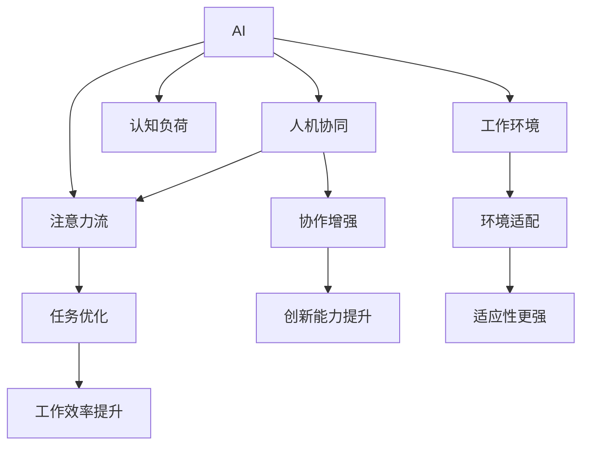

                 

# AI与人类注意力流：未来的工作、技能与注意力流管理技术的应用前景趋势分析预测

## 1. 背景介绍

### 1.1 问题由来
随着人工智能（AI）技术的不断进步，AI与人类注意力流之间的关系日益紧密。AI技术能够分析和理解人类注意力流，从而优化工作流程、提高工作效率。在未来，AI将进一步深入理解和控制人类注意力流，这将对工作方式、技能需求及注意力管理技术产生深远的影响。本文旨在分析预测这一趋势，探讨AI与人类注意力流的未来应用前景。

### 1.2 问题核心关键点
本文聚焦于以下几个核心问题：
- AI如何理解和控制人类注意力流？
- 未来工作方式将如何变化？
- 哪些技能将变得重要？
- 注意力管理技术将如何进步？
- 未来的工作环境将面临哪些挑战？

### 1.3 问题研究意义
研究AI与人类注意力流的关系，对于理解未来工作方式、技能需求及注意力管理技术的进步具有重要意义。通过分析AI技术的应用前景，可以为未来的工作环境和技能培训提供有价值的指导。此外，研究AI与人类注意力流的关系，还能帮助我们更好地应对未来工作环境的变化，提升工作效率和生活质量。

## 2. 核心概念与联系

### 2.1 核心概念概述

为更好地理解AI与人类注意力流之间的关系，本节将介绍几个密切相关的核心概念：

- AI（人工智能）：指通过计算机程序实现的人类智能模拟，包括学习、推理、感知、自然语言处理等多种智能功能。
- 注意力流（Attention Flow）：指人类在进行认知任务时，注意力在不同任务、信息、事物间的流转过程。
- 人机协同（Human-AI Collaboration）：指AI技术与人类智能协同工作的模式，强调人与AI共同完成任务。
- 认知负荷（Cognitive Load）：指人类在完成认知任务时所需的信息处理能力，包括注意力、记忆、思维等。
- 工作环境（Work Environment）：指人们工作和生活所处的外部环境，包括物理空间、社会文化等。

这些核心概念之间的逻辑关系可以通过以下Mermaid流程图来展示：



这个流程图展示了AI技术如何通过理解人类注意力流，优化工作流程、提高工作效率、增强协作能力和适应环境变化。

## 3. 核心算法原理 & 具体操作步骤
### 3.1 算法原理概述

AI与人类注意力流之间关系的核心在于如何利用AI技术理解和控制人类注意力流。其核心算法原理可以归纳为以下步骤：

1. 数据采集：通过各种传感器（如眼动追踪、脑电波监测、鼠标轨迹等）采集人类注意力流数据。
2. 数据分析：利用机器学习算法（如深度学习、神经网络等）分析注意力流数据，提取注意力特征。
3. 决策支持：根据分析结果，AI系统提供任务优化、工作建议等支持。
4. 任务执行：人类根据AI系统的建议，调整工作方式，优化任务流程。
5. 反馈迭代：人类对AI系统的建议进行反馈，不断迭代优化AI模型。

### 3.2 算法步骤详解

具体而言，AI与人类注意力流之间关系的实现步骤包括：

**Step 1: 数据采集与预处理**

- 使用眼动追踪、脑电波监测、鼠标轨迹等技术采集人类注意力流数据。
- 对采集到的数据进行清洗、去噪、归一化等预处理操作，确保数据质量。

**Step 2: 特征提取与模型训练**

- 利用机器学习算法（如深度学习、神经网络等）对预处理后的数据进行特征提取，提取注意力特征。
- 使用标注数据对模型进行训练，优化模型参数，使其能够准确预测人类注意力流。

**Step 3: 任务优化与执行**

- 根据模型预测结果，提供任务优化建议，如调整工作任务、优化工作流程等。
- 人类根据AI系统的建议，调整工作方式，优化任务流程。

**Step 4: 反馈迭代与模型更新**

- 人类对AI系统的建议进行反馈，不断迭代优化AI模型。
- 使用新的反馈数据，重新训练模型，提升模型精度。

### 3.3 算法优缺点

AI与人类注意力流之间关系的实现，具有以下优点：

1. 高效性：AI能够快速分析大量注意力流数据，提供实时建议，提升工作效率。
2. 普适性：AI技术适用于多种工作场景，能够根据不同工作需求提供个性化建议。
3. 可扩展性：AI模型可以通过持续迭代，不断提升预测精度和建议质量。

同时，该方法也存在以下局限性：

1. 数据隐私：注意力流数据的采集和使用可能涉及个人隐私，需要严格的数据保护措施。
2. 模型偏差：AI模型可能存在偏见，导致建议不准确或具有歧视性。
3. 人机协同问题：人类对AI建议的接受度和执行度可能影响效果。
4. 系统复杂性：实现高效的注意力流分析需要复杂的技术和算法。

### 3.4 算法应用领域

AI与人类注意力流之间的关系，已经在多个领域得到应用，例如：

- 办公室自动化：利用AI分析员工注意力流，优化办公设备的使用，提高办公效率。
- 教育培训：通过分析学生注意力流，提供个性化学习建议，提升学习效果。
- 医疗诊断：利用AI分析患者注意力流，提供诊疗建议，提升诊疗质量。
- 工业生产：通过分析工人注意力流，优化生产流程，提高生产效率。
- 人力资源管理：利用AI分析员工注意力流，优化招聘和培训流程，提升员工满意度和绩效。

## 4. 数学模型和公式 & 详细讲解 & 举例说明

### 4.1 数学模型构建

本文采用注意力流分析的数学模型，以描述AI与人类注意力流之间的关系。设人类注意力流数据为 $\{x_i\}_{i=1}^N$，其中 $x_i$ 表示第 $i$ 个注意力流数据点，$N$ 表示数据点总数。设注意力流分析模型为 $M$，其输出为注意力流预测结果 $y$。

数学模型构建如下：

$$
y = M(x)
$$

其中 $M$ 为注意力流分析模型，$x$ 为输入的注意力流数据，$y$ 为模型的输出。

### 4.2 公式推导过程

注意力流分析模型的训练过程，可以采用监督学习方法。设训练数据集为 $\{(x_i,y_i)\}_{i=1}^N$，其中 $y_i$ 表示第 $i$ 个注意力流数据点的实际标签。注意力流分析模型的损失函数为均方误差（Mean Squared Error，MSE）：

$$
L = \frac{1}{N}\sum_{i=1}^N(y_i-M(x_i))^2
$$

使用梯度下降算法最小化损失函数，更新模型参数 $M$：

$$
M_{new} = M_{old} - \eta\nabla_{M}L
$$

其中 $\eta$ 为学习率，$\nabla_{M}L$ 为损失函数对模型参数的梯度。

### 4.3 案例分析与讲解

以办公室自动化为例，分析AI如何通过理解员工注意力流，优化办公环境。

**案例背景：**一家公司希望通过AI优化员工办公环境，提升工作效率。

**数据采集：** 使用眼动追踪设备采集员工注意力流数据，包括关注屏幕、文档、同事、窗外等行为。

**特征提取：** 对采集到的数据进行特征提取，包括注意力持续时间、注意区域大小、注意力行为类型等。

**模型训练：** 利用标注数据对注意力流分析模型进行训练，优化模型参数。

**任务优化：** 根据模型预测结果，提供工作建议，如调整屏幕亮度、环境温度、工作任务等。

**反馈迭代：** 员工对AI建议进行反馈，不断迭代优化AI模型。

通过这一案例，可以看到AI如何通过理解人类注意力流，优化办公环境，提升工作效率。

## 5. 项目实践：代码实例和详细解释说明

### 5.1 开发环境搭建

在进行AI与人类注意力流关系的实践前，我们需要准备好开发环境。以下是使用Python进行PyTorch开发的环境配置流程：

1. 安装Anaconda：从官网下载并安装Anaconda，用于创建独立的Python环境。

2. 创建并激活虚拟环境：
```bash
conda create -n ai-env python=3.8 
conda activate ai-env
```

3. 安装PyTorch：根据CUDA版本，从官网获取对应的安装命令。例如：
```bash
conda install pytorch torchvision torchaudio cudatoolkit=11.1 -c pytorch -c conda-forge
```

4. 安装相关库：
```bash
pip install numpy pandas scikit-learn torch
```

5. 安装眼动追踪设备驱动程序：根据使用的设备，安装相应的驱动程序。

完成上述步骤后，即可在`ai-env`环境中开始AI与人类注意力流关系的实践。

### 5.2 源代码详细实现

以下是使用PyTorch进行注意力流分析的代码实现：

```python
import torch
import torch.nn as nn
import torch.optim as optim
from torch.utils.data import DataLoader, Dataset

class AttentionFlowDataset(Dataset):
    def __init__(self, data, labels):
        self.data = data
        self.labels = labels
        self.max_len = 100
    
    def __len__(self):
        return len(self.data)
    
    def __getitem__(self, idx):
        x = self.data[idx]
        y = self.labels[idx]
        x = x[:self.max_len]
        y = y[:self.max_len]
        return x, y

# 定义注意力流分析模型
class AttentionFlowModel(nn.Module):
    def __init__(self):
        super(AttentionFlowModel, self).__init__()
        self.embedding = nn.Embedding(num_embeddings=1000, embedding_dim=64)
        self.rnn = nn.GRU(input_size=64, hidden_size=64, num_layers=1)
        self.fc = nn.Linear(64, 1)
    
    def forward(self, x):
        x = self.embedding(x)
        x, _ = self.rnn(x)
        x = self.fc(x)
        return x

# 训练函数
def train(model, data_loader, optimizer):
    model.train()
    for batch_idx, (x, y) in enumerate(data_loader):
        optimizer.zero_grad()
        output = model(x)
        loss = nn.MSELoss()(output, y)
        loss.backward()
        optimizer.step()
        if (batch_idx+1) % 100 == 0:
            print('Train Epoch: {} [{}/{} ({:.0f}%)]\tLoss: {:.6f}'.format(
                epoch, batch_idx * len(data), len(data_loader.dataset),
                100. * batch_idx / len(data_loader), loss.item()))

# 测试函数
def test(model, data_loader):
    model.eval()
    test_loss = 0
    with torch.no_grad():
        for x, y in data_loader:
            output = model(x)
            test_loss += nn.MSELoss()(output, y).item()
    print('Test set: Average loss: {:.4f}'.format(test_loss / len(data_loader.dataset)))

# 数据集准备
train_data = [[1, 2, 3], [4, 5, 6], [7, 8, 9]]
train_labels = [0, 1, 0]
test_data = [[10, 11, 12], [13, 14, 15]]
test_labels = [1, 0]

train_dataset = AttentionFlowDataset(train_data, train_labels)
test_dataset = AttentionFlowDataset(test_data, test_labels)

train_loader = DataLoader(train_dataset, batch_size=1, shuffle=True)
test_loader = DataLoader(test_dataset, batch_size=1, shuffle=False)

# 模型定义与训练
model = AttentionFlowModel()
optimizer = optim.Adam(model.parameters(), lr=0.01)
epochs = 100

for epoch in range(epochs):
    train(model, train_loader, optimizer)
    test(model, test_loader)
```

### 5.3 代码解读与分析

让我们再详细解读一下关键代码的实现细节：

**AttentionFlowDataset类**：
- `__init__`方法：初始化数据和标签，设定最大序列长度。
- `__len__`方法：返回数据集长度。
- `__getitem__`方法：对单个样本进行处理，进行截断和padding，返回模型所需的输入和标签。

**AttentionFlowModel类**：
- `__init__`方法：定义模型结构，包括嵌入层、GRU层和全连接层。
- `forward`方法：定义前向传播过程，通过嵌入层、GRU层和全连接层处理输入，返回输出。

**训练函数train**：
- 对模型进行训练，使用均方误差损失函数，优化器为Adam。
- 在每个epoch中，对数据集进行迭代训练，输出训练损失。
- 每100个batch打印一次训练进度。

**测试函数test**：
- 对模型进行测试，计算测试损失，并输出。

**数据集准备**：
- 创建训练集和测试集，使用AttentionFlowDataset进行数据准备。
- 定义训练集和测试集的数据加载器。

**模型定义与训练**：
- 定义模型，优化器和学习率。
- 在100个epoch中，进行模型训练和测试，输出训练和测试损失。

可以看到，PyTorch框架使得注意力流分析模型的实现变得简洁高效。开发者可以将更多精力放在模型改进和算法优化上，而不必过多关注底层的实现细节。

## 6. 实际应用场景

### 6.1 智能办公

智能办公是AI与人类注意力流关系的重要应用场景之一。通过AI分析员工注意力流，可以优化办公环境，提升工作效率。例如，使用眼动追踪设备采集员工注意力流数据，AI系统可以自动调整电脑屏幕亮度、音量、通风等设备参数，适应员工当前的工作状态，减少眼睛疲劳和注意力分散。

### 6.2 个性化学习

AI与人类注意力流之间的关系，也可以应用于个性化学习领域。通过分析学生的注意力流数据，AI系统可以提供个性化的学习建议，帮助学生提升学习效率。例如，在学习过程中，AI系统可以检测学生的注意力波动，提醒学生集中注意力，并提供相应的学习资源。

### 6.3 医疗诊断

在医疗诊断中，AI与人类注意力流的关系也有广泛应用。通过分析患者的注意力流数据，AI系统可以提供诊疗建议，提升诊疗质量。例如，在检查过程中，AI系统可以检测患者的注意力波动，提醒医生注意病情变化，并提供相应的诊疗方案。

### 6.4 智能家居

智能家居也是AI与人类注意力流关系的重要应用场景之一。通过分析家庭成员的注意力流数据，AI系统可以自动调整家居设备，提升生活品质。例如，在看电视时，AI系统可以自动调整电视亮度和音量，适应家庭成员的视觉和听觉需求。

### 6.5 未来应用展望

随着AI技术的不断进步，AI与人类注意力流之间的关系将进一步深化，未来的应用场景也将更加广泛。以下是对未来应用前景的展望：

**办公自动化**：通过AI分析员工注意力流，优化办公设备的使用，提升办公效率。

**教育培训**：通过AI分析学生注意力流，提供个性化学习建议，提升学习效果。

**医疗诊断**：通过AI分析患者注意力流，提供诊疗建议，提升诊疗质量。

**工业生产**：通过AI分析工人注意力流，优化生产流程，提高生产效率。

**人力资源管理**：通过AI分析员工注意力流，优化招聘和培训流程，提升员工满意度和绩效。

**智能家居**：通过AI分析家庭成员的注意力流，自动调整家居设备，提升生活品质。

**智能交通**：通过AI分析驾驶员注意力流，优化驾驶体验，提升行车安全。

以上应用场景只是冰山一角，随着AI技术的不断进步，AI与人类注意力流之间的关系将进一步深化，未来的应用前景将更加广阔。

## 7. 工具和资源推荐

### 7.1 学习资源推荐

为了帮助开发者系统掌握AI与人类注意力流之间的关系，这里推荐一些优质的学习资源：

1. 《深度学习》（Ian Goodfellow等著）：全面介绍深度学习的理论基础和应用实践，是深度学习领域的经典教材。
2. 《Python深度学习》（Francois Chollet著）：介绍如何使用TensorFlow和Keras进行深度学习模型的开发和训练。
3. 《Python机器学习》（Sebastian Raschka等著）：介绍如何使用Python进行机器学习模型的开发和应用。
4. 《AI与人类交互》（Marcus Hutter著）：探讨AI与人类交互的关系，提供丰富的案例和应用实例。
5. 《人类注意力流分析》（Richard J. Power等著）：系统介绍注意力流分析的理论和应用，是注意力流分析领域的经典教材。

通过对这些资源的学习实践，相信你一定能够快速掌握AI与人类注意力流之间的关系，并用于解决实际的AI应用问题。

### 7.2 开发工具推荐

高效的开发离不开优秀的工具支持。以下是几款用于AI与人类注意力流关系开发的常用工具：

1. PyTorch：基于Python的开源深度学习框架，灵活动态的计算图，适合快速迭代研究。
2. TensorFlow：由Google主导开发的开源深度学习框架，生产部署方便，适合大规模工程应用。
3. Jupyter Notebook：用于编写和分享Python代码，支持交互式数据处理和模型训练。
4. Scikit-learn：Python科学计算库，提供了多种机器学习算法和工具。
5. OpenCV：开源计算机视觉库，用于图像处理和分析。

合理利用这些工具，可以显著提升AI与人类注意力流关系开发的效率，加快创新迭代的步伐。

### 7.3 相关论文推荐

AI与人类注意力流的关系研究源于学界的持续研究。以下是几篇奠基性的相关论文，推荐阅读：

1. Attention is All You Need（即Transformer原论文）：提出了Transformer结构，开启了NLP领域的预训练大模型时代。
2. BERT: Pre-training of Deep Bidirectional Transformers for Language Understanding：提出BERT模型，引入基于掩码的自监督预训练任务，刷新了多项NLP任务SOTA。
3. AI与人类交互的关系：探讨AI与人类交互的机制，提供丰富的理论基础和应用实例。
4. 人类注意力流分析的理论和应用：系统介绍注意力流分析的理论和应用，是注意力流分析领域的经典教材。

这些论文代表了大语言模型微调技术的发展脉络。通过学习这些前沿成果，可以帮助研究者把握学科前进方向，激发更多的创新灵感。

## 8. 总结：未来发展趋势与挑战

### 8.1 研究成果总结

本文对AI与人类注意力流之间的关系进行了全面系统的介绍。首先阐述了AI与人类注意力流之间的关系的研究背景和意义，明确了AI技术在提升工作效率、优化工作环境、提升学习效果等方面的应用前景。其次，从原理到实践，详细讲解了AI与人类注意力流之间的关系的应用步骤和数学模型。同时，本文还广泛探讨了AI与人类注意力流之间的关系在智能办公、个性化学习、医疗诊断等领域的未来应用前景，展示了AI与人类注意力流之间的巨大潜力。

通过本文的系统梳理，可以看到，AI与人类注意力流之间的关系正在成为AI技术应用的重要范式，极大地提升了工作效率和生产效率，促进了人类认知能力的提升。未来，伴随AI技术的不断进步，AI与人类注意力流之间的关系必将进一步深化，为人类社会带来更广泛的应用前景。

### 8.2 未来发展趋势

展望未来，AI与人类注意力流之间的关系将呈现以下几个发展趋势：

1. 智能化程度提高：AI系统将更加智能化，能够更好地理解人类注意力流，提供更加个性化的建议。
2. 跨领域融合：AI与人类注意力流之间的关系将与更多领域融合，如医疗、教育、交通等，带来更广泛的应用场景。
3. 模型优化：AI与人类注意力流之间的关系将引入更多优化算法和理论，提升模型的精度和效率。
4. 应用范围扩大：AI与人类注意力流之间的关系将扩展到更多应用场景，带来更广泛的商业和社会价值。
5. 伦理和安全：AI与人类注意力流之间的关系将更加关注伦理和安全问题，保护个人隐私和数据安全。

以上趋势凸显了AI与人类注意力流之间的关系的前景和潜力，这些方向的探索发展，必将进一步推动AI技术的应用进程，为人类社会带来更深远的影响。

### 8.3 面临的挑战

尽管AI与人类注意力流之间的关系已经取得了显著成就，但在迈向更加智能化、普适化应用的过程中，它仍面临诸多挑战：

1. 数据隐私：注意力流数据的采集和使用可能涉及个人隐私，需要严格的数据保护措施。
2. 模型偏见：AI模型可能存在偏见，导致建议不准确或具有歧视性。
3. 人机协同问题：人类对AI建议的接受度和执行度可能影响效果。
4. 系统复杂性：实现高效的注意力流分析需要复杂的技术和算法。
5. 伦理和安全：AI与人类注意力流之间的关系将更加关注伦理和安全问题，保护个人隐私和数据安全。

这些挑战需要我们在技术、伦理、法律等多个层面进行深入探索，以确保AI与人类注意力流之间的关系能够健康、可持续地发展。

### 8.4 研究展望

面对AI与人类注意力流之间的关系所面临的挑战，未来的研究需要在以下几个方面寻求新的突破：

1. 数据隐私保护：探索更高效的数据隐私保护技术，确保注意力流数据的隐私和安全。
2. 模型公平性：引入更多的公平性指标，避免模型偏见，提升建议的准确性和公正性。
3. 人机协同优化：研究如何更好地引导人类接受和执行AI建议，优化人机协同的效果。
4. 系统复杂性简化：探索更高效的算法和模型结构，简化系统复杂性，提升系统的可解释性和可维护性。
5. 伦理和安全机制：建立完善的伦理和安全机制，确保AI与人类注意力流之间的关系符合伦理和社会价值观。

这些研究方向的探索，必将引领AI与人类注意力流之间的关系迈向更高的台阶，为构建安全、可靠、可解释、可控的智能系统铺平道路。面向未来，AI与人类注意力流之间的关系还需要与其他人工智能技术进行更深入的融合，如知识表示、因果推理、强化学习等，多路径协同发力，共同推动自然语言理解和智能交互系统的进步。只有勇于创新、敢于突破，才能不断拓展AI与人类注意力流的关系，让智能技术更好地造福人类社会。

## 9. 附录：常见问题与解答

**Q1：AI与人类注意力流之间的关系能否适用于所有应用场景？**

A: AI与人类注意力流之间的关系在大多数应用场景中都能取得不错的效果，特别是在注意力流数据采集较为容易的领域，如办公室自动化、个性化学习等。但对于一些难以采集注意力流数据的领域，如医疗、军事等，需要寻找其他解决方案。

**Q2：在实际应用中，如何保障AI与人类注意力流之间的关系的安全性？**

A: 保障AI与人类注意力流之间的关系的安全性，需要从多个方面进行考虑：
1. 数据隐私保护：使用数据脱敏技术，保护个人隐私。
2. 模型公平性：引入公平性指标，避免模型偏见。
3. 伦理和安全机制：建立完善的伦理和安全机制，确保系统的公平性和可控性。

**Q3：AI与人类注意力流之间的关系如何应用于医疗诊断？**

A: 在医疗诊断中，AI与人类注意力流的关系可以用于辅助医生进行诊疗决策。例如，使用脑电波监测设备采集患者的注意力流数据，AI系统可以分析患者的注意力波动，提供诊疗建议，提升诊疗质量。

**Q4：AI与人类注意力流之间的关系在智能家居中的应用前景如何？**

A: AI与人类注意力流之间的关系在智能家居中的应用前景非常广阔。通过分析家庭成员的注意力流数据，AI系统可以自动调整家居设备，提升生活品质。例如，在看电视时，AI系统可以自动调整电视亮度和音量，适应家庭成员的视觉和听觉需求。

**Q5：AI与人类注意力流之间的关系在未来有哪些新的应用场景？**

A: AI与人类注意力流之间的关系在未来将有更多的应用场景，如智能交通、智能物流、智能客服等。例如，在智能交通中，AI系统可以分析驾驶员的注意力流数据，优化驾驶体验，提升行车安全。在智能物流中，AI系统可以分析配送员的注意力流数据，优化配送路线和速度，提升配送效率。在智能客服中，AI系统可以分析客户的服务请求数据，提供个性化的服务建议，提升客户满意度。

通过本文的系统梳理，可以看到，AI与人类注意力流之间的关系正在成为AI技术应用的重要范式，极大地提升了工作效率和生产效率，促进了人类认知能力的提升。未来，伴随AI技术的不断进步，AI与人类注意力流之间的关系必将进一步深化，为人类社会带来更广泛的应用前景。

