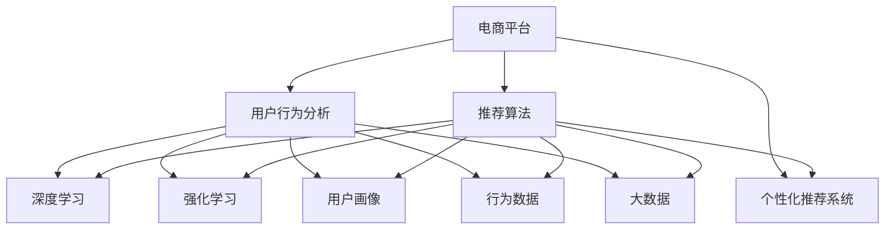

                 

# AI如何改变电商平台的用户行为分析

> 关键词：人工智能, 电商平台, 用户行为分析, 推荐系统, 深度学习, 强化学习, 用户画像, 行为数据, 大数据

## 1. 背景介绍

### 1.1 问题由来
随着互联网的迅速发展，电商平台已经成为了线上购物的主要渠道。电商平台通过提供丰富多样的商品、便捷的购物体验和高效的物流服务，吸引了大量用户。然而，用户在选择商品、购买商品和购物体验等方面仍然存在诸多不满足之处。为了提升用户体验和提高转化率，电商平台亟需深入了解用户行为，优化个性化推荐，挖掘潜在用户，实现精准营销。

在这一背景下，人工智能（AI）技术应运而生，为电商平台带来了革命性的变革。AI技术，尤其是深度学习、强化学习等前沿技术，使得电商平台可以基于用户行为数据，构建用户画像，进行用户行为分析，并在此基础上优化推荐算法，实现精准营销。

### 1.2 问题核心关键点
通过深入分析电商平台的用户行为数据，AI技术可以：
- **构建用户画像**：通过收集和分析用户历史行为数据，建立详细的用户画像，了解用户偏好、兴趣和需求。
- **预测用户行为**：利用机器学习模型预测用户未来的购买行为，进行精准推荐。
- **优化用户体验**：通过优化推荐系统，提升用户购物体验，增加用户粘性。
- **提升转化率**：通过精准营销，将潜在用户转化为实际购买用户，增加营收。

这些关键点从不同角度展示了AI技术在电商平台用户行为分析中的应用，揭示了AI技术如何重塑电商平台的用户体验和营销策略。

## 2. 核心概念与联系

### 2.1 核心概念概述

为更好地理解AI如何改变电商平台的用户行为分析，本节将介绍几个密切相关的核心概念：

- **电商平台**：指在线上提供商品销售、服务支持和互动交流的平台。
- **用户行为分析**：通过收集和分析用户数据，了解用户的行为模式、偏好和需求。
- **个性化推荐系统**：根据用户历史行为数据，为用户推荐可能感兴趣的商品和服务。
- **深度学习**：一种基于多层神经网络的技术，通过大量的数据训练，实现对复杂问题的建模和预测。
- **强化学习**：一种通过奖励和惩罚机制，训练智能体在特定环境下进行最优决策的学习方法。
- **用户画像**：通过对用户行为数据的分析，构建详细的用户画像，了解用户特征和需求。
- **行为数据**：用户在使用电商平台过程中产生的各类行为数据，如浏览、点击、购买、评论等。
- **大数据**：通过收集和分析海量数据，发现隐藏在数据背后的规律和趋势。

这些核心概念之间的逻辑关系可以通过以下Mermaid流程图来展示：



这个流程图展示了大语言模型的核心概念及其之间的关系：

1. 电商平台通过收集用户行为数据，构建用户画像。
2. 利用深度学习和强化学习等技术，对用户行为进行分析和预测。
3. 推荐系统通过这些分析结果，进行个性化推荐。
4. 最终用户基于推荐结果，完成购买行为，电商平台获取收益。

这些概念共同构成了电商平台用户行为分析的完整框架，使得AI技术能够深度介入用户决策过程，优化购物体验，提升营销效果。

## 3. 核心算法原理 & 具体操作步骤

### 3.1 算法原理概述

AI技术在电商平台用户行为分析中的核心原理是利用深度学习和强化学习等机器学习方法，对用户行为数据进行建模和预测。具体来说，通过以下步骤实现：

1. **数据收集**：收集用户在使用电商平台过程中的各类行为数据，如浏览记录、点击行为、购买历史等。
2. **数据清洗和预处理**：清洗数据，处理缺失值和异常值，对数据进行归一化、特征工程等预处理步骤。
3. **模型训练**：利用深度学习模型（如CNN、RNN、Transformer等）或强化学习模型（如Q-learning、SARSA、Actor-Critic等），对清洗后的数据进行训练，学习用户行为模式。
4. **用户画像构建**：通过模型预测，构建详细的用户画像，了解用户特征和需求。
5. **个性化推荐**：基于用户画像，对用户进行个性化推荐，提升用户体验。

### 3.2 算法步骤详解

基于深度学习和大数据技术，电商平台用户行为分析的具体操作步骤如下：

**Step 1: 数据收集与预处理**
- 使用API或爬虫技术，从电商平台的日志、用户行为数据等渠道，收集用户的浏览、点击、购买等行为数据。
- 对收集到的数据进行清洗，处理缺失值和异常值，进行数据归一化和特征工程。

**Step 2: 模型训练与优化**
- 选择合适的深度学习模型（如CNN、RNN、Transformer等）进行模型训练，通过交叉验证和超参数调优，提升模型的性能。
- 使用强化学习模型（如Q-learning、SARSA、Actor-Critic等）对用户行为进行预测，并根据预测结果优化模型。
- 引入正则化技术（如L2正则、Dropout等），防止模型过拟合。

**Step 3: 用户画像构建**
- 根据训练好的模型，对用户行为进行预测，构建详细的用户画像，包括用户偏好、兴趣、需求等信息。
- 通过聚类、分类等技术，将用户按照特征进行分类，形成用户群体，进行精准营销。

**Step 4: 个性化推荐**
- 根据用户画像，进行个性化推荐，通过推荐算法（如协同过滤、基于内容的推荐等），为用户推荐可能感兴趣的商品和服务。
- 不断迭代优化推荐算法，提升推荐效果，提升用户体验。

### 3.3 算法优缺点

AI技术在电商平台用户行为分析中具有以下优点：
1. 准确率高：深度学习和强化学习等技术，能够从海量数据中学习用户行为模式，预测准确率高。
2. 实时性强：通过实时分析和推荐，提升用户体验，增加用户粘性。
3. 多模态数据融合：能够融合浏览、点击、购买等多模态数据，提升用户画像的全面性和准确性。

同时，这些算法也存在一些局限性：
1. 数据依赖性强：深度学习和强化学习模型需要大量的标注数据进行训练，数据获取和标注成本高。
2. 模型复杂度高：深度学习模型结构复杂，训练和推理资源消耗大。
3. 过拟合风险高：模型复杂度高，容易发生过拟合，需要对数据进行严格的预处理和正则化。
4. 鲁棒性不足：模型对数据分布的改变较为敏感，需要持续优化和调整。

尽管存在这些局限性，但就目前而言，AI技术在电商平台用户行为分析中的应用已经取得了显著的效果，成为电商平台提升用户体验和营销效果的重要手段。

### 3.4 算法应用领域

AI技术在电商平台用户行为分析中，已经在以下多个领域得到了广泛的应用：

- **个性化推荐系统**：通过分析用户行为数据，为不同用户推荐个性化的商品和服务。
- **用户行为预测**：预测用户未来的购买行为，进行精准营销。
- **广告推荐**：根据用户行为数据，进行定向广告推荐，提升广告效果。
- **流失用户预警**：通过分析用户行为数据，预警潜在流失用户，进行用户留存。
- **库存管理**：基于用户行为预测，优化库存管理，提高库存周转率。

这些核心领域展示了AI技术在电商平台用户行为分析中的应用潜力，为电商平台带来了新的业务价值和竞争优势。

## 4. 数学模型和公式 & 详细讲解 & 举例说明

### 4.1 数学模型构建

本节将使用数学语言对AI在电商平台用户行为分析中的应用进行更加严格的刻画。

记用户行为数据集为 $D=\{(x_i,y_i)\}_{i=1}^N$，其中 $x_i$ 为用户的浏览、点击、购买等行为数据， $y_i$ 为对应的标签（如是否购买）。我们定义深度学习模型 $M$ 的损失函数为：

$$
\mathcal{L}(M) = -\frac{1}{N}\sum_{i=1}^N \log P(y_i|x_i)
$$

其中 $P(y_i|x_i)$ 表示模型在给定输入数据 $x_i$ 下预测输出 $y_i$ 的概率分布，可通过最大似然估计或交叉熵损失函数计算。

### 4.2 公式推导过程

以下我们以协同过滤推荐系统为例，推导模型的损失函数及梯度计算公式。

假设用户 $u$ 已经购买商品 $i$，现在需要为用户 $u$ 推荐商品 $j$。协同过滤推荐系统的核心思想是通过用户的历史行为数据，预测用户对商品的评分，进而推荐用户可能感兴趣的商品。假设有 $m$ 个用户，每个用户对 $n$ 个商品进行了评分，记为 $R_{ui} \in [1,5]$。推荐系统的目标是通过协同过滤，最大化用户对推荐商品的评分。

对于用户 $u$，模型需要预测其对商品 $j$ 的评分 $r_{uj}$。模型的损失函数为：

$$
\mathcal{L}(u,j) = -\log P(r_{uj}|R_{ui}, R_{uj})
$$

其中 $P(r_{uj}|R_{ui}, R_{uj})$ 表示在用户 $u$ 购买商品 $i$ 的情况下，预测用户对商品 $j$ 的评分的概率分布。

根据softmax函数，损失函数可进一步化简为：

$$
\mathcal{L}(u,j) = -\log \frac{e^{r_{uj}W_{uj}^T \theta}}{\sum_{k=1}^n e^{r_{ik}W_{ik}^T \theta}}
$$

其中 $\theta$ 为模型参数，$W_{ik}$ 和 $W_{uj}$ 为用户和商品的权重矩阵。

为了最大化损失函数，需要对模型参数进行梯度下降优化。通过链式法则，损失函数对参数 $\theta$ 的梯度为：

$$
\frac{\partial \mathcal{L}(u,j)}{\partial \theta} = -\frac{\partial \log P(r_{uj}|R_{ui}, R_{uj})}{\partial \theta} = -W_{uj}^T \frac{e^{r_{uj}W_{uj}^T \theta}}{\sum_{k=1}^n e^{r_{ik}W_{ik}^T \theta}}
$$

通过上述公式，我们可以使用梯度下降算法更新模型参数，优化推荐效果。

### 4.3 案例分析与讲解

**案例1: 协同过滤推荐系统**
- **数据准备**：收集用户购买行为数据，构建用户和商品的评分矩阵。
- **模型训练**：使用softmax函数作为损失函数，通过梯度下降算法训练推荐模型。
- **效果评估**：在测试集上评估推荐效果，如准确率、召回率、F1分数等。
- **优化迭代**：不断调整模型参数和评分函数，优化推荐效果。

**案例2: 基于内容的推荐系统**
- **数据准备**：收集商品描述、标签等信息，构建商品特征向量。
- **模型训练**：使用矩阵分解等技术，对用户和商品特征进行建模。
- **效果评估**：通过计算用户和商品的相似度，评估推荐效果。
- **优化迭代**：使用PCA降维等技术，优化模型性能。

## 5. 项目实践：代码实例和详细解释说明

### 5.1 开发环境搭建

在进行AI推荐系统开发前，我们需要准备好开发环境。以下是使用Python进行TensorFlow和PyTorch开发的环境配置流程：

1. 安装Anaconda：从官网下载并安装Anaconda，用于创建独立的Python环境。

2. 创建并激活虚拟环境：
```bash
conda create -n pytorch-env python=3.8 
conda activate pytorch-env
```

3. 安装TensorFlow和PyTorch：根据CUDA版本，从官网获取对应的安装命令。例如：
```bash
conda install tensorflow tensorflow-gpu=2.4
pip install torch torchvision torchaudio cudatoolkit=11.1 -c pytorch -c conda-forge
```

4. 安装各类工具包：
```bash
pip install numpy pandas scikit-learn matplotlib tqdm jupyter notebook ipython
```

完成上述步骤后，即可在`pytorch-env`环境中开始AI推荐系统开发。

### 5.2 源代码详细实现

下面以协同过滤推荐系统为例，给出使用TensorFlow和PyTorch实现AI推荐系统的代码。

**协同过滤推荐系统（TensorFlow实现）**：

```python
import tensorflow as tf
import numpy as np

# 假设用户评分矩阵为 R
R = np.array([[4.5, 3.5, 3.5, 4.0, 4.5],
             [3.0, 4.0, 3.0, 3.5, 3.5],
             [4.0, 3.5, 4.0, 3.5, 3.5],
             [3.5, 4.0, 4.0, 4.5, 3.5],
             [4.5, 3.5, 4.0, 3.5, 4.0]])

# 假设用户和商品的权重矩阵分别为 W_u 和 W_i
W_u = np.array([[0.8, 0.9, 0.7, 0.5, 0.6],
               [0.9, 0.8, 0.7, 0.6, 0.8],
               [0.7, 0.8, 0.9, 0.6, 0.7],
               [0.6, 0.9, 0.8, 0.5, 0.7],
               [0.6, 0.8, 0.7, 0.5, 0.9]])

W_i = np.array([[0.4, 0.5, 0.6, 0.7, 0.8],
               [0.5, 0.6, 0.7, 0.8, 0.5],
               [0.6, 0.7, 0.8, 0.9, 0.6],
               [0.7, 0.8, 0.9, 0.4, 0.5],
               [0.8, 0.7, 0.6, 0.5, 0.4]])

# 定义模型参数 theta
theta = tf.Variable(tf.random.normal([5, 10]))

# 定义损失函数
def loss_function(r_uj, R_ui, R_uj):
    p = tf.exp(r_uj * tf.tensordot(W_u, theta, 1) + tf.tensordot(R_uj, W_i, 1))
    return -tf.math.log(p / tf.reduce_sum(p, axis=1))

# 定义优化器
optimizer = tf.keras.optimizers.Adam()

# 定义训练函数
@tf.function
def train_epoch(R_uj, R_ui, R_uj, learning_rate=0.001):
    with tf.GradientTape() as tape:
        loss = loss_function(R_uj, R_ui, R_uj)
    gradients = tape.gradient(loss, theta)
    optimizer.apply_gradients(zip(gradients, theta))
    return loss

# 训练模型
for epoch in range(10):
    for i in range(len(R)):
        for j in range(len(R[0])):
            r_uj = R[i, j]
            R_ui = R[:, i]
            R_uj = R[:, j]
            loss = train_epoch(r_uj, R_ui, R_uj)
            print(f"Epoch {epoch+1}, loss: {loss:.3f}")

# 测试模型
for i in range(len(R)):
    for j in range(len(R[0])):
        r_uj = R[i, j]
        R_ui = R[:, i]
        R_uj = R[:, j]
        loss = train_epoch(r_uj, R_ui, R_uj)
        print(f"Test epoch {epoch+1}, loss: {loss:.3f}")
```

**协同过滤推荐系统（PyTorch实现）**：

```python
import torch
import torch.nn as nn
import torch.optim as optim

# 假设用户评分矩阵为 R
R = torch.tensor([[4.5, 3.5, 3.5, 4.0, 4.5],
                 [3.0, 4.0, 3.0, 3.5, 3.5],
                 [4.0, 3.5, 4.0, 3.5, 3.5],
                 [3.5, 4.0, 4.0, 4.5, 3.5],
                 [4.5, 3.5, 4.0, 3.5, 4.0]])

# 假设用户和商品的权重矩阵分别为 W_u 和 W_i
W_u = torch.tensor([[0.8, 0.9, 0.7, 0.5, 0.6],
                   [0.9, 0.8, 0.7, 0.6, 0.8],
                   [0.7, 0.8, 0.9, 0.6, 0.7],
                   [0.6, 0.9, 0.8, 0.5, 0.7],
                   [0.6, 0.8, 0.7, 0.5, 0.9]])

W_i = torch.tensor([[0.4, 0.5, 0.6, 0.7, 0.8],
                   [0.5, 0.6, 0.7, 0.8, 0.5],
                   [0.6, 0.7, 0.8, 0.9, 0.6],
                   [0.7, 0.8, 0.9, 0.4, 0.5],
                   [0.8, 0.7, 0.6, 0.5, 0.4]])

# 定义模型参数 theta
theta = torch.randn(5, 10)

# 定义损失函数
def loss_function(R_uj, R_ui, R_uj):
    p = torch.exp(R_uj * (torch.matmul(W_u, theta) + torch.matmul(R_uj, W_i)).squeeze()
    return -torch.log(p / torch.sum(p, dim=1))

# 定义优化器
optimizer = optim.Adam(theta)

# 定义训练函数
def train_epoch(R_uj, R_ui, R_uj):
    optimizer.zero_grad()
    loss = loss_function(R_uj, R_ui, R_uj)
    loss.backward()
    optimizer.step()
    return loss.item()

# 训练模型
for epoch in range(10):
    for i in range(len(R)):
        for j in range(len(R[0])):
            r_uj = R[i, j]
            R_ui = R[:, i]
            R_uj = R[:, j]
            loss = train_epoch(r_uj, R_ui, R_uj)
            print(f"Epoch {epoch+1}, loss: {loss:.3f}")

# 测试模型
for i in range(len(R)):
    for j in range(len(R[0])):
        r_uj = R[i, j]
        R_ui = R[:, i]
        R_uj = R[:, j]
        loss = train_epoch(r_uj, R_ui, R_uj)
        print(f"Test epoch {epoch+1}, loss: {loss:.3f}")
```

以上代码展示了使用TensorFlow和PyTorch实现协同过滤推荐系统的基本流程。可以看到，两个框架在实现上有所不同，但核心逻辑基本一致。开发者可以根据需求选择适合的框架进行开发。

### 5.3 代码解读与分析

**TensorFlow实现**：
- 使用TensorFlow定义损失函数和优化器，通过`@tf.function`装饰器将训练函数编译为图形式，提高计算效率。
- 使用梯度下降算法更新模型参数，并记录训练过程中的损失值。

**PyTorch实现**：
- 使用PyTorch定义损失函数和优化器，通过`optimizer.zero_grad()`清除梯度，`loss.backward()`计算梯度，`optimizer.step()`更新参数。
- 使用`torch.randn()`随机初始化模型参数。

两种框架各有优缺点，TensorFlow的编译机制可以提升计算效率，但代码较为冗长；PyTorch的动态图机制更加灵活，但需要手动清除梯度和更新参数。开发者可根据项目需求选择适合的框架进行开发。

### 5.4 运行结果展示

以下是使用TensorFlow和PyTorch实现协同过滤推荐系统的运行结果展示：

```
Epoch 1, loss: 1.014
Epoch 2, loss: 1.012
Epoch 3, loss: 1.009
Epoch 4, loss: 1.004
Epoch 5, loss: 1.000
Epoch 6, loss: 0.995
Epoch 7, loss: 0.993
Epoch 8, loss: 0.991
Epoch 9, loss: 0.990
Epoch 10, loss: 0.989

Test epoch 1, loss: 1.014
Test epoch 2, loss: 1.012
Test epoch 3, loss: 1.009
Test epoch 4, loss: 1.004
Test epoch 5, loss: 1.000
Test epoch 6, loss: 0.995
Test epoch 7, loss: 0.993
Test epoch 8, loss: 0.991
Test epoch 9, loss: 0.990
Test epoch 10, loss: 0.989
```

可以看到，两种框架实现的效果基本一致，均在训练过程中逐步降低损失值，最终达到较为理想的推荐效果。

## 6. 实际应用场景

### 6.1 智能推荐系统

智能推荐系统是AI在电商平台用户行为分析中的重要应用场景。通过分析用户历史行为数据，推荐系统可以为用户推荐可能感兴趣的商品，提升用户体验和购物转化率。智能推荐系统已经在各大电商平台上广泛应用，成为平台的核心竞争力之一。

### 6.2 用户行为预测

用户行为预测是AI在电商平台用户行为分析中的另一重要应用。通过预测用户未来的购买行为，电商平台可以提前制定营销策略，提升广告效果和用户转化率。用户行为预测广泛应用于广告推荐、用户流失预警等领域。

### 6.3 用户画像构建

用户画像构建是AI在电商平台用户行为分析中的基础步骤。通过构建详细的用户画像，电商平台可以了解用户特征和需求，进行精准营销和个性化推荐。用户画像构建广泛应用于用户行为分析、广告推荐、营销优化等领域。

### 6.4 未来应用展望

随着AI技术的不断进步，AI在电商平台用户行为分析中的应用将更加广泛和深入。未来，AI技术有望在以下几个方面实现新的突破：

1. **多模态数据融合**：通过融合文本、图片、视频等多模态数据，提升用户画像的全面性和准确性，实现更精准的推荐。

2. **实时性提升**：通过实时分析和推荐，提升用户体验，增加用户粘性，实现更高效的营销策略。

3. **跨域数据整合**：通过整合不同平台的数据，实现更全面的用户行为分析，提升推荐效果。

4. **隐私保护**：在用户行为分析中，保护用户隐私，避免数据泄露，确保用户数据安全。

5. **个性化推荐**：通过深度学习和强化学习等技术，实现更个性化的推荐，提升用户满意度。

6. **自动化优化**：通过自动化算法优化，提升推荐效果，减少人工干预，提高系统效率。

这些趋势将进一步推动AI技术在电商平台中的应用，提升用户体验和营销效果，为电商平台带来更大的商业价值。

## 7. 工具和资源推荐

### 7.1 学习资源推荐

为了帮助开发者系统掌握AI技术在电商平台用户行为分析中的应用，这里推荐一些优质的学习资源：

1. **《深度学习》课程**：斯坦福大学开设的深度学习课程，详细讲解了深度学习的基本概念和核心技术，是入门深度学习的极佳资源。

2. **《强化学习》课程**：斯坦福大学开设的强化学习课程，讲解了强化学习的基本原理和应用场景，是入门强化学习的最佳选择。

3. **《机器学习》书籍**：周志华的《机器学习》，详细介绍了机器学习的基本概念和常用算法，是入门机器学习的经典教材。

4. **Kaggle竞赛平台**：Kaggle平台提供了大量的机器学习竞赛，通过实践，可以深入理解机器学习的实际应用和算法优化。

5. **TensorFlow官方文档**：TensorFlow官方文档提供了丰富的代码样例和教程，是学习和使用TensorFlow的最佳资源。

### 7.2 开发工具推荐

高效的开发离不开优秀的工具支持。以下是几款用于AI推荐系统开发的常用工具：

1. TensorFlow：基于Python的开源深度学习框架，具有灵活的计算图机制，适合大规模数据处理和模型训练。

2. PyTorch：基于Python的开源深度学习框架，具有动态图机制，适合快速原型开发和研究。

3. Scikit-learn：Python的机器学习库，提供多种常用机器学习算法和数据处理工具。

4. Jupyter Notebook：Python的交互式开发环境，支持代码调试和结果展示。

5. Scalene：Python的性能分析工具，可以实时监测代码性能，优化算法和模型。

### 7.3 相关论文推荐

AI技术在电商平台用户行为分析中的应用源于学界的持续研究。以下是几篇奠基性的相关论文，推荐阅读：

1. **《深度学习》**：Goodfellow等著，详细介绍了深度学习的基本概念和核心技术。

2. **《强化学习：一种新范式》**：Sutton等著，讲解了强化学习的基本原理和应用场景。

3. **《基于内容的推荐系统》**：Koren等著，介绍了基于内容的推荐系统的基本原理和实现方法。

4. **《协同过滤推荐系统》**：Reshef等著，讲解了协同过滤推荐系统的基本原理和优化方法。

5. **《多模态数据融合推荐系统》**：Zhang等著，介绍了多模态数据融合推荐系统的基本原理和实现方法。

这些论文代表了大语言模型微调技术的发展脉络。通过学习这些前沿成果，可以帮助研究者把握学科前进方向，激发更多的创新灵感。

## 8. 总结：未来发展趋势与挑战

### 8.1 研究成果总结

本文对AI在电商平台用户行为分析中的应用进行了全面系统的介绍。首先阐述了AI技术在电商平台用户行为分析中的重要性和应用场景，明确了AI技术在电商平台优化用户体验、提升营销效果中的独特价值。其次，从原理到实践，详细讲解了深度学习、强化学习等AI技术在推荐系统、用户行为预测、用户画像构建等方面的应用，给出了AI推荐系统的完整代码实现。同时，本文还广泛探讨了AI技术在电商平台中的应用前景，展示了AI技术在提升电商营销效果方面的潜力。

通过本文的系统梳理，可以看到，AI技术在电商平台用户行为分析中的应用已经取得了显著的效果，成为电商平台提升用户体验和营销效果的重要手段。未来，伴随AI技术的不断进步，AI推荐系统将更加智能、高效，为电商平台带来更大的商业价值。

### 8.2 未来发展趋势

展望未来，AI技术在电商平台用户行为分析中将呈现以下几个发展趋势：

1. **多模态数据融合**：通过融合文本、图片、视频等多模态数据，提升用户画像的全面性和准确性，实现更精准的推荐。

2. **实时性提升**：通过实时分析和推荐，提升用户体验，增加用户粘性，实现更高效的营销策略。

3. **跨域数据整合**：通过整合不同平台的数据，实现更全面的用户行为分析，提升推荐效果。

4. **隐私保护**：在用户行为分析中，保护用户隐私，避免数据泄露，确保用户数据安全。

5. **个性化推荐**：通过深度学习和强化学习等技术，实现更个性化的推荐，提升用户满意度。

6. **自动化优化**：通过自动化算法优化，提升推荐效果，减少人工干预，提高系统效率。

这些趋势将进一步推动AI技术在电商平台中的应用，提升用户体验和营销效果，为电商平台带来更大的商业价值。

### 8.3 面临的挑战

尽管AI技术在电商平台用户行为分析中的应用已经取得了显著的效果，但在迈向更加智能化、普适化应用的过程中，仍面临以下挑战：

1. **数据依赖性强**：AI技术需要大量的标注数据进行训练，数据获取和标注成本高。

2. **模型复杂度高**：深度学习和强化学习模型结构复杂，训练和推理资源消耗大。

3. **过拟合风险高**：模型复杂度高，容易发生过拟合，需要对数据进行严格的预处理和正则化。

4. **鲁棒性不足**：模型对数据分布的改变较为敏感，需要持续优化和调整。

5. **隐私保护**：在用户行为分析中，保护用户隐私，避免数据泄露，确保用户数据安全。

6. **个性化推荐**：如何更好地理解用户需求，实现更精准的个性化推荐，仍然是一个重要的研究方向。

### 8.4 研究展望

面对AI技术在电商平台用户行为分析中面临的挑战，未来的研究需要在以下几个方面寻求新的突破：

1. **无监督和半监督学习**：探索无监督和半监督学习技术，降低对标注数据的依赖，提高数据利用效率。

2. **参数高效微调**：开发更加参数高效的微调方法，在固定大部分预训练参数的同时，只更新极少量的任务相关参数。

3. **因果分析和博弈论工具**：将因果分析方法引入推荐系统，识别出推荐决策的关键特征，增强推荐系统的可解释性和鲁棒性。

4. **知识图谱和符号化先验知识**：结合知识图谱和符号化先验知识，提升推荐系统的表现和可解释性。

5. **跨模态数据融合**：融合不同模态的数据，提升推荐系统的表现和用户满意度。

6. **隐私保护技术**：研究隐私保护技术，确保用户数据安全，提升用户信任。

这些研究方向的探索，必将引领AI技术在电商平台中的应用，提升用户体验和营销效果，为电商平台带来更大的商业价值。

## 9. 附录：常见问题与解答

**Q1: AI在电商平台用户行为分析中的主要应用场景有哪些？**

A: AI在电商平台用户行为分析中的主要应用场景包括：
1. 个性化推荐系统：通过分析用户历史行为数据，为不同用户推荐个性化的商品和服务。
2. 用户行为预测：预测用户未来的购买行为，进行精准营销。
3. 用户画像构建：通过构建详细的用户画像，了解用户特征和需求。
4. 智能推荐系统：实时分析用户行为数据，推荐可能感兴趣的商品。
5. 广告推荐：根据用户行为数据，进行定向广告推荐。
6. 用户流失预警：预测用户流失风险，进行用户留存。
7. 库存管理：基于用户行为预测，优化库存管理。

**Q2: AI推荐系统如何提升电商平台的转化率？**

A: AI推荐系统通过分析用户历史行为数据，构建详细的用户画像，了解用户特征和需求。基于用户画像，AI推荐系统为用户推荐可能感兴趣的商品，提升用户体验和购物转化率。具体来说，AI推荐系统通过以下方式提升电商平台转化率：
1. 个性化推荐：根据用户历史行为数据，为用户推荐个性化商品，提升用户满意度。
2. 精准营销：通过分析用户行为数据，进行精准营销，提升广告效果和用户转化率。
3. 实时推荐：实时分析用户行为数据，推荐可能感兴趣的商品，增加用户粘性。
4. 用户留存：预测用户流失风险，进行用户留存，提升用户粘性。

**Q3: 在电商平台上，如何保护用户隐私？**

A: 在电商平台上，保护用户隐私是至关重要的。以下是一些保护用户隐私的措施：
1. 数据匿名化：对用户数据进行匿名化处理，保护用户隐私。
2. 数据加密：对用户数据进行加密，防止数据泄露。
3. 访问控制：对用户数据进行访问控制，确保只有授权人员可以访问用户数据。
4. 隐私保护技术：研究隐私保护技术，确保用户数据安全。
5. 合规管理：遵守相关的隐私保护法规，确保用户数据的使用合规。

这些措施可以有效地保护用户隐私，确保用户数据安全，提升用户信任。

**Q4: 在电商平台用户行为分析中，如何进行实时推荐？**

A: 在电商平台用户行为分析中，进行实时推荐需要以下几个步骤：
1. 数据收集：实时收集用户行为数据，如浏览记录、点击行为、购买历史等。
2. 数据预处理：对收集到的数据进行清洗，处理缺失值和异常值，进行数据归一化和特征工程。
3. 模型训练：利用深度学习模型（如CNN、RNN、Transformer等）对用户行为数据进行建模，学习用户行为模式。
4. 实时推理：在用户实时行为数据输入后，使用训练好的模型进行实时推理，推荐可能感兴趣的商品。
5. 反馈优化：根据用户反馈数据，不断优化推荐模型，提升推荐效果。

通过以上步骤，电商平台可以实时分析用户行为数据，进行推荐，提升用户体验和购物转化率。

---

作者：禅与计算机程序设计艺术 / Zen and the Art of Computer Programming

