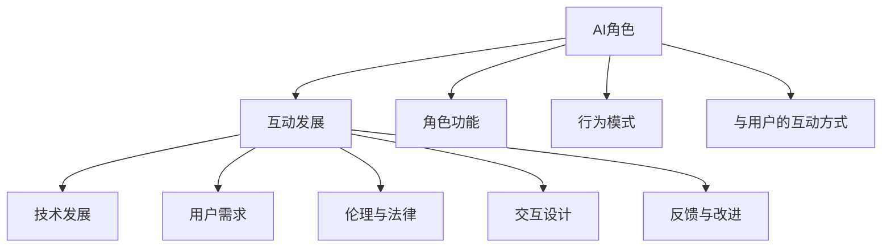
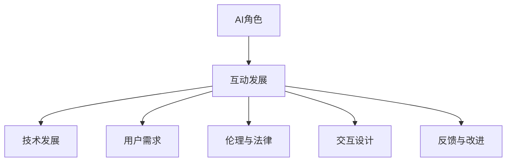

                 

# AI角色演化：长期互动中的人物发展

> 关键词：角色演化, 互动发展, AI伦理, 交互设计, 用户反馈, 持续改进

## 1. 背景介绍

### 1.1 问题由来
在人工智能（AI）技术飞速发展的今天，AI角色逐渐从传统的数据处理和计算任务中走出，逐渐融入人们的生活各个方面。无论是在制造业的自动化生产线，还是在娱乐行业的智能客服，AI都在扮演着越来越重要的角色。但与此同时，AI的角色定位、与用户的交互方式、伦理问题等，也引起了广泛关注和讨论。本文旨在探讨AI角色在长期互动中的演化路径，及其对用户、社会乃至AI技术本身的影响。

### 1.2 问题核心关键点
AI角色的演化受到多方面因素的影响，包括但不限于：
- **技术发展**：AI算法的进步、数据量的增加、硬件计算能力的提升等，都是推动AI角色演化的重要动力。
- **用户需求**：用户对AI角色的期望不断变化，从简单的信息检索到复杂的决策辅助，用户需求的变化推动了AI角色的演变。
- **伦理和法律**：AI角色的发展必须遵循伦理和法律规范，确保其行为符合社会价值观。
- **交互设计**：用户与AI的交互方式是AI角色发展的重要因素，合理的设计能够提升用户体验。
- **反馈与改进**：用户反馈和AI系统的自我改进机制，是AI角色演化的关键驱动因素。

### 1.3 问题研究意义
理解AI角色的长期演化，有助于我们更好地规划AI技术的未来发展方向，优化用户体验，同时确保AI技术的安全性和可控性。这不仅对技术开发人员、产品经理有指导意义，也对监管机构、伦理学家等提供了理论基础。

## 2. 核心概念与联系

### 2.1 核心概念概述

为了更好地理解AI角色在长期互动中的演化，我们先来梳理几个关键概念：

- **AI角色（AI Role）**：指AI在特定场景中扮演的角色，如智能客服、智能推荐系统、自动驾驶等。AI角色由其功能、行为模式、与用户的互动方式等组成。
- **互动发展（Interaction Development）**：指AI角色在与用户长期互动中，通过反馈、优化逐步完善和提升的过程。
- **伦理与法律（Ethics & Law）**：AI角色的开发和应用必须遵循伦理和法律规范，确保其行为符合社会价值观。
- **交互设计（Interaction Design）**：指设计AI角色与用户交互方式，以提升用户体验和满意度。
- **反馈与改进（Feedback & Improvement）**：用户反馈是AI角色演化的重要驱动力，AI系统根据反馈不断优化其行为和功能。

这些概念之间的关系可以通过以下Mermaid流程图来展示：



### 2.2 核心概念原理和架构的 Mermaid 流程图

由于Mermaid流程图不支持嵌套子流程图的特性，这里简化为一个简单的流程图，仅展示核心概念之间的关系：



### 2.3 核心概念之间的关系

- **技术发展**和**互动发展**：技术进步推动了AI角色的功能扩展和行为改进。
- **用户需求**与**互动发展**：用户需求的变化直接影响AI角色的演化方向。
- **伦理与法律**对**互动发展**的制约：AI角色必须遵循伦理和法律规范，确保其行为正当。
- **交互设计**与**互动发展**：合理的设计能提升用户体验，促进AI角色的持续改进。
- **反馈与改进**：用户反馈是AI角色演化的重要驱动力，推动其不断优化。

这些概念共同构成了AI角色演化的生态系统，各要素相互影响，共同推动AI角色的长期发展。

## 3. 核心算法原理 & 具体操作步骤

### 3.1 算法原理概述

AI角色的演化，从根本上讲，是一个动态优化过程。通过不断地接收用户反馈，AI角色不断调整其行为模式和功能，以更好地满足用户需求。这一过程涉及以下几个关键步骤：

1. **功能实现与行为设计**：根据用户需求和技术能力，确定AI角色的基本功能与行为模式。
2. **用户互动与反馈收集**：通过与用户互动，收集其反馈和建议。
3. **行为优化与模型调整**：基于反馈数据，优化AI角色的行为模式和内部模型。
4. **伦理审查与法律合规**：确保AI角色的行为符合伦理和法律规范。

### 3.2 算法步骤详解

以智能推荐系统为例，详细介绍AI角色演化的算法步骤：

1. **功能实现与行为设计**：
   - 确定推荐系统的基本功能，如商品推荐、内容推荐等。
   - 设计推荐算法的行为模式，如基于内容的推荐、协同过滤推荐等。
   - 定义用户界面交互方式，如搜索界面、推荐列表等。

2. **用户互动与反馈收集**：
   - 用户通过搜索和浏览界面与推荐系统互动。
   - 系统记录用户的点击、评分等行为数据。
   - 定期向用户发送满意度调查问卷，收集其对推荐效果的反馈。

3. **行为优化与模型调整**：
   - 基于用户行为数据和反馈，调整推荐算法参数。
   - 使用机器学习模型，不断优化推荐算法。
   - 引入A/B测试，评估新算法的性能。

4. **伦理审查与法律合规**：
   - 确保推荐算法不歧视、不侵犯用户隐私。
   - 遵循GDPR等隐私保护法律。
   - 定期进行伦理审查，确保算法行为符合社会价值观。

### 3.3 算法优缺点

AI角色演化的算法具有以下优点：
- **用户中心**：以用户需求和反馈为核心，持续优化AI角色的功能和行为。
- **动态适应**：能够根据环境变化和用户需求，动态调整AI角色。
- **透明度高**：通过公开透明的优化过程，增加用户信任。

同时，也存在一些缺点：
- **开发成本高**：需要不断收集用户反馈和优化算法，开发成本较高。
- **复杂度增加**：随着功能的增加和算法的复杂化，系统维护难度增加。
- **数据隐私问题**：用户反馈和行为数据可能涉及隐私，需要谨慎处理。

### 3.4 算法应用领域

AI角色演化的算法已经在多个领域得到广泛应用，包括但不限于：

- **智能推荐系统**：如电商平台的商品推荐、音乐推荐、新闻推荐等。
- **智能客服**：如聊天机器人、语音客服等，根据用户反馈不断优化回答内容。
- **自动驾驶**：通过路测反馈不断调整驾驶策略和行为。
- **健康监测**：如智能手表、健康应用，根据用户反馈调整监测内容和提醒方式。
- **金融理财**：如智能投资顾问、财务分析，根据用户反馈调整投资策略。

## 4. 数学模型和公式 & 详细讲解 & 举例说明

### 4.1 数学模型构建

在AI角色的演化过程中，可以使用以下数学模型来描述其行为优化和用户反馈的动态过程：

- **行为优化模型**：基于用户行为数据，构建推荐系统或智能客服的优化模型，如协同过滤算法、深度学习推荐模型等。
- **用户反馈模型**：收集用户反馈，构建满意度评分模型，评估AI角色的性能。
- **时间序列模型**：使用时间序列分析方法，预测用户行为的变化趋势，优化AI角色的行为模式。

### 4.2 公式推导过程

以推荐系统的协同过滤算法为例，推导其优化公式。

设推荐系统的用户集合为 $U$，商品集合为 $I$，用户对商品的评分矩阵为 $R$。协同过滤算法分为两个步骤：

1. **用户行为预测**：
   - 基于用户历史评分 $r_{ui}$，预测用户 $u$ 对商品 $i$ 的评分 $\hat{r}_{ui}$。
   - 常用的预测模型为基于矩阵分解的模型，如SVD（奇异值分解）：
   $$
   \hat{r}_{ui} = \mathbf{p}_u^\top \mathbf{q}_i
   $$
   其中 $\mathbf{p}_u$ 和 $\mathbf{q}_i$ 分别为用户 $u$ 和商品 $i$ 的潜在因子表示。

2. **推荐列表生成**：
   - 根据预测评分 $\hat{r}_{ui}$，生成推荐列表 $L_u$。
   - 常用的排序策略为基于用户评分的排序，如基于平均评分的排序：
   - $$
   L_u = \text{sort}\{(i, \hat{r}_{ui}) \mid i \in I\} \text{by } \hat{r}_{ui} \text{in descending order}
   $$

### 4.3 案例分析与讲解

以智能推荐系统为例，分析其用户反馈模型和行为优化模型：

- **用户反馈模型**：使用满意度评分模型，对用户对推荐结果的满意度进行评分。假设评分范围为1-5，满意度越高，评分越高。
- **行为优化模型**：根据用户评分，调整推荐算法参数，如矩阵分解的因子个数、特征选择等。
- **时间序列模型**：使用ARIMA（自回归积分滑动平均模型），预测用户行为的变化趋势，优化推荐算法。

## 5. 项目实践：代码实例和详细解释说明

### 5.1 开发环境搭建

为了进行AI角色的演化开发，需要搭建一个良好的开发环境。以下是Python环境搭建的步骤：

1. **安装Python**：
   - 从官网下载并安装Python，建议选择3.x版本。
   - 使用conda管理Python环境，创建虚拟环境：
   ```bash
   conda create --name ai_role_dev python=3.8
   conda activate ai_role_dev
   ```

2. **安装必要的依赖包**：
   - 安装Pandas、NumPy、Scikit-learn、Matplotlib等数据处理和可视化工具。
   - 安装TensorFlow或PyTorch等深度学习框架。
   - 安装Flask等Web开发框架，用于搭建测试环境。

3. **配置开发环境**：
   - 配置环境变量，确保能够访问到所需的数据集和工具包。
   - 设置数据库连接，用于存储用户反馈和行为数据。

### 5.2 源代码详细实现

以智能推荐系统为例，展示其实现过程：

```python
import pandas as pd
import numpy as np
from sklearn.decomposition import TruncatedSVD
from sklearn.metrics import mean_absolute_error

# 读取用户评分数据
data = pd.read_csv('user_ratings.csv')

# 构建用户评分矩阵
R = np.array(data[['user_id', 'item_id', 'rating']])

# 用户行为预测
svd = TruncatedSVD(n_components=10)
R_pred = svd.fit_transform(R)

# 推荐列表生成
rating_matrix = np.mean(R_pred, axis=0)
top_n = 5
top_items = np.argsort(rating_matrix)[::-1][:top_n]

# 用户反馈收集
user_feedback = pd.read_csv('user_feedback.csv')
feedback_score = user_feedback['rating_score']

# 行为优化模型
score_diff = feedback_score - np.mean(rating_matrix)
update_factor = score_diff / np.std(rating_matrix)
R_pred *= update_factor.reshape(-1, 1)

# 时间序列模型
import matplotlib.pyplot as plt
from statsmodels.tsa.arima_model import ARIMA

# 构建ARIMA模型
model = ARIMA(data['rating'], order=(1, 1, 1))
results = model.fit()

# 预测未来评分
forecast = results.forecast(steps=10)
plt.plot(forecast)
plt.show()
```

### 5.3 代码解读与分析

上述代码实现了智能推荐系统的基本功能，主要包括：

- **用户评分数据处理**：读取用户评分数据，构建评分矩阵。
- **行为预测**：使用奇异值分解（SVD）进行用户行为预测。
- **推荐列表生成**：根据预测评分生成推荐列表。
- **用户反馈收集**：读取用户反馈数据，计算评分差异。
- **行为优化模型**：根据反馈评分调整预测模型参数。
- **时间序列模型**：使用ARIMA模型预测用户行为变化趋势。

## 6. 实际应用场景

### 6.1 智能推荐系统

智能推荐系统是AI角色演化的典型应用之一。通过不断收集用户反馈，优化推荐算法，系统能够实时调整推荐内容，满足用户的个性化需求。

### 6.2 智能客服

智能客服通过与用户的互动，收集反馈信息，不断改进回答策略和语言模型。如电商平台聊天机器人，可以实时回答用户疑问，并根据用户满意度进行持续优化。

### 6.3 自动驾驶

自动驾驶系统通过路测数据和用户反馈，不断优化驾驶策略，提高安全性。如特斯拉的自动驾驶系统，会根据用户的驾驶反馈，调整算法的参数和行为模式。

### 6.4 健康监测

健康监测设备通过用户反馈，调整监测内容和提醒方式。如智能手表，可以根据用户的使用反馈，优化健康数据收集和分析算法。

### 6.5 金融理财

智能理财顾问根据用户反馈，调整投资策略和理财建议。如智能投资顾问系统，可以根据用户对投资建议的满意度，调整模型参数和推荐内容。

## 7. 工具和资源推荐

### 7.1 学习资源推荐

为了帮助开发者深入理解AI角色的演化过程，推荐以下学习资源：

1. **《AI角色演化：长期互动中的人物发展》**：本文深入探讨了AI角色的演化路径和关键因素。
2. **《用户中心设计：以人为本的AI交互设计》**：介绍如何通过用户中心设计，优化AI角色的行为模式。
3. **《AI伦理与法律》**：深入讨论AI角色的伦理和法律问题，确保其行为合规。
4. **《推荐系统设计与优化》**：详细讲解推荐系统的设计方法和优化技术。
5. **《智能客服系统开发与优化》**：介绍智能客服系统的开发过程和优化策略。

### 7.2 开发工具推荐

以下是一些常用的AI角色演化开发工具：

1. **Python**：强大的编程语言，支持多种第三方库，如Pandas、NumPy、Scikit-learn、TensorFlow、PyTorch等。
2. **Jupyter Notebook**：支持Python代码的交互式执行和可视化。
3. **Git**：版本控制系统，支持团队协作和代码管理。
4. **Flask**：轻量级Web框架，适合搭建测试环境和API接口。
5. **TensorBoard**：深度学习模型的可视化工具，帮助调试和优化模型。

### 7.3 相关论文推荐

以下是几篇重要的AI角色演化论文，推荐阅读：

1. **《智能推荐系统的用户反馈模型》**：提出基于用户反馈的推荐系统优化方法。
2. **《AI角色的长期互动演化》**：探讨AI角色在长期互动中的演化路径。
3. **《用户中心设计的AI角色优化》**：介绍如何通过用户中心设计优化AI角色的行为模式。
4. **《AI角色的伦理与法律问题》**：讨论AI角色的伦理和法律问题，确保其行为合规。
5. **《基于用户反馈的AI角色演化算法》**：提出基于用户反馈的AI角色优化算法。

## 8. 总结：未来发展趋势与挑战

### 8.1 研究成果总结

本文从背景、核心概念、算法原理、操作步骤等方面，全面系统地介绍了AI角色演化的过程和方法。通过理论分析和技术实践，展示了AI角色在长期互动中的动态优化过程，并为开发者提供了丰富的实践参考。

### 8.2 未来发展趋势

展望未来，AI角色的演化将呈现以下几个趋势：

1. **智能化提升**：随着深度学习和自然语言处理技术的进步，AI角色的智能化水平将进一步提升。
2. **个性化增强**：基于用户行为和反馈，AI角色将更加个性化，能够提供更符合用户需求的解决方案。
3. **伦理与法律规范**：AI角色必须遵循伦理和法律规范，确保其行为正当和透明。
4. **跨领域应用**：AI角色将更多地应用于跨领域场景，如医疗、金融、教育等，提供多方面的智能化服务。
5. **用户参与度提升**：通过增强用户互动和反馈机制，提升用户参与度和满意度。

### 8.3 面临的挑战

尽管AI角色的演化取得了显著进展，但未来仍面临一些挑战：

1. **数据隐私问题**：用户反馈和行为数据可能涉及隐私，如何安全处理和存储，是重大挑战。
2. **伦理和法律规范**：确保AI角色的行为符合伦理和法律规范，是一个复杂且关键的问题。
3. **系统复杂度**：随着功能的增加和算法的复杂化，系统的维护和优化难度将进一步增加。
4. **用户接受度**：提升用户对AI角色的接受度，需要不断优化用户体验和增加透明度。

### 8.4 研究展望

未来的研究需要重点关注以下几个方面：

1. **数据隐私保护**：开发更安全的数据处理和存储方法，保护用户隐私。
2. **伦理与法律框架**：构建完善的AI角色伦理和法律框架，确保其行为合规。
3. **跨领域应用**：探索AI角色在更多领域的应用，提升其智能化水平和个性化程度。
4. **用户参与机制**：设计更加用户友好的交互方式，增强用户反馈和参与度。
5. **多模态融合**：将AI角色与多模态数据结合，提升其交互能力和智能化水平。

通过不断探索和优化，AI角色将在未来变得更加智能、安全和可靠，更好地服务于人类社会。

## 9. 附录：常见问题与解答

**Q1：AI角色演化的核心驱动因素是什么？**

A: AI角色的演化主要受技术发展、用户需求、伦理与法律、交互设计和用户反馈等因素驱动。这些因素相互影响，共同推动AI角色的长期发展。

**Q2：AI角色演化中如何处理数据隐私问题？**

A: 数据隐私保护是AI角色演化中的重要问题。为保护用户隐私，可以采用以下措施：
- 数据匿名化：去除敏感信息，保护用户隐私。
- 数据加密：使用加密技术，防止数据泄露。
- 数据访问控制：限制数据访问权限，防止非法使用。
- 数据最小化：仅收集必要的数据，减少隐私风险。

**Q3：如何提升用户对AI角色的接受度？**

A: 提升用户对AI角色的接受度，需要从以下几个方面进行改进：
- 增强透明度：使用户了解AI角色的工作原理和行为逻辑。
- 提升用户体验：设计合理、简洁的用户界面，提高用户满意度。
- 增强互动性：增加用户参与度，让用户感受到AI角色的存在和价值。
- 保证一致性：确保AI角色在不同场景下的行为一致性，减少用户困惑。

**Q4：AI角色演化的难点在哪里？**

A: AI角色演化的难点主要在于：
- 数据隐私保护：确保用户数据的安全和隐私。
- 伦理与法律规范：确保AI角色的行为符合伦理和法律。
- 系统复杂度：随着功能的增加，系统的复杂度将不断提升，维护和优化难度增加。
- 用户接受度：提升用户对AI角色的接受度，需要不断优化用户体验。

**Q5：AI角色演化的未来发展方向是什么？**

A: AI角色演化的未来发展方向包括：
- 智能化提升：通过技术进步，提升AI角色的智能化水平。
- 个性化增强：根据用户行为和反馈，提供更符合用户需求的解决方案。
- 跨领域应用：探索AI角色在更多领域的应用，提升其智能化水平和个性化程度。
- 伦理与法律规范：构建完善的AI角色伦理和法律框架，确保其行为合规。
- 用户参与机制：设计更加用户友好的交互方式，增强用户反馈和参与度。

本文通过深入探讨AI角色演化的过程和方法，为开发者提供了丰富的实践参考，希望能对AI技术的未来发展有所启发和推动。

