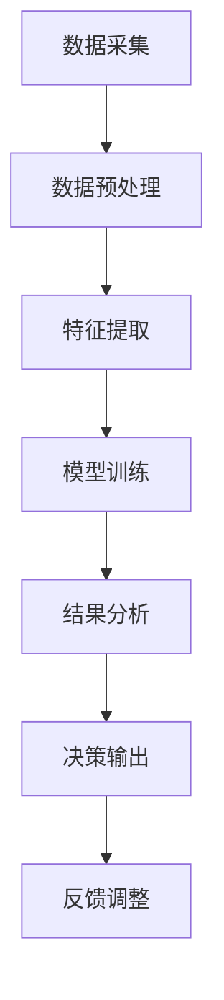

                 

# 人工智能在太空探索和天文学中的应用

> 关键词：人工智能(AI)，太空探索，天文学，空间科学，数据分析，机器学习，深度学习，深度强化学习，数据挖掘，遥感

## 1. 背景介绍

随着科技的迅猛发展，人工智能(AI)正日益成为推动人类社会进步的重要力量。尤其是在太空探索和天文学领域，AI技术的应用为人类对宇宙的认识提供了新的视角和工具。本文将全面介绍AI在太空探索和天文学中的应用，探讨其技术原理、实践应用及未来展望。

## 2. 核心概念与联系

### 2.1 核心概念概述

AI在太空探索和天文学中的应用涉及多个核心概念：

- **人工智能(AI)**：利用算法和计算模型，使机器具备学习、推理、决策等智能行为的技术。
- **太空探索**：人类通过航天器等工具，前往其他天体进行探测和研究的活动。
- **天文学**：研究宇宙及其中各种天体的科学，涉及观测、理论和实验多个方面。
- **空间科学**：探索和研究宇宙的科学分支，涵盖太空探索和天文学。
- **数据分析**：通过计算机技术，从数据中提取有价值信息的过程。
- **机器学习(ML)**：AI的一种，让机器通过学习数据自动改进性能。
- **深度学习(DL)**：一种特殊类型的ML，利用神经网络结构处理复杂数据。
- **深度强化学习(DRL)**：结合DL和强化学习，使机器通过交互式学习优化行为。
- **数据挖掘(Data Mining)**：从大量数据中自动发现模式、趋势和关系的技术。

这些概念通过一系列流程相连接，形成了一个从数据采集、处理、分析到决策输出的完整系统。

### 2.2 核心概念原理和架构的 Mermaid 流程图(Mermaid 流程节点中不要有括号、逗号等特殊字符)



该流程图展示了AI在太空探索和天文学中应用的一般流程：

1. **数据采集**：通过各种探测器、卫星等工具获取宇宙数据。
2. **数据预处理**：清洗、整理数据，准备用于后续分析。
3. **特征提取**：从数据中提取有用的特征。
4. **模型训练**：使用机器学习算法训练模型，学习数据模式。
5. **结果分析**：对模型输出进行分析和解释。
6. **决策输出**：根据分析结果，做出决策或行动计划。
7. **反馈调整**：根据实际效果反馈调整模型和策略。

## 3. 核心算法原理 & 具体操作步骤

### 3.1 算法原理概述

AI在太空探索和天文学中的应用，主要基于机器学习、深度学习等技术。这些技术通过学习大量数据，识别数据中的模式和规律，从而实现对未知现象的预测和决策。

例如，机器学习模型可以通过训练样本数据，学习太阳黑子的出现规律，预测太阳活动的爆发；深度学习模型则可以通过大量观测数据，学习恒星的演化过程，发现新类型的天体。

### 3.2 算法步骤详解

以下是AI在太空探索和天文学中应用的详细步骤：

1. **数据采集**：使用望远镜、卫星、探测器等工具，收集各类天体数据。
2. **数据预处理**：清洗、归一化、标准化数据，去除噪声和异常值。
3. **特征提取**：从原始数据中提取关键特征，如光谱特征、形态参数等。
4. **模型训练**：使用监督学习、无监督学习、半监督学习等方法，训练各类模型。
5. **模型评估**：通过交叉验证、留出法等评估模型性能，选择最优模型。
6. **结果应用**：将模型应用于实际问题，如预测天体运动、分类天体类型等。
7. **反馈调整**：根据实际效果，调整模型参数或重新训练模型。

### 3.3 算法优缺点

AI在太空探索和天文学中的应用具有以下优点：

- **自动化**：自动化处理数据，减少人力投入。
- **高精度**：AI模型能够处理大量数据，发现细微的模式。
- **灵活性**：AI模型可以根据新数据不断学习和改进。

但同时也存在以下缺点：

- **数据依赖**：AI模型需要大量高质量数据进行训练，数据获取成本较高。
- **模型复杂性**：AI模型通常较为复杂，需要高计算资源。
- **可解释性差**：AI模型的决策过程难以解释，不透明。

### 3.4 算法应用领域

AI在太空探索和天文学中的应用涉及多个领域：

- **天体物理**：如恒星演化、星系结构、黑洞探测等。
- **天文数据处理**：如图像处理、光谱分析等。
- **空间任务规划**：如航天器路径规划、故障预测等。
- **天体分类**：如行星分类、恒星分类等。
- **天文数据挖掘**：如星表数据挖掘、引力波探测等。

## 4. 数学模型和公式 & 详细讲解 & 举例说明

### 4.1 数学模型构建

AI在太空探索和天文学中的应用，涉及多种数学模型，如线性回归、决策树、支持向量机、神经网络等。这里以深度学习模型为例，介绍其数学模型构建过程。

**深度神经网络模型**：

- **输入层**：接收原始数据，如图像、光谱等。
- **隐藏层**：通过多个非线性变换，提取高层次特征。
- **输出层**：输出预测结果，如天体分类、运动预测等。

### 4.2 公式推导过程

以**卷积神经网络(CNN)**为例，推导其基本结构。

**卷积层公式**：

$$y=f(W*x+b)$$

其中，$y$为卷积层的输出，$x$为输入数据，$W$为卷积核，$b$为偏置。

**池化层公式**：

$$y=f(w*x+b)$$

其中，$y$为池化层的输出，$x$为输入数据，$w$为池化核，$b$为偏置。

### 4.3 案例分析与讲解

假设我们要对大量星系图像进行分类。使用CNN模型：

1. **输入层**：输入为星系图像，通过预处理转换为矩阵形式。
2. **卷积层**：多个卷积核扫描图像，提取特征。
3. **池化层**：对卷积层的输出进行下采样，减少计算量。
4. **全连接层**：将池化层的输出展平，通过全连接层进行分类。
5. **输出层**：输出分类结果，如星系类型。

## 5. 项目实践：代码实例和详细解释说明

### 5.1 开发环境搭建

以下是使用Python和TensorFlow进行深度学习模型的开发环境搭建步骤：

1. **安装Anaconda**：从官网下载并安装Anaconda，用于创建独立的Python环境。
2. **创建并激活虚拟环境**：
```bash
conda create -n tensorflow-env python=3.8 
conda activate tensorflow-env
```
3. **安装TensorFlow**：
```bash
pip install tensorflow==2.3
```
4. **安装其他库**：
```bash
pip install numpy scipy matplotlib pandas sklearn tqdm jupyter notebook ipython
```

### 5.2 源代码详细实现

下面以星系分类为例，给出使用TensorFlow进行CNN模型训练的代码实现：

```python
import tensorflow as tf
from tensorflow.keras import layers, models

# 定义模型
model = models.Sequential([
    layers.Conv2D(32, (3,3), activation='relu', input_shape=(32,32,3)),
    layers.MaxPooling2D((2,2)),
    layers.Conv2D(64, (3,3), activation='relu'),
    layers.MaxPooling2D((2,2)),
    layers.Conv2D(64, (3,3), activation='relu'),
    layers.Flatten(),
    layers.Dense(64, activation='relu'),
    layers.Dense(10, activation='softmax')
])

# 编译模型
model.compile(optimizer='adam', loss='sparse_categorical_crossentropy', metrics=['accuracy'])

# 训练模型
model.fit(train_images, train_labels, epochs=10, validation_data=(test_images, test_labels))
```

### 5.3 代码解读与分析

这段代码展示了使用TensorFlow构建CNN模型，并对星系图像进行分类的基本流程：

1. **定义模型**：通过Sequential模型，依次添加卷积层、池化层、全连接层。
2. **编译模型**：指定优化器、损失函数和评估指标。
3. **训练模型**：使用训练数据集，设定训练轮数和验证集。

## 6. 实际应用场景

### 6.1 空间科学数据处理

空间科学数据的处理是AI在太空探索中应用的重要场景。例如，对航天器传回的高分辨率图像进行自动标注和分类，可以帮助科学家快速获取有价值的信息。

### 6.2 天体分类和演化预测

AI模型能够通过分析天体的光谱、形态等数据，自动分类和预测天体的演化过程。例如，使用神经网络模型，对新的恒星光谱进行分类，识别其光谱类型和金属丰度。

### 6.3 空间任务规划

AI在太空探索中，还用于辅助航天器的路径规划、故障预测等任务。例如，通过深度强化学习模型，实时规划航天器的飞行路径，优化能源消耗，确保任务顺利完成。

### 6.4 未来应用展望

未来，AI在太空探索和天文学中的应用将更加广泛：

1. **多模态融合**：将多模态数据（如光谱、图像、时间序列）进行融合，提高数据的综合分析能力。
2. **实时预测**：通过在线学习，实时更新模型参数，提高预测精度。
3. **跨领域应用**：AI技术将应用于其他科学领域，如天文学与地球科学、物理学等交叉学科。
4. **自动化科学发现**：AI模型能够自动发现新的天文现象和规律，加速科学研究的进程。

## 7. 工具和资源推荐

### 7.1 学习资源推荐

- **《深度学习》（Ian Goodfellow等）**：经典教材，全面介绍深度学习的理论和实践。
- **Coursera《深度学习专项课程》**：由Andrew Ng教授主讲的深度学习课程，深入浅出。
- **Kaggle**：数据科学竞赛平台，提供大量天文数据集和机器学习案例。
- **天文学数据集**：如MNIST、CIFAR等数据集，可用于训练和测试深度学习模型。

### 7.2 开发工具推荐

- **TensorFlow**：Google开发的深度学习框架，支持GPU加速，适合大规模数据处理。
- **PyTorch**：Facebook开发的深度学习框架，灵活易用，适合研究和原型开发。
- **Keras**：高层神经网络API，易于上手，适合初学者和快速原型开发。
- **Jupyter Notebook**：交互式编程环境，适合数据分析和模型训练。

### 7.3 相关论文推荐

- **《深度学习在天文观测数据中的应用》**：探讨深度学习在天体物理中的具体应用，如星系分类、恒星演化预测等。
- **《利用机器学习进行空间任务规划》**：研究如何通过机器学习优化航天器的路径规划和任务调度。
- **《深度强化学习在空间科学中的应用》**：介绍深度强化学习在空间任务优化中的具体案例。

## 8. 总结：未来发展趋势与挑战

### 8.1 研究成果总结

AI在太空探索和天文学中的应用，已取得显著成果：

- **天体分类**：准确率显著提升，帮助科学家快速识别各类天体。
- **演化预测**：能够预测恒星的寿命和演化过程，提供新的天体演化理论。
- **路径规划**：优化航天器的飞行路径，减少能源消耗，降低成本。

### 8.2 未来发展趋势

未来，AI技术将在太空探索和天文学中发挥更大作用：

1. **多模态融合**：多种数据源的融合将提高分析精度。
2. **实时预测**：在线学习将实时更新模型，提高预测速度和精度。
3. **跨学科应用**：AI技术将应用于其他科学领域，促进交叉学科发展。

### 8.3 面临的挑战

AI在太空探索和天文学中的应用仍面临以下挑战：

1. **数据获取**：高质量数据获取成本高，限制了AI模型的应用范围。
2. **模型复杂性**：深度学习模型复杂，需要高计算资源。
3. **可解释性**：AI模型的决策过程不透明，难以解释。
4. **伦理和安全**：AI模型可能存在偏见，需保证数据和模型的伦理和安全。

### 8.4 研究展望

未来研究需关注以下方向：

1. **跨领域融合**：与其他科学领域结合，推动跨学科发展。
2. **自动化科学发现**：通过AI技术自动发现新的天文现象和规律。
3. **可解释性增强**：提高AI模型的可解释性和透明度。
4. **伦理和安全保障**：确保AI模型的伦理和安全，避免偏见和滥用。

## 9. 附录：常见问题与解答

**Q1：AI在太空探索中的应用与传统方法有何不同？**

A: AI通过学习数据模式，具备自动化、高精度、灵活性等特点。与传统方法相比，AI能够在更短的时间内处理和分析大量数据，发现更深层次的模式，提高科学研究的效率和准确性。

**Q2：AI在天文数据处理中的作用有哪些？**

A: AI在天文数据处理中的应用包括自动标注、分类、预测等。例如，使用深度学习模型自动标注星系图像，提高科学家处理数据的效率；通过神经网络模型，预测恒星的演化过程，提供新的天体演化理论。

**Q3：AI模型训练需要多少数据？**

A: AI模型训练需要大量高质量的数据。通常情况下，数据量越大，模型的性能越好。在天文领域，获取高分辨率图像、光谱数据等需要大量的观测资源和成本。

**Q4：AI模型的可解释性如何提高？**

A: 提高AI模型的可解释性可以从多个方面入手：

- **模型简化**：使用简单模型结构，减少层数和参数，提高可解释性。
- **特征可视化**：通过特征可视化技术，理解模型提取的关键特征。
- **模型解释工具**：使用LIME、SHAP等工具，解释AI模型的决策过程。
- **模型文档**：详细记录模型的训练过程和参数设置，提供可解释性文档。

**Q5：AI在太空探索中的应用存在哪些伦理和安全问题？**

A: AI在太空探索中的应用存在以下伦理和安全问题：

- **偏见问题**：AI模型可能存在偏见，需进行公平性评估和调整。
- **数据隐私**：观测数据可能涉及隐私，需确保数据使用的合法性和隐私保护。
- **系统可靠性**：AI系统可能会出现故障或错误，需建立鲁棒性和冗余机制。
- **安全防护**：确保AI系统的安全，防止恶意攻击和滥用。

---

作者：禅与计算机程序设计艺术 / Zen and the Art of Computer Programming

