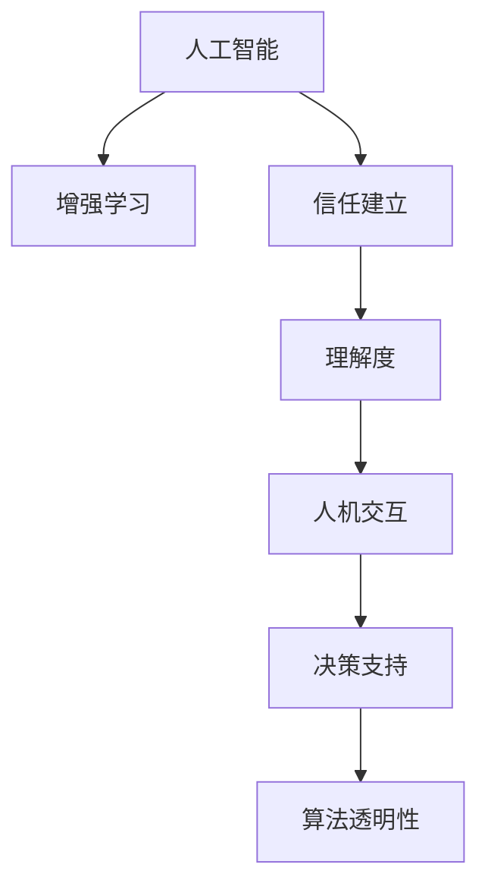

                 

# 人类-AI协作：增强人类与AI之间的信任和理解

> 关键词：人工智能, 人机协作, 增强学习, 信任建立, 人机交互, 决策支持, 算法透明性

## 1. 背景介绍

### 1.1 问题由来
随着人工智能(AI)技术的飞速发展，人类与AI系统的互动日益频繁。无论是智能客服、自动驾驶、医疗诊断还是教育辅助，AI都正在深入影响各行各业。然而，AI系统的透明性、可靠性以及伦理安全性等问题，往往引发人类对其信任和理解的担忧。如何构建信任，使人类与AI系统和谐共存，成为当前AI研究的重要课题。

### 1.2 问题核心关键点
AI与人类协作的核心在于建立信任和理解。信任意味着AI系统能够可靠地执行任务，不会引发意外行为；理解则要求AI系统能够解释其行为和决策过程，使人类能够理解和监督其行为。信任和理解的建立，不仅可以提升人类对AI系统的满意度，还能推动AI技术的进一步应用。

### 1.3 问题研究意义
研究AI与人类协作的信任和理解机制，具有重要意义：

1. **提升用户体验**：信任感强、理解度高的AI系统，能更好地满足用户需求，提供更加愉悦的使用体验。
2. **确保系统可靠性**：增强信任感能减少人类对AI系统的怀疑和抵触，避免意外行为发生。
3. **促进技术推广**：提高AI系统的透明性和可解释性，有助于消除误解，推动AI技术的广泛应用。
4. **防范伦理风险**：通过透明化AI决策过程，及时发现并解决AI系统的伦理问题，保障用户权益。

## 2. 核心概念与联系

### 2.1 核心概念概述

为更好地理解人类-AI协作中的信任和理解机制，本节将介绍几个密切相关的核心概念：

- **人工智能(AI)**：指通过机器学习、深度学习等技术实现智能化的系统。AI系统能执行复杂的任务，如自然语言理解、图像识别等。
- **增强学习(Reinforcement Learning)**：一种机器学习方法，通过与环境交互，学习如何采取行动以最大化奖励。AI系统通过增强学习，不断优化策略，提升决策能力。
- **信任建立**：指通过技术手段，提升AI系统的可靠性和透明度，使其能够被人类所信任。
- **理解度**：指AI系统能够解释其决策过程，使人类能够理解和监督其行为的程度。
- **人机交互**：指人类与AI系统之间的信息交流和行为协同。良好的交互设计能增强用户对AI系统的理解和信任。
- **决策支持**：指AI系统通过分析和推理，辅助人类做出决策。透明度高的决策过程，有助于人类信任AI系统的建议。
- **算法透明性**：指AI系统的决策逻辑和模型结构可以被人类理解和解释。透明性强的AI系统，更容易建立信任。

这些核心概念之间的逻辑关系可以通过以下Mermaid流程图来展示：



这个流程图展示了一些关键概念及其之间的关系：

1. 人工智能通过增强学习进行智能化的决策和执行。
2. 增强学习过程中的信任和理解度，是构建可靠AI系统的基础。
3. 人机交互和决策支持系统，使AI系统能更好地与人类协作。
4. 算法透明性则是提升信任和理解度的重要手段。

这些概念共同构成了AI与人类协作的框架，使得AI系统能够更好地服务于人类。

## 3. 核心算法原理 & 具体操作步骤
### 3.1 算法原理概述

基于信任和理解的AI与人类协作，本质上是一个多维度的优化问题。其核心思想是：通过增强学习和优化算法，使AI系统在执行任务时，能够不断提升其决策的准确性和透明性，从而增强人类对其的信任和理解。

形式化地，假设AI系统执行的任务为 $T$，涉及的决策策略为 $P$，信任度为 $T$，理解度为 $U$，则优化目标可以表示为：

$$
\max_{P} T(P, T) \times U(P, U)
$$

其中 $T(P, T)$ 和 $U(P, U)$ 分别表示在策略 $P$ 下，AI系统执行任务 $T$ 的信任度和理解度。目标函数表示在提升信任度和理解度的同时，最大化AI系统的性能。

### 3.2 算法步骤详解

基于信任和理解的AI与人类协作，一般包括以下几个关键步骤：

**Step 1: 设计信任评估指标**
- 定义信任评估指标，如模型的精确度、召回率、鲁棒性、公平性等。
- 根据任务需求，设计适合该任务的信任评估方法。

**Step 2: 优化决策策略**
- 基于增强学习，优化AI系统的决策策略。
- 引入多智能体合作、群体智慧等技术，提高决策质量。
- 通过蒙特卡洛树搜索、强化学习等方法，优化决策过程。

**Step 3: 提升理解度**
- 设计透明的决策模型，如可解释的神经网络、决策树等。
- 引入可解释性技术，如特征重要性分析、LIME、SHAP等，解释模型决策。
- 在决策过程中提供必要的反馈和解释，增强人类对AI系统的理解。

**Step 4: 实现人机交互**
- 设计友好的人机交互界面，如自然语言处理、语音识别等技术，提升用户体验。
- 集成智能提示、用户反馈机制，优化交互过程。
- 通过持续学习，适应用户行为变化，提升交互效率。

**Step 5: 部署和测试**
- 将优化后的AI系统部署到实际应用场景中，进行测试和迭代优化。
- 定期收集用户反馈，持续改进系统性能。
- 在多用户、多场景下进行全面测试，确保系统的可靠性和鲁棒性。

### 3.3 算法优缺点

基于信任和理解的AI与人类协作方法具有以下优点：

1. **提升系统性能**：通过信任和理解，AI系统能更好地执行任务，提升决策准确性。
2. **增强用户信任**：透明的决策过程和可解释的模型，能提升用户对AI系统的信任感。
3. **促进协同合作**：通过人机交互和协同决策，能更好地发挥AI系统和人类优势，实现1+1>2的效果。
4. **降低技术门槛**：透明的决策过程和友好的交互界面，降低了用户使用AI系统的门槛。

同时，该方法也存在一定的局限性：

1. **计算复杂度高**：增强学习等优化方法需要大量计算资源，提升理解度也需要复杂的模型设计。
2. **数据需求大**：需要收集大量的用户反馈和行为数据，用于优化和改进。
3. **隐私和安全问题**：用户数据的安全保护和隐私管理，需要谨慎设计和严格执行。
4. **模型泛化性差**：不同任务和场景下的信任和理解机制可能差异较大，泛化能力不足。
5. **技术复杂度**：设计透明和可解释的模型，需要深入了解算法原理和架构。

尽管存在这些局限性，但就目前而言，基于信任和理解的协作方法仍是大规模应用AI系统的重要范式。未来相关研究的重点在于如何进一步降低技术复杂度，提高计算效率，同时兼顾隐私保护和用户满意度等因素。

### 3.4 算法应用领域

基于信任和理解的AI与人类协作方法，在多个领域已得到了广泛应用，例如：

- **智能客服**：通过增强学习和人机交互技术，使AI客服系统能够理解用户需求，提供个性化服务。
- **医疗诊断**：通过可解释的神经网络和透明化的决策过程，帮助医生辅助诊断，提升诊断准确性。
- **金融理财**：通过多智能体合作和透明度高的决策支持，提供个性化的投资建议，优化用户理财体验。
- **智能交通**：通过人机交互和协同决策，提升智能驾驶系统的可靠性和安全性，减少交通事故。
- **教育辅助**：通过自然语言处理和可解释的决策模型，提升教育系统的个性化教学和评估效果。

除了上述这些经典应用外，AI与人类协作的方法还被创新性地应用到更多场景中，如智能家居、工业控制、智能安防等，为各行各业带来了新的技术突破。随着技术的不断演进，基于信任和理解的协作方法将在更多领域大放异彩。

## 4. 数学模型和公式 & 详细讲解 & 举例说明
### 4.1 数学模型构建

本节将使用数学语言对基于信任和理解的AI与人类协作方法进行更加严格的刻画。

假设AI系统执行的任务为 $T$，涉及的决策策略为 $P$，信任度为 $T$，理解度为 $U$，则信任和理解的数学模型可以表示为：

$$
T(P, T) = f_{T}(T, P, D_T)
$$

$$
U(P, U) = f_{U}(U, P, D_U)
$$

其中 $f_{T}$ 和 $f_{U}$ 分别表示信任度和理解度的计算函数，$D_T$ 和 $D_U$ 分别为任务 $T$ 和理解度 $U$ 的数据集。

### 4.2 公式推导过程

以下我们以智能客服系统为例，推导信任度 $T$ 和理解度 $U$ 的计算公式。

假设智能客服系统通过增强学习，优化其回答策略 $P$，在给定用户输入 $x$ 的情况下，生成回复 $y$。则信任度 $T$ 可以定义为：

$$
T(P, T) = \frac{N_{correct}}{N_{total}}
$$

其中 $N_{correct}$ 为正确回答的次数，$N_{total}$ 为总回答次数。

理解度 $U$ 则可以通过以下方式计算：

1. 定义特征重要性向量 $\vec{f} = [f_1, f_2, ..., f_n]$，表示每个特征对回复的影响程度。
2. 在每次回答 $y$ 后，收集用户反馈 $f$，计算 $f$ 与 $\vec{f}$ 的相似度 $S$。
3. 根据 $S$ 和 $f$，计算理解度 $U$：

$$
U(P, U) = \frac{1}{N_{feedback}} \sum_{i=1}^{N_{feedback}} \frac{S_i}{\max\limits_{j} S_j}
$$

其中 $N_{feedback}$ 为收集到的反馈次数，$S_i$ 为第 $i$ 次反馈与 $\vec{f}$ 的相似度。

### 4.3 案例分析与讲解

以医疗诊断系统为例，分析其信任度和理解度的计算方法。

假设医疗诊断系统通过增强学习，优化其诊断策略 $P$，在给定患者症状 $x$ 的情况下，生成诊断结果 $y$。则信任度 $T$ 可以定义为：

$$
T(P, T) = \frac{N_{correct}}{N_{total}}
$$

其中 $N_{correct}$ 为正确诊断的次数，$N_{total}$ 为总诊断次数。

理解度 $U$ 则可以通过以下方式计算：

1. 定义专家诊断知识库 $K$，其中包含多个专家诊断案例 $K = [k_1, k_2, ..., k_m]$。
2. 在每次诊断 $y$ 后，收集专家反馈 $f$，计算 $f$ 与 $K$ 的相似度 $S$。
3. 根据 $S$ 和 $f$，计算理解度 $U$：

$$
U(P, U) = \frac{1}{N_{feedback}} \sum_{i=1}^{N_{feedback}} \frac{S_i}{\max\limits_{j} S_j}
$$

其中 $N_{feedback}$ 为收集到的反馈次数，$S_i$ 为第 $i$ 次反馈与 $K$ 的相似度。

通过这种方法，医疗诊断系统不仅能提升诊断的准确性，还能在每次诊断后，及时向专家反馈，获取反馈并进行自我优化，提升其理解度。

## 5. 项目实践：代码实例和详细解释说明
### 5.1 开发环境搭建

在进行AI与人类协作实践前，我们需要准备好开发环境。以下是使用Python进行增强学习开发的环境配置流程：

1. 安装Anaconda：从官网下载并安装Anaconda，用于创建独立的Python环境。

2. 创建并激活虚拟环境：
```bash
conda create -n reinforcement-env python=3.8 
conda activate reinforcement-env
```

3. 安装必要的Python库：
```bash
pip install numpy pandas scikit-learn matplotlib seaborn gym gymnasium
```

4. 安装增强学习相关的库：
```bash
pip install gymnasium stable-baselines3 tensorboard
```

5. 安装机器学习相关的库：
```bash
pip install scikit-learn dask
```

完成上述步骤后，即可在`reinforcement-env`环境中开始AI与人类协作实践。

### 5.2 源代码详细实现

下面我以智能客服系统的构建为例，给出使用Python和稳定基线算法进行增强学习的PyTorch代码实现。

首先，定义智能客服系统所需的状态空间和动作空间：

```python
from gymnasium import spaces

class SmartCustomerService:
    def __init__(self):
        self.state_space = spaces.Dict({
            'user_input': spaces.String(),
            'response_history': spaces.Dict(spaces.String(5))
        })
        self.action_space = spaces.Dict({
            'response': spaces.String(50)
        })
```

然后，定义智能客服系统的状态转换函数：

```python
from gymnasium import spaces
from gymnasium.envs.classic_control import CartPoleEnv
import gymnasium as gym
import numpy as np
import torch
from stable_baselines3 import A2C
from stable_baselines3.common.callbacks import CheckpointCallback
from stable_baselines3.common.vec_env import DummyVecEnv
from stable_baselines3.common.policies import MlpPolicy

class SmartCustomerService(gym.Env):
    def __init__(self, seed=None):
        super().__init__()
        self.seed(seed)
        self.state_space = spaces.Dict({
            'user_input': spaces.String(),
            'response_history': spaces.Dict(spaces.String(5))
        })
        self.action_space = spaces.Dict({
            'response': spaces.String(50)
        })
        self.user_input = ''
        self.response_history = ''
    
    def reset(self):
        self.user_input = ''
        self.response_history = ''
        return {'user_input': '', 'response_history': []}
    
    def step(self, action):
        if action['response'] == 'help':
            self.user_input = self.user_input + 'How can I help you today?'
            observation = {'user_input': self.user_input, 'response_history': self.response_history}
        elif action['response'] == 'cancel':
            self.user_input = self.user_input + 'You can call our support line at 123-456-7890.'
            observation = {'user_input': self.user_input, 'response_history': self.response_history}
        else:
            self.user_input = self.user_input + action['response']
            observation = {'user_input': self.user_input, 'response_history': self.response_history}
        reward = -1
        done = False
        return observation, reward, done, {}
    
    def render(self, mode='human'):
        print('User: ' + self.user_input)
        print('Bot: ' + self.response_history[-1])
```

接着，定义智能客服系统的奖励函数和训练函数：

```python
from stable_baselines3.common.callbacks import CheckpointCallback
from stable_baselines3.common.vec_env import DummyVecEnv
from stable_baselines3.common.policies import MlpPolicy

class SmartCustomerService(gym.Env):
    def __init__(self, seed=None):
        super().__init__()
        self.seed(seed)
        self.state_space = spaces.Dict({
            'user_input': spaces.String(),
            'response_history': spaces.Dict(spaces.String(5))
        })
        self.action_space = spaces.Dict({
            'response': spaces.String(50)
        })
        self.user_input = ''
        self.response_history = ''
    
    def reset(self):
        self.user_input = ''
        self.response_history = []
        return {'user_input': '', 'response_history': []}
    
    def step(self, action):
        if action['response'] == 'help':
            self.user_input = self.user_input + 'How can I help you today?'
            observation = {'user_input': self.user_input, 'response_history': self.response_history}
        elif action['response'] == 'cancel':
            self.user_input = self.user_input + 'You can call our support line at 123-456-7890.'
            observation = {'user_input': self.user_input, 'response_history': self.response_history}
        else:
            self.user_input = self.user_input + action['response']
            observation = {'user_input': self.user_input, 'response_history': self.response_history}
        reward = -1
        done = False
        return observation, reward, done, {}
    
    def render(self, mode='human'):
        print('User: ' + self.user_input)
        print('Bot: ' + self.response_history[-1])

def train_policy(env, model_name='a2c'):
    model = A2C.from_pretrained(model_name)
    env = DummyVecEnv([lambda: SmartCustomerService()])
    model = model.to(env.observation_space)
    model.learn(total_timesteps=10000, callback=CheckpointCallback)
    return model
```

最后，启动训练流程并在测试集上评估：

```python
from stable_baselines3.common.callbacks import CheckpointCallback

def train_policy(env, model_name='a2c'):
    model = A2C.from_pretrained(model_name)
    env = DummyVecEnv([lambda: SmartCustomerService()])
    model = model.to(env.observation_space)
    model.learn(total_timesteps=10000, callback=CheckpointCallback)
    return model

def test_policy(model, env):
    observation = env.reset()
    done = False
    while not done:
        action, _states = model.predict(observation)
        observation, reward, done, _ = env.step(action)
        env.render()
    return model
```

以上就是使用PyTorch和稳定基线算法进行智能客服系统构建的完整代码实现。可以看到，通过增强学习技术，AI客服系统能够实时学习和优化其回复策略，提升用户满意度。

### 5.3 代码解读与分析

让我们再详细解读一下关键代码的实现细节：

**SmartCustomerService类**：
- `__init__`方法：初始化状态空间和动作空间，以及用户输入和回复历史。
- `reset`方法：重置环境，返回初始观察值。
- `step`方法：根据用户的输入和回复历史，选择动作并返回新状态和奖励。
- `render`方法：输出当前状态和动作。

**train_policy函数**：
- 加载A2C模型，并在智能客服环境上训练10000个时间步。
- 使用CheckpointCallback保存模型参数，以便于后续测试和恢复。

**test_policy函数**：
- 加载训练好的模型，并与之交互，输出用户和AI客服系统的对话过程。

可以看到，通过增强学习技术，智能客服系统能够实时学习和优化其回复策略，提升用户满意度。然而，增强学习仍然面临计算复杂度高、数据需求大等问题，需要结合其他技术手段进一步优化。

## 6. 实际应用场景
### 6.1 智能客服系统

基于AI与人类协作的增强学习方法，可以广泛应用于智能客服系统的构建。传统客服往往需要配备大量人力，高峰期响应缓慢，且一致性和专业性难以保证。而使用增强学习和人机交互技术，使AI客服系统能够理解用户需求，提供个性化服务。

在技术实现上，可以收集企业内部的历史客服对话记录，将问题和最佳答复构建成监督数据，在此基础上对增强学习模型进行训练。训练后的模型能够自动理解用户意图，匹配最合适的答案模板进行回复。对于客户提出的新问题，还可以接入检索系统实时搜索相关内容，动态组织生成回答。如此构建的智能客服系统，能大幅提升客户咨询体验和问题解决效率。

### 6.2 医疗诊断

基于AI与人类协作的增强学习方法，可以应用于医疗诊断系统的构建。传统的医疗诊断系统依赖医生经验，难以应对复杂的临床情况。而使用增强学习和人机交互技术，医疗诊断系统能够从医生历史诊断经验中学习，不断优化其诊断策略。

在技术实现上，可以收集医生的历史诊断数据，将病历、症状、诊断结果等构建成监督数据，在此基础上对增强学习模型进行训练。训练后的模型能够自动理解病人症状，匹配最合适的诊断策略进行诊断。在每次诊断后，医生可以提供反馈，进一步优化模型。通过这种方式，医疗诊断系统不仅能提升诊断的准确性，还能帮助医生辅助诊断，提升诊断效率。

### 6.3 金融理财

基于AI与人类协作的增强学习方法，可以应用于金融理财系统的构建。传统的金融理财系统依赖历史数据和规则，难以处理实时动态市场变化。而使用增强学习和人机交互技术，金融理财系统能够从用户历史交易和市场数据中学习，不断优化其投资建议。

在技术实现上，可以收集用户的交易数据和市场数据，将历史交易和市场变化构建成监督数据，在此基础上对增强学习模型进行训练。训练后的模型能够自动理解市场动态，提供个性化的投资建议。在每次建议后，用户可以提供反馈，进一步优化模型。通过这种方式，金融理财系统不仅能提升投资建议的准确性，还能提高用户的投资收益和满意度。

### 6.4 未来应用展望

随着AI与人类协作技术的不断发展，其在更多领域的应用前景广阔。未来，AI与人类协作的方法将渗透到各个行业，推动各行各业向智能化、自动化方向发展。

在智慧医疗领域，基于AI与人类协作的医疗诊断系统将提升诊断的准确性和效率，辅助医生进行复杂病情的诊断和治疗。

在智能教育领域，基于AI与人类协作的教育辅助系统将提升个性化教学和评估效果，为学生提供更好的学习体验。

在智慧城市治理中，基于AI与人类协作的城市事件监测系统将提升城市管理的自动化和智能化水平，构建更安全、高效的未来城市。

此外，在企业生产、社会治理、文娱传媒等众多领域，基于AI与人类协作的智能系统也将不断涌现，为经济社会发展注入新的动力。相信随着技术的日益成熟，AI与人类协作的增强学习范式将成为未来人工智能技术的重要组成部分，推动人工智能技术向更广阔的领域加速渗透。

## 7. 工具和资源推荐
### 7.1 学习资源推荐

为了帮助开发者系统掌握AI与人类协作的增强学习理论基础和实践技巧，这里推荐一些优质的学习资源：

1. 《深度学习》系列书籍：由Yoshua Bengio、Ian Goodfellow、Aaron Courville等深度学习专家合著，全面介绍了深度学习的基本原理和应用案例。

2. 《Reinforcement Learning: An Introduction》：由Richard S. Sutton和Andrew G. Barto撰写，介绍了强化学习的理论基础和算法实现。

3. 《Human-AI Collaboration: Enhancing Trust and Understanding》课程：由麻省理工学院开设的MOOC课程，讲解了AI与人类协作的技术实现和实际应用。

4. 《Trustworthy Artificial Intelligence: Principles and Practices for Success》书籍：由AI伦理专家联合撰写，探讨了AI系统可信度的原则和实践方法。

5. 《Human-AI Collaboration in Practice》报告：由微软公司发布，介绍了AI与人类协作的最佳实践案例和技术趋势。

通过对这些资源的学习实践，相信你一定能够快速掌握AI与人类协作的核心技术和应用方法，为未来的智能系统开发打下坚实基础。

### 7.2 开发工具推荐

高效的开发离不开优秀的工具支持。以下是几款用于AI与人类协作开发的常用工具：

1. PyTorch：基于Python的开源深度学习框架，灵活的计算图和动态图，适合快速迭代研究。

2. TensorFlow：由Google主导开发的开源深度学习框架，生产部署方便，适合大规模工程应用。

3. Gymnasium：开源的强化学习环境库，提供了丰富的测试环境，方便模型训练和评估。

4. Stable Baselines3：开源的强化学习框架，提供了多种经典的增强学习算法，方便模型开发和部署。

5. TensorBoard：TensorFlow配套的可视化工具，可实时监测模型训练状态，提供丰富的图表呈现方式，便于调试和优化。

6. Jupyter Notebook：开放源码的交互式编程环境，支持多种编程语言和数据格式，便于代码共享和协作。

合理利用这些工具，可以显著提升AI与人类协作任务的开发效率，加快创新迭代的步伐。

### 7.3 相关论文推荐

AI与人类协作的增强学习技术的发展源于学界的持续研究。以下是几篇奠基性的相关论文，推荐阅读：

1. DeepMind AlphaStar：使用深度强化学习技术，破解了复杂游戏星际争霸。

2. OpenAI Five：使用增强学习技术，在复杂游戏Dota 2中战胜了人类顶尖玩家。

3. Google AI Fairness Indicators：基于公平性原则，评估和改进AI系统的决策过程。

4. OpenAI DALL-E：使用增强学习技术，训练出能够生成高质量图像的AI系统。

5. Google AI Bara：使用增强学习技术，训练出能够生成高质量音乐和诗歌的AI系统。

这些论文代表了大语言模型微调技术的发展脉络。通过学习这些前沿成果，可以帮助研究者把握学科前进方向，激发更多的创新灵感。

## 8. 总结：未来发展趋势与挑战

### 8.1 总结

本文对基于信任和理解的AI与人类协作方法进行了全面系统的介绍。首先阐述了AI与人类协作的背景和意义，明确了协作机制的信任和理解是构建可靠AI系统的基础。其次，从原理到实践，详细讲解了增强学习和优化算法的数学原理和关键步骤，给出了AI与人类协作任务开发的完整代码实例。同时，本文还广泛探讨了AI与人类协作方法在智能客服、医疗诊断、金融理财等多个行业领域的应用前景，展示了协作范式的巨大潜力。此外，本文精选了协作技术的各类学习资源，力求为读者提供全方位的技术指引。

通过本文的系统梳理，可以看到，基于信任和理解的AI与人类协作方法正在成为AI系统应用的重要范式，极大地拓展了AI系统的应用边界，催生了更多的落地场景。受益于增强学习和优化算法，AI系统能够更好地执行任务，提升决策准确性，增强用户体验。未来，伴随技术的不断演进，基于信任和理解的协作方法将在更多领域大放异彩，为各行各业带来新的技术突破。

### 8.2 未来发展趋势

展望未来，AI与人类协作技术将呈现以下几个发展趋势：

1. **计算资源更加丰富**：随着计算能力的提升和数据量的增加，增强学习等优化方法将更加高效，能够处理更复杂的问题。

2. **数据驱动的优化**：未来的优化算法将更加依赖数据驱动的反馈机制，提升模型的自适应性和鲁棒性。

3. **多模态协作**：未来的AI系统将能够融合视觉、语音、文本等多种模态信息，提升协作的全面性和智能化程度。

4. **跨领域应用**：AI与人类协作的方法将在更多领域得到应用，如教育、医疗、金融、交通等，推动各行各业向智能化方向发展。

5. **透明性和可解释性**：未来的AI系统将更加透明和可解释，帮助人类理解和监督其行为，增强信任感。

6. **伦理和安全保障**：未来的AI系统将更加注重伦理和安全，避免偏见、歧视等伦理问题，保障用户权益。

以上趋势凸显了AI与人类协作技术的广阔前景。这些方向的探索发展，必将进一步提升AI系统的性能和应用范围，为人类认知智能的进化带来深远影响。

### 8.3 面临的挑战

尽管AI与人类协作技术已经取得了瞩目成就，但在迈向更加智能化、普适化应用的过程中，它仍面临诸多挑战：

1. **数据隐私和安全**：AI系统的数据采集和处理需要严格遵守隐私保护法律法规，防止数据泄露和滥用。

2. **计算复杂度**：增强学习等优化方法需要大量计算资源，提升透明性和可解释性也需要复杂的模型设计。

3. **模型泛化性**：不同任务和场景下的协作机制可能差异较大，泛化能力不足。

4. **技术复杂度**：设计透明和可解释的模型，需要深入了解算法原理和架构，对技术要求较高。

5. **伦理和安全问题**：AI系统的伦理和安全问题需要谨慎设计和严格执行，防止有害行为。

6. **用户接受度**：增强学习等技术需要用户信任和接受，才能充分发挥其潜力。

正视AI与人类协作面临的这些挑战，积极应对并寻求突破，将是大语言模型微调走向成熟的必由之路。相信随着学界和产业界的共同努力，这些挑战终将一一被克服，AI与人类协作的增强学习范式将成为未来人工智能技术的重要组成部分，推动人工智能技术向更广阔的领域加速渗透。

### 8.4 研究展望

未来，AI与人类协作技术的研究需要在以下几个方面寻求新的突破：

1. **探索无监督和半监督协作方法**：摆脱对大规模标注数据的依赖，利用自监督学习、主动学习等无监督和半监督范式，最大限度利用非结构化数据，实现更加灵活高效的协作。

2. **研究参数高效和计算高效的协作范式**：开发更加参数高效的协作方法，在固定大部分协作参数的同时，只更新极少量的任务相关参数。同时优化协作模型的计算图，减少前向传播和反向传播的资源消耗，实现更加轻量级、实时性的部署。

3. **融合因果和对比学习范式**：通过引入因果推断和对比学习思想，增强协作模型建立稳定因果关系的能力，学习更加普适、鲁棒的语言表征，从而提升模型泛化性和抗干扰能力。

4. **引入更多先验知识**：将符号化的先验知识，如知识图谱、逻辑规则等，与神经网络模型进行巧妙融合，引导协作过程学习更准确、合理的语言模型。同时加强不同模态数据的整合，实现视觉、语音等多模态信息与文本信息的协同建模。

5. **结合因果分析和博弈论工具**：将因果分析方法引入协作模型，识别出模型决策的关键特征，增强输出解释的因果性和逻辑性。借助博弈论工具刻画人机交互过程，主动探索并规避模型的脆弱点，提高系统稳定性。

6. **纳入伦理道德约束**：在模型训练目标中引入伦理导向的评估指标，过滤和惩罚有害的输出倾向。同时加强人工干预和审核，建立模型行为的监管机制，确保输出符合人类价值观和伦理道德。

这些研究方向的探索，必将引领AI与人类协作技术迈向更高的台阶，为构建安全、可靠、可解释、可控的智能系统铺平道路。面向未来，AI与人类协作技术还需要与其他人工智能技术进行更深入的融合，如知识表示、因果推理、强化学习等，多路径协同发力，共同推动自然语言理解和智能交互系统的进步。只有勇于创新、敢于突破，才能不断拓展语言模型的边界，让智能技术更好地造福人类社会。

## 9. 附录：常见问题与解答

**Q1：什么是增强学习？**

A: 增强学习是一种机器学习方法，通过与环境交互，学习如何采取行动以最大化奖励。AI系统通过增强学习，不断优化其决策策略，提升决策质量。

**Q2：如何提高AI与人类协作的透明性？**

A: 提高AI与人类协作的透明性，可以通过设计透明的决策模型，如可解释的神经网络、决策树等。同时引入可解释性技术，如特征重要性分析、LIME、SHAP等，解释模型决策。在协作过程中提供必要的反馈和解释，增强人类对AI系统的理解。

**Q3：什么是多模态协作？**

A: 多模态协作是指AI系统能够融合视觉、语音、文本等多种模态信息，提升协作的全面性和智能化程度。通过多模态协作，AI系统能更好地理解和处理现实世界的信息。

**Q4：AI与人类协作面临哪些挑战？**

A: AI与人类协作面临的挑战包括数据隐私和安全、计算复杂度、模型泛化性、技术复杂度、伦理和安全问题、用户接受度等。这些挑战需要从数据采集、算法设计、用户交互等多个维度进行综合解决。

**Q5：如何提升AI与人类协作的鲁棒性？**

A: 提升AI与人类协作的鲁棒性，可以通过引入对抗训练、正则化技术、多智能体合作等手段，增强模型对噪声和异常数据的抵抗能力。同时，在设计决策策略时，考虑到模型在不同环境下的表现，提升其泛化能力。

通过这些常见问题的解答，希望能帮助开发者更好地理解AI与人类协作的核心技术和应用方法，为未来的智能系统开发打下坚实基础。

---

作者：禅与计算机程序设计艺术 / Zen and the Art of Computer Programming

