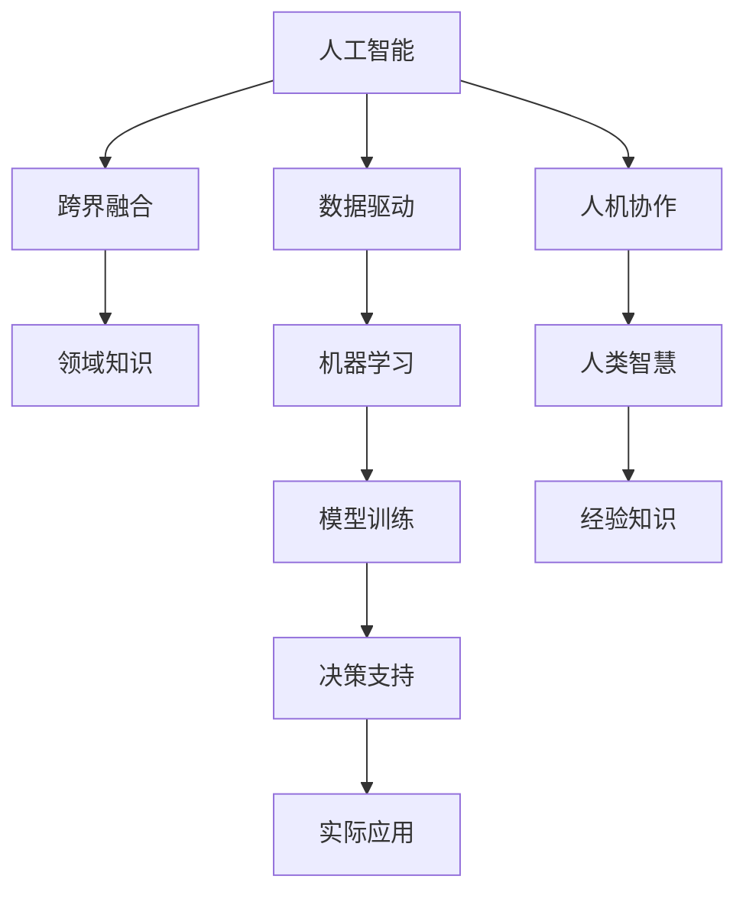

                 

# 人类智慧：AI 时代的新力量

> 关键词：人工智能,人类智慧,创新驱动,科技伦理,智能科技

## 1. 背景介绍

### 1.1 问题由来

在人类社会的发展历程中，科技创新始终是推动进步的重要力量。自工业革命以来，人类不断通过科技改变着生产方式和社会结构。然而，随着科技的迅猛发展，传统人类智慧的局限性逐渐显现。在面对复杂问题时，人类的直觉和经验常常显得力不从心。于是，一种新的智能形式——人工智能应运而生。

人工智能（AI），是指由计算机系统模拟人类智能活动，包括感知、理解、推理、学习和决策等。随着计算能力的提升和数据量的爆炸式增长，AI正逐步从实验室走向社会各个角落。然而，AI并非人类智慧的替代品，而是与之并行发展的伙伴。在AI时代，人类智慧与科技创新的融合，将推动人类社会进入一个全新的发展阶段。

### 1.2 问题核心关键点

在AI时代，人类智慧与科技创新的结合主要体现在以下几个方面：

- 数据驱动：通过大数据和深度学习技术，AI能够从海量数据中提取有价值的信息，辅助人类决策。
- 跨界融合：AI技术正在与各个领域进行深度融合，包括医疗、教育、金融、制造业等，提升了工作效率和创新能力。
- 伦理决策：AI技术的广泛应用，要求我们重新审视科技伦理问题，确保AI的使用符合人类价值和道德规范。
- 人机协作：在AI与人类智慧的协作下，人类能够更高效地解决问题，同时AI也能从人类经验中学习，不断优化自身表现。
- 智能创新：AI不仅能够自动化重复性任务，还能提供创新性解决方案，激发人类智慧的潜能。

本文将围绕AI与人类智慧的结合，探讨其在AI时代的新力量，并分析其在实际应用中的挑战和未来发展趋势。

## 2. 核心概念与联系

### 2.1 核心概念概述

为了更好地理解AI与人类智慧的结合，本节将介绍几个密切相关的核心概念：

- **人工智能（Artificial Intelligence, AI）**：模拟人类智能行为的技术体系，涵盖机器学习、深度学习、自然语言处理等方向。
- **人类智慧（Human Wisdom）**：人类在长期积累的知识、经验和判断力。
- **跨界融合（Cross-Disciplinary Integration）**：AI技术与其他领域知识、方法的结合，以解决实际问题。
- **数据驱动（Data-Driven）**：利用数据进行模型训练和决策，提升AI的预测和决策能力。
- **人机协作（Human-Machine Collaboration）**：AI与人类在任务执行、知识共享等方面的合作。
- **科技伦理（Science and Technology Ethics）**：AI应用中涉及的伦理问题，如隐私保护、公平性、安全性等。

这些核心概念之间的逻辑关系可以通过以下Mermaid流程图来展示：



这个流程图展示了几大核心概念及其之间的关系：

1. 人工智能通过数据驱动进行模型训练，学习解决实际问题的能力。
2. 跨界融合将AI与其他领域的知识结合，提升其应用范围和效果。
3. 人机协作是AI与人类智慧共同工作的模式，提升整体解决问题的效率。
4. 数据驱动、跨界融合、人机协作均需要科技伦理的规范和引导，确保AI应用的合理性。

## 3. 核心算法原理 & 具体操作步骤

### 3.1 算法原理概述

在AI时代，人类智慧与AI的结合主要体现在以下几个方面：

- **数据驱动**：AI通过分析海量数据，提取模式和规律，辅助人类决策。
- **跨界融合**：AI与其他领域知识结合，解决复杂问题，如医疗AI、教育AI等。
- **人机协作**：AI与人类智慧共同工作，提升问题解决效率。

这些结合点是通过以下核心算法实现的：

- **深度学习算法**：通过神经网络模型，AI从数据中学习复杂的非线性关系，辅助人类决策。
- **自然语言处理算法**：使AI能够理解和生成自然语言，实现人机交互。
- **推荐系统算法**：根据用户行为数据，AI推荐个性化内容，提升用户体验。
- **强化学习算法**：使AI通过与环境的交互，不断优化决策策略。

### 3.2 算法步骤详解

基于数据驱动、跨界融合和人机协作，AI与人类智慧的结合主要包括以下几个关键步骤：

**Step 1: 数据收集与预处理**
- 收集领域相关数据，并进行清洗、标注等预处理操作，确保数据质量。

**Step 2: 模型训练与优化**
- 选择合适的模型架构，如深度神经网络、卷积神经网络等，并进行模型训练。
- 使用优化算法（如Adam、SGD等）调整模型参数，提升模型性能。
- 应用正则化技术（如L2正则、Dropout等），防止过拟合。

**Step 3: 模型部署与测试**
- 将训练好的模型部署到实际应用环境中，如服务器、移动设备等。
- 在实际数据上测试模型性能，确保其稳定性和准确性。
- 进行A/B测试，评估模型对人类智慧的贡献。

**Step 4: 人机协作与反馈**
- 将AI系统与人类智慧进行协作，共同解决实际问题。
- 收集人类反馈，优化模型和应用流程。
- 不断迭代，提升AI系统的智能水平。

### 3.3 算法优缺点

AI与人类智慧结合的算法具有以下优点：

- 高效解决复杂问题：AI通过数据驱动，能够高效处理大规模、复杂的数据集。
- 跨领域应用广泛：跨界融合使得AI在各个领域得到应用，提升了工作效率和创新能力。
- 提升人机协作效果：人机协作使得AI与人类智慧能够互补，提升问题解决效率。

然而，该方法也存在一些局限性：

- 数据质量要求高：AI模型依赖高质量数据，数据噪声和不完整性会影响模型效果。
- 需要大量计算资源：深度学习等算法需要强大的计算资源，对硬件设备要求高。
- 存在偏见和伦理问题：AI模型可能继承数据中的偏见，引发伦理争议。

### 3.4 算法应用领域

基于AI与人类智慧结合的算法，已经在多个领域取得了显著应用，例如：

- **医疗领域**：AI辅助诊断、个性化治疗方案、药物研发等。
- **教育领域**：智能教育平台、个性化学习推荐、作业批改等。
- **金融领域**：风险评估、智能投顾、量化交易等。
- **制造领域**：智能制造、机器人自动化、质量控制等。
- **交通领域**：自动驾驶、智能交通管理、车联网等。
- **能源领域**：智能电网、能源管理、环境监测等。
- **娱乐领域**：个性化推荐、智能家居、虚拟现实等。

这些领域的应用展示了AI与人类智慧结合的巨大潜力，为各个行业的数字化转型提供了新的方向。

## 4. 数学模型和公式 & 详细讲解 & 举例说明

### 4.1 数学模型构建

在AI与人类智慧结合的应用中，数学模型起到了至关重要的作用。以下是几个典型场景的数学模型构建：

**场景1: 医疗领域的疾病诊断**
- 定义疾病标签 $y \in \{0, 1\}$，其中0表示健康，1表示患病。
- 定义输入特征 $x \in \mathbb{R}^n$，如基因数据、血液指标等。
- 建立逻辑回归模型，用于预测疾病概率 $p(y|x) = \sigma(\boldsymbol{w}^T\boldsymbol{x} + b)$，其中 $\sigma$ 为Sigmoid函数，$\boldsymbol{w}$ 和 $b$ 为模型参数。

**场景2: 教育领域的个性化学习推荐**
- 定义学生特征 $x \in \mathbb{R}^m$，如学习行为、兴趣爱好等。
- 定义推荐结果 $y \in \{1, 2, ..., k\}$，其中 $k$ 为课程或资源数量。
- 建立协同过滤模型，通过计算用户-物品相似度，推荐个性化内容。

**场景3: 金融领域的风险评估**
- 定义信用评分 $y \in [0, 1]$，其中0表示低风险，1表示高风险。
- 定义特征 $x \in \mathbb{R}^n$，如个人资产、信用记录等。
- 建立随机森林模型，用于预测信用评分，评估贷款风险。

### 4.2 公式推导过程

以下是场景1的逻辑回归模型推导过程：

- **输入数据**：
  $$
  \begin{cases}
  y_i \sim Bernoulli(p(y_i)) \\
  x_i \sim Normal(\boldsymbol{\mu}, \boldsymbol{\Sigma})
  \end{cases}
  $$
  其中 $y_i$ 表示第 $i$ 个样本的标签，$x_i$ 表示第 $i$ 个样本的特征向量。

- **模型假设**：
  $$
  p(y_i|x_i) = \sigma(\boldsymbol{w}^T\boldsymbol{x}_i + b)
  $$
  其中 $\boldsymbol{w}$ 和 $b$ 为模型参数，$\sigma$ 为Sigmoid函数。

- **似然函数**：
  $$
  L(\boldsymbol{w}, b) = \prod_{i=1}^N p(y_i|x_i)
  $$
  其中 $N$ 为样本数量。

- **对数似然函数**：
  $$
  \mathcal{L}(\boldsymbol{w}, b) = -\frac{1}{N} \sum_{i=1}^N [y_i \log p(y_i|x_i) + (1-y_i) \log (1-p(y_i|x_i))]
  $$

- **梯度下降更新**：
  $$
  \boldsymbol{w} \leftarrow \boldsymbol{w} - \eta \nabla_{\boldsymbol{w}} \mathcal{L}(\boldsymbol{w}, b)
  $$

### 4.3 案例分析与讲解

**案例1: 医疗领域的疾病诊断**
- 使用逻辑回归模型进行疾病预测。
- 在训练集上使用梯度下降算法进行模型优化。
- 在测试集上评估模型性能，如准确率、召回率、F1分数等。

**案例2: 教育领域的个性化学习推荐**
- 使用协同过滤算法进行用户-物品相似度计算。
- 将相似度矩阵用于推荐系统，生成个性化学习内容。
- 使用用户反馈进行模型迭代优化，提升推荐效果。

**案例3: 金融领域的风险评估**
- 使用随机森林算法进行信用评分预测。
- 在训练集上使用交叉验证进行模型评估。
- 在测试集上验证模型在不同数据分布下的性能表现。

## 5. 项目实践：代码实例和详细解释说明

### 5.1 开发环境搭建

在进行AI与人类智慧结合的实践前，我们需要准备好开发环境。以下是使用Python进行Scikit-Learn和TensorFlow开发的环境配置流程：

1. 安装Anaconda：从官网下载并安装Anaconda，用于创建独立的Python环境。

2. 创建并激活虚拟环境：
```bash
conda create -n ai-env python=3.8 
conda activate ai-env
```

3. 安装Scikit-Learn：
```bash
conda install scikit-learn
```

4. 安装TensorFlow：
```bash
conda install tensorflow
```

5. 安装其他工具包：
```bash
pip install numpy pandas matplotlib
```

完成上述步骤后，即可在`ai-env`环境中开始项目实践。

### 5.2 源代码详细实现

这里我们以医疗领域的疾病诊断为例，给出使用Scikit-Learn对逻辑回归模型进行训练的PyTorch代码实现。

首先，定义训练数据集和测试数据集：

```python
from sklearn.datasets import load_breast_cancer
from sklearn.model_selection import train_test_split
from sklearn.preprocessing import StandardScaler

# 加载数据集
data = load_breast_cancer()

# 划分训练集和测试集
train_x, test_x, train_y, test_y = train_test_split(data.data, data.target, test_size=0.2, random_state=42)

# 标准化处理
scaler = StandardScaler()
train_x = scaler.fit_transform(train_x)
test_x = scaler.transform(test_x)
```

然后，定义逻辑回归模型并进行训练：

```python
from sklearn.linear_model import LogisticRegression
from sklearn.metrics import accuracy_score

# 定义逻辑回归模型
model = LogisticRegression(max_iter=1000)

# 训练模型
model.fit(train_x, train_y)

# 预测测试集
predictions = model.predict(test_x)

# 评估模型性能
accuracy = accuracy_score(test_y, predictions)
print(f"Accuracy: {accuracy}")
```

最后，输出模型的准确率：

```python
print(f"Accuracy: {accuracy}")
```

以上就是使用Scikit-Learn对逻辑回归模型进行训练的完整代码实现。可以看到，Scikit-Learn提供了丰富的机器学习算法和工具，使得模型开发变得简单高效。

### 5.3 代码解读与分析

让我们再详细解读一下关键代码的实现细节：

**案例1: 医疗领域的疾病诊断**
- 使用Scikit-Learn的`load_breast_cancer`加载乳腺癌数据集。
- 使用`train_test_split`将数据集划分为训练集和测试集。
- 使用`StandardScaler`对数据进行标准化处理，以提高模型性能。
- 定义逻辑回归模型，并使用`fit`方法进行训练。
- 在测试集上使用`predict`方法进行预测，并使用`accuracy_score`评估模型性能。

可以看到，Scikit-Learn使得机器学习模型的开发变得简单易用，降低了开发门槛。

## 6. 实际应用场景

### 6.1 医疗领域的应用

在医疗领域，AI与人类智慧的结合可以通过以下几种方式进行应用：

**场景1: 辅助诊断**
- 使用图像识别技术，对医学影像进行自动诊断。如使用卷积神经网络（CNN）对X光片、CT图像进行肿瘤识别。
- 使用自然语言处理技术，从病历记录中提取关键信息，辅助医生诊断。

**场景2: 个性化治疗方案**
- 使用机器学习算法，根据患者的历史数据，预测疾病发展趋势，提出个性化治疗方案。
- 通过协同过滤推荐系统，为患者推荐最适合的药物和治疗方案。

**场景3: 药物研发**
- 使用深度学习技术，从化合物库中筛选出潜在的药物分子。
- 使用生成对抗网络（GAN）生成新的药物分子，加速新药研发进程。

### 6.2 教育领域的应用

在教育领域，AI与人类智慧的结合可以通过以下几种方式进行应用：

**场景1: 智能教育平台**
- 使用推荐系统，根据学生的学习行为和兴趣，推荐个性化学习内容。
- 使用情感分析技术，分析学生的学习情感，提供及时的情感支持。

**场景2: 作业批改**
- 使用自然语言处理技术，自动批改学生的作文和回答，提供反馈和改进建议。
- 使用机器学习算法，判断学生的作业是否正确，并进行自动化打分。

**场景3: 虚拟教师**
- 使用生成式对抗网络（GAN）生成虚拟教师，辅助学生进行学习。
- 使用增强学习技术，训练虚拟教师的互动策略，提高教学效果。

### 6.3 金融领域的应用

在金融领域，AI与人类智慧的结合可以通过以下几种方式进行应用：

**场景1: 风险评估**
- 使用随机森林算法，评估客户的信用风险。
- 使用深度学习算法，分析客户的交易行为，预测潜在的欺诈行为。

**场景2: 智能投顾**
- 使用机器学习算法，分析市场数据，提供投资建议。
- 使用强化学习算法，根据市场动态，自动调整投资组合。

**场景3: 量化交易**
- 使用深度学习技术，分析股票价格走势，预测市场变化。
- 使用协同过滤算法，推荐交易策略，优化投资收益。

### 6.4 未来应用展望

随着AI与人类智慧结合的不断深入，未来AI将广泛应用于更多领域，为人类社会带来深刻的变革。以下是一些未来应用展望：

**场景1: 智能交通**
- 使用自动驾驶技术，实现无人驾驶汽车。
- 使用智能交通管理系统，优化交通流量，减少交通拥堵。

**场景2: 智能家居**
- 使用语音识别技术，实现智能家居设备控制。
- 使用机器学习算法，分析用户行为，提供个性化的生活建议。

**场景3: 智能制造**
- 使用机器人自动化技术，实现智能制造流程。
- 使用预测性维护技术，预防设备故障，提高生产效率。

## 7. 工具和资源推荐

### 7.1 学习资源推荐

为了帮助开发者系统掌握AI与人类智慧结合的理论基础和实践技巧，这里推荐一些优质的学习资源：

1. **《深度学习》书籍**：Ian Goodfellow等著，全面介绍了深度学习的原理、算法和应用。
2. **Coursera《机器学习》课程**：由斯坦福大学Andrew Ng主讲，涵盖机器学习的基本概念和经典算法。
3. **Udacity《深度学习专项课程》**：由Google DeepMind团队开发，涵盖深度学习的前沿技术和应用。
4. **ArXiv论文**：机器学习领域的最新研究成果，提供丰富的理论支持和实践指导。
5. **GitHub项目**：开源机器学习项目和代码，提供丰富的案例和示例。

通过对这些资源的学习实践，相信你一定能够快速掌握AI与人类智慧结合的精髓，并用于解决实际的AI问题。

### 7.2 开发工具推荐

高效的开发离不开优秀的工具支持。以下是几款用于AI与人类智慧结合开发的常用工具：

1. **PyTorch**：基于Python的开源深度学习框架，灵活动态的计算图，适合快速迭代研究。
2. **TensorFlow**：由Google主导开发的开源深度学习框架，生产部署方便，适合大规模工程应用。
3. **Scikit-Learn**：基于Python的机器学习库，提供丰富的算法和工具，适合快速开发和实验。
4. **Jupyter Notebook**：交互式编程环境，支持代码编写、数据可视化、模型调试等功能，适合科研和开发。
5. **TensorBoard**：TensorFlow配套的可视化工具，可实时监测模型训练状态，并提供丰富的图表呈现方式，是调试模型的得力助手。

合理利用这些工具，可以显著提升AI与人类智慧结合任务的开发效率，加快创新迭代的步伐。

### 7.3 相关论文推荐

AI与人类智慧结合的研究源于学界的持续研究。以下是几篇奠基性的相关论文，推荐阅读：

1. **《深度学习》书籍**：Ian Goodfellow等著，全面介绍了深度学习的原理、算法和应用。
2. **《机器学习实战》书籍**：Peter Harrington著，提供丰富的案例和示例，适合实践学习。
3. **《自然语言处理综论》书籍**：Daniel Jurafsky等著，涵盖自然语言处理的经典算法和应用。
4. **《人工智能与未来》书籍**：Yoshua Bengio等著，探讨AI对未来的影响和挑战。

这些论文代表了大语言模型微调技术的发展脉络。通过学习这些前沿成果，可以帮助研究者把握学科前进方向，激发更多的创新灵感。

## 8. 总结：未来发展趋势与挑战

### 8.1 总结

本文对AI与人类智慧结合的原理和方法进行了全面系统的介绍。首先阐述了AI与人类智慧结合的研究背景和意义，明确了其在新时代的重要作用。其次，从原理到实践，详细讲解了AI与人类智慧结合的数学模型和关键步骤，给出了具体的代码实现和案例分析。同时，本文还广泛探讨了AI与人类智慧结合在医疗、教育、金融等领域的实际应用前景，展示了其巨大的潜力。

通过本文的系统梳理，可以看到，AI与人类智慧结合的算法正在成为AI时代的重要范式，极大地拓展了AI的应用边界，催生了更多的落地场景。受益于大数据和深度学习技术的发展，AI与人类智慧的结合将为各个行业带来深刻的变革。

### 8.2 未来发展趋势

展望未来，AI与人类智慧的结合将呈现以下几个发展趋势：

1. **数据驱动与跨界融合的深入**：随着数据量的不断增加，AI将更加依赖数据驱动和跨界融合技术，解决更多复杂问题。
2. **人机协作的智能化提升**：随着技术的不断进步，人机协作将更加智能化，提升问题解决效率。
3. **AI伦理与安全性的加强**：随着AI应用的广泛，伦理与安全问题将更加突出，需要加强规范和管理。
4. **AI与人类智慧的深度整合**：AI将更好地整合人类智慧，提高决策的准确性和公正性。
5. **跨领域应用的多样化扩展**：AI与人类智慧结合将应用于更多领域，推动产业升级和社会进步。

以上趋势凸显了AI与人类智慧结合技术的广阔前景。这些方向的探索发展，将进一步提升AI系统的智能水平和应用范围，为构建人机协同的智能系统铺平道路。

### 8.3 面临的挑战

尽管AI与人类智慧结合技术已经取得了瞩目成就，但在迈向更加智能化、普适化应用的过程中，它仍面临着诸多挑战：

1. **数据质量与标注成本**：高质量标注数据的获取成本高，限制了AI的应用范围。
2. **计算资源与计算效率**：AI模型需要大量的计算资源，资源优化问题亟需解决。
3. **AI偏见与伦理问题**：AI模型可能继承数据中的偏见，引发伦理争议。
4. **人机协作的可解释性**：AI决策过程缺乏可解释性，难以得到人类信任。
5. **模型的安全与隐私保护**：AI模型需要加强安全保护，避免数据泄露和滥用。

正视这些挑战，积极应对并寻求突破，将是大语言模型微调走向成熟的必由之路。相信随着学界和产业界的共同努力，这些挑战终将一一被克服，AI与人类智慧结合技术必将在构建安全、可靠、可解释、可控的智能系统方面取得新的突破。

### 8.4 研究展望

面向未来，AI与人类智慧结合技术需要在以下几个方面寻求新的突破：

1. **数据驱动与跨界融合的深入**：开发更加高效的数据获取和标注方法，利用无监督学习和半监督学习技术，提升AI的应用效果。
2. **人机协作的智能化提升**：开发更加智能化的协作系统，提升人机协作的效果和效率。
3. **AI伦理与安全性的加强**：建立健全AI伦理规范，加强AI系统的安全性与隐私保护。
4. **AI与人类智慧的深度整合**：开发更加全面、准确的AI模型，提升AI与人类智慧的整合深度。
5. **跨领域应用的多样化扩展**：开发更加多样化的AI应用，推动更多领域的数字化转型。

这些研究方向将引领AI与人类智慧结合技术迈向更高的台阶，为构建安全、可靠、可解释、可控的智能系统提供新的路径。只有勇于创新、敢于突破，才能不断拓展AI与人类智慧结合技术的边界，让智能技术更好地造福人类社会。

## 9. 附录：常见问题与解答

**Q1: AI与人类智慧结合的意义是什么？**

A: AI与人类智慧结合的意义在于将AI的计算能力和数据驱动优势，与人类智慧的经验、知识和创造力相结合，实现更加智能、高效的问题解决。AI能够处理大规模、复杂的数据，人类智慧则能够提供深度洞察和创新思路，两者相辅相成，共同推动社会进步。

**Q2: AI与人类智慧结合的优点是什么？**

A: AI与人类智慧结合的优点包括：
1. 高效处理大规模数据。
2. 跨领域应用广泛。
3. 提升人机协作效果。
4. 提供个性化服务。
5. 增强决策的准确性。
6. 提升创新能力。

**Q3: AI与人类智慧结合的挑战是什么？**

A: AI与人类智慧结合的挑战包括：
1. 数据质量与标注成本。
2. 计算资源与计算效率。
3. AI偏见与伦理问题。
4. 人机协作的可解释性。
5. 模型的安全与隐私保护。

**Q4: 未来AI与人类智慧结合的发展方向是什么？**

A: 未来AI与人类智慧结合的发展方向包括：
1. 数据驱动与跨界融合的深入。
2. 人机协作的智能化提升。
3. AI伦理与安全性的加强。
4. AI与人类智慧的深度整合。
5. 跨领域应用的多样化扩展。

这些研究方向将引领AI与人类智慧结合技术迈向更高的台阶，为构建安全、可靠、可解释、可控的智能系统提供新的路径。

