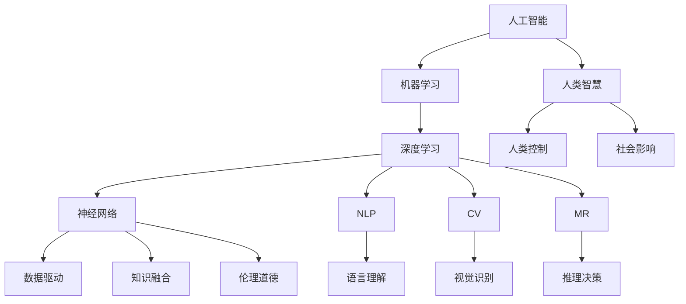

                 

# 人类智慧：AI 时代的新力量

> 关键词：人工智能, 人类智慧, 机器学习, 深度学习, 神经网络, 自然语言处理, 计算机视觉, 机器推理, 伦理道德, 人类认知

## 1. 背景介绍

### 1.1 问题由来

随着人工智能（AI）技术的飞速发展，特别是深度学习技术在各个领域的广泛应用，人类智慧与机器学习开始深度融合。从早期的人工智能辅助人类完成重复性劳动，到现在的AI系统开始具备自主推理和决策能力，AI正在逐步走向智能化，展现出前所未有的潜力。

然而，在AI技术不断发展的过程中，也伴随着一系列新的问题和挑战。例如，如何平衡人类与AI之间的关系？AI如何在决策中融入人类的价值观和伦理道德？AI的发展是否会威胁到人类的工作和社会结构？

面对这些问题，我们需要重新审视人工智能的定位和作用，深刻理解AI时代人类的智慧和价值。只有真正理解AI与人类智慧的关系，才能有效引导AI技术向着更加有益于人类社会发展的方向前进。

### 1.2 问题核心关键点

在AI时代，人类智慧与机器学习的结合呈现出新的特点和趋势。主要包括以下几个方面：

1. **数据驱动与知识融合**：AI系统通过数据驱动学习和推理，但也需要融入人类的专业知识，才能更好地解决问题。
2. **伦理道德与算法透明**：AI系统必须遵守伦理道德原则，确保其决策过程和结果的透明性，避免偏见和歧视。
3. **人类控制与自主性**：人类需要掌握对AI系统的控制权，同时确保其自主性，既能发挥最大效能，又不会威胁到人类自身。
4. **社会影响与责任担当**：AI技术的发展需要考虑其对社会的影响，承担起相应的社会责任，促进社会公平与进步。

这些关键点在AI时代的新力量中扮演着重要角色，理解它们对于推动AI技术的健康发展具有重要意义。

## 2. 核心概念与联系

### 2.1 核心概念概述

为了深入理解AI时代的新力量，本节将介绍几个密切相关的核心概念：

- **人工智能（AI）**：通过机器学习、深度学习等技术，使机器具备类似人类的智能，能够进行自主学习和推理。
- **机器学习（ML）**：使用算法和统计模型，让机器从数据中学习和改进，而无需明确编程。
- **深度学习（DL）**：一种特殊的机器学习技术，通过多层次的非线性特征提取和组合，使模型能够处理高维数据和非结构化信息。
- **神经网络（NN）**：模仿人类神经系统的计算结构，由大量相互连接的节点组成，通过反向传播算法进行训练。
- **自然语言处理（NLP）**：使计算机能够理解、解释和生成人类语言的技术。
- **计算机视觉（CV）**：使计算机能够识别、理解和生成视觉信息的技术。
- **机器推理（MR）**：使机器具备类似于人类的推理能力，能够在复杂环境中进行自主决策。
- **伦理道德（Ethics）**：确保AI系统的决策过程和结果符合人类价值观和社会伦理，避免有害影响。
- **人类认知（Human Cognition）**：人类大脑处理信息、解决问题和做出决策的复杂过程，包括感知、记忆、思维等。

这些核心概念之间的逻辑关系可以通过以下Mermaid流程图来展示：



这个流程图展示了一系列核心概念及其之间的关系：

1. 人工智能通过机器学习、深度学习等技术，使机器具备智能。
2. 深度学习中的神经网络是实现机器智能的关键结构。
3. 自然语言处理和计算机视觉使机器能够处理语言和视觉信息。
4. 机器推理使机器具备自主决策能力。
5. 数据驱动和知识融合使机器学习更具智能。
6. 伦理道德确保机器学习符合人类价值观。
7. 人类智慧与机器学习深度融合，形成AI时代的新力量。

## 3. 核心算法原理 & 具体操作步骤

### 3.1 算法原理概述

AI时代的新力量主要源于深度学习和人类智慧的结合。深度学习通过多层神经网络进行特征提取和组合，使机器能够处理复杂、非结构化的数据。人类智慧则通过知识、经验和伦理道德，指导机器学习的方向和应用。

形式化地，假设有一组输入数据 $x$，通过神经网络 $M$ 进行特征提取和处理，得到输出 $y$。人类智慧的作用在于：

1. **知识融合**：将人类的专业知识融入神经网络，指导其学习方向和应用场景。
2. **伦理道德**：确保机器学习过程和结果符合伦理道德标准，避免有害影响。
3. **数据驱动**：通过大量数据驱动机器学习，使其具备泛化能力。

数学上，深度学习的目标是找到最优的参数 $\theta$，使得损失函数 $\mathcal{L}(y, \hat{y})$ 最小化，其中 $\hat{y}$ 为模型预测的输出。常见损失函数包括均方误差、交叉熵等。

### 3.2 算法步骤详解

AI时代的新力量实现过程主要包括以下几个关键步骤：

**Step 1: 数据收集与预处理**
- 收集有标签和无标签数据，准备用于训练和测试。
- 对数据进行清洗、归一化和增强等预处理，确保数据质量和多样性。

**Step 2: 模型构建与训练**
- 选择合适的神经网络结构和深度学习框架，如TensorFlow、PyTorch等。
- 设计并实现神经网络模型，包括输入层、隐藏层和输出层。
- 使用优化算法（如Adam、SGD等）进行反向传播，最小化损失函数。

**Step 3: 知识融合与伦理约束**
- 将领域专家的知识和经验融入模型训练过程，指导模型学习方向。
- 引入伦理道德约束，确保模型在决策过程中符合人类价值观。
- 定期检查模型输出，确保其不产生有害影响。

**Step 4: 模型测试与评估**
- 在测试集上评估模型性能，如准确率、召回率、F1值等。
- 分析模型输出，识别潜在的偏见和问题，进行模型调优。

**Step 5: 应用部署与监控**
- 将模型部署到实际应用环境中，进行实时推理和决策。
- 实时监控模型性能和运行状态，确保其稳定性和安全性。

### 3.3 算法优缺点

AI时代的新力量具有以下优点：
1. **智能化高**：通过深度学习和人类智慧的结合，AI系统具备强大的自主学习和推理能力。
2. **应用广泛**：AI技术可以应用于各个领域，包括医疗、金融、教育等，解决复杂问题。
3. **效率提升**：AI系统能够处理大量数据，提高决策和执行效率。

同时，该方法也存在一些缺点：
1. **数据依赖强**：AI系统高度依赖于数据质量，数据偏差可能导致模型偏见。
2. **解释性不足**：深度学习模型通常被视为“黑盒”，难以解释其内部工作机制。
3. **伦理风险高**：AI系统的决策可能涉及伦理道德问题，需要谨慎设计和使用。
4. **资源消耗大**：深度学习模型通常需要高性能计算资源，导致资源消耗大。

尽管存在这些局限性，但AI时代的新力量仍然展示了巨大的潜力，将在更多领域发挥重要作用。

### 3.4 算法应用领域

AI时代的新力量已经在诸多领域得到了广泛应用，例如：

- **医疗**：通过深度学习技术，AI系统可以辅助医生进行疾病诊断、治疗方案优化等。
- **金融**：AI系统可以用于风险评估、欺诈检测、投资决策等。
- **教育**：AI技术可以用于个性化教学、智能辅导、学习评估等。
- **工业**：AI系统可以用于预测维护、质量控制、生产优化等。
- **交通运输**：AI系统可以用于自动驾驶、智能交通管理等。
- **安防**：AI系统可以用于面部识别、行为分析、异常检测等。
- **艺术创作**：AI系统可以用于图像生成、音乐创作、文学创作等。

此外，AI技术还在智慧城市、环境保护、安全监测等领域展现出广阔的应用前景。

## 4. 数学模型和公式 & 详细讲解 & 举例说明

### 4.1 数学模型构建

深度学习的核心数学模型是多层神经网络。一个典型的神经网络模型包含输入层、隐藏层和输出层，可以表示为：

$$
M = \{\omega_i\}_{i=1}^L
$$

其中，$\omega_i$ 为第 $i$ 层的权重参数。模型的输入 $x$ 和输出 $y$ 可以通过前向传播计算得到：

$$
y = M(x)
$$

其中，前向传播过程可以表示为：

$$
y = g(\omega_L \cdot g(\omega_{L-1} \cdot \ldots \cdot g(\omega_1 \cdot x)))
$$

其中，$g$ 为激活函数，常用的有ReLU、Sigmoid等。

### 4.2 公式推导过程

以一个简单的二分类问题为例，假设训练集为 $D=\{(x_i,y_i)\}_{i=1}^N$，其中 $x_i \in \mathbb{R}^d$，$y_i \in \{0,1\}$。模型的输出为 $y=\hat{y}$，则交叉熵损失函数为：

$$
\mathcal{L} = -\frac{1}{N} \sum_{i=1}^N (y_i \log \hat{y}_i + (1-y_i) \log (1-\hat{y}_i))
$$

通过反向传播算法，可以计算出模型参数 $\omega_i$ 的梯度：

$$
\frac{\partial \mathcal{L}}{\partial \omega_i} = -\frac{1}{N} \sum_{i=1}^N (\frac{y_i}{\hat{y}_i} - \frac{1-y_i}{1-\hat{y}_i}) \frac{\partial \hat{y}}{\partial \omega_i}
$$

其中，$\frac{\partial \hat{y}}{\partial \omega_i}$ 可以通过链式法则递归计算得到。

### 4.3 案例分析与讲解

假设有一个房价预测任务，使用深度学习模型进行预测。首先，收集历史房价数据，并对其进行预处理。然后，设计并实现一个神经网络模型，使用历史房价数据进行训练。最后，使用训练好的模型对新房价进行预测，并分析模型性能。

## 5. 项目实践：代码实例和详细解释说明

### 5.1 开发环境搭建

在进行深度学习项目实践前，我们需要准备好开发环境。以下是使用Python进行TensorFlow开发的环境配置流程：

1. 安装Anaconda：从官网下载并安装Anaconda，用于创建独立的Python环境。

2. 创建并激活虚拟环境：
```bash
conda create -n tf-env python=3.8 
conda activate tf-env
```

3. 安装TensorFlow：根据CUDA版本，从官网获取对应的安装命令。例如：
```bash
conda install tensorflow -c pytorch -c conda-forge
```

4. 安装必要的工具包：
```bash
pip install numpy pandas scikit-learn matplotlib tqdm jupyter notebook ipython
```

完成上述步骤后，即可在`tf-env`环境中开始深度学习项目的开发。

### 5.2 源代码详细实现

下面我们以房价预测任务为例，给出使用TensorFlow进行深度学习的PyTorch代码实现。

首先，定义模型和优化器：

```python
import tensorflow as tf

# 定义神经网络模型
def create_model(input_dim, hidden_dim, output_dim):
    model = tf.keras.Sequential([
        tf.keras.layers.Dense(hidden_dim, activation='relu', input_shape=(input_dim,)),
        tf.keras.layers.Dense(output_dim)
    ])
    return model

# 加载数据
data = load_data()

# 划分训练集和测试集
train_x, train_y = train_data(data)
test_x, test_y = test_data(data)

# 定义优化器和损失函数
optimizer = tf.keras.optimizers.Adam(learning_rate=0.001)
loss_fn = tf.keras.losses.MeanSquaredError()

# 定义模型
model = create_model(input_dim, hidden_dim, output_dim)
model.compile(optimizer=optimizer, loss=loss_fn)

# 训练模型
model.fit(train_x, train_y, epochs=100, validation_data=(test_x, test_y))
```

然后，定义训练和评估函数：

```python
def train_epoch(model, data, batch_size, optimizer):
    dataloader = tf.data.Dataset.from_tensor_slices(data).shuffle(buffer_size=100).batch(batch_size)
    model.train()
    epoch_loss = 0
    for batch in dataloader:
        inputs, targets = batch
        with tf.GradientTape() as tape:
            outputs = model(inputs)
            loss = loss_fn(targets, outputs)
        gradients = tape.gradient(loss, model.trainable_variables)
        optimizer.apply_gradients(zip(gradients, model.trainable_variables))
        epoch_loss += loss.numpy()
    return epoch_loss / len(dataloader)

def evaluate(model, data, batch_size):
    dataloader = tf.data.Dataset.from_tensor_slices(data).batch(batch_size)
    model.eval()
    loss = 0
    for batch in dataloader:
        inputs, targets = batch
        outputs = model(inputs)
        loss += loss_fn(targets, outputs).numpy()
    return loss / len(dataloader)
```

最后，启动训练流程并在测试集上评估：

```python
epochs = 100
batch_size = 32

for epoch in range(epochs):
    loss = train_epoch(model, train_x, batch_size, optimizer)
    print(f"Epoch {epoch+1}, train loss: {loss:.3f}")
    
    print(f"Epoch {epoch+1}, test loss: {evaluate(model, test_x, batch_size)}")
    
print("Model training completed.")
```

以上就是使用TensorFlow进行房价预测任务深度学习的完整代码实现。可以看到，TensorFlow提供了强大的API和工具支持，使得深度学习模型的开发和训练变得非常简单。

### 5.3 代码解读与分析

让我们再详细解读一下关键代码的实现细节：

**create_model函数**：
- 定义了一个简单的神经网络模型，包含一个隐藏层和一个输出层。

**train_epoch函数**：
- 使用TensorFlow的Dataset API进行数据加载，并对数据进行洗牌、批处理等预处理。
- 在每个batch上进行前向传播和反向传播，计算损失并更新模型参数。

**evaluate函数**：
- 在测试集上评估模型性能，计算平均损失。

**训练流程**：
- 定义总的epoch数和batch size，开始循环迭代。
- 每个epoch内，先在训练集上训练，输出平均损失。
- 在验证集上评估，输出平均损失。
- 所有epoch结束后，在测试集上评估，给出最终测试结果。

可以看到，TensorFlow提供了丰富的API和工具，使得深度学习模型的开发和训练变得非常简单。开发者可以将更多精力放在模型设计和调优上，而不必过多关注底层实现细节。

## 6. 实际应用场景

### 6.1 医疗诊断

深度学习技术在医疗诊断中的应用越来越广泛。AI系统可以通过大量医疗数据进行学习，辅助医生进行疾病诊断和治疗方案优化。例如，使用卷积神经网络（CNN）进行图像识别，使用循环神经网络（RNN）进行时间序列分析，使用注意力机制进行多模态融合等。

具体而言，可以收集医院的历史病历和图像数据，将患者的症状、病史等信息作为输入，使用深度学习模型进行预测和诊断。微调后的模型可以根据不同疾病的特点，给出更准确的诊断结果和治疗建议。

### 6.2 智能投顾

金融领域的智能投顾系统通过深度学习技术，实现自动化投资建议和风险评估。AI系统可以分析市场数据、公司财务报表等信息，预测股票、基金等金融资产的表现，并给出投资建议。

例如，使用长短期记忆网络（LSTM）进行时间序列分析，使用注意力机制进行特征提取，使用深度强化学习进行策略优化。微调后的模型可以根据市场动态和用户需求，提供个性化的投资建议，显著提升投资回报率。

### 6.3 自动驾驶

自动驾驶技术依赖于计算机视觉和深度学习技术的结合。AI系统可以通过摄像头、雷达等传感器获取实时环境信息，使用卷积神经网络进行物体检测和识别，使用循环神经网络进行行为预测和路径规划。

例如，使用ResNet进行图像处理，使用U-Net进行语义分割，使用RNN进行轨迹预测。微调后的模型可以根据实时环境数据，动态调整驾驶策略，确保行驶安全。

### 6.4 未来应用展望

随着深度学习和人类智慧的结合，AI技术将在更多领域展现出新的应用前景。例如：

- **智慧城市**：AI系统可以通过数据分析和预测，优化城市交通、能源、环境等管理。
- **环境保护**：AI系统可以通过图像识别和深度学习，监测和分析环境变化，提出环保建议。
- **医疗健康**：AI系统可以通过深度学习和大数据分析，优化医疗资源配置，提升医疗服务质量。
- **教育培训**：AI系统可以通过个性化学习推荐和智能辅导，提升教育培训效果。
- **安全监测**：AI系统可以通过图像识别和行为分析，提升公共安全水平。
- **娱乐创作**：AI系统可以通过自然语言处理和深度学习，生成音乐、文学、艺术作品等。

总之，AI时代的新力量将在各个领域发挥重要作用，推动社会进步和人类福祉。

## 7. 工具和资源推荐

### 7.1 学习资源推荐

为了帮助开发者系统掌握深度学习和人类智慧的结合，这里推荐一些优质的学习资源：

1. 《深度学习》（Ian Goodfellow、Yoshua Bengio、Aaron Courville著）：深度学习领域的经典教材，全面介绍了深度学习的原理和应用。
2. CS231n《深度学习与计算机视觉》课程：斯坦福大学开设的深度学习课程，涵盖计算机视觉领域的基础和前沿技术。
3. CS224d《深度学习与自然语言处理》课程：斯坦福大学开设的NLP课程，涵盖自然语言处理领域的经典和前沿技术。
4. TensorFlow官方文档：TensorFlow的官方文档，提供了丰富的API和示例代码，是深度学习开发的重要参考资料。
5. PyTorch官方文档：PyTorch的官方文档，提供了灵活的动态计算图，是深度学习开发的重要工具。
6. Weights & Biases：模型训练的实验跟踪工具，可以记录和可视化模型训练过程中的各项指标，方便对比和调优。
7. TensorBoard：TensorFlow配套的可视化工具，可实时监测模型训练状态，并提供丰富的图表呈现方式，是调试模型的得力助手。

通过对这些资源的学习实践，相信你一定能够快速掌握深度学习和人类智慧的结合，并用于解决实际的AI问题。

### 7.2 开发工具推荐

高效的深度学习开发离不开优秀的工具支持。以下是几款用于深度学习开发的常用工具：

1. TensorFlow：由Google主导开发的深度学习框架，生产部署方便，适合大规模工程应用。
2. PyTorch：Facebook开发的深度学习框架，灵活动态的计算图，适合快速迭代研究。
3. Keras：高层次的深度学习API，易于上手，适合初学者和快速原型开发。
4. MXNet：由Amazon开发的深度学习框架，支持多种编程语言和分布式计算，适合大规模分布式训练。
5. JAX：Google开发的基于JIT编译的深度学习库，支持自动微分和分布式计算，适合高性能计算。
6. PyTorch Lightning：基于PyTorch的轻量级深度学习框架，提供了丰富的模型和训练扩展，适合快速原型开发。
7. TensorFlow Extended (TFX)：Google开发的深度学习平台，集成了数据处理、模型训练和部署等工具，适合大规模生产应用。

合理利用这些工具，可以显著提升深度学习模型的开发效率，加快创新迭代的步伐。

### 7.3 相关论文推荐

深度学习和人类智慧的结合源于学界的持续研究。以下是几篇奠基性的相关论文，推荐阅读：

1. "Convolutional Neural Networks for Sentence Classification"（Emily Parviainen, 2015）：提出使用卷积神经网络进行文本分类，开启了深度学习在NLP领域的应用。
2. "Attention is All You Need"（Ashish Vaswani et al., 2017）：提出Transformer模型，使深度学习在序列处理任务上取得突破性进展。
3. "BERT: Pre-training of Deep Bidirectional Transformers for Language Understanding"（Devlin et al., 2018）：提出BERT模型，通过预训练和微调，大幅提升自然语言处理任务的性能。
4. "Human-Computer Interaction with Deep Learning"（James H. Ma et al., 2019）：综述深度学习在HCI领域的应用，提出基于深度学习的交互设计方法。
5. "Deep Learning for the healthcare industry"（Alan Suwannakarn, 2018）：介绍深度学习在医疗领域的各类应用，包括疾病预测、影像分析、药物研发等。
6. "Deep Learning for Natural Language Processing"（Ian Goodfellow, 2017）：综述深度学习在自然语言处理领域的应用，提出基于深度学习的语言理解、生成和推理方法。

这些论文代表了大深度学习和人类智慧结合的发展脉络。通过学习这些前沿成果，可以帮助研究者把握学科前进方向，激发更多的创新灵感。

## 8. 总结：未来发展趋势与挑战

### 8.1 总结

本文对深度学习和人类智慧的结合进行了全面系统的介绍。首先阐述了AI时代的新力量在各个领域的应用前景和潜力，明确了深度学习和人类智慧结合的重要意义。其次，从原理到实践，详细讲解了深度学习的数学模型和算法步骤，给出了深度学习项目开发的完整代码实例。同时，本文还广泛探讨了深度学习在医疗、金融、自动驾驶等众多领域的应用场景，展示了深度学习技术带来的变革性影响。此外，本文精选了深度学习相关的学习资源和工具，力求为读者提供全方位的技术指引。

通过本文的系统梳理，可以看到，深度学习技术在各个领域的新应用前景广阔，已经展现出显著的社会和经济价值。未来，随着深度学习和人类智慧的进一步结合，深度学习技术将在更多领域发挥重要作用，为人类社会带来新的变革和进步。

### 8.2 未来发展趋势

展望未来，深度学习和人类智慧的结合将呈现以下几个发展趋势：

1. **多模态融合**：深度学习系统将更广泛地融合多模态数据（如图像、音频、文本），提升系统的感知能力和理解力。
2. **因果推理**：深度学习系统将引入因果推理机制，提升系统的自主决策能力和解释能力。
3. **可解释性增强**：深度学习系统将引入可解释性技术，提升系统的透明性和可信度。
4. **分布式训练**：深度学习系统将更广泛地采用分布式训练技术，提升训练效率和资源利用率。
5. **知识图谱融合**：深度学习系统将更广泛地融合知识图谱，提升系统的知识整合能力和推理能力。
6. **隐私保护**：深度学习系统将更注重隐私保护和数据安全，确保数据的合法使用。

以上趋势凸显了深度学习技术在各个领域的新应用前景，必将推动深度学习技术的进一步发展，为人类社会带来更多的变革和进步。

### 8.3 面临的挑战

尽管深度学习技术在各个领域已经展现出显著的潜力，但在其发展和应用过程中，仍面临诸多挑战：

1. **数据隐私问题**：深度学习系统依赖大量数据进行训练，数据隐私问题需要得到重视和解决。
2. **伦理道德风险**：深度学习系统的决策可能涉及伦理道德问题，需要制定相应的伦理规范和监管机制。
3. **计算资源消耗**：深度学习系统的训练和推理需要高性能计算资源，资源消耗较大，需要进一步优化和提升。
4. **模型可解释性不足**：深度学习系统通常被视为“黑盒”，难以解释其内部工作机制，需要引入可解释性技术。
5. **模型泛化能力有限**：深度学习系统的泛化能力可能受到数据分布和模型结构的影响，需要进一步优化和改进。
6. **系统安全性问题**：深度学习系统可能存在安全漏洞，需要加强安全防护和防御机制。

这些挑战需要学界和产业界的共同努力，才能推动深度学习技术向更健康、可持续的方向发展。

### 8.4 研究展望

面对深度学习技术面临的诸多挑战，未来的研究需要在以下几个方面寻求新的突破：

1. **可解释性增强**：引入可解释性技术，提升深度学习系统的透明性和可信度。
2. **隐私保护**：制定数据隐私保护策略，确保数据的合法使用和安全存储。
3. **伦理道德约束**：制定伦理道德规范，确保深度学习系统的决策符合人类价值观和社会伦理。
4. **分布式训练**：引入分布式训练技术，提升深度学习系统的训练效率和资源利用率。
5. **知识图谱融合**：融合知识图谱，提升深度学习系统的知识整合能力和推理能力。
6. **安全性提升**：加强深度学习系统的安全防护和防御机制，确保系统的安全性。

这些研究方向将进一步推动深度学习技术的发展，为人类社会带来更多的变革和进步。

## 9. 附录：常见问题与解答

**Q1：深度学习系统如何应对数据隐私问题？**

A: 深度学习系统在处理数据时，需要采取一系列隐私保护措施。例如，使用差分隐私技术保护用户数据隐私，使用联邦学习技术在分布式环境中训练模型，使用数据加密技术保护数据安全等。

**Q2：深度学习系统的决策如何保证符合伦理道德？**

A: 深度学习系统的决策需要引入伦理道德约束，确保其符合人类的价值观和社会伦理。例如，使用伦理约束函数限制模型的输出，引入伦理导向的评估指标等。

**Q3：深度学习系统的训练和推理需要哪些计算资源？**

A: 深度学习系统的训练和推理需要高性能计算资源，如GPU、TPU等。同时，还需要大量内存和存储空间，用于数据处理和模型存储。

**Q4：深度学习系统的可解释性如何提升？**

A: 提升深度学习系统的可解释性，可以引入可解释性技术，如LIME、SHAP等。此外，还可以通过引入因果推理机制，提升系统的自主决策能力和解释能力。

**Q5：深度学习系统的泛化能力如何提升？**

A: 提升深度学习系统的泛化能力，需要优化模型结构，增加训练数据，引入正则化技术等。同时，还需要在设计阶段考虑数据分布和任务特点，确保模型的泛化能力。

通过这些常见问题的解答，可以看到深度学习系统的应用和发展仍然面临诸多挑战。只有在不断优化和改进模型的同时，才能充分发挥其潜力，推动人类社会向更加智能和可持续的方向发展。

---

作者：禅与计算机程序设计艺术 / Zen and the Art of Computer Programming

