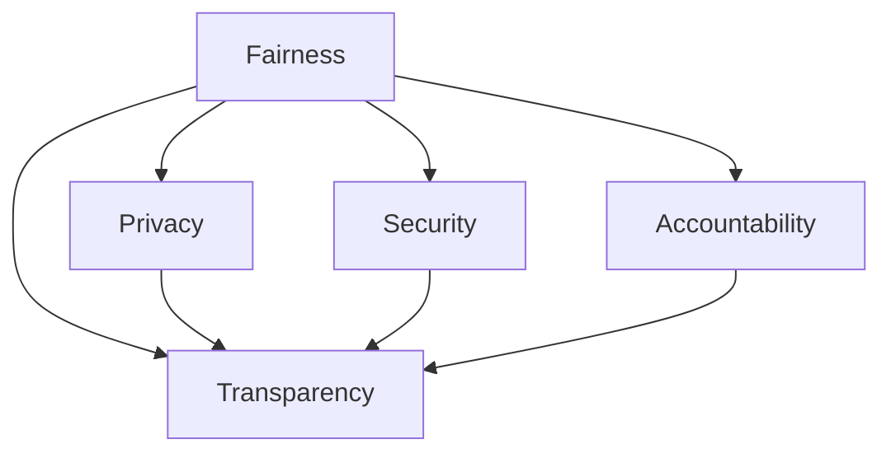

                 

# 人类计算：AI时代的道德和社会责任

> 关键词：人工智能(AI),道德伦理,社会责任,计算偏见,公平算法,隐私保护,数据安全,可解释性,透明度

## 1. 背景介绍

### 1.1 问题由来
在AI技术飞速发展的今天，人工智能已经深入到各行各业，深刻改变着人类的生产和生活方式。从医疗、金融到教育、娱乐，几乎每一个领域都在引入AI技术，提升工作效率，改善用户体验。然而，伴随着AI技术的广泛应用，也出现了诸多道德和社会问题。例如，AI算法可能存在歧视性、不公正性，造成社会不平等加剧；AI系统可能侵犯个人隐私，威胁数据安全；AI决策过程可能缺乏可解释性，难以被理解和信任。这些问题不仅影响AI技术的健康发展，也引发了广泛的社会关注和讨论。

因此，探讨AI时代的道德和社会责任，研究如何构建公平、透明、可解释的AI系统，成为当前AI领域的重要课题。本文将从理论到实践，深入分析AI技术在道德、隐私、公平、安全等方面的问题和挑战，提出解决方案，为AI技术的可持续发展提供借鉴和指导。

### 1.2 问题核心关键点
AI时代的道德和社会责任问题，涉及多方面的核心关键点：

- **公平性(Fairness)**：AI算法是否在处理不同群体时保持一致性，避免歧视和偏见。
- **透明性(Transparency)**：AI系统的决策过程是否可被理解和解释，确保人类信任和监督。
- **隐私保护(Privacy)**：AI系统是否合理保护用户数据，防止信息泄露和滥用。
- **数据安全(Security)**：AI系统是否具有强健的安全机制，避免被攻击和滥用。
- **责任归属(Accountability)**：AI系统出错时，责任应当由谁承担，如何追责。

这些关键点构成了AI道德和社会责任研究的出发点和核心内容。通过系统梳理这些关键点，本文旨在为AI技术的健康发展提供切实可行的指导和解决方案。

## 2. 核心概念与联系

### 2.1 核心概念概述

为更好地理解AI技术的道德和社会责任问题，本节将介绍几个密切相关的核心概念：

- **公平性(Fairness)**：指AI系统在处理不同群体时，是否能够保持无偏见和一致性。公平性是AI伦理的核心问题之一，涉及数据集偏见、算法偏见和输出偏见等多个层面。
- **透明性(Transparency)**：指AI系统的工作机制和决策过程是否清晰可被理解。透明性有助于增强用户信任和监督，确保AI系统的可解释性和可验证性。
- **隐私保护(Privacy)**：指AI系统在数据处理和使用过程中，是否能够合理保护用户隐私和数据安全。隐私保护是当前AI技术应用的重要约束条件，涉及数据匿名化、数据加密、访问控制等多方面内容。
- **数据安全(Security)**：指AI系统在处理敏感数据时，是否具有强健的安全机制，防止数据被攻击和滥用。数据安全是AI系统可信赖性的重要保障。
- **责任归属(Accountability)**：指AI系统出错时，责任应当由谁承担，如何追责。责任归属问题直接关系到AI技术的法律和社会责任，涉及技术开发者、用户、监管机构等多方利益。

这些核心概念之间的逻辑关系可以通过以下Mermaid流程图来展示：



这个流程图展示了公平性、透明性、隐私保护、数据安全、责任归属之间的关系：

1. 公平性是透明性、隐私保护、数据安全、责任归属的基石。
2. 透明性、隐私保护、数据安全、责任归属在公平性的基础上，进一步保障AI系统的公正和可信。
3. 透明性、隐私保护、数据安全、责任归属相互支撑，共同构建AI系统的道德和社会责任体系。

这些概念共同构成了AI技术的道德和社会责任研究框架，帮助我们全面审视AI技术的伦理和应用挑战。

## 3. 核心算法原理 & 具体操作步骤

### 3.1 算法原理概述

AI系统的公平性、透明性、隐私保护、数据安全、责任归属等问题，本质上是通过算法和技术的组合实现的。因此，研究这些问题的算法原理，是理解其核心机制的关键。

AI系统通常由以下三个主要组件构成：
- **数据处理组件**：负责数据收集、预处理和特征提取。
- **模型训练组件**：通过训练算法构建AI模型，实现数据到输出的映射。
- **输出组件**：将模型的输出转换为具体应用形式，如决策、生成、推荐等。

公平性、透明性、隐私保护、数据安全、责任归属等问题，分别涉及数据处理、模型训练、输出组件的不同方面。因此，从这三个组件的算法原理出发，可以全面理解AI技术的道德和社会责任。

### 3.2 算法步骤详解

基于上述组件，AI系统的公平性、透明性、隐私保护、数据安全、责任归属问题的算法步骤如下：

**数据处理组件**：
- **数据收集**：确保数据来源的多样性和代表性，避免数据偏见。
- **数据预处理**：对数据进行清洗、去重、标准化处理，确保数据质量。
- **特征提取**：选择合适的特征工程方法，提取数据的关键信息，减少噪声干扰。

**模型训练组件**：
- **公平性**：通过公平性约束，防止模型学习偏见。常见的方法包括权重平衡、公平性损失函数、对抗训练等。
- **透明性**：引入可解释性方法，如LIME、SHAP等，生成模型的特征重要性图。
- **隐私保护**：在数据预处理和特征提取过程中，应用差分隐私、联邦学习等技术，保护用户隐私。
- **数据安全**：在模型训练过程中，采用安全强化学习、对抗训练等技术，增强模型鲁棒性。
- **责任归属**：设计可解释模型和可追溯机制，确保AI系统出错时有明确的责任归属。

**输出组件**：
- **公平性**：在模型输出过程中，应用公平性约束，如基于类别的概率平衡。
- **透明性**：在用户交互过程中，提供明确的决策依据和解释信息。
- **隐私保护**：在用户数据使用过程中，严格控制数据访问权限，防止信息泄露。
- **数据安全**：在模型部署和运行过程中，应用安全审计和监控机制，防止系统被攻击。
- **责任归属**：在AI系统出错时，提供明确的责任归属和追责机制。

### 3.3 算法优缺点

公平性、透明性、隐私保护、数据安全、责任归属等算法具有以下优点：
1. **提升公平性**：通过公平性约束和对抗训练，显著减少模型偏见，提升公平性。
2. **增强透明性**：通过可解释性方法和特征重要性图，使得AI系统的决策过程可被理解和解释。
3. **保障隐私保护**：通过差分隐私和联邦学习，保护用户数据隐私，防止信息泄露。
4. **增强数据安全**：通过安全强化学习和对抗训练，增强模型鲁棒性，防止数据被攻击。
5. **明确责任归属**：通过可解释模型和可追溯机制，明确AI系统出错时的责任归属，增强系统的可信度。

同时，这些算法也存在一些局限性：
1. **计算复杂度高**：部分公平性、隐私保护、数据安全等算法，计算复杂度高，对系统性能产生影响。
2. **技术复杂性高**：这些算法涉及技术门槛高，需要专门的领域知识，增加了实施难度。
3. **模型解释性不足**：尽管可解释性方法有所进展，但部分复杂模型仍难以解释。
4. **数据隐私泄露风险**：差分隐私和联邦学习等技术，仍难以完全消除数据隐私泄露风险。
5. **模型鲁棒性不足**：部分模型在面对对抗攻击时，仍存在鲁棒性不足的问题。

尽管存在这些局限性，但就目前而言，这些算法是解决AI道德和社会责任问题的有效手段。未来相关研究的重点在于如何进一步降低算法复杂性，提高模型解释性，减少数据隐私泄露风险，提升模型鲁棒性，以实现AI系统的公平、透明、可信和安全。

### 3.4 算法应用领域

基于公平性、透明性、隐私保护、数据安全、责任归属等算法的AI系统，在各个领域得到了广泛应用：

- **医疗健康**：通过AI辅助诊断、个性化治疗等应用，提升医疗服务的公平性和可信度，保障患者隐私。
- **金融服务**：利用AI进行风险评估、信用评分、反欺诈等，确保算法公平性，保护用户数据安全。
- **教育培训**：通过智能评估、推荐系统等，提升教育公平性，保护学生隐私。
- **智能安防**：利用AI进行异常检测、行为识别等，确保系统透明性，保护用户隐私。
- **智能制造**：通过AI优化生产流程、预测维护等，提升制造公平性，保护数据安全。

除了上述这些经典应用外，AI技术还在更多领域得到了创新性的应用，如智能客服、智能家居、智能交通等，为各个行业带来了颠覆性变革。随着AI技术的持续演进，相信AI系统的公平性、透明性、隐私保护、数据安全、责任归属等问题将得到更全面的解决，AI技术将在更广泛的应用领域发挥更大作用。

## 4. 数学模型和公式 & 详细讲解 & 举例说明

### 4.1 数学模型构建

AI系统的公平性、透明性、隐私保护、数据安全、责任归属等问题，可以通过数学模型进行建模和求解。这里以公平性问题为例，详细讲解数学模型的构建和求解方法。

**公平性问题定义**：
假设有一组训练数据 $D=\{(x_i,y_i)\}_{i=1}^N$，其中 $x_i$ 为输入特征，$y_i$ 为标签。模型 $M_{\theta}$ 的预测输出为 $y_{pred}=M_{\theta}(x_i)$。公平性问题可以定义为一个约束优化问题：

$$
\min_{\theta} \mathcal{L}(y_{pred},y_i) \text{ subject to } f(y_{pred},y_i) \leq \epsilon
$$

其中 $\mathcal{L}(y_{pred},y_i)$ 为损失函数，$f(y_{pred},y_i)$ 为公平性约束函数，$\epsilon$ 为公平性阈值。

**公平性约束函数**：
常用的公平性约束函数包括：
- **等偏差约束**：不同类别之间预测概率差异不超过一定阈值。
- **等正/负预测约束**：不同类别之间正/负预测数量不超过一定比例。
- **统计等价约束**：不同类别之间预测概率差异不超过一定阈值，同时预测数量比例不超过一定阈值。

**公平性损失函数**：
常用的公平性损失函数包括：
- **平方损失**：$L(y_{pred},y_i) = (y_{pred}-y_i)^2$
- **对数损失**：$L(y_{pred},y_i) = -y_i\log y_{pred} - (1-y_i)\log(1-y_{pred})$
- **交叉熵损失**：$L(y_{pred},y_i) = -y_i\log y_{pred} - (1-y_i)\log(1-y_{pred})$

### 4.2 公式推导过程

以等偏差约束为例，推导公平性约束函数的表达式。

假设模型 $M_{\theta}$ 的输出为 $y_{pred}=M_{\theta}(x_i)$，对于类别 $c$，其预测概率为 $p_c=M_{\theta}(x_i,c)$。等偏差约束要求不同类别之间预测概率差异不超过一定阈值 $\delta$，即：

$$
|p_c - p_{c'}| \leq \delta, \forall c \neq c'
$$

将上述不等式转化为等价形式：

$$
-\delta \leq p_c - p_{c'} \leq \delta
$$

将上述不等式代入约束优化问题，得到公平性约束函数：

$$
f(y_{pred},y_i) = \sum_{c=1}^K \sum_{c'=c+1}^K \max(0, p_c - p_{c'}) \leq \delta
$$

其中 $K$ 为类别数。

### 4.3 案例分析与讲解

以下以一个简单的公平性优化案例，展示公平性约束函数的计算过程：

假设有一个二分类任务，类别为 $c=0,1$，模型预测概率为 $p_0,M_{\theta}(x_i,0)$ 和 $p_1=M_{\theta}(x_i,1)$。公平性阈值为 $\delta=0.1$。根据等偏差约束，公平性约束函数可以表示为：

$$
f(y_{pred},y_i) = \max(p_0 - p_1, 0) \leq 0.1
$$

在优化过程中，首先计算每个样本的预测概率 $p_0$ 和 $p_1$，然后计算公平性约束函数的值。如果 $f(y_{pred},y_i) \leq 0.1$，则满足公平性约束；否则，需要对模型参数 $\theta$ 进行调整，直到满足公平性约束。

## 5. 项目实践：代码实例和详细解释说明

### 5.1 开发环境搭建

在进行公平性优化实践前，我们需要准备好开发环境。以下是使用Python进行TensorFlow开发的环境配置流程：

1. 安装Anaconda：从官网下载并安装Anaconda，用于创建独立的Python环境。

2. 创建并激活虚拟环境：
```bash
conda create -n tf-env python=3.8 
conda activate tf-env
```

3. 安装TensorFlow：根据CUDA版本，从官网获取对应的安装命令。例如：
```bash
conda install tensorflow tensorflow-gpu==2.5 -c pytorch -c conda-forge
```

4. 安装各类工具包：
```bash
pip install numpy pandas scikit-learn matplotlib tqdm jupyter notebook ipython
```

完成上述步骤后，即可在`tf-env`环境中开始公平性优化的实践。

### 5.2 源代码详细实现

这里我们以二分类任务为例，给出使用TensorFlow对模型进行公平性优化的PyTorch代码实现。

首先，定义公平性问题的数据处理函数：

```python
from tensorflow.keras.datasets import mnist
from tensorflow.keras.utils import to_categorical
from tensorflow.keras.models import Sequential
from tensorflow.keras.layers import Dense, Dropout, Flatten
from tensorflow.keras.losses import MeanSquaredError
from tensorflow.keras.optimizers import Adam

def prepare_data(batch_size=128, train_size=60000, test_size=10000):
    (X_train, y_train), (X_test, y_test) = mnist.load_data()
    X_train = X_train.reshape((60000, 784)).astype('float32') / 255.0
    X_test = X_test.reshape((10000, 784)).astype('float32') / 255.0
    y_train = to_categorical(y_train, num_classes=10)
    y_test = to_categorical(y_test, num_classes=10)
    
    X_train, X_val, y_train, y_val = train_test_split(X_train, y_train, test_size=0.2)
    X_train = X_train[:train_size]
    y_train = y_train[:train_size]
    
    return (X_train, y_train), (X_val, y_val), (X_test, y_test)
```

然后，定义模型和公平性约束：

```python
from tensorflow.keras import backend as K
from tensorflow.keras.metrics import Mean

def build_model(input_shape):
    model = Sequential([
        Dense(512, activation='relu', input_shape=input_shape),
        Dropout(0.5),
        Dense(10, activation='softmax')
    ])
    return model

def fairness_constraint(y_pred, y_true):
    c = K.sum(K.abs(y_pred - y_true), axis=1)
    return c
```

接着，定义训练和评估函数：

```python
from tensorflow.keras.callbacks import EarlyStopping
from tensorflow.keras.metrics import Mean

def train_model(X_train, y_train, X_val, y_val, X_test, y_test):
    input_shape = (784,)
    model = build_model(input_shape)
    
    optimizer = Adam(lr=0.001)
    loss = MeanSquaredError()
    constraint = fairness_constraint
    
    model.compile(optimizer=optimizer, loss=loss, metrics=['accuracy'])
    
    early_stopping = EarlyStopping(monitor='val_loss', patience=10)
    
    model.fit(X_train, y_train, epochs=100, batch_size=64, validation_data=(X_val, y_val), callbacks=[early_stopping])
    
    return model
    
def evaluate_model(model, X_test, y_test):
    y_pred = model.predict(X_test)
    y_true = y_test
    accuracy = K.mean(K.equal(y_pred, y_true), axis=1)
    return accuracy
```

最后，启动训练流程并在测试集上评估：

```python
(X_train, y_train), (X_val, y_val), (X_test, y_test) = prepare_data()
model = train_model(X_train, y_train, X_val, y_val, X_test, y_test)
accuracy = evaluate_model(model, X_test, y_test)
print(f'Accuracy: {accuracy}')
```

以上就是使用TensorFlow对二分类模型进行公平性优化的完整代码实现。可以看到，利用TensorFlow的自动微分和优化器功能，可以轻松实现公平性约束的优化过程。

### 5.3 代码解读与分析

让我们再详细解读一下关键代码的实现细节：

**prepare_data函数**：
- 加载MNIST数据集，进行归一化和数据预处理。
- 将数据集划分为训练集、验证集和测试集。
- 调整训练集的大小，以便于进行公平性约束优化。

**build_model函数**：
- 定义一个简单的二分类模型，包括一个全连接层、Dropout层和输出层。

**fairness_constraint函数**：
- 定义公平性约束函数，计算模型输出与真实标签之间的差异。

**train_model函数**：
- 构建模型并编译，指定公平性约束函数。
- 设置优化器、损失函数和评估指标。
- 设置EarlyStopping回调，监控验证集损失，防止过拟合。
- 进行模型训练，并在验证集上评估公平性约束效果。

**evaluate_model函数**：
- 使用模型进行测试集预测，计算预测准确率。

可以看到，TensorFlow提供的自动微分和优化器功能，使得公平性优化的代码实现变得简洁高效。开发者可以将更多精力放在数据处理、模型改进等高层逻辑上，而不必过多关注底层的实现细节。

当然，工业级的系统实现还需考虑更多因素，如模型的保存和部署、超参数的自动搜索、更灵活的公平性约束方法等。但核心的公平性优化流程基本与此类似。

## 6. 实际应用场景
### 6.1 医疗健康

AI在医疗健康领域的应用，已经初步显示出其巨大的潜力和价值。例如，利用AI进行医学影像诊断、个性化治疗、疾病预测等，提升了医疗服务的质量和效率。然而，医疗数据具有高度敏感性，涉及患者隐私，AI系统必须严格遵守数据保护法规，保障患者隐私。

在实际应用中，可以设计基于公平性和透明性的医疗AI系统，确保数据隐私和安全。例如，在医学影像诊断中，模型输出需要清晰可解释，便于医生理解和监督。在个性化治疗中，模型输出的治疗方案需要满足公平性约束，避免因数据偏差导致的治疗不公平。通过这些措施，可以提升医疗AI系统的可信度和透明度，保障患者权益。

### 6.2 金融服务

AI在金融服务领域的应用，已经深入到风险评估、信用评分、反欺诈等多个环节。然而，金融数据涉及大量敏感信息，如个人账户、交易记录等，AI系统的安全性和隐私保护至关重要。

在实际应用中，可以设计基于公平性、透明性和数据安全的金融AI系统，确保系统运行安全。例如，在风险评估中，模型输出的风险评分需要满足公平性约束，避免因数据偏差导致的风险歧视。在反欺诈中，模型输出的欺诈检测结果需要清晰可解释，便于监管机构审查。通过这些措施，可以提升金融AI系统的可信度和安全性，保障用户数据隐私。

### 6.3 智能安防

AI在智能安防领域的应用，已经初步显示出其巨大的潜力和价值。例如，利用AI进行异常检测、行为识别、预警预测等，提升了安全监控的效率和准确性。然而，智能安防系统涉及大量视频、音频数据，数据隐私和安全问题不容忽视。

在实际应用中，可以设计基于公平性、透明性和数据安全的智能安防系统，确保数据隐私和安全。例如，在异常检测中，模型输出的异常事件需要满足公平性约束，避免因数据偏差导致的误报或漏报。在行为识别中，模型输出的行为结果需要清晰可解释，便于监管机构审查。通过这些措施，可以提升智能安防系统的可信度和安全性，保障用户数据隐私。

### 6.4 未来应用展望

随着AI技术的不断演进，基于公平性、透明性、隐私保护、数据安全、责任归属的AI系统，将在更多领域得到应用，为社会带来深远影响。

在智慧城市治理中，AI系统可以通过公平性和透明性，提升城市管理和服务质量，确保数据隐私和安全。在智能制造中，AI系统可以通过数据安全和责任归属，提升生产效率和产品质量，确保企业数据安全。

除了这些行业应用外，AI技术还在更多领域得到了创新性的应用，如智能客服、智能家居、智能交通等，为各行各业带来了颠覆性变革。随着AI技术的持续演进，相信AI系统的公平性、透明性、隐私保护、数据安全、责任归属等问题将得到更全面的解决，AI技术将在更广泛的应用领域发挥更大作用。

## 7. 工具和资源推荐
### 7.1 学习资源推荐

为了帮助开发者系统掌握AI技术的道德和社会责任问题，这里推荐一些优质的学习资源：

1. 《AI伦理与社会责任》系列博文：由AI伦理专家撰写，深入浅出地介绍了AI伦理的核心问题，包括公平性、透明性、隐私保护、数据安全等。

2. 《机器学习中的公平性与隐私保护》课程：由斯坦福大学开设的机器学习课程，有Lecture视频和配套作业，带你入门AI伦理的基本概念和经典模型。

3. 《AI伦理学导论》书籍：全面介绍了AI伦理学的基本理论和方法，涵盖了公平性、透明性、隐私保护、数据安全等多个方面。

4. 《AI伦理与社会责任》论文集：汇集了当前AI伦理领域的最新研究成果，为深入理解AI伦理问题提供了丰富的理论资源。

通过对这些资源的学习实践，相信你一定能够快速掌握AI技术的道德和社会责任问题，并用于解决实际的AI应用问题。
###  7.2 开发工具推荐

高效的开发离不开优秀的工具支持。以下是几款用于AI技术道德和社会责任研究的常用工具：

1. TensorFlow：基于Python的开源深度学习框架，灵活动态的计算图，适合快速迭代研究。适用于多种AI任务，包括公平性优化。

2. PyTorch：基于Python的开源深度学习框架，动态计算图，灵活度较高，适合复杂的模型优化。适用于多种AI任务，包括公平性优化。

3. Weights & Biases：模型训练的实验跟踪工具，可以记录和可视化模型训练过程中的各项指标，方便对比和调优。与主流深度学习框架无缝集成。

4. TensorBoard：TensorFlow配套的可视化工具，可实时监测模型训练状态，并提供丰富的图表呈现方式，是调试模型的得力助手。

5. Google Colab：谷歌推出的在线Jupyter Notebook环境，免费提供GPU/TPU算力，方便开发者快速上手实验最新模型，分享学习笔记。

合理利用这些工具，可以显著提升AI系统道德和社会责任研究的开发效率，加快创新迭代的步伐。

### 7.3 相关论文推荐

AI技术的道德和社会责任问题，涉及多方面的核心关键点。以下是几篇奠基性的相关论文，推荐阅读：

1. The Moral Landscape: Towards a Global Algorithmic Fairness Framework：提出全球性算法公平性框架，讨论了公平性、透明性、隐私保护、数据安全等多个方面。

2. Explainable Artificial Intelligence：系统地介绍了可解释AI的概念和方法，涵盖了公平性、透明性、隐私保护、数据安全等多个方面。

3. Adversarial Robustness and Fairness：讨论了对抗性攻击和公平性之间的权衡问题，提出了多种防御和优化方法。

4. Data Privacy in Machine Learning: Concepts and Foundations：介绍了数据隐私保护的基本概念和方法，涵盖差分隐私、联邦学习等多个方面。

5. A Survey on Fairness, Accountability, Transparency, and Explainability of Machine Learning：综述了当前AI伦理和可解释性的研究进展，涵盖公平性、透明性、隐私保护、数据安全等多个方面。

这些论文代表了大AI技术道德和社会责任研究的发展脉络。通过学习这些前沿成果，可以帮助研究者把握学科前进方向，激发更多的创新灵感。

## 8. 总结：未来发展趋势与挑战

### 8.1 总结

本文对AI技术的道德和社会责任问题进行了全面系统的介绍。首先阐述了AI技术在医疗、金融、智能安防等领域的应用，探讨了其带来的道德和社会问题。其次，从理论到实践，详细讲解了公平性、透明性、隐私保护、数据安全、责任归属等问题的算法原理和操作步骤。最后，通过具体案例展示了公平性优化的实际应用。

通过本文的系统梳理，可以看到，AI技术的道德和社会责任问题已成为技术发展中的重要议题。面对这些问题，研究者需要系统地考虑算法设计、模型训练、数据处理、用户交互等多个方面，以构建公平、透明、可信的AI系统。未来，伴随着AI技术的持续演进，这些问题将得到更全面的解决，AI技术将在更广泛的应用领域发挥更大的作用。

### 8.2 未来发展趋势

展望未来，AI技术的道德和社会责任研究将呈现以下几个发展趋势：

1. **多领域融合**：AI技术将在更多领域得到应用，涵盖医疗、金融、智能安防、智能制造等多个领域。AI系统的公平性、透明性、隐私保护、数据安全、责任归属问题将得到更全面的解决。

2. **模型解释性提升**：未来的AI系统将更加注重模型解释性，通过可解释性方法和特征重要性图，使得AI系统的决策过程更加透明和可理解。

3. **隐私保护技术发展**：差分隐私、联邦学习等隐私保护技术将得到更广泛的应用，保护用户数据隐私，防止信息泄露和滥用。

4. **数据安全机制完善**：AI系统的安全强化学习和对抗训练等机制将得到进一步完善，增强模型鲁棒性，防止数据被攻击和滥用。

5. **公平性约束优化**：未来的公平性约束算法将更加高效和精确，通过公平性约束函数，确保模型在处理不同群体时保持一致性。

6. **责任归属机制建立**：未来的AI系统将建立明确的责任归属机制，确保模型出错时有明确的责任归属，增强系统的可信度。

以上趋势凸显了AI技术的道德和社会责任研究的广阔前景。这些方向的探索发展，必将进一步提升AI系统的公平性、透明性、可信性和安全性，为社会带来更多福祉。

### 8.3 面临的挑战

尽管AI技术的道德和社会责任研究取得了一定进展，但在迈向更加智能化、普适化应用的过程中，仍面临诸多挑战：

1. **技术门槛高**：公平性、透明性、隐私保护、数据安全、责任归属等问题的研究涉及复杂的技术和算法，需要高水平的专业知识。

2. **数据隐私泄露风险**：差分隐私、联邦学习等隐私保护技术，仍难以完全消除数据隐私泄露风险。

3. **模型解释性不足**：尽管可解释性方法有所进展，但部分复杂模型仍难以解释。

4. **模型鲁棒性不足**：部分模型在面对对抗攻击时，仍存在鲁棒性不足的问题。

5. **责任归属不明确**：AI系统出错时的责任归属问题，仍需要更清晰的法律和监管机制。

尽管存在这些挑战，但通过持续的研究和技术创新，AI系统的道德和社会责任问题将逐步得到解决。未来相关研究的重点在于如何进一步降低技术门槛，提高模型解释性，减少数据隐私泄露风险，提升模型鲁棒性，完善责任归属机制，以实现AI系统的公平、透明、可信和安全。

### 8.4 研究展望

未来，AI技术的道德和社会责任研究需要在以下几个方面寻求新的突破：

1. **融合多种技术**：将公平性、透明性、隐私保护、数据安全、责任归属等技术与多模态学习、迁移学习、联邦学习等技术相结合，实现更全面、更高效的应用。

2. **引入伦理导向**：在AI模型训练和优化过程中，引入伦理导向的评估指标，过滤和惩罚有偏见、有害的输出倾向，增强模型的公平性和伦理性。

3. **建立监管机制**：建立AI系统的监管机制，明确监管机构和责任归属，确保AI系统的合法合规运行。

4. **促进社会共识**：通过教育和公众参与，增强社会对AI技术的理解和信任，促进公平、透明、可解释的AI系统的发展。

5. **推动法律保障**：制定相关法律法规，保障AI技术的应用和研究，确保AI系统的伦理和社会责任。

这些研究方向将推动AI技术的健康发展，确保其在社会中的应用负责任、可信赖，为构建人机协同的未来社会提供坚实的技术基础。面向未来，AI技术的道德和社会责任研究仍需各界共同努力，推动技术进步与社会发展的良性互动。

## 9. 附录：常见问题与解答

**Q1：AI系统如何保证数据隐私和安全？**

A: AI系统在数据处理和应用过程中，可以通过以下几种方式保障数据隐私和安全：
1. **差分隐私**：在数据预处理和特征提取阶段，应用差分隐私技术，确保个体数据无法被反向识别。
2. **联邦学习**：在模型训练阶段，采用联邦学习技术，确保数据不出本地，同时实现模型训练。
3. **安全审计**：在模型部署和运行阶段，进行安全审计和监控，确保系统未被攻击和滥用。
4. **数据加密**：在数据存储和传输阶段，采用数据加密技术，确保数据不被未授权访问。
5. **访问控制**：在数据访问阶段，严格控制数据访问权限，防止数据泄露。

这些技术手段可以结合使用，构建多层次的数据保护机制，确保AI系统在数据处理和应用过程中，保障数据隐私和安全。

**Q2：AI系统如何进行公平性优化？**

A: AI系统在进行公平性优化时，可以采用以下几种方法：
1. **公平性约束**：在模型训练过程中，通过公平性约束函数，确保模型在处理不同群体时保持一致性。
2. **对抗训练**：在模型训练过程中，引入对抗样本，增强模型鲁棒性，防止模型学习偏见。
3. **公平性损失函数**：在模型训练过程中，使用公平性损失函数，减少模型预测偏差。
4. **公平性优化算法**：在模型训练过程中，使用公平性优化算法，如权衡损失、公平性约束优化器等，提升模型公平性。

这些方法可以根据具体任务和数据特点，灵活组合使用，以实现AI系统的公平性优化。

**Q3：AI系统的责任归属如何确定？**

A: AI系统的责任归属问题，可以通过以下几种方式确定：
1. **责任链条**：在模型设计和训练过程中，明确各个组件的责任，确保每个组件都有明确的责任归属。
2. **责任追溯机制**：在模型部署和运行阶段，建立责任追溯机制，记录每个决策的来源和过程，确保责任可追溯。
3. **法律框架**：在模型应用和监管阶段，建立明确的法律框架，明确各方的责任和义务，确保责任归属明确。
4. **第三方审计**：在模型应用和监管阶段，引入第三方审计机构，对AI系统进行独立评估，确保责任归属公正。

这些方法可以结合使用，确保AI系统在出错时有明确的责任归属，增强系统的可信度。

---

作者：禅与计算机程序设计艺术 / Zen and the Art of Computer Programming

