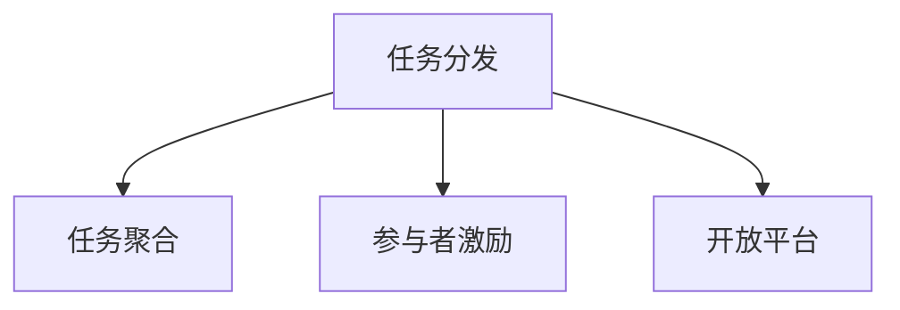

                 

# 众包：利用集体智慧的力量

> 关键词：众包, 集体智慧, 分布式协作, 开放平台, 开源社区, 创新与协作

## 1. 背景介绍

### 1.1 问题由来
随着信息时代的到来，互联网技术的发展使得人们能够以全新的方式进行协作。众包（Crowdsourcing）作为一种利用集体智慧进行任务分发的创新模式，正迅速成为各行各业中解决复杂问题的重要工具。从软件开发、内容创作到市场调研，众包的应用范围越来越广。

然而，如何有效地组织和协调大规模的众包任务，保障参与者的权益，激励其持续参与，是众包平台面临的重要挑战。众包平台需要建立一种机制，使得参与者能够高效地完成任务，并且通过合理的激励机制，激发其积极性和创造性。

### 1.2 问题核心关键点
众包平台的核心在于任务分发、结果收集和参与者激励三部分：

- **任务分发**：众包平台需要将任务合理地分发给合适的参与者，使其能够高效完成任务。
- **结果收集**：众包平台需要确保收集到的结果质量和可靠性，确保任务的完成效果。
- **参与者激励**：众包平台需要通过合理的激励机制，保障参与者的权益，提高其参与度和满意度。

这些关键点构成了众包平台的设计基础，其优劣直接决定了众包任务的完成效果和平台的可持续性。

### 1.3 问题研究意义
众包技术的普及和应用，为解决各种复杂问题提供了新的思路和工具。它的出现，为分散的智慧和资源提供了一个汇聚的平台，使得各行各业能够充分利用集体智慧，加速创新和协作。研究众包平台的设计和优化方法，对于推动集体智慧的广泛应用，提升社会生产力，具有重要意义：

1. 降低成本：众包平台能够显著降低任务完成的成本，尤其是在需要大量人力资源的任务上。
2. 提高效率：通过将任务分发给多个参与者，可以大幅提高任务的完成效率，尤其是对于一些非标准化的、需要创意的任务。
3. 创新驱动：众包平台能够激励多样化的想法和创新，使得问题解决更加灵活和多样化。
4. 增强协作：众包平台促进了跨领域的知识共享和交流，推动了社会协作的发展。

## 2. 核心概念与联系

### 2.1 核心概念概述

众包是指利用互联网平台将任务分配给分散的个人或团队，并通过开放平台进行任务管理和结果收集的一种协作模式。众包平台的核心概念包括：

- **任务分发**：将任务拆分为多个子任务，并分配给合适的参与者。
- **任务聚合**：收集各参与者的结果，进行合并或投票，以获得最终结果。
- **参与者激励**：设计合理的激励机制，保障参与者的权益，激励其持续参与。
- **开放平台**：提供一个公共平台，方便任务发布、结果展示和参与者交流。

这些概念通过众包平台得以实现，并通过以下Mermaid流程图展示它们之间的联系：



这个流程图展示了众包平台的关键功能模块及其相互关系。任务分发和聚合是众包平台的核心功能，而参与者激励和开放平台是保障任务完成质量和可持续性的重要手段。

## 3. 核心算法原理 & 具体操作步骤
### 3.1 算法原理概述

众包平台的核心算法原理可以概括为“任务分发与结果聚合”的循环过程。具体来说，众包平台首先对任务进行分解，分配给合适的参与者；然后收集参与者的结果，通过聚合算法得到最终结果；最后根据任务完成效果和参与者表现，设计激励机制以鼓励持续参与。

形式化地，假设众包平台的任务为 $T$，参与者为 $P$，任务分配和结果聚合过程为 $F$，参与者激励为 $I$，则众包平台的工作流程可以表示为：

$$
\begin{aligned}
&\text{分发任务: } F(T) = \{(T_i, P_j)\}_{i=1}^N \\
&\text{聚合结果: } R = F(\{T_i\}_{i=1}^N, \{P_j\}_{j=1}^M) \\
&\text{激励参与: } I(P_j, R) = R_j
\end{aligned}
$$

其中，$(T_i, P_j)$ 表示任务 $T$ 被分配给参与者 $P$ 的子任务；$R$ 表示最终结果；$I(P_j, R)$ 表示对参与者 $P_j$ 的激励结果。

### 3.2 算法步骤详解

众包平台的具体操作可以分为以下几个步骤：

**Step 1: 任务分解与分发**

1. **任务定义**：定义任务的输入和输出格式，明确任务的目标和要求。
2. **任务拆分**：将任务拆分为多个子任务，每个子任务可以在短时间内完成。
3. **任务发布**：将子任务发布到众包平台上，包括任务描述、预期成果、报酬等关键信息。

**Step 2: 结果收集与聚合**

1. **结果提交**：参与者根据任务要求提交结果。
2. **结果审查**：对提交的结果进行初步审查，确保其符合任务要求。
3. **结果聚合**：对符合要求的结果进行聚合，得到最终结果。

**Step 3: 参与者激励**

1. **任务评价**：根据任务完成效果和参与者表现，对参与者进行评价。
2. **激励设计**：设计合理的激励机制，如报酬分配、积分奖励等。
3. **参与者反馈**：收集参与者的反馈，优化激励机制。

### 3.3 算法优缺点

众包平台具有以下优点：

1. **高效完成任务**：通过任务分解和分发给多个参与者，可以大幅提高任务的完成效率。
2. **广泛资源动员**：众包平台可以动员大量分散的资源和智慧，解决一些复杂问题。
3. **低成本**：相对于传统雇佣模式，众包平台可以显著降低任务完成成本。
4. **创新驱动**：众包平台鼓励多样化的想法和创新，使得问题解决更加灵活和多样化。

同时，众包平台也存在一些缺点：

1. **质量控制难度大**：众包平台上提交的结果质量难以保证，需要额外的审核机制。
2. **激励机制复杂**：设计合理的激励机制较为复杂，需要考虑参与者的多样性和公平性。
3. **平台依赖度高**：参与者对平台的依赖度高，一旦平台出现问题，任务完成可能受影响。
4. **数据隐私和安全**：众包平台上涉及大量用户数据，需要确保数据的安全性和隐私保护。

### 3.4 算法应用领域

众包平台的应用领域广泛，以下是几个典型案例：

1. **软件开发**：如GitHub的Issue Tracking系统，将任务发布给全球开发者，解决代码缺陷和改进功能。
2. **内容创作**：如MediaWiki的维基编辑和维基百科内容创建，通过众包平台收集全球用户编辑的内容。
3. **市场调研**：如SurveyMonkey，通过众包平台进行大规模问卷调查，获取用户反馈和市场数据。
4. **产品设计**：如Pinterest的产品功能优化，通过用户反馈进行产品迭代和设计。
5. **科学研究**：如Zooniverse，利用众包平台进行图像标注和科学数据收集。

此外，众包平台还广泛应用于环境保护、医疗健康、教育培训等多个领域，为社会各行业的协同创新提供了新的可能性。

## 4. 数学模型和公式 & 详细讲解 & 举例说明
### 4.1 数学模型构建

众包平台的任务分发和结果聚合过程可以形式化为如下数学模型：

1. **任务分解**：假设任务 $T$ 分解为 $N$ 个子任务 $T_i$，分配给 $M$ 个参与者 $P_j$。任务分配策略可以表示为 $(T_i, P_j)$，其中 $T_i$ 表示第 $i$ 个子任务，$P_j$ 表示第 $j$ 个参与者。

2. **结果聚合**：假设每个参与者提交的结果为 $R_j$，通过聚合算法得到最终结果 $R$。聚合过程可以表示为 $R = F(\{T_i\}_{i=1}^N, \{P_j\}_{j=1}^M)$。

3. **参与者激励**：假设参与者的激励结果为 $I(P_j, R)$，激励机制设计为 $I(P_j, R)$。

### 4.2 公式推导过程

以下以一个简单的众包平台任务为例，推导其基本计算公式：

假设任务 $T$ 被分解为两个子任务 $T_1$ 和 $T_2$，分别分配给两个参与者 $P_1$ 和 $P_2$。每个参与者提交的结果分别为 $R_1$ 和 $R_2$，聚合后的最终结果为 $R$。

根据任务分解和结果聚合的过程，可以得到如下公式：

$$
\begin{aligned}
R &= F(T_1, T_2) \\
R_1 &= P(T_1, P_1) \\
R_2 &= P(T_2, P_2)
\end{aligned}
$$

其中，$P(T_i, P_j)$ 表示将子任务 $T_i$ 分配给参与者 $P_j$ 的过程。

### 4.3 案例分析与讲解

以GitHub的Issue Tracking系统为例，分析其任务分发和结果聚合的过程：

1. **任务分解与分发**：GitHub将问题（Issue）拆分为多个标签（Label）和任务（Task），并发布到平台上，每个任务可以分配给多个开发者。
2. **结果收集与聚合**：开发者根据任务要求提交代码补丁（Pull Request），系统自动审查和合并。
3. **参与者激励**：通过积分、徽章等激励机制，鼓励开发者提交高质量的代码和解决问题。

GitHub的Issue Tracking系统通过任务分解和分发给多个开发者，提高了问题解决的效率，同时通过合理的激励机制，激发了开发者的积极性。

## 5. 项目实践：代码实例和详细解释说明
### 5.1 开发环境搭建

众包平台的项目实践需要搭建一个开放、高效、可靠的平台。以下是开发环境搭建的流程：

1. **服务器搭建**：选择适合的平台和服务器，配置好开发环境。
2. **数据库设计**：设计任务管理、结果存储、用户激励等关键模块的数据库结构。
3. **前端开发**：开发友好的用户界面，方便任务发布和结果展示。
4. **后端开发**：开发任务分发、结果收集、参与者激励等核心功能。

### 5.2 源代码详细实现

以下是一个简单的众包平台项目示例，包括任务发布、结果收集和参与者激励的代码实现。

**task.py**：任务发布和管理

```python
class Task:
    def __init__(self, name, description, deadline):
        self.name = name
        self.description = description
        self.deadline = deadline
        self.subtasks = []
        self.participants = []
        
    def add_subtask(self, subtask):
        self.subtasks.append(subtask)
        
    def add_participant(self, participant):
        self.participants.append(participant)
```

**subtask.py**：子任务定义

```python
class Subtask:
    def __init__(self, name, description, deadline):
        self.name = name
        self.description = description
        self.deadline = deadline
        self.status = 'pending'
        self.result = None
        self.participant = None
        
    def mark_completed(self):
        self.status = 'completed'
        self.result = self.participant.submit_result()
```

**participant.py**：参与者管理

```python
class Participant:
    def __init__(self, name, email, role):
        self.name = name
        self.email = email
        self.role = role
        
    def submit_result(self, subtask):
        # 提交结果的逻辑
        pass
```

**task_manager.py**：任务管理

```python
class TaskManager:
    def __init__(self):
        self.tasks = []
        
    def add_task(self, task):
        self.tasks.append(task)
        
    def allocate_subtask(self, subtask):
        # 分配子任务
        pass
        
    def collect_result(self, subtask):
        # 收集结果
        pass
        
    def reward_participant(self, participant):
        # 奖励参与者
        pass
```

### 5.3 代码解读与分析

**task.py**：

- `Task` 类定义了任务的基本属性和方法，包括任务名称、描述、截止日期、子任务列表和参与者列表。
- `add_subtask` 和 `add_participant` 方法用于添加子任务和参与者。

**subtask.py**：

- `Subtask` 类定义了子任务的基本属性和方法，包括子任务名称、描述、截止日期、状态、结果和参与者。
- `mark_completed` 方法用于标记子任务完成，并提交结果。

**participant.py**：

- `Participant` 类定义了参与者的基本属性和方法，包括姓名、邮箱和角色。
- `submit_result` 方法用于提交结果。

**task_manager.py**：

- `TaskManager` 类定义了任务管理器的基本属性和方法，包括任务列表、添加任务、分配子任务、收集结果和奖励参与者。

### 5.4 运行结果展示

```python
# 任务定义
task = Task('Bug Fixing', '修复GitHub上的Bug', '2023-01-01')

# 子任务定义
subtask1 = Subtask('Bug 1', '修复Bug 1', '2023-01-05')
subtask2 = Subtask('Bug 2', '修复Bug 2', '2023-01-10')

# 添加子任务
task.add_subtask(subtask1)
task.add_subtask(subtask2)

# 参与者定义
participant1 = Participant('Alice', 'alice@example.com', 'developer')
participant2 = Participant('Bob', 'bob@example.com', 'developer')

# 添加参与者
task.add_participant(participant1)
task.add_participant(participant2)

# 分配子任务
task_manager.allocate_subtask(subtask1, participant1)
task_manager.allocate_subtask(subtask2, participant2)

# 提交结果
participant1.submit_result(subtask1)
participant2.submit_result(subtask2)

# 收集结果
task_manager.collect_result(subtask1)
task_manager.collect_result(subtask2)

# 奖励参与者
task_manager.reward_participant(participant1)
task_manager.reward_participant(participant2)
```

上述代码展示了如何定义任务、子任务、参与者，以及如何进行任务分配、结果提交和奖励。通过这些代码，可以实现一个简单的众包平台的基本功能。

## 6. 实际应用场景
### 6.1 智能城市管理

智能城市管理中，利用众包平台可以收集市民的意见和建议，提高城市服务的质量和效率。例如，城市管理者可以通过众包平台发布关于城市规划、公共设施改进等任务，收集市民的反馈和建议，并进行综合分析，制定改进方案。

### 6.2 医疗健康

在医疗健康领域，众包平台可以用于收集病患和医生的意见，优化医疗服务和流程。例如，医院可以通过众包平台发布关于医疗设备使用、患者体验等任务，收集医生的反馈和建议，并进行数据分析，改进医疗服务。

### 6.3 教育培训

在教育培训领域，众包平台可以用于收集学生和老师的反馈，优化教学内容和方式。例如，学校可以通过众包平台发布关于课程设计、教学方法等任务，收集学生的反馈和建议，并进行数据分析，改进教学内容和方法。

### 6.4 未来应用展望

未来，众包平台将迎来更多应用场景，推动社会各行业的协同创新：

1. **环境保护**：利用众包平台收集环境数据，进行污染监测和治理。
2. **科学研究**：利用众包平台进行大规模数据收集和分析，推动科学研究的进步。
3. **社会治理**：利用众包平台收集社会反馈和意见，进行社会治理和公共决策。
4. **商业创新**：利用众包平台进行市场调研和产品设计，推动商业创新和产品优化。

## 7. 工具和资源推荐
### 7.1 学习资源推荐

为了帮助开发者系统掌握众包平台的设计和实现，这里推荐一些优质的学习资源：

1. **《众包平台设计与实现》课程**：斯坦福大学开设的众包平台课程，涵盖众包平台的设计、实现和优化。
2. **《众包：一个经济学的视角》书籍**：哈佛大学商学院教授的书，介绍了众包平台的经济学原理和应用案例。
3. **众包平台开源项目**：如GitHub、AirTask等，提供了大量开源众包平台的代码和文档，方便学习和实践。

通过这些资源的学习实践，相信你一定能够快速掌握众包平台的设计和实现技巧，并用于解决实际的众包问题。

### 7.2 开发工具推荐

高效的开发离不开优秀的工具支持。以下是几款用于众包平台开发的常用工具：

1. **Python**：适用于数据处理和算法实现的高级编程语言，有丰富的第三方库支持。
2. **Django/Flask**：Python框架，适用于快速搭建Web应用和API。
3. **PostgreSQL/MySQL**：常用的关系型数据库，适用于存储和管理任务和结果数据。
4. **Docker/Kubernetes**：容器和容器编排工具，适用于任务分发和结果收集的微服务架构。

合理利用这些工具，可以显著提升众包平台的开发效率，加快创新迭代的步伐。

### 7.3 相关论文推荐

众包平台的研究源于学界的持续研究。以下是几篇奠基性的相关论文，推荐阅读：

1. **《众包平台的设计与实现》论文**：介绍了众包平台的设计和实现方法，分析了任务分发和结果聚合的过程。
2. **《众包平台的经济学分析》论文**：研究了众包平台的经济学原理和激励机制，探讨了参与者的行为和激励策略。
3. **《众包平台的用户行为分析》论文**：分析了众包平台用户的参与行为和激励效果，提出了改进策略。

这些论文代表了大众包平台的研究脉络。通过学习这些前沿成果，可以帮助研究者把握学科前进方向，激发更多的创新灵感。

## 8. 总结：未来发展趋势与挑战
### 8.1 研究成果总结

众包平台在近年来得到了广泛应用，推动了各行业的协同创新。主要研究成果包括：

1. **任务分解与分配**：通过任务拆分和分配，提升了任务完成的效率和质量。
2. **结果聚合与优化**：通过合理的聚合算法和优化方法，提高了结果的可靠性和多样性。
3. **参与者激励与激励机制**：通过设计合理的激励机制，提高了参与者的积极性和满意度。

### 8.2 未来发展趋势

展望未来，众包平台将呈现以下几个发展趋势：

1. **智能化**：利用人工智能技术优化任务分发和结果聚合过程，提高平台效率和准确性。
2. **自动化**：通过自动化流程和工具，减少人工干预，提高任务完成速度。
3. **社区化**：构建更开放的众包社区，促进参与者之间的交流和协作，提升平台活力。
4. **国际化**：支持多语言和跨文化的众包任务，拓展全球应用范围。
5. **数据化**：通过大数据分析，优化任务分配和结果聚合过程，提高平台决策的科学性。

### 8.3 面临的挑战

尽管众包平台取得了一定成就，但仍面临以下挑战：

1. **质量控制**：众包平台上提交的结果质量难以保证，需要额外的审核机制。
2. **激励设计**：设计合理的激励机制较为复杂，需要考虑参与者的多样性和公平性。
3. **平台依赖**：参与者对平台的依赖度高，一旦平台出现问题，任务完成可能受影响。
4. **数据隐私和安全**：众包平台上涉及大量用户数据，需要确保数据的安全性和隐私保护。

### 8.4 研究展望

未来的研究需要关注以下几个方面：

1. **任务分发优化**：利用优化算法，提高任务分发的效率和公平性。
2. **结果聚合改进**：研究更高效的结果聚合算法，提高结果的准确性和多样性。
3. **激励机制创新**：设计更加灵活和多样化的激励机制，激发参与者的积极性。
4. **平台安全性**：研究如何保障平台的安全性和用户隐私，避免潜在风险。
5. **多领域应用**：拓展众包平台的应用领域，推动各行业的协同创新。

## 9. 附录：常见问题与解答

**Q1：众包平台如何保障参与者的权益？**

A: 众包平台需要设计合理的激励机制，如报酬分配、积分奖励等，以保障参与者的权益。同时，通过公开透明的规则和反馈机制，让参与者了解自己的表现和贡献，增强其参与感和满意度。

**Q2：众包平台如何优化任务分发？**

A: 众包平台可以通过任务拆分和分配策略，如动态分配、随机分配、专家分配等，优化任务分发过程，提高任务完成的效率和质量。

**Q3：众包平台如何提高结果的准确性？**

A: 众包平台可以通过结果审核和聚合算法，如投票算法、多数规则、置信度算法等，提高结果的准确性和可靠性。

**Q4：众包平台如何设计合理的激励机制？**

A: 众包平台需要考虑参与者的多样性和公平性，设计合理的激励机制。如基于任务的难度、参与者表现、平台贡献等综合考虑，进行激励分配。

**Q5：众包平台如何保障数据的安全性和隐私保护？**

A: 众包平台需要采用数据加密、访问控制等技术手段，保障数据的安全性和隐私保护。同时，明确数据使用规则，获得用户授权，保护用户权益。

---

作者：禅与计算机程序设计艺术 / Zen and the Art of Computer Programming

