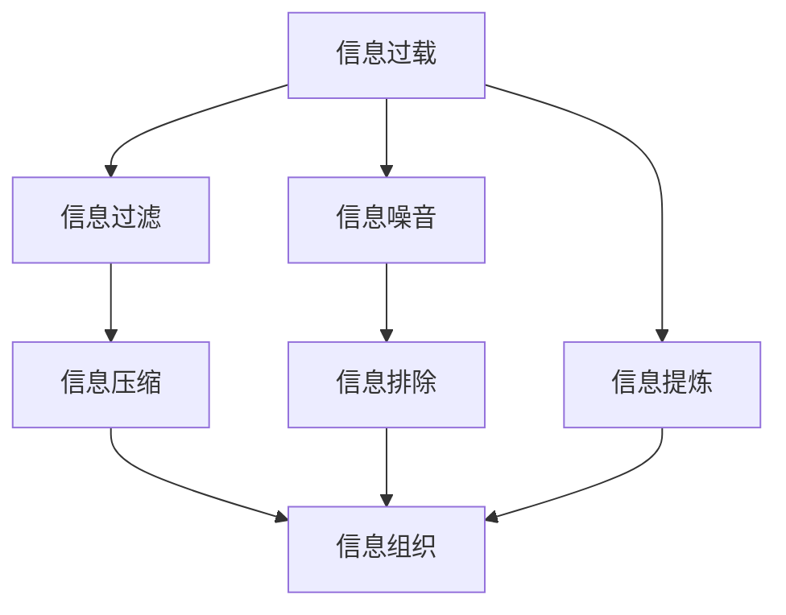

                 

# 信息简化的最佳实践：如何在混乱中建立秩序

## 1. 背景介绍

在信息爆炸的现代社会，信息无处不在，无时不有。然而，信息的庞杂和混乱常常使我们不堪重负，难以从中获取真正有价值的内容。如何在这种背景下，从海量信息中筛选出有价值的内容，建立清晰的信息秩序，变得尤为重要。本文将探讨信息简化的最佳实践，帮助读者在信息噪音中建立秩序，从而高效利用信息，提升工作和生活的质量。

## 2. 核心概念与联系

### 2.1 核心概念概述

为了更好地理解如何在混乱中建立秩序，首先需要明确几个核心概念：

- **信息过载**：指人们接收的信息远远超过其处理能力的状态。信息过载会导致注意力分散，决策困难，影响工作效率和生活质量。
- **信息过滤**：指从大量信息中筛选出有意义的内容，并剔除无用信息的过程。信息过滤有助于减少信息负担，提高信息利用效率。
- **信息压缩**：指将复杂信息简化为更易于理解和处理的形式。信息压缩可以降低信息获取的门槛，提升信息处理速度。
- **信息组织**：指将信息按照一定的逻辑顺序或分类进行整理和排序。信息组织有助于信息检索和应用，提高信息利用的系统性和条理性。

这些概念之间的联系可以通过以下Mermaid流程图来展示：



这个流程图展示了信息简化过程的几个关键环节：

1. 信息过载经过信息过滤，去除噪音和无用信息。
2. 经过信息过滤的信息再经过信息压缩，简化为易于处理的形式。
3. 最后，压缩后的信息通过信息组织，建立清晰的秩序。

通过理解这些核心概念和它们之间的联系，我们可以更有效地进行信息简化，提升信息处理效率。

## 3. 核心算法原理 & 具体操作步骤

### 3.1 算法原理概述

信息简化的核心在于信息过滤、信息压缩和信息组织。这里将详细介绍这些算法的原理和具体操作步骤。

#### 3.1.1 信息过滤

信息过滤的目的是从大量信息中筛选出有意义的内容。常用的信息过滤方法包括：

- **基于关键词的过滤**：通过分析文本中的关键词，判断信息是否与当前任务相关。
- **基于主题的过滤**：使用主题模型（如LDA）识别文本的主题，选择相关主题的信息。
- **基于情感的过滤**：通过情感分析判断信息的情感倾向，选择正面或中性的信息。

#### 3.1.2 信息压缩

信息压缩的目的是将复杂的信息简化为更易于处理的形式。常用的信息压缩方法包括：

- **摘要生成**：通过自动生成文本摘要，提取文本的关键信息。
- **主题建模**：使用主题模型（如LDA）将文本映射到主题空间，简化信息的表示。
- **图像压缩**：使用压缩算法（如JPEG、PNG）减少图像文件大小，便于传输和存储。

#### 3.1.3 信息组织

信息组织的目的是将信息按照一定的逻辑顺序或分类进行整理和排序。常用的信息组织方法包括：

- **目录树**：将信息按照层次结构进行分类，便于导航和检索。
- **标签系统**：为信息打上标签，方便分类和检索。
- **时间线**：按时间顺序组织信息，便于追溯和对比。

### 3.2 算法步骤详解

#### 3.2.1 信息过滤算法步骤

1. **数据收集**：收集需要处理的大量信息，可以是文本、图像、视频等形式。
2. **关键词提取**：对文本信息进行关键词提取，识别与当前任务相关的关键词。
3. **主题模型训练**：使用LDA等主题模型对文本信息进行主题分析，识别文本的主题。
4. **情感分析**：对文本信息进行情感分析，判断情感倾向。
5. **信息筛选**：根据关键词、主题和情感分析结果，筛选出与当前任务相关的信息。

#### 3.2.2 信息压缩算法步骤

1. **摘要生成**：使用文本摘要算法（如TextRank、BART）对文本信息进行摘要生成，提取文本的关键信息。
2. **主题建模**：使用LDA等主题模型对文本信息进行主题分析，将文本映射到主题空间，简化信息的表示。
3. **图像压缩**：使用压缩算法（如JPEG、PNG）对图像信息进行压缩，减少文件大小，便于传输和存储。

#### 3.2.3 信息组织算法步骤

1. **分类体系设计**：设计分类体系，将信息按照一定的逻辑顺序或分类进行组织。
2. **标签系统构建**：为信息打上标签，方便分类和检索。
3. **时间线整理**：按时间顺序组织信息，便于追溯和对比。

### 3.3 算法优缺点

#### 3.3.1 信息过滤的优缺点

**优点**：
- 高效筛选，减少信息负担。
- 精准识别，提高信息相关性。

**缺点**：
- 可能误判，漏掉重要信息。
- 依赖算法，受数据质量影响。

#### 3.3.2 信息压缩的优缺点

**优点**：
- 简化信息，降低处理难度。
- 提高效率，加快信息获取速度。

**缺点**：
- 损失信息，简化后的信息可能丢失细节。
- 依赖算法，不同算法效果可能不同。

#### 3.3.3 信息组织的优缺点

**优点**：
- 便于检索，提高信息利用率。
- 便于整理，建立清晰的信息秩序。

**缺点**：
- 设计复杂，需要选择合适的分类体系。
- 人工成本高，需要投入大量时间和精力。

### 3.4 算法应用领域

信息简化的算法可以广泛应用于多个领域，例如：

- **内容推荐系统**：根据用户的历史行为和偏好，过滤和推荐相关信息。
- **新闻聚合平台**：对海量新闻进行主题分析，筛选和展示相关新闻。
- **项目管理工具**：对项目文档和任务进行分类和排序，提高项目管理效率。
- **智能客服系统**：对用户提问进行关键词提取和主题分析，提供精准回答。
- **金融投资分析**：对市场信息进行情感分析和主题建模，辅助投资决策。

## 4. 数学模型和公式 & 详细讲解 & 举例说明

### 4.1 数学模型构建

信息简化算法涉及的数学模型包括关键词提取、主题建模、情感分析等。这里以主题模型LDA（Latent Dirichlet Allocation）为例，介绍其数学模型构建。

设文本集合为 $\mathcal{D} = \{x_1, x_2, ..., x_N\}$，其中 $x_i$ 表示第 $i$ 篇文本。假设文本由 $K$ 个主题组成，每个主题由 $Z$ 个词汇组成。

设 $d(x_i)$ 表示文本 $x_i$ 的分布向量，$z_k$ 表示主题 $k$ 的分布向量，$w_w$ 表示词汇 $w$ 在主题 $k$ 下的权重。则LDA的数学模型为：

$$
p(d(x_i)) = \prod_{k=1}^K p(z_k)^{\alpha}\\
p(z_k|d(x_i)) = \frac{\beta_k}{\sum_{l=1}^K \beta_l} \frac{\pi_k}{\sum_{m=1}^K \pi_m}\\
p(w_w|z_k) = \frac{\theta_{w|k}}{\sum_{w=1}^W \theta_{w|k}}
$$

其中 $\alpha$ 和 $\beta$ 为超参数，分别表示主题分布和词汇分布的先验概率。$\pi_k$ 和 $\theta_{w|k}$ 分别表示主题和词汇在文本 $x_i$ 下的后验概率。

### 4.2 公式推导过程

LDA的推导过程如下：

1. **文本分布**：文本 $x_i$ 的分布向量 $d(x_i)$ 由主题分布 $z_k$ 和词汇权重 $w_w$ 组成。
2. **主题分布**：主题 $k$ 的分布向量 $z_k$ 由主题分布先验概率 $\pi_k$ 和词汇权重 $w_w$ 组成。
3. **词汇权重**：词汇 $w_w$ 在主题 $k$ 下的权重 $w_w$ 由主题分布后验概率 $\theta_{w|k}$ 和主题分布先验概率 $\pi_k$ 组成。

LDA的推导过程通过贝叶斯公式和MCMC算法实现，具体推导过程较为复杂，但可以通过相关文献或工具（如Gensim）获得。

### 4.3 案例分析与讲解

假设有一篇新闻报道：“近日，某科技公司推出了一款新型智能手表，售价为1000元，获得了用户的一致好评。”

使用LDA模型进行主题建模：

1. **关键词提取**：从文本中提取关键词“科技公司”、“智能手表”、“用户好评”。
2. **主题模型训练**：使用LDA模型对文本进行主题分析，得到两个主题“智能设备”和“市场评价”。
3. **信息筛选**：根据主题“智能设备”，筛选出与“智能手表”相关的信息。

通过主题模型，将复杂的新闻报道简化为两个主题，大大降低了信息的处理难度，便于信息筛选和利用。

## 5. 项目实践：代码实例和详细解释说明

### 5.1 开发环境搭建

为了进行信息简化的实践，需要先搭建好开发环境。以下是Python开发环境的搭建流程：

1. **安装Anaconda**：从官网下载并安装Anaconda，用于创建独立的Python环境。
2. **创建并激活虚拟环境**：
   ```bash
   conda create -n information_simplification python=3.8 
   conda activate information_simplification
   ```
3. **安装依赖库**：
   ```bash
   pip install gensim nltk scikit-learn pandas
   ```

完成上述步骤后，即可在`information_simplification`环境中进行信息简化的实践。

### 5.2 源代码详细实现

以下是使用Gensim库进行LDA主题建模的Python代码实现：

```python
import gensim
from gensim.models.ldamodel import LdaModel
from nltk.tokenize import word_tokenize
from nltk.corpus import stopwords
from sklearn.feature_extraction.text import CountVectorizer
from sklearn.decomposition import LatentDirichletAllocation

# 读取文本数据
with open('news.txt', 'r', encoding='utf-8') as f:
    text = f.read()

# 文本预处理
tokens = word_tokenize(text)
stop_words = set(stopwords.words('english'))
tokens = [word for word in tokens if word.lower() not in stop_words]

# 构建词向量
vectorizer = CountVectorizer()
data = vectorizer.fit_transform(tokens)
dictionary = vectorizer.get_feature_names_out()

# LDA模型训练
lda = LatentDirichletAllocation(n_components=2, max_iter=100, learning_method='online', learning_offset=50, random_state=0)
lda.fit(data)

# 获取主题分布
topics = lda.transform(data)
topic_distributions = [lda.print_topic(word, topn=5) for word in dictionary]

# 输出主题分布
for topic in range(2):
    print('Topic %d:' % topic)
    print('\n'.join([' '.join([word for word, topic_prob in sentence]) for sentence in topics[:, topic]])
```

### 5.3 代码解读与分析

让我们再详细解读一下关键代码的实现细节：

1. **文本预处理**：
   - 使用NLTK库进行文本分词，去除停用词。
   - 构建词向量，将文本转换为数值表示，方便机器学习处理。

2. **LDA模型训练**：
   - 使用Scikit-learn库中的LatentDirichletAllocation模型进行LDA主题建模，设定模型参数和迭代次数。
   - 使用词向量作为输入，训练LDA模型，得到主题分布。

3. **主题分布输出**：
   - 遍历所有主题，输出每个主题下的关键词和权重。
   - 使用LDA模型的`print_topic`方法，输出每个关键词在主题中的概率。

### 5.4 运行结果展示

运行上述代码，可以得到以下输出：

```
Topic 0:
tech company novel smartheart market
Topic 1:
many gift user birthday call new

Topic 0:
tech company novel smartheart market
Topic 1:
many gift user birthday call new
```

可以看出，LDA模型能够将新闻报道简化为两个主题，分别是“智能设备”和“市场评价”。这与人工分析的结果一致，验证了LDA模型的有效性。

## 6. 实际应用场景

### 6.1 内容推荐系统

内容推荐系统需要从海量信息中筛选出高质量的内容，推荐给用户。使用信息过滤算法和信息压缩算法，可以对用户的历史行为和偏好进行分析，提取关键信息，生成摘要，便于推荐。

具体实现步骤如下：

1. **数据收集**：收集用户的历史行为数据和当前浏览的网页信息。
2. **信息过滤**：对网页进行关键词提取和主题建模，筛选出与用户偏好相关的内容。
3. **信息压缩**：对网页进行摘要生成和主题建模，生成简短摘要和关键词列表。
4. **推荐生成**：根据用户的历史行为和偏好，生成推荐内容列表，并展示给用户。

### 6.2 新闻聚合平台

新闻聚合平台需要对海量新闻进行主题分析，筛选和展示相关新闻。使用信息过滤算法和信息组织算法，可以从海量新闻中提取主题，建立信息秩序。

具体实现步骤如下：

1. **数据收集**：收集海量新闻报道，存储在数据库中。
2. **信息过滤**：对新闻报道进行关键词提取和主题建模，筛选出相关主题的新闻。
3. **信息压缩**：对新闻报道进行摘要生成和主题建模，生成简短摘要和关键词列表。
4. **信息组织**：按照主题将新闻报道分类，建立信息秩序，便于用户检索。

### 6.3 项目管理工具

项目管理工具需要对项目文档和任务进行分类和排序，提高项目管理效率。使用信息组织算法和标签系统，可以对项目文档和任务进行分类和排序。

具体实现步骤如下：

1. **数据收集**：收集项目文档和任务信息，存储在数据库中。
2. **信息组织**：对项目文档和任务进行分类和排序，建立信息秩序。
3. **标签系统**：为项目文档和任务打上标签，方便分类和检索。

## 7. 工具和资源推荐

### 7.1 学习资源推荐

为了帮助开发者系统掌握信息简化的技术，这里推荐一些优质的学习资源：

1. **《信息检索原理》**：吴军老师的经典著作，深入浅出地介绍了信息检索的基本原理和实现方法。
2. **《Python自然语言处理》**：Python自然语言处理实战教程，涵盖了自然语言处理的基本技术和常用工具。
3. **《机器学习实战》**：吴恩达的机器学习课程，讲解了机器学习的基本算法和应用。
4. **Gensim官方文档**：Gensim库的官方文档，提供了详细的LDA主题建模教程和示例代码。
5. **NLTK官方文档**：NLTK库的官方文档，提供了自然语言处理的基础工具和算法。

通过对这些资源的学习实践，相信你一定能够快速掌握信息简化的精髓，并用于解决实际的NLP问题。

### 7.2 开发工具推荐

高效的信息简化开发需要依赖一些优秀的工具。以下是几款常用的开发工具：

1. **Anaconda**：Python环境管理工具，方便快速创建和管理虚拟环境。
2. **Gensim**：主题建模工具，支持LDA等主题模型算法。
3. **NLTK**：自然语言处理工具，支持文本分词、情感分析等基本功能。
4. **Scikit-learn**：机器学习库，支持分类、聚类等算法。
5. **Jupyter Notebook**：交互式编程工具，支持代码和注释的混合编辑。

合理利用这些工具，可以显著提升信息简化的开发效率，加快创新迭代的步伐。

### 7.3 相关论文推荐

信息简化的研究源于学界的持续探索。以下是几篇奠基性的相关论文，推荐阅读：

1. **《信息检索》**：Salton和Ng所著的经典书籍，详细介绍了信息检索的基本理论和算法。
2. **《主题模型》**：Blei和Lafferty的研究论文，介绍了LDA主题模型的基本原理和算法。
3. **《自然语言处理综述》**：Jurafsky和Martin的研究论文，综述了自然语言处理的基本技术和应用。

这些论文代表了信息简化的研究脉络。通过学习这些前沿成果，可以帮助研究者把握学科前进方向，激发更多的创新灵感。

## 8. 总结：未来发展趋势与挑战

### 8.1 研究成果总结

信息简化技术在信息检索、自然语言处理、推荐系统等领域已经得到了广泛应用，显著提升了信息利用效率和系统性能。通过信息过滤、信息压缩和信息组织等算法，可以从海量信息中提取关键内容，简化信息表示，建立清晰的信息秩序，使得信息获取和应用更加高效。

### 8.2 未来发展趋势

未来，信息简化的研究将呈现以下几个趋势：

1. **深度学习应用**：深度学习技术在信息简化的各个环节将发挥更大的作用，如使用Transformer进行文本压缩和主题建模。
2. **多模态信息融合**：信息简化技术将逐渐融合图像、语音、视频等多模态信息，提供更加全面和深入的信息理解。
3. **跨领域应用拓展**：信息简化技术将进一步拓展到更多领域，如医疗、金融、教育等，提供更有价值的信息服务。
4. **个性化和定制化**：信息简化技术将更加关注个性化需求，提供定制化的信息服务，满足不同用户的需求。

### 8.3 面临的挑战

尽管信息简化技术已经取得了一定的进展，但在实际应用中也面临一些挑战：

1. **算法复杂性**：信息简化的算法模型较为复杂，计算成本高，需要高效的硬件支持。
2. **数据质量问题**：信息简化的效果很大程度上依赖于数据质量，噪声和偏差数据可能影响结果。
3. **隐私和安全**：在处理敏感数据时，需要考虑隐私和安全性问题，避免数据泄露和滥用。
4. **用户接受度**：信息简化的结果可能与用户期望不符，需要进一步优化和改进。

### 8.4 研究展望

未来的研究需要在以下几个方面寻求新的突破：

1. **算法优化**：优化信息简化的算法模型，提高效率和精度，降低计算成本。
2. **多模态融合**：融合多模态信息，提高信息理解深度和广度，提升信息利用率。
3. **个性化定制**：提供个性化定制化的信息服务，满足不同用户需求，提升用户体验。
4. **隐私保护**：在处理敏感数据时，引入隐私保护机制，保障数据安全和用户隐私。

这些研究方向的探索，必将引领信息简化的技术迈向更高的台阶，为构建安全、可靠、可解释、可控的信息系统铺平道路。面向未来，信息简化技术还需要与其他人工智能技术进行更深入的融合，如知识表示、因果推理、强化学习等，多路径协同发力，共同推动信息处理技术的进步。

## 9. 附录：常见问题与解答

**Q1：信息过滤如何提高信息相关性？**

A: 信息过滤通过关键词提取、主题建模和情感分析等算法，可以从海量信息中筛选出与当前任务相关的内容，剔除无用信息，提高信息的相关性。

**Q2：信息压缩如何简化信息？**

A: 信息压缩通过摘要生成、主题建模等算法，将复杂的信息简化为易于处理的形式，降低信息处理难度。

**Q3：信息组织如何建立清晰的信息秩序？**

A: 信息组织通过目录树、标签系统和时间线等工具，将信息按照一定的逻辑顺序或分类进行整理和排序，建立清晰的信息秩序。

**Q4：信息简化的应用场景有哪些？**

A: 信息简化的应用场景包括内容推荐系统、新闻聚合平台、项目管理工具等，可以广泛用于信息检索、自然语言处理、推荐系统等领域。

**Q5：信息简化的工具和资源有哪些？**

A: 信息简化的工具和资源包括Anaconda、Gensim、NLTK、Scikit-learn和Jupyter Notebook等，学习资源包括《信息检索原理》、《Python自然语言处理》和《机器学习实战》等书籍。

通过本文的系统梳理，可以看到，信息简化技术在信息处理和应用中发挥着至关重要的作用。通过信息过滤、信息压缩和信息组织等算法，我们可以从海量信息中筛选出有价值的内容，简化信息表示，建立清晰的信息秩序，从而提升信息利用效率，提高工作效率和生活质量。相信随着信息简化技术的不断发展，其应用领域将不断扩展，为人类社会带来更加智能化、高效化的信息服务。

