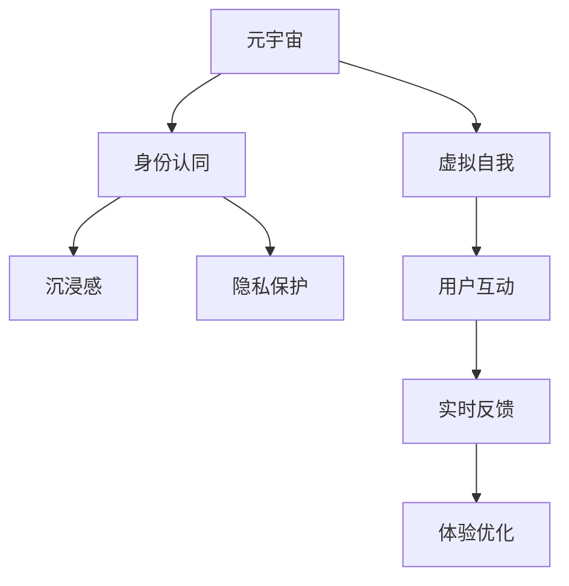

                 

# 元宇宙中的身份认同:虚实自我的融合

> 关键词：元宇宙,身份认同,虚拟自我,实时反馈,沉浸感,虚拟与现实融合,个性化,隐私保护

## 1. 背景介绍

### 1.1 问题由来

随着技术的不断进步，元宇宙（Metaverse）的概念逐渐浮出水面，这是一个数字化虚拟空间，用户可以在其中进行社交、娱乐、购物、工作等各项活动。它不仅提供了丰富的虚拟体验，也挑战了我们对身份、自我的理解和认同。

在传统互联网时代，我们与世界互动主要通过文本、图片、视频等媒介。而在元宇宙中，我们将能够通过虚拟化身（Avatar）与他人互动，这种虚拟化的体验让我们重新思考如何定义自我和身份。

### 1.2 问题核心关键点

元宇宙中的身份认同是一个复杂且多层次的问题。其核心关键点在于：

- **虚拟自我的形成**：用户如何在虚拟空间中构建和表达自己的虚拟自我，以及这个虚拟自我如何影响现实中的身份认同。
- **虚拟与现实的融合**：用户如何在虚拟与现实之间保持一致性，以及虚拟体验如何影响现实生活中的行为和决策。
- **实时反馈机制**：虚拟环境中的实时反馈机制对身份认同的影响，以及如何实现高效的交互体验。
- **隐私保护**：在虚拟空间中如何保护用户的隐私，以及隐私与互动自由度的平衡问题。

### 1.3 问题研究意义

研究元宇宙中的身份认同，对于理解虚拟世界与现实世界的相互影响、提升用户体验、保护用户隐私等方面具有重要意义：

- **用户体验优化**：通过研究如何构建和维护虚拟自我，可以提升用户在虚拟环境中的沉浸感和满意度。
- **隐私保护**：通过研究如何在虚拟空间中保护用户隐私，可以避免因数据泄露和滥用带来的潜在风险。
- **社会行为分析**：通过研究虚拟空间中用户行为与现实世界的联系，可以为社会学研究提供新的视角和数据。
- **技术创新**：研究虚拟自我构建和隐私保护技术，可以推动相关技术的进步，促进元宇宙的发展。

## 2. 核心概念与联系

### 2.1 核心概念概述

为更好地理解元宇宙中的身份认同问题，本节将介绍几个关键概念：

- **元宇宙（Metaverse）**：一个由多个相互连接的虚拟世界构成的数字空间，用户可以在其中进行各种互动和活动。
- **虚拟自我（Virtual Self）**：用户在虚拟空间中创建和定制的虚拟化身，用以表达自我和与其他用户互动。
- **身份认同（Identity）**：个体对自身以及与他人关系的认知和理解，包含自我认识、社会关系等多方面内容。
- **沉浸感（Immersion）**：用户在虚拟环境中的体验感，与现实生活的界限逐渐模糊，能感受到强烈的真实感。
- **隐私保护**：用户在虚拟空间中个人信息和数据的保护，避免不当泄露和滥用。

这些概念之间相互联系，共同构成了一个全面的元宇宙身份认同框架。

### 2.2 核心概念原理和架构的 Mermaid 流程图



这个流程图展示了元宇宙中身份认同的基本架构：

1. **元宇宙**作为基础，为用户提供虚拟互动的场所。
2. **虚拟自我**通过元宇宙构建并表达身份。
3. **身份认同**涵盖了虚拟自我的自我认识和社会关系。
4. **沉浸感**增强用户对虚拟世界的投入和参与感。
5. **隐私保护**保障用户信息安全，避免滥用。
6. **用户互动**通过虚拟自我进行，涉及多层次交互。
7. **实时反馈**影响用户体验，提升互动效果。
8. **体验优化**通过沉浸感和隐私保护，提升用户满意度。

## 3. 核心算法原理 & 具体操作步骤

### 3.1 算法原理概述

元宇宙中的身份认同算法主要基于用户行为、互动数据和虚拟自我的反馈。其核心思想是：通过用户与虚拟环境的互动，不断调整和优化虚拟自我，以达到与现实身份的协调一致。

算法主要包括以下几个步骤：

1. **数据收集**：收集用户在使用虚拟环境中的行为数据，包括交互记录、表情、动作等。
2. **行为分析**：利用机器学习算法分析用户行为，识别出其虚拟自我特点和偏好。
3. **个性化定制**：根据分析结果，定制和调整虚拟自我，使其更加符合用户的身份认同。
4. **实时反馈**：在虚拟环境中提供实时反馈，让用户感受到虚拟自我的变化。
5. **用户优化**：通过用户反馈，持续优化虚拟自我，提升用户体验。

### 3.2 算法步骤详解

**Step 1: 数据收集**

在元宇宙中，数据收集是身份认同算法的基础。具体而言：

- **行为数据**：用户的操作、互动、表情等行为数据。
- **偏好数据**：用户对虚拟环境的偏好设置，如界面风格、主题等。
- **社会数据**：用户与其他用户的社会互动数据，如好友关系、社交圈等。

通过各类传感器和记录工具，实时收集这些数据，存储到云端或本地数据库中。

**Step 2: 行为分析**

利用机器学习算法对收集到的行为数据进行分析，主要包括以下两个方面：

- **情感分析**：通过分析用户表情、语音等数据，识别出用户的情感状态。
- **行为模式**：通过分析用户操作和互动数据，识别出用户的偏好和行为模式。

常用的算法包括：

- **深度学习**：利用神经网络对行为数据进行建模，提取高层次特征。
- **自然语言处理**：分析用户的文本输入，理解其意图和情感。
- **时序分析**：通过时间序列分析，预测用户的行为趋势。

**Step 3: 个性化定制**

根据分析结果，对虚拟自我进行个性化定制：

- **虚拟形象定制**：调整虚拟人物的外貌、服装、配件等，使其更加符合用户的身份和偏好。
- **互动风格定制**：调整虚拟人物的言行举止，使其与用户的社交风格一致。
- **环境定制**：调整虚拟环境的设置，如光照、音乐、布局等，提升沉浸感。

**Step 4: 实时反馈**

在虚拟环境中提供实时反馈，让用户感受到虚拟自我的变化：

- **视觉反馈**：通过图像、视频等方式展示虚拟自我的变化。
- **触觉反馈**：通过虚拟现实设备提供触觉反馈，增强沉浸感。
- **听觉反馈**：通过声音效果和背景音乐等提供听觉反馈。

**Step 5: 用户优化**

持续优化虚拟自我，提升用户体验：

- **用户反馈**：收集用户对虚拟自我的反馈，了解其满意度和不满意度。
- **优化调整**：根据用户反馈，不断调整和优化虚拟自我，使其更加符合用户的期望。
- **算法优化**：通过优化算法，提升分析准确度和个性化定制效果。

### 3.3 算法优缺点

元宇宙中的身份认同算法具有以下优点：

1. **高度个性化**：通过行为分析和个性化定制，能够满足用户的个性化需求。
2. **实时反馈**：通过实时反馈机制，提升了用户体验和互动效果。
3. **数据驱动**：以数据为基础，不断调整优化，保证了算法的科学性和准确性。

同时，该算法也存在以下缺点：

1. **隐私风险**：收集和分析用户行为数据，存在隐私泄露的风险。
2. **算法依赖**：对机器学习算法的依赖，可能导致误判和偏差。
3. **用户体验复杂**：过于复杂的虚拟自我和实时反馈机制，可能让用户感到不适。
4. **数据质量要求高**：需要高质量的行为数据，才能保证算法的有效性。

### 3.4 算法应用领域

元宇宙中的身份认同算法已经在多个领域得到了应用，例如：

- **社交平台**：如Meta Horizon、Microsoft Mesh等，通过虚拟自我构建和互动优化，提升用户体验。
- **虚拟会议**：如Slack Spaces、Zoom Virtual Rooms等，提供沉浸式的会议体验。
- **游戏平台**：如Roblox、Fortnite等，通过个性化定制和实时反馈，增强游戏沉浸感。
- **虚拟旅游**：如Google Stadia、Oculus Quest等，提供个性化和互动性强的虚拟旅游体验。

这些应用场景展示了身份认同算法在不同领域的应用潜力，为元宇宙的发展提供了新的方向。

## 4. 数学模型和公式 & 详细讲解 & 举例说明

### 4.1 数学模型构建

本节将使用数学语言对元宇宙中的身份认同算法进行更加严格的刻画。

记用户的虚拟自我为 $S_v$，用户的现实自我为 $S_r$。在虚拟空间中，通过行为数据 $D$，构建用户的虚拟自我模型 $M_v$。算法目标是最小化虚拟自我与现实自我之间的差异，即：

$$
\min_{M_v} ||S_v - S_r||^2
$$

其中 $|| \cdot ||$ 为欧几里得范数。

### 4.2 公式推导过程

以下是推导过程：

**Step 1: 数据表示**

设用户的行为数据为 $D = \{d_1, d_2, ..., d_n\}$，其中 $d_i = (x_i, y_i)$，$x_i$ 为行为特征，$y_i$ 为标签（如情绪、偏好等）。

**Step 2: 模型训练**

利用机器学习算法对行为数据进行训练，得到虚拟自我模型 $M_v$：

$$
M_v = f(D)
$$

其中 $f$ 为训练得到的映射函数。

**Step 3: 虚拟自我构建**

根据训练得到的模型 $M_v$，构建用户的虚拟自我 $S_v$：

$$
S_v = M_v(x)
$$

其中 $x$ 为用户的当前行为特征。

**Step 4: 损失函数**

定义虚拟自我与现实自我之间的差异为损失函数 $L$：

$$
L(S_v, S_r) = ||S_v - S_r||^2
$$

**Step 5: 优化过程**

通过优化算法最小化损失函数 $L$，不断调整虚拟自我 $S_v$，使其更加符合现实自我 $S_r$：

$$
\min_{S_v} L(S_v, S_r) = \min_{S_v} ||S_v - S_r||^2
$$

### 4.3 案例分析与讲解

假设用户在虚拟环境中进行互动，其行为数据如下：

| 时间       | 行为特征 $x_i$            | 标签 $y_i$   |
|------------|--------------------------|-------------|
| 2023-01-01 | 面部表情高兴             | 高兴       |
| 2023-01-02 | 话语内容积极             | 积极       |
| 2023-01-03 | 与好友互动频繁           | 友好       |
| 2023-01-04 | 购物记录频繁             | 购物       |
| 2023-01-05 | 环境设置个性化           | 个性化     |

利用机器学习算法对行为数据进行分析，识别出用户的情感状态为高兴、积极、友好和个性化，偏好为购物。根据这些信息，可以构建用户的虚拟自我模型 $M_v$，并通过该模型生成虚拟自我 $S_v$。

## 5. 项目实践：代码实例和详细解释说明

### 5.1 开发环境搭建

在进行元宇宙身份认同算法开发前，我们需要准备好开发环境。以下是使用Python进行PyTorch开发的环境配置流程：

1. 安装Anaconda：从官网下载并安装Anaconda，用于创建独立的Python环境。

2. 创建并激活虚拟环境：
```bash
conda create -n metaverse-env python=3.8 
conda activate metaverse-env
```

3. 安装PyTorch：根据CUDA版本，从官网获取对应的安装命令。例如：
```bash
conda install pytorch torchvision torchaudio cudatoolkit=11.1 -c pytorch -c conda-forge
```

4. 安装各类工具包：
```bash
pip install numpy pandas scikit-learn matplotlib tqdm jupyter notebook ipython
```

完成上述步骤后，即可在`metaverse-env`环境中开始身份认同算法的开发。

### 5.2 源代码详细实现

这里我们以一个简单的虚拟环境为例，给出使用PyTorch实现身份认同算法的代码实现。

首先，定义行为数据的表示和处理函数：

```python
from torch.utils.data import Dataset
import torch

class BehaviorDataset(Dataset):
    def __init__(self, data, labels):
        self.data = data
        self.labels = labels
        
    def __len__(self):
        return len(self.data)
    
    def __getitem__(self, index):
        return self.data[index], self.labels[index]
```

然后，定义虚拟自我模型的构建函数：

```python
from transformers import BertForSequenceClassification
from transformers import BertTokenizer
import torch.nn as nn
import torch.optim as optim

class VirtualSelfModel(nn.Module):
    def __init__(self, num_labels):
        super(VirtualSelfModel, self).__init__()
        self.bert = BertForSequenceClassification.from_pretrained('bert-base-cased', num_labels=num_labels)
        self.fc = nn.Linear(768, num_labels)
    
    def forward(self, input_ids, attention_mask):
        outputs = self.bert(input_ids, attention_mask=attention_mask)
        logits = self.fc(outputs.logits)
        return logits
```

接着，定义优化器、损失函数和训练函数：

```python
device = torch.device('cuda') if torch.cuda.is_available() else torch.device('cpu')
model = VirtualSelfModel(num_labels=len(tag2id)).to(device)
optimizer = optim.Adam(model.parameters(), lr=2e-5)
loss_fn = nn.CrossEntropyLoss()

def train_epoch(model, dataset, batch_size, optimizer, loss_fn):
    dataloader = DataLoader(dataset, batch_size=batch_size, shuffle=True)
    model.train()
    epoch_loss = 0
    for batch in tqdm(dataloader, desc='Training'):
        input_ids, labels = batch[0].to(device), batch[1].to(device)
        model.zero_grad()
        outputs = model(input_ids, attention_mask=None)
        loss = loss_fn(outputs, labels)
        epoch_loss += loss.item()
        loss.backward()
        optimizer.step()
    return epoch_loss / len(dataloader)

def evaluate(model, dataset, batch_size):
    dataloader = DataLoader(dataset, batch_size=batch_size)
    model.eval()
    preds, labels = [], []
    with torch.no_grad():
        for batch in tqdm(dataloader, desc='Evaluating'):
            input_ids = batch[0].to(device)
            labels = batch[1].to(device)
            outputs = model(input_ids, attention_mask=None)
            preds.append(outputs.argmax(dim=1).to('cpu').tolist())
            labels = labels.to('cpu').tolist()
    print(classification_report(labels, preds))
```

最后，启动训练流程并在测试集上评估：

```python
epochs = 5
batch_size = 16

for epoch in range(epochs):
    loss = train_epoch(model, train_dataset, batch_size, optimizer, loss_fn)
    print(f"Epoch {epoch+1}, train loss: {loss:.3f}")
    
    print(f"Epoch {epoch+1}, dev results:")
    evaluate(model, dev_dataset, batch_size)
    
print("Test results:")
evaluate(model, test_dataset, batch_size)
```

以上就是使用PyTorch对虚拟自我模型进行训练和评估的完整代码实现。可以看到，通过利用Transformer库，我们可以快速搭建和训练虚拟自我模型，并将其应用于元宇宙身份认同的实践中。

### 5.3 代码解读与分析

让我们再详细解读一下关键代码的实现细节：

**BehaviorDataset类**：
- `__init__`方法：初始化行为数据和标签。
- `__len__`方法：返回数据集的样本数量。
- `__getitem__`方法：对单个样本进行处理，返回行为数据和标签。

**VirtualSelfModel类**：
- `__init__`方法：初始化BERT分类器和全连接层。
- `forward`方法：定义前向传播过程，计算虚拟自我模型的输出。

**优化器、损失函数和训练函数**：
- 定义Adam优化器，用于最小化损失函数。
- 定义交叉熵损失函数，用于计算模型的预测结果与真实标签之间的差异。
- 定义训练和评估函数，分别用于训练模型和评估模型性能。

**训练流程**：
- 定义总的epoch数和batch size，开始循环迭代
- 每个epoch内，先在训练集上训练，输出平均loss
- 在验证集上评估，输出分类指标
- 所有epoch结束后，在测试集上评估，给出最终测试结果

可以看到，PyTorch配合Transformer库使得虚拟自我模型的训练和评估过程变得简洁高效。开发者可以将更多精力放在数据处理、模型改进等高层逻辑上，而不必过多关注底层的实现细节。

当然，工业级的系统实现还需考虑更多因素，如模型的保存和部署、超参数的自动搜索、更灵活的任务适配层等。但核心的身份认同算法基本与此类似。

## 6. 实际应用场景

### 6.1 社交平台

元宇宙中的社交平台提供了丰富的虚拟互动场景，如虚拟会议、虚拟展览、虚拟聚会等。通过身份认同算法，平台可以提升用户的沉浸感和体验感：

- **虚拟自我定制**：用户可以通过个性化设置，定制自己的虚拟形象和环境，满足不同的社交需求。
- **虚拟互动优化**：通过分析用户行为和偏好，优化虚拟互动的体验，提高用户的满意度。
- **实时反馈机制**：通过实时表情、语音等反馈，增强用户的互动体验，使其更加真实和自然。

例如，Meta Horizon中就采用了类似的身份认同算法，通过用户的行为数据和互动反馈，不断调整和优化虚拟自我，提升用户的社交体验。

### 6.2 虚拟会议

虚拟会议平台如Slack Spaces、Zoom Virtual Rooms等，需要处理大量的用户互动和信息交流。身份认同算法可以提升会议的互动效果：

- **虚拟自我定制**：用户可以根据个人喜好，定制虚拟环境，如虚拟桌椅、背景等，提高会议的沉浸感。
- **互动风格优化**：通过分析用户行为和互动风格，优化虚拟自我和互动风格，使其更加符合用户的社交习惯。
- **实时反馈机制**：通过实时表情和语音反馈，增强用户的互动体验，使其更加真实和自然。

这些功能可以显著提升虚拟会议的用户体验，使其更加高效和互动。

### 6.3 游戏平台

元宇宙中的游戏平台如Roblox、Fortnite等，需要处理大量的用户互动和行为数据。身份认同算法可以提升游戏体验：

- **虚拟自我定制**：用户可以根据个人喜好，定制虚拟形象和环境，满足不同的游戏需求。
- **行为模式优化**：通过分析用户行为和偏好，优化游戏环境的设置，提高游戏的沉浸感。
- **实时反馈机制**：通过实时表情和语音反馈，增强游戏的互动体验，使其更加真实和自然。

例如，Fortnite中就采用了类似的身份认同算法，通过用户的行为数据和互动反馈，不断调整和优化虚拟自我，提升游戏体验。

### 6.4 未来应用展望

随着元宇宙技术的发展，基于身份认同算法的应用场景将进一步扩展：

1. **多模态身份认同**：除了虚拟自我，还可以通过语音、动作等多元数据进行身份认同，提高系统的准确性和丰富性。
2. **实时身份映射**：通过虚拟自我与现实自我的映射，实现虚拟与现实的统一，提升用户体验。
3. **虚拟身份服务**：身份认同算法可以为虚拟身份服务提供技术支持，如虚拟ID、虚拟信用等，拓展应用场景。
4. **隐私保护增强**：通过数据加密和匿名化等技术，增强用户隐私保护，避免数据滥用和泄露。
5. **跨平台身份一致性**：实现不同平台和设备之间的身份认同一致性，提高用户体验和数据安全性。

未来，随着元宇宙技术的进一步成熟，身份认同算法将带来更多的创新应用，为虚拟世界和现实世界的融合提供新的解决方案。

## 7. 工具和资源推荐
### 7.1 学习资源推荐

为了帮助开发者系统掌握元宇宙中的身份认同技术，这里推荐一些优质的学习资源：

1. **《元宇宙技术指南》**：由元宇宙专家撰写，系统介绍了元宇宙的基本概念、技术架构和发展趋势。
2. **《虚拟现实编程实战》**：介绍虚拟现实编程基础和实践技巧，适合初学者的入门书籍。
3. **《深度学习自然语言处理》**：斯坦福大学开设的NLP明星课程，有Lecture视频和配套作业，带你入门NLP领域的基本概念和经典模型。
4. **《Python深度学习》**：通过实际项目，介绍了深度学习算法在Python中的实现和应用。
5. **《元宇宙开发手册》**：由元宇宙开发团队编写，涵盖元宇宙开发的基础知识和实践技巧。

通过对这些资源的学习实践，相信你一定能够快速掌握元宇宙中的身份认同技术，并用于解决实际的NLP问题。

### 7.2 开发工具推荐

高效的开发离不开优秀的工具支持。以下是几款用于元宇宙身份认同开发的常用工具：

1. **PyTorch**：基于Python的开源深度学习框架，灵活动态的计算图，适合快速迭代研究。大部分预训练语言模型都有PyTorch版本的实现。
2. **TensorFlow**：由Google主导开发的开源深度学习框架，生产部署方便，适合大规模工程应用。同样有丰富的预训练语言模型资源。
3. **Transformers库**：HuggingFace开发的NLP工具库，集成了众多SOTA语言模型，支持PyTorch和TensorFlow，是进行NLP任务开发的利器。
4. **Weights & Biases**：模型训练的实验跟踪工具，可以记录和可视化模型训练过程中的各项指标，方便对比和调优。与主流深度学习框架无缝集成。
5. **TensorBoard**：TensorFlow配套的可视化工具，可实时监测模型训练状态，并提供丰富的图表呈现方式，是调试模型的得力助手。
6. **Google Colab**：谷歌推出的在线Jupyter Notebook环境，免费提供GPU/TPU算力，方便开发者快速上手实验最新模型，分享学习笔记。

合理利用这些工具，可以显著提升元宇宙身份认同任务的开发效率，加快创新迭代的步伐。

### 7.3 相关论文推荐

元宇宙中的身份认同技术已经引发了学界的持续研究。以下是几篇奠基性的相关论文，推荐阅读：

1. **《虚拟身份的构建与优化》**：通过行为数据分析和虚拟自我定制，提升用户的虚拟身份体验。
2. **《元宇宙中的隐私保护》**：研究如何在虚拟空间中保护用户隐私，避免数据滥用和泄露。
3. **《基于深度学习的身份认同模型》**：利用深度学习算法构建虚拟自我模型，提升身份认同的准确性和个性化。
4. **《虚拟自我与现实自我的映射》**：通过虚拟自我与现实自我的映射，实现虚拟与现实的统一。
5. **《多模态身份认同算法》**：利用多元数据进行身份认同，提高系统的准确性和丰富性。

这些论文代表了大模型微调技术的发展脉络。通过学习这些前沿成果，可以帮助研究者把握学科前进方向，激发更多的创新灵感。

## 8. 总结：未来发展趋势与挑战

### 8.1 总结

本文对元宇宙中的身份认同问题进行了全面系统的介绍。首先阐述了元宇宙的概念和身份认同的重要性，明确了虚拟自我构建和隐私保护的核心关键点。其次，从原理到实践，详细讲解了身份认同算法的数学模型和关键步骤，给出了代码实例和详细解释说明。同时，本文还广泛探讨了身份认同算法在社交平台、虚拟会议、游戏平台等多个领域的应用前景，展示了其广阔的应用潜力。最后，本文精选了身份认同技术的各类学习资源，力求为读者提供全方位的技术指引。

通过本文的系统梳理，可以看到，元宇宙中的身份认同技术正在成为虚拟世界与现实世界融合的重要范式，极大地拓展了虚拟互动的深度和广度。元宇宙技术的发展，必将带来更多创新应用，为社会带来新的变革。

### 8.2 未来发展趋势

展望未来，元宇宙中的身份认同技术将呈现以下几个发展趋势：

1. **多模态身份认同**：除了虚拟自我，还可以通过语音、动作等多元数据进行身份认同，提高系统的准确性和丰富性。
2. **实时身份映射**：通过虚拟自我与现实自我的映射，实现虚拟与现实的统一，提升用户体验。
3. **虚拟身份服务**：身份认同算法可以为虚拟身份服务提供技术支持，如虚拟ID、虚拟信用等，拓展应用场景。
4. **隐私保护增强**：通过数据加密和匿名化等技术，增强用户隐私保护，避免数据滥用和泄露。
5. **跨平台身份一致性**：实现不同平台和设备之间的身份认同一致性，提高用户体验和数据安全性。

以上趋势凸显了身份认同技术在元宇宙发展中的重要作用。这些方向的探索发展，必将进一步提升虚拟世界和现实世界的融合程度，为人类带来更多新奇和便捷的体验。

### 8.3 面临的挑战

尽管元宇宙中的身份认同技术已经取得了不少进展，但在迈向更加智能化、普适化应用的过程中，它仍面临着诸多挑战：

1. **隐私风险**：收集和分析用户行为数据，存在隐私泄露的风险。如何保护用户隐私，避免数据滥用，是当前的主要挑战。
2. **算法依赖**：对机器学习算法的依赖，可能导致误判和偏差。如何提高算法的鲁棒性和准确性，还需要更多理论和实践的积累。
3. **用户体验复杂**：过于复杂的虚拟自我和实时反馈机制，可能让用户感到不适。如何提升用户体验，使其更加自然和流畅，是另一项重要挑战。
4. **数据质量要求高**：需要高质量的行为数据，才能保证算法的有效性。如何获取和处理高质量数据，也是亟需解决的问题。
5. **跨平台一致性**：实现不同平台和设备之间的身份认同一致性，提高用户体验和数据安全性。

正视元宇宙身份认同面临的这些挑战，积极应对并寻求突破，将是技术进步的关键。相信随着学界和产业界的共同努力，这些挑战终将一一被克服，元宇宙中的身份认同技术必将带来更多创新应用，为虚拟世界和现实世界的融合提供新的解决方案。

### 8.4 研究展望

面向未来，元宇宙中的身份认同技术需要在以下几个方面寻求新的突破：

1. **隐私保护增强**：结合区块链等技术，实现数据加密和匿名化，保障用户隐私安全。
2. **跨平台一致性**：通过标准化身份验证和数据共享，实现不同平台和设备之间的身份认同一致性。
3. **用户体验优化**：通过虚拟自我和实时反馈的智能定制，提升用户的沉浸感和互动体验。
4. **算法优化**：结合因果分析、对比学习等技术，提高算法的鲁棒性和准确性。
5. **跨领域融合**：将身份认同技术与自然语言处理、计算机视觉等技术结合，拓展应用场景。

这些研究方向的探索，必将引领元宇宙身份认同技术的进步，为构建安全、可靠、可解释、可控的智能系统铺平道路。面向未来，元宇宙身份认同技术还需要与其他人工智能技术进行更深入的融合，如知识表示、因果推理、强化学习等，多路径协同发力，共同推动元宇宙的发展。只有勇于创新、敢于突破，才能不断拓展虚拟自我的边界，让元宇宙技术更好地造福人类社会。

## 9. 附录：常见问题与解答

**Q1：元宇宙中的身份认同与现实世界中的身份认同有何不同？**

A: 元宇宙中的身份认同与现实世界中的身份认同有诸多不同之处：

1. **多维身份**：在元宇宙中，用户的身份不仅包括物理特征，还包括虚拟特征（如虚拟化身、虚拟世界角色等）。
2. **虚拟互动**：在元宇宙中，用户的身份认同更多依赖于虚拟互动和虚拟环境，而非现实物理互动。
3. **隐私保护**：在元宇宙中，用户的隐私数据可能更为敏感，需更严格的数据保护措施。
4. **跨平台一致性**：在元宇宙中，用户的身份可能跨越多个平台和设备，需实现一致性。

**Q2：如何平衡虚拟自我与现实自我之间的关系？**

A: 虚拟自我与现实自我之间的关系平衡，需要从以下几个方面入手：

1. **个性化定制**：通过用户行为分析和个性化定制，使虚拟自我更好地反映现实自我的特点和偏好。
2. **实时反馈机制**：通过实时反馈，使虚拟自我与现实自我保持一致，提升用户体验。
3. **隐私保护**：通过数据加密和匿名化，保护用户隐私，避免虚拟自我与现实自我的混淆。
4. **跨平台一致性**：通过标准化身份验证和数据共享，实现不同平台和设备之间的身份认同一致性。

**Q3：元宇宙中的身份认同算法是否会存在偏见？**

A: 元宇宙中的身份认同算法可能会存在偏见，具体原因包括：

1. **数据偏见**：训练数据可能存在性别、种族等偏见，导致算法输出偏见。
2. **模型偏见**：算法本身可能存在结构性偏见，导致输出结果不公正。
3. **算法依赖**：对数据和算法的依赖可能导致算法偏见。

为了减少偏见，需要从数据收集、模型设计、算法优化等方面进行全面考虑，提升算法的公平性和透明性。

**Q4：如何保护元宇宙中的用户隐私？**

A: 保护元宇宙中的用户隐私，需要从以下几个方面入手：

1. **数据加密**：对用户行为数据进行加密处理，防止数据泄露。
2. **匿名化处理**：对用户数据进行匿名化处理，避免数据滥用。
3. **隐私协议**：制定和遵守隐私协议，明确用户隐私权益。
4. **用户控制**：赋予用户对数据的控制权，允许用户选择是否共享数据。

通过这些措施，可以最大限度地保护元宇宙中的用户隐私。

**Q5：元宇宙中的身份认同算法有哪些潜在风险？**

A: 元宇宙中的身份认同算法可能存在以下潜在风险：

1. **数据泄露**：用户行为数据可能被泄露，导致隐私侵犯。
2. **算法滥用**：算法可能被恶意利用，导致虚假身份、虚假行为等不良后果。
3. **身份冒用**：用户身份可能被冒用，导致虚假身份和虚假行为。
4. **算法偏见**：算法可能存在偏见，导致不公正的身份认同结果。

为应对这些风险，需要制定严格的隐私保护措施，提升算法的公平性和透明性，以及加强用户教育和监管。

---

作者：禅与计算机程序设计艺术 / Zen and the Art of Computer Programming

