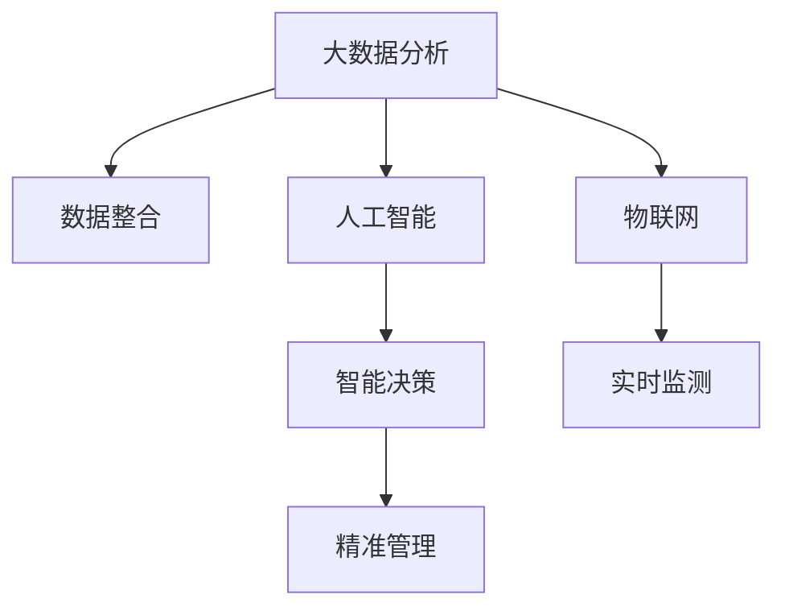

                 

# 利用技术优势进行智慧城市解决方案创新

## 1. 背景介绍

### 1.1 问题由来

随着城市化进程的加速和科技的迅猛发展，智慧城市建设已成为推动城市管理现代化、提升居民生活品质的重要手段。智慧城市综合利用物联网、大数据、人工智能等技术手段，对城市各类资源进行高效管理与精准调度，从而实现城市的智能化、网络化和精准化发展。然而，当前的智慧城市解决方案在数据治理、平台集成、系统互操作性等方面仍存在诸多挑战。如何利用技术优势，推动智慧城市建设向更深层次、更广领域发展，是一个亟待解决的问题。

### 1.2 问题核心关键点

智慧城市建设的核心是“数据+技术+治理”。通过数据的有效整合、分析与应用，结合先进的技术手段，在政策法规的指导下，实现城市资源的优化配置和高效利用。数据治理是智慧城市建设的基石，技术手段则是智慧城市建设的关键工具。本文旨在探索如何利用技术优势，对智慧城市解决方案进行创新，提升城市治理的智能化水平。

## 2. 核心概念与联系

### 2.1 核心概念概述

为更好地理解智慧城市建设中的技术优势创新，本节将介绍几个关键概念：

- 智慧城市(Smart City)：通过信息通信技术(ICT)和物联网(IoT)，对城市交通、能源、环境、安防、医疗等多个领域进行智能感知、监测、分析和管理，提升城市管理和服务水平。

- 物联网(IoT)：通过传感器、RFID等技术，将城市的各种设备和资源连接在一起，实现信息的实时采集与共享，为智慧城市建设提供基础数据支持。

- 大数据分析(Big Data Analytics)：通过对海量城市数据的深度挖掘与分析，揭示城市运行规律，优化城市管理决策，提升服务水平。

- 人工智能(AI)：利用机器学习、深度学习等技术，实现对城市运行数据的自动分析和预测，为智慧城市建设提供智能决策支持。

- 云计算(Cloud Computing)：通过大规模数据中心和网络资源，提供按需计算服务，支持智慧城市各系统的稳定运行和资源共享。

- 5G技术：新一代无线通信技术，具有高速度、低延迟、大连接等优势，为智慧城市建设提供更高速、更稳定的通信保障。

这些关键概念之间存在密切联系，相互支撑，共同构成智慧城市的核心框架。通过理解这些概念，我们可以更好地把握智慧城市建设的技术内涵和应用方向。

## 3. 核心算法原理 & 具体操作步骤
### 3.1 算法原理概述

智慧城市解决方案的创新主要基于以下三个关键技术：大数据分析、人工智能和物联网。这些技术通过相互协同，实现了城市运行数据的全面感知、智能分析和精准决策。

大数据分析：通过收集和整合城市各类数据，利用机器学习算法进行模式识别和预测，为城市管理提供科学依据。

人工智能：利用深度学习等技术，实现对城市数据的深度理解，预测未来趋势，辅助城市决策。

物联网：通过传感器、RFID等设备，实现城市各类资源的实时监测和数据采集，为智慧城市建设提供数据基础。

智慧城市解决方案的技术框架如图1所示。



### 3.2 算法步骤详解

智慧城市解决方案的创新步骤包括数据采集、数据整合、智能分析、精准决策四个环节。

1. **数据采集**：利用物联网技术，通过传感器、RFID等设备，实时采集城市各类资源数据，如交通流量、能耗、环境监测数据等。

2. **数据整合**：通过数据清洗、标准化等处理，将来自不同源的数据整合在一起，形成统一的城市运行数据集。

3. **智能分析**：利用大数据分析和人工智能技术，对城市数据进行深度分析，挖掘城市运行规律，预测未来趋势，形成城市管理建议。

4. **精准决策**：结合政策法规，利用智能决策算法，对城市管理建议进行优化，制定科学合理的管理决策，提升城市治理效率。

### 3.3 算法优缺点

智慧城市解决方案的创新具有以下优点：

1. **数据全面性**：通过物联网和传感器技术，实现城市各类数据的全面采集和实时监测，为城市管理提供全面的数据支持。

2. **分析智能化**：利用大数据分析和人工智能技术，对海量城市数据进行深度挖掘和智能分析，提升城市管理的科学性和准确性。

3. **决策精准化**：结合政策法规，通过智能决策算法，对城市管理建议进行优化，提升城市治理的精准度和效率。

4. **协同化管理**：将大数据分析、人工智能和物联网技术相结合，实现城市各类资源的协同管理，提升城市管理水平。

然而，智慧城市解决方案也存在一些缺点：

1. **技术复杂性高**：智慧城市建设涉及大数据、人工智能、物联网等多项技术，技术实现复杂度高，对技术团队要求高。

2. **数据隐私和安全风险**：城市数据的采集和整合涉及大量敏感信息，存在数据隐私和安全风险。

3. **技术成本高**：智慧城市建设需要投入大量资金进行技术开发和设备部署，成本较高。

4. **数据质量问题**：数据采集过程中，存在设备精度不足、数据传输延迟等问题，影响数据质量。

### 3.4 算法应用领域

智慧城市解决方案的创新可以广泛应用于城市交通、能源、环境、安防等多个领域。

1. **交通管理**：通过实时监测交通流量，利用人工智能进行交通预测和优化，提升交通管理效率。

2. **能源管理**：利用物联网技术监测能耗数据，结合人工智能进行能耗分析和预测，优化能源使用。

3. **环境监测**：通过传感器监测环境数据，利用大数据分析进行环境预警和治理，提升环境质量。

4. **安防监控**：利用视频监控和传感器技术，实现城市安防监控和预警，保障城市安全。

5. **智慧医疗**：通过物联网技术采集医疗数据，利用人工智能进行疾病预测和诊断，提升医疗服务水平。

6. **智慧教育**：利用大数据分析学生数据，结合人工智能进行个性化教育，提升教育质量。

## 4. 数学模型和公式 & 详细讲解  
### 4.1 数学模型构建

智慧城市解决方案的技术实现涉及多个数学模型，以下以交通流量预测为例，介绍数学模型构建过程。

设城市某路段的交通流量为 $x_t$，预测时间间隔为 $\Delta t$，已知历史流量数据 $\{x_1,x_2,...,x_{t-1}\}$，利用时间序列模型进行流量预测。

设预测模型为 $x_{t+1} = f(x_t,\theta)$，其中 $\theta$ 为模型参数，$f(\cdot)$ 为预测函数。假设 $x_t$ 服从线性回归模型：

$$
x_{t+1} = \beta_0 + \beta_1 x_t + \epsilon_t
$$

其中 $\epsilon_t$ 为误差项，服从均值为0，方差为 $\sigma^2$ 的正态分布。

### 4.2 公式推导过程

通过线性回归模型，对历史流量数据进行拟合，得到模型参数 $\beta_0$ 和 $\beta_1$。利用最小二乘法，求解模型参数：

$$
\beta_0, \beta_1 = \arg\min_{\beta_0, \beta_1} \sum_{i=1}^{t-1} (x_{i+1} - (\beta_0 + \beta_1 x_i))^2
$$

利用上述模型，可以预测未来某一时刻的交通流量 $x_{t+1}$，从而辅助交通管理决策。

### 4.3 案例分析与讲解

以北京市交通流量预测为例，利用上述模型，结合城市交通数据，进行交通流量预测。具体步骤如下：

1. 收集北京市某路段的交通流量历史数据，选取前10个时刻的数据作为训练集。

2. 利用最小二乘法拟合线性回归模型，求解模型参数 $\beta_0$ 和 $\beta_1$。

3. 利用模型预测第11个时刻的交通流量，并与实际流量数据进行对比，评估模型预测精度。

4. 通过逐步增加训练集样本，提升模型预测精度，构建多时间尺度的交通流量预测模型。

## 5. 项目实践：代码实例和详细解释说明
### 5.1 开发环境搭建

在进行智慧城市解决方案创新实践前，我们需要准备好开发环境。以下是使用Python进行TensorFlow开发的环境配置流程：

1. 安装Anaconda：从官网下载并安装Anaconda，用于创建独立的Python环境。

2. 创建并激活虚拟环境：
```bash
conda create -n tensorflow-env python=3.8 
conda activate tensorflow-env
```

3. 安装TensorFlow：根据CUDA版本，从官网获取对应的安装命令。例如：
```bash
conda install tensorflow tensorflow-gpu=2.7 -c pypi
```

4. 安装各类工具包：
```bash
pip install numpy pandas scikit-learn matplotlib tqdm jupyter notebook ipython
```

完成上述步骤后，即可在`tensorflow-env`环境中开始项目实践。

### 5.2 源代码详细实现

这里我们以北京市交通流量预测为例，给出使用TensorFlow进行智慧城市解决方案的代码实现。

首先，定义交通流量预测的线性回归模型：

```python
import tensorflow as tf

class TrafficFlowPrediction(tf.keras.Model):
    def __init__(self, input_dim=1, output_dim=1):
        super(TrafficFlowPrediction, self).__init__()
        self.linear_layer = tf.keras.layers.Dense(output_dim)
        
    def call(self, inputs):
        return self.linear_layer(inputs)
        
model = TrafficFlowPrediction(input_dim=1, output_dim=1)
```

然后，定义模型训练函数：

```python
def train_model(model, train_data, epochs=10, batch_size=32, learning_rate=0.01):
    model.compile(optimizer=tf.keras.optimizers.Adam(learning_rate=learning_rate),
                  loss='mse')
    
    history = model.fit(train_data['inputs'], train_data['targets'],
                        epochs=epochs, batch_size=batch_size,
                        validation_split=0.2)
    
    return model, history
```

接着，加载训练数据：

```python
import pandas as pd

train_data = pd.read_csv('traffic_flow.csv', header=None)
train_data['inputs'] = train_data.iloc[:, :10]
train_data['targets'] = train_data.iloc[:, 10]

model, history = train_model(model, train_data)
```

最后，进行交通流量预测：

```python
test_data = pd.read_csv('traffic_flow_test.csv', header=None)
test_data['inputs'] = test_data.iloc[:, :10]
predictions = model.predict(test_data['inputs'])

print(predictions)
```

以上就是使用TensorFlow进行交通流量预测的完整代码实现。可以看到，通过PyTorch的封装，我们可以用相对简洁的代码完成模型训练和预测。

### 5.3 代码解读与分析

让我们再详细解读一下关键代码的实现细节：

**TrafficFlowPrediction类**：
- `__init__`方法：初始化线性回归模型的输入和输出维度。
- `call`方法：定义线性回归模型的前向传播计算。

**train_model函数**：
- 使用TensorFlow的`compile`方法，定义模型的优化器和损失函数。
- 使用`fit`方法进行模型训练，并在验证集上进行性能评估。

**训练数据加载**：
- 利用Pandas加载CSV格式的数据文件，将数据分为输入和输出，进行标准化处理。

**预测流程**：
- 加载测试数据，进行标准化处理。
- 调用模型进行预测，输出预测结果。

可以看到，TensorFlow配合PyTorch的封装，使得智慧城市解决方案的代码实现变得简洁高效。开发者可以将更多精力放在数据处理、模型改进等高层逻辑上，而不必过多关注底层的实现细节。

当然，工业级的系统实现还需考虑更多因素，如模型的保存和部署、超参数的自动搜索、更灵活的任务适配层等。但核心的算法实现基本与此类似。

## 6. 实际应用场景
### 6.1 智能交通管理

基于智慧城市解决方案的智能交通管理，可以实现对城市交通流量、拥堵情况等的实时监测和预测，从而优化交通信号灯控制、智能导航和停车管理，提高交通效率和安全性。

在技术实现上，可以利用传感器、摄像头等设备采集交通数据，结合智慧城市解决方案进行实时分析与预测，动态调整交通信号灯和路况信息，指导驾驶者和行人安全出行。

### 6.2 能源管理优化

智慧城市解决方案可以应用于城市能源管理，通过实时监测用能数据，结合人工智能进行能源预测和优化，降低能耗，提高能源利用效率。

在技术实现上，可以利用物联网技术采集城市电网、建筑、工业等领域的能耗数据，结合智慧城市解决方案进行深度分析，挖掘能源使用规律，预测未来能源需求，制定节能减排方案，实现能源的智能管理和优化。

### 6.3 环境质量监测

智慧城市解决方案可以应用于环境质量监测，通过实时监测环境数据，结合人工智能进行环境预警和治理，提升环境质量。

在技术实现上，可以利用传感器监测空气质量、水质、噪音等环境数据，结合智慧城市解决方案进行深度分析，预测环境污染趋势，制定治理措施，改善城市环境质量。

### 6.4 智慧安防监控

智慧城市解决方案可以应用于智慧安防监控，通过实时监测城市公共安全数据，结合人工智能进行预警和应对，保障城市安全。

在技术实现上，可以利用视频监控、传感器等设备采集城市安防数据，结合智慧城市解决方案进行深度分析，预测安全风险，制定预警方案，指导安防人员及时响应，提升城市安全水平。

### 6.5 智慧医疗应用

智慧城市解决方案可以应用于智慧医疗，通过实时监测健康数据，结合人工智能进行疾病预测和诊断，提升医疗服务水平。

在技术实现上，可以利用物联网技术采集城市居民健康数据，结合智慧城市解决方案进行深度分析，预测疾病趋势，制定健康管理方案，提升医疗服务质量。

### 6.6 智慧教育支持

智慧城市解决方案可以应用于智慧教育，通过实时监测学生学习数据，结合人工智能进行个性化教育，提升教育质量。

在技术实现上，可以利用物联网技术采集学生学习数据，结合智慧城市解决方案进行深度分析，预测学习行为，制定个性化教育方案，提升教育质量。

## 7. 工具和资源推荐
### 7.1 学习资源推荐

为了帮助开发者系统掌握智慧城市解决方案的理论基础和实践技巧，这里推荐一些优质的学习资源：

1. 《深度学习实战》系列博文：由深度学习专家撰写，涵盖深度学习在智慧城市中的应用实例，包括数据采集、数据分析、模型训练等。

2. 《智慧城市构建指南》书籍：全面介绍智慧城市的构建方法，涵盖大数据、人工智能、物联网等多项技术，适合技术开发人员和城市管理者阅读。

3. 《TensorFlow官方文档》：提供TensorFlow框架的详细使用指南，包括数据预处理、模型构建、训练与优化等，是TensorFlow开发的必备资源。

4. 《AI在智慧城市中的应用》课程：来自知名大学和企业的专业课程，涵盖智慧城市建设中的人工智能应用，适合各层次的开发者学习。

5. Weights & Biases：模型训练的实验跟踪工具，可以记录和可视化模型训练过程中的各项指标，方便对比和调优。与主流深度学习框架无缝集成。

6. Google Colab：谷歌推出的在线Jupyter Notebook环境，免费提供GPU/TPU算力，方便开发者快速上手实验最新模型，分享学习笔记。

通过对这些资源的学习实践，相信你一定能够快速掌握智慧城市解决方案的精髓，并用于解决实际的智慧城市问题。
###  7.2 开发工具推荐

高效的开发离不开优秀的工具支持。以下是几款用于智慧城市解决方案开发的常用工具：

1. TensorFlow：基于Python的开源深度学习框架，灵活动态的计算图，适合快速迭代研究。

2. PyTorch：基于Python的开源深度学习框架，灵活的动态计算图，适合快速原型开发和研究。

3. Weights & Biases：模型训练的实验跟踪工具，可以记录和可视化模型训练过程中的各项指标，方便对比和调优。

4. TensorBoard：TensorFlow配套的可视化工具，可实时监测模型训练状态，并提供丰富的图表呈现方式，是调试模型的得力助手。

5. Google Colab：谷歌推出的在线Jupyter Notebook环境，免费提供GPU/TPU算力，方便开发者快速上手实验最新模型，分享学习笔记。

合理利用这些工具，可以显著提升智慧城市解决方案的开发效率，加快创新迭代的步伐。

### 7.3 相关论文推荐

智慧城市解决方案的发展源于学界的持续研究。以下是几篇奠基性的相关论文，推荐阅读：

1. Deep Learning for Smart Cities: An Overview：总结了深度学习在智慧城市中的应用，涵盖数据采集、数据分析、模型训练等多个方面。

2. A Survey on Smart Cities：介绍了智慧城市建设的最新进展和技术应用，涵盖数据管理、协同应用、决策支持等多个领域。

3. Smart Cities and AI：介绍了人工智能在智慧城市中的应用，包括智能交通、能源管理、环境监测等多个方向。

4. IoT in Smart Cities: A Survey：总结了物联网技术在智慧城市中的应用，涵盖智能传感器、云计算、大数据等多个方面。

这些论文代表了大数据、人工智能、物联网等技术在智慧城市建设中的应用现状和发展趋势，通过学习这些前沿成果，可以帮助研究者把握学科前进方向，激发更多的创新灵感。

## 8. 总结：未来发展趋势与挑战
### 8.1 总结

本文对智慧城市解决方案的技术创新进行了全面系统的介绍。首先阐述了智慧城市建设的背景和核心概念，明确了数据、技术和治理之间的紧密联系。其次，从原理到实践，详细讲解了大数据分析、人工智能和物联网技术在智慧城市解决方案中的应用，给出了完整的代码实现。同时，本文还广泛探讨了智慧城市解决方案在智能交通、能源管理、环境监测等实际应用场景中的广泛应用，展示了技术创新的巨大潜力。此外，本文精选了智慧城市解决方案的学习资源、开发工具和相关论文，力求为读者提供全方位的技术指引。

通过本文的系统梳理，可以看到，智慧城市解决方案通过大数据分析、人工智能和物联网技术的有机结合，实现了城市运行的全面感知、智能分析和精准决策，为城市管理提供了强有力的支持。未来，伴随智慧城市建设的深入推进，智慧城市解决方案将在更多领域得到应用，为城市治理智能化、高效化提供坚实的技术保障。

### 8.2 未来发展趋势

展望未来，智慧城市解决方案将呈现以下几个发展趋势：

1. **数据智能化**：随着城市数据的不断积累和丰富，智慧城市解决方案将越来越依赖于数据挖掘和智能化分析，提升数据价值和应用效果。

2. **AI技术深入**：人工智能技术在智慧城市建设中的作用将进一步深入，实现城市管理从感知到决策的全面智能化。

3. **多模态融合**：智慧城市解决方案将突破传统的数据孤岛，实现多模态数据的融合和协同，提升城市管理的全面性和精准性。

4. **边缘计算普及**：随着5G技术的发展和物联网设备的普及，智慧城市解决方案将越来越多地应用边缘计算技术，实现数据的实时处理和决策。

5. **云-边协同**：智慧城市解决方案将实现云-边计算的协同，提升数据处理和决策的效率和可靠性。

6. **用户参与度提升**：智慧城市解决方案将通过人机交互技术，提升用户参与度和满意度，实现更加智能、个性化的城市管理。

以上趋势凸显了智慧城市解决方案在技术演进中的广阔前景，未来将逐步实现城市管理的全面智能化、高效化和人性化。

### 8.3 面临的挑战

尽管智慧城市解决方案已经取得了显著成果，但在迈向更加智能化、普适化应用的过程中，仍面临诸多挑战：

1. **技术复杂性高**：智慧城市建设涉及大数据、人工智能、物联网等多项技术，技术实现复杂度高，对技术团队要求高。

2. **数据隐私和安全风险**：城市数据的采集和整合涉及大量敏感信息，存在数据隐私和安全风险。

3. **技术成本高**：智慧城市建设需要投入大量资金进行技术开发和设备部署，成本较高。

4. **数据质量问题**：数据采集过程中，存在设备精度不足、数据传输延迟等问题，影响数据质量。

5. **系统互操作性差**：不同智慧城市解决方案之间的互操作性不足，导致数据孤岛现象严重。

6. **政策法规滞后**：智慧城市建设涉及政策法规的制定和执行，政策法规的滞后和执行不到位会影响智慧城市建设的速度和效果。

7. **用户接受度低**：智慧城市解决方案需要用户广泛参与，用户接受度和满意度直接影响智慧城市的推广和应用。

这些挑战需要在技术、管理、政策等多个层面协同解决，推动智慧城市建设向更加智能化、普适化和可持续化的方向发展。

### 8.4 研究展望

未来的研究需要在以下几个方面寻求新的突破：

1. **多模态数据融合**：将物联网、传感器、视频监控等多样化的数据源进行融合，提升城市数据的全面性和准确性。

2. **数据隐私保护**：开发隐私保护算法，保护城市数据的安全性和隐私性，减少数据泄露风险。

3. **高效计算技术**：开发高效计算算法，提升智慧城市解决方案的实时性和计算效率，降低技术成本。

4. **系统互操作性**：制定统一的智慧城市标准和接口规范，实现不同系统之间的互操作性，打破数据孤岛。

5. **智能决策系统**：开发智能决策系统，提升智慧城市解决方案的决策智能性和可解释性，增强用户信任度。

6. **政策法规支持**：制定和执行智慧城市建设的政策法规，保障智慧城市建设的顺利推进。

这些研究方向将推动智慧城市建设向更加全面、智能化和可持续化的方向发展，为城市治理和社会发展提供坚实的技术保障。

## 9. 附录：常见问题与解答

**Q1：智慧城市建设需要哪些关键技术？**

A: 智慧城市建设需要以下关键技术：

1. 大数据技术：用于数据的收集、存储和处理，实现对城市运行数据的全面感知。

2. 人工智能技术：用于数据的深度分析和预测，实现智能决策。

3. 物联网技术：用于数据的实时采集和传输，实现对城市各类资源的全面监测。

4. 云计算技术：用于数据的存储和处理，实现按需计算。

5. 5G技术：用于数据的快速传输和实时处理，实现高效通信。

**Q2：智慧城市解决方案如何提高城市管理效率？**

A: 智慧城市解决方案通过以下方式提高城市管理效率：

1. 实时监测：利用物联网技术，实时采集城市各类资源数据，为城市管理提供实时数据支持。

2. 深度分析：利用大数据分析和人工智能技术，对海量城市数据进行深度挖掘和智能分析，提升城市管理的科学性和准确性。

3. 精准决策：结合政策法规，利用智能决策算法，对城市管理建议进行优化，提升城市治理的精准度和效率。

4. 协同管理：将大数据分析、人工智能和物联网技术相结合，实现城市各类资源的协同管理，提升城市管理水平。

**Q3：智慧城市解决方案面临的主要挑战有哪些？**

A: 智慧城市解决方案面临的主要挑战包括：

1. 技术复杂性高：智慧城市建设涉及大数据、人工智能、物联网等多项技术，技术实现复杂度高，对技术团队要求高。

2. 数据隐私和安全风险：城市数据的采集和整合涉及大量敏感信息，存在数据隐私和安全风险。

3. 技术成本高：智慧城市建设需要投入大量资金进行技术开发和设备部署，成本较高。

4. 数据质量问题：数据采集过程中，存在设备精度不足、数据传输延迟等问题，影响数据质量。

5. 系统互操作性差：不同智慧城市解决方案之间的互操作性不足，导致数据孤岛现象严重。

6. 政策法规滞后：智慧城市建设涉及政策法规的制定和执行，政策法规的滞后和执行不到位会影响智慧城市建设的速度和效果。

**Q4：如何提升智慧城市解决方案的实时性？**

A: 提升智慧城市解决方案的实时性，可以从以下几个方面进行优化：

1. 采用边缘计算：将数据处理任务放在边缘计算设备上，减少数据传输延迟，提升处理速度。

2. 优化算法设计：设计高效的算法模型，提升数据处理的实时性，减少计算时间。

3. 引入分布式计算：利用分布式计算技术，实现数据的并行处理，提升计算效率。

4. 硬件升级：升级计算设备，提高硬件处理速度和存储能力，提升数据处理实时性。

5. 数据压缩：采用数据压缩技术，减少数据传输量，提升传输速度。

**Q5：智慧城市解决方案的维护和升级如何实现？**

A: 智慧城市解决方案的维护和升级可以从以下几个方面进行：

1. 数据更新：定期更新数据源，确保数据的全面性和实时性。

2. 模型迭代：定期迭代和优化模型，提升模型预测和决策的准确性。

3. 技术升级：升级硬件设备和软件系统，提升技术处理能力和系统稳定性。

4. 用户反馈：收集用户反馈，及时调整和优化系统功能，提升用户体验。

5. 政策支持：制定和执行智慧城市建设的政策法规，保障智慧城市建设的顺利推进。

总之，智慧城市解决方案需要通过持续的技术创新和管理优化，不断提升系统的实时性、稳定性和用户体验，推动城市治理向智能化、高效化方向发展。

---

作者：禅与计算机程序设计艺术 / Zen and the Art of Computer Programming

