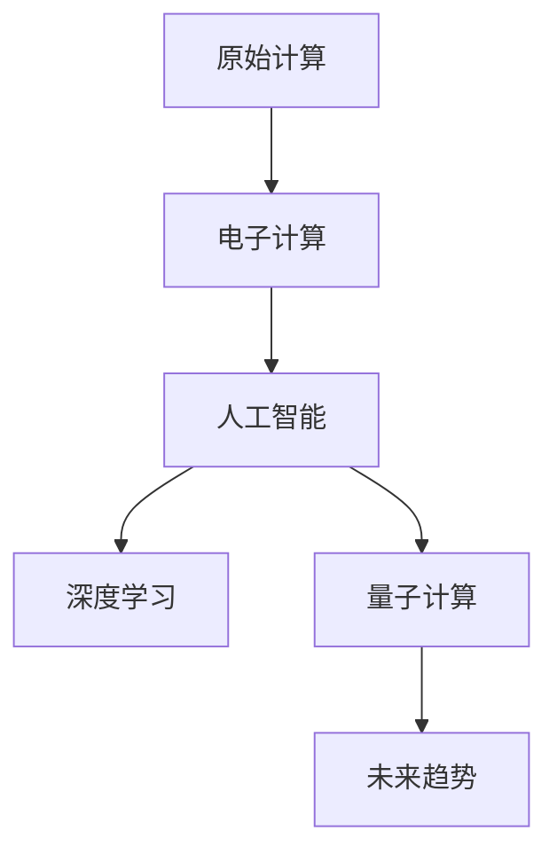

                 

# 回顾与展望：人类计算的发展历程与未来

> 关键词：人类计算、人工智能、计算历史、深度学习、未来趋势

## 1. 背景介绍

### 1.1 问题由来
自人类发明火、印刷术以来，计算一直是推动文明进步的核心驱动力。从原始的石板刻记，到现代的超级计算机，计算技术不断地推动人类社会的科技进步和生产力的提升。

近年来，人工智能（AI）技术的迅猛发展，特别是深度学习算法的突破，使得人类计算范式发生了深刻变革。大数据、高性能计算和复杂算法结合，赋予了计算机前所未有的计算能力，极大地拓展了人工智能的应用范围和深度。

本文将回顾人类计算的发展历程，总结其中的关键技术进步，并对未来的发展趋势进行展望，以期为读者提供更深的理解和更广阔的视野。

### 1.2 问题核心关键点
回顾人类计算的发展历程，我们将聚焦以下几个核心关键点：

1. **原始计算**：人类最早使用石板、算盘、计算尺等进行简单的计算，其原理基于逻辑和机械运算。
2. **电子计算**：随着电子技术的发展，计算机作为实现自动化计算的工具应运而生，从真空管、晶体管到集成电路，计算机的计算能力和效率不断提升。
3. **AI与深度学习**：深度学习算法在处理大规模数据、实现复杂模式识别和推理等方面展现出巨大潜力，成为当前计算范式的重要组成部分。
4. **量子计算**：量子计算理论的提出和初步实现，为未来计算提供了全新的计算模型，有望在特定领域实现指数级的计算速度提升。
5. **未来趋势**：人工智能和计算技术的持续融合，有望在未来产生更多颠覆性创新，推动计算范式的进一步演化。

通过回顾这些关键点，我们可以更好地理解计算技术的发展脉络，并对未来的趋势有更清晰的认识。

## 2. 核心概念与联系

### 2.1 核心概念概述

为更好地理解人类计算的发展历程与未来，本节将介绍几个密切相关的核心概念：

- **原始计算**：指早期使用机械或手工工具进行计算的过程，包括石板、算盘、计算尺等。
- **电子计算**：指通过电子技术实现的自动化计算过程，从真空管、晶体管到集成电路，计算机的计算能力不断提升。
- **人工智能**：指使计算机具备模拟、延伸和扩展人类智能的技术，涉及知识表示、推理、学习、规划、自然语言处理等多个领域。
- **深度学习**：一种模拟人类大脑神经网络的算法，通过多层非线性变换进行特征提取和模式识别，是当前AI计算的重要组成部分。
- **量子计算**：利用量子力学原理进行计算的新型计算范式，通过量子比特（qubit）和量子纠缠实现高效的并行计算。

这些核心概念之间的逻辑关系可以通过以下Mermaid流程图来展示：



这个流程图展示了一系列概念之间的相互联系和演化过程：

1. 原始计算为电子计算提供了基础。
2. 电子计算的发展推动了人工智能的诞生。
3. 人工智能技术的成熟催生了深度学习。
4. 量子计算为未来计算提供了全新的可能性。

这些概念共同构成了人类计算技术的演进框架，推动了计算范式的不断进步。

## 3. 核心算法原理 & 具体操作步骤
### 3.1 算法原理概述

人类计算的发展历程，从最早的逻辑和机械运算，到复杂的电子计算和现代的AI计算，其核心算法原理和操作步骤可以概括为以下几个关键阶段：

1. **逻辑运算**：早期人类使用石板、算盘等工具进行基本的逻辑运算，通过物理操作来实现计算。
2. **机械计算**：18世纪末到19世纪初，机械计算器如差分机、分析机等开始出现，通过机械部件的运动进行计算。
3. **电子计算**：20世纪初，电子管和真空管的出现使得计算机开始具备自动化和高速计算能力，计算速度和精度大幅提升。
4. **数字计算**：晶体管和集成电路的发明，使得计算机进入大规模集成电路时代，计算能力和存储能力显著增强。
5. **AI计算**：深度学习算法的提出和成熟，使得计算机能够处理复杂数据和模式识别，实现智能化计算。

### 3.2 算法步骤详解

以下将详细阐述AI计算的核心算法步骤：

1. **数据预处理**：清洗和标准化数据，去除噪声和异常值，进行特征工程和数据增强。
2. **模型选择**：选择合适的深度学习模型，如卷积神经网络（CNN）、循环神经网络（RNN）等。
3. **训练过程**：使用标注数据集进行模型训练，通过前向传播和反向传播不断调整模型参数，最小化损失函数。
4. **模型评估**：在验证集上评估模型性能，使用准确率、召回率、F1分数等指标评估模型效果。
5. **模型优化**：根据评估结果调整模型参数，进行超参数调优和模型集成，提升模型泛化能力。
6. **模型部署**：将训练好的模型部署到实际应用场景中，进行推理预测和实时计算。

### 3.3 算法优缺点

深度学习和AI计算的核心算法有以下优点：

1. **高效性**：深度学习模型通过并行计算和层级结构，能够高效处理大规模数据和复杂模式。
2. **通用性**：深度学习模型在图像、语音、自然语言处理等多个领域表现出色，具有广泛的应用前景。
3. **自我学习**：深度学习模型能够自动提取特征和模式，无需人工干预。
4. **鲁棒性**：深度学习模型在大数据和复杂环境下表现稳定，具有较强的鲁棒性。

但同时，这些算法也存在一些缺点：

1. **数据依赖**：深度学习模型依赖大量标注数据进行训练，数据获取成本较高。
2. **计算资源需求高**：深度学习模型需要高性能计算资源和大量存储，初期投入较大。
3. **黑箱问题**：深度学习模型的决策过程不透明，难以解释模型的内部工作机制。
4. **过拟合风险**：深度学习模型在过拟合问题上存在挑战，尤其是在数据量较少的情况下。

### 3.4 算法应用领域

深度学习和AI计算在多个领域得到广泛应用，以下是几个典型应用场景：

1. **自然语言处理**：包括文本分类、情感分析、机器翻译、语音识别等任务。深度学习模型能够处理自然语言的多样性和复杂性，实现高效的文本理解和生成。
2. **计算机视觉**：如图像识别、目标检测、图像生成等任务。深度学习模型能够处理图像的高维特性和复杂结构，实现准确的图像分类和识别。
3. **自动驾驶**：通过深度学习模型实现环境感知、路径规划和决策，提高驾驶安全性。
4. **医疗健康**：通过深度学习模型进行医学图像分析、疾病预测、个性化医疗等，提高医疗服务的精准度和效率。
5. **金融科技**：通过深度学习模型进行信用评估、风险预测、智能投顾等，优化金融服务和决策过程。

## 4. 数学模型和公式 & 详细讲解 & 举例说明

### 4.1 数学模型构建

深度学习和AI计算的数学模型构建主要包括以下几个关键步骤：

1. **神经网络结构**：选择合适的神经网络结构，如全连接层、卷积层、循环层等。
2. **损失函数**：定义合适的损失函数，如交叉熵、均方误差、对数似然等。
3. **优化器**：选择合适的优化器，如SGD、Adam等，进行模型参数更新。
4. **正则化技术**：使用L2正则、Dropout等技术，防止模型过拟合。
5. **评价指标**：定义评价指标，如准确率、召回率、F1分数等，评估模型性能。

### 4.2 公式推导过程

以深度学习中的卷积神经网络（CNN）为例，以下是其基本的数学推导过程：

1. **卷积层**：假设输入为$x \in \mathbb{R}^{m\times n\times c}$，卷积核为$w \in \mathbb{R}^{k\times k\times c \times o}$，输出为$y \in \mathbb{R}^{m'\times n'\times o}$，其中$m'$和$n'$为输出尺寸。则卷积运算可以表示为：

$$
y_{i,j,k} = \sum_{p=0}^{k-1}\sum_{q=0}^{k-1}\sum_{c=0}^{c-1}w_{p,q,c,k}*x_{i+p,j+q,c} + b_k
$$

其中$b_k$为偏置项。

2. **池化层**：对卷积层的输出进行池化操作，如最大池化和平均池化，可以减小输出尺寸，提升模型计算效率。

3. **全连接层**：将池化层的输出通过全连接层进行特征映射，得到最终的分类结果。假设输出维度为$d$，则全连接层的计算可以表示为：

$$
y = w^T x + b
$$

其中$w \in \mathbb{R}^{d\times h}$，$x \in \mathbb{R}^{h}$，$b \in \mathbb{R}^d$。

4. **softmax函数**：将全连接层的输出通过softmax函数进行归一化处理，得到概率分布：

$$
\hat{y}_i = \frac{e^{x_i}}{\sum_{j=1}^d e^{x_j}}
$$

5. **损失函数**：假设真实标签为$y^*$，则交叉熵损失函数可以表示为：

$$
\mathcal{L} = -\sum_{i=1}^d y_i^*\log\hat{y}_i
$$

6. **优化器**：假设学习率为$\eta$，优化器为Adam，则模型参数更新公式为：

$$
\theta \leftarrow \theta - \eta*\nabla_{\theta}\mathcal{L}
$$

其中$\nabla_{\theta}\mathcal{L}$为损失函数对参数$\theta$的梯度，可以使用反向传播算法计算。

### 4.3 案例分析与讲解

以图像分类任务为例，以下是使用TensorFlow框架实现卷积神经网络的代码示例：

```python
import tensorflow as tf
from tensorflow.keras import layers, models

model = models.Sequential([
    layers.Conv2D(32, (3,3), activation='relu', input_shape=(28, 28, 1)),
    layers.MaxPooling2D((2,2)),
    layers.Conv2D(64, (3,3), activation='relu'),
    layers.MaxPooling2D((2,2)),
    layers.Flatten(),
    layers.Dense(64, activation='relu'),
    layers.Dense(10, activation='softmax')
])

model.compile(optimizer='adam',
              loss='categorical_crossentropy',
              metrics=['accuracy'])

model.fit(train_images, train_labels, epochs=10, validation_data=(test_images, test_labels))
```

此代码展示了使用TensorFlow实现一个简单的卷积神经网络，包括卷积层、池化层、全连接层和softmax层。通过fit方法进行模型训练和验证。

## 5. 项目实践：代码实例和详细解释说明
### 5.1 开发环境搭建

在进行AI计算实践前，我们需要准备好开发环境。以下是使用Python进行TensorFlow开发的环境配置流程：

1. 安装Anaconda：从官网下载并安装Anaconda，用于创建独立的Python环境。

2. 创建并激活虚拟环境：
```bash
conda create -n tf-env python=3.8 
conda activate tf-env
```

3. 安装TensorFlow：根据CUDA版本，从官网获取对应的安装命令。例如：
```bash
pip install tensorflow-gpu==2.6
```

4. 安装各类工具包：
```bash
pip install numpy pandas scikit-learn matplotlib tqdm jupyter notebook ipython
```

完成上述步骤后，即可在`tf-env`环境中开始AI计算实践。

### 5.2 源代码详细实现

下面以图像分类任务为例，给出使用TensorFlow实现卷积神经网络的代码实现。

首先，定义图像分类任务的数据处理函数：

```python
import numpy as np
import tensorflow as tf
from tensorflow.keras.preprocessing.image import ImageDataGenerator

train_datagen = ImageDataGenerator(
        rescale=1./255,
        shear_range=0.2,
        zoom_range=0.2,
        horizontal_flip=True)

test_datagen = ImageDataGenerator(rescale=1./255)

train_generator = train_datagen.flow_from_directory(
        'train_dir',
        target_size=(150, 150),
        batch_size=32,
        class_mode='binary')

test_generator = test_datagen.flow_from_directory(
        'test_dir',
        target_size=(150, 150),
        batch_size=32,
        class_mode='binary')
```

然后，定义模型和优化器：

```python
from tensorflow.keras import layers, models

model = models.Sequential([
    layers.Conv2D(32, (3,3), activation='relu', input_shape=(150, 150, 3)),
    layers.MaxPooling2D((2,2)),
    layers.Conv2D(64, (3,3), activation='relu'),
    layers.MaxPooling2D((2,2)),
    layers.Flatten(),
    layers.Dense(64, activation='relu'),
    layers.Dense(1, activation='sigmoid')
])

optimizer = tf.keras.optimizers.Adam(lr=0.001)
```

接着，定义训练和评估函数：

```python
def train_epoch(model, generator, batch_size, optimizer):
    model.train()
    epoch_loss = 0
    for batch in generator:
        x, y = batch
        with tf.GradientTape() as tape:
            y_pred = model(x)
            loss = tf.keras.losses.binary_crossentropy(y, y_pred)
        gradients = tape.gradient(loss, model.trainable_variables)
        optimizer.apply_gradients(zip(gradients, model.trainable_variables))
        epoch_loss += loss
    return epoch_loss / generator.n

def evaluate(model, generator, batch_size):
    model.eval()
    preds, labels = [], []
    with tf.GradientTape() as tape:
        for batch in generator:
            x, y = batch
            y_pred = model(x)
            preds.append(y_pred.numpy())
            labels.append(y.numpy())
    return tf.keras.metrics.BinaryAccuracy()(preds, labels).numpy()
```

最后，启动训练流程并在测试集上评估：

```python
epochs = 10
batch_size = 32

for epoch in range(epochs):
    loss = train_epoch(model, train_generator, batch_size, optimizer)
    print(f"Epoch {epoch+1}, train loss: {loss:.4f}")
    
    print(f"Epoch {epoch+1}, test accuracy: {evaluate(model, test_generator, batch_size)}")
    
print("Training completed.")
```

以上就是使用TensorFlow实现卷积神经网络的基本代码示例。可以看到，通过TensorFlow的高层API，能够方便地构建和训练深度学习模型，大大简化了模型的实现过程。

### 5.3 代码解读与分析

让我们再详细解读一下关键代码的实现细节：

**ImageDataGenerator**：
- 数据增强：通过旋转、平移、缩放等操作，扩充训练数据集，提升模型泛化能力。
- 数据预处理：对图像进行归一化和缩放，保证输入数据的一致性。

**Sequential模型**：
- Sequential模型是TensorFlow中常用的顺序模型结构，通过stacking layers实现深度学习模型。
- 卷积层（Conv2D）：用于提取图像的局部特征，使用3x3的卷积核和ReLU激活函数。
- 池化层（MaxPooling2D）：用于减小特征图尺寸，保留重要特征。
- 全连接层（Dense）：将特征图展开为向量，进行分类任务。
- 输出层（Dense）：使用sigmoid激活函数进行二分类。

**train_epoch函数**：
- 迭代训练集上的每个批次数据，计算损失函数并反向传播更新模型参数。
- 使用tf.GradientTape记录梯度，通过optimizer.apply_gradients更新模型权重。
- 累加损失函数，返回平均损失。

**evaluate函数**：
- 迭代测试集上的每个批次数据，计算模型预测结果和真实标签的损失函数。
- 使用BinaryAccuracy计算预测准确率，返回平均准确率。

**训练流程**：
- 定义总的epoch数和batch size，开始循环迭代
- 每个epoch内，先在训练集上训练，输出平均损失
- 在测试集上评估，输出准确率
- 所有epoch结束后，给出最终的测试结果

可以看到，TensorFlow框架通过高层API封装了深度学习模型的构建和训练过程，极大地简化了模型的实现和调优。

当然，工业级的系统实现还需考虑更多因素，如模型的保存和部署、超参数的自动搜索、更灵活的任务适配层等。但核心的AI计算范式基本与此类似。

## 6. 实际应用场景
### 6.1 智能推荐系统

基于深度学习和AI计算的智能推荐系统，能够根据用户的历史行为和偏好，实时推荐个性化的物品和服务。其核心在于对用户行为数据的分析和学习，建立用户-物品关联图谱，并进行推荐排序。

在技术实现上，可以收集用户浏览、点击、购买等行为数据，提取和物品相关的特征，构建深度学习模型进行训练。微调模型学习用户行为模式和物品特征，生成推荐结果。对于新物品或未见过的行为，模型能够利用已有知识进行预测和推荐，极大地提升了推荐系统的智能化水平。

### 6.2 自动驾驶系统

自动驾驶系统通过深度学习和AI计算实现环境感知、路径规划和决策，从而实现车辆自动驾驶。其核心在于对摄像头、雷达等传感器数据的处理和分析，构建高精度的环境模型。

在技术实现上，可以使用卷积神经网络（CNN）和循环神经网络（RNN）等深度学习模型，对传感器数据进行处理和特征提取。通过微调模型，学习道路、车辆、行人等环境元素的特征，实现对环境的准确感知和理解。同时，通过强化学习等技术，优化路径规划和驾驶决策，实现安全的自动驾驶。

### 6.3 医疗诊断系统

基于深度学习和AI计算的医疗诊断系统，能够根据病人的症状和历史数据，实时诊断疾病并提供治疗建议。其核心在于对医疗数据的分析和建模，建立症状-疾病关联图谱，并进行分类和预测。

在技术实现上，可以收集病人的症状、病历、影像等数据，构建深度学习模型进行训练。微调模型学习症状与疾病之间的关系，生成诊断结果。对于新病人的症状，模型能够利用已有知识进行预测和诊断，提高诊断的准确性和效率。

## 7. 工具和资源推荐
### 7.1 学习资源推荐

为了帮助开发者系统掌握深度学习和AI计算的理论基础和实践技巧，这里推荐一些优质的学习资源：

1. **《深度学习》教材**：Ian Goodfellow、Yoshua Bengio和Aaron Courville合著的深度学习经典教材，详细介绍了深度学习的数学基础和算法原理。
2. **Coursera《深度学习专项课程》**：由Andrew Ng教授主讲的深度学习课程，涵盖深度学习的基础理论和实践技巧。
3. **Udacity《深度学习纳米学位》**：涵盖深度学习、计算机视觉、自然语言处理等多个领域的综合课程，实践性强。
4. **PyTorch官方文档**：TensorFlow的官方文档，提供深度学习模型的实现和调优技巧。
5. **Kaggle数据集和竞赛**：Kaggle提供大量公开数据集和竞赛平台，帮助开发者实践深度学习技术。

通过对这些资源的学习实践，相信你一定能够快速掌握深度学习和AI计算的精髓，并用于解决实际的AI问题。

### 7.2 开发工具推荐

高效的开发离不开优秀的工具支持。以下是几款用于深度学习和AI计算开发的常用工具：

1. **PyTorch**：基于Python的开源深度学习框架，灵活动态，适合快速迭代研究。
2. **TensorFlow**：由Google主导开发的开源深度学习框架，生产部署方便，适合大规模工程应用。
3. **Keras**：高层次的深度学习API，简单易用，适合快速原型开发和模型评估。
4. **JAX**：基于JIT编译的深度学习库，支持高效自动微分和分布式计算。
5. **TensorBoard**：TensorFlow配套的可视化工具，实时监测模型训练状态，提供丰富的图表呈现方式。
6. **Weights & Biases**：模型训练的实验跟踪工具，记录和可视化模型训练过程中的各项指标，方便对比和调优。

合理利用这些工具，可以显著提升深度学习和AI计算的开发效率，加快创新迭代的步伐。

### 7.3 相关论文推荐

深度学习和AI计算的发展源于学界的持续研究。以下是几篇奠基性的相关论文，推荐阅读：

1. **AlexNet**：2012年ImageNet图像识别比赛的冠军模型，标志着深度学习在计算机视觉领域的突破。
2. **Inception**：提出了多尺度卷积层结构，极大地提升了深度学习模型的效率和效果。
3. **ResNet**：提出残差连接技术，解决了深度学习模型的梯度消失问题，使得模型能够更深更宽。
4. **Attention is All You Need**：提出了Transformer结构，开启了NLP领域的预训练大模型时代。
5. **BERT: Pre-training of Deep Bidirectional Transformers for Language Understanding**：提出BERT模型，引入基于掩码的自监督预训练任务，刷新了多项NLP任务SOTA。
6. **GPT-3**：提出了GPT-3模型，利用大规模自监督数据进行训练，展示了深度学习模型的强大潜力。

这些论文代表了大深度学习和AI计算的发展脉络。通过学习这些前沿成果，可以帮助研究者把握学科前进方向，激发更多的创新灵感。

## 8. 总结：未来发展趋势与挑战
### 8.1 研究成果总结

本文对深度学习和AI计算的历程进行了全面系统的回顾，总结了其中的关键技术进步。通过回顾人类计算的发展历程，我们对AI计算的现状和未来趋势有了更深的理解。

深度学习和AI计算已经成为现代计算的重要组成部分，广泛应用于自然语言处理、计算机视觉、自动驾驶、医疗诊断等多个领域。通过深度学习模型和大规模数据的结合，AI计算已经展示了巨大的应用潜力和实际价值。

### 8.2 未来发展趋势

展望未来，深度学习和AI计算的发展趋势主要体现在以下几个方面：

1. **模型规模和效率**：深度学习模型将不断增大，超大规模模型带来的计算资源需求也将不断增加。未来，更多高效模型结构和算法将被提出，以支持更大规模的模型训练和推理。
2. **数据和算力驱动**：深度学习将继续依赖大量数据和算力进行训练和优化，数据质量和算力水平将成为模型效果的关键因素。
3. **多模态融合**：深度学习将逐渐融合更多模态的数据，如图像、语音、自然语言等，实现更加全面和智能的系统。
4. **联邦学习和隐私保护**：面对数据隐私和安全问题，联邦学习等分布式训练技术将受到更多关注。
5. **可解释性和公平性**：深度学习模型的可解释性和公平性将受到更多关注，相关技术和标准也将得到发展和完善。
6. **跨领域应用**：深度学习和AI计算将更多地应用于跨领域的融合创新，如AI辅助医疗、智能制造等，推动多个领域的智能化转型。

### 8.3 面临的挑战

尽管深度学习和AI计算取得了显著进展，但面对未来的发展仍面临诸多挑战：

1. **计算资源需求高**：深度学习模型需要大量的计算资源和存储空间，初期投入较大。如何在有限的资源下优化模型训练和推理，是一个重要的研究方向。
2. **模型过拟合和泛化**：深度学习模型在数据量较少或分布不均的情况下容易过拟合，泛化性能差。如何在不同场景下提高模型的泛化能力，是当前研究的一个热点。
3. **模型可解释性**：深度学习模型通常被视为"黑箱"，难以解释其内部决策过程。如何在保证模型效果的同时，提升模型的可解释性，是一个重要的研究方向。
4. **隐私和安全问题**：深度学习模型依赖大量数据进行训练，数据隐私和安全问题将受到更多关注。如何在保护隐私的前提下，充分利用数据价值，是未来需要解决的重要问题。
5. **伦理和公平性问题**：深度学习模型在决策过程中可能存在偏见和歧视，如何保证模型的公平性，是一个重要的研究方向。
6. **模型可扩展性**：深度学习模型在处理大规模数据和复杂任务时，可扩展性成为一大瓶颈。如何在不同场景下优化模型的可扩展性，是未来需要解决的重要问题。

### 8.4 研究展望

面向未来，深度学习和AI计算的研究需要在以下几个方面寻求新的突破：

1. **自监督学习**：利用无标签数据进行预训练，减少对标注数据的依赖，提高模型的泛化能力。
2. **参数高效和计算高效**：开发更高效的模型结构和算法，支持更大规模的模型训练和推理，同时降低计算资源需求。
3. **跨模态学习**：融合不同模态的数据，提升系统的智能化水平。
4. **联邦学习和隐私保护**：在保证数据隐私和安全的前提下，充分利用分布式计算资源，提升模型的泛化能力。
5. **可解释性**：开发更加透明和可解释的模型，提高模型的可信度和可接受度。
6. **公平性和伦理**：开发更加公平和伦理的模型，避免偏见和歧视，提升模型的社会价值。

这些研究方向的探索，必将引领深度学习和AI计算技术迈向更高的台阶，为构建安全、可靠、可解释、可控的智能系统铺平道路。面向未来，深度学习和AI计算将与其他技术进行更深入的融合，共同推动人工智能技术的进步。

## 9. 附录：常见问题与解答

**Q1：深度学习与传统机器学习的区别是什么？**

A: 深度学习和传统机器学习的主要区别在于模型的复杂度和表示能力。深度学习使用多层次的非线性变换进行特征提取和模式识别，具有更强的表示能力。而传统机器学习通常依赖手工设计的特征进行模型训练，表示能力较弱。

**Q2：深度学习模型为何需要大量数据进行训练？**

A: 深度学习模型具有大量参数，需要通过大量数据进行训练以优化参数，最小化损失函数。数据量的增加有助于模型学习到更丰富的特征和模式，提升模型的泛化能力和鲁棒性。

**Q3：如何应对深度学习模型的过拟合问题？**

A: 深度学习模型的过拟合问题可以通过以下方法解决：
1. 数据增强：扩充训练数据集，减少过拟合风险。
2. 正则化技术：使用L2正则、Dropout等技术，防止模型过度拟合训练数据。
3. 早停策略：在验证集上评估模型性能，一旦性能不再提升，立即停止训练，避免过拟合。
4. 模型集成：通过多个模型的组合，提升模型的泛化能力。

**Q4：深度学习模型的可解释性如何提升？**

A: 深度学习模型的可解释性可以通过以下方法提升：
1. 模型简化：设计更简单的模型结构，减少非必要层和参数，提升模型可解释性。
2. 特征可视化：通过t-SNE、LIME等技术，可视化模型特征和决策过程，提供更直观的解释。
3. 模型结构分析：分析模型的层级结构和连接方式，理解模型的内部机制。

**Q5：如何平衡深度学习模型的准确性和效率？**

A: 深度学习模型的准确性和效率可以通过以下方法平衡：
1. 模型裁剪：去除不必要的层和参数，减小模型尺寸，加快推理速度。
2. 量化加速：将浮点模型转为定点模型，压缩存储空间，提高计算效率。
3. 模型并行：使用分布式计算和模型并行技术，提升模型训练和推理效率。
4. 优化算法：使用更高效的优化算法和超参数调优策略，提升模型训练速度和效果。

这些方法可以通过工程实践不断优化，实现深度学习模型的高效和准确。

---

作者：禅与计算机程序设计艺术 / Zen and the Art of Computer Programming

