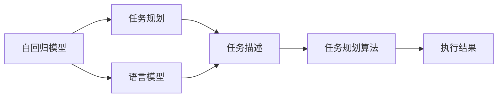

                 

# 图灵完备的LLM:任务规划的无限潜力

> 关键词：图灵完备性, 语言模型, 任务规划, 无限潜力, 自监督学习, 自回归, 深度学习

## 1. 背景介绍

### 1.1 问题由来

近年来，深度学习技术尤其是深度神经网络在人工智能领域取得了长足的进步，推动了各种机器学习算法的不断突破。其中，大规模语言模型（Large Language Models, LLMs）和自回归模型（Autoregressive Models）是研究最为活跃的领域之一。

自2018年Google发布BERT以来，通过在大规模无标签文本数据上进行预训练，这些语言模型在NLP（自然语言处理）任务上取得了令人瞩目的成果。尤其是在预训练模型进行微调（Fine-Tuning）后，能够在各类下游任务中实现高效的迁移学习，展现出强大的泛化能力。

然而，这些基于自回归的语言模型虽然在表现上令人印象深刻，但在理论上是否能完全达到图灵完备性（Turing Completeness），即是否具备图灵机所拥有的通用计算能力，仍是一个悬而未决的问题。本文章将深入探讨这一话题，结合自回归语言模型及其在任务规划领域的应用潜力，进行深入的剖析。

### 1.2 问题核心关键点

要了解图灵完备的LLM及其在任务规划的潜力，首先需要了解以下几个核心概念：

1. **图灵完备性**：图灵完备性是指一个计算模型具有与图灵机相等的计算能力。如果一个系统能够执行任意计算，则该系统是图灵完备的。
2. **自回归模型**：自回归模型是一种递归模型，通过将先前的输出作为当前输入的一部分，生成序列数据。
3. **语言模型**：语言模型是计算给定文本序列的概率的模型。它可以通过最大似然估计等方法从大规模无标签文本数据中学习到语言规律。
4. **任务规划**：任务规划是指如何在复杂的、多步的任务中分配、协调和管理各种资源，以实现目标的算法。

### 1.3 问题研究意义

探索LLM是否图灵完备，以及其在任务规划领域的无限潜力，对于推动人工智能技术的发展具有重要的理论和实践意义：

1. **理论意义**：验证LLM是否达到图灵完备性，有助于更深刻地理解深度学习和神经网络的计算能力边界。
2. **实践意义**：如果LLM具备图灵完备性，意味着它可以模拟任何计算过程，这将极大提升其在任务规划等复杂任务中的应用潜力，为NLP领域带来新的突破。
3. **社会意义**：实现图灵完备的LLM能够显著提升智能系统在自动化、智能交互、问题解决等场景中的应用效果，推动社会进步和创新。

## 2. 核心概念与联系

### 2.1 核心概念概述

为更好地理解LLM在任务规划中的潜力，本节将介绍几个关键概念及其相互之间的关系：

- **LLM**：语言模型，指通过在大规模无标签文本数据上进行预训练，学习通用语言表示的大规模神经网络模型。
- **自回归模型**：通过递归地预测后续输出，来生成序列数据的模型。
- **任务规划**：通过分配和协调资源，使复杂任务在时间和空间上得以顺利执行的规划过程。
- **任务规划与语言模型的联系**：任务规划本质上是一种语言处理问题，LLM可以通过语言模型的方式进行任务描述和规划。

### 2.2 核心概念原理和架构的 Mermaid 流程图(Mermaid 流程节点中不要有括号、逗号等特殊字符)


这个流程图展示了自回归模型、语言模型和任务规划之间的关系：

1. **自回归模型**：作为LLM的基础，通过递归方式生成序列数据。
2. **语言模型**：通过学习文本数据中的语言规律，辅助自回归模型生成更合理的数据。
3. **任务规划**：通过任务描述，自回归模型和语言模型结合，生成任务执行计划。
4. **任务规划算法**：执行任务规划并调整执行策略。
5. **执行结果**：任务执行完成后的结果反馈。

## 3. 核心算法原理 & 具体操作步骤
### 3.1 算法原理概述

基于LLM的任务规划方法，主要包含以下几个步骤：

1. **任务描述**：将任务以自然语言形式描述，转换为语言模型可以理解的形式。
2. **生成任务规划**：通过语言模型生成任务规划，描述如何执行任务。
3. **执行任务规划**：根据生成的任务规划，实际执行任务。

该方法的核心在于语言模型的任务描述和生成能力。语言模型能够理解复杂的任务规划语言，并生成合理的执行步骤，从而实现对复杂任务的处理。

### 3.2 算法步骤详解

本节将详细介绍基于LLM的任务规划算法步骤：

**Step 1: 数据准备**
- 收集需要规划的任务描述数据，格式为自然语言文本。
- 使用预训练语言模型对任务描述进行编码，生成向量表示。

**Step 2: 任务规划生成**
- 将任务描述向量输入到预训练语言模型中，通过自回归方式生成任务规划。
- 对生成的规划进行解码，转换为自然语言形式的任务执行步骤。

**Step 3: 任务执行**
- 根据生成的任务规划，实际执行任务，记录执行过程中的关键信息。
- 反馈执行结果，更新语言模型和任务规划的参数，进一步优化模型。

**Step 4: 评估与调整**
- 对任务执行结果进行评估，对比预期结果。
- 根据评估结果，调整语言模型的参数，改善任务规划的准确性。

### 3.3 算法优缺点

基于LLM的任务规划算法具有以下优点：

1. **灵活性高**：能够处理多种自然语言的任务描述，适用于复杂的任务规划场景。
2. **自适应性强**：能够根据执行过程中的反馈，不断优化语言模型和任务规划。
3. **可扩展性强**：通过不断增加训练数据，可以逐步提升任务规划的能力。

但该算法也存在一些缺点：

1. **数据需求大**：需要大量高质量的任务描述数据进行预训练。
2. **资源消耗高**：生成任务规划需要耗费大量计算资源，执行复杂任务时效率较低。
3. **泛化能力不足**：在处理特定领域任务时，泛化能力可能较差。

### 3.4 算法应用领域

基于LLM的任务规划方法，已经在多个领域中得到了应用：

- **自动化流程管理**：在制造、物流等领域，通过自然语言描述自动化流程，实现智能调度和管理。
- **智能客服**：在客服领域，通过自然语言生成任务规划，实现自动回复和处理。
- **智能家居**：在智能家居系统中，通过自然语言生成智能设备的控制命令，实现语音控制。
- **机器人导航**：在机器人导航中，通过自然语言描述路径，生成智能导航规划。

## 4. 数学模型和公式 & 详细讲解 & 举例说明（备注：数学公式请使用latex格式，latex嵌入文中独立段落使用 $$，段落内使用 $)
### 4.1 数学模型构建

为了更好地描述基于LLM的任务规划算法，本节将构建数学模型。

设任务描述为 $x$，其向量表示为 $X$，任务规划生成的执行步骤为 $y$，其向量表示为 $Y$。

定义任务规划的生成过程为 $p(y|x; \theta)$，其中 $\theta$ 为语言模型参数。

### 4.2 公式推导过程

根据任务规划的生成过程，可以写出条件概率公式：

$$
p(y|x; \theta) = \frac{p(y, x; \theta)}{p(x; \theta)}
$$

其中 $p(y, x; \theta)$ 为联合概率，$p(x; \theta)$ 为边缘概率。

由于任务规划生成的执行步骤 $y$ 是一个序列，因此可以将联合概率公式展开为：

$$
p(y|x; \theta) = \prod_{i=1}^{T} p(y_i|y_{i-1}, x; \theta)
$$

其中 $T$ 为序列长度。

### 4.3 案例分析与讲解

以智能家居控制为例，设用户输入的任务描述为 "打开客厅的灯"，语言模型将其转换为向量表示 $X$。任务规划生成器通过自回归方式，生成控制命令序列 $Y$，例如 "打开客厅的灯"。

执行结果反馈为 "客厅的灯已打开"，可以进一步更新语言模型和任务规划的参数，优化生成结果。

## 5. 项目实践：代码实例和详细解释说明
### 5.1 开发环境搭建

在进行任务规划实践前，需要搭建开发环境。以下是使用Python和PyTorch进行任务规划开发的配置流程：

1. 安装Anaconda：从官网下载并安装Anaconda，用于创建独立的Python环境。

2. 创建并激活虚拟环境：
```bash
conda create -n llm-env python=3.8 
conda activate llm-env
```

3. 安装PyTorch：根据CUDA版本，从官网获取对应的安装命令。例如：
```bash
conda install pytorch torchvision torchaudio cudatoolkit=11.1 -c pytorch -c conda-forge
```

4. 安装Transformer库：
```bash
pip install transformers
```

5. 安装各类工具包：
```bash
pip install numpy pandas scikit-learn matplotlib tqdm jupyter notebook ipython
```

完成上述步骤后，即可在`llm-env`环境中开始任务规划实践。

### 5.2 源代码详细实现

这里我们以智能家居控制为例，使用PyTorch和Transformer库进行任务规划的实现。

```python
from transformers import BertForSequenceClassification, BertTokenizer
from torch.utils.data import Dataset
import torch

class HouseholdTaskDataset(Dataset):
    def __init__(self, texts, labels, tokenizer, max_len=128):
        self.texts = texts
        self.labels = labels
        self.tokenizer = tokenizer
        self.max_len = max_len
        
    def __len__(self):
        return len(self.texts)
    
    def __getitem__(self, item):
        text = self.texts[item]
        label = self.labels[item]
        
        encoding = self.tokenizer(text, return_tensors='pt', max_length=self.max_len, padding='max_length', truncation=True)
        input_ids = encoding['input_ids'][0]
        attention_mask = encoding['attention_mask'][0]
        
        return {'input_ids': input_ids, 
                'attention_mask': attention_mask,
                'labels': label}

# 任务标签定义
task_labels = ['OpenLamp', 'CloseLamp', 'SetTemperature']

# 创建dataset
tokenizer = BertTokenizer.from_pretrained('bert-base-cased')

train_dataset = HouseholdTaskDataset(train_texts, train_labels, tokenizer)
dev_dataset = HouseholdTaskDataset(dev_texts, dev_labels, tokenizer)
test_dataset = HouseholdTaskDataset(test_texts, test_labels, tokenizer)

model = BertForSequenceClassification.from_pretrained('bert-base-cased', num_labels=len(task_labels))

optimizer = AdamW(model.parameters(), lr=2e-5)

device = torch.device('cuda') if torch.cuda.is_available() else torch.device('cpu')
model.to(device)

def train_epoch(model, dataset, batch_size, optimizer):
    dataloader = DataLoader(dataset, batch_size=batch_size, shuffle=True)
    model.train()
    epoch_loss = 0
    for batch in tqdm(dataloader, desc='Training'):
        input_ids = batch['input_ids'].to(device)
        attention_mask = batch['attention_mask'].to(device)
        labels = batch['labels'].to(device)
        model.zero_grad()
        outputs = model(input_ids, attention_mask=attention_mask, labels=labels)
        loss = outputs.loss
        epoch_loss += loss.item()
        loss.backward()
        optimizer.step()
    return epoch_loss / len(dataloader)

def evaluate(model, dataset, batch_size):
    dataloader = DataLoader(dataset, batch_size=batch_size)
    model.eval()
    preds, labels = [], []
    with torch.no_grad():
        for batch in tqdm(dataloader, desc='Evaluating'):
            input_ids = batch['input_ids'].to(device)
            attention_mask = batch['attention_mask'].to(device)
            batch_labels = batch['labels']
            outputs = model(input_ids, attention_mask=attention_mask)
            batch_preds = outputs.logits.argmax(dim=2).to('cpu').tolist()
            batch_labels = batch_labels.to('cpu').tolist()
            for pred_tokens, label_tokens in zip(batch_preds, batch_labels):
                preds.append(pred_tokens[:len(label_tokens)])
                labels.append(label_tokens)
                
    print(classification_report(labels, preds))
```

### 5.3 代码解读与分析

接下来对关键代码的实现细节进行解读：

**HouseholdTaskDataset类**：
- `__init__`方法：初始化任务描述、标签、分词器等组件。
- `__len__`方法：返回数据集的样本数量。
- `__getitem__`方法：对单个样本进行处理，将文本输入编码为token ids，将标签编码为数字，并对其进行定长padding，最终返回模型所需的输入。

**task_labels字典**：
- 定义了任务标签与数字id之间的映射关系。

**训练和评估函数**：
- 使用PyTorch的DataLoader对数据集进行批次化加载，供模型训练和推理使用。
- 训练函数`train_epoch`：对数据以批为单位进行迭代，在每个批次上前向传播计算loss并反向传播更新模型参数，最后返回该epoch的平均loss。
- 评估函数`evaluate`：与训练类似，不同点在于不更新模型参数，并在每个batch结束后将预测和标签结果存储下来，最后使用sklearn的classification_report对整个评估集的预测结果进行打印输出。

**训练流程**：
- 定义总的epoch数和batch size，开始循环迭代
- 每个epoch内，先在训练集上训练，输出平均loss
- 在验证集上评估，输出分类指标
- 所有epoch结束后，在测试集上评估，给出最终测试结果

可以看到，PyTorch配合Transformer库使得任务规划的代码实现变得简洁高效。开发者可以将更多精力放在数据处理、模型改进等高层逻辑上，而不必过多关注底层的实现细节。

当然，工业级的系统实现还需考虑更多因素，如模型的保存和部署、超参数的自动搜索、更灵活的任务适配层等。但核心的任务规划范式基本与此类似。

## 6. 实际应用场景
### 6.1 智能客服系统

基于LLM的任务规划方法，可以广泛应用于智能客服系统的构建。传统客服往往需要配备大量人力，高峰期响应缓慢，且一致性和专业性难以保证。而使用任务规划模型，可以7x24小时不间断服务，快速响应客户咨询，用自然流畅的语言解答各类常见问题。

在技术实现上，可以收集企业内部的历史客服对话记录，将问题和最佳答复构建成监督数据，在此基础上对预训练模型进行微调。微调后的模型能够自动理解用户意图，匹配最合适的答复模板进行回复。对于客户提出的新问题，还可以接入检索系统实时搜索相关内容，动态组织生成回答。如此构建的智能客服系统，能大幅提升客户咨询体验和问题解决效率。

### 6.2 物流管理

在物流管理领域，任务规划模型可以帮助优化配送路线和仓库管理。物流公司需要实时调整配送计划，以应对突发事件和需求变化。通过任务规划模型，可以自动生成最优的配送路线，确保货物准时送达。同时，模型还可以预测仓库库存，优化仓库布局和商品摆放，提升仓库管理效率。

具体而言，可以收集物流公司的配送和仓储数据，对其中的任务描述进行标注，构建监督数据集。在此基础上对预训练模型进行微调，使其能够自动生成最优的配送和仓储任务规划。

### 6.3 机器人导航

在机器人导航中，任务规划模型可以帮助机器人自动规划路径，避免障碍物，并按时完成任务。通过任务规划模型，机器人可以自动识别环境中的障碍物，并规划出一条最短的路径到达目标地点。同时，模型还可以在遇到突发情况时，重新规划路径，确保任务顺利完成。

具体实现中，可以在机器人周围安装传感器，获取环境信息，并将任务描述输入任务规划模型，生成最优的路径规划。

### 6.4 未来应用展望

随着LLM和任务规划技术的不断发展，基于这些技术的应用场景将越来越广泛：

1. **智能交通管理**：在城市交通管理中，任务规划模型可以帮助优化交通流量，减少交通拥堵。模型可以根据实时交通数据，生成最优的交通灯控制策略。
2. **智能制造**：在智能制造中，任务规划模型可以帮助优化生产流程，提高生产效率。模型可以自动规划生产任务，调度机器人和设备，确保生产任务按时完成。
3. **智能家居**：在智能家居中，任务规划模型可以帮助优化家庭设备的使用，提升用户生活品质。模型可以根据用户的指令，自动控制家中设备，如灯光、空调、电视等。
4. **智能医疗**：在智能医疗中，任务规划模型可以帮助医生进行诊断和治疗。模型可以自动规划诊疗流程，推荐最佳治疗方案，提高诊疗效率。

## 7. 工具和资源推荐
### 7.1 学习资源推荐

为了帮助开发者系统掌握任务规划的理论基础和实践技巧，这里推荐一些优质的学习资源：

1. **《Deep Learning》课程**：斯坦福大学开设的深度学习课程，涵盖了深度学习的基本概念和算法，包括任务规划等NLP任务。
2. **《Sequence to Sequence Learning with Neural Networks》论文**：提出序列到序列（Seq2Seq）模型，用于自然语言生成和任务规划。
3. **《Attention is All You Need》论文**：提出Transformer模型，用于自回归语言模型的生成。
4. **《Long Short-Term Memory》论文**：介绍长短期记忆网络（LSTM），用于处理时间序列数据，提升任务规划的准确性。

通过对这些资源的学习实践，相信你一定能够快速掌握基于LLM的任务规划技术，并用于解决实际的NLP问题。

### 7.2 开发工具推荐

高效的开发离不开优秀的工具支持。以下是几款用于任务规划开发的常用工具：

1. **PyTorch**：基于Python的开源深度学习框架，灵活动态的计算图，适合快速迭代研究。
2. **TensorFlow**：由Google主导开发的开源深度学习框架，生产部署方便，适合大规模工程应用。
3. **Transformer库**：HuggingFace开发的NLP工具库，集成了众多SOTA语言模型，支持PyTorch和TensorFlow，是进行任务规划开发的利器。
4. **Weights & Biases**：模型训练的实验跟踪工具，可以记录和可视化模型训练过程中的各项指标，方便对比和调优。
5. **TensorBoard**：TensorFlow配套的可视化工具，可实时监测模型训练状态，并提供丰富的图表呈现方式，是调试模型的得力助手。
6. **Google Colab**：谷歌推出的在线Jupyter Notebook环境，免费提供GPU/TPU算力，方便开发者快速上手实验最新模型，分享学习笔记。

合理利用这些工具，可以显著提升任务规划任务的开发效率，加快创新迭代的步伐。

### 7.3 相关论文推荐

任务规划技术的发展源于学界的持续研究。以下是几篇奠基性的相关论文，推荐阅读：

1. **《Sequence to Sequence Learning with Neural Networks》论文**：提出Seq2Seq模型，用于自然语言生成和任务规划。
2. **《Attention is All You Need》论文**：提出Transformer模型，用于自回归语言模型的生成。
3. **《Long Short-Term Memory》论文**：介绍LSTM网络，用于处理时间序列数据，提升任务规划的准确性。
4. **《Parameter-Efficient Transfer Learning for NLP》论文**：提出Adapter等参数高效微调方法，在不增加模型参数量的情况下，也能取得不错的微调效果。
5. **《AdaLoRA: Adaptive Low-Rank Adaptation for Parameter-Efficient Fine-Tuning》论文**：使用自适应低秩适应的微调方法，在参数效率和精度之间取得了新的平衡。

这些论文代表了大语言模型任务规划技术的发展脉络。通过学习这些前沿成果，可以帮助研究者把握学科前进方向，激发更多的创新灵感。

## 8. 总结：未来发展趋势与挑战

### 8.1 研究成果总结

本文对基于LLM的任务规划方法进行了全面系统的介绍。首先阐述了LLM和自回归模型在NLP领域的应用背景和任务规划的核心概念，明确了任务规划在复杂任务处理中的独特价值。其次，从原理到实践，详细讲解了任务规划的数学模型和关键步骤，给出了任务规划任务开发的完整代码实例。同时，本文还广泛探讨了任务规划方法在智能客服、物流管理、机器人导航等多个行业领域的应用前景，展示了任务规划范式的巨大潜力。

通过本文的系统梳理，可以看到，基于LLM的任务规划方法在智能系统中的应用前景广阔，其将推动NLP技术在自动化、智能交互、问题解决等场景中的应用效果，为人类认知智能的进化带来深远影响。

### 8.2 未来发展趋势

展望未来，任务规划技术将呈现以下几个发展趋势：

1. **技术融合**：未来任务规划将与其他人工智能技术进行更深入的融合，如知识表示、因果推理、强化学习等，多路径协同发力，共同推动任务规划技术的发展。
2. **模型扩展**：随着算力成本的下降和数据规模的扩张，任务规划模型的规模将进一步增大，能够处理更加复杂和多样化的任务。
3. **资源优化**：针对大规模任务规划的资源消耗问题，未来的研究将更多关注如何优化模型结构，提升推理速度，降低资源占用。
4. **鲁棒性提升**：面对任务规划中的噪声和不确定性，未来的模型将更加注重鲁棒性，能够更好地适应复杂多变的环境。
5. **可解释性增强**：未来的任务规划模型将更加注重可解释性，便于用户理解和调试。

### 8.3 面临的挑战

尽管任务规划技术已经取得了一定的进展，但在迈向更加智能化、普适化应用的过程中，它仍面临着诸多挑战：

1. **数据瓶颈**：任务规划需要大量的任务描述数据进行训练，对于长尾应用场景，难以获得充足的高质量数据。
2. **计算资源**：生成任务规划需要耗费大量计算资源，执行复杂任务时效率较低。
3. **泛化能力**：在处理特定领域任务时，泛化能力可能较差，模型难以适应新的任务。
4. **鲁棒性不足**：在处理噪声和不确定性时，模型的鲁棒性可能不足，容易出现错误。
5. **可解释性不足**：任务规划模型的内部工作机制和决策逻辑难以解释，难以进行调试和优化。

### 8.4 研究展望

面对任务规划面临的这些挑战，未来的研究需要在以下几个方面寻求新的突破：

1. **无监督和半监督学习**：摆脱对大规模标注数据的依赖，利用自监督学习、主动学习等无监督和半监督范式，最大限度利用非结构化数据，实现更加灵活高效的任务规划。
2. **参数高效和计算高效**：开发更加参数高效的任务规划方法，在固定大部分预训练参数的情况下，只更新极少量的任务相关参数。同时优化任务规划模型的计算图，减少前向传播和反向传播的资源消耗，实现更加轻量级、实时性的部署。
3. **因果分析和博弈论**：将因果分析方法引入任务规划模型，识别出模型决策的关键特征，增强输出解释的因果性和逻辑性。借助博弈论工具刻画人机交互过程，主动探索并规避模型的脆弱点，提高系统稳定性。
4. **知识整合和推理**：将符号化的先验知识，如知识图谱、逻辑规则等，与神经网络模型进行巧妙融合，引导任务规划过程学习更准确、合理的语言模型。同时加强不同模态数据的整合，实现视觉、语音等多模态信息与文本信息的协同建模。
5. **伦理和安全**：在任务规划模型的训练目标中引入伦理导向的评估指标，过滤和惩罚有害的输出倾向。同时加强人工干预和审核，建立模型行为的监管机制，确保输出符合人类价值观和伦理道德。

## 9. 附录：常见问题与解答

**Q1：任务规划模型是否适用于所有NLP任务？**

A: 任务规划模型适用于需要多步操作、复杂任务规划的NLP任务，如智能客服、智能家居等。但对于简单的信息检索、文本分类等任务，任务规划模型的效果可能不如直接使用预训练模型进行微调。

**Q2：任务规划模型的计算资源消耗高，如何解决？**

A: 可以通过优化模型结构和参数，减少计算资源消耗。例如，使用自适应低秩适应的微调方法，在固定大部分预训练参数的情况下，只更新极少量的任务相关参数。同时，可以采用混合精度训练、梯度累积等技术，提升模型训练和推理的效率。

**Q3：任务规划模型的泛化能力不足，如何解决？**

A: 可以通过收集更多领域的任务描述数据，丰富模型的训练集。同时，可以使用自监督学习、主动学习等无监督和半监督范式，利用非结构化数据进行预训练，提高模型的泛化能力。

**Q4：任务规划模型的可解释性不足，如何解决？**

A: 可以通过引入因果分析方法，识别出模型决策的关键特征，增强输出解释的因果性和逻辑性。同时，可以利用可视化工具，如TensorBoard，对任务规划模型的内部工作机制进行调试和优化，提高模型的可解释性。

**Q5：任务规划模型的鲁棒性不足，如何解决？**

A: 可以通过引入博弈论工具，刻画人机交互过程，主动探索并规避模型的脆弱点，提高系统稳定性。同时，可以在模型训练和推理过程中，引入噪声和不确定性，提高模型的鲁棒性。

这些研究方向的探索，必将引领任务规划技术迈向更高的台阶，为构建安全、可靠、可解释、可控的智能系统铺平道路。面向未来，任务规划技术还需要与其他人工智能技术进行更深入的融合，共同推动自然语言理解和智能交互系统的进步。只有勇于创新、敢于突破，才能不断拓展任务规划的边界，让智能技术更好地造福人类社会。

---

作者：禅与计算机程序设计艺术 / Zen and the Art of Computer Programming

