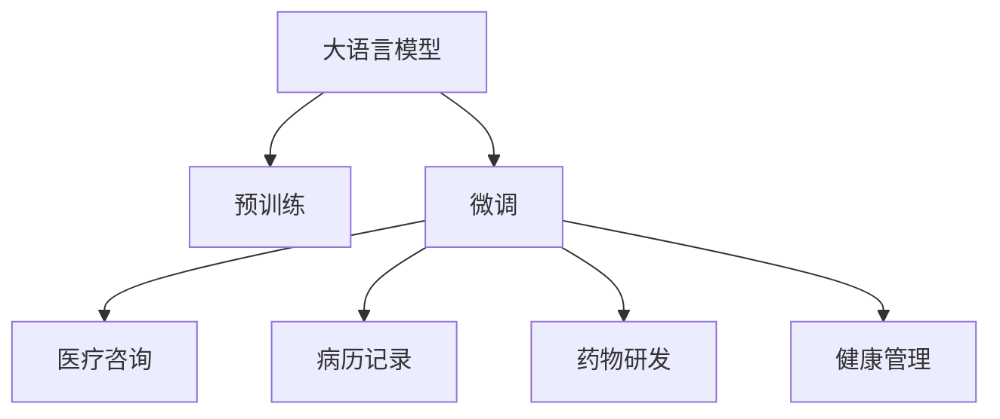

                 

# 在线医疗与 LLM：便捷、可及的医疗服务

## 1. 背景介绍

在医疗领域，传统线下诊疗面临诸多挑战：患者需长时间排队等待、医生资源分配不均、异地就医困难等问题长期困扰医疗体系。而疫情的全球蔓延进一步加剧了这些问题，推动了在线医疗服务的快速发展。

在线医疗（Telemedicine）是指通过互联网技术，提供远程医疗咨询、诊断和治疗的服务。其优势在于打破时间、空间限制，缓解医疗资源紧张，提升诊疗效率，满足个性化医疗需求，实现医疗服务的便捷化和可及化。

近年来，基于自然语言处理（NLP）技术的语言模型在医疗领域的应用引起了广泛关注。大语言模型（Large Language Models, LLMs）作为最先进的 NLP 技术之一，通过大规模预训练获取了丰富的语言知识，能够在医疗咨询、病历记录、药物研发等领域提供强大的支持，极大地提升了在线医疗服务的智能化和便捷化水平。

## 2. 核心概念与联系

### 2.1 核心概念概述

大语言模型是指通过大规模无标签文本数据预训练得到的复杂神经网络模型，如 GPT、BERT 等。这些模型具备强大的语言理解和生成能力，能够处理自然语言的语义、语法、语用等多维特征。

在医疗领域，大语言模型主要应用于以下几个方面：
- 医疗咨询与诊断：通过自然语言处理技术，大语言模型能够解析医生的描述，推荐相应的诊疗方案。
- 病历记录：自动生成病历文本，减少医生录入工作量，提高病历记录的准确性和完整性。
- 药物研发：通过文本挖掘和知识抽取，发现药物间的相互作用和潜在药效，加速药物研发进程。
- 健康管理：提供个性化健康建议，监测用户健康状况，提醒用药注意事项。

### 2.2 核心概念原理和架构的 Mermaid 流程图



这个流程图展示了 LLMs 在医疗领域的应用场景，通过预训练-微调范式，使得模型在不同医疗任务中表现出色。

## 3. 核心算法原理 & 具体操作步骤

### 3.1 算法原理概述

基于大语言模型（LLMs）的在线医疗服务通常包括以下几个关键步骤：

1. **预训练**：使用大规模无标签医疗文本数据对 LLM 进行预训练，学习通用的医疗语言表示。
2. **微调**：针对特定医疗任务，使用少量有标签数据对 LLM 进行微调，使其能够适应具体任务的需求。
3. **部署与应用**：将微调后的 LLM 部署到实际医疗应用中，提供在线诊疗、健康管理等智能化服务。

### 3.2 算法步骤详解

#### 预训练

**数据准备**：
- 收集大量医疗文本数据，如病历记录、医疗咨询记录、医学文献等。
- 清洗和标注数据，移除噪声和无用信息，保留关键医疗信息。

**模型选择与构建**：
- 选择如 BERT、GPT 等大语言模型，并使用 PyTorch、TensorFlow 等深度学习框架搭建模型。
- 设计合理的预训练任务，如语言建模、掩码预测等，训练 LLM 学习医疗语言的通用表示。

**模型训练**：
- 将预训练任务的数据集分为训练集和验证集，设置合适的学习率和迭代轮数。
- 使用梯度下降等优化算法更新模型参数，最小化损失函数。

#### 微调

**任务适配**：
- 根据具体医疗任务，设计相应的输出层和损失函数。
- 例如，医疗咨询任务可使用分类损失函数，病历记录任务可使用序列标注任务。

**微调数据准备**：
- 收集特定任务的标注数据，分为训练集、验证集和测试集。
- 标注数据需包括输入和对应的输出，如医疗咨询中的症状-诊断-治疗方案、病历记录中的文本-标签等。

**微调参数选择**：
- 设置合适的学习率和正则化参数，如权重衰减、Dropout 等。
- 选择参数高效微调方法，如 Adapter、LoRA 等，以减少计算成本和避免过拟合。

**微调过程**：
- 使用微调数据进行前向传播计算损失函数，反向传播更新模型参数。
- 周期性在验证集上评估模型性能，根据验证集性能调整学习率或停止训练。
- 在测试集上最终评估微调效果，完成模型部署。

### 3.3 算法优缺点

**优点**：
- **数据高效**：大语言模型可以在少量标注数据下获得良好的性能，有效降低标注成本。
- **泛化能力强**：预训练过程中学习到的大规模语言知识能够提升模型在新数据上的泛化能力。
- **灵活性高**：适用于多种医疗任务，如诊疗咨询、病历记录、药物研发等，具有较高的通用性。

**缺点**：
- **计算成本高**：预训练和微调过程需要消耗大量的计算资源，对硬件要求较高。
- **解释性不足**：大语言模型的决策过程缺乏透明性，难以对其推理过程进行解释和调试。
- **偏见问题**：预训练数据中可能包含偏见和错误信息，影响模型的公正性和准确性。

### 3.4 算法应用领域

大语言模型在医疗领域的应用主要涵盖以下几个方面：

- **智能咨询与诊断**：
  - **症状查询**：通过自然语言理解技术，解析患者的症状描述，推荐可能的病因和诊断方案。
  - **专家咨询**：引入医疗专家经验，对诊断结果进行审核和补充，提升诊疗质量。

- **病历自动记录**：
  - **病历摘要**：自动生成病历摘要，减少医生手动输入工作量，提高病历记录效率。
  - **病历实体抽取**：自动抽取病历中的关键实体信息，如症状、诊断、治疗等。

- **药物研发**：
  - **药物相互作用**：通过文本挖掘技术，发现药物间的相互作用，优化药物配方。
  - **新药发现**：从大规模文献中抽取潜在的药物信息，加速新药开发过程。

- **健康管理**：
  - **个性化建议**：根据用户的健康数据，提供个性化的健康建议和预警。
  - **饮食与运动**：自动生成个性化饮食和运动计划，提升用户健康水平。

## 4. 数学模型和公式 & 详细讲解 & 举例说明

### 4.1 数学模型构建

假设有一个医疗咨询任务，输入为患者的症状描述 $x$，输出为诊断结果 $y$，大语言模型 $M_{\theta}$ 的输出为 $\hat{y}$。设输入和输出的语义表示为 $f(x)$ 和 $g(y)$，定义交叉熵损失函数：

$$
\ell(M_{\theta}(x),y) = -[y\log \hat{y} + (1-y)\log (1-\hat{y})]
$$

### 4.2 公式推导过程

大语言模型的预训练过程通常使用自监督学习任务，如语言建模任务。假设预训练任务的数据集为 $\mathcal{D}$，模型参数为 $\theta$，预训练损失函数为 $\mathcal{L}^{\text{pre}}$，则预训练的目标为：

$$
\min_{\theta} \mathcal{L}^{\text{pre}} = \frac{1}{N} \sum_{(x,y)\in\mathcal{D}} \ell^{\text{pre}}(M_{\theta}(x),y)
$$

其中 $\ell^{\text{pre}}$ 为预训练任务中的损失函数，如掩码预测等。

微调过程的损失函数为 $\mathcal{L}^{\text{fin}}$，假设微调任务的数据集为 $\mathcal{D}_{\text{fin}}$，输出层为 $y$，则微调的目标为：

$$
\min_{\theta} \mathcal{L}^{\text{fin}} = \frac{1}{N} \sum_{(x,y)\in\mathcal{D}_{\text{fin}}} \ell^{\text{fin}}(M_{\theta}(x),y)
$$

其中 $\ell^{\text{fin}}$ 为微调任务中的损失函数，如分类损失等。

### 4.3 案例分析与讲解

以病历记录任务为例，假设病历文本 $x$ 包含多个实体，如姓名、年龄、症状、诊断等。模型需要学习这些实体的位置和类型，定义序列标注任务。设实体类型为 $y$，则微调损失函数为：

$$
\ell^{\text{fin}}(M_{\theta}(x),y) = -\sum_{i=1}^n [y_i\log \hat{y}_i + (1-y_i)\log (1-\hat{y}_i)]
$$

其中 $y_i$ 为真实标签，$\hat{y}_i$ 为模型预测的概率。

## 5. 项目实践：代码实例和详细解释说明

### 5.1 开发环境搭建

在医疗领域，大语言模型微调涉及复杂的 NLP 任务和数据处理，需要具备一定的技术栈和工具支持。以下是推荐的开发环境：

- **编程语言**：Python，使用 PyTorch、TensorFlow 等深度学习框架。
- **数据处理**：Pandas、Scikit-learn 等工具，用于数据清洗、标注等。
- **模型管理**：Weights & Biases、TensorBoard 等，用于模型训练监控和可视化。
- **云平台**：AWS、Google Cloud、阿里云等，提供 GPU/TPU 算力和数据存储服务。

### 5.2 源代码详细实现

以医疗咨询为例，展示如何使用 PyTorch 实现大语言模型微调。

**数据准备**：
- 收集医疗咨询数据，分为训练集和验证集。
- 清洗和标注数据，移除噪声和无用信息。

**模型选择与构建**：
- 选择 BERT 或 GPT 等大语言模型。
- 使用 PyTorch 搭建模型，并设置合适的超参数。

```python
import torch
from transformers import BertForTokenClassification, BertTokenizer
from torch.utils.data import DataLoader
from sklearn.metrics import accuracy_score

# 选择 BERT 模型和分词器
model = BertForTokenClassification.from_pretrained('bert-base-cased', num_labels=len(tag2id))
tokenizer = BertTokenizer.from_pretrained('bert-base-cased')

# 数据加载器
train_dataset = ...
dev_dataset = ...
test_dataset = ...

# 模型参数和优化器
device = torch.device('cuda' if torch.cuda.is_available() else 'cpu')
model.to(device)
optimizer = AdamW(model.parameters(), lr=2e-5)

# 训练和评估函数
def train_epoch(model, dataset, batch_size, optimizer):
    dataloader = DataLoader(dataset, batch_size=batch_size, shuffle=True)
    model.train()
    epoch_loss = 0
    for batch in dataloader:
        input_ids = batch['input_ids'].to(device)
        attention_mask = batch['attention_mask'].to(device)
        labels = batch['labels'].to(device)
        model.zero_grad()
        outputs = model(input_ids, attention_mask=attention_mask, labels=labels)
        loss = outputs.loss
        epoch_loss += loss.item()
        loss.backward()
        optimizer.step()
    return epoch_loss / len(dataloader)

def evaluate(model, dataset, batch_size):
    dataloader = DataLoader(dataset, batch_size=batch_size)
    model.eval()
    preds, labels = [], []
    with torch.no_grad():
        for batch in dataloader:
            input_ids = batch['input_ids'].to(device)
            attention_mask = batch['attention_mask'].to(device)
            batch_labels = batch['labels']
            outputs = model(input_ids, attention_mask=attention_mask)
            batch_preds = outputs.logits.argmax(dim=2).to('cpu').tolist()
            batch_labels = batch_labels.to('cpu').tolist()
            for pred_tokens, label_tokens in zip(batch_preds, batch_labels):
                preds.append(pred_tokens[:len(label_tokens)])
                labels.append(label_tokens)
    return accuracy_score(labels, preds)

# 训练过程
epochs = 5
batch_size = 16

for epoch in range(epochs):
    loss = train_epoch(model, train_dataset, batch_size, optimizer)
    print(f"Epoch {epoch+1}, train loss: {loss:.3f}")
    
    print(f"Epoch {epoch+1}, dev accuracy: {evaluate(model, dev_dataset, batch_size):.3f}")
    
print("Test accuracy:", evaluate(model, test_dataset, batch_size))
```

**模型微调**：
- 使用微调数据进行训练，记录训练过程中的损失和准确率。
- 根据验证集性能调整学习率，防止过拟合。
- 在测试集上最终评估模型性能，输出最终结果。

### 5.3 代码解读与分析

上述代码中，我们使用了 PyTorch 框架搭建了一个 BERT 模型，并通过医疗咨询数据集进行微调。

- **数据准备**：使用 BertTokenizer 分词器对输入文本进行分词，设置输入和标签的格式。
- **模型构建**：选择 BERT 模型，并将其迁移到 GPU/TPU 设备上。
- **训练和评估函数**：使用 AdamW 优化器更新模型参数，并在每个epoch结束后在验证集上进行评估。
- **测试集评估**：在测试集上最终评估模型的准确率。

通过这个示例，可以看出大语言模型微调的核心流程：模型选择、数据准备、模型训练和评估。

## 6. 实际应用场景

### 6.1 智能咨询与诊断

智能咨询与诊断是大语言模型在在线医疗中的重要应用场景之一。通过自然语言理解技术，模型能够解析患者的症状描述，生成初步诊断结果，并提供诊疗建议。

**应用场景**：
- **医生助理**：辅助医生进行初步诊断，快速了解患者的病情，减少医生的工作量。
- **在线问诊**：提供自动化的问诊服务，解答常见健康问题，缓解医疗资源紧张。

**技术实现**：
- **症状理解**：使用 BERT 等模型解析患者的症状描述，提取关键信息。
- **诊断建议**：基于患者症状和病历记录，生成可能的诊断方案。
- **专家审核**：引入医学专家审核诊断结果，确保诊断准确性。

### 6.2 病历自动记录

病历自动记录是大语言模型在医疗中的另一个重要应用场景。通过自动生成病历摘要和抽取关键实体信息，可以显著提升病历记录的效率和准确性。

**应用场景**：
- **病历生成**：自动生成病历摘要，减少医生的手工录入工作量。
- **实体抽取**：自动识别病历中的实体信息，如症状、诊断等。

**技术实现**：
- **摘要生成**：使用 Transformer 模型生成病历摘要，保留关键信息。
- **实体抽取**：使用序列标注模型识别病历中的实体类型和位置。

### 6.3 药物研发

大语言模型在药物研发中也具有重要应用。通过文本挖掘和知识抽取技术，可以从大规模文献中发现潜在的药物信息和相互作用，加速新药开发进程。

**应用场景**：
- **药物相互作用**：发现药物间的相互作用，优化药物配方。
- **新药发现**：从文献中抽取潜在的药物信息，加速新药研发。

**技术实现**：
- **药物实体抽取**：使用命名实体识别模型识别药物实体。
- **相互作用抽取**：使用关系抽取模型发现药物之间的相互作用关系。
- **知识图谱构建**：将药物和相互作用关系构建为知识图谱，便于后续分析和应用。

## 7. 工具和资源推荐

### 7.1 学习资源推荐

为了帮助开发者系统掌握大语言模型在医疗领域的应用，以下是一些优质的学习资源：

- **在线课程**：Coursera 上的“Deep Learning for Healthcare”课程，介绍深度学习在医疗中的应用，包括自然语言处理和图像识别。
- **书籍**：《Deep Learning for Health Care》一书，系统介绍了深度学习在医疗中的多方面应用，包括医疗图像分析、医疗文本分析等。
- **官方文档**：Transformers 库的官方文档，提供了丰富的预训练模型和微调样例，是入门和进阶的必备资料。

### 7.2 开发工具推荐

以下是一些用于大语言模型微调开发推荐的工具：

- **深度学习框架**：PyTorch、TensorFlow 等，支持大规模深度学习模型训练和推理。
- **自然语言处理工具**：NLTK、SpaCy 等，提供文本处理和语言分析功能。
- **模型训练监控工具**：Weights & Biases、TensorBoard 等，实时监控模型训练状态和性能。
- **云计算平台**：AWS、Google Cloud、阿里云等，提供高性能算力和数据存储服务。

### 7.3 相关论文推荐

大语言模型在医疗领域的应用是一个前沿研究方向，以下是一些相关论文推荐：

- **BERT 在医疗文本中的应用**：Investigation of BERT embeddings for clinical text classification，探索 BERT 在医疗文本分类中的表现。
- **大语言模型在药物发现中的应用**：Clinical Annotation to Train Large Language Models for Drug Discovery，介绍大语言模型在药物发现中的应用。
- **基于大语言模型的病历生成**：Large Language Models for Clinical Documentation，展示如何使用大语言模型自动生成病历摘要。

## 8. 总结：未来发展趋势与挑战

### 8.1 研究成果总结

大语言模型在医疗领域的应用已经取得了显著成果，主要体现在以下几个方面：
- **症状理解**：大语言模型能够解析患者的症状描述，生成初步诊断结果。
- **病历记录**：自动生成病历摘要和实体抽取，提升病历记录的效率和准确性。
- **药物研发**：文本挖掘和知识抽取技术，加速新药发现和药物相互作用发现。

### 8.2 未来发展趋势

未来，大语言模型在医疗领域的应用将呈现以下几个趋势：

1. **模型规模继续扩大**：随着算力成本的下降和数据量的增加，预训练语言模型的规模将进一步扩大，提升模型的语言表示能力。
2. **多模态融合**：将医疗图像、视频等多模态数据与文本数据结合，提升模型的综合诊断能力。
3. **个性化医疗**：根据患者的历史数据和实时监测数据，提供个性化的医疗建议和治疗方案。
4. **实时分析**：实时分析医疗数据，及时发现异常和风险，提高医疗服务的效率和质量。

### 8.3 面临的挑战

尽管大语言模型在医疗领域的应用前景广阔，但仍面临一些挑战：

1. **数据隐私与安全**：医疗数据的敏感性和隐私性要求高，如何在保护隐私的前提下使用医疗数据进行模型训练和应用是一个重要问题。
2. **模型鲁棒性**：大语言模型在面对噪声和异常数据时，可能出现鲁棒性不足的问题，影响诊断准确性。
3. **解释性与可解释性**：大语言模型的决策过程缺乏透明性，难以对其推理过程进行解释和调试，这对于医疗应用尤为重要。
4. **模型训练成本高**：大规模医疗数据集的标注和模型训练需要高昂的计算资源和时间成本，难以满足实际需求。

### 8.4 研究展望

未来，大语言模型在医疗领域的应用需要在以下几个方面进一步突破：

1. **隐私保护技术**：开发隐私保护技术，保护患者隐私，降低数据标注成本。
2. **鲁棒性提升**：研究鲁棒性技术，增强模型对噪声和异常数据的抵抗能力。
3. **可解释性增强**：引入可解释性技术，提升模型的透明性和可理解性。
4. **资源优化**：优化模型结构和训练过程，提高计算效率，降低训练成本。

总之，大语言模型在医疗领域的应用前景广阔，但仍需在隐私保护、鲁棒性、可解释性等方面进一步研究和突破，才能实现其大规模落地应用。

## 9. 附录：常见问题与解答

### 常见问题与解答

**Q1：大语言模型微调需要多少标注数据？**

A: 大语言模型微调通常需要的标注数据量较少，一般几百到几千条即可。但是，标注数据的质量和多样性对模型性能影响较大，应尽可能使用多样化、高质量的标注数据。

**Q2：大语言模型微调的学习率如何设置？**

A: 大语言模型微调的学习率一般比预训练时小1-2个数量级，通常从0.001开始调整。可以通过学习率调优技术（如warmup策略）逐步减小学习率，以避免过拟合。

**Q3：大语言模型在医疗中的应用有哪些？**

A: 大语言模型在医疗中的应用主要包括以下几个方面：
- 智能咨询与诊断：辅助医生进行初步诊断，解答常见健康问题。
- 病历自动记录：自动生成病历摘要和实体抽取，提升病历记录效率。
- 药物研发：文本挖掘和知识抽取，加速新药发现和药物相互作用发现。
- 健康管理：提供个性化健康建议和监测，提升用户体验。

**Q4：如何保证大语言模型的鲁棒性？**

A: 提高大语言模型的鲁棒性可以从以下几个方面入手：
- 数据增强：通过数据增强技术，扩充训练集，增强模型的泛化能力。
- 正则化：使用L2正则、Dropout等技术，防止模型过拟合。
- 对抗训练：引入对抗样本，增强模型对噪声和异常数据的抵抗能力。
- 模型融合：结合多个模型的输出，提升模型的鲁棒性。

**Q5：大语言模型在医疗数据隐私保护方面有哪些措施？**

A: 大语言模型在医疗数据隐私保护方面可以采取以下措施：
- 匿名化处理：使用数据匿名化技术，保护患者隐私。
- 联邦学习：在分布式环境下，使用联邦学习技术，保护数据隐私。
- 差分隐私：在数据处理过程中，引入差分隐私技术，保护个体隐私。
- 访问控制：对模型和数据访问进行严格的权限控制，防止未授权访问。

以上问题与解答展示了在实际应用中，大语言模型微调可能面临的常见问题及其解决方案，帮助开发者更好地应对挑战，提升模型性能。

---

作者：禅与计算机程序设计艺术 / Zen and the Art of Computer Programming

