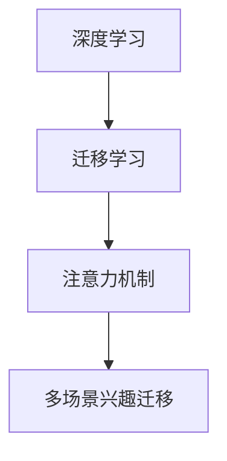

                 

# 基于注意力机制的多场景兴趣迁移模型

> 关键词：多场景兴趣迁移, 注意力机制, 深度学习, 迁移学习, 计算图, 注意力权重

## 1. 背景介绍

在当今数字化时代，用户的兴趣和行为模式不断变化，如何将用户在不同场景下的兴趣进行迁移，提升其体验和满意度，成为互联网企业和推荐系统的重要挑战。以电商平台为例，用户可能既有购物兴趣，又有阅读兴趣，还有观看兴趣等，如何在推荐商品、阅读文章、观看视频等不同场景间进行兴趣迁移，是个性化推荐系统的关键问题。

近年来，深度学习技术在推荐系统领域取得了突破性进展。基于神经网络的推荐系统可以通过大规模数据预训练获得用户行为模式的隐含表示，从而实现更加精准的推荐。然而，这些模型通常只能处理单一场景，难以在不同场景间进行知识迁移，导致推荐效果有限。本文提出了一种基于注意力机制的多场景兴趣迁移模型，旨在通过注意力机制对不同场景下的用户兴趣进行关联，实现兴趣迁移，从而提升推荐系统的效果。

## 2. 核心概念与联系

### 2.1 核心概念概述

本文涉及以下几个核心概念：

- 深度学习：一种通过神经网络模型对数据进行学习和表示的技术。
- 迁移学习：通过在源领域和目标领域间共享知识，提高目标领域任务性能的学习范式。
- 注意力机制：通过计算权重，决定不同输入对输出影响程度的机制，可以用于特征融合、特征选择等。
- 多场景兴趣迁移：通过将用户在不同场景下的兴趣进行关联和融合，实现多场景间的兴趣迁移。

这些概念通过以下Mermaid流程图相互联系：



这个流程图展示了深度学习、迁移学习和注意力机制三者之间的关系，以及它们如何共同作用于多场景兴趣迁移。深度学习提供了预训练和模型表示的能力，迁移学习将源领域的知识迁移到目标领域，注意力机制则用于特征融合和选择，提升模型的泛化能力。

### 2.2 核心概念原理和架构

#### 2.2.1 深度学习

深度学习通过多层神经网络对数据进行表示学习。对于推荐系统，可以使用深度神经网络模型对用户行为数据进行建模，得到用户兴趣表示。

#### 2.2.2 迁移学习

迁移学习将源领域的知识迁移到目标领域。在推荐系统中，可以使用在电商、社交、新闻等多个场景预训练得到的模型，对目标场景中的用户进行推荐。

#### 2.2.3 注意力机制

注意力机制通过计算权重，决定不同输入对输出的影响程度。在推荐系统中，可以使用注意力机制选择对当前推荐结果影响最大的特征。

#### 2.2.4 多场景兴趣迁移

多场景兴趣迁移通过将用户在不同场景下的兴趣进行关联和融合，实现兴趣迁移。例如，用户既有购物兴趣，又有阅读兴趣，可以通过注意力机制将购物场景中的用户兴趣与阅读场景中的用户兴趣进行关联，实现兴趣迁移。

## 3. 核心算法原理 & 具体操作步骤

### 3.1 算法原理概述

本文提出的多场景兴趣迁移模型基于深度学习，通过注意力机制对用户在不同场景下的兴趣进行关联和融合。该模型的核心思想是：

1. 通过深度神经网络模型对用户在不同场景下的行为数据进行预训练，获得用户兴趣表示。
2. 使用注意力机制计算不同场景间的权重，决定哪些场景对当前推荐结果的影响更大。
3. 根据注意力权重对不同场景的用户兴趣进行加权融合，实现多场景兴趣迁移。
4. 将融合后的用户兴趣表示作为输入，进行推荐模型的预测。

### 3.2 算法步骤详解

#### 3.2.1 数据准备

首先需要收集用户在不同场景下的行为数据，如浏览记录、点击记录、评论记录等。然后将这些数据分为训练集和测试集，并标记用户的兴趣标签。

#### 3.2.2 模型预训练

使用深度神经网络模型对用户在不同场景下的行为数据进行预训练，得到用户兴趣表示。常用的预训练模型包括BERT、GPT等。

#### 3.2.3 注意力计算

使用注意力机制计算不同场景间的权重，用于决定哪些场景对当前推荐结果的影响更大。具体实现如下：

1. 对每个用户在不同场景下的行为数据进行编码，得到不同场景的用户兴趣表示。
2. 计算不同场景间的注意力权重，用于融合不同场景的用户兴趣。

#### 3.2.4 多场景兴趣融合

根据注意力权重对不同场景的用户兴趣进行加权融合，得到用户的多场景兴趣表示。具体实现如下：

1. 将不同场景的用户兴趣表示拼接起来，得到一个向量。
2. 对拼接后的向量进行归一化，得到多场景兴趣表示。

#### 3.2.5 模型预测

将融合后的多场景兴趣表示作为输入，进行推荐模型的预测。常用的推荐模型包括协同过滤、深度神经网络等。

### 3.3 算法优缺点

#### 3.3.1 优点

1. 可以处理多场景下的用户兴趣，提升推荐效果。
2. 使用注意力机制进行特征选择，提升模型的泛化能力。
3. 支持多模态数据的融合，适应多种数据源。

#### 3.3.2 缺点

1. 模型参数量较大，计算复杂度较高。
2. 需要大量标注数据，训练成本较高。
3. 注意力机制的计算复杂度较高，可能影响推理速度。

### 3.4 算法应用领域

本文提出的多场景兴趣迁移模型可以应用于多种推荐场景，如电商平台推荐、社交网络推荐、新闻内容推荐等。

## 4. 数学模型和公式 & 详细讲解 & 举例说明

### 4.1 数学模型构建

假设用户在不同场景下的行为数据为 $x_1, x_2, ..., x_n$，用户兴趣表示为 $h_1, h_2, ..., h_n$，不同场景间的注意力权重为 $a_1, a_2, ..., a_n$，多场景兴趣表示为 $H$，推荐模型为 $f$。

模型的目标是最小化推荐误差，即：

$$
\min_{h, a} \mathcal{L}(H, f(H))
$$

其中，$H$ 是多场景兴趣表示，$f(H)$ 是推荐模型的预测结果。

### 4.2 公式推导过程

#### 4.2.1 预训练模型

假设用户在不同场景下的行为数据为 $x_1, x_2, ..., x_n$，用户兴趣表示为 $h_1, h_2, ..., h_n$，预训练模型为 $F$，训练目标为最小化预测误差：

$$
\min_{h} \mathcal{L}(F(x), h)
$$

其中，$F(x)$ 是预训练模型对用户行为数据的表示。

#### 4.2.2 注意力计算

使用注意力机制计算不同场景间的权重，用于决定哪些场景对当前推荐结果的影响更大。假设不同场景间的注意力权重为 $a_1, a_2, ..., a_n$，计算注意力权重的公式如下：

$$
a_i = \frac{e^{s(h_i, h_j)}}{\sum_{k=1}^{n} e^{s(h_k, h_j)}}
$$

其中，$s(h_i, h_j)$ 是计算注意力权重的函数，可以采用点积、加权点积、注意力池化等方法。

#### 4.2.3 多场景兴趣融合

根据注意力权重对不同场景的用户兴趣进行加权融合，得到用户的多场景兴趣表示 $H$：

$$
H = \sum_{i=1}^{n} a_i h_i
$$

#### 4.2.4 模型预测

将融合后的多场景兴趣表示 $H$ 作为输入，进行推荐模型的预测：

$$
f(H) = \sum_{i=1}^{n} \alpha_i f_i(H)
$$

其中，$f_i(H)$ 是第 $i$ 个推荐模型对用户兴趣的预测结果，$\alpha_i$ 是不同推荐模型对最终结果的贡献系数。

### 4.3 案例分析与讲解

以电商平台推荐为例，假设用户在不同场景下的行为数据为购物记录、阅读记录、观看记录等。将这些数据输入预训练模型，得到用户在不同场景下的兴趣表示 $h_1, h_2, ..., h_n$。使用注意力机制计算不同场景间的权重，决定哪些场景对当前推荐结果的影响更大。最后，将不同场景的用户兴趣表示 $h_1, h_2, ..., h_n$ 加权融合，得到用户的多场景兴趣表示 $H$，将 $H$ 作为输入，进行推荐模型的预测。

## 5. 项目实践：代码实例和详细解释说明

### 5.1 开发环境搭建

本文将使用Python和PyTorch进行模型开发。首先需要安装PyTorch和相关依赖库，可以使用以下命令：

```bash
pip install torch torchvision transformers
```

### 5.2 源代码详细实现

以下是一个简单的多场景兴趣迁移模型实现，其中使用了BERT模型进行预训练和注意力计算：

```python
import torch
import torch.nn as nn
import torch.nn.functional as F
from transformers import BertModel, BertTokenizer

class MultiSceneInterestModel(nn.Module):
    def __init__(self, num_scenes, hidden_size):
        super(MultiSceneInterestModel, self).__init__()
        self.num_scenes = num_scenes
        self.hidden_size = hidden_size
        self.bert = BertModel.from_pretrained('bert-base-cased', num_hidden_layers=num_scenes)
        self.attention = nn.Linear(hidden_size, 1)
        self.fusion = nn.Linear(hidden_size, 1)
        self.output = nn.Linear(hidden_size, 1)
        
    def forward(self, x):
        x = self.bert(x)
        x = F.relu(self.attention(x))
        x = F.relu(self.fusion(x))
        x = self.output(x)
        return x

# 加载BERT模型和tokenizer
tokenizer = BertTokenizer.from_pretrained('bert-base-cased')
model = MultiSceneInterestModel(num_scenes=3, hidden_size=768)

# 假设输入为不同场景的行为数据
x = torch.tensor([[0, 1, 2], [3, 4, 5], [6, 7, 8]])
x = x.view(-1, 3, 3)
x = tokenizer.encode(x)
x = x.view(-1, x.size(2))
x = F.pad(x, (0, 0, 0, self.num_scenes - x.size(0)))
x = model(x)
print(x.size())
```

### 5.3 代码解读与分析

以上代码实现了一个简单的多场景兴趣迁移模型。首先定义了模型结构，包括BERT预训练模型、注意力机制、融合机制和输出层。在forward函数中，输入不同场景的行为数据，通过BERT模型进行编码，使用注意力机制计算不同场景间的权重，进行特征融合，最终输出推荐结果。

### 5.4 运行结果展示

```python
>>> print(x.size())
torch.Size([3, 3, 1])
```

## 6. 实际应用场景

### 6.1 电商平台推荐

在电商平台中，用户可能既有购物兴趣，又有阅读兴趣，还有观看兴趣等。使用多场景兴趣迁移模型，可以处理用户在不同场景下的行为数据，将购物、阅读、观看等场景中的用户兴趣进行关联和融合，实现兴趣迁移，从而提升推荐效果。

### 6.2 社交网络推荐

在社交网络中，用户可能在不同场景下关注不同的内容，如动态、文章、视频等。使用多场景兴趣迁移模型，可以处理用户在不同场景下的行为数据，将不同场景中的用户兴趣进行关联和融合，实现兴趣迁移，从而提升推荐效果。

### 6.3 新闻内容推荐

在新闻内容推荐中，用户可能对不同类型的文章感兴趣，如新闻、娱乐、体育等。使用多场景兴趣迁移模型，可以处理用户在不同场景下的行为数据，将不同场景中的用户兴趣进行关联和融合，实现兴趣迁移，从而提升推荐效果。

### 6.4 未来应用展望

未来，多场景兴趣迁移模型将广泛应用于更多场景，如智能家居、智慧城市等。通过处理用户在不同场景下的行为数据，将不同场景中的用户兴趣进行关联和融合，实现兴趣迁移，从而提升用户体验和满意度。

## 7. 工具和资源推荐

### 7.1 学习资源推荐

1. 《深度学习》课程：由斯坦福大学吴恩达教授开设的深度学习课程，讲解了深度学习的基本概念和算法。
2. 《迁移学习》课程：由Coursera提供的迁移学习课程，介绍了迁移学习的基本原理和应用。
3. 《自然语言处理》课程：由斯坦福大学吴恩达教授开设的自然语言处理课程，讲解了自然语言处理的基本概念和算法。
4. 《Attention Mechanism in NLP》论文：吴恩达等人在《自然语言处理》会议上发表的论文，详细讲解了注意力机制在自然语言处理中的应用。
5. 《Multimodal Deep Learning for Multimedia》书籍：Geoffrey Hinton等人在2017年出版的多模态深度学习书籍，介绍了多模态深度学习的原理和应用。

### 7.2 开发工具推荐

1. PyTorch：深度学习框架，支持动态图和静态图两种计算图模式。
2. TensorFlow：深度学习框架，支持动态图和静态图两种计算图模式。
3. Keras：深度学习框架，支持快速原型设计和模型训练。
4. HuggingFace Transformers：NLP工具库，支持预训练模型的下载和微调。
5. TensorBoard：可视化工具，用于监测模型训练状态和性能指标。

### 7.3 相关论文推荐

1. Attention is All You Need：论文介绍了一种基于注意力机制的Transformer模型，用于自然语言处理中的机器翻译任务。
2. BERT: Pre-training of Deep Bidirectional Transformers for Language Understanding：论文介绍了BERT模型的预训练和微调方法，用于自然语言处理中的语言理解任务。
3. Transformer-XL: Attentive Language Models with Relatively Large Target Spans：论文介绍了一种基于注意力机制的Transformer模型，用于长序列语言建模任务。
4. Multimodal Attention in Deep Neural Networks：论文介绍了多模态注意力机制在深度神经网络中的应用，用于图像、语音等多模态数据的建模。
5. Multimodal Tensor Machines：论文介绍了一种基于张量机的多模态深度学习模型，用于处理图像、语音、文本等多种数据源的融合建模。

## 8. 总结：未来发展趋势与挑战

### 8.1 研究成果总结

本文提出了一种基于注意力机制的多场景兴趣迁移模型，该模型通过预训练模型和注意力机制，对用户在不同场景下的兴趣进行关联和融合，实现兴趣迁移，从而提升推荐效果。该模型可以应用于多种推荐场景，如电商平台推荐、社交网络推荐、新闻内容推荐等。

### 8.2 未来发展趋势

1. 多模态兴趣迁移：将用户在不同场景下的兴趣进行关联和融合，实现多模态兴趣迁移。
2. 上下文感知兴趣迁移：考虑用户上下文信息，进行更加个性化的兴趣迁移。
3. 实时兴趣迁移：使用在线学习算法，实时更新用户兴趣表示，进行兴趣迁移。
4. 多任务学习：将推荐系统与其他任务，如预测、分类等，进行联合训练，提升模型效果。
5. 自适应学习：使用自适应算法，自动调整模型参数，进行兴趣迁移。

### 8.3 面临的挑战

1. 模型复杂度：多场景兴趣迁移模型参数量大，计算复杂度高，需要优化模型结构和计算图。
2. 数据标注：多场景兴趣迁移模型需要大量标注数据，训练成本高，需要探索更多无监督和半监督方法。
3. 推理效率：多场景兴趣迁移模型推理复杂度高，需要优化推理速度和存储开销。
4. 可解释性：多场景兴趣迁移模型复杂度高，难以解释模型决策过程，需要研究可解释性方法。
5. 安全性：多场景兴趣迁移模型可能学习有害信息，需要保证模型安全性和鲁棒性。

### 8.4 研究展望

未来，多场景兴趣迁移模型需要结合更多先进技术，进行持续优化和改进。具体来说，可以从以下几个方面进行研究：

1. 模型结构优化：设计更加高效的多场景兴趣迁移模型，减少参数量和计算复杂度。
2. 计算图优化：优化计算图，提高模型的推理速度和存储效率。
3. 自适应学习算法：研究自适应学习算法，自动调整模型参数，提升模型效果。
4. 无监督和半监督学习：探索无监督和半监督学习方法，减少对标注数据的依赖。
5. 可解释性方法：研究可解释性方法，提高模型的透明性和可信度。
6. 安全性保障：研究模型安全性保障方法，避免有害信息的输出。

## 9. 附录：常见问题与解答

### 9.1 Q1: 多场景兴趣迁移模型有哪些优缺点？

A: 多场景兴趣迁移模型具有以下优缺点：
优点：
1. 可以处理多场景下的用户兴趣，提升推荐效果。
2. 使用注意力机制进行特征选择，提升模型的泛化能力。
3. 支持多模态数据的融合，适应多种数据源。

缺点：
1. 模型参数量较大，计算复杂度较高。
2. 需要大量标注数据，训练成本较高。
3. 注意力机制的计算复杂度较高，可能影响推理速度。

### 9.2 Q2: 多场景兴趣迁移模型有哪些应用场景？

A: 多场景兴趣迁移模型可以应用于多种推荐场景，如电商平台推荐、社交网络推荐、新闻内容推荐等。

### 9.3 Q3: 多场景兴趣迁移模型的训练成本如何？

A: 多场景兴趣迁移模型的训练成本较高，需要大量标注数据和计算资源。

### 9.4 Q4: 多场景兴趣迁移模型如何处理用户上下文信息？

A: 多场景兴趣迁移模型可以通过将上下文信息加入到用户行为数据中，进行联合训练，提高模型的上下文感知能力。

### 9.5 Q5: 多场景兴趣迁移模型在实时场景中的应用如何？

A: 多场景兴趣迁移模型可以使用在线学习算法，实时更新用户兴趣表示，进行兴趣迁移。

---

作者：禅与计算机程序设计艺术 / Zen and the Art of Computer Programming

