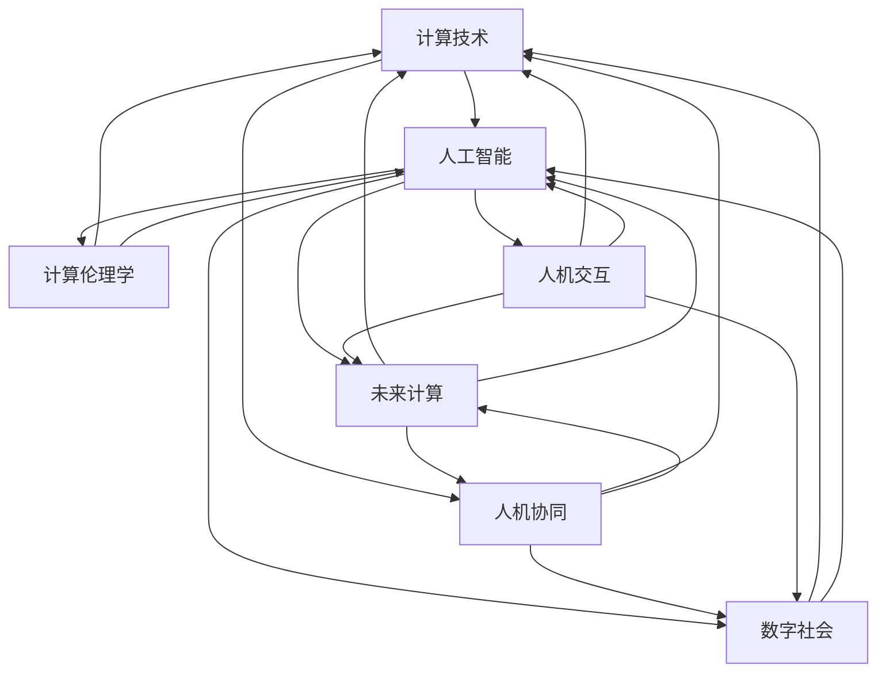

                 

# 塑造数字时代：人类计算的关键作用

> 关键词：
- 计算技术
- 人工智能
- 人机协同
- 未来计算
- 数字社会
- 计算伦理学
- 人机交互

## 1. 背景介绍

随着信息技术的飞速发展，数字时代已经到来。数字技术不仅改变了人类的工作方式和生活习惯，也正在重新定义社会的运行规则和发展方向。在这一过程中，计算技术扮演了关键角色，推动了社会的数字化转型。

计算技术的飞速发展，离不开人类智慧的贡献。从最早的机械计算器，到后来的电子计算机，再到今天的人工智能、大数据、云计算等前沿技术，每一项技术的突破都凝结了人类智慧的结晶。面对这一历史性变革，我们需要深刻理解人类计算的作用，探讨其在数字时代下的未来发展趋势与挑战。

## 2. 核心概念与联系

### 2.1 核心概念概述

为了更好地理解计算技术在数字时代的作用，本节将介绍几个关键概念：

- 计算技术(Computational Technology)：指通过算法和设备，实现数据处理、信息传输、逻辑推理等自动化过程的技术。
- 人工智能(Artificial Intelligence, AI)：利用计算技术模拟人类智能，实现自主学习、推理、决策等能力。
- 人机协同(Human-Machine Collaboration)：在计算技术的辅助下，人与机器协作完成任务，提升工作效率和效果。
- 未来计算(Future Computing)：指计算技术的未来发展趋势，包括量子计算、生物计算、边缘计算等前沿技术。
- 数字社会(Digital Society)：以信息技术为基础，高度依赖于计算技术的社会形态。
- 计算伦理学(Ethics of Computing)：研究计算技术在社会中的伦理影响和道德规范。
- 人机交互(Human-Computer Interaction, HCI)：研究人机之间的信息交互方式和技术手段，提升用户体验和交互效率。

这些核心概念之间存在着密切的联系，共同构成了数字时代的技术框架和社会形态。

### 2.2 核心概念原理和架构的 Mermaid 流程图



这个流程图展示了计算技术与其它核心概念之间的逻辑关系：

- 计算技术为人工智能提供了底层支持，使其具备自主学习、推理和决策的能力。
- 人工智能在人机协同中扮演重要角色，辅助人完成复杂任务，提升效率和效果。
- 未来计算预示了计算技术的未来发展方向，为人类带来了更多可能性。
- 数字社会高度依赖于计算技术，通过数字化手段改变人类生活的方方面面。
- 计算伦理学研究计算技术的社会影响，确保技术应用符合伦理道德。
- 人机交互研究人机信息交互方式，优化用户体验和交互效率。

## 3. 核心算法原理 & 具体操作步骤
### 3.1 算法原理概述

计算技术的核心算法包括各类数据处理、信息传输、逻辑推理等技术。这些算法通过硬件和软件相结合的方式，实现对数据的自动分析和处理。

以人工智能算法为例，其核心思想是通过大量数据训练模型，使其具备自主学习、推理和决策的能力。常见的算法包括监督学习、无监督学习、强化学习等，这些算法通过不同的方式处理数据，从而得到相应的输出结果。

### 3.2 算法步骤详解

以监督学习为例，其基本步骤包括数据收集、数据预处理、模型训练、模型评估和模型应用等环节：

1. **数据收集**：收集与问题相关的标注数据，用于训练模型。标注数据通常包括输入和输出两部分，如文本分类问题中的文本和标签。
2. **数据预处理**：对收集的数据进行清洗、转换、归一化等操作，确保数据的格式和质量一致。
3. **模型训练**：利用标注数据训练模型，通过反向传播算法更新模型参数，最小化损失函数。
4. **模型评估**：在验证集上评估模型性能，通过指标如准确率、召回率、F1-score等评估模型效果。
5. **模型应用**：将训练好的模型应用于新数据，预测输出结果。

### 3.3 算法优缺点

监督学习算法的优点包括：

- 简单易用：训练过程相对简单，易于理解和实现。
- 效果显著：在标注数据充足的情况下，可以获得较好的模型效果。
- 可解释性强：模型参数和决策过程可解释性强，便于理解和调试。

但其缺点也不容忽视：

- 依赖标注数据：算法需要大量的标注数据，标注成本较高。
- 过拟合风险：在数据量不足的情况下，容易发生过拟合，模型泛化性能差。
- 泛化能力不足：对于新数据，模型性能可能下降。

### 3.4 算法应用领域

监督学习算法在多个领域得到了广泛应用，如自然语言处理、计算机视觉、语音识别等。具体而言：

- 文本分类：如垃圾邮件过滤、情感分析等，通过分类算法对文本进行自动分类。
- 图像识别：如物体识别、人脸识别等，通过分类算法对图像进行分类。
- 语音识别：如语音转文本、语音合成等，通过分类算法对语音进行分析和处理。

## 4. 数学模型和公式 & 详细讲解 & 举例说明

### 4.1 数学模型构建

以线性回归为例，其数学模型为：

$$
y = \theta_0 + \theta_1 x_1 + \theta_2 x_2 + \cdots + \theta_n x_n
$$

其中，$y$ 为输出变量，$x_1, x_2, \cdots, x_n$ 为输入变量，$\theta_0, \theta_1, \cdots, \theta_n$ 为模型参数。

### 4.2 公式推导过程

假设我们有一组训练数据 $(x_i, y_i)$，其中 $x_i = [x_{i1}, x_{i2}, \cdots, x_{in}]$，$y_i$ 为真实标签。

根据最小二乘法，我们希望找到一组参数 $\theta$，使得所有样本的预测误差最小化。目标函数为：

$$
\min_{\theta} \sum_{i=1}^n (y_i - (\theta_0 + \theta_1 x_{i1} + \theta_2 x_{i2} + \cdots + \theta_n x_{in}))^2
$$

对该目标函数求导，并令导数为0，得到参数估计值为：

$$
\theta_j = \frac{\sum_{i=1}^n (y_i - \bar{y}) x_{ij}}{\sum_{i=1}^n x_{ij}^2}, \quad j = 0, 1, \cdots, n
$$

其中 $\bar{y} = \frac{1}{n} \sum_{i=1}^n y_i$ 为样本均值。

### 4.3 案例分析与讲解

以房价预测为例，我们使用线性回归模型对房价进行预测。假设我们有一组历史房价数据，包括房屋面积、地理位置、房间数量等特征，以及对应的房价标签。

我们可以使用线性回归模型对房价进行预测，通过训练模型，预测新房屋的价格。

## 5. 项目实践：代码实例和详细解释说明
### 5.1 开发环境搭建

为了进行项目实践，我们需要准备以下开发环境：

- 安装Python 3.x及以上版本。
- 安装NumPy、Pandas等数据处理库。
- 安装Scikit-Learn等机器学习库。
- 安装Jupyter Notebook或PyCharm等IDE。

### 5.2 源代码详细实现

以下是一个线性回归模型的Python代码实现：

```python
import numpy as np
from sklearn.linear_model import LinearRegression

# 准备数据
X = np.array([[1, 2, 3], [4, 5, 6], [7, 8, 9], [10, 11, 12]])
y = np.array([2, 4, 6, 8])

# 训练模型
model = LinearRegression()
model.fit(X, y)

# 预测新数据
new_X = np.array([[13, 14, 15]])
predicted_y = model.predict(new_X)
print(predicted_y)
```

### 5.3 代码解读与分析

以上代码实现了一个简单的线性回归模型。首先，我们准备了一组训练数据 $X$ 和对应的标签 $y$。然后，我们使用Scikit-Learn库中的LinearRegression模型训练模型，并在新数据上进行预测。

## 6. 实际应用场景

### 6.1 医疗诊断

在医疗领域，计算技术可以用于疾病诊断、医疗影像分析、药物研发等。通过大数据分析和人工智能算法，可以显著提升医疗诊断的准确性和效率。

例如，在疾病诊断中，利用机器学习算法对患者症状和历史数据进行分析，可以快速确定疾病类型，辅助医生制定治疗方案。在医疗影像分析中，通过图像识别算法对CT、MRI等影像数据进行分析，可以早期发现病变部位，提高诊断的准确性和及时性。

### 6.2 金融风控

在金融领域，计算技术可以用于信用评估、欺诈检测、投资决策等。通过大数据分析和人工智能算法，可以显著提升金融风控的准确性和效率。

例如，在信用评估中，利用机器学习算法对用户历史行为数据进行分析，可以评估用户的信用等级，降低贷款风险。在欺诈检测中，通过异常检测算法对交易数据进行分析，可以识别异常交易行为，防范欺诈风险。在投资决策中，通过量化模型对市场数据进行分析，可以预测市场趋势，优化投资组合。

### 6.3 智能制造

在制造业中，计算技术可以用于生产调度、设备维护、质量控制等。通过大数据分析和人工智能算法，可以显著提升生产效率和产品质量。

例如，在生产调度中，利用机器学习算法对生产数据进行分析，可以优化生产流程，提高生产效率。在设备维护中，通过预测性维护算法对设备数据进行分析，可以预测设备故障，减少停机时间。在质量控制中，通过图像识别算法对产品质量进行检测，可以发现产品缺陷，提升产品质量。

### 6.4 未来应用展望

未来，计算技术将继续深入应用到各个领域，带来更多创新和突破。以下是几个可能的未来应用方向：

- 量子计算：量子计算机可以在短时间内处理海量数据，为计算技术带来新的突破。
- 生物计算：利用生物工程技术，实现计算任务的量子化，提高计算效率。
- 边缘计算：将计算任务下放到设备端，实现本地计算，降低计算延迟。

## 7. 工具和资源推荐
### 7.1 学习资源推荐

为了学习计算技术的相关知识，以下是一些优质的学习资源：

- Coursera《机器学习》课程：斯坦福大学开设的机器学习课程，由Andrew Ng主讲，涵盖机器学习的基本概念和算法。
- Kaggle竞赛平台：全球最大的数据科学竞赛平台，通过参加竞赛可以提高机器学习实战能力。
- GitHub开源项目：GitHub上大量的开源项目，可以快速了解机器学习的实际应用。

### 7.2 开发工具推荐

以下是一些常用的开发工具，可以帮助开发者提高开发效率：

- Jupyter Notebook：用于数据处理和模型训练的IDE，支持多种编程语言和库。
- PyCharm：流行的Python IDE，支持代码编写、调试和测试。
- TensorFlow：由Google主导开发的深度学习框架，支持分布式计算和模型优化。
- PyTorch：由Facebook主导开发的深度学习框架，支持动态计算图和GPU加速。

### 7.3 相关论文推荐

以下是一些重要的计算技术相关的论文，推荐阅读：

- "Neural Network Models for Predicting Heart Disease"（Neural Network Model for Predicting Heart Disease）
- "Deep Learning for Healthcare Prediction and Diagnosis"
- "TensorFlow: A System for Large-Scale Machine Learning"（TensorFlow: A System for Large-Scale Machine Learning）

## 8. 总结：未来发展趋势与挑战
### 8.1 研究成果总结

在计算技术的研究中，取得了一系列重要的成果，包括：

- 线性回归、逻辑回归、决策树、支持向量机等机器学习算法。
- 深度学习算法，如卷积神经网络、循环神经网络、生成对抗网络等。
- 大数据分析技术，如Hadoop、Spark等。

### 8.2 未来发展趋势

未来，计算技术将继续发展，带来更多创新和突破：

- 更加高效的算法：通过算法优化和模型压缩，提高计算效率和效果。
- 更加多样化的应用场景：在医疗、金融、制造等更多领域中，应用计算技术，提升社会效率和质量。
- 更加智能的计算系统：通过人工智能算法，实现更精准的预测和决策，优化计算资源配置。

### 8.3 面临的挑战

计算技术的发展也面临着诸多挑战：

- 数据隐私和安全：如何在保证数据隐私和安全的前提下，实现高效的数据处理和分析。
- 算力成本：如何降低算力成本，提高计算资源的利用率。
- 计算伦理：如何确保计算技术的伦理规范，避免技术滥用。

### 8.4 研究展望

未来的研究需要在以下几个方向进行突破：

- 数据隐私保护技术：通过加密技术、联邦学习等手段，保护数据隐私和安全。
- 高效计算资源配置：通过云计算、边缘计算等手段，优化计算资源的配置和使用。
- 计算伦理规范：通过制定计算伦理标准，确保计算技术的公平和透明。

## 9. 附录：常见问题与解答

**Q1：计算技术在数字时代有哪些重要应用？**

A: 计算技术在数字时代的应用非常广泛，涵盖了医疗、金融、智能制造等多个领域。例如，在医疗领域，计算技术可以用于疾病诊断、医疗影像分析、药物研发等；在金融领域，可以用于信用评估、欺诈检测、投资决策等；在智能制造中，可以用于生产调度、设备维护、质量控制等。

**Q2：监督学习算法有哪些优缺点？**

A: 监督学习算法具有简单易用、效果显著和可解释性强等优点。但同时也存在依赖标注数据、过拟合风险和泛化能力不足等缺点。

**Q3：如何进行数据隐私保护？**

A: 数据隐私保护可以通过加密技术、联邦学习等手段实现。加密技术可以对数据进行加密，防止数据泄露；联邦学习可以在不传输原始数据的情况下，实现数据模型训练。

**Q4：如何提高计算效率？**

A: 提高计算效率可以通过算法优化、模型压缩、分布式计算等手段实现。算法优化可以改进算法效率，模型压缩可以减小模型大小，分布式计算可以并行处理大量数据。

**Q5：如何确保计算技术的伦理规范？**

A: 确保计算技术的伦理规范需要通过制定计算伦理标准、加强监管等方式实现。计算伦理标准可以指导计算技术的应用，确保其符合伦理规范；加强监管可以防止技术滥用，保障计算技术的公平和透明。

---

作者：禅与计算机程序设计艺术 / Zen and the Art of Computer Programming

